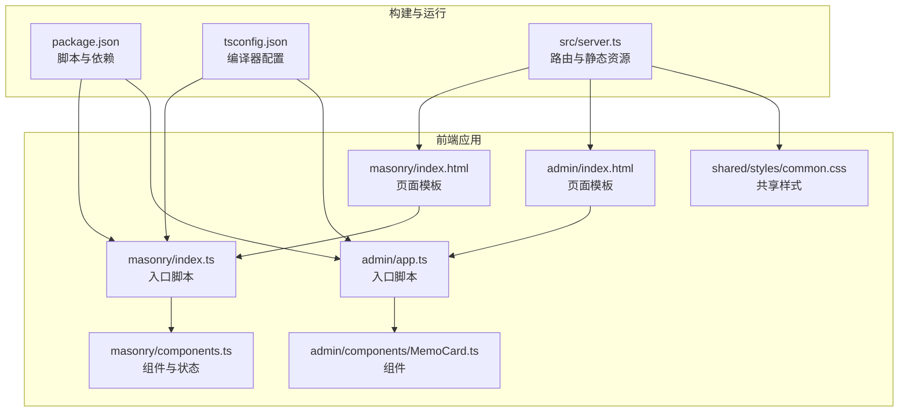
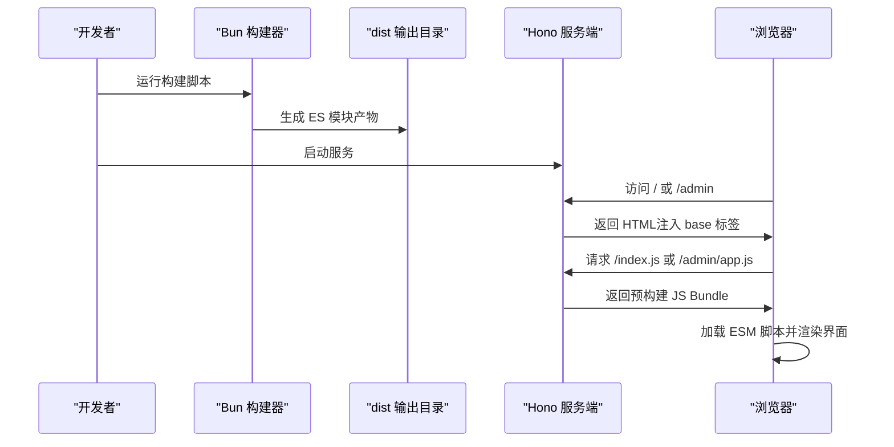
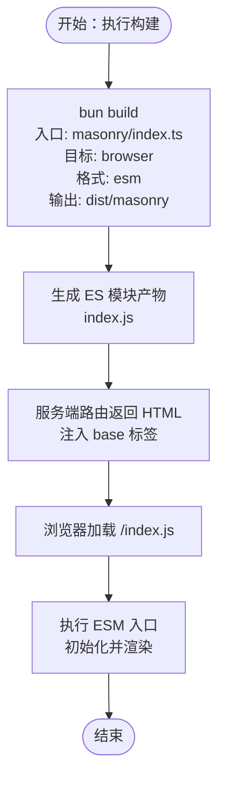
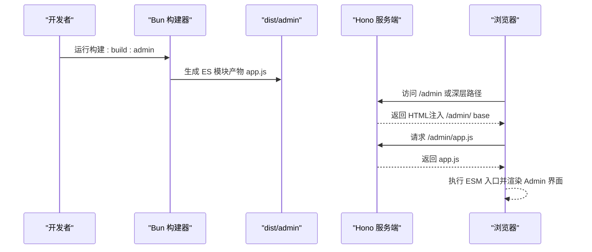
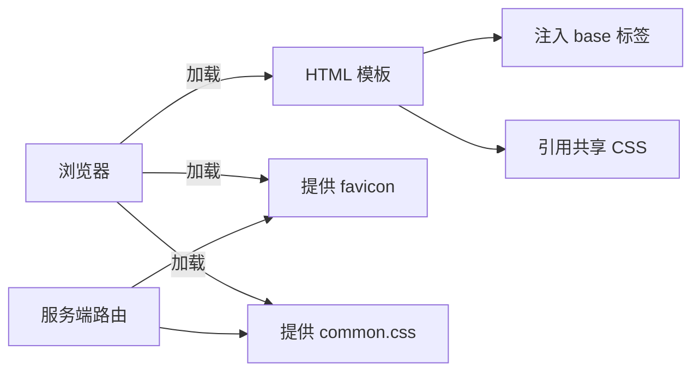
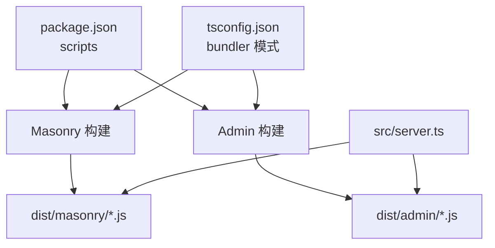

# 构建流程

<cite>
**本文引用的文件**
- [package.json](file://package.json)
- [tsconfig.json](file://tsconfig.json)
- [src/server.ts](file://src/server.ts)
- [src/frontend/masonry/index.html](file://src/frontend/masonry/index.html)
- [src/frontend/masonry/index.ts](file://src/frontend/masonry/index.ts)
- [src/frontend/masonry/components.ts](file://src/frontend/masonry/components.ts)
- [src/frontend/admin/index.html](file://src/frontend/admin/index.html)
- [src/frontend/admin/app.ts](file://src/frontend/admin/app.ts)
- [src/frontend/admin/components/MemoCard.ts](file://src/frontend/admin/components/MemoCard.ts)
- [src/frontend/shared/styles/common.css](file://src/frontend/shared/styles/common.css)
- [app.config.json](file://app.config.json)
- [.gitignore](file://.gitignore)
</cite>

## 目录
1. [简介](#简介)
2. [项目结构](#项目结构)
3. [核心组件](#核心组件)
4. [架构总览](#架构总览)
5. [详细组件分析](#详细组件分析)
6. [依赖关系分析](#依赖关系分析)
7. [性能考量](#性能考量)
8. [故障排查指南](#故障排查指南)
9. [结论](#结论)
10. [附录](#附录)

## 简介
本文件系统性说明 Memmos 项目的构建流程，重点围绕 Bun 构建工具的使用、前端应用（Masonry 界面与 Admin 管理界面）的独立构建、ESM 模块格式处理、静态资源打包策略、源码映射生成以及构建优化实践。目标是帮助开发者快速理解并高效维护构建体系。

## 项目结构
- 构建入口与脚本集中在包管理配置中，通过 Bun 的原生命令完成前端产物的预构建与发布。
- 前端采用 ESM 模块格式，HTML 作为页面模板，CSS 通过 link 引用共享样式。
- 服务端基于 Hono 提供路由与静态资源分发，按需注入 base 标签以适配深层路径。
- TypeScript 编译器配置为“bundler”模式，确保与 Bun 打包器协同工作。

**图表来源**
- [package.json:1-26](file://package.json#L1-L26)
- [tsconfig.json:1-30](file://tsconfig.json#L1-L30)
- [src/server.ts:1-137](file://src/server.ts#L1-L137)
- [src/frontend/masonry/index.html:1-427](file://src/frontend/masonry/index.html#L1-L427)
- [src/frontend/masonry/index.ts:1-23](file://src/frontend/masonry/index.ts#L1-L23)
- [src/frontend/masonry/components.ts:1-337](file://src/frontend/masonry/components.ts#L1-L337)
- [src/frontend/admin/index.html:1-1076](file://src/frontend/admin/index.html#L1-L1076)
- [src/frontend/admin/app.ts:1-251](file://src/frontend/admin/app.ts#L1-L251)
- [src/frontend/admin/components/MemoCard.ts:1-346](file://src/frontend/admin/components/MemoCard.ts#L1-L346)
- [src/frontend/shared/styles/common.css:1-277](file://src/frontend/shared/styles/common.css#L1-L277)

**章节来源**
- [package.json:1-26](file://package.json#L1-L26)
- [tsconfig.json:1-30](file://tsconfig.json#L1-L30)
- [src/server.ts:1-137](file://src/server.ts#L1-L137)

## 核心组件
- 构建脚本与命令
  - Masonry 独立构建：bun build 指定入口、输出目录、目标环境与模块格式。
  - Admin 独立构建：同上，分别针对各自入口文件。
  - 统一构建：串联执行两个子构建任务。
  - 启动：先构建再启动本地服务。
- TypeScript 编译器配置
  - 目标与模块：ESNext；模块解析：bundler；严格模式与跳过库检查等。
  - JSX：react-jsx；允许 JS；禁止 emit（由 Bun 打包器负责产出）。
- 服务端路由与静态资源
  - 静态资源：favicon、共享 CSS。
  - 动态路由：根据请求路径返回对应 HTML，并在深层路径注入 base 标签。
  - JS Bundle：按需读取 dist 下的预构建产物，缺失时返回提示。

**章节来源**
- [package.json:6-12](file://package.json#L6-L12)
- [tsconfig.json:2-28](file://tsconfig.json#L2-L28)
- [src/server.ts:15-36](file://src/server.ts#L15-L36)
- [src/server.ts:47-119](file://src/server.ts#L47-L119)

## 架构总览
下图展示从构建到运行的关键交互：Bun 构建器将 TS/JS 源码打包为 ESM，服务端路由根据请求路径返回 HTML 并加载对应的 JS Bundle，同时提供共享 CSS。

**图表来源**
- [package.json:8-11](file://package.json#L8-L11)
- [src/server.ts:59-119](file://src/server.ts#L59-L119)

## 详细组件分析

### Masonry 界面构建流程
- 入口与模板
  - HTML 模板定义基础结构与样式，通过 script type="module" 引入 ESM 入口。
  - TS 入口负责初始化状态、挂载根组件并触发数据加载。
- 构建命令
  - 目标：browser；格式：esm；输出：dist/masonry。
- 运行时加载
  - 服务端通过路由返回 HTML，并在深层路径注入 base 标签，保证静态资源与脚本路径解析正确。
  - 浏览器加载 /index.js 对应的预构建产物。

**图表来源**
- [package.json:8](file://package.json#L8)
- [src/frontend/masonry/index.html:426](file://src/frontend/masonry/index.html#L426)
- [src/frontend/masonry/index.ts:1-23](file://src/frontend/masonry/index.ts#L1-L23)
- [src/server.ts:98-102](file://src/server.ts#L98-L102)

**章节来源**
- [src/frontend/masonry/index.html:1-427](file://src/frontend/masonry/index.html#L1-L427)
- [src/frontend/masonry/index.ts:1-23](file://src/frontend/masonry/index.ts#L1-L23)
- [src/server.ts:98-102](file://src/server.ts#L98-L102)

### Admin 管理界面构建流程
- 入口与模板
  - HTML 模板包含全局样式与布局骨架，通过 script type="module" 引入 ESM 入口。
  - TS 入口负责认证检查、页面挂载与全局事件绑定。
- 构建命令
  - 目标：browser；格式：esm；输出：dist/admin。
- 运行时加载
  - 服务端提供 /admin* 路由与 SPA 回退，确保深层链接可用。
  - 浏览器加载 /admin/app.js 对应的预构建产物。

**图表来源**
- [package.json:9](file://package.json#L9)
- [src/frontend/admin/index.html:1-1076](file://src/frontend/admin/index.html#L1-L1076)
- [src/frontend/admin/app.ts:1-251](file://src/frontend/admin/app.ts#L1-L251)
- [src/server.ts:73-82](file://src/server.ts#L73-L82)
- [src/server.ts:112-119](file://src/server.ts#L112-L119)

**章节来源**
- [src/frontend/admin/index.html:1-1076](file://src/frontend/admin/index.html#L1-L1076)
- [src/frontend/admin/app.ts:1-251](file://src/frontend/admin/app.ts#L1-L251)
- [src/server.ts:73-82](file://src/server.ts#L73-L82)
- [src/server.ts:112-119](file://src/server.ts#L112-L119)

### ESM 模块格式与浏览器兼容性
- 模块格式
  - 构建目标为 browser 且格式为 esm，确保产物可直接被现代浏览器以模块方式加载。
- 动态导入
  - 项目未显式使用动态 import，但 Bun 构建器会保留模块化边界，便于后续按需拆分与懒加载。
- 浏览器兼容性
  - 通过 HTML 模板与服务端注入 base 标签，避免深层路径下的资源解析问题。
  - 共享 CSS 通过 link 引用，确保样式在不同页面复用。

**章节来源**
- [package.json:8-9](file://package.json#L8-L9)
- [src/frontend/masonry/index.html:426](file://src/frontend/masonry/index.html#L426)
- [src/frontend/admin/index.html:1-1076](file://src/frontend/admin/index.html#L1-L1076)
- [src/server.ts:22-28](file://src/server.ts#L22-L28)

### 静态资源处理策略
- HTML
  - 服务端通过 serveHtml 方法读取模板并注入 base 标签，确保脚本与资源路径在深层路由下正确解析。
- CSS
  - 共享样式通过 /frontend/shared/styles/common.css 提供，Masonry 与 Admin 均可复用。
- 图片与图标
  - favicon 通过 /favicon.svg 与 /admin/favicon.svg 提供，服务端直接读取静态文件。

**图表来源**
- [src/server.ts:15-36](file://src/server.ts#L15-L36)
- [src/server.ts:47-110](file://src/server.ts#L47-L110)
- [src/frontend/masonry/index.html:4](file://src/frontend/masonry/index.html#L4)
- [src/frontend/admin/index.html:4](file://src/frontend/admin/index.html#L4)
- [src/frontend/shared/styles/common.css:1-277](file://src/frontend/shared/styles/common.css#L1-L277)

**章节来源**
- [src/server.ts:15-36](file://src/server.ts#L15-L36)
- [src/server.ts:47-110](file://src/server.ts#L47-L110)

### 源码映射生成
- 开发环境
  - 使用 dev 脚本进行热更新开发，未见显式 source map 参数，通常由 Bun 的开发模式自动处理。
- 生产环境
  - 当前构建脚本未指定 source map 生成参数，建议在需要调试生产问题时增加相应选项以平衡体积与可观测性。
- 配置建议
  - 可在 Bun 构建命令中加入 source map 相关参数，或在服务端对 JS 与 CSS 提供独立映射文件（如需）。

**章节来源**
- [package.json:7](file://package.json#L7)
- [package.json:8-11](file://package.json#L8-L11)

## 依赖关系分析
- 构建脚本依赖
  - package.json 中的 scripts 定义了构建与启动流程，分别调用 Bun 构建器。
- 类型与运行时
  - tsconfig.json 将 moduleResolution 设为 bundler，配合 verbatimModuleSyntax 与 noEmit，确保打包器接管产物生成。
- 服务端耦合点
  - 服务端路由依赖 dist 目录中的预构建产物；若产物不存在则返回提示信息，避免 404。

**图表来源**
- [package.json:6-12](file://package.json#L6-L12)
- [tsconfig.json:11-15](file://tsconfig.json#L11-L15)
- [src/server.ts:59-119](file://src/server.ts#L59-L119)

**章节来源**
- [package.json:6-12](file://package.json#L6-L12)
- [tsconfig.json:11-15](file://tsconfig.json#L11-L15)
- [src/server.ts:59-119](file://src/server.ts#L59-L119)

## 性能考量
- 代码分割
  - 当前构建为单入口直出，未见动态 import 或拆分策略。可在后续迭代中引入按需加载与路由级拆分，减少首屏体积。
- Tree Shaking
  - 由于使用 ESM 与 bundler 模式，打包器可基于静态分析进行摇树优化；保持纯函数与无副作用模块有助于进一步瘦身。
- 压缩与体积控制
  - 建议在生产构建中启用压缩与最小化（如可用），并结合 gzip/br 传输优化。
- 资源缓存
  - 服务端可为静态资源设置合适的缓存头；对 JS/CSS 可采用内容哈希命名策略（如后续扩展）。

## 故障排查指南
- 构建产物缺失
  - 现象：访问 /index.js 或 /admin/app.js 返回提示“请先运行构建”。
  - 处理：执行对应构建脚本后再启动服务。
- 深层路径资源解析失败
  - 现象：进入 /admin/ 后静态资源或脚本 404。
  - 处理：确认服务端已注入 base 标签；检查 dist 目录是否存在对应产物。
- favicon 未显示
  - 现象：浏览器标签页未显示图标。
  - 处理：确认 /favicon.svg 与 /admin/favicon.svg 路由正常；检查文件存在性与 MIME 类型。

**章节来源**
- [src/server.ts:60-71](file://src/server.ts#L60-L71)
- [src/server.ts:84-96](file://src/server.ts#L84-L96)
- [src/server.ts:47-57](file://src/server.ts#L47-L57)

## 结论
Memmos 的构建体系以 Bun 为核心，采用 ESM 模块格式与“bundler”模式的 TypeScript 配置，实现了 Masonry 与 Admin 的独立构建与统一发布。服务端通过路由与 base 标签保障了深层路径下的资源解析一致性。未来可在保持现有简洁性的基础上，逐步引入按需加载、更细粒度的代码分割与压缩策略，以进一步提升性能与可维护性。

## 附录
- 构建命令速查
  - 构建 Masonry：bun run build:masonry
  - 构建 Admin：bun run build:admin
  - 统一构建：bun run build
  - 启动服务：bun run start
- 关键配置参考
  - TypeScript：moduleResolution=bundler、verbatimModuleSyntax=true、noEmit=true
  - 服务端：静态资源路由、SPA 回退、base 标签注入

**章节来源**
- [package.json:6-12](file://package.json#L6-L12)
- [tsconfig.json:11-15](file://tsconfig.json#L11-L15)
- [src/server.ts:15-36](file://src/server.ts#L15-L36)
- [src/server.ts:98-119](file://src/server.ts#L98-L119)