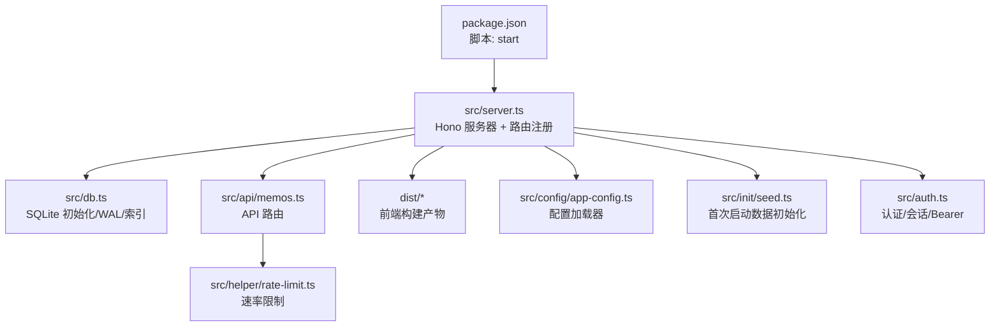
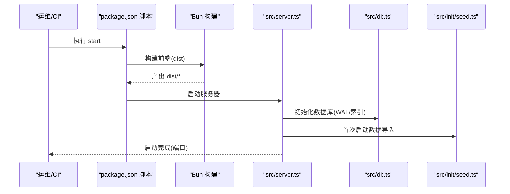
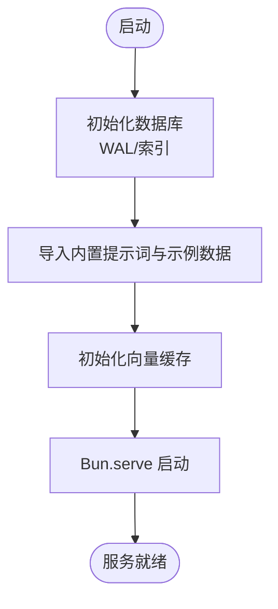
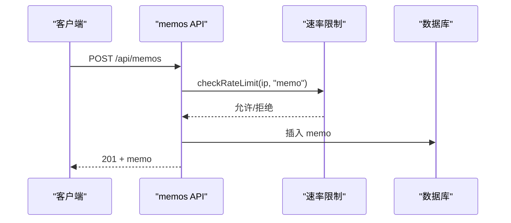
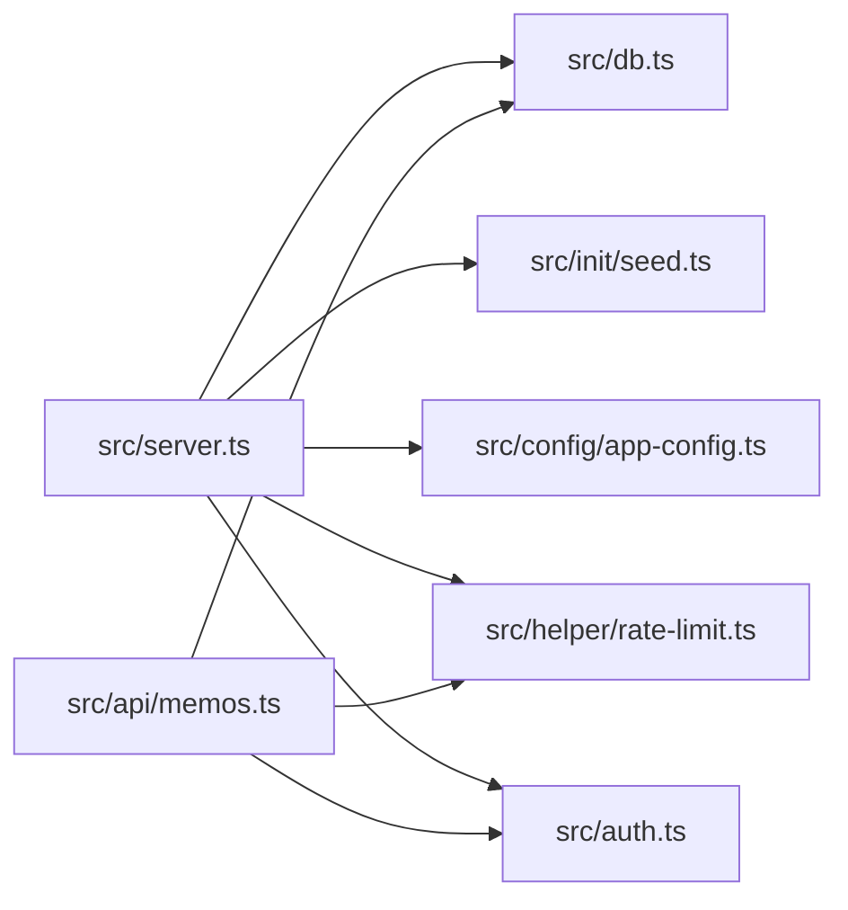

# 生产部署

<cite>
**本文引用的文件**
- [package.json](file://package.json)
- [src/server.ts](file://src/server.ts)
- [src/db.ts](file://src/db.ts)
- [src/api/memos.ts](file://src/api/memos.ts)
- [src/auth.ts](file://src/auth.ts)
- [src/config/app-config.ts](file://src/config/app-config.ts)
- [src/helper/rate-limit.ts](file://src/helper/rate-limit.ts)
- [src/init/seed.ts](file://src/init/seed.ts)
- [memocli.ts](file://memocli.ts)
- [README.md](file://README.md)
- [app.config.json](file://app.config.json)
</cite>

## 目录
1. [简介](#简介)
2. [项目结构](#项目结构)
3. [核心组件](#核心组件)
4. [架构总览](#架构总览)
5. [详细组件分析](#详细组件分析)
6. [依赖关系分析](#依赖关系分析)
7. [性能考虑](#性能考虑)
8. [故障排查指南](#故障排查指南)
9. [结论](#结论)
10. [附录](#附录)

## 简介
本指南面向生产部署 Memos 项目，覆盖以下主题：
- 服务器启动流程与 start 命令执行顺序
- Hono 服务器的生产配置（端口、静态文件、路由）
- SQLite 在生产环境的部署注意事项（权限、备份、性能）
- 环境变量管理（敏感信息保护、配置文件组织）
- PM2/Docker 容器化部署方案（进程管理、健康检查）
- Nginx 反向代理（静态资源缓存、HTTPS）

## 项目结构
- 服务入口：Bun 运行时 + Hono 服务器，统一在主入口中初始化数据库、注册路由、启动 HTTP 服务。
- 前端产物：构建后输出至 dist 目录，运行时通过静态文件路由提供。
- 数据层：SQLite（bun:sqlite），WAL 模式，自动初始化表结构与索引。
- 配置层：app.config.json 与内存缓存的配置加载器，支持环境变量覆盖。
- 认证与速率限制：Cookie + 内存会话 + Bearer Token；速率限制支持小时/天双窗口。

图表来源
- [package.json:11](file://package.json#L11)
- [src/server.ts:1-137](file://src/server.ts#L1-L137)
- [src/db.ts:1-484](file://src/db.ts#L1-L484)
- [src/api/memos.ts:1-220](file://src/api/memos.ts#L1-L220)
- [src/config/app-config.ts:1-108](file://src/config/app-config.ts#L1-L108)
- [src/helper/rate-limit.ts:1-153](file://src/helper/rate-limit.ts#L1-L153)
- [src/init/seed.ts:1-118](file://src/init/seed.ts#L1-L118)
- [src/auth.ts:1-128](file://src/auth.ts#L1-L128)

章节来源
- [README.md:25-46](file://README.md#L25-L46)
- [package.json:6-12](file://package.json#L6-L12)
- [src/server.ts:11-137](file://src/server.ts#L11-L137)

## 核心组件
- 服务器启动与路由
  - 端口：从环境变量读取，缺省 3020。
  - 静态文件：favicon、CSS、构建后的 JS 产物。
  - SPA 路由：首页与管理后台的 HTML 注入 base 标签以适配子路径。
  - NotFound：对 /admin/* 的深层链接回退到 SPA。
- 数据库
  - 自动初始化 memos、memo_embeddings、prompts、creative 表及索引。
  - WAL 模式、外键约束开启。
- 配置
  - app.config.json 与内存缓存，支持环境变量覆盖。
- 认证与速率限制
  - 支持 Cookie 会话与 Bearer Token；速率限制按小时/天双窗口。
- 首次启动
  - 若提示词表为空则导入内置提示词；若 memos 表为空则导入示例数据。

章节来源
- [src/server.ts:11-137](file://src/server.ts#L11-L137)
- [src/db.ts:15-61](file://src/db.ts#L15-L61)
- [src/config/app-config.ts:57-107](file://src/config/app-config.ts#L57-L107)
- [src/helper/rate-limit.ts:27-39](file://src/helper/rate-limit.ts#L27-L39)
- [src/init/seed.ts:16-117](file://src/init/seed.ts#L16-L117)

## 架构总览
下图展示生产启动的关键流程：构建前端 → 初始化数据库与种子数据 → 初始化向量缓存 → 启动 HTTP 服务。

图表来源
- [package.json:10-11](file://package.json#L10-L11)
- [src/server.ts:121-129](file://src/server.ts#L121-L129)
- [src/db.ts:15-61](file://src/db.ts#L15-L61)
- [src/init/seed.ts:113-117](file://src/init/seed.ts#L113-L117)

## 详细组件分析

### 服务器启动与 Hono 生产配置
- 端口设置
  - 从环境变量读取，缺省 3020。
- 静态文件服务
  - favicon.svg（根与 /admin）。
  - 构建产物：/admin/app.js、/index.js。
  - 共享样式：common.css。
- 路由与 SPA 回退
  - / 与 /index.html → 首页瀑布流。
  - /admin 与 /admin/ → 管理后台 SPA。
  - /admin/* 深度链接回退到 /admin/index.html。
- 初始化流程
  - 初始化数据库 → 种子数据 → 向量缓存 → 启动 HTTP 服务。

图表来源
- [src/server.ts:121-129](file://src/server.ts#L121-L129)
- [src/db.ts:15-61](file://src/db.ts#L15-L61)
- [src/init/seed.ts:113-117](file://src/init/seed.ts#L113-L117)

章节来源
- [src/server.ts:11-137](file://src/server.ts#L11-L137)

### SQLite 生产部署要点
- 文件位置与权限
  - 数据库存放于工作目录下的 memos.db，建议将其迁移到专用数据目录并设置只读或受限写权限，避免被意外覆盖。
- WAL 模式与并发
  - 已启用 WAL 模式，适合高并发读写场景；注意磁盘 IO 与 fsync 行为。
- 外键约束
  - 已开启外键约束，确保数据一致性。
- 索引
  - 对 pinned_at 建有索引，提升置顶排序与查询性能。
- 备份策略
  - 建议定期导出数据库（如使用 SQLite dump）并进行异地备份；生产环境建议使用只读快照或冷备份。
- 性能调优
  - 调整 SQLite PRAGMA（如 cache_size、synchronous、journal_size_limit）以匹配硬件与负载；监控慢查询与锁等待。
  - 对高频查询（如按标签、全文检索）结合现有索引与 SQL 结构进行优化。

章节来源
- [src/db.ts:8-13](file://src/db.ts#L8-L13)
- [src/db.ts:30](file://src/db.ts#L30)
- [src/db.ts:15-61](file://src/db.ts#L15-L61)

### 环境变量与配置管理
- 关键环境变量
  - PORT：服务器监听端口（缺省 3020）。
  - MEMOS_SECRET_KEY：管理员密钥，用于 Bearer Token 认证。
  - 速率限制相关：支持通过环境变量覆盖 app.config.json 中 rateLimit 的各项阈值。
- 配置加载优先级
  - 环境变量 > app.config.json > 硬编码默认值。
- 敏感信息保护
  - 将密钥与敏感配置放入受控的环境变量或机密管理服务，避免提交到版本库。
- 配置文件组织
  - app.config.json 作为可选配置源，便于非二进制部署场景的参数化。

章节来源
- [README.md:59-65](file://README.md#L59-L65)
- [src/auth.ts:42-46](file://src/auth.ts#L42-L46)
- [src/helper/rate-limit.ts:27-39](file://src/helper/rate-limit.ts#L27-L39)
- [src/config/app-config.ts:57-107](file://src/config/app-config.ts#L57-L107)
- [app.config.json:1-22](file://app.config.json#L1-L22)

### API 与速率限制
- 认证
  - 支持 Cookie 会话与 Bearer Token；登录失败有冷却机制。
- 速率限制
  - 按 IP 维度，memo 与 ai 两类，小时/天双窗口；支持通过环境变量覆盖。
- 备忘录 API
  - 支持分页、搜索（LIKE）、标签筛选；创建时异步生成嵌入向量。

图表来源
- [src/api/memos.ts:104-144](file://src/api/memos.ts#L104-L144)
- [src/helper/rate-limit.ts:77-110](file://src/helper/rate-limit.ts#L77-L110)
- [src/db.ts:198-212](file://src/db.ts#L198-L212)

章节来源
- [src/auth.ts:111-127](file://src/auth.ts#L111-L127)
- [src/helper/rate-limit.ts:1-153](file://src/helper/rate-limit.ts#L1-L153)
- [src/api/memos.ts:1-220](file://src/api/memos.ts#L1-L220)

### 命令行工具与生产集成
- memocli
  - 通过环境变量 MEMOS_API_URL 与 MEMOS_SECRET_KEY 调用 API。
  - 支持创建公开/私有备忘录、设置标签。
- 建议
  - 在 CI/CD 中使用该工具进行自动化备忘录创建与验证。

章节来源
- [memocli.ts:6-9](file://memocli.ts#L6-L9)
- [memocli.ts:97-101](file://memocli.ts#L97-L101)
- [memocli.ts:118-126](file://memocli.ts#L118-L126)

## 依赖关系分析
- 组件耦合
  - server.ts 依赖 db.ts、init/seed.ts、config/app-config.ts、helper/rate-limit.ts、auth.ts。
  - API 层（memos.ts）依赖 db.ts、auth.ts、rate-limit.ts。
- 外部依赖
  - Hono 作为 Web 框架；bun:sqlite 作为数据库驱动。
- 潜在风险
  - 内存会话不跨进程持久化，不适合多实例部署；建议使用共享会话存储或仅使用 Bearer Token。

图表来源
- [src/server.ts:1-137](file://src/server.ts#L1-L137)
- [src/api/memos.ts:1-220](file://src/api/memos.ts#L1-L220)

章节来源
- [src/server.ts:1-137](file://src/server.ts#L1-L137)
- [src/api/memos.ts:1-220](file://src/api/memos.ts#L1-L220)

## 性能考虑
- 数据库
  - 使用 WAL 模式提升并发读性能；根据负载调整 PRAGMA（如 cache_size、synchronous）。
  - 对高频查询建立合适索引，避免全表扫描。
- 前端构建
  - 生产环境务必先执行构建脚本，确保 /admin/app.js 与 /index.js 存在。
- 速率限制
  - 合理设置小时/天阈值，避免误伤正常用户；必要时引入分布式缓存（如 Redis）以支持多实例。
- 静态资源
  - 使用 CDN 或反向代理缓存静态文件，减少服务器压力。

[本节为通用指导，无需列出章节来源]

## 故障排查指南
- 无法访问 /admin 或 404
  - 确认已执行构建脚本，dist 目录存在对应 JS 文件。
- 401 未授权
  - 检查 MEMOS_SECRET_KEY 是否正确设置；确认请求头携带 Bearer Token。
- 429 速率限制
  - 检查速率限制阈值与当前 IP 的计数；必要时提高阈值或使用更宽松的策略。
- 数据库异常
  - 检查 memos.db 文件权限与磁盘空间；确认 WAL 文件未被清理。
- 首次启动无数据
  - 确认 seed 流程是否执行；检查内置提示词与示例数据文件是否存在。

章节来源
- [src/server.ts:60-71](file://src/server.ts#L60-L71)
- [src/server.ts:84-96](file://src/server.ts#L84-L96)
- [memocli.ts:97-101](file://memocli.ts#L97-L101)
- [src/helper/rate-limit.ts:142-152](file://src/helper/rate-limit.ts#L142-L152)
- [src/init/seed.ts:16-61](file://src/init/seed.ts#L16-L61)

## 结论
- 生产部署建议：先构建前端，再启动服务；严格管理环境变量与配置；对 SQLite 进行权限与备份加固；使用反向代理与 CDN 提升稳定性与性能。
- 多实例部署：由于内存会话不跨进程，建议仅使用 Bearer Token 认证，或引入共享会话存储。

[本节为总结性内容，无需列出章节来源]

## 附录

### A. 生产部署清单
- 环境变量
  - 设置 PORT、MEMOS_SECRET_KEY；必要时设置速率限制阈值。
- 文件与权限
  - 将 memos.db 放置于安全目录，设置最小权限；保留备份。
- 构建与启动
  - 先执行构建脚本，再执行 start；确保 dist 目录存在。
- 反向代理
  - 配置静态资源缓存与 HTTPS；将 /api 前缀转发至服务端口。

[本节为通用指导，无需列出章节来源]

### B. PM2 部署要点
- 启动命令
  - 使用 pm2 start 以守护进程方式运行 start 脚本。
- 进程管理
  - 启用自动重启、日志轮转；监控内存与 CPU。
- 健康检查
  - 配置 HTTP GET /api/auth/check 作为存活探针；设置超时与重试。

[本节为通用指导，无需列出章节来源]

### C. Docker 容器化要点
- 镜像与卷
  - 将构建产物与配置放入镜像；将数据卷挂载到数据库文件所在目录。
- 环境变量
  - 通过 docker run -e 或 compose 的 environment 注入。
- 健康检查
  - 使用相同的 /api/auth/check 健康检查。
- 端口映射
  - 映射容器内 PORT 至宿主机端口。

[本节为通用指导，无需列出章节来源]

### D. Nginx 反向代理配置要点
- 静态资源缓存
  - 对 /admin/app.js、/index.js、/frontend/* 设置长缓存与 ETag。
- 路由转发
  - 将 /api 前缀转发至服务端口；/admin 与 / 交由前端 SPA 处理。
- HTTPS
  - 配置 SSL 证书与强制 HTTPS；开启 HSTS。
- 缓存与压缩
  - 启用 gzip/br 压缩；合理设置缓存控制头。

[本节为通用指导，无需列出章节来源]