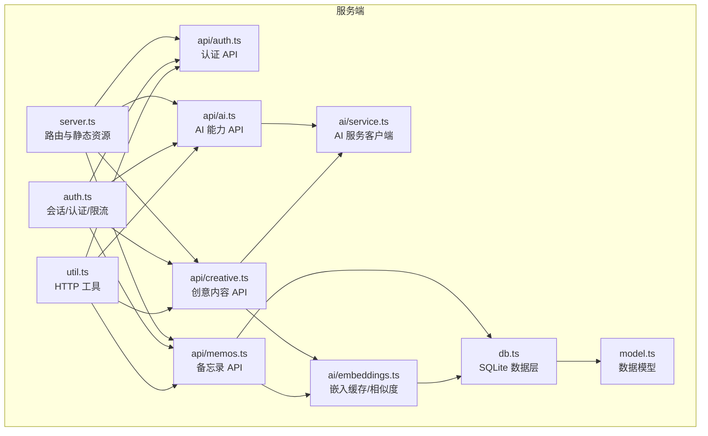
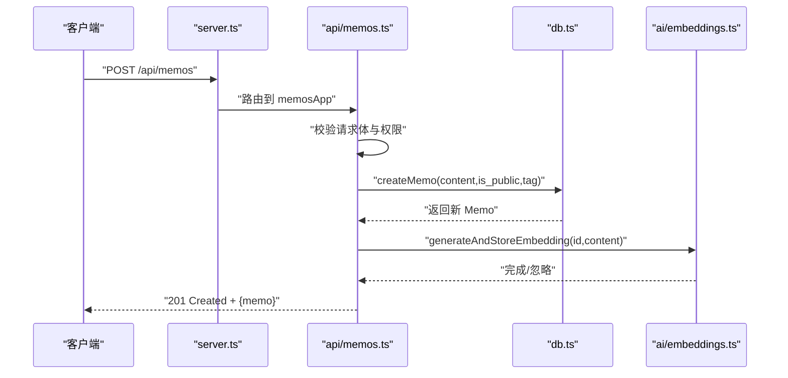
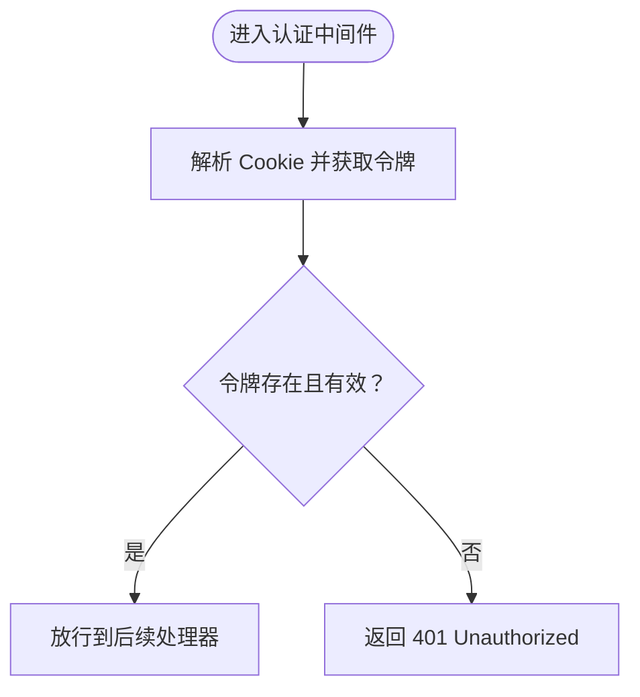
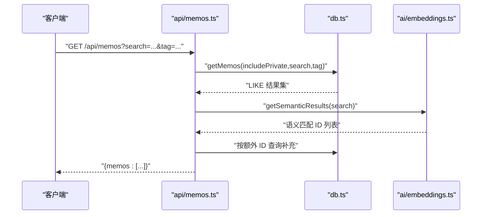
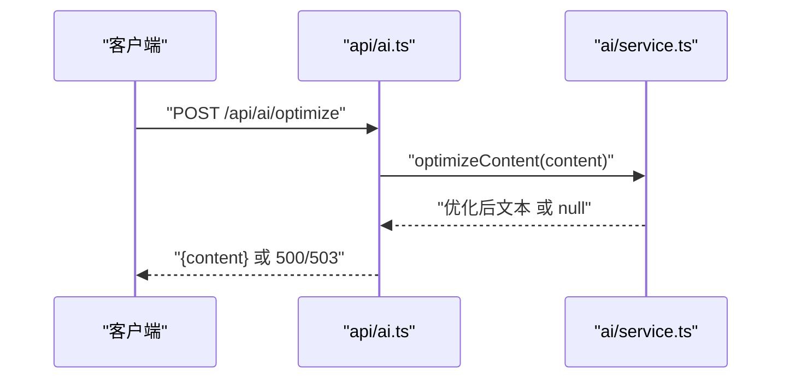
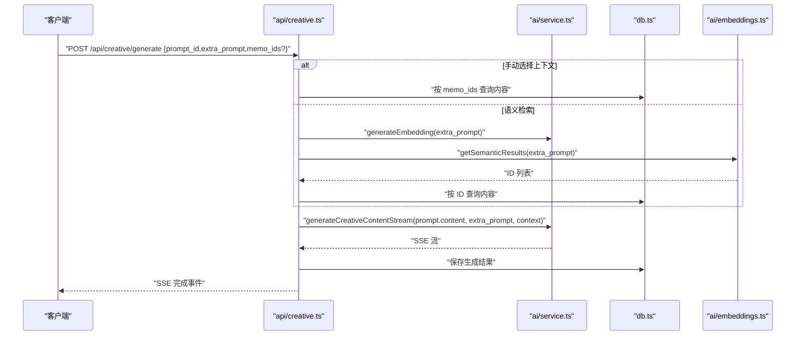
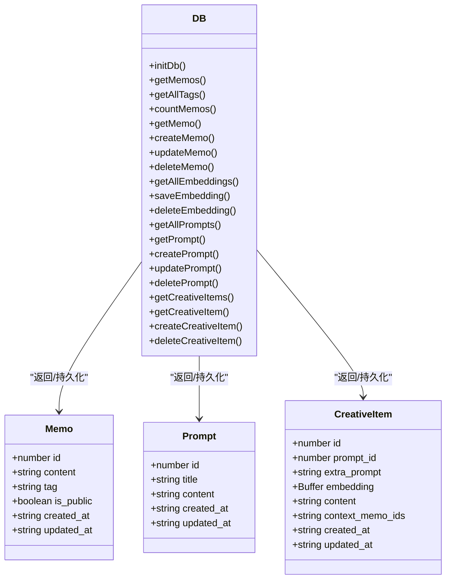
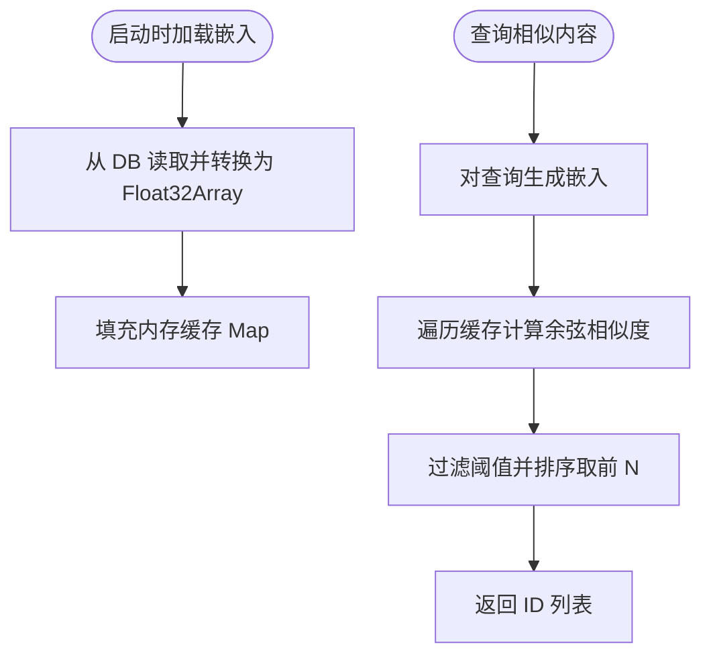
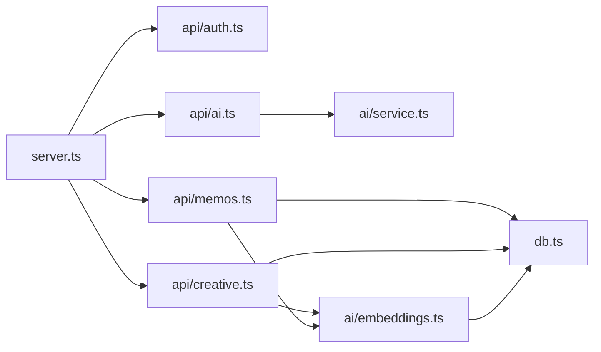

# 测试策略

<cite>
**本文引用的文件**
- [README.md](file://README.md)
- [package.json](file://package.json)
- [tsconfig.json](file://tsconfig.json)
- [src/server.ts](file://src/server.ts)
- [src/db.ts](file://src/db.ts)
- [src/model.ts](file://src/model.ts)
- [src/auth.ts](file://src/auth.ts)
- [src/util.ts](file://src/util.ts)
- [src/api/auth.ts](file://src/api/auth.ts)
- [src/api/memos.ts](file://src/api/memos.ts)
- [src/api/ai.ts](file://src/api/ai.ts)
- [src/api/creative.ts](file://src/api/creative.ts)
- [src/ai/embeddings.ts](file://src/ai/embeddings.ts)
- [src/ai/service.ts](file://src/ai/service.ts)
- [script/initMemos.ts](file://script/initMemos.ts)
</cite>

## 目录
1. [引言](#引言)
2. [项目结构](#项目结构)
3. [核心组件](#核心组件)
4. [架构总览](#架构总览)
5. [详细组件分析](#详细组件分析)
6. [依赖关系分析](#依赖关系分析)
7. [性能与压力测试](#性能与压力测试)
8. [测试用例编写指南与最佳实践](#测试用例编写指南与最佳实践)
9. [测试数据管理与模拟策略](#测试数据管理与模拟策略)
10. [API 接口测试方法与工具](#api-接口测试方法与工具)
11. [数据库与事务测试指导](#数据库与事务测试指导)
12. [前端组件测试策略](#前端组件测试策略)
13. [自动化测试与持续集成](#自动化测试与持续集成)
14. [故障排查指南](#故障排查指南)
15. [结论](#结论)

## 引言
本测试策略面向 memos 项目，覆盖单元测试、集成测试与端到端测试的实施方法，提供测试用例编写指南、测试数据管理与模拟策略、API 接口测试方法与工具、数据库与事务测试指导、前端组件测试策略、测试覆盖率与质量标准、自动化测试与持续集成配置，以及性能与压力测试指导。目标是在保证功能正确性的前提下，提升系统的稳定性与可维护性。

## 项目结构
- 服务端基于 Hono 框架，通过路由子应用组织 API（认证、备忘录、AI、创意内容），并提供静态页面与客户端转译。
- 数据层使用 SQLite（bun:sqlite），WAL 模式；模型定义在 model.ts 中；数据库初始化与 CRUD 在 db.ts 中。
- 认证模块基于内存会话与 Cookie，提供中间件与速率限制。
- AI 能力通过外部服务（DeepSeek、DashScope）实现内容优化、标签建议、语义嵌入与创意内容生成。
- 提供脚本用于批量初始化测试数据。

**图表来源**
- [src/server.ts:1-127](file://src/server.ts#L1-L127)
- [src/api/auth.ts:1-77](file://src/api/auth.ts#L1-L77)
- [src/api/memos.ts:1-139](file://src/api/memos.ts#L1-L139)
- [src/api/ai.ts:1-67](file://src/api/ai.ts#L1-L67)
- [src/api/creative.ts:1-238](file://src/api/creative.ts#L1-L238)
- [src/ai/embeddings.ts:1-99](file://src/ai/embeddings.ts#L1-L99)
- [src/ai/service.ts:1-289](file://src/ai/service.ts#L1-L289)
- [src/db.ts:1-349](file://src/db.ts#L1-L349)
- [src/model.ts:1-28](file://src/model.ts#L1-L28)
- [src/auth.ts:1-111](file://src/auth.ts#L1-L111)
- [src/util.ts:1-43](file://src/util.ts#L1-L43)

**章节来源**
- [README.md:25-45](file://README.md#L25-L45)
- [src/server.ts:74-127](file://src/server.ts#L74-L127)

## 核心组件
- 服务入口与路由：server.ts 负责挂载子应用、静态资源与页面路由，并在启动时初始化数据库与嵌入缓存。
- 数据层：db.ts 提供 SQLite 初始化、表结构、CRUD、统计与标签查询等能力。
- 认证与会话：auth.ts 提供 Cookie 解析、会话创建/销毁、认证中间件与登录速率限制。
- API 子应用：auth、memos、ai、creative 四个子应用分别对应认证、备忘录、AI 能力与创意内容。
- AI 能力：embeddings.ts 负责嵌入缓存与余弦相似度检索；service.ts 负责调用外部 AI 服务（DeepSeek/DashScope）。
- 工具函数：util.ts 提供统一的 HTTP 响应与请求封装、日期格式化、字符串截断等辅助。

**章节来源**
- [src/server.ts:1-127](file://src/server.ts#L1-L127)
- [src/db.ts:1-349](file://src/db.ts#L1-L349)
- [src/auth.ts:1-111](file://src/auth.ts#L1-L111)
- [src/api/auth.ts:1-77](file://src/api/auth.ts#L1-L77)
- [src/api/memos.ts:1-139](file://src/api/memos.ts#L1-L139)
- [src/api/ai.ts:1-67](file://src/api/ai.ts#L1-L67)
- [src/api/creative.ts:1-238](file://src/api/creative.ts#L1-L238)
- [src/ai/embeddings.ts:1-99](file://src/ai/embeddings.ts#L1-L99)
- [src/ai/service.ts:1-289](file://src/ai/service.ts#L1-L289)
- [src/util.ts:1-43](file://src/util.ts#L1-L43)

## 架构总览
以下序列图展示了“创建备忘录”流程，体现从 API 到数据库与 AI 嵌入缓存的关键交互。

**图表来源**
- [src/server.ts:74-80](file://src/server.ts#L74-L80)
- [src/api/memos.ts:62-91](file://src/api/memos.ts#L62-L91)
- [src/db.ts:158-169](file://src/db.ts#L158-L169)
- [src/ai/embeddings.ts:88-98](file://src/ai/embeddings.ts#L88-L98)

## 详细组件分析

### 认证与会话（auth.ts）
- 关键职责：Cookie 解析、会话令牌生成与校验、认证中间件、登录速率限制。
- 错误处理：未认证时返回 401；速率限制触发 429。
- 依赖：Hono 中间件机制、内存 Set 存储会话。

**图表来源**
- [src/auth.ts:95-111](file://src/auth.ts#L95-L111)

**章节来源**
- [src/auth.ts:1-111](file://src/auth.ts#L1-L111)
- [src/api/auth.ts:14-77](file://src/api/auth.ts#L14-L77)

### 备忘录 API（api/memos.ts）
- 支持：分页查询（含全文 LIKE）、标签筛选、计数、创建、更新、删除。
- 特性：搜索时同时进行语义检索并合并结果；创建/更新时异步生成或更新嵌入；删除时清理嵌入缓存。
- 错误处理：参数校验失败返回 400；未找到返回 404；内部错误返回 500。

**图表来源**
- [src/api/memos.ts:20-47](file://src/api/memos.ts#L20-L47)
- [src/db.ts:99-131](file://src/db.ts#L99-L131)
- [src/ai/embeddings.ts:66-86](file://src/ai/embeddings.ts#L66-L86)

**章节来源**
- [src/api/memos.ts:1-139](file://src/api/memos.ts#L1-L139)
- [src/db.ts:99-195](file://src/db.ts#L99-L195)

### AI 能力（api/ai.ts 与 ai/service.ts）
- 能力：内容优化、标签建议、嵌入生成。
- 配置：通过环境变量启用/禁用不同能力；超时控制；降级处理。
- 速率与可用性：根据环境变量判断是否可用，不可用时返回 503。

**图表来源**
- [src/api/ai.ts:13-40](file://src/api/ai.ts#L13-L40)
- [src/ai/service.ts:81-90](file://src/ai/service.ts#L81-L90)

**章节来源**
- [src/api/ai.ts:1-67](file://src/api/ai.ts#L1-L67)
- [src/ai/service.ts:1-289](file://src/ai/service.ts#L1-L289)

### 创意内容（api/creative.ts）
- 能力：提示词管理、创意内容生成（流式 SSE）、上下文检索（手动或语义）。
- 流程：生成内容流式返回，完成后持久化到数据库。

**图表来源**
- [src/api/creative.ts:112-228](file://src/api/creative.ts#L112-L228)
- [src/ai/service.ts:185-208](file://src/ai/service.ts#L185-L208)
- [src/ai/embeddings.ts:66-86](file://src/ai/embeddings.ts#L66-L86)
- [src/db.ts:299-348](file://src/db.ts#L299-L348)

**章节来源**
- [src/api/creative.ts:1-238](file://src/api/creative.ts#L1-L238)

### 数据层（db.ts 与 model.ts）
- 表结构：memos、memo_embeddings、prompts、creative。
- 查询与聚合：支持 LIKE 搜索、标签过滤、计数、按 ID 批量查询。
- 嵌入缓存：内存 Map + SQLite 存储，支持加载、替换、删除。

**图表来源**
- [src/db.ts:15-57](file://src/db.ts#L15-L57)
- [src/db.ts:88-97](file://src/db.ts#L88-L97)
- [src/db.ts:225-233](file://src/db.ts#L225-L233)
- [src/db.ts:286-297](file://src/db.ts#L286-L297)
- [src/model.ts:1-28](file://src/model.ts#L1-L28)

**章节来源**
- [src/db.ts:1-349](file://src/db.ts#L1-L349)
- [src/model.ts:1-28](file://src/model.ts#L1-L28)

### 嵌入缓存与语义检索（ai/embeddings.ts）
- 缓存：内存 Map（memo_id -> Float32Array）；启动时从数据库加载。
- 相似度：余弦相似度；阈值过滤；返回 Top-N ID。
- 生命周期：新增/更新内容时异步生成并落库；删除内容时清理缓存与数据库记录。

**图表来源**
- [src/ai/embeddings.ts:12-35](file://src/ai/embeddings.ts#L12-L35)
- [src/ai/embeddings.ts:48-86](file://src/ai/embeddings.ts#L48-L86)

**章节来源**
- [src/ai/embeddings.ts:1-99](file://src/ai/embeddings.ts#L1-L99)

## 依赖关系分析
- 组件耦合：API 子应用依赖 db.ts；memos 与 creative 依赖 embeddings.ts；AI 子应用依赖 service.ts；server.ts 统一挂载。
- 外部依赖：Hono、bun:sqlite、fetch（AI 服务）、@chenglou/pretext（前端）、vanjs-core（前端）。
- 环境变量：PORT、MEMOS_SECRET_KEY、DEEPSEEK_*、DASHSCOPE_*。

**图表来源**
- [src/server.ts:74-80](file://src/server.ts#L74-L80)
- [src/api/memos.ts:1-12](file://src/api/memos.ts#L1-L12)
- [src/api/creative.ts:1-20](file://src/api/creative.ts#L1-L20)
- [src/ai/embeddings.ts:1-6](file://src/ai/embeddings.ts#L1-L6)
- [src/ai/service.ts:1-8](file://src/ai/service.ts#L1-L8)

**章节来源**
- [src/server.ts:1-127](file://src/server.ts#L1-L127)
- [package.json:16-21](file://package.json#L16-L21)

## 性能与压力测试
- 单元测试：针对纯函数与业务逻辑（如字符串处理、日期格式化、相似度计算）进行快速验证。
- 集成测试：以内存数据库或临时文件数据库运行，覆盖 API 路由、认证中间件、嵌入缓存加载与查询。
- 端到端测试：启动完整服务，使用真实客户端请求与响应，验证页面渲染、静态资源与路由回退。
- 压力测试：使用并发请求评估数据库写入、AI 服务调用与 SSE 流式生成的吞吐与延迟。
- 覆盖率：建议关键路径与错误分支均达到高覆盖率，结合 CI 报告强制阈值。

[本节为通用指导，不直接分析具体文件，故无“章节来源”]

## 测试用例编写指南与最佳实践
- 单元测试
  - 目标：纯函数与小范围逻辑（字符串截断、日期格式化、余弦相似度、查询条件拼接）。
  - 断言：输入输出映射、边界值、异常路径。
- 集成测试
  - 目标：API 子应用与数据库交互、认证中间件、嵌入缓存生命周期。
  - 断言：HTTP 状态码、响应体结构、数据库一致性。
- 端到端测试
  - 目标：完整启动流程、静态资源、SPA 路由回退、页面可访问性。
  - 断言：HTML 状态、JS 转译成功、路由命中。
- 最佳实践
  - 使用测试隔离：每个用例独立初始化/清理数据库。
  - 模拟外部依赖：对 AI 服务返回稳定值或抛出可控错误。
  - 参数化测试：对边界值与典型场景进行组合覆盖。
  - 伪随机与固定种子：确保可重复性（如会话令牌生成）。

[本节为通用指导，不直接分析具体文件，故无“章节来源”]

## 测试数据管理与模拟策略
- 测试数据库
  - 内存数据库：适合快速测试；临时文件数据库：更贴近生产。
  - 初始化脚本：参考 initMemos.ts 的初始化流程，便于批量注入测试数据。
- 模拟策略
  - AI 服务：通过环境变量开关或 Mock fetch，返回固定嵌入或错误。
  - 认证：构造带 Cookie 的请求或直接调用中间件函数。
  - 嵌入缓存：在测试前加载固定样本，或清空缓存后注入测试向量。
- 数据去重与幂等
  - 对重复内容进行去重处理，避免测试数据污染。

**章节来源**
- [script/initMemos.ts:1-62](file://script/initMemos.ts#L1-L62)
- [src/ai/service.ts:6-26](file://src/ai/service.ts#L6-L26)
- [src/ai/embeddings.ts:12-35](file://src/ai/embeddings.ts#L12-L35)

## API 接口测试方法与工具
- 工具选择
  - 单元/集成：内置测试框架（如 Bun 测试）或 Jest。
  - 端到端：使用 fetch 或专用客户端（如 Supertest）。
- 认证接口
  - 登录：发送密钥，校验 Cookie 设置与会话创建。
  - 登出：校验 Cookie 清除与会话销毁。
  - 状态：校验认证状态。
- 备忘录接口
  - 查询：搜索、标签、all 参数、计数。
  - 创建/更新/删除：校验字段校验、权限、嵌入生成/清理。
- AI 接口
  - 状态检测：根据环境变量返回可用性。
  - 优化与标签：校验返回格式与降级行为。
- 创意内容接口
  - 流式生成：校验 SSE 格式、完成事件、数据库落盘。
- 断言清单
  - 状态码、响应体结构、错误消息、头信息（如 Set-Cookie）。

**章节来源**
- [src/api/auth.ts:31-77](file://src/api/auth.ts#L31-L77)
- [src/api/memos.ts:20-139](file://src/api/memos.ts#L20-L139)
- [src/api/ai.ts:8-67](file://src/api/ai.ts#L8-L67)
- [src/api/creative.ts:26-238](file://src/api/creative.ts#L26-L238)

## 数据库与事务测试指导
- 事务与一致性
  - 使用 WAL 模式与外键约束，测试并发写入与删除级联。
  - 嵌入缓存与数据库的一致性：插入/更新/删除后校验缓存与 DB 是否同步。
- 查询与过滤
  - LIKE 搜索、标签过滤、ID 批量查询、计数。
- 事务隔离
  - 在并发场景下验证读写隔离与死锁规避。
- 清理策略
  - 每个测试用例结束后清理新增数据，避免相互影响。

**章节来源**
- [src/db.ts:15-57](file://src/db.ts#L15-L57)
- [src/db.ts:99-195](file://src/db.ts#L99-L195)
- [src/ai/embeddings.ts:37-46](file://src/ai/embeddings.ts#L37-L46)

## 前端组件测试策略
- 首页瀑布流（masonry）
  - 静态页面与客户端转译：验证 /index.ts → /index.js 的构建与返回。
  - SPA 路由回退：/admin/* 回退到 index.html。
- 管理后台（admin）
  - SPA 应用入口与路由：/admin/app.ts → /admin/app.js。
- 测试要点
  - 构建缓存：mtime 变化触发重新构建。
  - 路由回退：notFound 场景返回 index.html。
  - 静态资源：Content-Type 正确。

**章节来源**
- [src/server.ts:53-112](file://src/server.ts#L53-L112)

## 自动化测试与持续集成
- 测试命令
  - 开发：bun run dev（热重载）。
  - 运行：bun run start（生产）。
- CI 建议
  - 单元/集成：在 PR 中执行，报告覆盖率。
  - 端到端：在保护分支执行，使用临时数据库与禁用 AI 服务以稳定结果。
  - 性能：定期执行压力测试，记录指标。
- 质量门禁
  - 覆盖率阈值（如函数/行/分支 ≥ 80%）。
  - 失败即阻断（单元/集成/端到端）。

**章节来源**
- [package.json:6-8](file://package.json#L6-L8)

## 故障排查指南
- 常见问题
  - 认证失败：检查 MEMOS_SECRET_KEY、Cookie 设置、速率限制。
  - AI 不可用：检查 DEEPSEEK_API_KEY、DASHSCOPE_API_KEY、网络连通性。
  - 嵌入缓存为空：确认初始化加载与数据库记录。
  - SSE 流异常：检查流式响应头与客户端解析。
- 日志定位
  - AI 请求错误日志、构建失败日志、数据库操作日志。

**章节来源**
- [src/api/auth.ts:14-27](file://src/api/auth.ts#L14-L27)
- [src/ai/service.ts:6-26](file://src/ai/service.ts#L6-L26)
- [src/ai/embeddings.ts:12-35](file://src/ai/embeddings.ts#L12-L35)
- [src/server.ts:15-51](file://src/server.ts#L15-L51)

## 结论
本测试策略围绕 memos 的核心模块（认证、API、数据库、AI 能力与前端路由）设计了分层测试方案。通过单元、集成与端到端测试相结合，配合测试数据管理与模拟策略，能够有效保障功能正确性与系统稳定性。建议在 CI 中强制覆盖率与质量门禁，并定期执行性能与压力测试以持续优化系统表现。