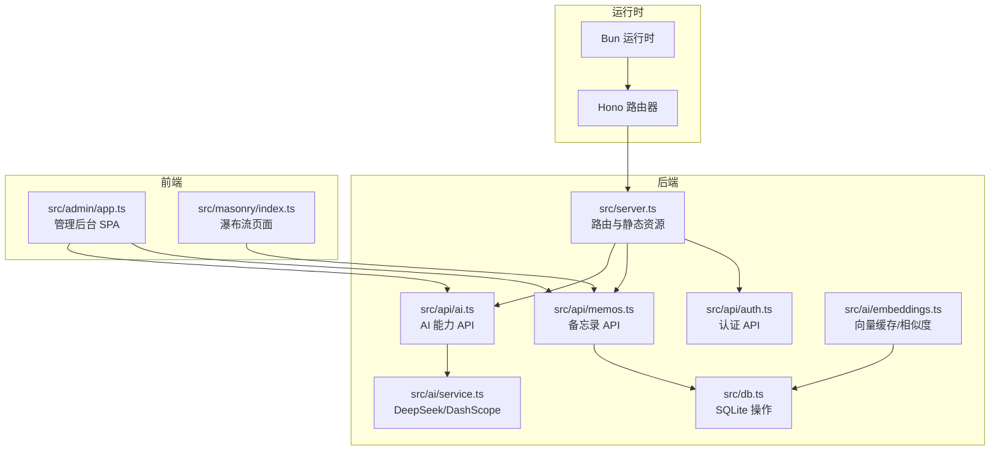
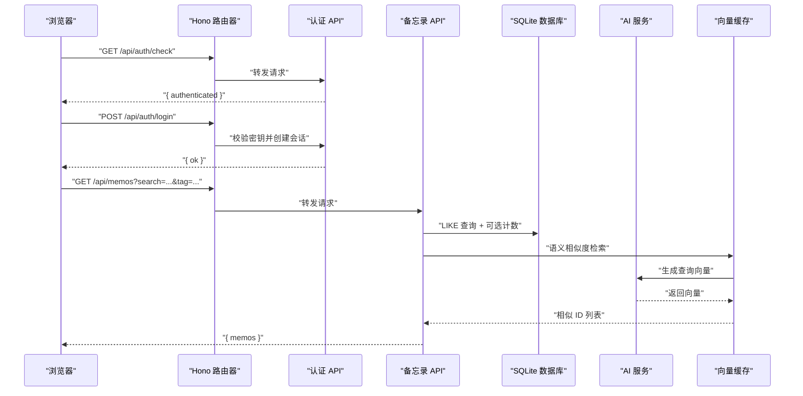
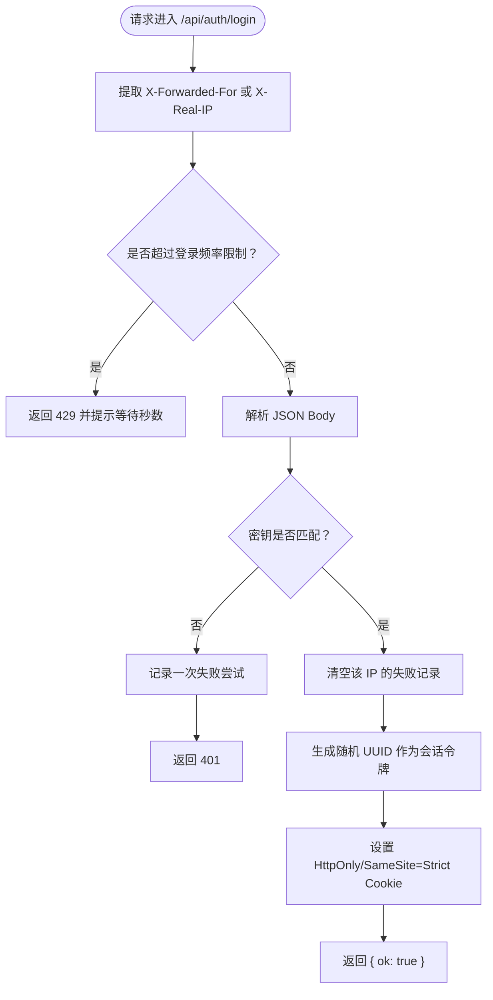
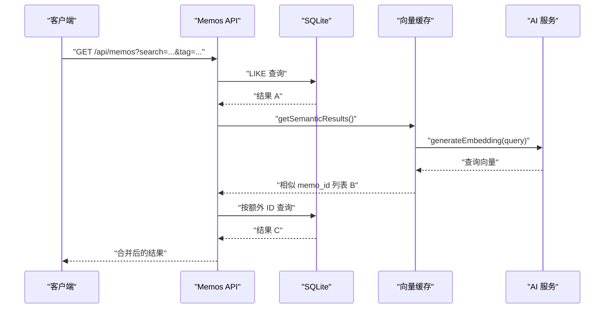
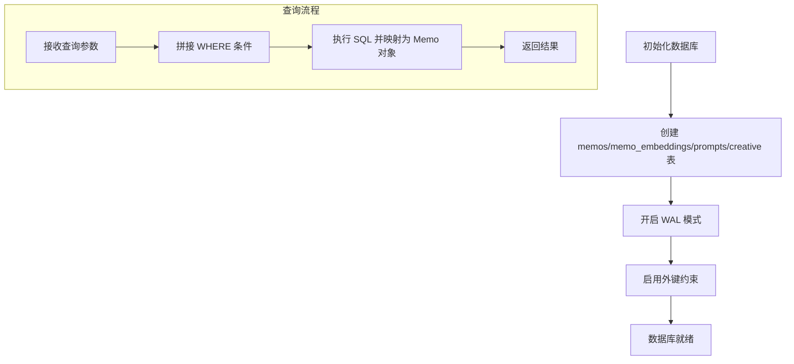
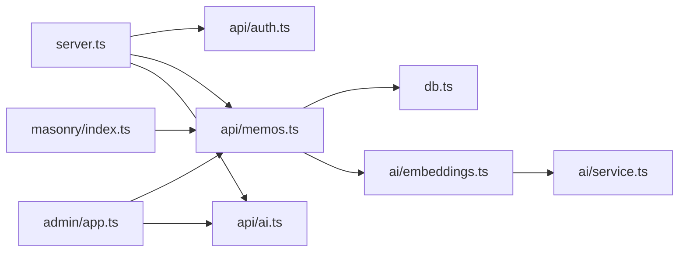

# 调试与故障排除

<cite>
**本文引用的文件**
- [README.md](file://README.md)
- [package.json](file://package.json)
- [src/server.ts](file://src/server.ts)
- [src/db.ts](file://src/db.ts)
- [src/util.ts](file://src/util.ts)
- [src/auth.ts](file://src/auth.ts)
- [src/api/auth.ts](file://src/api/auth.ts)
- [src/api/memos.ts](file://src/api/memos.ts)
- [src/model.ts](file://src/model.ts)
- [src/ai/embeddings.ts](file://src/ai/embeddings.ts)
- [src/ai/service.ts](file://src/ai/service.ts)
- [src/api/ai.ts](file://src/api/ai.ts)
- [src/admin/app.ts](file://src/admin/app.ts)
- [src/masonry/index.ts](file://src/masonry/index.ts)
</cite>

## 目录
1. [简介](#简介)
2. [项目结构](#项目结构)
3. [核心组件](#核心组件)
4. [架构总览](#架构总览)
5. [详细组件分析](#详细组件分析)
6. [依赖关系分析](#依赖关系分析)
7. [性能考虑](#性能考虑)
8. [故障排除指南](#故障排除指南)
9. [结论](#结论)
10. [附录](#附录)

## 简介
本指南面向开发与运维工程师，聚焦 memos 在开发模式下的调试方法与故障排除流程，覆盖后端路由与中间件、数据库与查询、AI 能力集成、前端 SPA 与瀑布流页面、API 调试与测试、日志与监控策略、性能分析与瓶颈定位、以及内存泄漏检测与修复建议。文档同时提供可视化图示帮助快速定位问题。

## 项目结构
- 运行时与框架：基于 Bun 运行时，使用 Hono 作为 Web 框架；SQLite（bun:sqlite）持久化；WAL 模式；前端使用 @chenglou/pretext（文字排版与布局）、VanJS（响应式 UI）。
- 关键模块：
  - 服务入口与路由：src/server.ts
  - 数据层：src/db.ts
  - 认证与会话：src/auth.ts、src/api/auth.ts
  - API 子域：memos、ai、creative、auth
  - 前端 SPA（管理后台）：src/admin/app.ts
  - 前端瀑布流页面：src/masonry/index.ts
  - 工具与辅助：src/util.ts
  - AI 能力：src/ai/service.ts、src/ai/embeddings.ts

图表来源
- [src/server.ts:74-127](file://src/server.ts#L74-L127)
- [src/api/auth.ts:29-77](file://src/api/auth.ts#L29-L77)
- [src/api/memos.ts:18-139](file://src/api/memos.ts#L18-L139)
- [src/api/ai.ts:6-67](file://src/api/ai.ts#L6-L67)
- [src/db.ts:15-57](file://src/db.ts#L15-L57)
- [src/ai/embeddings.ts:12-99](file://src/ai/embeddings.ts#L12-L99)
- [src/ai/service.ts:12-289](file://src/ai/service.ts#L12-L289)
- [src/admin/app.ts:37-150](file://src/admin/app.ts#L37-L150)
- [src/masonry/index.ts:307-351](file://src/masonry/index.ts#L307-L351)

章节来源
- [README.md:25-45](file://README.md#L25-L45)
- [package.json:6-9](file://package.json#L6-L9)

## 核心组件
- 服务入口与路由
  - 负责挂载子应用、静态资源与 SPA 回退、客户端 TS 构建缓存、数据库与向量缓存初始化、HTTP 服务启动。
- 数据层
  - 提供备忘录、提示词、创意内容等表的 CRUD 与统计查询；内置 WAL 与外键约束；提供嵌入向量的保存与读取。
- 认证与会话
  - 基于内存 Set 的会话存储，Cookie 管理，登录频率限制，Hono 中间件鉴权。
- API 子域
  - 认证 API：登录/登出/状态检查
  - 备忘录 API：分页/搜索/标签/计数/增删改
  - AI 能力 API：优化内容、标签建议、状态检测
- 前端
  - 管理后台 SPA：VanJS 响应式 UI，表单、列表、时间线、AI 工具条
  - 瀑布流页面：@chenglou/pretext 文字排版，自适应列数与虚拟滚动

章节来源
- [src/server.ts:74-127](file://src/server.ts#L74-L127)
- [src/db.ts:15-57](file://src/db.ts#L15-L57)
- [src/auth.ts:28-111](file://src/auth.ts#L28-L111)
- [src/api/auth.ts:29-77](file://src/api/auth.ts#L29-L77)
- [src/api/memos.ts:18-139](file://src/api/memos.ts#L18-L139)
- [src/api/ai.ts:6-67](file://src/api/ai.ts#L6-L67)
- [src/admin/app.ts:37-150](file://src/admin/app.ts#L37-L150)
- [src/masonry/index.ts:307-351](file://src/masonry/index.ts#L307-L351)

## 架构总览
后端以 Hono 路由为中心，按子域划分 API；前端通过 SPA 与瀑布流页面调用后端 API；AI 能力通过环境变量开关与超时控制保障稳定性；数据库采用 WAL 模式提升并发写入能力。

图表来源
- [src/server.ts:74-127](file://src/server.ts#L74-L127)
- [src/api/auth.ts:31-76](file://src/api/auth.ts#L31-L76)
- [src/api/memos.ts:20-47](file://src/api/memos.ts#L20-L47)
- [src/db.ts:99-131](file://src/db.ts#L99-L131)
- [src/ai/embeddings.ts:66-86](file://src/ai/embeddings.ts#L66-L86)
- [src/ai/service.ts:147-181](file://src/ai/service.ts#L147-L181)

## 详细组件分析

### 认证与会话调试要点
- 会话生命周期
  - 登录成功后设置 Cookie，有效期 24 小时；登出清除 Cookie。
  - 未认证请求在中间件阶段直接返回 401。
- 登录频率限制
  - 同一 IP 最多 5 次失败尝试，冷却 1 分钟。
- 环境变量
  - 生产环境必须设置密钥，否则直接退出；开发默认密钥用于本地调试。

图表来源
- [src/api/auth.ts:36-68](file://src/api/auth.ts#L36-L68)
- [src/auth.ts:57-92](file://src/auth.ts#L57-L92)

章节来源
- [src/auth.ts:28-111](file://src/auth.ts#L28-L111)
- [src/api/auth.ts:14-27](file://src/api/auth.ts#L14-L27)

### 备忘录 API 调试要点
- 查询参数
  - 支持 search（模糊 LIKE）、tag（精确相等）、all（需认证才返回私密）。
- 语义检索
  - 当提供 search 时，非阻塞地执行向量相似度检索，合并去重后返回。
- 嵌入向量
  - 创建/更新时异步生成并缓存；删除时清理缓存。

图表来源
- [src/api/memos.ts:20-47](file://src/api/memos.ts#L20-L47)
- [src/db.ts:99-131](file://src/db.ts#L99-L131)
- [src/ai/embeddings.ts:66-86](file://src/ai/embeddings.ts#L66-L86)
- [src/ai/service.ts:147-181](file://src/ai/service.ts#L147-L181)

章节来源
- [src/api/memos.ts:18-139](file://src/api/memos.ts#L18-L139)
- [src/db.ts:99-131](file://src/db.ts#L99-L131)

### 数据库与查询调试技巧
- 初始化与模式
  - 首次启动自动创建 memos.db 与表结构；启用 WAL 与外键约束。
- 查询路径
  - LIKE 模糊匹配、DISTINCT 标签、COUNT 统计、IN 条件、排序。
- 嵌入向量
  - 使用 BLOB 存储 Float32Array；加载时异常跳过损坏条目；更新时间戳保持一致。

图表来源
- [src/db.ts:15-57](file://src/db.ts#L15-L57)
- [src/db.ts:99-148](file://src/db.ts#L99-L148)
- [src/ai/embeddings.ts:12-46](file://src/ai/embeddings.ts#L12-L46)

章节来源
- [src/db.ts:15-57](file://src/db.ts#L15-L57)
- [src/db.ts:99-148](file://src/db.ts#L99-L148)

### 前端调试最佳实践
- 管理后台 SPA（VanJS）
  - 使用响应式状态驱动 UI；登录/登出、创建/编辑/删除、AI 优化与标签建议；全局错误提示。
- 瀑布流页面（@chenglou/pretext）
  - 自适应列数、虚拟滚动、URL 同步、防抖搜索、标签下拉选择。
- 浏览器开发者工具
  - Network：观察 API 响应码、请求体、Cookie；Console：查看错误信息；Elements：检查 DOM 结构与类名；Performance：分析渲染与事件节流。

章节来源
- [src/admin/app.ts:37-150](file://src/admin/app.ts#L37-L150)
- [src/masonry/index.ts:307-351](file://src/masonry/index.ts#L307-L351)

### API 调试与测试方法
- 认证
  - 登录：POST /api/auth/login（Body: { key }），成功后保存 Cookie。
  - 状态：GET /api/auth/check，检查是否已登录。
  - 登出：POST /api/auth/logout，清除 Cookie。
- 备忘录
  - 列表：GET /api/memos（支持 search、tag、all=true，需认证）。
  - 标签：GET /api/memos/tags。
  - 计数：GET /api/memos/count。
  - 新增/更新/删除：POST/PUT/DELETE /api/memos（需认证）。
- AI 能力
  - 状态：GET /api/ai/status（无需认证）。
  - 优化：POST /api/ai/optimize（需认证）。
  - 标签建议：POST /api/ai/suggest-tags（需认证）。

章节来源
- [README.md:100-177](file://README.md#L100-L177)
- [src/api/auth.ts:31-76](file://src/api/auth.ts#L31-L76)
- [src/api/memos.ts:20-139](file://src/api/memos.ts#L20-L139)
- [src/api/ai.ts:8-67](file://src/api/ai.ts#L8-L67)

## 依赖关系分析
- 服务启动顺序
  - 初始化数据库与向量缓存 → 启动 HTTP 服务 → 暴露路由。
- 模块耦合
  - API 层依赖数据层与认证模块；前端 SPA 依赖 API；AI 能力通过环境变量开关与超时控制隔离外部依赖。
- 可能的循环依赖
  - 当前结构清晰，API 与数据层解耦良好，未见循环依赖迹象。

图表来源
- [src/server.ts:74-127](file://src/server.ts#L74-L127)
- [src/api/memos.ts:18-139](file://src/api/memos.ts#L18-L139)
- [src/ai/embeddings.ts:12-99](file://src/ai/embeddings.ts#L12-L99)
- [src/ai/service.ts:12-289](file://src/ai/service.ts#L12-L289)
- [src/admin/app.ts:37-150](file://src/admin/app.ts#L37-L150)
- [src/masonry/index.ts:307-351](file://src/masonry/index.ts#L307-L351)

章节来源
- [src/server.ts:74-127](file://src/server.ts#L74-L127)

## 性能考虑
- 客户端 TS 构建缓存
  - 基于文件 mtime 的构建缓存，避免重复编译，提升开发体验。
- 前端瀑布流
  - 自适应列数与虚拟滚动，只渲染可视区域卡片，减少 DOM 节点数量。
- 数据库
  - WAL 模式提升并发写入；LIKE 查询配合索引可进一步优化（建议在高频字段建立索引）。
- AI 调用
  - 设置统一超时（60 秒），避免阻塞；对查询向量生成进行缓存与降噪。

章节来源
- [src/server.ts:15-51](file://src/server.ts#L15-L51)
- [src/masonry/index.ts:146-269](file://src/masonry/index.ts#L146-L269)
- [src/db.ts:9-13](file://src/db.ts#L9-L13)
- [src/ai/service.ts:4-5](file://src/ai/service.ts#L4-L5)

## 故障排除指南

### 开发模式调试方法
- 启动与热重载
  - 使用开发脚本启动，自动监听文件变化并重启服务。
- 日志输出
  - 构建错误、API 错误、AI 请求错误均输出到控制台，便于定位问题。
- 环境变量
  - 端口、密钥、AI 服务密钥与基础地址通过环境变量配置。

章节来源
- [package.json:6-9](file://package.json#L6-L9)
- [src/server.ts:47-49](file://src/server.ts#L47-L49)
- [src/ai/service.ts:6-8](file://src/ai/service.ts#L6-L8)

### 常见错误诊断与解决
- 登录失败或 401
  - 检查密钥是否正确；确认生产环境已设置密钥；查看登录频率限制是否触发。
- 429 太多请求
  - 等待冷却时间结束；检查客户端是否频繁重试。
- API 返回 500 或 503
  - AI 服务不可用或网络异常；检查 DEEPSEEK_API_KEY、DASHSCOPE_API_KEY 与网络连通性。
- 前端空白或报错
  - 查看 Network 面板中 API 响应；确认 Cookie 是否正确设置；检查 Console 错误堆栈。
- 瀑布流不渲染或卡顿
  - 检查虚拟滚动与布局计算逻辑；确认可视区域监听与 RAF 调度正常。

章节来源
- [src/api/auth.ts:36-76](file://src/api/auth.ts#L36-L76)
- [src/api/ai.ts:13-67](file://src/api/ai.ts#L13-L67)
- [src/admin/app.ts:37-150](file://src/admin/app.ts#L37-L150)
- [src/masonry/index.ts:307-351](file://src/masonry/index.ts#L307-L351)

### 日志记录与监控策略
- 控制台日志
  - 构建失败、AI 请求错误、数据库异常均输出错误信息。
- 建议增强
  - 引入结构化日志（JSON）与采样率；区分 info/warn/error；记录请求链路 ID；对慢查询与慢响应进行告警。

章节来源
- [src/server.ts:35-49](file://src/server.ts#L35-L49)
- [src/ai/service.ts:58-68](file://src/ai/service.ts#L58-L68)
- [src/ai/service.ts:168-179](file://src/ai/service.ts#L168-L179)

### 性能分析与瓶颈识别
- 前端
  - 使用浏览器 Performance 面板录制滚动与输入事件，关注帧率与长任务；利用 Elements 面板检查重绘与回流。
- 后端
  - 观察 API 响应时间分布；对慢查询加索引；评估向量生成与缓存命中率。
- 数据库
  - 使用 EXPLAIN QUERY PLAN 分析 LIKE 与 JOIN；对高频字段建立索引；监控 WAL 文件大小与写放大。

章节来源
- [src/masonry/index.ts:217-230](file://src/masonry/index.ts#L217-L230)
- [src/db.ts:99-131](file://src/db.ts#L99-L131)

### 数据库连接与查询调试技巧
- 连接与模式
  - 确认 memos.db 文件存在；WAL 模式与外键约束已启用。
- 查询优化
  - LIKE 百分号前后匹配可能无法命中索引；对高频搜索字段考虑建立索引；拆分复杂条件。
- 嵌入向量
  - 检查 BLOB 存储完整性；加载时跳过损坏条目；定期清理无效缓存。

章节来源
- [src/db.ts:9-13](file://src/db.ts#L9-L13)
- [src/db.ts:15-57](file://src/db.ts#L15-L57)
- [src/ai/embeddings.ts:12-46](file://src/ai/embeddings.ts#L12-L46)

### 前端与后端调试最佳实践
- 前端
  - 使用 React/Vue DevTools（如适用）或 VanJS 状态面板；对异步请求增加 Loading 状态；集中处理错误并显示友好提示。
- 后端
  - 对每个中间件与路由增加最小化日志；对异常捕获并返回标准错误格式；对敏感操作记录审计日志。

章节来源
- [src/admin/app.ts:37-150](file://src/admin/app.ts#L37-L150)
- [src/util.ts:10-20](file://src/util.ts#L10-L20)

### 浏览器开发者工具使用
- Network
  - 查看请求头 Cookie、响应体、状态码；对比不同查询参数的结果差异。
- Console
  - 捕捉前端抛出的异常；查看后端返回的错误信息。
- Elements
  - 检查瀑布流卡片的定位与尺寸；确认自定义下拉选择的状态。
- Performance
  - 录制滚动与输入事件，定位掉帧与长任务。

章节来源
- [src/masonry/index.ts:307-351](file://src/masonry/index.ts#L307-L351)
- [src/admin/app.ts:37-150](file://src/admin/app.ts#L37-L150)

### API 调试与测试方法
- 使用 curl 或 Postman
  - 先登录获取 Cookie，再携带 Cookie 访问受保护接口。
- 参数验证
  - 检查必填字段、类型与长度；对空内容返回 400。
- 幂等性
  - GET 接口应幂等；POST/PUT/DELETE 应具备幂等设计或客户端补偿。

章节来源
- [README.md:100-177](file://README.md#L100-L177)
- [src/api/memos.ts:62-91](file://src/api/memos.ts#L62-L91)
- [src/api/memos.ts:93-126](file://src/api/memos.ts#L93-L126)

### 内存泄漏检测与修复指导
- 前端
  - 清理定时器与事件监听器；避免闭包持有大对象；使用 WeakMap/WeakSet 管理临时引用；定期检查内存快照。
- 后端
  - 检查构建缓存 Map 与向量缓存 Map 的生命周期；确保异常分支释放资源；避免长时间持有数据库连接。
- 通用
  - 对高频异步任务增加取消信号；对流式响应及时关闭读取器。

章节来源
- [src/server.ts:13-51](file://src/server.ts#L13-L51)
- [src/ai/embeddings.ts:12-46](file://src/ai/embeddings.ts#L12-L46)
- [src/masonry/index.ts:353-369](file://src/masonry/index.ts#L353-L369)

## 结论
通过明确的模块职责、完善的日志与错误处理、合理的性能优化与前端调试工具，可以高效完成 memos 的开发调试与故障排除。建议在生产环境中补充结构化日志、监控告警与数据库索引优化，持续提升稳定性与用户体验。

## 附录
- 环境变量参考
  - PORT：服务器监听端口
  - MEMOS_SECRET_KEY：管理员登录密钥（生产必须设置）
  - DEEPSEEK_API_KEY / DEEPSEEK_BASE_URL：DeepSeek 服务密钥与基础地址
  - DASHSCOPE_API_KEY：DashScope 嵌入服务密钥

章节来源
- [README.md:59-65](file://README.md#L59-L65)
- [src/ai/service.ts:6-8](file://src/ai/service.ts#L6-L8)
- [src/api/auth.ts:14-27](file://src/api/auth.ts#L14-L27)