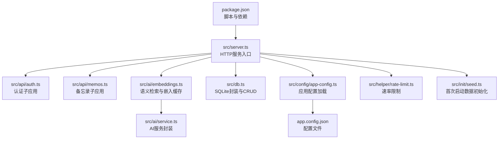
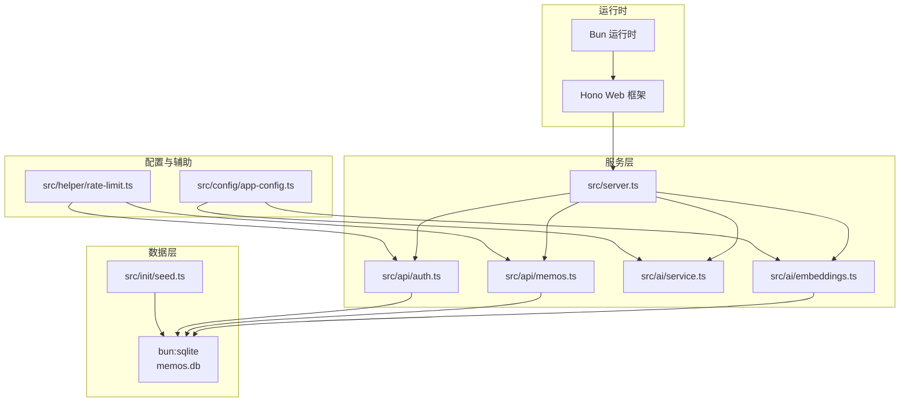
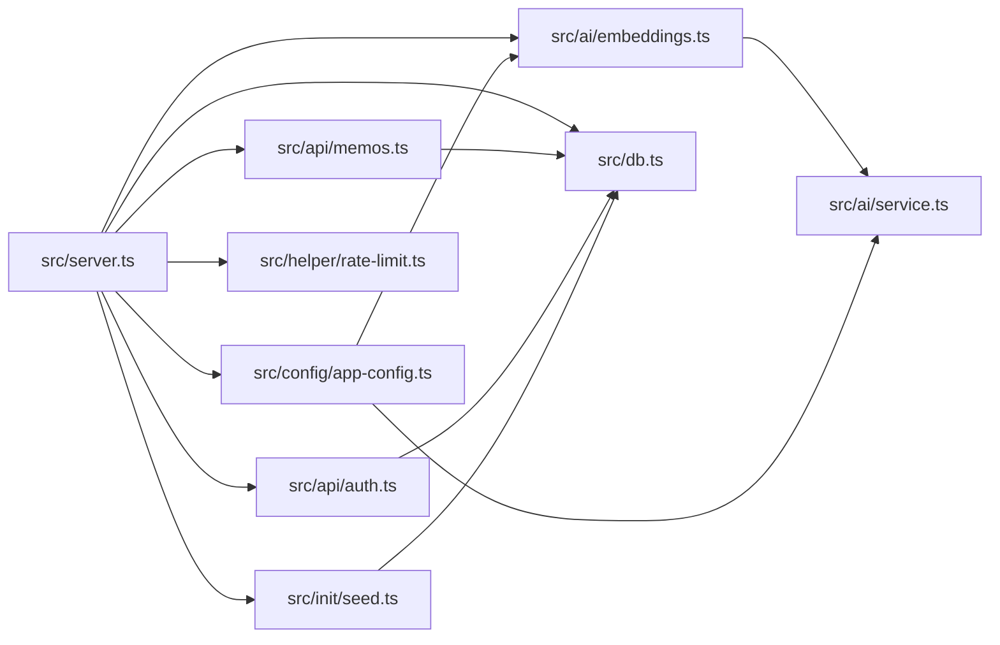

# 调试与测试

<cite>
**本文引用的文件**
- [package.json](file://package.json)
- [README.md](file://README.md)
- [src/server.ts](file://src/server.ts)
- [src/db.ts](file://src/db.ts)
- [src/api/memos.ts](file://src/api/memos.ts)
- [src/api/auth.ts](file://src/api/auth.ts)
- [src/ai/embeddings.ts](file://src/ai/embeddings.ts)
- [src/ai/service.ts](file://src/ai/service.ts)
- [src/config/app-config.ts](file://src/config/app-config.ts)
- [app.config.json](file://app.config.json)
- [src/helper/rate-limit.ts](file://src/helper/rate-limit.ts)
- [src/init/seed.ts](file://src/init/seed.ts)
- [src/model.ts](file://src/model.ts)
</cite>

## 目录
1. [简介](#简介)
2. [项目结构](#项目结构)
3. [核心组件](#核心组件)
4. [架构总览](#架构总览)
5. [详细组件分析](#详细组件分析)
6. [依赖关系分析](#依赖关系分析)
7. [性能考量](#性能考量)
8. [故障排查指南](#故障排查指南)
9. [结论](#结论)
10. [附录](#附录)

## 简介
本指南面向Memmos项目的开发者与运维人员，聚焦于调试与测试实践。内容覆盖：
- 使用Bun调试器进行断点、变量监控与调用栈分析
- 日志策略与日志级别建议（开发/生产）
- 单元测试与异步测试编写要点（测试框架选择、Mock与异步处理）
- 集成测试策略（API、数据库、端到端）
- 性能分析工具与方法（内存、CPU、网络）
- 常见调试场景与解决方案（死锁、内存泄漏、并发问题）

## 项目结构
Memmos采用“服务端即前端构建”的架构，核心运行时为Bun，数据库为SQLite（bun:sqlite），Web框架为Hono，前端使用VanJS与Pretext。项目通过Bun脚本进行开发与构建。

图表来源
- [src/server.ts:1-125](file://src/server.ts#L1-L125)
- [src/api/auth.ts:1-77](file://src/api/auth.ts#L1-L77)
- [src/api/memos.ts:1-220](file://src/api/memos.ts#L1-L220)
- [src/ai/embeddings.ts:1-228](file://src/ai/embeddings.ts#L1-L228)
- [src/ai/service.ts:1-507](file://src/ai/service.ts#L1-L507)
- [src/db.ts:1-484](file://src/db.ts#L1-L484)
- [src/config/app-config.ts:1-108](file://src/config/app-config.ts#L1-L108)
- [app.config.json:1-22](file://app.config.json#L1-L22)
- [src/helper/rate-limit.ts:1-153](file://src/helper/rate-limit.ts#L1-L153)
- [src/init/seed.ts:1-118](file://src/init/seed.ts#L1-L118)

章节来源
- [README.md:25-45](file://README.md#L25-L45)
- [package.json:6-12](file://package.json#L6-L12)

## 核心组件
- 服务入口与路由
  - 通过Hono挂载认证、备忘录、AI、导出导入等子应用；提供静态资源与SPA回退。
- 数据层
  - 使用bun:sqlite封装数据库连接、建表、CRUD与索引；提供嵌入向量表与创意内容表。
- AI与嵌入
  - 基于DashScope生成嵌入向量，使用Cosine相似度进行语义检索；支持可选重排序。
- 配置系统
  - 从app.config.json加载配置，带内存缓存与硬编码回退；支持AI超时、重排阈值等。
- 速率限制
  - 基于IP的小时/天双窗口计数，支持memo与AI两类。
- 种子数据
  - 首次启动时导入内置提示词与示例备忘录。

章节来源
- [src/server.ts:38-125](file://src/server.ts#L38-L125)
- [src/db.ts:15-61](file://src/db.ts#L15-L61)
- [src/ai/embeddings.ts:16-64](file://src/ai/embeddings.ts#L16-L64)
- [src/config/app-config.ts:57-107](file://src/config/app-config.ts#L57-L107)
- [src/helper/rate-limit.ts:27-39](file://src/helper/rate-limit.ts#L27-L39)
- [src/init/seed.ts:112-117](file://src/init/seed.ts#L112-L117)

## 架构总览

图表来源
- [src/server.ts:38-125](file://src/server.ts#L38-L125)
- [src/api/auth.ts:29-77](file://src/api/auth.ts#L29-L77)
- [src/api/memos.ts:26-220](file://src/api/memos.ts#L26-L220)
- [src/ai/service.ts:43-75](file://src/ai/service.ts#L43-L75)
- [src/ai/embeddings.ts:16-64](file://src/ai/embeddings.ts#L16-L64)
- [src/db.ts:15-61](file://src/db.ts#L15-L61)
- [src/config/app-config.ts:57-107](file://src/config/app-config.ts#L57-L107)
- [src/helper/rate-limit.ts:27-39](file://src/helper/rate-limit.ts#L27-L39)
- [src/init/seed.ts:112-117](file://src/init/seed.ts#L112-L117)

## 详细组件分析

### 服务入口与路由（Bun + Hono）
- 开发模式通过脚本启用热重载；生产模式先构建再启动。
- 路由挂载认证、备忘录、AI、创意、导出导入子应用；提供SPA回退与静态资源。
- 初始化数据库、种子数据与嵌入缓存；启动Bun.serve监听端口。

调试要点
- 断点位置：路由注册后、静态资源与SPA回退处理处、Bun.serve启动前。
- 变量监控：端口、静态基路径、路由匹配结果、错误响应。
- 调用栈：关注Hono中间件链、子应用fetch处理、异常捕获与404回退。

章节来源
- [package.json:6-12](file://package.json#L6-L12)
- [src/server.ts:11-125](file://src/server.ts#L11-L125)

### 认证模块（Cookie + Session）
- 支持登录/登出/状态检查；登录时进行速率限制与密钥校验；设置/清理Cookie。
- 生产环境强制要求设置密钥，未设置会记录致命日志并退出。

调试要点
- 断点：登录请求体解析、密钥校验、速率限制判断、Cookie设置。
- 变量监控：X-Forwarded-For/X-Real-IP提取、IP来源、会话令牌。
- 调用栈：登录→校验→记录尝试→设置Cookie；登出→销毁会话→清理Cookie。

章节来源
- [src/api/auth.ts:14-77](file://src/api/auth.ts#L14-L77)

### 备忘录API（CRUD + 语义检索 + 分页）
- 支持分页查询、全文检索、标签筛选、置顶/取消置顶、统计数量。
- 搜索时并行触发语义检索，合并结果并去重；创建/更新时异步生成嵌入向量。
- 速率限制应用于备忘录创建；鉴权中间件保护敏感操作。

调试要点
- 断点：查询参数解析、SQL条件拼接、分页切片、语义检索合并。
- 变量监控：includePrivate标志、ids/limit/page、相似度阈值、重排候选数。
- 调用栈：GET / → 构造条件 → 查询DB → 语义检索 → 合并 → 分页 → 返回；POST / → 校验JSON/内容 → 速率限制 → DB写入 → 异步生成嵌入。

章节来源
- [src/api/memos.ts:28-220](file://src/api/memos.ts#L28-L220)
- [src/db.ts:122-169](file://src/db.ts#L122-L169)
- [src/ai/embeddings.ts:95-154](file://src/ai/embeddings.ts#L95-L154)

### 数据库层（SQLite + 模型）
- 初始化WAL模式与外键约束；提供memos、memo_embeddings、prompts、creative四张表。
- 提供CRUD与聚合函数；支持标签解析、内容存在性检查、导入/导出辅助。
- 嵌入向量以BLOB存储，使用Float32Array进行内存缓存与相似度计算。

调试要点
- 断点：建表DDL、CRUD SQL执行、JSON标签解析、Blob转换。
- 变量监控：表结构字段、索引命中情况、查询结果集大小。
- 调用栈：初始化DB → 建表 → 索引；CRUD → 参数绑定 → 结果映射。

章节来源
- [src/db.ts:15-61](file://src/db.ts#L15-L61)
- [src/db.ts:122-484](file://src/db.ts#L122-L484)
- [src/model.ts:1-35](file://src/model.ts#L1-L35)

### AI与嵌入（DashScope + Cosine相似度）
- 加载配置与默认提供方；生成嵌入向量、语义检索、候选重排。
- 初始化时加载DB中的嵌入到内存缓存，并对缺失项批量生成。
- 提供内容优化、标签建议、创意生成（流式）、聊天工作区（流式）。

调试要点
- 断点：配置解析、API Key校验、超时控制、流式解析。
- 变量监控：向量维度、相似度阈值、候选TopN、重排TopN。
- 调用栈：初始化缓存 → 读取DB → 批量生成 → 写入缓存；语义检索 → 生成查询向量 → 计算相似度 → 可选重排。

章节来源
- [src/ai/service.ts:43-75](file://src/ai/service.ts#L43-L75)
- [src/ai/embeddings.ts:16-64](file://src/ai/embeddings.ts#L16-L64)
- [src/ai/embeddings.ts:95-228](file://src/ai/embeddings.ts#L95-L228)

### 配置系统（app.config.json + 硬编码回退）
- 从JSON文件读取AI、嵌入、重排、速率限制等配置，带内存缓存与回退。
- 环境变量可覆盖部分配置项。

调试要点
- 断点：文件读取与解析、字段合并、回退逻辑。
- 变量监控：请求超时、默认温度/最大token、相似度阈值、重排开关与TopN。
- 调用栈：首次调用 → 读取文件 → 合并默认 → 缓存；后续调用 → 直接返回缓存。

章节来源
- [src/config/app-config.ts:57-107](file://src/config/app-config.ts#L57-L107)
- [app.config.json:1-22](file://app.config.json#L1-L22)

### 速率限制（IP级双窗口）
- 基于Map维护每IP每类别的小时/天计数窗口；支持格式化错误消息。
- 支持环境变量覆盖配置。

调试要点
- 断点：窗口起始时间计算、计数递增、日/小时阈值判断。
- 变量监控：小时/天限额、窗口起始、剩余等待秒数。
- 调用栈：检查 → 超限则返回错误；记录 → 更新窗口与计数。

章节来源
- [src/helper/rate-limit.ts:77-153](file://src/helper/rate-limit.ts#L77-L153)

### 首次启动数据（种子）
- 若提示词表为空则导入内置提示词；若备忘录表为空则导入示例数据。
- 去重与容错处理，避免重复导入。

调试要点
- 断点：目录扫描、文件读取、内容解析、DB写入。
- 变量监控：导入条数、跳过条数、现有内容集合。
- 调用栈：检查表状态 → 读取文件 → 过滤/去重 → 插入。

章节来源
- [src/init/seed.ts:16-117](file://src/init/seed.ts#L16-L117)

## 依赖关系分析

图表来源
- [src/server.ts:38-125](file://src/server.ts#L38-L125)
- [src/api/auth.ts:29-77](file://src/api/auth.ts#L29-L77)
- [src/api/memos.ts:26-220](file://src/api/memos.ts#L26-L220)
- [src/ai/embeddings.ts:16-64](file://src/ai/embeddings.ts#L16-L64)
- [src/ai/service.ts:43-75](file://src/ai/service.ts#L43-L75)
- [src/db.ts:15-61](file://src/db.ts#L15-L61)
- [src/config/app-config.ts:57-107](file://src/config/app-config.ts#L57-L107)
- [src/helper/rate-limit.ts:27-39](file://src/helper/rate-limit.ts#L27-L39)
- [src/init/seed.ts:112-117](file://src/init/seed.ts#L112-L117)

## 性能考量
- 内存使用
  - 嵌入向量缓存使用Map与Float32Array，注意大表时的内存占用；可通过减少候选TopN或禁用重排降低峰值内存。
- CPU性能
  - 相似度计算为O(n*d)，其中n为缓存条目数，d为向量维度；建议在高并发下限制候选规模。
- 网络请求
  - DashScope嵌入与重排API存在超时控制；建议在生产环境配置合适的超时与重试策略。
- 数据库
  - WAL模式提升并发写入；合理使用索引（如pinned_at）与LIMIT分页，避免全表扫描。

[本节为通用指导，不直接分析具体文件]

## 故障排查指南

### 常见调试场景与解决方案
- 死锁检测
  - SQLite默认使用行级锁；避免在事务中长时间持有锁；拆分长事务，减少跨表写入。
- 内存泄漏排查
  - 关注嵌入缓存Map增长；定期清理无效ID；在删除备忘录时同步删除嵌入缓存。
- 并发问题调试
  - 速率限制基于内存Map，注意多进程部署时的共享；建议使用外部缓存或单实例部署。
- 嵌入向量异常
  - 检查DashScope API Key与网络连通性；确认向量维度一致；对损坏条目进行跳过与清理。
- 语义检索结果异常
  - 调整相似度阈值与候选TopN；确认重排开关与候选数量；验证查询向量生成是否成功。

章节来源
- [src/ai/embeddings.ts:72-75](file://src/ai/embeddings.ts#L72-L75)
- [src/ai/embeddings.ts:217-227](file://src/ai/embeddings.ts#L217-L227)
- [src/helper/rate-limit.ts:25-26](file://src/helper/rate-limit.ts#L25-L26)

## 结论
本指南提供了Memmos在Bun生态下的调试与测试实践路径：以服务入口为起点，结合路由、API、数据库、AI与配置模块的调试要点，配合日志策略、单元与集成测试方法以及性能分析手段，能够有效定位问题并持续改进系统稳定性与性能。

[本节为总结性内容，不直接分析具体文件]

## 附录

### Bun调试器使用指南（断点、变量监控、调用栈）
- 启动方式
  - 开发模式：使用脚本启用热重载，便于打断点与观察变量变化。
- 断点设置
  - 在服务入口、路由处理、数据库CRUD、AI调用等关键路径设置断点。
- 变量监控
  - 观察请求头（如X-Forwarded-For）、查询参数、SQL绑定参数、向量数组长度、缓存命中率。
- 调用栈分析
  - 通过调用栈定位异常发生的具体函数与上下文，结合错误日志快速定位根因。

章节来源
- [package.json:6-12](file://package.json#L6-L12)
- [src/server.ts:119-125](file://src/server.ts#L119-L125)

### 日志配置与日志级别（开发/生产）
- 开发环境
  - 建议开启详细日志，包括路由处理、数据库查询、AI调用与错误堆栈。
- 生产环境
  - 仅记录关键错误与安全事件（如登录失败、速率限制触发）；避免泄露敏感信息。
- 环境变量
  - 可通过环境变量控制速率限制阈值与AI超时，便于快速调整。

章节来源
- [src/api/auth.ts:17-27](file://src/api/auth.ts#L17-L27)
- [src/helper/rate-limit.ts:27-39](file://src/helper/rate-limit.ts#L27-L39)
- [src/ai/service.ts:16-18](file://src/ai/service.ts#L16-L18)

### 单元测试编写方法
- 测试框架
  - 推荐使用Bun内置测试能力或Jest（需安装），针对纯函数与工具函数编写单元测试。
- Mock对象
  - 对数据库访问、AI服务调用进行Mock，隔离外部依赖；对配置加载进行注入。
- 异步测试
  - 使用Promise/Async/Await处理异步调用；对流式AI输出进行阶段性断言。

[本节为通用指导，不直接分析具体文件]

### 集成测试策略
- API测试
  - 覆盖认证流程、备忘录CRUD、搜索与分页、置顶/取消置顶、统计接口。
- 数据库测试
  - 验证建表、索引、CRUD、导入/导出、内容去重与存在性检查。
- 端到端测试
  - 使用真实浏览器或HTTP客户端模拟用户行为，覆盖SPA路由与静态资源加载。

[本节为通用指导，不直接分析具体文件]

### 性能分析工具使用指南
- 内存使用监控
  - 使用Bun内置性能指标或Node.js的heap snapshot对比，关注嵌入缓存与临时对象。
- CPU性能分析
  - 分析相似度计算热点，评估候选TopN与维度对性能的影响。
- 网络请求跟踪
  - 记录DashScope API的请求耗时与错误率，设置合理的超时与重试。

[本节为通用指导，不直接分析具体文件]