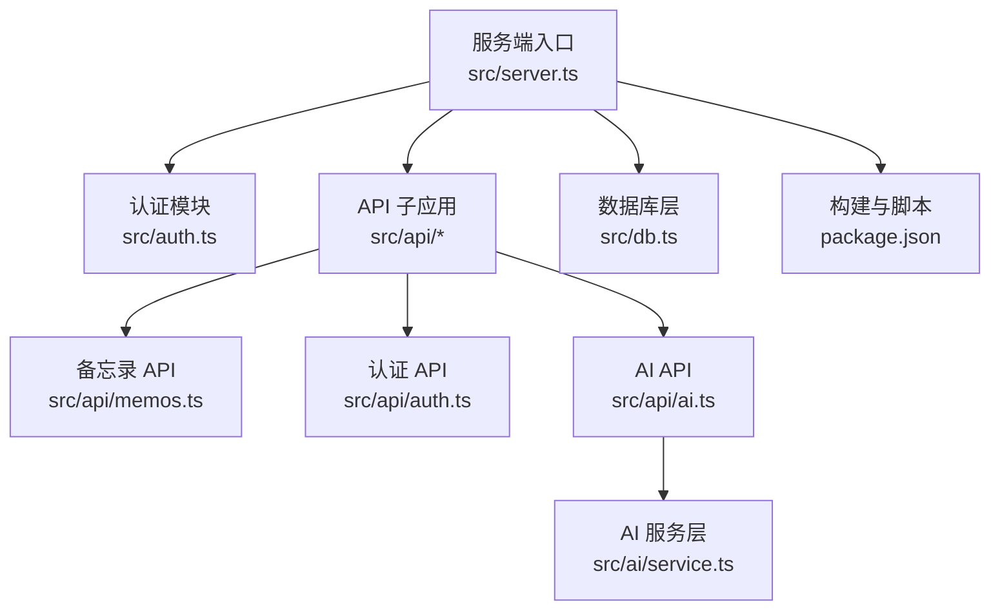
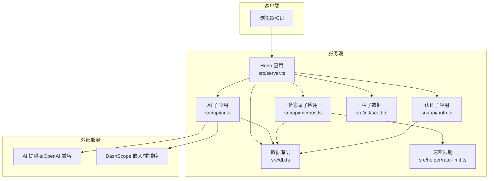
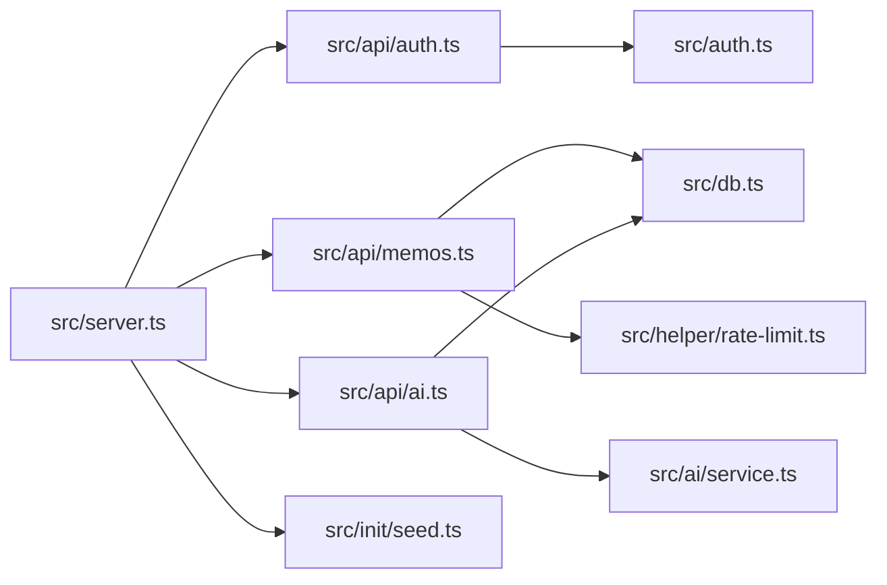
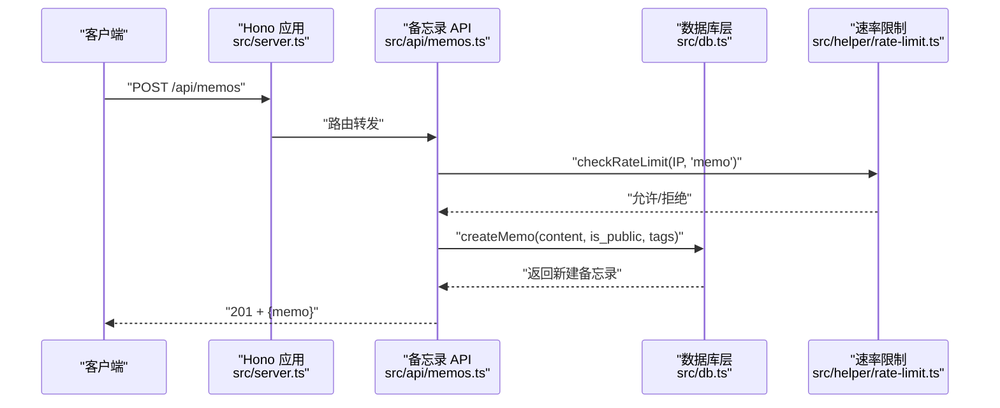
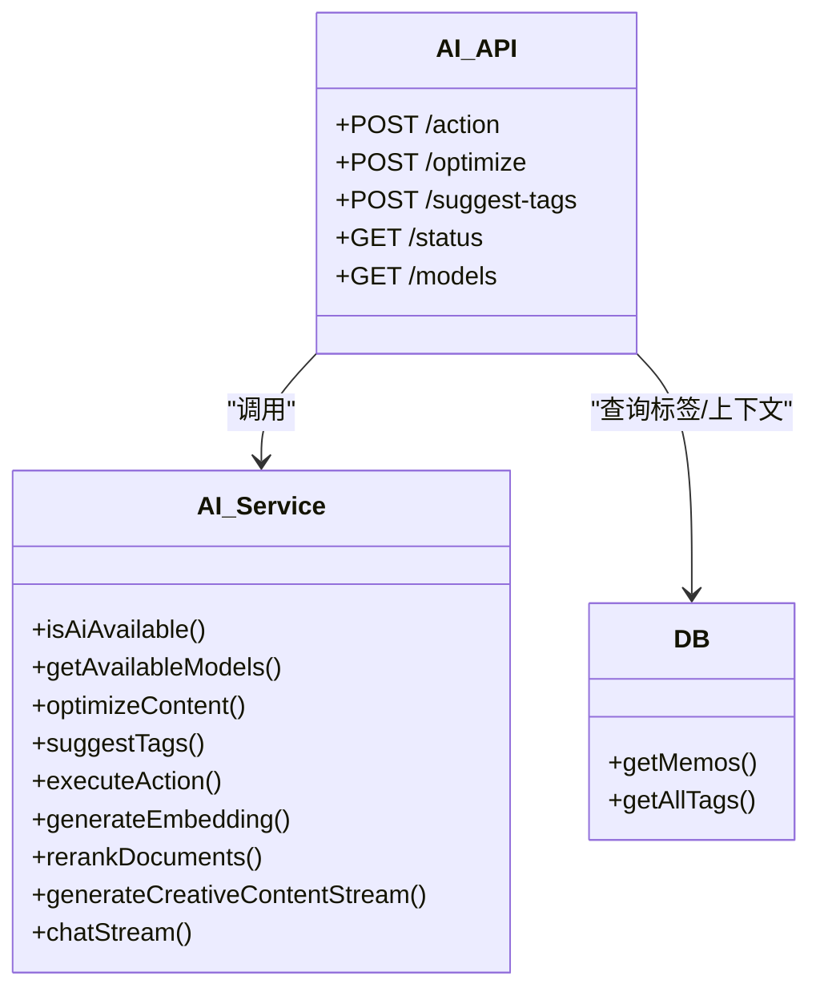
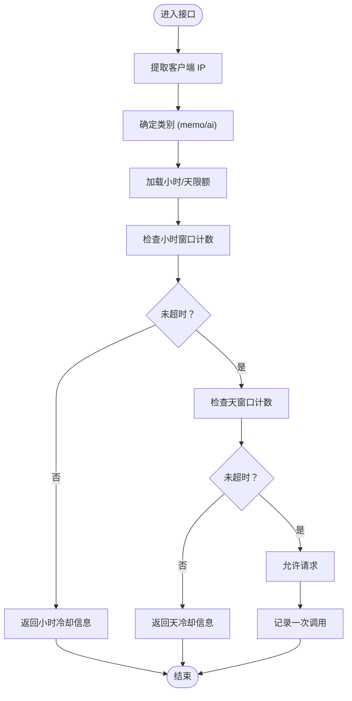

# 贡献指南

<cite>
**本文档引用的文件**
- [README.md](file://README.md)
- [package.json](file://package.json)
- [CLAUDE.md](file://CLAUDE.md)
- [src/server.ts](file://src/server.ts)
- [src/db.ts](file://src/db.ts)
- [src/auth.ts](file://src/auth.ts)
- [src/api/auth.ts](file://src/api/auth.ts)
- [src/api/memos.ts](file://src/api/memos.ts)
- [src/api/ai.ts](file://src/api/ai.ts)
- [src/ai/service.ts](file://src/ai/service.ts)
- [src/helper/rate-limit.ts](file://src/helper/rate-limit.ts)
- [src/init/seed.ts](file://src/init/seed.ts)
- [docs/superpowers/specs/2026-05-22-ai-writing-toolbox-design.md](file://docs/superpowers/specs/2026-05-22-ai-writing-toolbox-design.md)
- [data/system-prompts/creative.txt](file://data/system-prompts/creative.txt)
</cite>

## 目录
1. [简介](#简介)
2. [项目结构](#项目结构)
3. [核心组件](#核心组件)
4. [架构总览](#架构总览)
5. [详细组件分析](#详细组件分析)
6. [依赖关系分析](#依赖关系分析)
7. [性能考量](#性能考量)
8. [故障排查指南](#故障排查指南)
9. [结论](#结论)
10. [附录](#附录)

## 简介
本贡献指南面向希望参与 Memos 项目的开发者与社区成员，提供从环境搭建、Git 工作流、Pull Request 规范、Issue 报告到代码审查与社区参与的全流程指引。同时给出新贡献者的入门路径与导师机制建议，以及项目治理结构说明。

## 项目结构
- 项目采用“运行时 + 前端 + API + 数据层”的分层组织方式，核心入口为服务端主程序，负责路由挂载与静态资源分发；数据库层封装 SQLite 操作；认证模块提供 Cookie 会话与 Bearer Token 双通道认证；AI 能力通过统一的服务层对接多家大模型提供商；前端采用 VanJS（管理后台）与 Masonry 布局（首页）。
- 顶层脚本与配置文件定义了开发与构建流程，便于本地快速启动与生产打包。

图表来源
- [src/server.ts:1-137](file://src/server.ts#L1-L137)
- [src/api/memos.ts:1-220](file://src/api/memos.ts#L1-L220)
- [src/api/auth.ts:1-77](file://src/api/auth.ts#L1-L77)
- [src/api/ai.ts:1-326](file://src/api/ai.ts#L1-L326)
- [src/db.ts:1-484](file://src/db.ts#L1-L484)
- [src/ai/service.ts:1-507](file://src/ai/service.ts#L1-L507)
- [package.json:1-26](file://package.json#L1-L26)

章节来源
- [README.md:25-45](file://README.md#L25-L45)
- [package.json:6-11](file://package.json#L6-L11)

## 核心组件
- 服务端入口与路由：负责 API 路由挂载、静态资源与页面分发、首次启动初始化（数据库、种子数据、向量缓存）。
- 认证与授权：支持 Cookie 会话与 Bearer Token，提供中间件统一鉴权；登录频率限制与安全头设置。
- 数据层：SQLite 表结构与 CRUD，包含备忘录、嵌入向量、提示词与创意内容等；提供标签解析、全文检索与相似度检索。
- API 层：认证、备忘录、AI 写作工具箱与对话工作台；统一速率限制与错误处理。
- AI 服务层：多提供商适配、OpenAI 兼容流式与非流式调用、DashScope 嵌入与重排序、创意内容生成与对话流式输出。
- 辅助模块：速率限制（小时/天双窗口）、种子数据初始化、系统提示词加载。

章节来源
- [src/server.ts:11-137](file://src/server.ts#L11-L137)
- [src/auth.ts:1-128](file://src/auth.ts#L1-L128)
- [src/db.ts:15-61](file://src/db.ts#L15-L61)
- [src/api/memos.ts:26-220](file://src/api/memos.ts#L26-L220)
- [src/api/ai.ts:21-326](file://src/api/ai.ts#L21-L326)
- [src/ai/service.ts:16-128](file://src/ai/service.ts#L16-L128)
- [src/helper/rate-limit.ts:1-153](file://src/helper/rate-limit.ts#L1-L153)
- [src/init/seed.ts:112-118](file://src/init/seed.ts#L112-L118)

## 架构总览

图表来源
- [src/server.ts:38-137](file://src/server.ts#L38-L137)
- [src/api/auth.ts:29-77](file://src/api/auth.ts#L29-L77)
- [src/api/memos.ts:26-220](file://src/api/memos.ts#L26-L220)
- [src/api/ai.ts:21-326](file://src/api/ai.ts#L21-L326)
- [src/db.ts:15-61](file://src/db.ts#L15-L61)
- [src/helper/rate-limit.ts:76-153](file://src/helper/rate-limit.ts#L76-L153)
- [src/init/seed.ts:112-118](file://src/init/seed.ts#L112-L118)
- [src/ai/service.ts:132-175](file://src/ai/service.ts#L132-L175)

## 详细组件分析

### Git 工作流与分支策略
- 分支命名
  - 功能开发：feature/主题
  - 修复：fix/问题描述
  - 文档：docs/主题
  - 重构：refactor/主题
- 提交规范
  - 类型: 标题（简要描述）
  - 正文：变更动机、影响范围、风险提示
  - 附注：相关 Issue/PR 链接
- 合并流程
  - 本地测试通过后推送分支并发起 PR
  - 至少一名维护者审查同意后方可合并
  - 合并前确保无冲突、无 CI 失败

### Pull Request 规范
- PR 模板
  - 标题：简明扼要描述变更
  - 摘要：背景、目标、方案概览
  - 变更点：逐项列出改动文件与目的
  - 测试：自测步骤与结果
  - 依赖：是否引入新依赖或破坏性变更
  - 问题追踪：关联 Issue/PR
- 代码审查流程
  - 提交后自动触发基础检查（如构建/测试）
  - 维护者审阅：关注代码质量、安全性、性能与一致性
  - 反馈处理：按审查意见迭代，必要时进行二次审查
- 反馈处理
  - 使用线程化评论逐条回应
  - 修改后重新推送，避免覆盖历史评论
  - 重大变更需更新相关文档与测试

### Issue 报告规范
- Bug 报告
  - 环境：操作系统、Bun 版本、依赖版本
  - 复现步骤：最小可复现步骤
  - 期望 vs 实际：明确对比
  - 截图/日志：有助于定位问题
- 功能请求
  - 背景与动机：为什么需要该功能
  - 使用场景：谁会用、如何用
  - 可选：原型图或草图
- 问题分类
  - 类型：Bug / Feature / Discussion / Docs / Maintenance
  - 优先级：Low / Medium / High / Critical
  - 标签：按功能域或技术栈打标

### 代码审查标准
- 代码质量
  - 可读性：命名清晰、注释充分、模块职责单一
  - 可维护性：避免重复、抽象公共逻辑、遵循既有约定
- 安全性
  - 输入校验：API 参数、SQL 注入防护、XSS 防护
  - 认证与授权：中间件使用、敏感接口保护
  - 速率限制：防止滥用与 DoS
- 性能评估
  - 查询优化：索引使用、避免 N+1、合理分页
  - I/O 控制：异步处理、缓存命中、批量操作
  - 前端渲染：虚拟滚动、懒加载、减少重排

### 社区参与指南
- 讨论参与
  - GitHub Discussions 或 Issue 中提出想法与问题
  - 尊重不同观点，保持建设性沟通
- 文档贡献
  - 更新 README、docs 下的设计文档与使用说明
  - 保持术语一致与示例可运行
- 翻译支持
  - 优先保证中文文档完整性
  - 翻译英文文档时保持技术准确性

### 新贡献者入门
- 开发环境搭建
  - 安装 Bun（满足最低版本要求）
  - 安装依赖并运行开发服务器
  - 配置可选环境变量（端口、密钥）
- 第一个 PR 示例
  - 选择 Good First Issue 或文档改进
  - 遵循提交与 PR 规范，及时回复审查意见
- 导师制度
  - 建议为每位新贡献者指派一位维护者导师
  - 导师协助理解架构、审查代码、解答疑问

章节来源
- [README.md:49-81](file://README.md#L49-L81)
- [package.json:6-11](file://package.json#L6-L11)
- [CLAUDE.md:2-10](file://CLAUDE.md#L2-L10)

## 依赖关系分析

图表来源
- [src/server.ts:38-46](file://src/server.ts#L38-L46)
- [src/api/memos.ts:1-18](file://src/api/memos.ts#L1-L18)
- [src/api/ai.ts:1-11](file://src/api/ai.ts#L1-L11)
- [src/auth.ts:1-128](file://src/auth.ts#L1-L128)
- [src/db.ts:15-61](file://src/db.ts#L15-L61)
- [src/ai/service.ts:16-75](file://src/ai/service.ts#L16-L75)
- [src/helper/rate-limit.ts:1-7](file://src/helper/rate-limit.ts#L1-L7)
- [src/init/seed.ts:112-118](file://src/init/seed.ts#L112-L118)

## 性能考量
- 数据库查询
  - 使用索引与 JSON 函数进行标签与内容检索
  - 分页与去重合并（语义检索与 LIKE 结果）
- 速率限制
  - IP 级双窗口（小时/天）限制，避免突发流量
- 前端渲染
  - Masonry 布局与虚拟滚动，减少 DOM 节点数量
- AI 调用
  - 流式输出与超时控制，避免阻塞请求
  - 上下文长度控制与重排序，提升相关性

章节来源
- [src/db.ts:122-169](file://src/db.ts#L122-L169)
- [src/api/memos.ts:28-70](file://src/api/memos.ts#L28-L70)
- [src/helper/rate-limit.ts:76-153](file://src/helper/rate-limit.ts#L76-L153)
- [src/ai/service.ts:177-245](file://src/ai/service.ts#L177-L245)

## 故障排查指南
- 启动与构建
  - 确认 Bun 版本满足要求，依赖安装完成
  - 开发模式下热重载正常，生产模式构建产物存在
- 认证问题
  - 检查密钥环境变量与 Cookie 设置
  - 登录失败查看频率限制冷却时间
- API 调用
  - 备忘录创建/更新需携带认证，检查请求体与速率限制
  - AI 接口需配置提供商与模型，确认可用性检测返回
- 数据库
  - 首次启动自动初始化数据库与种子数据
  - 标签解析与 JSON 存储格式异常时，检查数据迁移与兼容逻辑

章节来源
- [README.md:49-81](file://README.md#L49-L81)
- [src/auth.ts:14-27](file://src/auth.ts#L14-L27)
- [src/api/auth.ts:36-68](file://src/api/auth.ts#L36-L68)
- [src/api/memos.ts:103-144](file://src/api/memos.ts#L103-L144)
- [src/api/ai.ts:23-72](file://src/api/ai.ts#L23-L72)
- [src/init/seed.ts:112-118](file://src/init/seed.ts#L112-L118)

## 结论
本指南提供了从环境搭建到代码审查与社区协作的完整路径。建议新贡献者从文档与小问题入手，逐步深入理解架构与流程；维护者在审查中重点关注安全性、性能与可维护性，推动项目持续演进。

## 附录

### API 工作流（序列图：创建备忘录）

图表来源
- [src/server.ts:40-45](file://src/server.ts#L40-L45)
- [src/api/memos.ts:103-144](file://src/api/memos.ts#L103-L144)
- [src/db.ts:198-212](file://src/db.ts#L198-L212)
- [src/helper/rate-limit.ts:76-110](file://src/helper/rate-limit.ts#L76-L110)

### AI 写作工具箱（类图）

图表来源
- [src/api/ai.ts:21-326](file://src/api/ai.ts#L21-L326)
- [src/ai/service.ts:96-128](file://src/ai/service.ts#L96-L128)
- [src/db.ts:171-179](file://src/db.ts#L171-L179)

### 速率限制（流程图）

图表来源
- [src/helper/rate-limit.ts:67-153](file://src/helper/rate-limit.ts#L67-L153)