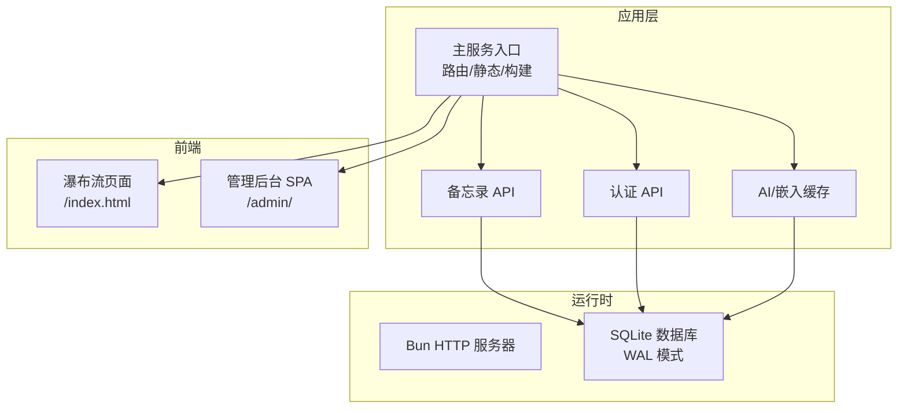
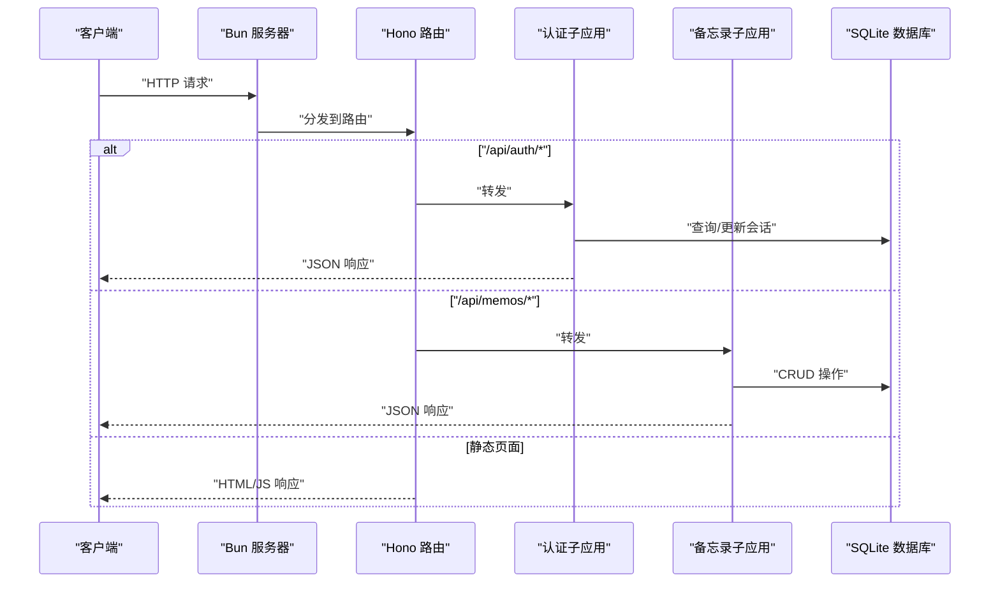
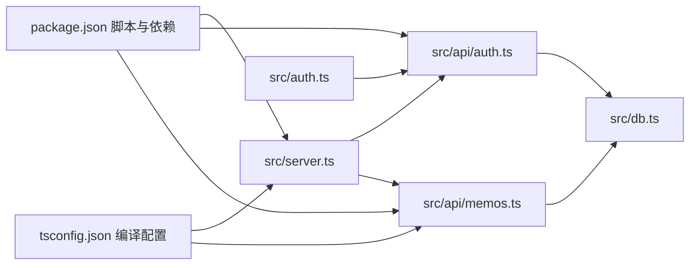

# 部署指南

<cite>
**本文引用的文件**
- [README.md](file://README.md)
- [package.json](file://package.json)
- [tsconfig.json](file://tsconfig.json)
- [src/server.ts](file://src/server.ts)
- [src/db.ts](file://src/db.ts)
- [src/auth.ts](file://src/auth.ts)
- [src/api/auth.ts](file://src/api/auth.ts)
- [src/api/memos.ts](file://src/api/memos.ts)
- [src/model.ts](file://src/model.ts)
- [script/initMemos.ts](file://script/initMemos.ts)
</cite>

## 目录
1. [简介](#简介)
2. [项目结构](#项目结构)
3. [核心组件](#核心组件)
4. [架构总览](#架构总览)
5. [详细组件分析](#详细组件分析)
6. [依赖关系分析](#依赖关系分析)
7. [性能考虑](#性能考虑)
8. [故障排查指南](#故障排查指南)
9. [结论](#结论)
10. [附录](#附录)

## 简介
本指南面向 memos 项目的部署与运维，覆盖开发、测试、生产三类环境的配置要点；提供容器化与云平台部署策略；说明静态资源与缓存策略；给出数据库初始化、迁移与备份方案；涵盖负载均衡与高可用配置；明确 SSL/TLS 证书与安全加固措施；提供监控与日志收集建议；制定回滚与灾备流程；并给出性能优化与资源调优建议。

## 项目结构
- 运行时：基于 Bun 的内置 HTTP 服务器与 SQLite 数据库（WAL 模式）。
- 前端：首页瀑布流与管理后台均为 SPA，通过服务端按需编译 TypeScript 到 ESM 并缓存。
- API：以子应用形式挂载在统一路由下，提供认证与备忘录相关接口。
- 配置：通过环境变量控制端口与管理员密钥；默认端口为 3020。

**图表来源**
- [src/server.ts:74-127](file://src/server.ts#L74-L127)
- [src/db.ts:15-57](file://src/db.ts#L15-L57)

**章节来源**
- [README.md:25-45](file://README.md#L25-L45)
- [src/server.ts:74-127](file://src/server.ts#L74-L127)
- [src/db.ts:15-57](file://src/db.ts#L15-L57)

## 核心组件
- 服务器与路由
  - 统一使用 Hono 路由，挂载认证与备忘录子应用。
  - 提供静态页面与 TypeScript 按需转译服务端渲染。
- 数据层
  - 使用 SQLite（WAL 模式），自动初始化表结构。
  - 提供备忘录、标签、提示词与创意内容等数据操作。
- 认证与会话
  - 基于 Cookie + 内存会话，支持登录频率限制。
  - 管理后台密钥通过环境变量配置。
- 构建与缓存
  - 服务端按需构建前端 TS → ESM，带 mtime 缓存。
- AI/嵌入缓存
  - 提供向量嵌入的生成、存储与清理能力。

**章节来源**
- [src/server.ts:15-51](file://src/server.ts#L15-L51)
- [src/db.ts:15-57](file://src/db.ts#L15-L57)
- [src/auth.ts:1-111](file://src/auth.ts#L1-L111)
- [src/api/auth.ts:14-27](file://src/api/auth.ts#L14-L27)
- [src/api/memos.ts:18-139](file://src/api/memos.ts#L18-L139)

## 架构总览
下图展示请求从客户端到服务端、数据库与静态资源的交互路径。

**图表来源**
- [src/server.ts:74-127](file://src/server.ts#L74-L127)
- [src/api/auth.ts:29-77](file://src/api/auth.ts#L29-L77)
- [src/api/memos.ts:18-139](file://src/api/memos.ts#L18-L139)
- [src/db.ts:15-57](file://src/db.ts#L15-L57)

## 详细组件分析

### 服务器与路由
- 端口与静态资源
  - 端口由环境变量控制，默认 3020。
  - 首页与管理后台页面通过静态文件与 TS 按需编译提供。
- 构建缓存
  - 以源文件 mtime 作为缓存键，避免重复构建。
- 未匹配路由
  - 对管理后台深层链接与 .ts 文件进行重定向或编译。

**章节来源**
- [src/server.ts:9-127](file://src/server.ts#L9-L127)

### 数据库层
- 初始化
  - 首次启动自动创建数据库文件与表结构（WAL 模式、外键开启）。
- 表结构
  - 备忘录、嵌入缓存、提示词、创意内容等表。
- 查询与聚合
  - 支持全文检索、标签筛选、计数统计等。
- 嵌入缓存
  - 提供嵌入的保存、删除与批量读取。

**章节来源**
- [src/db.ts:15-57](file://src/db.ts#L15-L57)
- [src/db.ts:99-131](file://src/db.ts#L99-L131)
- [src/db.ts:197-221](file://src/db.ts#L197-L221)

### 认证与会话
- 密钥管理
  - 管理后台密钥来自环境变量；生产环境必须显式设置。
- 会话机制
  - 内存会话集合；Cookie 设置 HttpOnly/SameSite/Max-Age。
- 登录限流
  - 基于 IP 的登录尝试次数与冷却时间控制。
- 中间件
  - 用于保护受保护的 API。

**章节来源**
- [src/api/auth.ts:14-27](file://src/api/auth.ts#L14-L27)
- [src/auth.ts:1-111](file://src/auth.ts#L1-L111)

### 备忘录 API
- 查询
  - 支持搜索、标签筛选、是否包含私有内容（需认证）。
  - 结合语义相似度结果进行增强合并。
- 创建/更新/删除
  - 创建与更新时触发嵌入生成；删除时清理嵌入缓存。
- 计数与标签
  - 提供总数统计与标签列表。

**章节来源**
- [src/api/memos.ts:18-139](file://src/api/memos.ts#L18-L139)

### 静态资源与缓存策略
- 首页瀑布流与管理后台均以 SPA 形式提供。
- 服务端按需编译前端 TS 到 ESM，并基于 mtime 缓存结果。
- 建议在反向代理层启用长期缓存与压缩（如 gzip/br）以提升性能。

**章节来源**
- [src/server.ts:15-51](file://src/server.ts#L15-L51)
- [src/server.ts:82-112](file://src/server.ts#L82-L112)

### AI/嵌入缓存
- 生成与存储嵌入，支持删除与批量读取。
- 在创建/更新备忘录时异步触发嵌入生成，失败不影响主流程。

**章节来源**
- [src/api/memos.ts:85-88](file://src/api/memos.ts#L85-L88)
- [src/db.ts:197-221](file://src/db.ts#L197-L221)

## 依赖关系分析
- 运行时依赖
  - Bun（内置 HTTP 服务器与 SQLite）、Hono（路由）、前端库（pretext、vanjs-core）。
- 构建与脚本
  - 通过 Bun.build 按需编译前端 TS；提供初始化脚本导入示例数据。

**图表来源**
- [package.json:6-21](file://package.json#L6-L21)
- [tsconfig.json](file://tsconfig.json)
- [src/server.ts:1-10](file://src/server.ts#L1-L10)
- [src/db.ts:1-3](file://src/db.ts#L1-L3)
- [src/auth.ts:1-3](file://src/auth.ts#L1-L3)
- [src/api/auth.ts:1-2](file://src/api/auth.ts#L1-L2)
- [src/api/memos.ts:1-2](file://src/api/memos.ts#L1-L2)

**章节来源**
- [package.json:6-21](file://package.json#L6-L21)
- [tsconfig.json](file://tsconfig.json)
- [src/server.ts:1-10](file://src/server.ts#L1-L10)
- [src/db.ts:1-3](file://src/db.ts#L1-L3)
- [src/auth.ts:1-3](file://src/auth.ts#L1-L3)
- [src/api/auth.ts:1-2](file://src/api/auth.ts#L1-L2)
- [src/api/memos.ts:1-2](file://src/api/memos.ts#L1-L2)

## 性能考虑
- 构建缓存
  - 服务端已按 mtime 缓存编译结果，避免重复构建。
- 数据库
  - 使用 WAL 模式提升并发读写性能；建议在高并发场景下评估连接池与事务粒度。
- 前端
  - 在反向代理层启用压缩与缓存；对静态资源设置长缓存头。
- 嵌入生成
  - 异步触发，避免阻塞主流程；建议在专用队列中执行以削峰填谷。

**章节来源**
- [src/server.ts:15-51](file://src/server.ts#L15-L51)
- [src/db.ts:9-10](file://src/db.ts#L9-L10)
- [src/api/memos.ts:85-88](file://src/api/memos.ts#L85-L88)

## 故障排查指南
- 端口占用
  - 检查环境变量 PORT 是否被占用；默认端口为 3020。
- 管理后台无法登录
  - 确认已设置生产环境下的管理员密钥；检查登录频率限制。
- 数据库异常
  - 确认数据库文件存在且可写；检查 WAL 模式与外键设置。
- 静态资源 404
  - 确认静态目录路径与 TS 编译入口正确；检查未匹配路由处理逻辑。
- 初始化脚本
  - 使用提供的脚本导入示例数据，注意去重与错误统计输出。

**章节来源**
- [src/server.ts:9](file://src/server.ts#L9)
- [src/api/auth.ts:14-27](file://src/api/auth.ts#L14-L27)
- [src/db.ts:8-13](file://src/db.ts#L8-L13)
- [src/server.ts:103-112](file://src/server.ts#L103-L112)
- [script/initMemos.ts:1-62](file://script/initMemos.ts#L1-L62)

## 结论
本指南提供了 memos 项目从开发到生产的完整部署思路，涵盖环境配置、容器化与云平台策略、静态资源与缓存、数据库初始化与备份、高可用与负载均衡、SSL/TLS 与安全加固、监控与日志、回滚与灾备以及性能优化建议。建议在生产环境中严格管理密钥与访问控制，并结合实际流量与硬件条件进行容量规划与调优。

## 附录

### 环境变量与默认值
- 端口
  - 名称：PORT
  - 默认值：3020
- 管理员密钥
  - 名称：MEMOS_SECRET_KEY
  - 默认值：开发环境为固定值；生产环境必须显式设置

**章节来源**
- [README.md:59-65](file://README.md#L59-L65)
- [src/api/auth.ts:14-27](file://src/api/auth.ts#L14-L27)

### 部署环境配置建议
- 开发环境
  - 使用默认端口与开发脚本；启用热重载；本地 SQLite 文件即可。
- 测试环境
  - 使用独立数据库实例或容器；模拟生产密钥；启用基本日志。
- 生产环境
  - 固定端口与密钥；启用 HTTPS；配置反向代理与缓存；监控与告警；定期备份。

**章节来源**
- [README.md:73-81](file://README.md#L73-L81)
- [src/api/auth.ts:17-27](file://src/api/auth.ts#L17-L27)

### Docker 容器化部署方案
- 基础镜像
  - 使用官方 Bun 镜像作为基础，安装运行时依赖。
- 应用打包
  - 将项目复制至镜像内，安装依赖并构建生产版本。
- 卷与持久化
  - 将数据库文件映射为持久卷；确保权限正确。
- 健康检查
  - 配置 HTTP 健康检查端点，探测服务可用性。
- 环境变量
  - 通过环境变量设置端口与密钥；避免硬编码。

**章节来源**
- [package.json:6-8](file://package.json#L6-L8)
- [src/db.ts:8](file://src/db.ts#L8)

### 云平台部署策略
- 容器编排
  - 使用 Kubernetes 部署 StatefulSet，挂载 PVC 存储数据库文件。
- 负载均衡
  - 使用 Ingress/NLB 分发流量；启用会话亲和或无状态设计。
- 自动扩缩容
  - 基于 CPU/内存或请求数阈值进行弹性伸缩。
- 多可用区
  - 将 Pod 分散到多个节点；数据库使用共享存储或主从复制。

**章节来源**
- [src/db.ts:8-13](file://src/db.ts#L8-L13)

### 静态资源处理与缓存策略
- 静态资源
  - 在反向代理层设置长期缓存与压缩；对 HTML 设置较短缓存。
- 前端编译
  - 服务端按需编译 TS；生产环境建议预编译并缓存。
- 版本化
  - 对 JS/CSS 添加内容指纹，避免缓存污染。

**章节来源**
- [src/server.ts:15-51](file://src/server.ts#L15-L51)

### 数据库迁移与备份方案
- 迁移
  - 使用 SQLite 的 ALTER TABLE 语句进行结构变更；变更前先备份。
- 备份
  - 停机备份：关闭服务后复制数据库文件。
  - 在线备份：使用 SQLite 的在线备份 API 或 WAL 日志归档。
- 恢复
  - 从备份文件恢复；验证完整性与一致性。

**章节来源**
- [src/db.ts:15-57](file://src/db.ts#L15-L57)

### 负载均衡与高可用配置
- 无状态设计
  - 认证与会话为内存态，建议使用外部会话存储或无状态认证。
- 多副本
  - 启动多个实例；通过反向代理分发请求。
- 数据库高可用
  - 使用主从复制或集群方案；配置自动故障转移。

**章节来源**
- [src/auth.ts:4-41](file://src/auth.ts#L4-L41)
- [src/db.ts:8-13](file://src/db.ts#L8-L13)

### SSL/TLS 证书配置与安全加固
- 证书
  - 在反向代理层配置 TLS 证书；启用强密码套件与协议版本。
- 安全头
  - 设置 HSTS、CSP、X-Frame-Options 等安全头。
- 访问控制
  - 限制管理后台访问来源；启用速率限制与 WAF。

**章节来源**
- [src/api/auth.ts:38-49](file://src/api/auth.ts#L38-L49)
- [src/auth.ts:43-55](file://src/auth.ts#L43-L55)

### 监控与日志收集配置
- 指标
  - 收集请求量、响应时间、错误率、数据库连接数等。
- 日志
  - 输出结构化日志；区分访问日志与应用日志；集中化存储与检索。
- 告警
  - 配置阈值告警与异常检测。

**章节来源**
- [src/server.ts:121-127](file://src/server.ts#L121-L127)

### 回滚策略与灾难恢复计划
- 回滚
  - 保留最近几个版本的镜像；快速回滚到上一个稳定版本。
- 灾难恢复
  - 定期备份数据库；演练恢复流程；验证数据一致性。

**章节来源**
- [src/db.ts:8-13](file://src/db.ts#L8-L13)

### 性能优化与资源调优建议
- 构建与缓存
  - 预编译前端资源；启用 mtime 缓存；减少编译开销。
- 数据库
  - 使用 WAL 模式；合理索引；控制事务大小。
- 运行时
  - 合理设置并发与内存上限；监控 GC 行为。

**章节来源**
- [src/server.ts:15-51](file://src/server.ts#L15-L51)
- [src/db.ts:9-10](file://src/db.ts#L9-L10)