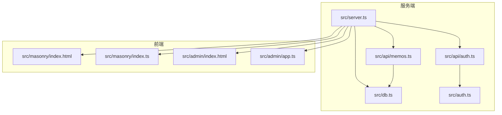
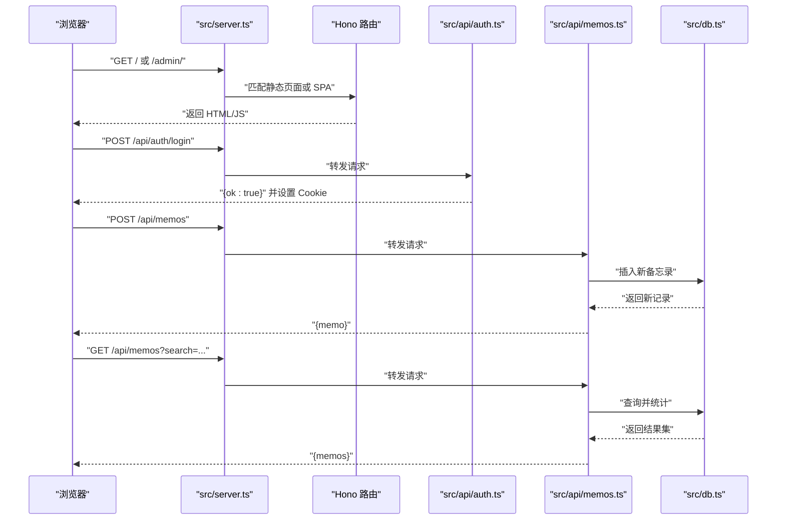
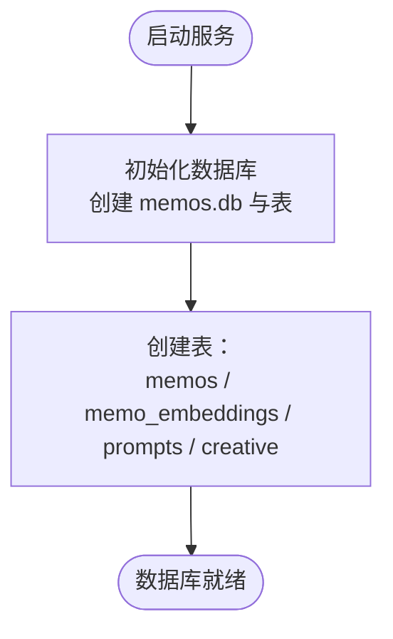
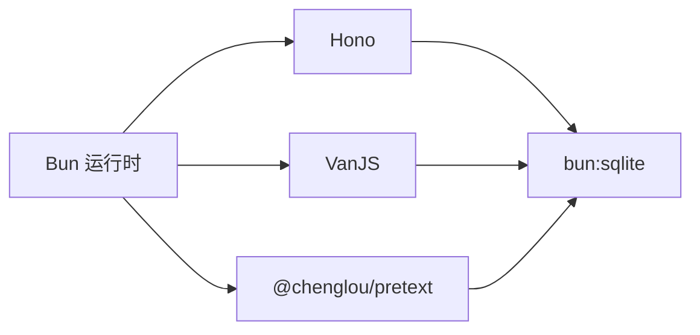

# 快速开始

<cite>
**本文引用的文件**
- [README.md](file://README.md)
- [package.json](file://package.json)
- [src/server.ts](file://src/server.ts)
- [src/db.ts](file://src/db.ts)
- [src/auth.ts](file://src/auth.ts)
- [src/api/auth.ts](file://src/api/auth.ts)
- [src/api/memos.ts](file://src/api/memos.ts)
- [src/masonry/index.html](file://src/masonry/index.html)
- [src/masonry/index.ts](file://src/masonry/index.ts)
- [src/admin/index.html](file://src/admin/index.html)
- [src/admin/app.ts](file://src/admin/app.ts)
- [script/initMemos.ts](file://script/initMemos.ts)
- [script/memos.txt](file://script/memos.txt)
</cite>

## 目录
1. [简介](#简介)
2. [项目结构](#项目结构)
3. [核心组件](#核心组件)
4. [架构总览](#架构总览)
5. [详细组件分析](#详细组件分析)
6. [依赖分析](#依赖分析)
7. [性能考虑](#性能考虑)
8. [故障排查](#故障排查)
9. [结论](#结论)
10. [附录](#附录)

## 简介
本指南面向初学者，帮助你在本地快速搭建并运行 memos 项目。你将了解环境要求、安装步骤、数据库初始化流程、环境变量配置、开发与生产模式的启动方式、默认访问地址与端口，以及如何创建第一个备忘录和登录管理后台。文档同时提供常见问题的解决方案，确保你能顺利上手。

## 项目结构
项目采用以“功能域”为主的分层组织方式：
- 顶层脚本用于数据库初始化与示例数据导入
- 服务端入口负责路由、静态资源与页面分发
- 数据库层封装 SQLite 初始化与 CRUD
- API 层提供认证与备忘录相关接口
- 前端包含瀑布流首页与独立的管理后台 SPA



图表来源
- [src/server.ts:1-127](file://src/server.ts#L1-L127)
- [src/api/auth.ts:1-54](file://src/api/auth.ts#L1-L54)
- [src/api/memos.ts:1-140](file://src/api/memos.ts#L1-L140)
- [src/db.ts:1-310](file://src/db.ts#L1-L310)
- [src/auth.ts:1-74](file://src/auth.ts#L1-L74)
- [src/masonry/index.html:1-270](file://src/masonry/index.html#L1-L270)
- [src/masonry/index.ts:1-391](file://src/masonry/index.ts#L1-L391)
- [src/admin/index.html:1-849](file://src/admin/index.html#L1-L849)
- [src/admin/app.ts:1-677](file://src/admin/app.ts#L1-L677)

章节来源
- [README.md:25-46](file://README.md#L25-L46)
- [src/server.ts:74-127](file://src/server.ts#L74-L127)

## 核心组件
- 服务端入口：负责路由注册、静态页面与客户端 JS 的按需构建、数据库与向量缓存初始化、HTTP 服务器启动
- 数据库层：封装 SQLite 初始化、表结构创建、增删改查与统计查询
- 认证模块：基于内存会话与 Cookie 的管理员认证，支持登录、登出与中间件校验
- API 层：
  - 认证 API：检查登录状态、登录、登出
  - 备忘录 API：列表查询（支持全文检索、标签筛选、私密内容查看）、标签列表、创建、更新、删除
- 前端：
  - 首页瀑布流：基于 @chenglou/pretext 的文本预排版与 Masonry 布局，支持搜索与标签筛选
  - 管理后台：VanJS SPA，提供登录、创建/编辑/切换可见性/删除备忘录等管理能力

章节来源
- [src/server.ts:1-127](file://src/server.ts#L1-L127)
- [src/db.ts:15-57](file://src/db.ts#L15-L57)
- [src/auth.ts:1-74](file://src/auth.ts#L1-L74)
- [src/api/auth.ts:11-54](file://src/api/auth.ts#L11-L54)
- [src/api/memos.ts:20-140](file://src/api/memos.ts#L20-L140)
- [src/masonry/index.html:1-270](file://src/masonry/index.html#L1-L270)
- [src/masonry/index.ts:1-391](file://src/masonry/index.ts#L1-L391)
- [src/admin/index.html:1-849](file://src/admin/index.html#L1-L849)
- [src/admin/app.ts:1-677](file://src/admin/app.ts#L1-L677)

## 架构总览
下面的序列图展示了从浏览器访问到服务端处理再到数据库交互的整体流程。



图表来源
- [src/server.ts:74-127](file://src/server.ts#L74-L127)
- [src/api/auth.ts:24-54](file://src/api/auth.ts#L24-L54)
- [src/api/memos.ts:20-140](file://src/api/memos.ts#L20-L140)
- [src/db.ts:127-164](file://src/db.ts#L127-L164)

## 详细组件分析

### 环境要求与安装
- 环境要求：Bun >= 1.3.3
- 安装依赖：执行安装命令后，项目即可运行
- 运行模式：
  - 开发模式：启用热重载
  - 生产模式：直接运行服务端入口

章节来源
- [README.md:49-57](file://README.md#L49-L57)
- [package.json:6-8](file://package.json#L6-L8)

### 环境变量配置
- PORT：服务器监听端口，默认 3020
- MEMOS_SECRET_KEY：管理员登录密钥，默认开发密钥，生产环境必须设置

章节来源
- [README.md:59-64](file://README.md#L59-L64)
- [src/server.ts:9](file://src/server.ts#L9)
- [src/api/auth.ts:11-20](file://src/api/auth.ts#L11-L20)

### 数据库初始化
- 首次启动时自动创建 SQLite 数据库文件与表结构
- 表结构包括：备忘录表、嵌入向量表、提示词表、创意内容表
- 提供初始化脚本与示例数据导入工具



图表来源
- [src/db.ts:15-57](file://src/db.ts#L15-L57)
- [script/initMemos.ts:7-8](file://script/initMemos.ts#L7-L8)

章节来源
- [README.md:66-72](file://README.md#L66-L72)
- [src/db.ts:15-57](file://src/db.ts#L15-L57)
- [script/initMemos.ts:10-17](file://script/initMemos.ts#L10-L17)

### 启动命令与访问地址
- 开发模式：bun run dev
- 生产模式：bun run start
- 默认访问地址：
  - 首页（瀑布流）：http://localhost:3020
  - 管理后台：http://localhost:3020/admin

章节来源
- [README.md:73-86](file://README.md#L73-L86)
- [src/server.ts:121-127](file://src/server.ts#L121-L127)

### 基本使用示例

#### 创建第一个备忘录
- 使用管理后台登录后，在“新建备忘录”表单中填写内容、标签与可见性，提交后即创建成功
- 或通过 API 直接调用创建接口，携带 Cookie 认证头

章节来源
- [src/admin/app.ts:89-114](file://src/admin/app.ts#L89-L114)
- [src/api/memos.ts:63-92](file://src/api/memos.ts#L63-L92)

#### 管理后台登录
- 在管理后台登录页输入密钥进行登录
- 登录成功后可查看、编辑、删除备忘录，切换可见性

章节来源
- [src/admin/app.ts:53-74](file://src/admin/app.ts#L53-L74)
- [src/api/auth.ts:29-53](file://src/api/auth.ts#L29-L53)

#### 首页搜索与标签筛选
- 在首页搜索框输入关键词，或选择标签进行筛选
- URL 会同步搜索与标签状态，支持前进/后退与书签

章节来源
- [src/masonry/index.html:6-27](file://src/masonry/index.html#L6-L27)
- [src/masonry/index.ts:308-351](file://src/masonry/index.ts#L308-L351)

### 认证与权限控制
- 认证机制：基于 Cookie 的内存会话，登录后返回带会话令牌的 Cookie
- 中间件：受保护的 API 需要有效会话令牌
- 密钥：默认开发密钥可在生产环境替换

```mermaid
sequenceDiagram
participant Client as "客户端"
participant AuthAPI as "认证 API"
participant Auth as "认证模块"
participant DB as "数据库"
Client->>AuthAPI : "POST /api/auth/login {key}"
AuthAPI->>Auth : "校验密钥"
Auth-->>AuthAPI : "生成会话令牌"
AuthAPI-->>Client : "Set-Cookie : memos_token=...; HttpOnly"
Client->>ProtectedAPI : "携带 Cookie 访问受保护接口"
ProtectedAPI->>Auth : "requireAuth()"
Auth-->>ProtectedAPI : "通过"
ProtectedAPI-->>Client : "返回受保护数据"
```

图表来源
- [src/api/auth.ts:29-53](file://src/api/auth.ts#L29-L53)
- [src/auth.ts:28-74](file://src/auth.ts#L28-L74)

章节来源
- [src/api/auth.ts:11-20](file://src/api/auth.ts#L11-L20)
- [src/auth.ts:28-74](file://src/auth.ts#L28-L74)

### 备忘录 API 与查询
- 列表查询支持：
  - 全文搜索（content LIKE）
  - 标签筛选
  - 私密内容查看（需认证）
- 支持标签列表、计数、创建、更新、删除

章节来源
- [src/api/memos.ts:20-140](file://src/api/memos.ts#L20-L140)

## 依赖分析
- 运行时：Bun
- Web 框架：Hono
- 前端框架：VanJS（管理后台）、@chenglou/pretext（首页瀑布流）
- 数据库：bun:sqlite（SQLite，WAL 模式）



图表来源
- [README.md:14-23](file://README.md#L14-L23)
- [package.json:16-20](file://package.json#L16-L20)

章节来源
- [README.md:14-23](file://README.md#L14-L23)
- [package.json:16-20](file://package.json#L16-L20)

## 性能考虑
- 首页瀑布流采用文本预排版与虚拟滚动策略，仅渲染可视区域卡片，滚动时动态回收/创建 DOM 节点，提升大列表渲染性能
- 客户端 TS 按需构建并带 mtime 缓存，减少重复编译开销
- 数据库使用 WAL 模式，提高并发读写性能

章节来源
- [README.md:180-186](file://README.md#L180-L186)
- [src/server.ts:15-51](file://src/server.ts#L15-L51)
- [src/db.ts:9](file://src/db.ts#L9)

## 故障排查
- 端口占用
  - 现象：启动时报端口冲突
  - 处理：修改 PORT 环境变量或释放占用端口
- 认证失败
  - 现象：登录后仍提示未授权
  - 处理：确认已正确设置 MEMOS_SECRET_KEY，且 Cookie 已随请求发送
- 数据库文件异常
  - 现象：数据库初始化失败或表不存在
  - 处理：删除 memos.db 后重启服务，或手动执行初始化脚本
- 管理后台空白或加载失败
  - 现象：登录页无法显示或 SPA 无法加载
  - 处理：检查 /admin/app.ts 是否成功编译为 /admin/app.js，确认静态路由映射

章节来源
- [src/server.ts:84-92](file://src/server.ts#L84-L92)
- [src/api/auth.ts:14-20](file://src/api/auth.ts#L14-L20)
- [src/db.ts:15-57](file://src/db.ts#L15-L57)

## 结论
通过本快速开始指南，你可以在本地完成环境准备、安装依赖、数据库初始化与服务启动，并成功创建第一个备忘录、登录管理后台。建议在生产环境中务必设置安全的 MEMOS_SECRET_KEY，并根据需要调整端口与部署方式。

## 附录

### 环境变量一览
- PORT：服务器监听端口，默认 3020
- MEMOS_SECRET_KEY：管理员登录密钥，默认开发密钥，生产环境必须设置

章节来源
- [README.md:59-64](file://README.md#L59-L64)
- [src/server.ts:9](file://src/server.ts#L9)
- [src/api/auth.ts:11-20](file://src/api/auth.ts#L11-L20)

### API 接口速览
- 认证
  - GET /api/auth/check：检查当前登录状态
  - POST /api/auth/login：登录，Body: { "key": "secret" }
  - POST /api/auth/logout：登出，清除 Cookie
- 备忘录
  - GET /api/memos：获取备忘录列表（支持 search、tag、all=true）
  - GET /api/memos/tags：获取所有标签
  - POST /api/memos：创建备忘录
  - PUT /api/memos/:id：更新备忘录
  - DELETE /api/memos/:id：删除备忘录

章节来源
- [README.md:104-121](file://README.md#L104-L121)
- [src/api/auth.ts:24-53](file://src/api/auth.ts#L24-L53)
- [src/api/memos.ts:20-140](file://src/api/memos.ts#L20-L140)