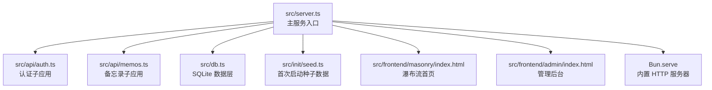
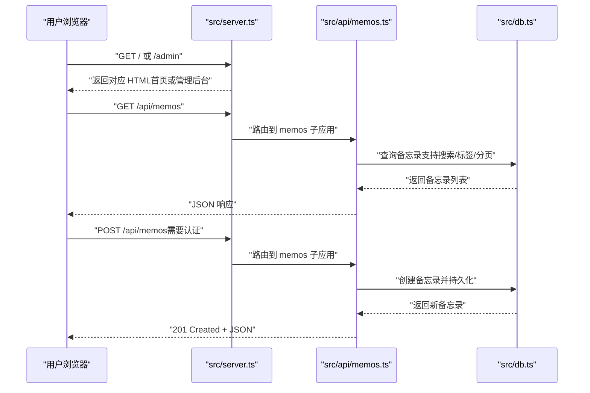
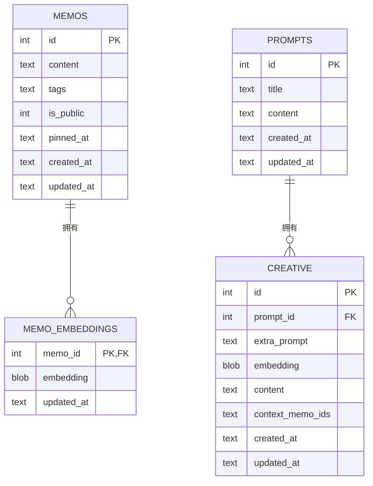
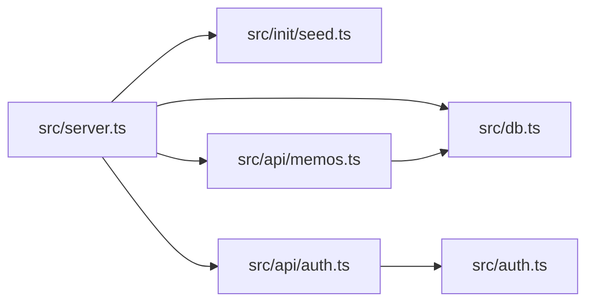

# 快速开始

<cite>
**本文引用的文件**   
- [README.md](file://README.md)
- [package.json](file://package.json)
- [src/server.ts](file://src/server.ts)
- [src/db.ts](file://src/db.ts)
- [src/auth.ts](file://src/auth.ts)
- [src/api/auth.ts](file://src/api/auth.ts)
- [src/api/memos.ts](file://src/api/memos.ts)
- [src/frontend/admin/index.html](file://src/frontend/admin/index.html)
- [src/frontend/masonry/index.html](file://src/frontend/masonry/index.html)
- [src/init/seed.ts](file://src/init/seed.ts)
- [memocli.ts](file://memocli.ts)
- [app.config.json](file://app.config.json)
- [src/config/app-config.ts](file://src/config/app-config.ts)
- [ai.config.json](file://ai.config.json)
</cite>

## 目录
1. [简介](#简介)
2. [项目结构](#项目结构)
3. [核心组件](#核心组件)
4. [架构总览](#架构总览)
5. [详细组件分析](#详细组件分析)
6. [依赖关系分析](#依赖关系分析)
7. [性能注意事项](#性能注意事项)
8. [故障排查指南](#故障排查指南)
9. [结论](#结论)
10. [附录](#附录)

## 简介
本指南面向新手，帮助你在约30分钟内完成 Memos 的环境准备、安装、启动与基础使用。你将学会：
- 环境要求与前置条件（重点是 Bun 版本）
- 从克隆到安装依赖的完整步骤
- 环境变量配置（PORT、MEMOS_SECRET_KEY）
- 数据库初始化（SQLite 自动创建与表结构）
- 开发模式与生产模式的启动方式对比
- 基本使用示例（创建第一个备忘录、管理后台操作）

## 项目结构
项目采用“服务端路由 + 前端页面”的一体化设计，核心入口为服务端文件，负责：
- 路由注册（API 与静态页面）
- 数据库初始化与种子数据
- 启动内置 HTTP 服务器

图表来源
- [src/server.ts:1-125](file://src/server.ts#L1-L125)
- [src/api/auth.ts:1-77](file://src/api/auth.ts#L1-L77)
- [src/api/memos.ts:1-220](file://src/api/memos.ts#L1-L220)
- [src/db.ts:1-479](file://src/db.ts#L1-L479)
- [src/init/seed.ts:1-118](file://src/init/seed.ts#L1-L118)
- [src/frontend/masonry/index.html:1-427](file://src/frontend/masonry/index.html#L1-L427)
- [src/frontend/admin/index.html:1-800](file://src/frontend/admin/index.html#L1-L800)

章节来源
- [README.md:25-46](file://README.md#L25-L46)
- [src/server.ts:1-125](file://src/server.ts#L1-L125)

## 核心组件
- 服务端入口与路由
  - 负责注册 API 子应用与页面路由，注入 base 标签以支持深层路径，处理 404 并回退到管理后台 SPA。
  - 在启动时初始化数据库、种子数据与向量缓存。
- 数据库层
  - 使用 SQLite（bun:sqlite），WAL 模式；自动创建 memos、memo_embeddings、prompts、creative 等表及索引。
- 认证模块
  - 支持 Cookie 会话与 Bearer Token 两种认证方式；登录受频率限制保护。
- API 子应用
  - 认证 API：登录、登出、状态检查
  - 备忘录 API：创建、更新、删除、置顶、查询、相似检索、标签聚合
- 前端页面
  - 首页瀑布流（Masonry）与管理后台（VanJS SPA），均通过服务端静态资源路由提供。

章节来源
- [src/server.ts:1-125](file://src/server.ts#L1-L125)
- [src/db.ts:1-479](file://src/db.ts#L1-L479)
- [src/auth.ts:1-128](file://src/auth.ts#L1-L128)
- [src/api/auth.ts:1-77](file://src/api/auth.ts#L1-L77)
- [src/api/memos.ts:1-220](file://src/api/memos.ts#L1-L220)
- [src/frontend/masonry/index.html:1-427](file://src/frontend/masonry/index.html#L1-L427)
- [src/frontend/admin/index.html:1-800](file://src/frontend/admin/index.html#L1-L800)

## 架构总览
下面的序列图展示了从浏览器访问到服务端处理的关键流程。

图表来源
- [src/server.ts:38-107](file://src/server.ts#L38-L107)
- [src/api/memos.ts:28-144](file://src/api/memos.ts#L28-L144)
- [src/db.ts:122-207](file://src/db.ts#L122-L207)

## 详细组件分析

### 环境要求与前置条件
- 运行时：Bun >= 1.3.3
- 依赖安装：使用 bun install
- 可选：若使用命令行工具 memocli，需设置 MEMOS_API_URL 与 MEMOS_SECRET_KEY

章节来源
- [README.md:49-57](file://README.md#L49-L57)
- [memocli.ts:6-9](file://memocli.ts#L6-L9)

### 安装步骤
- 克隆仓库后，在项目根目录执行依赖安装
- 若需要构建前端产物，先执行构建脚本，再启动服务

章节来源
- [README.md:53-57](file://README.md#L53-L57)
- [package.json:6-11](file://package.json#L6-L11)

### 环境变量配置
- PORT：服务器监听端口，默认 3020
- MEMOS_SECRET_KEY：管理员登录密钥，默认 123（生产环境必须覆盖）

章节来源
- [README.md:59-65](file://README.md#L59-L65)
- [src/api/auth.ts:14-27](file://src/api/auth.ts#L14-L27)

### 数据库初始化
- 首次启动自动创建 SQLite 文件（memos.db，WAL 模式）
- 自动创建以下表与索引：
  - memos：id、content、tags、is_public、pinned_at、created_at、updated_at
  - memo_embeddings：memo_id（外键）、embedding、updated_at
  - prompts：id、title、content、created_at、updated_at
  - creative：id、prompt_id（外键）、extra_prompt、embedding、content、context_memo_ids、created_at、updated_at
- 首次启动还会导入内置提示词与示例备忘录

图表来源
- [src/db.ts:18-60](file://src/db.ts#L18-L60)

章节来源
- [README.md:66-72](file://README.md#L66-L72)
- [src/db.ts:15-61](file://src/db.ts#L15-L61)
- [src/init/seed.ts:16-110](file://src/init/seed.ts#L16-L110)

### 开发模式与生产模式
- 开发模式：启用热重载，适合本地调试
- 生产模式：先构建前端产物，再启动服务

章节来源
- [README.md:73-81](file://README.md#L73-L81)
- [package.json:7-11](file://package.json#L7-L11)

### 基本使用示例

#### 通过管理后台创建第一个备忘录
- 登录管理后台（默认密钥可在环境变量中配置）
- 在表单中填写内容、标签，选择公开或私密
- 点击提交，即可在首页瀑布流中看到新创建的备忘录

章节来源
- [README.md:88-99](file://README.md#L88-L99)
- [src/frontend/admin/index.html:1-800](file://src/frontend/admin/index.html#L1-L800)

#### 通过命令行工具创建备忘录
- 设置 MEMOS_API_URL 与 MEMOS_SECRET_KEY
- 使用 memocli -c "内容" -t "标签1,标签2" --public（或 --private）创建备忘录

章节来源
- [memocli.ts:6-9](file://memocli.ts#L6-L9)
- [memocli.ts:89-162](file://memocli.ts#L89-L162)

#### 通过 API 创建备忘录
- POST /api/memos（需要认证）
- Body：content、is_public、tags（可选）
- 成功返回 201 与新建备忘录对象

章节来源
- [README.md:100-121](file://README.md#L100-L121)
- [src/api/memos.ts:103-144](file://src/api/memos.ts#L103-L144)

#### 在首页瀑布流中查看与交互
- 支持搜索、标签筛选、置顶、复制、相似检索等
- URL 参数与状态同步，支持浏览器前进/后退与书签

章节来源
- [README.md:178-186](file://README.md#L178-L186)
- [src/frontend/masonry/index.html:1-427](file://src/frontend/masonry/index.html#L1-L427)

## 依赖关系分析
- 服务端入口依赖数据库层、认证模块、API 子应用与种子数据初始化
- API 子应用依赖数据库层与速率限制辅助函数
- 前端页面由服务端静态资源路由提供

图表来源
- [src/server.ts:1-125](file://src/server.ts#L1-L125)
- [src/db.ts:1-479](file://src/db.ts#L1-L479)
- [src/init/seed.ts:1-118](file://src/init/seed.ts#L1-L118)
- [src/api/auth.ts:1-77](file://src/api/auth.ts#L1-L77)
- [src/api/memos.ts:1-220](file://src/api/memos.ts#L1-L220)
- [src/auth.ts:1-128](file://src/auth.ts#L1-L128)

章节来源
- [src/server.ts:1-125](file://src/server.ts#L1-L125)

## 性能注意事项
- 首次启动会进行数据库初始化与向量缓存初始化，建议在开发机上等待完成
- 瀑布流布局采用虚拟滚动，滚动时仅渲染可视区域卡片，减少 DOM 负担
- 备忘录列表支持分页，避免一次性传输大量数据

## 故障排查指南
- 启动失败（端口占用）
  - 检查 PORT 环境变量是否被其他进程占用
- 认证失败
  - 确认 MEMOS_SECRET_KEY 是否正确设置；管理后台登录与 API Bearer 认证均依赖该密钥
- API 429 频率限制
  - 短时间内创建过多备忘录会被限流，稍后再试
- 数据库文件无法创建
  - 确认运行目录具有写权限；首次启动会自动创建 memos.db

章节来源
- [src/server.ts:11-125](file://src/server.ts#L11-L125)
- [src/api/auth.ts:14-27](file://src/api/auth.ts#L14-L27)
- [src/api/memos.ts:120-124](file://src/api/memos.ts#L120-L124)
- [src/db.ts:15-13](file://src/db.ts#L15-L13)

## 结论
按照本指南，你可以在 30 分钟内完成环境准备、安装与启动，并体验到备忘录的创建、管理后台操作与首页瀑布流展示。建议在生产环境中务必设置安全的 MEMOS_SECRET_KEY，并根据需要调整应用配置与速率限制策略。

## 附录

### 环境变量一览
- PORT：服务器监听端口，默认 3020
- MEMOS_SECRET_KEY：管理员登录密钥，默认 123（生产必须覆盖）

章节来源
- [README.md:59-65](file://README.md#L59-L65)

### 应用配置与速率限制
- 应用配置来自 app.config.json，包含 AI 请求超时、默认 token 数、温度、重排开关与候选数量、重排最终数量、各类速率限制等
- 速率限制用于控制备忘录与 AI 请求的频率

章节来源
- [app.config.json:1-22](file://app.config.json#L1-L22)
- [src/config/app-config.ts:1-108](file://src/config/app-config.ts#L1-L108)

### AI 提供商配置
- ai.config.json 定义了多家大模型提供商的 endpoint、API Key 环境变量与可用模型
- 默认提供者与模型可在配置中指定

章节来源
- [ai.config.json:1-44](file://ai.config.json#L1-L44)