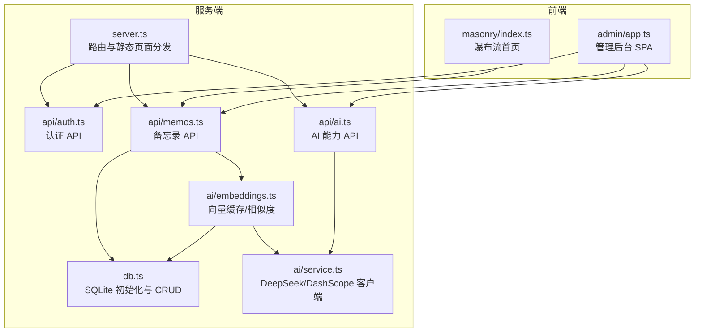
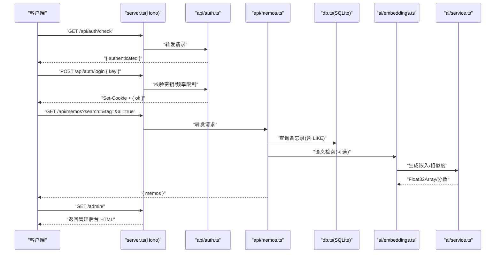
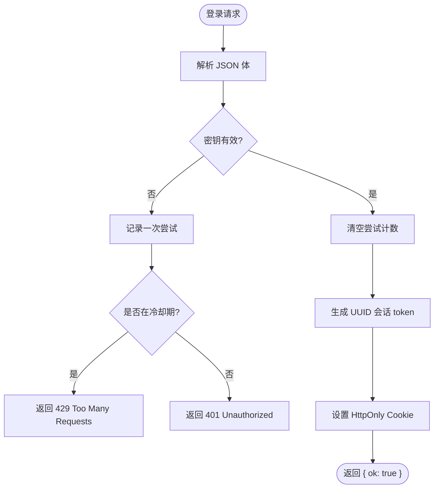
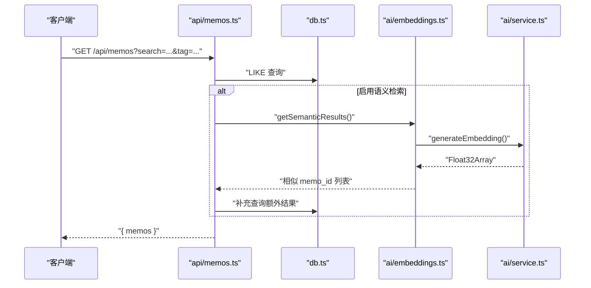
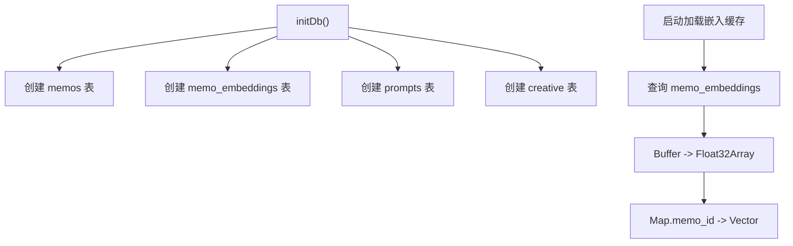
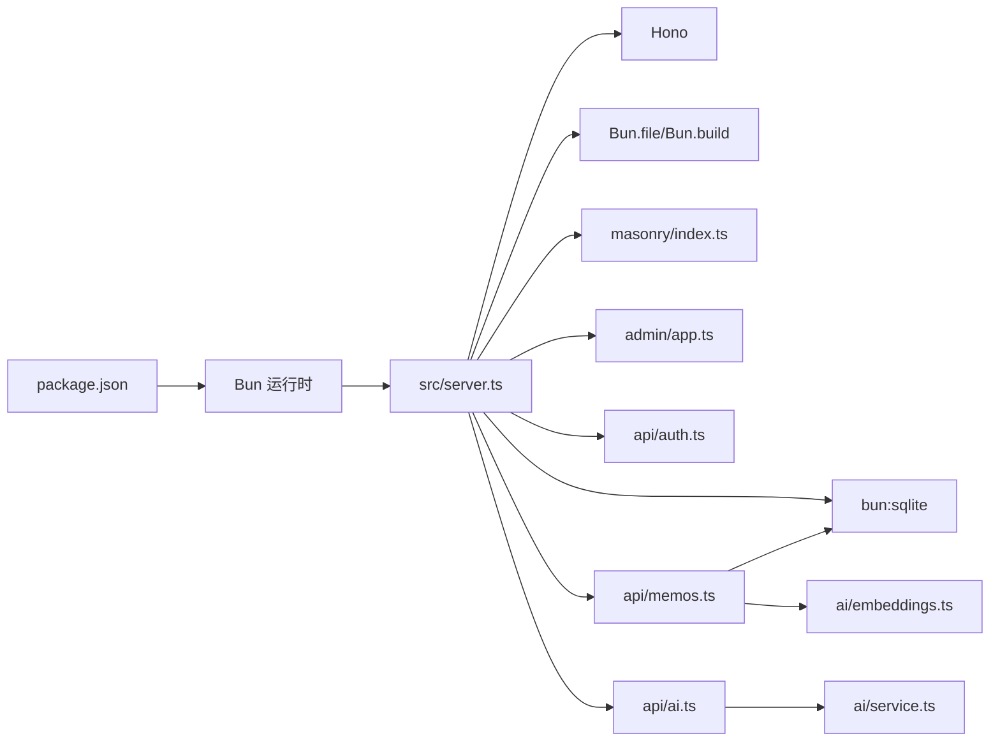

# 故障排除

<cite>
**本文引用的文件**
- [README.md](file://README.md)
- [package.json](file://package.json)
- [src/server.ts](file://src/server.ts)
- [src/db.ts](file://src/db.ts)
- [src/auth.ts](file://src/auth.ts)
- [src/api/auth.ts](file://src/api/auth.ts)
- [src/api/memos.ts](file://src/api/memos.ts)
- [src/api/ai.ts](file://src/api/ai.ts)
- [src/ai/service.ts](file://src/ai/service.ts)
- [src/ai/embeddings.ts](file://src/ai/embeddings.ts)
- [src/util.ts](file://src/util.ts)
- [src/masonry/index.ts](file://src/masonry/index.ts)
- [src/admin/app.ts](file://src/admin/app.ts)
- [script/initMemos.ts](file://script/initMemos.ts)
</cite>

## 目录
1. [简介](#简介)
2. [项目结构](#项目结构)
3. [核心组件](#核心组件)
4. [架构总览](#架构总览)
5. [详细组件分析](#详细组件分析)
6. [依赖关系分析](#依赖关系分析)
7. [性能考虑](#性能考虑)
8. [故障排除指南](#故障排除指南)
9. [结论](#结论)
10. [附录](#附录)

## 简介
本指南面向运维与开发人员，系统化梳理 memos 项目的常见问题与解决路径，覆盖安装与运行、启动失败、数据库连接与初始化、认证与权限、网络与 AI 服务、性能与资源瓶颈、日志与监控、以及升级与迁移注意事项。文档以仓库现有实现为依据，结合代码结构与 API 行为，提供可操作的诊断步骤与优化建议。

## 项目结构
- 运行时与技术栈：基于 Bun 运行时，内置 SQLite（bun:sqlite），Hono 作为 Web 框架，前端使用 @chenglou/pretext（瀑布流）与 VanJS（管理后台）。
- 关键模块：
  - 服务入口与路由：server.ts
  - 数据层：db.ts（SQLite 初始化、CRUD、向量嵌入表）
  - 认证与会话：auth.ts + api/auth.ts
  - API 子域：memos.ts、ai.ts、creative.ts（由 server.ts 聚合）
  - AI 服务：ai/service.ts（DeepSeek/DashScope）、ai/embeddings.ts（向量缓存与语义检索）
  - 前端：masonry/index.ts（瀑布流）、admin/app.ts（管理后台 SPA）
  - 工具与辅助：util.ts；脚本：script/initMemos.ts

图表来源
- [src/server.ts:74-127](file://src/server.ts#L74-L127)
- [src/api/auth.ts:25-69](file://src/api/auth.ts#L25-L69)
- [src/api/memos.ts:18-140](file://src/api/memos.ts#L18-L140)
- [src/api/ai.ts:6-67](file://src/api/ai.ts#L6-L67)
- [src/db.ts:15-57](file://src/db.ts#L15-L57)
- [src/ai/embeddings.ts:12-99](file://src/ai/embeddings.ts#L12-L99)
- [src/ai/service.ts:12-289](file://src/ai/service.ts#L12-L289)
- [src/masonry/index.ts:352-391](file://src/masonry/index.ts#L352-L391)
- [src/admin/app.ts:40-74](file://src/admin/app.ts#L40-L74)

章节来源
- [README.md:25-45](file://README.md#L25-L45)
- [package.json:6-9](file://package.json#L6-L9)

## 核心组件
- 服务入口与路由
  - 统一挂载 /api/* 子应用，处理 /admin/* 与 /index.* 的前端资源请求，未匹配时返回 404 或重定向至 SPA。
  - 启动时初始化数据库与向量缓存，随后启动 HTTP 服务。
- 数据库层
  - 使用 SQLite（WAL 模式），自动创建 memos、memo_embeddings、prompts、creative 表。
  - 提供备忘录 CRUD、标签查询、计数、向量嵌入的增删改查。
- 认证与权限
  - 内存会话（重启丢失），Cookie 名称固定，支持登录频率限制与中间件鉴权。
  - 管理员密钥来自环境变量 MEMOS_SECRET_KEY，生产环境必须显式设置。
- AI 能力
  - DeepSeek：内容优化、标签建议、创意生成（含流式）。
  - DashScope：文本嵌入生成，用于语义检索与相似度计算。
  - 向量缓存：内存中维护 memo_id -> Float32Array 映射，启动时从数据库加载。
- 前端
  - 瀑布流首页：实时搜索、标签筛选、URL 同步、虚拟滚动。
  - 管理后台：登录、创建/编辑/切换可见性/删除、AI 优化与标签建议。

章节来源
- [src/server.ts:74-127](file://src/server.ts#L74-L127)
- [src/db.ts:15-57](file://src/db.ts#L15-L57)
- [src/auth.ts:28-108](file://src/auth.ts#L28-L108)
- [src/api/auth.ts:14-23](file://src/api/auth.ts#L14-L23)
- [src/ai/service.ts:12-289](file://src/ai/service.ts#L12-L289)
- [src/ai/embeddings.ts:12-99](file://src/ai/embeddings.ts#L12-L99)
- [src/masonry/index.ts:308-351](file://src/masonry/index.ts#L308-L351)
- [src/admin/app.ts:40-74](file://src/admin/app.ts#L40-L74)

## 架构总览

图表来源
- [src/server.ts:74-127](file://src/server.ts#L74-L127)
- [src/api/auth.ts:27-69](file://src/api/auth.ts#L27-L69)
- [src/api/memos.ts:20-48](file://src/api/memos.ts#L20-L48)
- [src/db.ts:99-131](file://src/db.ts#L99-L131)
- [src/ai/embeddings.ts:66-86](file://src/ai/embeddings.ts#L66-L86)
- [src/ai/service.ts:81-90](file://src/ai/service.ts#L81-L90)

## 详细组件分析

### 认证与会话（auth.ts 与 api/auth.ts）
- 密钥来源与生产告警
  - 若未设置 MEMOS_SECRET_KEY 且处于生产环境，将记录致命日志并退出进程。
  - 开发环境使用默认密钥，但会输出警告。
- 登录频率限制
  - 基于 IP 的滑动窗口计数，超过阈值返回 429 并提示等待秒数。
- 会话存储
  - 内存集合保存 token，重启丢失；Cookie 设置为 HttpOnly + SameSite=Strict。
- 中间件与鉴权
  - requireAuth 返回 401；authMiddleware 在未通过时直接中断后续处理。

图表来源
- [src/api/auth.ts:33-60](file://src/api/auth.ts#L33-L60)
- [src/auth.ts:57-89](file://src/auth.ts#L57-L89)

章节来源
- [src/api/auth.ts:14-23](file://src/api/auth.ts#L14-L23)
- [src/auth.ts:28-108](file://src/auth.ts#L28-L108)

### 备忘录 API（api/memos.ts）
- 查询参数
  - search：全文模糊匹配 content
  - tag：精确匹配 tag
  - all=true：需认证才返回私密备忘录
- 语义检索
  - 当提供 search 时，异步触发向量相似度检索，合并去重后返回。
- 内容变更与嵌入
  - 新建/更新时异步生成并存储嵌入；删除时清理缓存与数据库条目。

图表来源
- [src/api/memos.ts:20-48](file://src/api/memos.ts#L20-L48)
- [src/db.ts:99-131](file://src/db.ts#L99-L131)
- [src/ai/embeddings.ts:66-86](file://src/ai/embeddings.ts#L66-L86)
- [src/ai/service.ts:147-181](file://src/ai/service.ts#L147-L181)

章节来源
- [src/api/memos.ts:18-140](file://src/api/memos.ts#L18-L140)
- [src/db.ts:99-131](file://src/db.ts#L99-L131)

### 数据库层（db.ts）
- 初始化
  - 自动创建 memos、memo_embeddings、prompts、creative 表，启用 WAL 与外键约束。
- 查询与更新
  - 支持按条件组合查询、计数、标签去重排序、更新时间戳自动刷新。
- 嵌入表
  - memo_id -> BLOB（Float32Array 序列化）；启动时加载到内存缓存。

图表来源
- [src/db.ts:15-57](file://src/db.ts#L15-L57)
- [src/ai/embeddings.ts:12-35](file://src/ai/embeddings.ts#L12-L35)

章节来源
- [src/db.ts:15-57](file://src/db.ts#L15-L57)
- [src/ai/embeddings.ts:12-35](file://src/ai/embeddings.ts#L12-L35)

### AI 服务与嵌入（ai/service.ts 与 ai/embeddings.ts）
- 能力检测
  - 通过环境变量判断 DeepSeek（内容优化/标签建议/创意）与 DashScope（嵌入）可用性。
- 请求超时
  - 统一 60 秒超时，避免阻塞。
- 嵌入缓存
  - 内存 Map 缓存，启动时从数据库恢复；相似度使用余弦距离。
- 流式生成
  - 管理后台创意生成支持流式返回，便于交互体验。

章节来源
- [src/ai/service.ts:12-289](file://src/ai/service.ts#L12-L289)
- [src/ai/embeddings.ts:12-99](file://src/ai/embeddings.ts#L12-L99)

### 前端组件（masonry/index.ts 与 admin/app.ts）
- 瀑布流
  - 预排版与布局计算，虚拟滚动只渲染可视区域；支持搜索与标签筛选，URL 同步。
- 管理后台
  - 登录、创建/编辑/切换可见性/删除；AI 优化与标签建议；错误全局提示。

章节来源
- [src/masonry/index.ts:146-269](file://src/masonry/index.ts#L146-L269)
- [src/admin/app.ts:40-74](file://src/admin/app.ts#L40-L74)

## 依赖关系分析
- 运行时与构建
  - package.json 定义 dev/start 脚本，使用 Bun 运行 server.ts。
- 外部依赖
  - Hono（HTTP 框架）、@chenglou/pretext（排版与布局）、vanjs-core（UI）。
- 环境变量
  - PORT、MEMOS_SECRET_KEY（认证）、DEEPSEEK_*、DASHSCOPE_*（AI）。

图表来源
- [package.json:6-9](file://package.json#L6-L9)
- [src/server.ts:15-51](file://src/server.ts#L15-L51)
- [src/api/memos.ts:18-140](file://src/api/memos.ts#L18-L140)
- [src/ai/embeddings.ts:12-99](file://src/ai/embeddings.ts#L12-L99)
- [src/ai/service.ts:12-289](file://src/ai/service.ts#L12-L289)

章节来源
- [package.json:6-21](file://package.json#L6-L21)
- [src/server.ts:15-51](file://src/server.ts#L15-L51)

## 性能考虑
- 前端瀑布流
  - 虚拟滚动与预排版减少 DOM 数量与重排开销；建议保持内容长度适中，避免超长文本导致布局计算压力。
- API 查询
  - LIKE 模糊匹配在大数据集上可能较慢；建议配合 tag 精确筛选或使用语义检索减少主查询范围。
- 嵌入与相似度
  - 内存缓存命中率影响语义检索性能；确保首次启动后缓存完整加载。
- 构建与缓存
  - 客户端 JS 按文件 mtime 缓存，开发模式热重载；生产建议关闭 minify 以外的优化以保证稳定性。

章节来源
- [src/masonry/index.ts:146-269](file://src/masonry/index.ts#L146-L269)
- [src/api/memos.ts:20-48](file://src/api/memos.ts#L20-L48)
- [src/ai/embeddings.ts:12-35](file://src/ai/embeddings.ts#L12-L35)
- [src/server.ts:15-51](file://src/server.ts#L15-L51)

## 故障排除指南

### 一、安装与运行问题
- 症状：安装命令报错或无法启动
  - 检查 Bun 版本是否满足要求（>= 1.3.3）。
  - 确认已执行安装命令安装依赖。
  - 确认端口未被占用（默认 3020）。
- 症状：启动后无法访问页面
  - 检查服务是否监听到端口；查看控制台日志输出。
  - 确认 /admin 与 / 对应的静态页面与前端资源已正确编译与返回。

章节来源
- [README.md:49-81](file://README.md#L49-L81)
- [package.json:6-9](file://package.json#L6-L9)
- [src/server.ts:121-127](file://src/server.ts#L121-L127)

### 二、启动失败与端口占用
- 现象：进程启动即退出或端口被占用
  - 查看标准错误输出，定位初始化阶段的异常（如数据库文件权限、构建失败）。
  - 更换 PORT 环境变量或释放占用端口。
- 症状：静态资源 404
  - 确认前端 .ts 文件已成功构建；检查 serveJs/serveHtml 的路径映射与文件存在性。

章节来源
- [src/server.ts:15-51](file://src/server.ts#L15-L51)
- [src/server.ts:53-72](file://src/server.ts#L53-L72)

### 三、数据库连接与初始化错误
- 症状：首次启动无数据表或查询异常
  - 确认 memos.db 文件存在且可写；WAL 模式与外键约束已启用。
  - 检查 initDb 是否执行成功；若失败，查看控制台错误日志。
- 症状：嵌入缓存为空或相似度无效
  - 确认 DASHSCOPE_* 环境变量已配置；检查 generateEmbedding 返回值。
  - 观察启动日志“加载嵌入”条目数量是否与预期一致。

章节来源
- [src/db.ts:15-57](file://src/db.ts#L15-L57)
- [src/ai/embeddings.ts:12-35](file://src/ai/embeddings.ts#L12-L35)
- [src/ai/service.ts:147-181](file://src/ai/service.ts#L147-L181)

### 四、认证与权限问题
- 症状：登录 401 或频繁 429
  - 检查 MEMOS_SECRET_KEY 是否正确设置；生产环境必须显式配置。
  - 查看登录尝试计数与冷却时间，等待冷却结束。
- 症状：管理后台无法进入或页面跳转异常
  - 确认 Cookie 已设置且未过期；检查 /api/auth/check 是否返回已认证。
  - 管理后台 SPA 的深层链接由 server.ts 的 notFound 逻辑兜底。

章节来源
- [src/api/auth.ts:14-23](file://src/api/auth.ts#L14-L23)
- [src/auth.ts:57-108](file://src/auth.ts#L57-L108)
- [src/server.ts:103-112](file://src/server.ts#L103-L112)

### 五、网络连接与 AI 服务问题
- 症状：AI 优化/标签建议/嵌入不可用
  - 检查 DEEPSEEK_* 或 DASHSCOPE_* 环境变量是否配置；确认网络可达对应域名。
  - 观察请求超时（60 秒）与错误日志，必要时调整代理或网络策略。
- 症状：流式生成异常
  - 确认 DeepSeek 支持流式返回；检查响应体解析与 [DONE] 结束信号。

章节来源
- [src/ai/service.ts:12-289](file://src/ai/service.ts#L12-L289)
- [src/api/ai.ts:8-67](file://src/api/ai.ts#L8-L67)

### 六、性能问题识别与优化
- 症状：瀑布流滚动卡顿
  - 减少单条 memo 内容长度；降低字体/行高/间距；避免一次性渲染过多卡片。
- 症状：API 查询缓慢
  - 优先使用 tag 精确筛选；避免大范围 LIKE；利用语义检索减少主查询。
- 症状：登录频繁受限
  - 调整客户端重试策略，避免短时间多次尝试；合理设置冷却时间。

章节来源
- [src/masonry/index.ts:146-269](file://src/masonry/index.ts#L146-L269)
- [src/api/memos.ts:20-48](file://src/api/memos.ts#L20-L48)
- [src/auth.ts:57-89](file://src/auth.ts#L57-L89)

### 七、日志分析与系统监控
- 日志位置
  - 控制台输出：构建错误、AI 请求错误、嵌入加载信息。
- 建议监控指标
  - HTTP 请求量与错误码分布（401/404/429/5xx）
  - 前端瀑布流渲染耗时（布局计算与 DOM 更新）
  - AI 请求延迟与成功率
- 健康检查
  - GET /api/auth/check：确认认证子系统可用
  - GET /api/ai/status：确认 AI 能力可用性
  - GET /api/memos/count：确认数据库读写正常

章节来源
- [src/server.ts:15-51](file://src/server.ts#L15-L51)
- [src/api/auth.ts:27-30](file://src/api/auth.ts#L27-L30)
- [src/api/ai.ts:8-11](file://src/api/ai.ts#L8-L11)
- [src/api/memos.ts:50-55](file://src/api/memos.ts#L50-L55)

### 八、升级与迁移注意事项
- 升级 Bun/依赖
  - 升级前备份 memos.db；运行前先执行 dev 模式验证构建与路由。
- 数据迁移
  - 新增表或字段时，确保 initDb 逻辑兼容旧版本；可增加版本号与迁移脚本。
- 环境变量变更
  - MEMOS_SECRET_KEY 生产必设；AI 相关变量变更后需重启生效。
- 脚本迁移
  - 使用 script/initMemos.ts 导入初始数据时，注意去重与错误统计。

章节来源
- [src/db.ts:15-57](file://src/db.ts#L15-L57)
- [script/initMemos.ts:10-52](file://script/initMemos.ts#L10-L52)

### 九、常见错误代码与异常处理
- HTTP 状态码
  - 400：请求体无效或必填字段缺失（JSON 解析失败、内容为空）
  - 401：未认证或密钥无效
  - 404：备忘录不存在
  - 429：登录尝试过多
  - 500：AI 服务内部错误
  - 503：AI 能力未配置
- 异常来源
  - 认证：密钥校验与登录频率限制
  - API：JSON 解析、参数校验、数据库事务
  - 前端：fetch 错误、URL 同步异常

章节来源
- [src/api/auth.ts:33-60](file://src/api/auth.ts#L33-L60)
- [src/api/memos.ts:63-92](file://src/api/memos.ts#L63-L92)
- [src/api/memos.ts:94-139](file://src/api/memos.ts#L94-L139)
- [src/api/ai.ts:13-40](file://src/api/ai.ts#L13-L40)
- [src/masonry/index.ts:347-351](file://src/masonry/index.ts#L347-L351)

## 结论
本指南基于项目现有实现，提供了从安装、运行、认证、数据库、AI 服务到前端性能与监控的系统化故障排除路径。建议在生产环境中严格配置环境变量、监控关键指标，并在升级与迁移前做好备份与验证。

## 附录
- 环境变量清单
  - PORT：服务器监听端口（默认 3020）
  - MEMOS_SECRET_KEY：管理员登录密钥（生产必设）
  - DEEPSEEK_*：DeepSeek API 相关（Base URL 与 Key）
  - DASHSCOPE_*：DashScope API Key（嵌入）
- 快速参考
  - 管理后台：/admin
  - API 前缀：/api
  - 首页瀑布流：/

章节来源
- [README.md:59-87](file://README.md#L59-L87)
- [src/server.ts:9-10](file://src/server.ts#L9-L10)
- [src/api/auth.ts:14-23](file://src/api/auth.ts#L14-L23)
- [src/ai/service.ts:6-8](file://src/ai/service.ts#L6-L8)