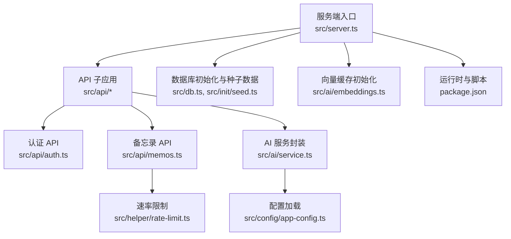
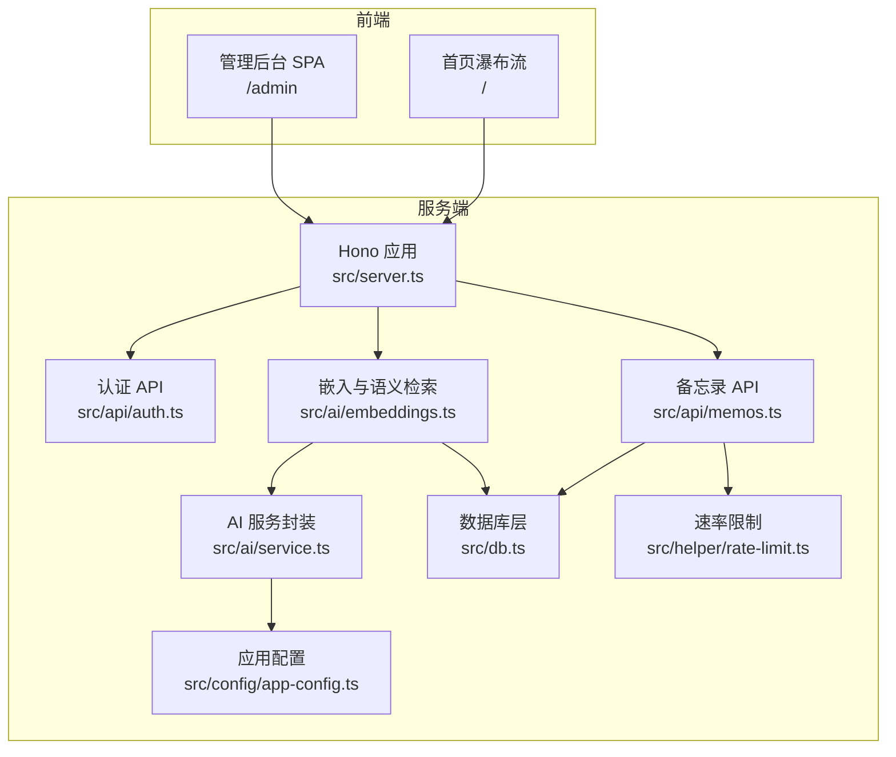
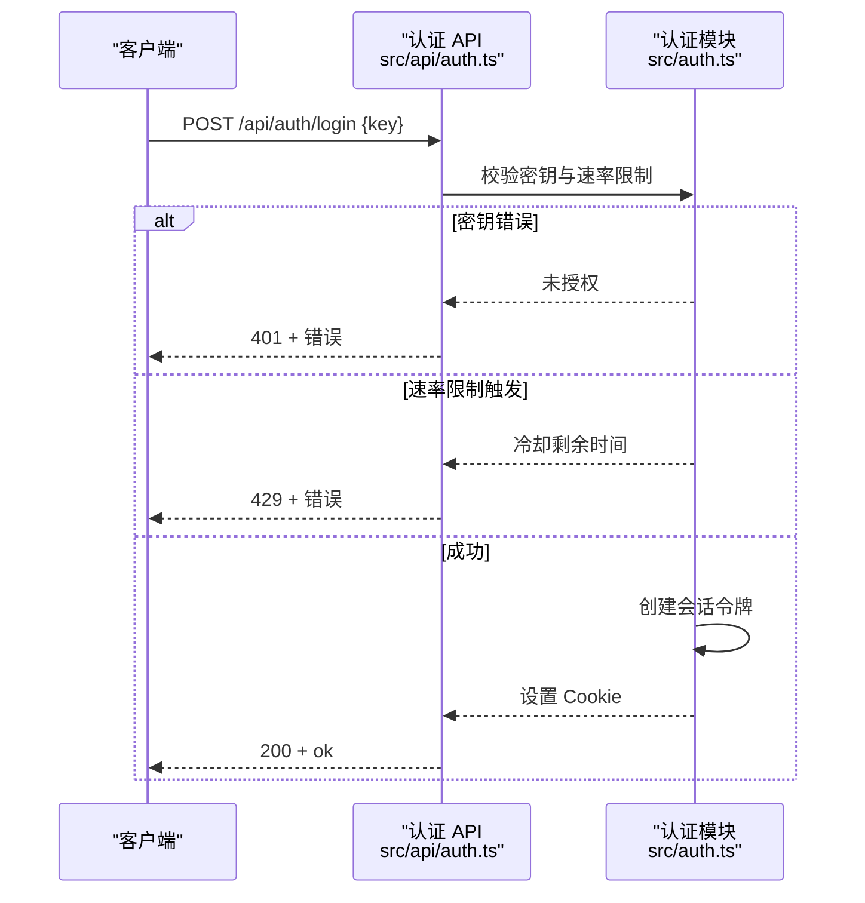
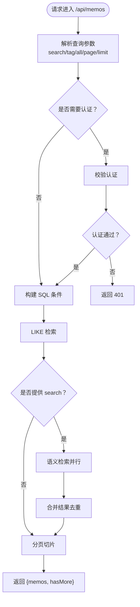
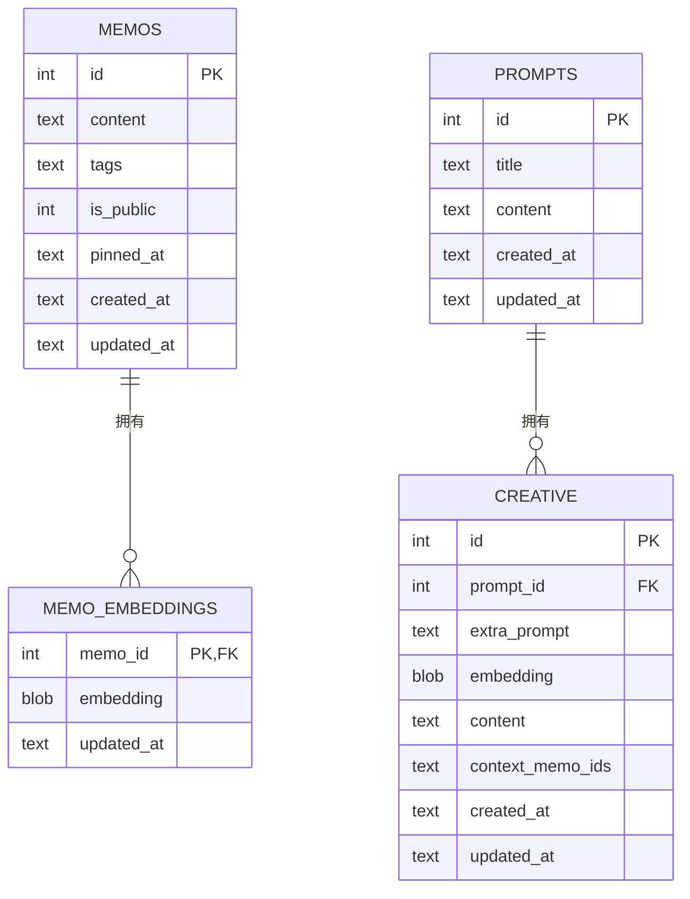
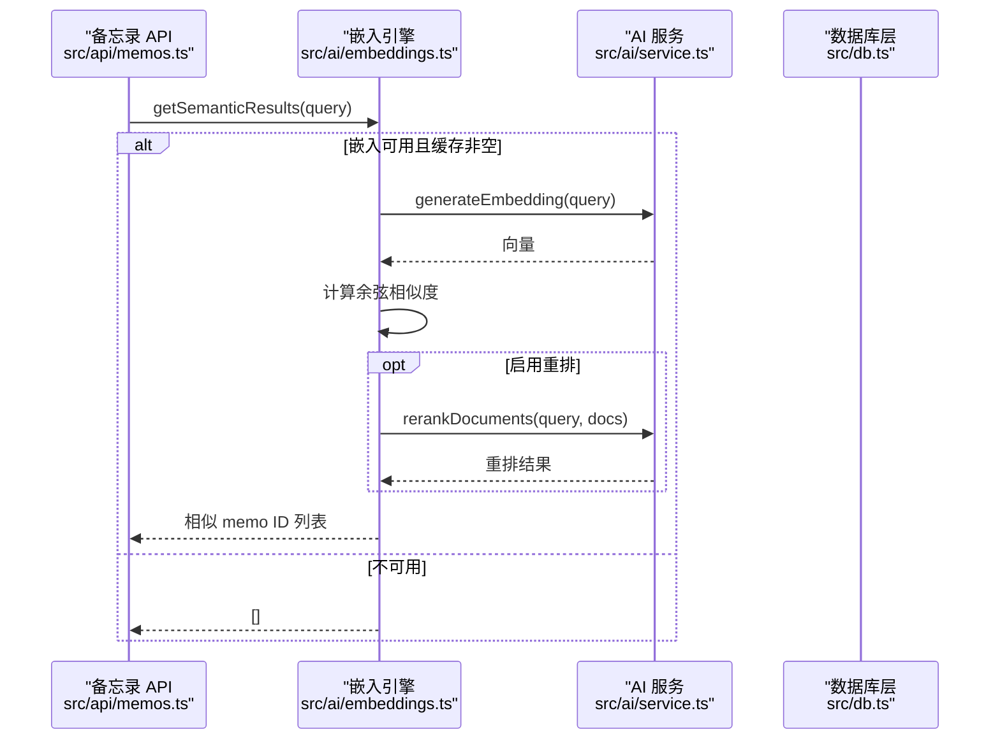
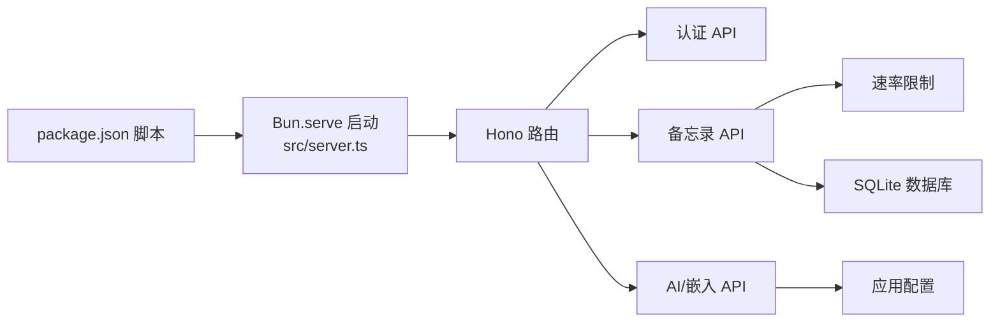

# 故障排除

<cite>
**本文引用的文件**
- [README.md](file://README.md)
- [package.json](file://package.json)
- [src/server.ts](file://src/server.ts)
- [src/db.ts](file://src/db.ts)
- [src/auth.ts](file://src/auth.ts)
- [src/api/auth.ts](file://src/api/auth.ts)
- [src/api/memos.ts](file://src/api/memos.ts)
- [src/init/seed.ts](file://src/init/seed.ts)
- [src/ai/service.ts](file://src/ai/service.ts)
- [src/ai/embeddings.ts](file://src/ai/embeddings.ts)
- [src/config/app-config.ts](file://src/config/app-config.ts)
- [src/helper/rate-limit.ts](file://src/helper/rate-limit.ts)
- [app.config.json](file://app.config.json)
- [ai.config.json](file://ai.config.json)
</cite>

## 目录
1. [简介](#简介)
2. [项目结构](#项目结构)
3. [核心组件](#核心组件)
4. [架构总览](#架构总览)
5. [详细组件分析](#详细组件分析)
6. [依赖分析](#依赖分析)
7. [性能考虑](#性能考虑)
8. [故障排除指南](#故障排除指南)
9. [结论](#结论)
10. [附录](#附录)

## 简介
本指南面向使用与维护 Memos 的用户与开发者，聚焦于常见问题的快速定位与解决，涵盖安装与启动失败、数据库连接与一致性问题、认证与权限、网络与 API 调用、AI 服务集成、性能排查（慢查询、内存、并发）等方面。文档以仓库现有实现为依据，提供可操作的诊断步骤、日志分析要点与修复建议。

## 项目结构
- 服务端入口负责路由注册、静态资源与 SPA 回退、数据库与种子数据初始化、向量缓存初始化以及 HTTP 服务启动。
- 数据层封装 SQLite（WAL 模式）与表结构，提供备忘录、嵌入向量、提示词、创意内容等 CRUD。
- 认证模块支持 Cookie + 内存 Session 与 Bearer Token（密钥），并内置登录频率限制。
- API 层提供认证、备忘录、AI、创意导出导入等子应用。
- 配置层通过 app.config.json 与环境变量控制 AI 超时、相似度阈值、重排策略、速率限制等。
- AI 层支持多提供商聊天与 DashScope 嵌入、重排，具备超时控制与降级策略。

图表来源
- [src/server.ts:1-125](file://src/server.ts#L1-L125)
- [src/api/auth.ts:1-77](file://src/api/auth.ts#L1-L77)
- [src/api/memos.ts:1-220](file://src/api/memos.ts#L1-L220)
- [src/db.ts:1-484](file://src/db.ts#L1-L484)
- [src/init/seed.ts:1-118](file://src/init/seed.ts#L1-L118)
- [src/ai/embeddings.ts:1-228](file://src/ai/embeddings.ts#L1-L228)
- [src/ai/service.ts:1-507](file://src/ai/service.ts#L1-L507)
- [src/config/app-config.ts:1-108](file://src/config/app-config.ts#L1-L108)
- [src/helper/rate-limit.ts:1-153](file://src/helper/rate-limit.ts#L1-L153)
- [package.json:1-26](file://package.json#L1-L26)

章节来源
- [README.md:25-45](file://README.md#L25-L45)
- [package.json:6-12](file://package.json#L6-L12)
- [src/server.ts:11-125](file://src/server.ts#L11-L125)

## 核心组件
- 服务端入口与路由
  - 负责注册 /api/* 子应用、静态资源与 SPA 回退、端口与日志输出。
  - 关键点：端口来自环境变量；未找到路由时对 /admin/* 返回 SPA；首次启动进行数据库初始化与种子数据注入。
- 数据库层
  - 使用 SQLite（WAL 模式），创建 memos、memo_embeddings、prompts、creative 表及必要索引。
  - 提供 CRUD、标签解析、计数、导入导出辅助等。
- 认证与权限
  - 支持 Cookie + 内存 Session 与 Bearer Token（密钥）两种认证方式。
  - 登录失败有速率限制与冷却；认证中间件统一拦截未授权请求。
- API 层
  - 认证 API：检查、登录、登出；登录失败返回 401 或 429。
  - 备忘录 API：分页、搜索（LIKE + 语义检索）、相似检索、置顶、标签聚合。
  - 备忘录创建/更新受速率限制；嵌入向量异步生成或更新。
- AI 与嵌入
  - 多提供商聊天（OpenAI 兼容格式），DashScope 嵌入与重排。
  - 嵌入缓存（内存 + DB），相似度检索与可选重排。
- 配置与速率限制
  - app.config.json 控制 AI 超时、相似度阈值、重排策略、速率限制；环境变量可覆盖。
  - 速率限制为 IP 级别的小时/天双窗，支持 memo 与 AI 两类。

章节来源
- [src/server.ts:38-125](file://src/server.ts#L38-L125)
- [src/db.ts:15-61](file://src/db.ts#L15-L61)
- [src/auth.ts:28-128](file://src/auth.ts#L28-L128)
- [src/api/auth.ts:31-77](file://src/api/auth.ts#L31-L77)
- [src/api/memos.ts:28-220](file://src/api/memos.ts#L28-L220)
- [src/ai/embeddings.ts:16-64](file://src/ai/embeddings.ts#L16-L64)
- [src/ai/service.ts:130-176](file://src/ai/service.ts#L130-L176)
- [src/config/app-config.ts:57-107](file://src/config/app-config.ts#L57-L107)
- [src/helper/rate-limit.ts:77-153](file://src/helper/rate-limit.ts#L77-L153)

## 架构总览

图表来源
- [src/server.ts:38-125](file://src/server.ts#L38-L125)
- [src/api/auth.ts:29-77](file://src/api/auth.ts#L29-L77)
- [src/api/memos.ts:26-220](file://src/api/memos.ts#L26-L220)
- [src/ai/embeddings.ts:1-228](file://src/ai/embeddings.ts#L1-L228)
- [src/ai/service.ts:1-507](file://src/ai/service.ts#L1-L507)
- [src/db.ts:1-484](file://src/db.ts#L1-L484)
- [src/helper/rate-limit.ts:1-153](file://src/helper/rate-limit.ts#L1-L153)
- [src/config/app-config.ts:1-108](file://src/config/app-config.ts#L1-L108)

## 详细组件分析

### 认证与权限（Cookie + 内存 Session + Bearer）
- 登录流程
  - 客户端向 /api/auth/login 发送密钥，服务端校验后创建会话令牌并设置 Cookie。
  - 登录失败可能因密钥错误或触发速率限制（返回 429）。
- 会话与 Bearer
  - 会话通过 Cookie（memos_token）传递；也可使用 Bearer Token（密钥）进行 API 调用。
  - 中间件统一校验，未授权返回 401。
- 登录频率限制
  - 1 分钟最多 5 次失败尝试，超过则冷却剩余时间以秒为单位返回。

图表来源
- [src/api/auth.ts:36-68](file://src/api/auth.ts#L36-L68)
- [src/auth.ts:28-128](file://src/auth.ts#L28-L128)

章节来源
- [src/api/auth.ts:14-27](file://src/api/auth.ts#L14-L27)
- [src/api/auth.ts:36-77](file://src/api/auth.ts#L36-L77)
- [src/auth.ts:28-128](file://src/auth.ts#L28-L128)

### 备忘录 API（搜索、分页、相似检索）
- 查询参数
  - search：全文模糊匹配 content。
  - tag：逗号分隔的多个标签，满足其一即可。
  - all=true：需认证，返回包含私密备忘录。
  - 分页：page、limit。
- 语义检索
  - 当提供 search 时，先执行 LIKE 结果，再异步获取语义相似 ID 并合并（非阻塞）。
- 速率限制
  - 创建/更新受速率限制，失败返回 429。

图表来源
- [src/api/memos.ts:28-70](file://src/api/memos.ts#L28-L70)
- [src/api/memos.ts:103-144](file://src/api/memos.ts#L103-L144)
- [src/db.ts:122-169](file://src/db.ts#L122-L169)

章节来源
- [src/api/memos.ts:28-220](file://src/api/memos.ts#L28-L220)
- [src/db.ts:122-169](file://src/db.ts#L122-L169)

### 数据库层（SQLite + WAL + 索引）
- 初始化
  - 创建 memos、memo_embeddings、prompts、creative 表，启用外键与 WAL。
  - 为 pinned_at 建立索引，提升置顶排序性能。
- 常见问题定位
  - 表结构缺失或索引异常：检查初始化函数是否执行。
  - 查询慢：确认 LIKE 上的 content 字段是否命中索引；对高频搜索字段考虑增加复合索引或改用语义检索。
  - 数据不一致：WAL 模式下正常，若出现锁等待或写入卡顿，检查并发写入与事务大小。

图表来源
- [src/db.ts:18-61](file://src/db.ts#L18-L61)

章节来源
- [src/db.ts:15-61](file://src/db.ts#L15-L61)
- [src/db.ts:122-250](file://src/db.ts#L122-L250)

### AI 服务与嵌入（多提供商 + 重排）
- 多提供商聊天
  - 通过 ai.config.json 配置提供商与模型，使用 OpenAI 兼容格式调用。
  - 超时由配置控制；失败记录日志并降级。
- 嵌入与语义检索
  - DashScope 生成向量，内存缓存 + DB 持久化。
  - 相似度阈值、候选数量、最终 TopN 由 app.config.json 控制。
  - 可选重排（DashScope qwen3-rerank），失败回退到嵌入排序。
- 速率限制
  - AI 调用同样受速率限制，失败返回 429。

图表来源
- [src/api/memos.ts:38-54](file://src/api/memos.ts#L38-L54)
- [src/ai/embeddings.ts:95-154](file://src/ai/embeddings.ts#L95-L154)
- [src/ai/service.ts:351-385](file://src/ai/service.ts#L351-L385)

章节来源
- [src/ai/service.ts:130-176](file://src/ai/service.ts#L130-L176)
- [src/ai/embeddings.ts:16-64](file://src/ai/embeddings.ts#L16-L64)
- [src/ai/embeddings.ts:95-228](file://src/ai/embeddings.ts#L95-L228)
- [src/config/app-config.ts:57-107](file://src/config/app-config.ts#L57-L107)

## 依赖分析
- 运行时与构建
  - Bun serve 作为 HTTP 服务器；开发模式热重载；生产模式先构建再启动。
- 外部依赖
  - Hono 用于路由与中间件；bun:sqlite 用于本地数据库；@chenglou/pretext、vanjs-core 用于前端。
- 配置优先级
  - 环境变量 > app.config.json > 硬编码默认值。

图表来源
- [package.json:6-12](file://package.json#L6-L12)
- [src/server.ts:119-125](file://src/server.ts#L119-L125)
- [src/helper/rate-limit.ts:27-39](file://src/helper/rate-limit.ts#L27-L39)
- [src/config/app-config.ts:57-107](file://src/config/app-config.ts#L57-L107)

章节来源
- [package.json:6-12](file://package.json#L6-L12)
- [src/server.ts:119-125](file://src/server.ts#L119-L125)

## 性能考虑
- 搜索与排序
  - LIKE 模糊匹配可能较慢，建议配合标签筛选与分页；对高频搜索字段可考虑建立复合索引或优先使用语义检索。
- 嵌入与重排
  - 嵌入生成与重排均涉及外部 API 调用，注意超时与降级；阈值与候选数影响召回质量与性能。
- 速率限制
  - 合理设置 memosPerHour/day 与 aiPerHour/day，避免频繁 429。
- 并发与锁
  - SQLite 在高并发写入时可能出现锁等待；拆分读写、减少长事务、降低批量写入粒度可缓解。

[本节为通用指导，无需特定文件引用]

## 故障排除指南

### 一、安装与启动失败
- 症状
  - 启动报错、端口占用、页面 404。
- 诊断步骤
  - 确认 Bun 版本满足要求；查看服务端日志输出端口与路由注册。
  - 若 /admin/* 404，检查 SPA 回退逻辑与静态资源路径。
- 常见原因与修复
  - 端口被占用：修改环境变量 PORT。
  - 缺少构建产物：先执行构建脚本再启动。
  - 静态资源缺失：确认 dist 目录与前端打包是否完成。

章节来源
- [README.md:49-81](file://README.md#L49-L81)
- [package.json:6-12](file://package.json#L6-L12)
- [src/server.ts:119-125](file://src/server.ts#L119-L125)
- [src/server.ts:101-107](file://src/server.ts#L101-L107)

### 二、数据库连接与一致性
- 症状
  - 启动后无法读写、查询异常、数据不一致。
- 诊断步骤
  - 检查数据库文件是否存在与权限；确认 WAL 模式与外键已启用。
  - 查看初始化日志：表是否创建、索引是否生效。
- 常见原因与修复
  - 权限不足：修正文件权限或运行用户。
  - 表缺失：确认初始化函数执行；如需重建，删除数据库文件后重启。
  - 锁等待：减少并发写入、缩短事务、避免大事务。

章节来源
- [src/db.ts:6-13](file://src/db.ts#L6-L13)
- [src/db.ts:15-61](file://src/db.ts#L15-L61)
- [src/init/seed.ts:113-118](file://src/init/seed.ts#L113-L118)

### 三、认证与权限问题
- 症状
  - 登录失败、会话过期、401 未授权、频繁 429。
- 诊断步骤
  - 检查密钥是否正确、是否触发登录冷却；确认 Cookie 是否设置成功。
  - 对需要认证的 API，检查请求头是否携带 Cookie 或 Bearer Token。
- 常见原因与修复
  - 密钥错误：核对 MEMOS_SECRET_KEY；生产环境必须设置。
  - 登录过于频繁：等待冷却时间；调整速率限制配置。
  - 会话过期：Cookie Max-Age 为 24 小时，确认浏览器未清理 Cookie。

章节来源
- [src/api/auth.ts:14-27](file://src/api/auth.ts#L14-L27)
- [src/api/auth.ts:36-77](file://src/api/auth.ts#L36-L77)
- [src/auth.ts:28-128](file://src/auth.ts#L28-L128)

### 四、API 调用与网络问题
- 症状
  - 400/401/404/429，响应异常或超时。
- 诊断步骤
  - 检查请求体格式（JSON）、查询参数（search/tag/all/page/limit）。
  - 对 AI 相关接口，确认提供商配置与 API Key 是否正确。
- 常见原因与修复
  - 400：请求体无效或必填字段缺失。
  - 401：未认证或密钥不匹配。
  - 404：资源不存在或路径错误。
  - 429：触发速率限制，等待冷却或提高限额。
  - 超时：调整 app.config.json 中的 AI 请求超时。

章节来源
- [src/api/memos.ts:28-220](file://src/api/memos.ts#L28-L220)
- [src/api/auth.ts:36-77](file://src/api/auth.ts#L36-L77)
- [src/ai/service.ts:132-176](file://src/ai/service.ts#L132-L176)
- [src/config/app-config.ts:33-53](file://src/config/app-config.ts#L33-L53)

### 五、AI 服务集成问题
- 症状
  - 模型调用失败、限流、响应异常、语义检索无结果。
- 诊断步骤
  - 检查 ai.config.json 与环境变量（DEEPSEEK_API_KEY、DASHSCOPE_API_KEY 等）。
  - 查看 AI 调用日志与超时设置；确认嵌入可用性与缓存是否加载。
- 常见原因与修复
  - 缺少 API Key：补齐对应环境变量。
  - 超时或网络异常：增大超时或检查代理；观察降级日志。
  - 无结果：调整相似度阈值与候选数；确认缓存是否加载。

章节来源
- [ai.config.json:1-44](file://ai.config.json#L1-L44)
- [src/ai/service.ts:43-71](file://src/ai/service.ts#L43-L71)
- [src/ai/service.ts:132-176](file://src/ai/service.ts#L132-L176)
- [src/ai/embeddings.ts:16-64](file://src/ai/embeddings.ts#L16-L64)
- [src/config/app-config.ts:57-107](file://src/config/app-config.ts#L57-L107)

### 六、性能问题排查
- 慢查询
  - 使用 LIKE 模糊匹配时，建议结合标签筛选与分页；必要时启用语义检索。
  - 检查索引是否生效，避免全表扫描。
- 内存泄漏
  - 嵌入缓存为内存 Map，重启后清空；如发现内存持续增长，检查是否有额外对象持有引用。
- 并发问题
  - 减少长事务与大批量写入；拆分请求；合理设置速率限制。

章节来源
- [src/db.ts:122-169](file://src/db.ts#L122-L169)
- [src/ai/embeddings.ts:13-15](file://src/ai/embeddings.ts#L13-L15)
- [src/helper/rate-limit.ts:77-153](file://src/helper/rate-limit.ts#L77-L153)

### 七、日志与错误码解读
- 日志位置
  - 服务端启动日志与错误输出在控制台；AI 调用失败与重排失败会打印错误信息。
- 常见错误码
  - 400：请求体无效或参数非法。
  - 401：未认证或密钥不匹配。
  - 404：资源不存在。
  - 429：触发速率限制。
  - 其他：外部 API 返回的 HTTP 状态码会被记录。

章节来源
- [src/server.ts:32-35](file://src/server.ts#L32-L35)
- [src/api/auth.ts:42-50](file://src/api/auth.ts#L42-L50)
- [src/ai/service.ts:162-175](file://src/ai/service.ts#L162-L175)

## 结论
本指南基于项目现有实现，提供了从安装、启动、数据库、认证、API、AI 到性能的全流程故障排除方法。建议在生产环境中：
- 明确设置密钥与环境变量；
- 合理配置速率限制与 AI 超时；
- 使用语义检索与重排提升体验；
- 监控日志与错误码，及时定位问题。

[本节为总结，无需特定文件引用]

## 附录

### A. 常用命令与端口
- 启动与构建
  - 开发模式：bun run dev
  - 生产模式：bun run start
- 端口
  - 默认端口 3020，可通过环境变量 PORT 覆盖。

章节来源
- [README.md:73-81](file://README.md#L73-L81)
- [package.json:6-12](file://package.json#L6-L12)
- [src/server.ts:11-11](file://src/server.ts#L11-L11)

### B. 配置文件与环境变量
- 应用配置（app.config.json）
  - 控制 AI 请求超时、相似度阈值、重排策略、速率限制等。
- AI 配置（ai.config.json）
  - 多提供商与默认模型配置。
- 环境变量
  - PORT：服务器端口
  - MEMOS_SECRET_KEY：认证密钥（生产必须）

章节来源
- [app.config.json:1-22](file://app.config.json#L1-L22)
- [ai.config.json:1-44](file://ai.config.json#L1-L44)
- [README.md:59-65](file://README.md#L59-L65)
- [src/api/auth.ts:14-27](file://src/api/auth.ts#L14-L27)