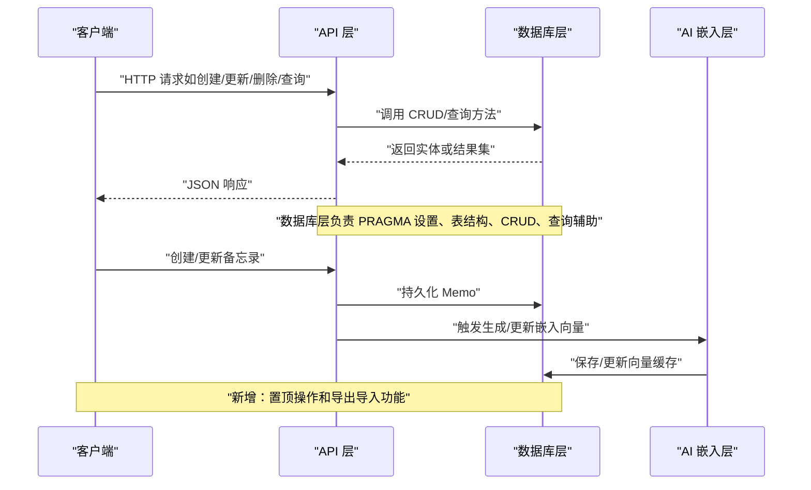
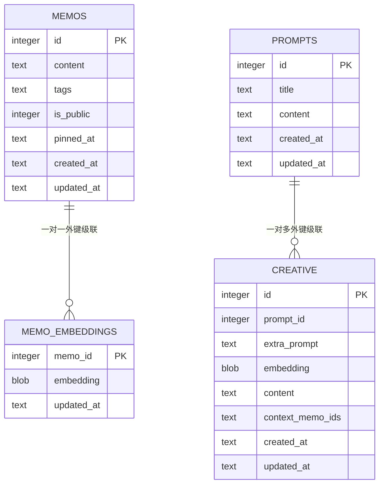
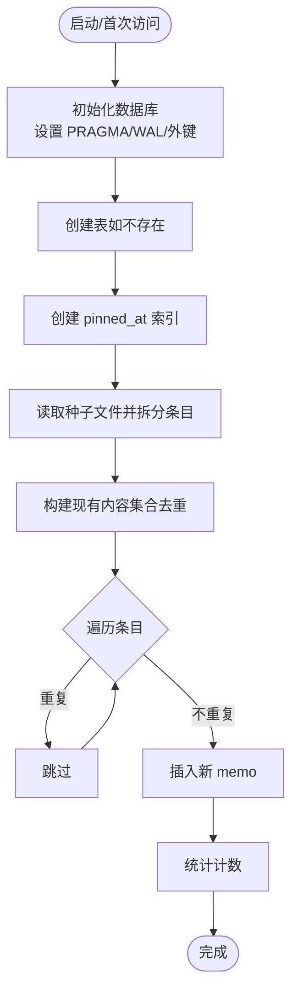
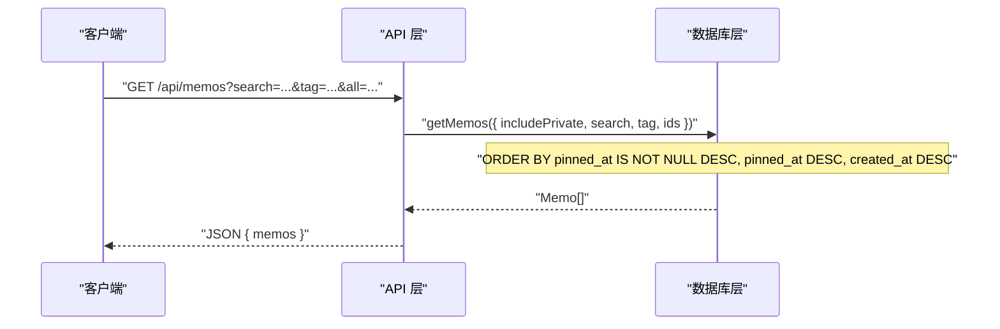
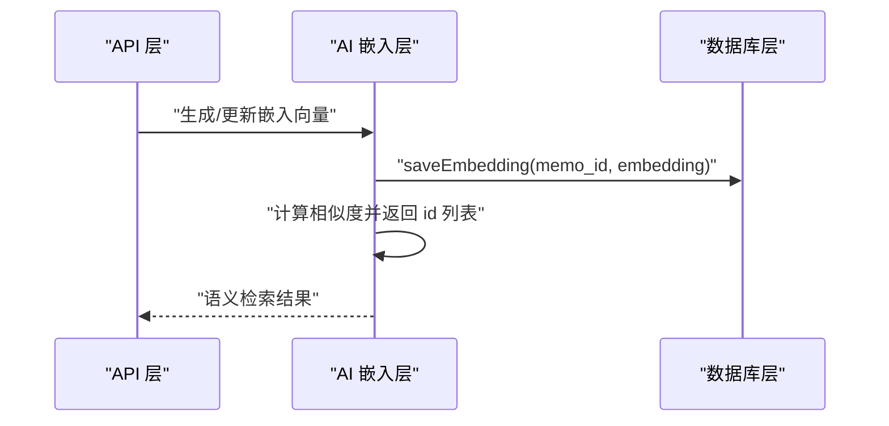
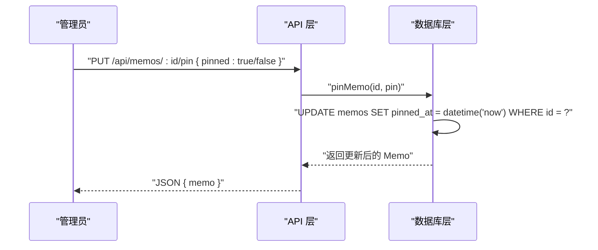
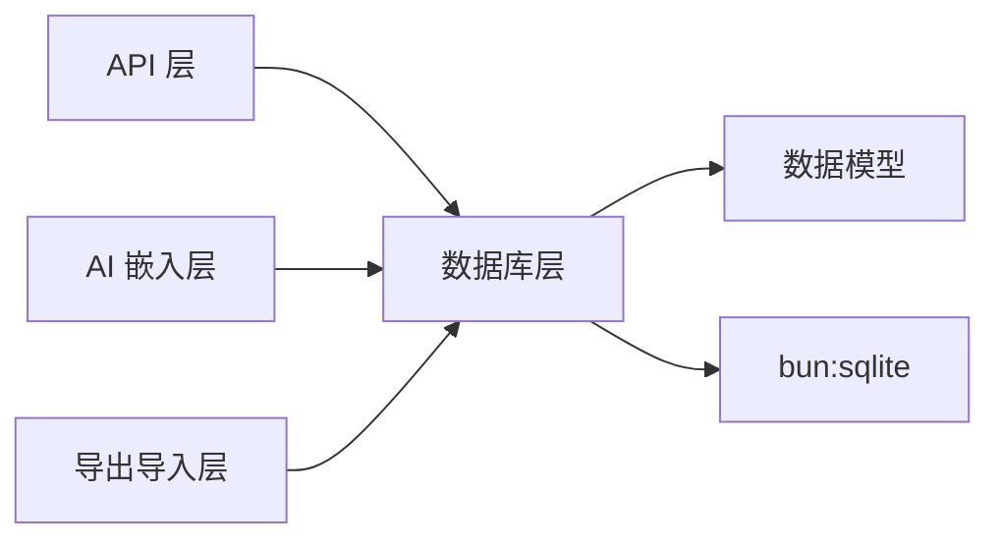

# 数据库设计

<cite>
**本文引用的文件**
- [src/db.ts](file://src/db.ts)
- [src/model.ts](file://src/model.ts)
- [src/api/memos.ts](file://src/api/memos.ts)
- [src/api/export-import.ts](file://src/api/export-import.ts)
- [src/ai/embeddings.ts](file://src/ai/embeddings.ts)
- [docs/superpowers/specs/2026-05-23-memo-pin-feature-design.md](file://docs/superpowers/specs/2026-05-23-memo-pin-feature-design.md)
- [README.md](file://README.md)
- [package.json](file://package.json)
</cite>

## 更新摘要
**变更内容**
- 新增备忘录固定功能的数据库支持，包括 pinned_at 字段和相关索引
- 更新排序逻辑以支持置顶状态的优先级显示
- 扩展多标签系统，继续使用 JSON 存储格式
- 新增导出导入功能对 pinned_at 字段的支持

## 目录
1. [简介](#简介)
2. [项目结构与数据库相关模块](#项目结构与数据库相关模块)
3. [核心组件与数据模型](#核心组件与数据模型)
4. [架构总览](#架构总览)
5. [详细组件分析](#详细组件分析)
6. [依赖关系分析](#依赖关系分析)
7. [性能与 WAL 模式](#性能与-wal-模式)
8. [查询与访问模式](#查询与访问模式)
9. [数据迁移与版本管理](#数据迁移与版本管理)
10. [数据安全与备份策略](#数据安全与备份策略)
11. [故障排查指南](#故障排查指南)
12. [结论](#结论)

## 简介
本文件面向 memos 项目的数据库设计，聚焦 SQLite（bun:sqlite）在本项目中的表结构、字段定义、约束、索引与外键设计，以及实体关系、初始化流程、种子数据导入、WAL 模式的性能优势、查询与访问模式、迁移与版本管理、安全与备份策略等。文档同时结合源码路径进行溯源，便于读者定位实现细节。

**更新** 本版本增加了备忘录固定功能的数据库支持，包括 pinned_at 字段的设计和相关索引优化。

## 项目结构与数据库相关模块
- 数据库初始化与表结构定义集中在数据库层模块中，负责创建表、设置 PRAGMA、提供 CRUD 与查询辅助函数。
- 应用层 API 通过数据库层提供的方法实现业务接口；AI 嵌入模块与数据库层交互以缓存向量并支持语义检索。
- 种子脚本负责从文本文件批量导入初始数据，避免重复写入。
- 导出导入模块支持数据的完整备份和恢复，包括新的 pinned_at 字段。

```mermaid
graph TB
subgraph "应用层"
API["API 层<br/>src/api/memos.ts"]
AI["AI 嵌入层<br/>src/ai/embeddings.ts"]
EXPORT["导出导入层<br/>src/api/export-import.ts"]
end
subgraph "数据层"
DB["数据库层<br/>src/db.ts"]
MODELS["数据模型<br/>src/model.ts"]
end
subgraph "工具与脚本"
SEED["种子脚本<br/>script/initMemos.ts"]
END
API --> DB
AI --> DB
EXPORT --> DB
DB --> MODELS
SEED --> DB
```

**图表来源**
- [src/api/memos.ts:1-220](file://src/api/memos.ts#L1-L220)
- [src/ai/embeddings.ts:1-99](file://src/ai/embeddings.ts#L1-L99)
- [src/api/export-import.ts:1-288](file://src/api/export-import.ts#L1-L288)
- [src/db.ts:1-479](file://src/db.ts#L1-L479)
- [src/model.ts:1-35](file://src/model.ts#L1-L35)

**章节来源**
- [README.md:14-45](file://README.md#L14-L45)
- [package.json:1-22](file://package.json#L1-L22)

## 核心组件与数据模型
- 数据模型接口定义了三类实体及其属性：
  - Memo：id、content、tags（字符串数组）、is_public、pinned_at（置顶时间）、created_at、updated_at
  - Prompt：id、title、content、created_at、updated_at
  - CreativeItem：id、prompt_id、extra_prompt、embedding、content、context_memo_ids、created_at、updated_at

- 数据库层提供：
  - 初始化数据库与表（含 PRAGMA 设置）
  - CRUD 与查询辅助（如按条件筛选、计数、标签聚合）
  - 嵌入向量的保存、读取与删除
  - 提示词与创意内容的 CRUD
  - **新增**：备忘录置顶功能的 pinMemo 操作

**更新** Memo 模型现在包含 pinned_at 字段，支持备忘录的置顶状态管理。

**章节来源**
- [src/model.ts:1-35](file://src/model.ts#L1-L35)
- [src/db.ts:15-61](file://src/db.ts#L15-L61)
- [src/db.ts:236-244](file://src/db.ts#L236-L244)
- [src/db.ts:401-423](file://src/db.ts#L401-L423)

## 架构总览
数据库层作为统一的数据访问抽象，向上提供稳定的接口，向下封装 SQLite 的具体实现细节。API 层与 AI 层通过数据库层进行数据读写与状态维护。新增的导出导入模块增强了数据的完整性和可移植性。



**图表来源**
- [src/api/memos.ts:18-220](file://src/api/memos.ts#L18-L220)
- [src/db.ts:15-479](file://src/db.ts#L15-L479)
- [src/ai/embeddings.ts:12-99](file://src/ai/embeddings.ts#L12-L99)
- [src/api/export-import.ts:165-288](file://src/api/export-import.ts#L165-L288)

## 详细组件分析

### 表结构与字段定义
- memos 表
  - 字段与约束
    - id：INTEGER PRIMARY KEY AUTOINCREMENT
    - content：TEXT NOT NULL
    - tags：TEXT NOT NULL DEFAULT '[]'
    - is_public：INTEGER NOT NULL DEFAULT 1
    - **新增**：pinned_at：TEXT（支持置顶功能，NULL 表示未置顶）
    - created_at：TEXT NOT NULL DEFAULT (datetime('now'))
    - updated_at：TEXT NOT NULL DEFAULT (datetime('now'))
  - 主键：id
  - **新增**：索引：idx_memos_pinned_at（pinned_at 字段的索引）
  - 外键：无
  - 业务规则
    - is_public 默认公开，可通过查询参数控制是否包含私密条目
    - **新增**：pinned_at 字段存储置顶时间，支持置顶状态管理
    - created_at/updated_at 使用 SQLite 函数自动填充时间戳
    - **新增**：排序逻辑优先显示置顶的备忘录

- memo_embeddings 表
  - 字段与约束
    - memo_id：INTEGER PRIMARY KEY
    - embedding：BLOB NOT NULL
    - updated_at：TEXT NOT NULL DEFAULT (datetime('now'))
  - 主键：memo_id
  - 索引：未显式创建索引
  - 外键：memo_id 引用 memos.id，ON DELETE CASCADE
  - 业务规则
    - 一对一映射 memo_id → embedding
    - 删除 memo 时级联删除对应 embedding

- prompts 表
  - 字段与约束
    - id：INTEGER PRIMARY KEY AUTOINCREMENT
    - title：TEXT NOT NULL
    - content：TEXT NOT NULL
    - created_at：TEXT NOT NULL DEFAULT (datetime('now'))
    - updated_at：TEXT NOT NULL DEFAULT (datetime('now'))
  - 主键：id
  - 索引：未显式创建索引
  - 外键：无
  - 业务规则
    - 用于存储提示词模板，供 AI 创作使用

- creative 表
  - 字段与约束
    - id：INTEGER PRIMARY KEY AUTOINCREMENT
    - prompt_id：INTEGER NOT NULL
    - extra_prompt：TEXT NOT NULL DEFAULT ''
    - embedding：BLOB
    - content：TEXT NOT NULL DEFAULT ''
    - context_memo_ids：TEXT NOT NULL DEFAULT ''
    - created_at：TEXT NOT NULL DEFAULT (datetime('now'))
    - updated_at：TEXT NOT NULL DEFAULT (datetime('now'))
  - 主键：id
  - 索引：未显式创建索引
  - 外键：prompt_id 引用 prompts.id，ON DELETE CASCADE
  - 业务规则
    - 与提示词关联，支持额外提示、上下文 memo ID 列表、嵌入向量等

**更新** memos 表现在包含 pinned_at 字段和对应的索引，支持高效的置顶状态查询。

**章节来源**
- [src/db.ts:18-61](file://src/db.ts#L18-L61)

### 实体关系图


**图表来源**
- [src/db.ts:18-61](file://src/db.ts#L18-L61)

### 数据库初始化与种子数据
- 初始化流程
  - 首次访问数据库时，通过 PRAGMA 设置 WAL 模式与启用外键约束
  - 创建四张表（memos、memo_embeddings、prompts、creative），若不存在则创建
  - **新增**：为 pinned_at 字段创建索引以优化查询性能
- 种子数据导入
  - 读取同目录下的文本文件，按分隔符拆分条目
  - 去重：先查询现有 memo 内容集合，跳过重复
  - 批量插入：逐条调用创建接口，统计成功/跳过/失败数量
  - 输出统计信息



**图表来源**
- [src/db.ts:6-13](file://src/db.ts#L6-L13)
- [src/db.ts:15-61](file://src/db.ts#L15-L61)
- [script/initMemos.ts:7-62](file://script/initMemos.ts#L7-L62)

**章节来源**
- [src/db.ts:6-13](file://src/db.ts#L6-L13)
- [src/db.ts:15-61](file://src/db.ts#L15-L61)
- [script/initMemos.ts:1-62](file://script/initMemos.ts#L1-L62)

### 查询与访问模式
- 查询模式
  - 支持按条件组合查询：是否包含私密、按 id 列表过滤、全文搜索、按标签过滤
  - **新增**：支持按置顶状态查询和排序
  - 统一使用参数化查询，避免 SQL 注入
  - 计数查询与标签聚合查询
- 访问模式
  - API 层根据请求参数调用数据库层查询方法
  - 对于搜索场景，同时执行 LIKE 与语义相似度检索，合并结果
  - **新增**：置顶状态的优先级显示和管理

**更新** 查询模式现在支持更复杂的排序逻辑，优先显示置顶的备忘录。



**图表来源**
- [src/api/memos.ts:28-70](file://src/api/memos.ts#L28-L70)
- [src/db.ts:122-164](file://src/db.ts#L122-L164)

**章节来源**
- [src/api/memos.ts:28-70](file://src/api/memos.ts#L28-L70)
- [src/db.ts:122-164](file://src/db.ts#L122-L164)
- [src/db.ts:166-183](file://src/db.ts#L166-L183)

### 嵌入向量与语义检索
- 缓存策略
  - 启动时加载已有向量到内存 Map，键为 memo_id，值为 Float32Array
  - 新增/更新时同步更新内存与数据库
- 语义检索
  - 将查询内容转为向量，计算与缓存向量的余弦相似度
  - 超过阈值的结果按分数排序，返回 id 列表
- 与数据库的交互
  - 通过数据库层的嵌入相关方法进行保存、读取、删除



**图表来源**
- [src/ai/embeddings.ts:12-99](file://src/ai/embeddings.ts#L12-L99)
- [src/db.ts:248-270](file://src/db.ts#L248-L270)

**章节来源**
- [src/ai/embeddings.ts:12-99](file://src/ai/embeddings.ts#L12-L99)
- [src/db.ts:248-270](file://src/db.ts#L248-L270)

### 备忘录置顶功能
- 功能概述
  - 支持管理员将重要备忘录置顶，使其在列表顶部优先显示
  - 置顶状态在 Admin 后台和瀑布流公开页均生效
  - 多条置顶备忘录按置顶时间倒序排列
- 数据库实现
  - memos 表新增 pinned_at 字段，存储置顶时间（ISO 8601 格式）
  - 为 pinned_at 字段创建索引以优化查询性能
  - 排序逻辑优先显示置顶的备忘录
- API 接口
  - 新增 PUT /api/memos/:id/pin 路由
  - 支持置顶和取消置顶操作
  - 返回完整的备忘录对象

**新增** 备忘录置顶功能是本次更新的核心内容，提供了完整的置顶状态管理和查询支持。



**图表来源**
- [src/api/memos.ts:201-219](file://src/api/memos.ts#L201-L219)
- [src/db.ts:236-244](file://src/db.ts#L236-L244)

**章节来源**
- [src/api/memos.ts:201-219](file://src/api/memos.ts#L201-L219)
- [src/db.ts:236-244](file://src/db.ts#L236-L244)
- [docs/superpowers/specs/2026-05-23-memo-pin-feature-design.md:52-100](file://docs/superpowers/specs/2026-05-23-memo-pin-feature-design.md#L52-L100)

### 导出导入与数据完整性
- 导出功能
  - 支持导出所有备忘录和创意内容
  - **新增**：导出时包含 pinned_at 字段，支持完整的数据备份
  - 支持标签、隐私状态、置顶状态的完整导出
- 导入功能
  - 解析导出格式，支持多种元数据字段
  - **新增**：导入时支持 pinned_at 字段的解析和存储
  - 去重机制确保数据完整性
- 数据格式
  - 使用自定义文本格式，包含元数据块和内容
  - 支持 ISO 8601 时间格式和 JSON 数组格式

**新增** 导出导入模块现在支持 pinned_at 字段，确保数据的完整备份和恢复。

**章节来源**
- [src/api/export-import.ts:39-74](file://src/api/export-import.ts#L39-L74)
- [src/api/export-import.ts:142-151](file://src/api/export-import.ts#L142-L151)
- [src/api/export-import.ts:233-247](file://src/api/export-import.ts#L233-L247)

## 依赖关系分析
- 模块耦合
  - API 层依赖数据库层提供的 CRUD 与查询方法
  - AI 层依赖数据库层的嵌入读写方法
  - **新增**：导出导入层依赖数据库层的数据访问方法
  - 数据库层依赖模型接口定义数据结构
- 外部依赖
  - 运行时：Bun（内置 sqlite）
  - 依赖声明见 package.json



**图表来源**
- [src/api/memos.ts:1-25](file://src/api/memos.ts#L1-L25)
- [src/ai/embeddings.ts:1-6](file://src/ai/embeddings.ts#L1-L6)
- [src/api/export-import.ts:1-12](file://src/api/export-import.ts#L1-L12)
- [src/db.ts:1-3](file://src/db.ts#L1-L3)
- [package.json:16-21](file://package.json#L16-L21)

**章节来源**
- [src/api/memos.ts:1-25](file://src/api/memos.ts#L1-L25)
- [src/ai/embeddings.ts:1-6](file://src/ai/embeddings.ts#L1-L6)
- [src/api/export-import.ts:1-12](file://src/api/export-import.ts#L1-L12)
- [src/db.ts:1-3](file://src/db.ts#L1-L3)
- [package.json:16-21](file://package.json#L16-L21)

## 性能与 WAL 模式
- WAL 模式优势
  - 提升并发读写性能，尤其在"多读少写"场景下表现更好
  - 写操作写入 WAL 文件，读操作无需阻塞写
  - 在本项目中，首页瀑布流与管理后台的高并发读取场景受益明显
  - **新增**：配合 pinned_at 索引，进一步提升置顶状态查询性能
- 平台差异
  - macOS 上系统 SQLite 可能保留 WAL/SHM 文件，需在关闭前进行清理或禁用持久 WAL
- 本项目实践
  - 启动时即设置 PRAGMA journal_mode = WAL
  - 启用外键约束，确保参照完整性
  - **新增**：为高频查询字段（如 pinned_at）创建专门索引

**更新** WAL 模式现在与新的索引策略结合，提供更好的整体性能。

**章节来源**
- [src/db.ts:6-13](file://src/db.ts#L6-L13)
- [README.md:18-19](file://README.md#L18-L19)

## 查询与访问模式
- 查询优化建议
  - **新增**：pinned_at 字段已创建索引，支持高效的置顶状态查询
  - 对高频查询字段（如 content、tags、created_at）建立索引可进一步提升性能
  - LIKE 模糊匹配可能无法利用索引，建议在搜索场景结合语义检索减少全表扫描
  - 分页查询建议在上层实现（当前未见分页参数）
- 访问模式
  - API 层统一处理参数校验与错误返回
  - 数据库层提供参数化查询与类型转换，保证安全性与一致性
  - **新增**：置顶状态的优先级显示和管理

**更新** 查询优化现在包括对新索引的利用和置顶状态的高效查询。

**章节来源**
- [src/api/memos.ts:28-70](file://src/api/memos.ts#L28-L70)
- [src/db.ts:122-164](file://src/db.ts#L122-L164)

## 数据迁移与版本管理
- 当前状态
  - 项目未提供正式的数据库迁移脚本或版本号管理机制
  - 初始化仅创建表结构，未包含版本字段或迁移记录
  - **新增**：pinned_at 字段的迁移策略已在设计文档中定义
- 建议方案
  - 引入迁移表记录当前版本号，每次升级执行迁移脚本
  - 对于新增字段，使用 ALTER TABLE 添加默认值与约束
  - 对于结构变更，先创建临时表、迁移数据、替换原表，最后删除临时表
  - 为关键表增加版本号字段与迁移历史，便于回滚与审计
  - **新增**：遵循现有的 tag → tags 迁移模式，为 pinned_at 字段提供兼容性支持
- 注意事项
  - 迁移过程中保持 WAL 模式开启，确保并发一致性
  - 备份后再执行迁移，防止不可逆风险
  - **新增**：确保新字段的默认值和约束条件正确设置

**更新** 数据迁移现在包括对新字段的兼容性处理和迁移策略。

**章节来源**
- [src/db.ts:15-61](file://src/db.ts#L15-L61)
- [docs/superpowers/specs/2026-05-23-memo-pin-feature-design.md:62-70](file://docs/superpowers/specs/2026-05-23-memo-pin-feature-design.md#L62-L70)

## 数据安全与备份策略
- 安全措施
  - 外键约束启用，确保删除主表记录时级联清理相关嵌入与创意记录
  - 参数化查询，避免 SQL 注入
  - 管理后台通过密钥认证，限制敏感操作权限
  - **新增**：导出导入功能支持完整的数据备份，包括置顶状态
- 备份策略
  - 建议定期复制数据库文件与 WAL/SHM 文件（注意平台差异）
  - 在 macOS 平台上，WAL/SHM 文件可能不会随数据库关闭而自动清理，需手动处理
  - 可在应用启动时进行完整性检查（PRAGMA integrity_check）
  - **新增**：使用导出功能进行定期的数据备份，确保数据完整性

**更新** 数据安全现在包括对新功能的保护和完整的备份策略。

**章节来源**
- [src/db.ts:6-13](file://src/db.ts#L6-L13)
- [src/api/memos.ts:63-92](file://src/api/memos.ts#L63-L92)
- [README.md:88-99](file://README.md#L88-L99)

## 故障排查指南
- 常见问题
  - 数据库文件损坏或权限不足：检查文件是否存在、权限是否正确
  - WAL/SHM 文件导致空间占用：在 macOS 平台需手动清理或禁用持久 WAL
  - 查询性能差：考虑为高频字段建立索引或优化查询条件
  - 种子导入失败：检查输入文件格式与编码，确认重复检测逻辑
  - **新增**：置顶功能异常：检查 pinned_at 字段是否存在和索引是否正常
  - **新增**：导出导入失败：检查 pinned_at 字段的序列化和反序列化
- 排查步骤
  - 启动时观察 PRAGMA 设置是否生效
  - 使用完整性检查命令验证数据库健康状况
  - 查看 API 返回的错误信息，定位参数或业务规则问题
  - **新增**：检查 pinned_at 字段的 SQL 查询和索引使用情况
  - **新增**：验证导出导入流程中 pinned_at 字段的处理

**更新** 故障排查现在包括对新功能的诊断和排除。

**章节来源**
- [src/db.ts:6-13](file://src/db.ts#L6-L13)
- [script/initMemos.ts:10-17](file://script/initMemos.ts#L10-L17)
- [src/api/memos.ts:63-92](file://src/api/memos.ts#L63-L92)

## 结论
本项目采用 SQLite（bun:sqlite）作为本地数据库，通过 PRAGMA 设置 WAL 模式与外键约束，结合简洁的表结构与清晰的模块职责，实现了轻量、高性能且易于维护的备忘录系统。数据库层提供了完善的 CRUD 与查询辅助，API 层与 AI 层通过统一接口进行数据交互。

**更新** 本次更新增加了备忘录固定功能的完整数据库支持，包括 pinned_at 字段、相关索引和排序逻辑。同时，导出导入功能现在支持完整的数据备份，包括新的置顶状态。这些改进使得系统更加完善，能够满足更复杂的使用场景需求。

未来可在索引优化、迁移管理与备份策略方面进一步完善，以适配更大规模与更高可用性的需求。新增的置顶功能和完整的数据备份能力为用户提供了更好的体验和数据安全保障。