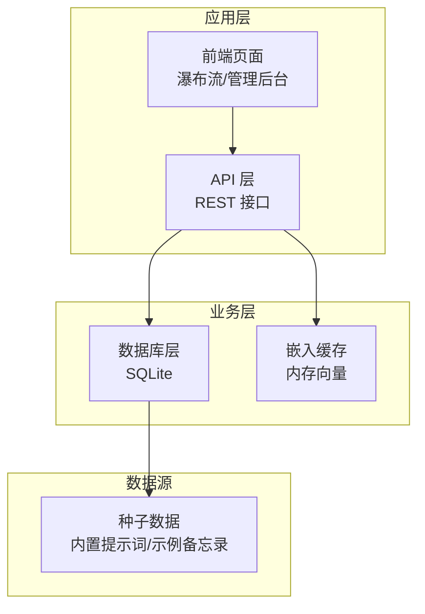
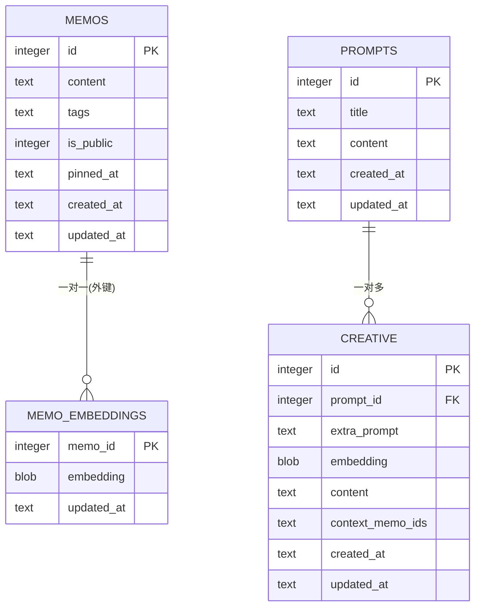
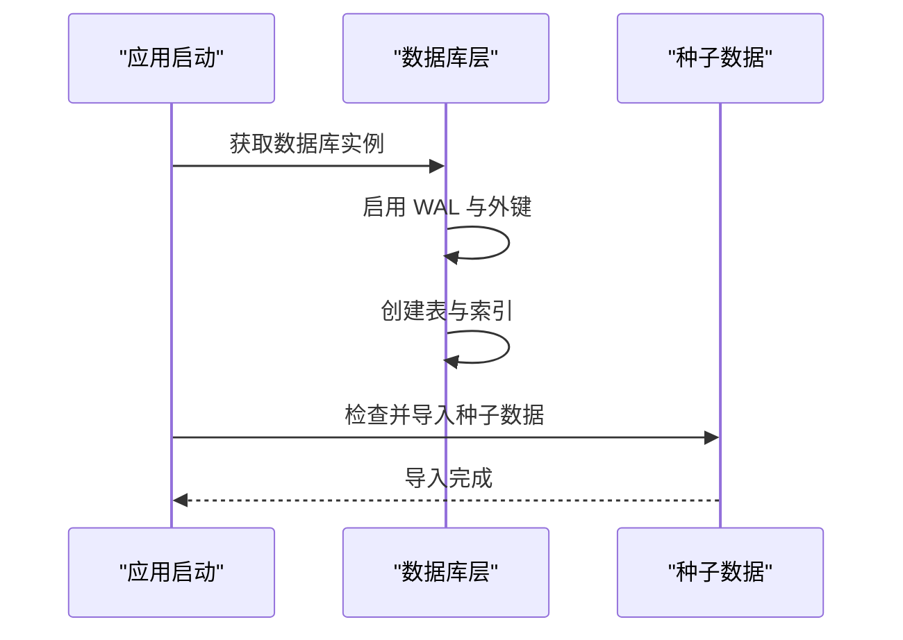
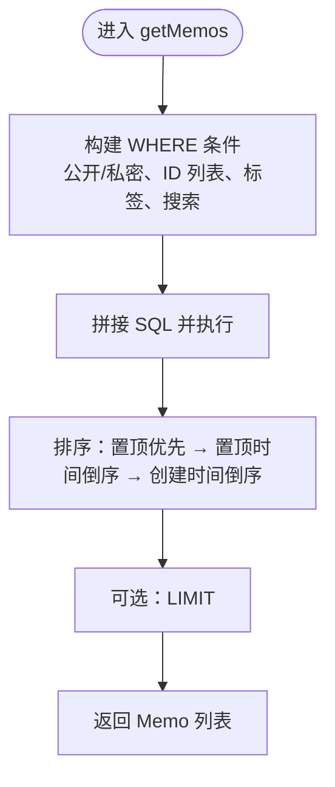
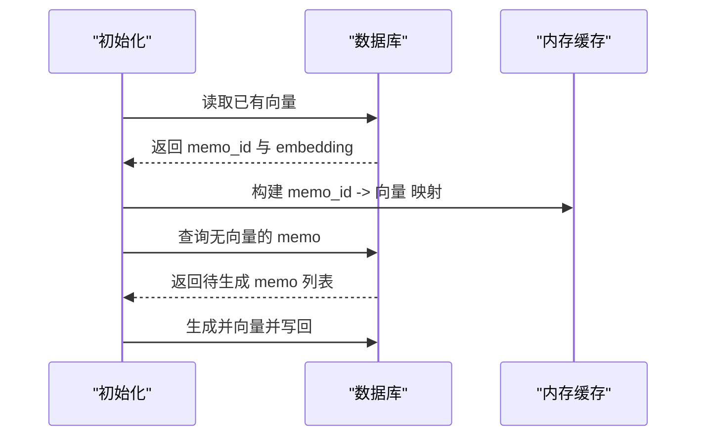
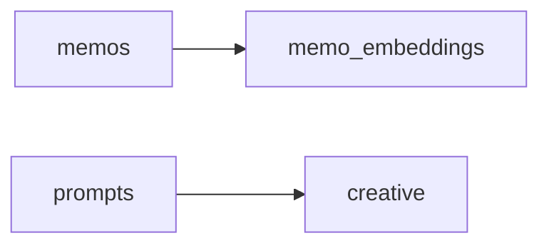

# 数据库设计

<cite>
**本文引用的文件**
- [src/db.ts](file://src/db.ts)
- [src/model.ts](file://src/model.ts)
- [src/init/seed.ts](file://src/init/seed.ts)
- [src/ai/embeddings.ts](file://src/ai/embeddings.ts)
- [README.md](file://README.md)
- [data/memos.txt](file://data/memos.txt)
- [data/system-prompts/creative.txt](file://data/system-prompts/creative.txt)
</cite>

## 目录
1. [简介](#简介)
2. [项目结构](#项目结构)
3. [核心组件](#核心组件)
4. [架构总览](#架构总览)
5. [详细组件分析](#详细组件分析)
6. [依赖分析](#依赖分析)
7. [性能考量](#性能考量)
8. [故障排查指南](#故障排查指南)
9. [结论](#结论)
10. [附录](#附录)

## 简介
本文件面向 Memmos 项目的数据库设计，聚焦 SQLite 数据库的表结构、索引、数据模型关系、初始化流程、查询优化策略、数据生命周期管理以及迁移与版本管理方案。项目采用 Bun 的内置 SQLite 能力，以 WAL 模式运行，提供备忘录、标签、嵌入向量、提示词与创意内容等核心能力。

## 项目结构
数据库相关代码集中在 src/db.ts，数据模型定义在 src/model.ts，种子数据初始化在 src/init/seed.ts，AI 嵌入缓存与检索在 src/ai/embeddings.ts。README.md 描述了数据库初始化与运行方式。

图表来源
- [src/db.ts:15-61](file://src/db.ts#L15-L61)
- [src/ai/embeddings.ts:16-45](file://src/ai/embeddings.ts#L16-L45)
- [src/init/seed.ts:113-117](file://src/init/seed.ts#L113-L117)

章节来源
- [README.md:25-45](file://README.md#L25-L45)
- [src/db.ts:15-61](file://src/db.ts#L15-L61)

## 核心组件
- 数据库连接与初始化：统一获取数据库实例，启用 WAL 与外键约束；初始化表结构与索引。
- 数据模型：Memo、Prompt、CreativeItem、MemoEmbedding 四类实体。
- CRUD 与查询：提供备忘录、提示词、创意内容的增删改查，以及标签与全文搜索。
- 嵌入向量：独立表存储向量，配合内存缓存进行语义检索。
- 种子数据：首次启动时导入内置提示词与示例备忘录。

章节来源
- [src/db.ts:6-13](file://src/db.ts#L6-L13)
- [src/db.ts:15-61](file://src/db.ts#L15-L61)
- [src/model.ts:1-35](file://src/model.ts#L1-L35)
- [src/init/seed.ts:16-61](file://src/init/seed.ts#L16-L61)

## 架构总览
数据库层采用 SQLite，表间通过外键关联，使用 JSON 函数处理标签数组，嵌入向量单独表存储并维护一致性。查询路径围绕“备忘录列表”展开，支持按标签、内容搜索、公开/私密过滤与置顶排序。

图表来源
- [src/db.ts:18-60](file://src/db.ts#L18-L60)
- [src/model.ts:1-35](file://src/model.ts#L1-L35)

## 详细组件分析

### 表结构与字段说明
- memos 表
  - 字段：id（主键，自增）、content（文本，必填）、tags（JSON 数组字符串，默认空数组）、is_public（整数布尔，默认 1）、pinned_at（置顶时间，可空）、created_at/updated_at（时间戳，默认当前时间）。
  - 约束：主键、NOT NULL、默认值、外键（嵌入表）。
  - 索引：pinned_at 列上建立普通索引，用于排序与过滤。
  - 业务规则：is_public=1 时对外公开；pinned_at 非空表示置顶，排序优先级高于创建时间。
- memo_embeddings 表
  - 字段：memo_id（主键，外键引用 memos.id，级联删除）、embedding（二进制向量）、updated_at（时间戳）。
  - 约束：主键、NOT NULL、外键级联删除。
  - 业务规则：每个 memo 对应唯一向量；删除 memo 时同步删除向量。
- prompts 表
  - 字段：id（主键，自增）、title/content（文本，必填）、created_at/updated_at（时间戳）。
  - 约束：主键、NOT NULL、默认值。
- creative 表
  - 字段：id（主键，自增）、prompt_id（外键引用 prompts.id，级联删除）、extra_prompt/content/context_memo_ids（文本）、embedding（二进制向量）、created_at/updated_at（时间戳）。
  - 约束：主键、NOT NULL、默认值、外键级联删除。
  - 业务规则：创意内容与提示词关联，支持嵌入与上下文 memo id 列表。

章节来源
- [src/db.ts:18-60](file://src/db.ts#L18-L60)
- [src/model.ts:1-35](file://src/model.ts#L1-L35)

### 数据模型映射
- Memo：id、content、tags（字符串数组）、is_public（布尔）、pinned_at（可空时间）、created_at/updated_at。
- Prompt：id、title、content、created_at/updated_at。
- CreativeItem：id、prompt_id、extra_prompt、embedding（可空）、content、context_memo_ids、created_at/updated_at。
- MemoEmbedding：memo_id、embedding（可空）、updated_at。

章节来源
- [src/model.ts:1-35](file://src/model.ts#L1-L35)

### 初始化流程
- 数据库连接：首次调用时创建 memos.db（SQLite 文件），启用 WAL 模式与外键约束。
- 表创建：按顺序创建 memos、memo_embeddings、prompts、creative 表。
- 索引建立：为 memos.pinned_at 建立索引。
- 种子数据：仅在表为空时导入内置提示词与示例备忘录，避免重复。

图表来源
- [src/db.ts:6-13](file://src/db.ts#L6-L13)
- [src/db.ts:15-61](file://src/db.ts#L15-L61)
- [src/init/seed.ts:113-117](file://src/init/seed.ts#L113-L117)

章节来源
- [src/db.ts:6-13](file://src/db.ts#L6-L13)
- [src/db.ts:15-61](file://src/db.ts#L15-L61)
- [src/init/seed.ts:16-61](file://src/init/seed.ts#L16-L61)

### 查询与访问模式
- 备忘录列表
  - 过滤：公开/私密、按 id 列表、按标签（逗号分隔多标签任一匹配）、按内容搜索。
  - 排序：置顶优先（pinned_at 非空且倒序），随后按创建时间倒序。
  - 分页：支持 limit 参数。
- 标签聚合：使用 JSON 函数提取去重标签。
- 统计：按公开/私密统计数量。
- 嵌入向量：批量加载到内存，按余弦相似度检索，支持重排。

图表来源
- [src/db.ts:122-168](file://src/db.ts#L122-L168)

章节来源
- [src/db.ts:122-168](file://src/db.ts#L122-L168)
- [src/db.ts:166-174](file://src/db.ts#L166-L174)
- [src/db.ts:176-183](file://src/db.ts#L176-L183)

### 标签系统与 JSON 处理
- 存储：tags 以 JSON 数组字符串形式存储，默认空数组。
- 查询：使用 JSON 函数遍历数组元素，支持多标签任一匹配。
- 兼容：解析时兼容旧数据（纯字符串标签）并过滤空标签。
- 聚合：提取所有非空标签并排序。

章节来源
- [src/db.ts:93-108](file://src/db.ts#L93-L108)
- [src/db.ts:145-157](file://src/db.ts#L145-L157)
- [src/db.ts:166-174](file://src/db.ts#L166-L174)

### 嵌入向量与语义检索
- 存储：memo_embeddings 表保存向量与更新时间。
- 缓存：启动时从数据库加载到内存 Map，键为 memo_id，值为 Float32Array。
- 生成：对缺失向量的 memo 生成并回写数据库。
- 检索：查询向量与缓存中向量计算余弦相似度，阈值过滤，可选重排。

图表来源
- [src/ai/embeddings.ts:16-45](file://src/ai/embeddings.ts#L16-L45)
- [src/db.ts:248-275](file://src/db.ts#L248-L275)

章节来源
- [src/ai/embeddings.ts:16-45](file://src/ai/embeddings.ts#L16-L45)
- [src/db.ts:248-275](file://src/db.ts#L248-L275)

### 数据生命周期管理
- 创建：创建时写入 created_at/updated_at，更新时仅更新 updated_at。
- 更新：支持部分字段更新，标签数组会重新序列化。
- 删除：删除备忘录时，其向量随外键级联删除；删除提示词时，创意内容随外键级联删除。
- 归档/清理：当前未提供专门的归档/清理策略，建议通过业务层在应用侧实现（例如基于时间阈值的软删除或定期导出）。

章节来源
- [src/db.ts:193-233](file://src/db.ts#L193-L233)
- [src/db.ts:248-275](file://src/db.ts#L248-L275)
- [src/db.ts:290-331](file://src/db.ts#L290-L331)
- [src/db.ts:372-397](file://src/db.ts#L372-L397)

### 数据导入与导出
- 导入：支持自定义 created_at 的备忘录与创意内容导入，确保历史时间线一致。
- 导出：导出为统一格式，包含类型、日期与内容块，便于跨平台迁移。
- 默认提示词：当导入创意内容但无提示词时，自动确保至少存在一个默认提示词。

章节来源
- [src/db.ts:402-423](file://src/db.ts#L402-L423)
- [src/db.ts:426-444](file://src/db.ts#L426-L444)
- [src/db.ts:447-451](file://src/db.ts#L447-L451)

### 数据库迁移与版本管理
- 当前实现：initDb() 在启动时创建表与索引，未显式提供迁移脚本。
- 建议方案：
  - 版本表：新增版本号字段，每次升级检查并执行迁移脚本。
  - 列迁移：如新增 pinned_at 列，先检测是否存在，不存在再 ALTER TABLE 添加。
  - 索引迁移：新增索引时使用 IF NOT EXISTS，避免重复。
  - 数据迁移：对历史数据进行转换（如标签格式升级）。
  - 回滚策略：保留备份与回滚脚本，确保幂等。

章节来源
- [src/db.ts:15-61](file://src/db.ts#L15-L61)
- [docs/superpowers/specs/2026-05-23-memo-pin-feature-design.md:62-84](file://docs/superpowers/specs/2026-05-23-memo-pin-feature-design.md#L62-L84)

## 依赖分析
- 外键关系
  - memo_embeddings.memo_id → memos.id（级联删除）
  - creative.prompt_id → prompts.id（级联删除）
- 查询依赖
  - 备忘录列表依赖 pinned_at 索引与 JSON 函数。
  - 标签聚合依赖 JSON 函数。
  - 嵌入检索依赖内存缓存与向量生成服务。

图表来源
- [src/db.ts:32-38](file://src/db.ts#L32-L38)
- [src/db.ts:48-60](file://src/db.ts#L48-L60)

章节来源
- [src/db.ts:32-38](file://src/db.ts#L32-L38)
- [src/db.ts:48-60](file://src/db.ts#L48-L60)

## 性能考量
- 索引策略
  - memos.pinned_at：用于置顶排序与过滤，提升排序与 WHERE 性能。
  - 建议：若频繁按 is_public 或 created_at 过滤，可考虑复合索引（如 idx_memos_is_public_created_at）。
- JSON 函数
  - 标签查询使用 json_each，适合中小规模数据；大规模数据建议引入物化列或二级索引。
- 嵌入检索
  - 内存缓存避免频繁 IO；向量维度较大时注意内存占用。
  - 余弦相似度计算为 O(n*d)，可结合候选集上限与阈值过滤减少比较次数。
- 并发控制
  - WAL 模式提升读写并发；外键约束保证一致性。
  - 建议：对高频写入场景使用事务批处理，减少提交次数。
- I/O 优化
  - 使用 INSERT OR REPLACE 更新向量，避免重复写入。
  - 导入时批量写入，减少磁盘往返。

章节来源
- [src/db.ts:30](file://src/db.ts#L30)
- [src/db.ts:145-157](file://src/db.ts#L145-L157)
- [src/db.ts:253-275](file://src/db.ts#L253-L275)
- [src/ai/embeddings.ts:95-154](file://src/ai/embeddings.ts#L95-L154)

## 故障排查指南
- 数据库无法启动
  - 检查 memos.db 是否可写，确认 Bun 运行权限。
  - 查看 WAL 模式与外键设置是否生效。
- 表结构异常
  - 确认 initDb() 是否执行成功，索引是否创建。
  - 若缺少 pinned_at 列，参考迁移文档补充。
- 标签查询无效
  - 检查 tags 字段是否为合法 JSON 数组；旧数据可能为字符串，解析逻辑会尝试兼容。
- 嵌入检索无结果
  - 确认 AI 服务可用与向量生成成功；检查缓存是否加载成功。
  - 调整相似度阈值或候选集上限。
- 导入失败
  - 检查输入格式与文件编码；确保内容不重复。

章节来源
- [src/db.ts:6-13](file://src/db.ts#L6-L13)
- [src/db.ts:15-61](file://src/db.ts#L15-L61)
- [src/db.ts:93-108](file://src/db.ts#L93-L108)
- [src/ai/embeddings.ts:16-45](file://src/ai/embeddings.ts#L16-L45)

## 结论
Memmos 的数据库设计以 SQLite 为核心，采用简洁的表结构与 JSON 处理标签，结合嵌入向量实现语义检索。通过 WAL 模式与外键约束保障性能与一致性，初始化流程自动化导入种子数据。建议后续完善版本迁移机制与索引策略，以支撑更大规模的数据与更高并发场景。

## 附录

### 完整 SQL Schema 定义
- memos 表
  - 字段：id（INTEGER PRIMARY KEY AUTOINCREMENT）、content（TEXT NOT NULL）、tags（TEXT NOT NULL DEFAULT '[]'）、is_public（INTEGER NOT NULL DEFAULT 1）、pinned_at（TEXT）、created_at（TEXT NOT NULL DEFAULT (datetime('now'))）、updated_at（TEXT NOT NULL DEFAULT (datetime('now')))。
  - 约束：主键、默认值、外键（嵌入表）。
- memo_embeddings 表
  - 字段：memo_id（INTEGER PRIMARY KEY）、embedding（BLOB NOT NULL）、updated_at（TEXT NOT NULL DEFAULT (datetime('now')))。
  - 约束：主键、外键（ON DELETE CASCADE）。
- prompts 表
  - 字段：id（INTEGER PRIMARY KEY AUTOINCREMENT）、title（TEXT NOT NULL）、content（TEXT NOT NULL）、created_at（TEXT NOT NULL DEFAULT (datetime('now'))）、updated_at（TEXT NOT NULL DEFAULT (datetime('now')))。
  - 约束：主键、默认值。
- creative 表
  - 字段：id（INTEGER PRIMARY KEY AUTOINCREMENT）、prompt_id（INTEGER NOT NULL）、extra_prompt（TEXT NOT NULL DEFAULT ''）、embedding（BLOB）、content（TEXT NOT NULL DEFAULT ''）、context_memo_ids（TEXT NOT NULL DEFAULT ''）、created_at（TEXT NOT NULL DEFAULT (datetime('now'))）、updated_at（TEXT NOT NULL DEFAULT (datetime('now')))。
  - 约束：主键、默认值、外键（ON DELETE CASCADE）。

章节来源
- [src/db.ts:18-60](file://src/db.ts#L18-L60)

### 字段说明与默认值
- memos.content：全文搜索字段。
- memos.tags：JSON 数组字符串，存储标签集合。
- memos.is_public：布尔值（1/0），控制公开/私密。
- memos.pinned_at：置顶时间（ISO 8601），置顶时非空。
- memos.created_at/updated_at：时间戳，默认当前时间。
- memo_embeddings.embedding：向量二进制数据。
- prompts.title/content：提示词标题与内容。
- creative.extra_prompt/content/context_memo_ids：额外提示、内容与上下文 memo id 列表。

章节来源
- [src/db.ts:18-60](file://src/db.ts#L18-L60)
- [src/model.ts:1-35](file://src/model.ts#L1-L35)

### 种子数据与示例
- 内置提示词：从 data/prompts 目录导入，文件名为标题，内容为文件内容。
- 示例备忘录：从 data/memos.txt 导入，按分隔符拆分条目，去重后插入。

章节来源
- [src/init/seed.ts:16-61](file://src/init/seed.ts#L16-L61)
- [src/init/seed.ts:63-110](file://src/init/seed.ts#L63-L110)
- [data/memos.txt:1-46](file://data/memos.txt#L1-L46)
- [data/system-prompts/creative.txt:1-2](file://data/system-prompts/creative.txt#L1-L2)