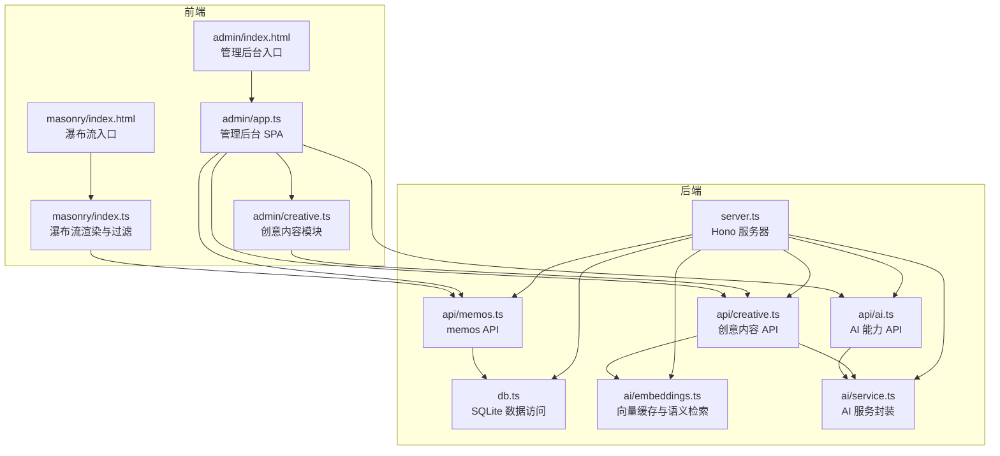
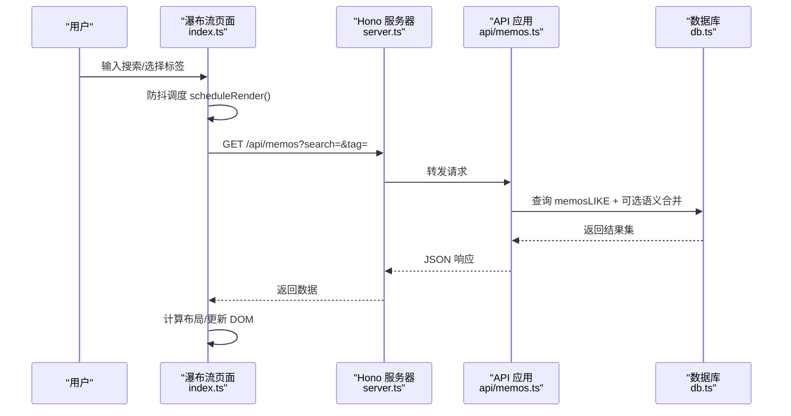
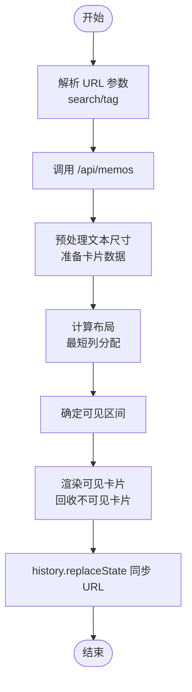
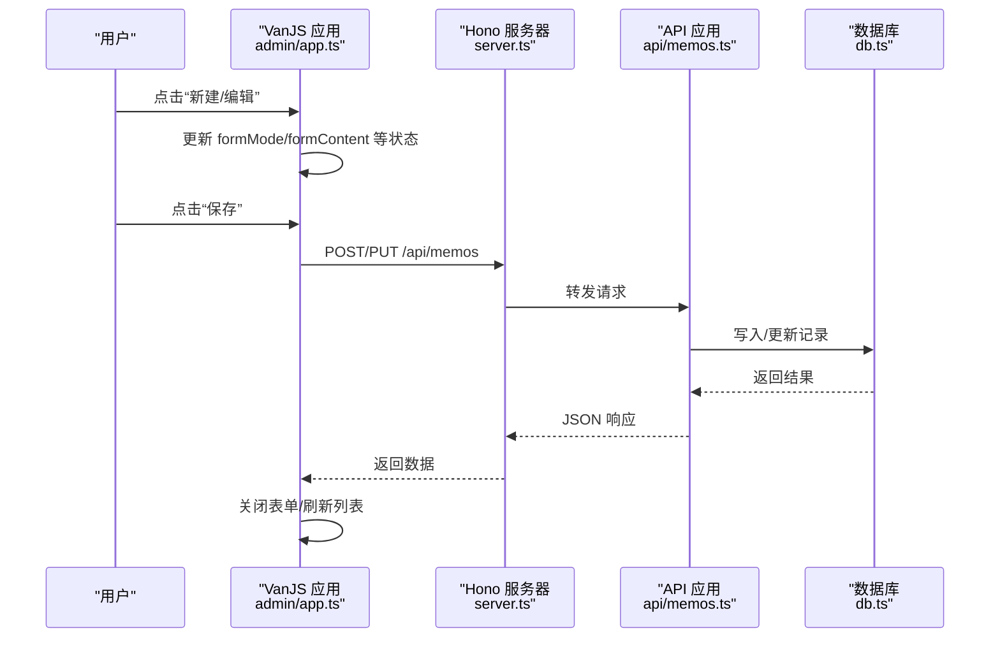
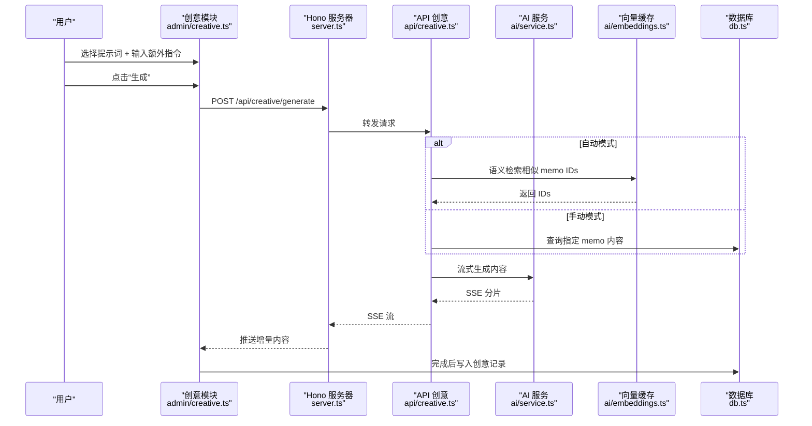
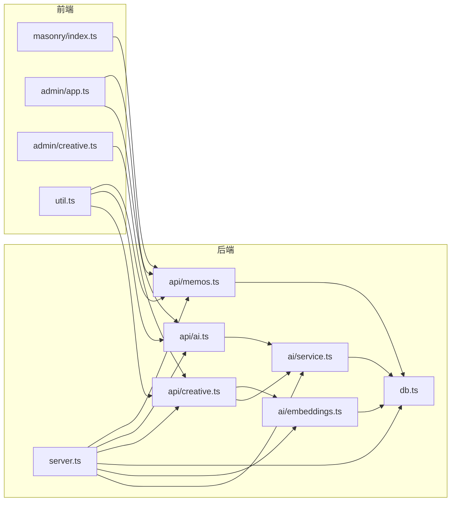
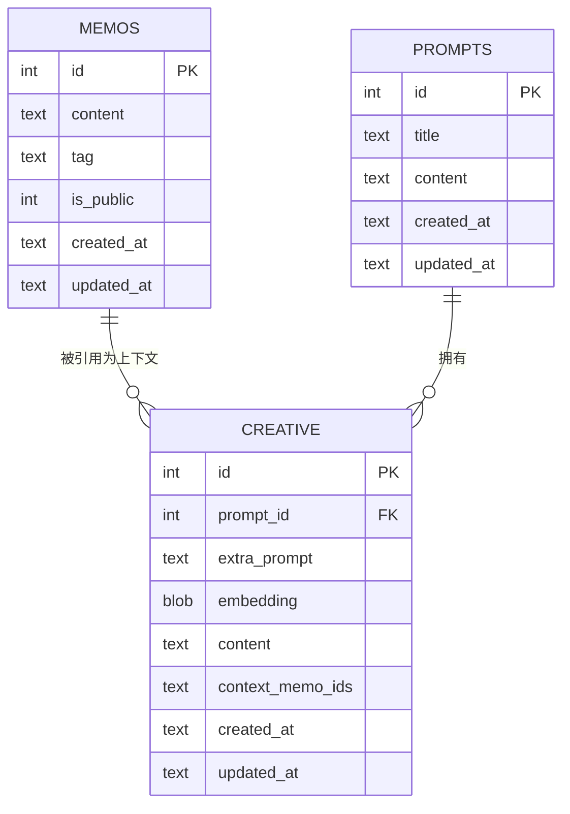

# 前端架构

<cite>
**本文引用的文件**
- [src/admin/app.ts](file://src/admin/app.ts)
- [src/admin/creative.ts](file://src/admin/creative.ts)
- [src/admin/index.html](file://src/admin/index.html)
- [src/masonry/index.ts](file://src/masonry/index.ts)
- [src/masonry/index.html](file://src/masonry/index.html)
- [src/api/memos.ts](file://src/api/memos.ts)
- [src/api/ai.ts](file://src/api/ai.ts)
- [src/api/creative.ts](file://src/api/creative.ts)
- [src/util.ts](file://src/util.ts)
- [src/db.ts](file://src/db.ts)
- [src/model.ts](file://src/model.ts)
- [src/server.ts](file://src/server.ts)
- [src/ai/embeddings.ts](file://src/ai/embeddings.ts)
- [src/ai/service.ts](file://src/ai/service.ts)
- [package.json](file://package.json)
</cite>

## 目录
1. [简介](#简介)
2. [项目结构](#项目结构)
3. [核心组件](#核心组件)
4. [架构总览](#架构总览)
5. [详细组件分析](#详细组件分析)
6. [依赖关系分析](#依赖关系分析)
7. [性能考量](#性能考量)
8. [故障排查指南](#故障排查指南)
9. [结论](#结论)
10. [附录](#附录)

## 简介
本文件面向 memos 项目的前端架构，系统性阐述以下主题：
- 瀑布流布局系统：Masonry 算法实现、虚拟滚动优化与响应式设计
- 管理后台 SPA：VanJS 框架使用、组件状态管理与路由处理
- 前后端交互模式：API 调用、错误处理与加载状态管理
- 静态资源构建流程与客户端代码优化策略
- 前端性能优化技巧与用户体验提升方案

## 项目结构
项目采用“按功能域分层”的组织方式，前端核心分为两块：
- 瀑布流页面：用于访客浏览与检索 memos
- 管理后台：基于 VanJS 的 SPA，提供认证、编辑、AI 辅助与创意内容生成功能

图表来源
- [src/masonry/index.html:1-270](file://src/masonry/index.html#L1-L270)
- [src/masonry/index.ts:1-391](file://src/masonry/index.ts#L1-L391)
- [src/admin/index.html:1-849](file://src/admin/index.html#L1-L849)
- [src/admin/app.ts:1-677](file://src/admin/app.ts#L1-L677)
- [src/admin/creative.ts:1-702](file://src/admin/creative.ts#L1-L702)
- [src/api/memos.ts:1-139](file://src/api/memos.ts#L1-L139)
- [src/api/ai.ts:1-67](file://src/api/ai.ts#L1-L67)
- [src/api/creative.ts:1-238](file://src/api/creative.ts#L1-L238)
- [src/db.ts:1-349](file://src/db.ts#L1-L349)
- [src/ai/embeddings.ts:1-99](file://src/ai/embeddings.ts#L1-L99)
- [src/ai/service.ts:1-289](file://src/ai/service.ts#L1-L289)
- [src/server.ts:1-127](file://src/server.ts#L1-L127)

章节来源
- [src/masonry/index.html:1-270](file://src/masonry/index.html#L1-L270)
- [src/masonry/index.ts:1-391](file://src/masonry/index.ts#L1-L391)
- [src/admin/index.html:1-849](file://src/admin/index.html#L1-L849)
- [src/admin/app.ts:1-677](file://src/admin/app.ts#L1-L677)
- [src/admin/creative.ts:1-702](file://src/admin/creative.ts#L1-L702)
- [src/server.ts:1-127](file://src/server.ts#L1-L127)

## 核心组件
- 瀑布流渲染器（Masonry）
  - 使用预计算文本尺寸与列高，通过最短列选择策略进行布局
  - 结合 requestAnimationFrame 与视口可见性裁剪，实现近似虚拟滚动
  - 支持搜索与标签过滤，URL 参数持久化
- 管理后台 SPA（VanJS）
  - 认证检查、登录/登出、全局错误与加载状态
  - Memo CRUD、公开/私密切换、时间线侧边栏与跳转
  - AI 能力：内容优化、标签建议；创意内容生成（流式输出）
- API 层
  - memos：检索、计数、标签列表、增删改
  - ai：状态检测、内容优化、标签建议
  - creative：提示词管理、创意内容生成（SSE 流）、删除
- 数据与 AI
  - SQLite 存储与查询；向量嵌入缓存与余弦相似度检索

章节来源
- [src/masonry/index.ts:146-269](file://src/masonry/index.ts#L146-L269)
- [src/admin/app.ts:14-31](file://src/admin/app.ts#L14-L31)
- [src/api/memos.ts:20-47](file://src/api/memos.ts#L20-L47)
- [src/api/ai.ts:8-66](file://src/api/ai.ts#L8-L66)
- [src/api/creative.ts:112-228](file://src/api/creative.ts#L112-L228)
- [src/db.ts:99-148](file://src/db.ts#L99-L148)
- [src/ai/embeddings.ts:66-86](file://src/ai/embeddings.ts#L66-L86)

## 架构总览
前端以浏览器原生 fetch 与 Hono 服务器为核心，通过模块化 API 提供数据与 AI 能力。VanJS 作为轻量响应式框架驱动管理后台 UI，瀑布流页面自绘布局并结合节流/防抖优化渲染。

图表来源
- [src/masonry/index.ts:308-351](file://src/masonry/index.ts#L308-L351)
- [src/api/memos.ts:20-47](file://src/api/memos.ts#L20-L47)
- [src/db.ts:99-131](file://src/db.ts#L99-L131)
- [src/server.ts:74-112](file://src/server.ts#L74-L112)

章节来源
- [src/masonry/index.ts:308-351](file://src/masonry/index.ts#L308-L351)
- [src/api/memos.ts:20-47](file://src/api/memos.ts#L20-L47)
- [src/db.ts:99-131](file://src/db.ts#L99-L131)
- [src/server.ts:74-112](file://src/server.ts#L74-L112)

## 详细组件分析

### 瀑布流布局系统（Masonry）
- 设计要点
  - 文本预处理与缓存：使用预计算库缓存文本尺寸，避免重复测量
  - 最短列优先：维护列高度数组，每次插入到当前最短列，保证视觉平衡
  - 视口可见性裁剪：仅渲染视口上下一定范围内的卡片，减少 DOM 数量
  - 响应式列数：根据视口宽度动态计算列数与列宽，移动端单列
- 关键流程
  - 初始化：加载标签、计数，解析 URL 参数，触发首次渲染
  - 渲染：计算布局、设置容器高度、定位可见卡片、回收不可见卡片
  - 事件：窗口 resize 与滚动事件节流到下一帧统一渲染
- 性能优化
  - requestAnimationFrame 合批渲染
  - DOM 节点复用与延迟创建
  - URL 参数同步，支持书签与分享

图表来源
- [src/masonry/index.ts:372-391](file://src/masonry/index.ts#L372-L391)
- [src/masonry/index.ts:308-351](file://src/masonry/index.ts#L308-L351)
- [src/masonry/index.ts:232-269](file://src/masonry/index.ts#L232-L269)

章节来源
- [src/masonry/index.ts:146-269](file://src/masonry/index.ts#L146-L269)
- [src/masonry/index.ts:308-351](file://src/masonry/index.ts#L308-L351)
- [src/masonry/index.html:1-270](file://src/masonry/index.html#L1-L270)

### 管理后台 SPA（VanJS）
- 架构与状态
  - 使用 van.state 管理认证、Memo 列表、表单状态、全局错误、加载状态等
  - 组件函数返回可响应的 DOM 片段，自动随状态变化更新
- 路由与导航
  - 服务器通过 notFound 中间件兜底 /admin/*，实现 SPA 深度链接
  - 登录页与管理页根据认证状态切换
- 主要功能
  - 认证：检查、登录、登出
  - Memo：创建、编辑、切换公开/私密、删除（二次确认）
  - 时间线：年份折叠、月份跳转、选中态高亮
  - AI：内容优化、标签建议（带防抖）
  - 创意内容：提示词管理、生成（SSE 流）、读取更多、删除

图表来源
- [src/admin/app.ts:89-114](file://src/admin/app.ts#L89-L114)
- [src/admin/app.ts:39-74](file://src/admin/app.ts#L39-L74)
- [src/api/memos.ts:62-126](file://src/api/memos.ts#L62-L126)
- [src/db.ts:158-195](file://src/db.ts#L158-L195)
- [src/server.ts:74-112](file://src/server.ts#L74-L112)

章节来源
- [src/admin/app.ts:14-31](file://src/admin/app.ts#L14-L31)
- [src/admin/app.ts:39-140](file://src/admin/app.ts#L39-L140)
- [src/admin/app.ts:231-316](file://src/admin/app.ts#L231-L316)
- [src/admin/index.html:1-849](file://src/admin/index.html#L1-L849)
- [src/server.ts:103-112](file://src/server.ts#L103-L112)

### 创意内容模块（VanJS + SSE）
- 功能特性
  - 提示词 CRUD：标题与内容校验、保存、删除
  - 生成模式：自动语义检索或手动指定 memo IDs
  - 流式输出：SSE 分片推送增量内容，完成后写入数据库
- 状态管理
  - prompts、selectedPromptId、generateModalOpen、streamContent、generating 等
  - 支持取消生成（AbortController）

图表来源
- [src/admin/creative.ts:144-244](file://src/admin/creative.ts#L144-L244)
- [src/api/creative.ts:112-228](file://src/api/creative.ts#L112-L228)
- [src/ai/service.ts:212-288](file://src/ai/service.ts#L212-L288)
- [src/ai/embeddings.ts:66-86](file://src/ai/embeddings.ts#L66-L86)
- [src/db.ts:299-342](file://src/db.ts#L299-L342)
- [src/server.ts:74-112](file://src/server.ts#L74-L112)

章节来源
- [src/admin/creative.ts:42-244](file://src/admin/creative.ts#L42-L244)
- [src/api/creative.ts:112-228](file://src/api/creative.ts#L112-L228)
- [src/ai/service.ts:212-288](file://src/ai/service.ts#L212-L288)
- [src/ai/embeddings.ts:66-86](file://src/ai/embeddings.ts#L66-L86)
- [src/db.ts:299-342](file://src/db.ts#L299-L342)

### 前后端交互与错误处理
- 通用客户端工具
  - api 封装：统一 fetch、JSON 解析、错误抛出
  - formatDate/truncate 等辅助
- 错误处理策略
  - 服务端返回非 OK 时，客户端抛出包含错误信息的异常
  - 管理后台使用全局错误状态与错误横幅展示
  - 瀑布流页面显示状态消息与错误提示
- 加载状态管理
  - VanJS 状态驱动按钮禁用、Spinner 显示、空态占位
  - 列表加载、表单提交、AI 请求均具备 loading 状态

章节来源
- [src/util.ts:9-20](file://src/util.ts#L9-L20)
- [src/admin/app.ts:40-51](file://src/admin/app.ts#L40-L51)
- [src/admin/app.ts:76-87](file://src/admin/app.ts#L76-L87)
- [src/masonry/index.ts:308-351](file://src/masonry/index.ts#L308-L351)

### 静态资源构建与优化
- 客户端打包
  - 服务器内置构建缓存，基于文件 mtime 判断是否重新构建
  - 使用 Bun.build 输出 ES Module，支持 import 解析
- 资源路由
  - /admin/app.ts → /admin/app.js → 转译后的 JS
  - /index.ts → /index.js → 瀑布流入口
  - notFound 中间件兜底 /admin/* 与 .ts 文件请求
- 优化策略
  - 开发环境启用 watch，生产环境可开启压缩（当前配置未启用 minify）
  - CSS 与 HTML 内联，减少请求数

章节来源
- [src/server.ts:15-72](file://src/server.ts#L15-L72)
- [src/server.ts:82-112](file://src/server.ts#L82-L112)
- [package.json:6-21](file://package.json#L6-L21)

## 依赖关系分析

图表来源
- [src/masonry/index.ts:1-10](file://src/masonry/index.ts#L1-L10)
- [src/admin/app.ts:1-4](file://src/admin/app.ts#L1-L4)
- [src/admin/creative.ts:1-3](file://src/admin/creative.ts#L1-L3)
- [src/util.ts:1-7](file://src/util.ts#L1-L7)
- [src/api/memos.ts:1-11](file://src/api/memos.ts#L1-L11)
- [src/api/ai.ts:1-6](file://src/api/ai.ts#L1-L6)
- [src/api/creative.ts:1-20](file://src/api/creative.ts#L1-L20)
- [src/db.ts:1-2](file://src/db.ts#L1-L2)
- [src/ai/embeddings.ts:1-5](file://src/ai/embeddings.ts#L1-L5)
- [src/ai/service.ts:1-8](file://src/ai/service.ts#L1-L8)
- [src/server.ts:1-10](file://src/server.ts#L1-L10)

章节来源
- [src/masonry/index.ts:1-10](file://src/masonry/index.ts#L1-L10)
- [src/admin/app.ts:1-4](file://src/admin/app.ts#L1-L4)
- [src/admin/creative.ts:1-3](file://src/admin/creative.ts#L1-L3)
- [src/api/memos.ts:1-11](file://src/api/memos.ts#L1-L11)
- [src/api/ai.ts:1-6](file://src/api/ai.ts#L1-L6)
- [src/api/creative.ts:1-20](file://src/api/creative.ts#L1-L20)
- [src/db.ts:1-2](file://src/db.ts#L1-L2)
- [src/ai/embeddings.ts:1-5](file://src/ai/embeddings.ts#L1-L5)
- [src/ai/service.ts:1-8](file://src/ai/service.ts#L1-L8)
- [src/server.ts:1-10](file://src/server.ts#L1-L10)

## 性能考量
- 渲染性能
  - 瀑布流：使用 requestAnimationFrame 合批渲染，可见性裁剪减少 DOM；建议在大数据量场景下引入 IntersectionObserver 或更严格的回收策略
  - VanJS：细粒度状态更新，避免不必要的整树重绘；保持状态扁平化
- 网络与缓存
  - 服务器构建缓存基于 mtime，避免重复编译；生产环境可启用压缩与缓存头
  - AI 请求超时控制（60 秒），失败快速回退
- 数据库与向量
  - 向量缓存加载到内存，首次启动耗时与内存占用需关注；建议在服务端做健康检查与容量评估
- 用户体验
  - 防抖搜索（250ms）、输入联动标签建议（1s）、加载状态与错误横幅
  - 时间线侧边栏与锚点跳转，提升长列表可导航性

## 故障排查指南
- 管理后台无法进入
  - 检查认证接口与密钥配置；确认 /api/auth/* 是否可达
  - 查看全局错误横幅与登录页错误提示
- 瀑布流无数据或卡顿
  - 检查 /api/memos 与 /api/memos/tags 是否返回正常
  - 观察控制台是否有构建错误或网络异常
  - 确认 URL 参数与历史记录同步逻辑
- AI 功能不可用
  - 检查 DEEPSEEK_API_KEY/DASHSCOPE_API_KEY 环境变量
  - 查看 /api/ai/status 返回值与服务端日志
- 创意内容生成失败
  - 确认提示词存在且内容有效
  - 查看 SSE 流错误与数据库写入情况
  - 检查语义检索是否返回 IDs

章节来源
- [src/admin/app.ts:40-51](file://src/admin/app.ts#L40-L51)
- [src/masonry/index.ts:308-351](file://src/masonry/index.ts#L308-L351)
- [src/api/ai.ts:8-11](file://src/api/ai.ts#L8-L11)
- [src/api/creative.ts:112-228](file://src/api/creative.ts#L112-L228)
- [src/ai/service.ts:6-26](file://src/ai/service.ts#L6-L26)

## 结论
memos 前端以 VanJS 与原生 Web 技术实现轻量 SPA，结合 Hono 提供清晰的 API 边界与良好的扩展性。瀑布流采用高效的 Masonry 布局与近似虚拟滚动，满足访客浏览需求；管理后台覆盖认证、编辑、AI 辅助与创意内容生成，形成完整的创作工作流。建议后续在大数据量场景下引入更严格的虚拟化与缓存策略，并在生产环境启用构建压缩与缓存头以进一步提升性能与稳定性。

## 附录
- 数据模型概览

图表来源
- [src/db.ts:18-56](file://src/db.ts#L18-L56)
- [src/model.ts:1-27](file://src/model.ts#L1-L27)