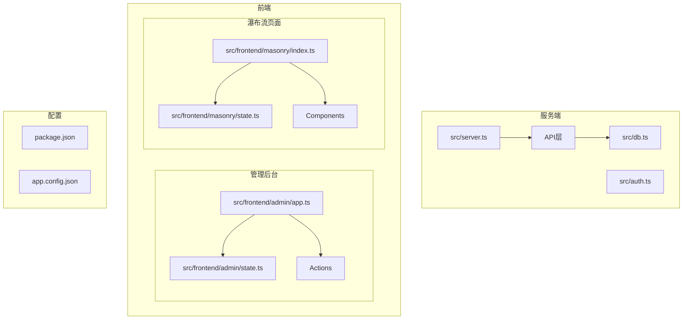
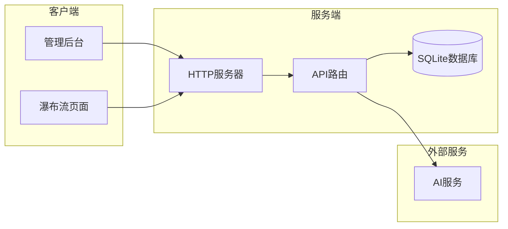
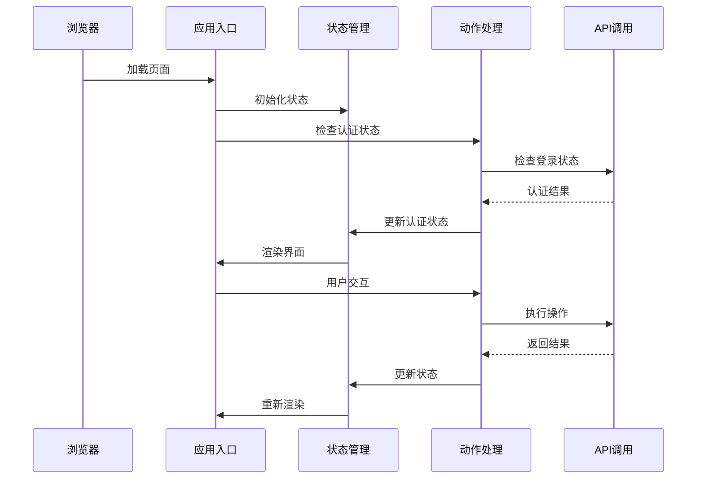
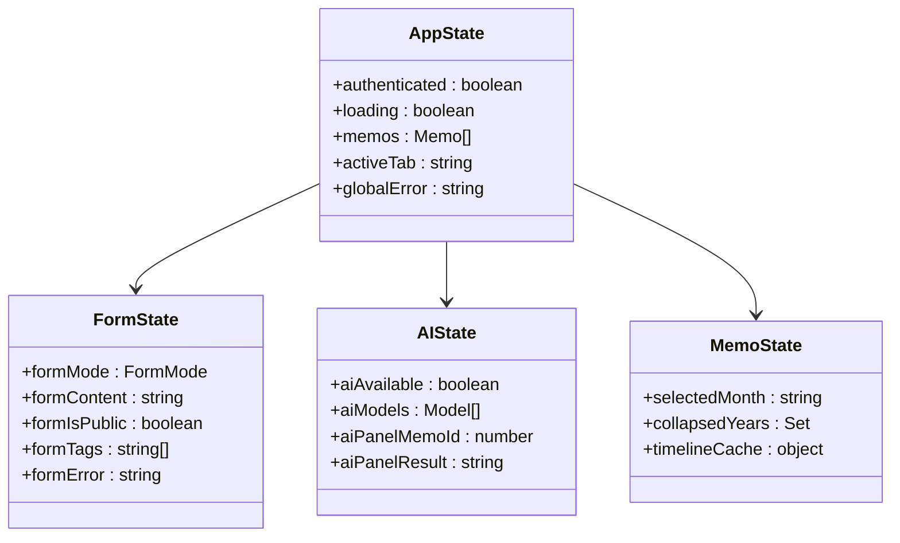
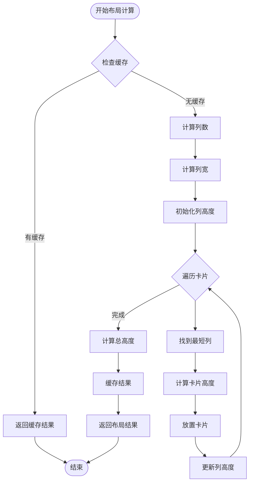
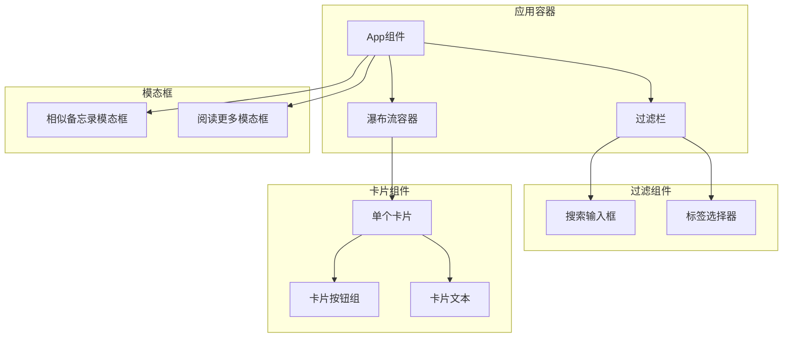
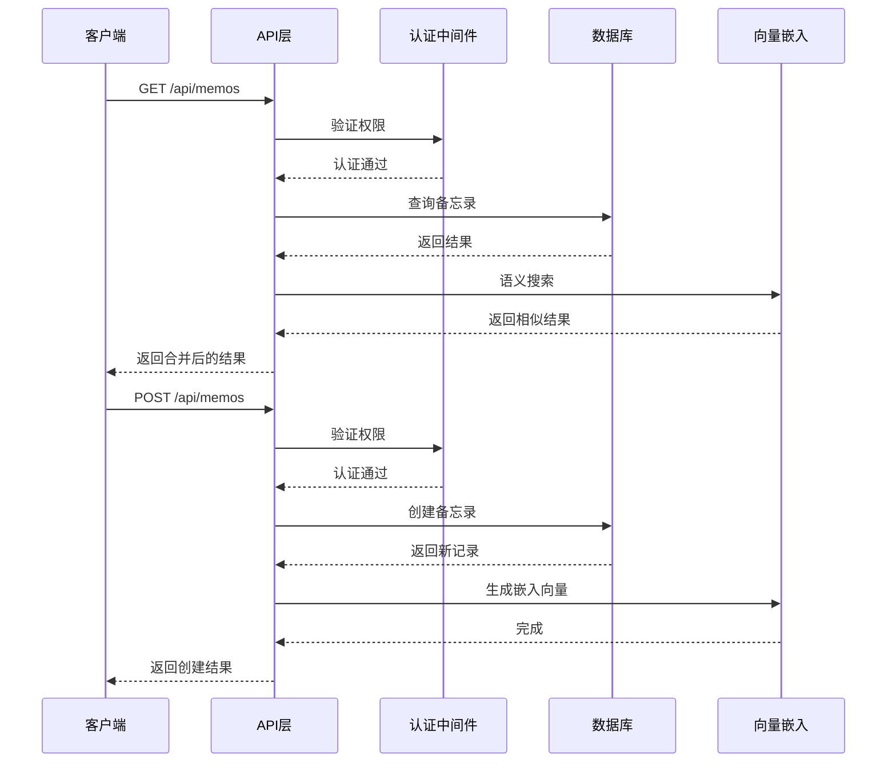
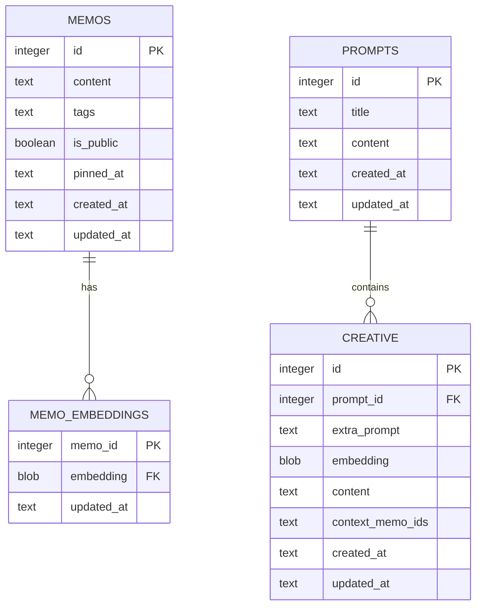

# VanJS框架使用指南

<cite>
**本文档引用的文件**
- [README.md](file://README.md)
- [package.json](file://package.json)
- [src/server.ts](file://src/server.ts)
- [src/db.ts](file://src/db.ts)
- [src/auth.ts](file://src/auth.ts)
- [src/api/memos.ts](file://src/api/memos.ts)
- [src/frontend/admin/app.ts](file://src/frontend/admin/app.ts)
- [src/frontend/admin/state.ts](file://src/frontend/admin/state.ts)
- [src/frontend/admin/actions/memo.ts](file://src/frontend/admin/actions/memo.ts)
- [src/frontend/admin/actions/auth.ts](file://src/frontend/admin/actions/auth.ts)
- [src/frontend/masonry/index.ts](file://src/frontend/masonry/index.ts)
- [src/frontend/masonry/state.ts](file://src/frontend/masonry/state.ts)
- [src/frontend/masonry/components.ts](file://src/frontend/masonry/components.ts)
- [src/frontend/masonry/index.html](file://src/frontend/masonry/index.html)
- [src/frontend/admin/index.html](file://src/frontend/admin/index.html)
</cite>

## 目录
1. [简介](#简介)
2. [项目结构](#项目结构)
3. [核心组件](#核心组件)
4. [架构概览](#架构概览)
5. [详细组件分析](#详细组件分析)
6. [依赖关系分析](#依赖关系分析)
7. [性能考虑](#性能考虑)
8. [故障排除指南](#故障排除指南)
9. [结论](#结论)

## 简介

Memos是一个基于Bun运行时构建的轻量级备忘录应用系统，采用VanJS框架进行前端开发。该系统提供了完整的备忘录管理功能，包括公开/私密备忘录管理、标签分类、全文搜索、瀑布流展示界面和独立的管理后台。

### 主要特性

- **📝 备忘录管理**：创建、编辑、删除备忘录，支持公开和私密两种可见性
- **🏷️ 标签分类**：为备忘录添加标签，按标签筛选浏览
- **🔍 全文搜索**：实时搜索备忘录内容，支持按需过滤
- **🌊 瀑布流展示**：首页采用Masonry瀑布流布局，自适应多列排列
- **🔐 管理后台**：独立的管理员SPA界面，通过密钥认证登录
- **🪶 轻量无依赖**：基于Bun内置API（SQLite + HTTP Server）

## 项目结构

该项目采用模块化设计，主要分为以下几个核心部分：



**图表来源**
- [src/server.ts:1-125](file://src/server.ts#L1-L125)
- [src/frontend/admin/app.ts:1-251](file://src/frontend/admin/app.ts#L1-L251)
- [src/frontend/masonry/index.ts:1-23](file://src/frontend/masonry/index.ts#L1-L23)

**章节来源**
- [README.md:25-45](file://README.md#L25-L45)
- [package.json:1-28](file://package.json#L1-L28)

## 核心组件

### 服务器架构

系统基于Hono框架构建，提供RESTful API服务和静态文件托管功能。

### 数据库层

采用SQLite数据库，支持WAL模式和外键约束，提供完整的CRUD操作。

### 认证系统

实现基于Cookie的会话认证和Bearer Token认证双重机制，支持管理员密钥认证。

### 前端架构

使用VanJS框架构建响应式UI，包含管理后台和瀑布流展示两个主要界面。

**章节来源**
- [src/server.ts:1-125](file://src/server.ts#L1-L125)
- [src/db.ts:1-479](file://src/db.ts#L1-L479)
- [src/auth.ts:1-128](file://src/auth.ts#L1-L128)

## 架构概览

系统采用前后端分离的架构设计，服务端负责数据处理和API提供，前端使用VanJS构建响应式用户界面。



**图表来源**
- [src/server.ts:38-125](file://src/server.ts#L38-L125)
- [src/api/memos.ts:26-220](file://src/api/memos.ts#L26-L220)

## 详细组件分析

### 管理后台系统

管理后台是基于VanJS构建的SPA应用，提供完整的备忘录管理功能。

#### 应用入口



**图表来源**
- [src/frontend/admin/app.ts:224-251](file://src/frontend/admin/app.ts#L224-L251)
- [src/frontend/admin/actions/auth.ts:12-25](file://src/frontend/admin/actions/auth.ts#L12-L25)

#### 状态管理系统

管理后台使用VanJS的状态系统管理应用状态：



**图表来源**
- [src/frontend/admin/state.ts:37-172](file://src/frontend/admin/state.ts#L37-L172)

**章节来源**
- [src/frontend/admin/app.ts:1-251](file://src/frontend/admin/app.ts#L1-L251)
- [src/frontend/admin/state.ts:1-172](file://src/frontend/admin/state.ts#L1-L172)

### 瀑布流展示系统

瀑布流页面提供响应式的备忘录展示功能，基于@chenglou/pretext进行文本预排版。

#### 布局算法



**图表来源**
- [src/frontend/masonry/state.ts:84-152](file://src/frontend/masonry/state.ts#L84-L152)

#### 组件结构



**图表来源**
- [src/frontend/masonry/components.ts:283-337](file://src/frontend/masonry/components.ts#L283-L337)

**章节来源**
- [src/frontend/masonry/index.ts:1-23](file://src/frontend/masonry/index.ts#L1-L23)
- [src/frontend/masonry/state.ts:1-181](file://src/frontend/masonry/state.ts#L1-L181)
- [src/frontend/masonry/components.ts:1-337](file://src/frontend/masonry/components.ts#L1-L337)

### API接口系统

系统提供完整的RESTful API接口，支持备忘录的CRUD操作和高级功能。

#### 备忘录API流程



**图表来源**
- [src/api/memos.ts:28-70](file://src/api/memos.ts#L28-L70)
- [src/api/memos.ts:103-144](file://src/api/memos.ts#L103-L144)

#### 数据库操作



**图表来源**
- [src/db.ts:18-61](file://src/db.ts#L18-L61)

**章节来源**
- [src/api/memos.ts:1-220](file://src/api/memos.ts#L1-L220)
- [src/db.ts:15-61](file://src/db.ts#L15-L61)

## 依赖关系分析

系统使用现代化的依赖管理策略，主要依赖包括：

```mermaid
graph TB
subgraph "核心依赖"
VanJS[vanjs-core 1.6.0]
Hono[hono 4.7.10]
Pretext[@chenglou/pretext 0.0.6]
end
subgraph "开发依赖"
BunTypes[@types/bun]
DOMPurify[dompurify 3.4.5]
Marked[marked 18.0.4]
end
subgraph "运行时"
Bun[Bun Runtime]
SQLite[bun:sqlite]
end
App --> VanJS
App --> Hono
App --> Pretext
App --> Bun
App --> SQLite
```

**图表来源**
- [package.json:20-26](file://package.json#L20-L26)

**章节来源**
- [package.json:1-28](file://package.json#L1-L28)

## 性能考虑

### 前端性能优化

1. **响应式状态管理**：使用VanJS的响应式系统，只在状态变化时重新渲染相关组件
2. **虚拟DOM优化**：通过状态驱动的渲染减少不必要的DOM操作
3. **缓存策略**：实现布局结果缓存和文本预处理缓存
4. **懒加载**：瀑布流实现虚拟滚动，只渲染可视区域内的卡片

### 后端性能优化

1. **数据库优化**：使用WAL模式提升并发性能，建立适当的索引
2. **API限流**：实现速率限制防止滥用
3. **向量化搜索**：使用嵌入向量进行语义搜索，提升搜索质量
4. **内存管理**：使用内存会话存储，避免持久化开销

## 故障排除指南

### 常见问题

1. **认证失败**
   - 检查管理员密钥是否正确
   - 确认Cookie是否正常设置
   - 验证Bearer Token认证头

2. **数据库连接问题**
   - 检查memos.db文件权限
   - 确认SQLite扩展可用性
   - 验证数据库文件完整性

3. **API请求错误**
   - 检查网络连接状态
   - 验证API端点URL
   - 查看服务器日志

### 调试技巧

1. **启用开发模式**：使用`bun run dev`启动热重载
2. **检查控制台输出**：查看JavaScript错误信息
3. **验证API响应**：使用curl测试API端点
4. **监控数据库状态**：检查表结构和索引

**章节来源**
- [src/auth.ts:111-128](file://src/auth.ts#L111-L128)
- [src/db.ts:15-13](file://src/db.ts#L15-L13)

## 结论

Memos项目展示了如何使用VanJS框架构建现代Web应用的最佳实践。通过模块化的设计、响应式状态管理和高效的前端架构，该系统提供了优秀的用户体验和开发体验。

### 技术优势

1. **轻量级架构**：基于Bun运行时，无需复杂的构建工具链
2. **响应式UI**：VanJS提供直观的状态驱动开发体验
3. **高性能**：结合SQLite和向量化搜索，提供快速的查询性能
4. **易于维护**：清晰的代码结构和模块化设计

### 未来发展方向

1. **移动端适配**：增强移动设备上的用户体验
2. **国际化支持**：添加多语言支持
3. **插件系统**：扩展功能的插件架构
4. **云同步**：支持多设备数据同步