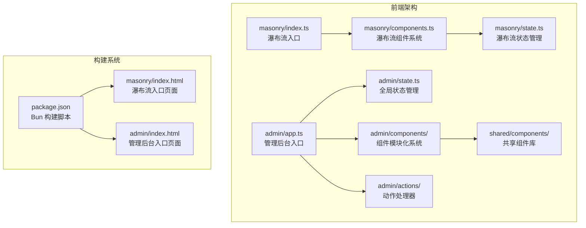
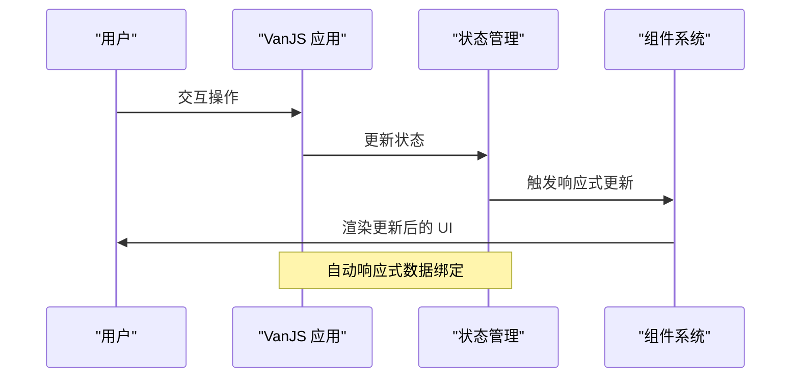
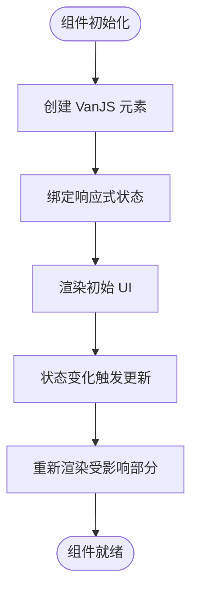
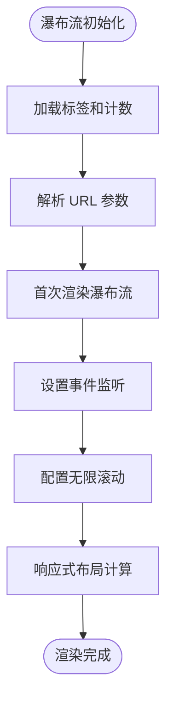
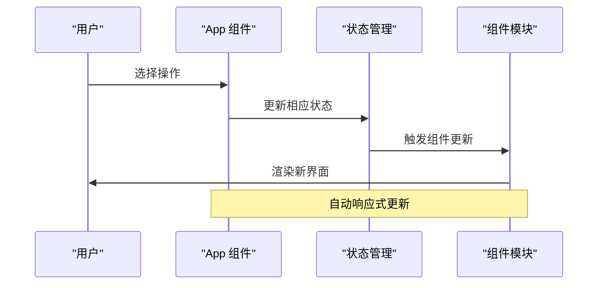
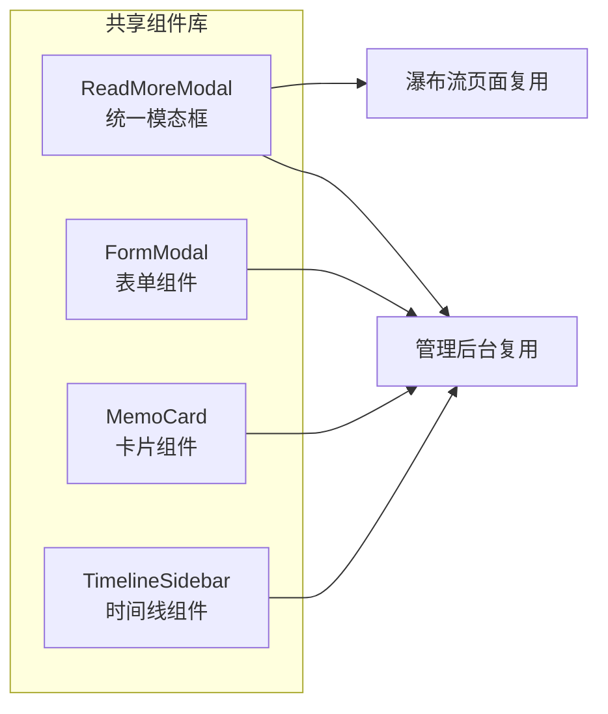
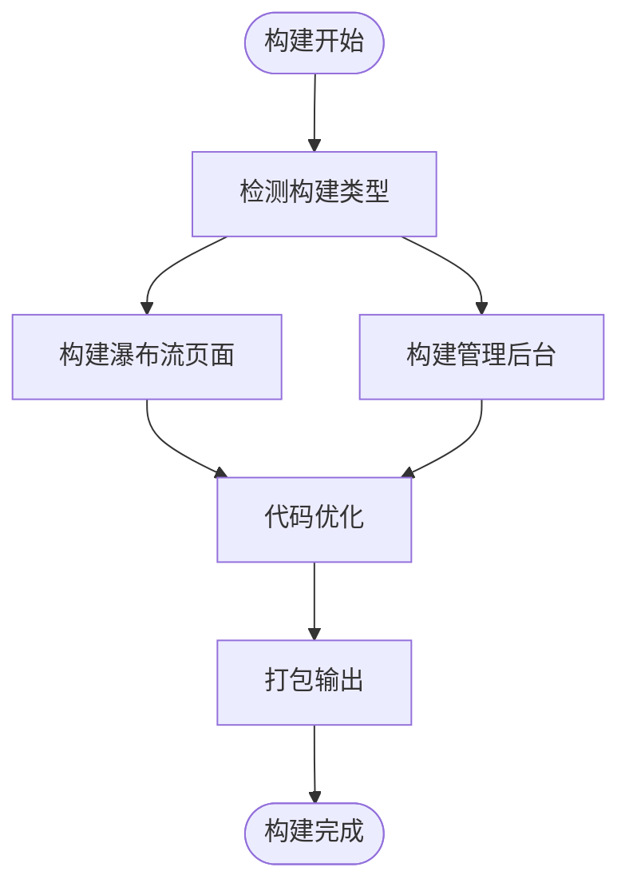
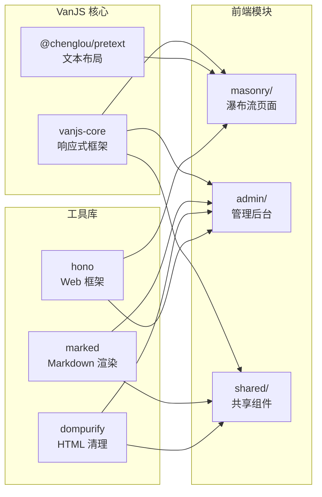
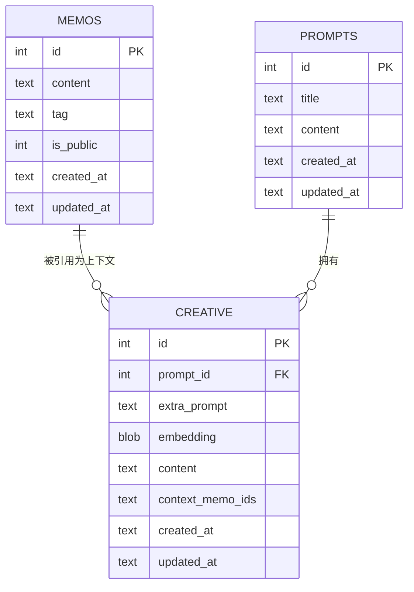

# 前端架构

<cite>
**本文档引用的文件**
- [src/frontend/admin/app.ts](file://src/frontend/admin/app.ts)
- [src/frontend/admin/state.ts](file://src/frontend/admin/state.ts)
- [src/frontend/admin/actions/auth.ts](file://src/frontend/admin/actions/auth.ts)
- [src/frontend/admin/actions/memo.ts](file://src/frontend/admin/actions/memo.ts)
- [src/frontend/admin/components/FormModal.ts](file://src/frontend/admin/components/FormModal.ts)
- [src/frontend/admin/components/MemoCard.ts](file://src/frontend/admin/components/MemoCard.ts)
- [src/frontend/admin/creative.ts](file://src/frontend/admin/creative.ts)
- [src/frontend/masonry/index.ts](file://src/frontend/masonry/index.ts)
- [src/frontend/masonry/components.ts](file://src/frontend/masonry/components.ts)
- [src/frontend/masonry/api.ts](file://src/frontend/masonry/api.ts)
- [src/frontend/masonry/state.ts](file://src/frontend/masonry/state.ts)
- [src/frontend/shared/components/ReadMoreModal.ts](file://src/frontend/shared/components/ReadMoreModal.ts)
- [src/frontend/admin/index.html](file://src/frontend/admin/index.html)
- [src/frontend/masonry/index.html](file://src/frontend/masonry/index.html)
- [package.json](file://package.json)
</cite>

## 更新摘要
**所做更改**
- 全面更新 VanJS 框架使用现状，展示其在管理后台和瀑布流页面中的核心作用
- 新增模块化组件系统的详细分析，包括组件拆分、状态管理和复用机制
- 更新构建和部署流程，反映新的 Bun 构建脚本和优化策略
- 增强状态管理架构说明，详细描述 van.state 的使用模式
- 补充共享组件系统的设计理念和实现细节

## 目录
1. [简介](#简介)
2. [项目结构](#项目结构)
3. [核心组件](#核心组件)
4. [架构总览](#架构总览)
5. [详细组件分析](#详细组件分析)
6. [依赖关系分析](#依赖关系分析)
7. [性能考量](#性能考量)
8. [故障排查指南](#故障排查指南)
9. [结论](#结论)
10. [附录](#附录)

## 简介
本文档面向 memos 项目的前端架构，系统性阐述以下主题：
- **VanJS 框架全面应用**：VanJS 作为核心响应式框架，替代传统手动 DOM 操作
- **模块化组件系统**：基于 VanJS 的组件化开发模式，实现高内聚低耦合
- **状态管理架构**：使用 van.state 进行集中式状态管理，确保数据一致性
- **瀑布流布局系统**：Masonry 算法实现、虚拟滚动优化与响应式设计
- **管理后台 SPA**：完整的单页应用架构，涵盖认证、编辑、AI 辅助与创意内容生成
- **前后端交互模式**：API 调用、错误处理与加载状态管理
- **静态资源构建流程**：基于 Bun 的现代化构建和部署流程
- **前端性能优化技巧**：响应式设计、懒加载和用户体验改进方案

## 项目结构
项目采用"按功能域分层"的组织方式，前端核心分为两块：
- **瀑布流页面**：访客浏览与检索 memos，使用 VanJS 实现响应式渲染
- **管理后台**：基于 VanJS 的完整 SPA，提供认证、编辑、AI 辅助与创意内容生成功能

**图表来源**
- [src/frontend/masonry/index.ts:1-23](file://src/frontend/masonry/index.ts#L1-L23)
- [src/frontend/admin/app.ts:1-251](file://src/frontend/admin/app.ts#L1-L251)
- [src/frontend/admin/state.ts:1-172](file://src/frontend/admin/state.ts#L1-L172)
- [package.json:6-12](file://package.json#L6-L12)

**章节来源**
- [src/frontend/masonry/index.ts:1-23](file://src/frontend/masonry/index.ts#L1-L23)
- [src/frontend/admin/app.ts:1-251](file://src/frontend/admin/app.ts#L1-L251)
- [src/frontend/admin/state.ts:1-172](file://src/frontend/admin/state.ts#L1-L172)
- [package.json:6-12](file://package.json#L6-L12)

## 核心组件
- **VanJS 响应式框架**：使用 van.state 进行状态管理，自动响应式更新 UI
- **模块化组件系统**：将复杂界面拆分为独立的可复用组件，如 MemoCard、FormModal、ReadMoreModal
- **瀑布流渲染器（Masonry）**：使用预计算文本尺寸与列高，通过最短列选择策略进行布局
- **管理后台 SPA**：完整的单页应用，包含认证、编辑、AI 工具箱和创意内容管理
- **共享组件库**：跨页面复用的组件，如 ReadMoreModal 提供统一的模态框体验
- **状态管理架构**：集中式状态管理，确保全局状态的一致性和可预测性

**章节来源**
- [src/frontend/admin/app.ts:44-251](file://src/frontend/admin/app.ts#L44-L251)
- [src/frontend/masonry/components.ts:132-337](file://src/frontend/masonry/components.ts#L132-L337)
- [src/frontend/admin/state.ts:37-172](file://src/frontend/admin/state.ts#L37-L172)

## 架构总览
前端以 VanJS 为核心，通过模块化的组件系统和集中式状态管理实现高效的数据绑定和 UI 更新。瀑布流页面专注于访客体验，管理后台提供完整的创作和管理工作流。

**图表来源**
- [src/frontend/admin/state.ts:37-40](file://src/frontend/admin/state.ts#L37-L40)
- [src/frontend/admin/app.ts:225-232](file://src/frontend/admin/app.ts#L225-L232)

**章节来源**
- [src/frontend/admin/state.ts:37-40](file://src/frontend/admin/state.ts#L37-L40)
- [src/frontend/admin/app.ts:225-232](file://src/frontend/admin/app.ts#L225-L232)

## 详细组件分析

### VanJS 框架与模块化组件系统

**更新** 全面采用 VanJS 框架替代传统 DOM 操作，实现声明式 UI 开发

- **框架核心**：使用 van.tags 创建 DOM 元素，支持响应式状态绑定
- **组件拆分**：将复杂界面拆分为独立组件，每个组件负责特定功能区域
- **状态绑定**：通过 van.state 实现双向数据绑定，自动更新相关 UI
- **生命周期管理**：组件自动管理挂载和卸载，简化内存管理

**图表来源**
- [src/frontend/admin/components/FormModal.ts:22-281](file://src/frontend/admin/components/FormModal.ts#L22-L281)
- [src/frontend/masonry/components.ts:132-201](file://src/frontend/masonry/components.ts#L132-L201)

**章节来源**
- [src/frontend/admin/components/FormModal.ts:22-281](file://src/frontend/admin/components/FormModal.ts#L22-L281)
- [src/frontend/masonry/components.ts:132-201](file://src/frontend/masonry/components.ts#L132-L201)

### 瀑布流布局系统（Masonry）

**更新** 基于 VanJS 的瀑布流实现，结合响应式设计和性能优化

- **设计要点**
  - 文本预处理与缓存：使用 @chenglou/pretext 库缓存文本尺寸，避免重复测量
  - 最短列优先：维护列高度数组，每次插入到当前最短列，保证视觉平衡
  - 响应式列数：根据视口宽度动态计算列数与列宽，移动端单列
  - 懒加载优化：无限滚动配合分页加载，提升大数据量性能
- **关键流程**
  - 初始化：加载标签、计数，解析 URL 参数，触发首次渲染
  - 渲染：计算布局、设置容器高度、定位可见卡片
  - 事件：窗口 resize 与滚动事件节流到下一帧统一渲染
- **性能优化**
  - 防抖搜索（1秒延迟）
  - 布局缓存机制，避免重复计算
  - 模态框状态管理，优化内存使用

**图表来源**
- [src/frontend/masonry/index.ts:6-23](file://src/frontend/masonry/index.ts#L6-L23)
- [src/frontend/masonry/state.ts:84-152](file://src/frontend/masonry/state.ts#L84-L152)

**章节来源**
- [src/frontend/masonry/index.ts:6-23](file://src/frontend/masonry/index.ts#L6-L23)
- [src/frontend/masonry/state.ts:84-152](file://src/frontend/masonry/state.ts#L84-L152)

### 管理后台 SPA（VanJS + 模块化组件）

**更新** 完全基于 VanJS 的管理后台，实现模块化组件架构

- **架构与状态**
  - 使用 van.state 管理认证、Memo 列表、表单状态、全局错误等
  - 组件函数返回可响应的 DOM 片段，自动随状态变化更新
  - 模块化设计：将功能拆分为独立的组件和动作处理器
- **路由与导航**
  - 服务器通过 notFound 中间件兜底 /admin/*，实现 SPA 深度链接
  - 登录页与管理页根据认证状态切换
- **主要功能模块**
  - **认证模块**：检查、登录、登出，集成全局错误处理
  - **Memo 管理**：创建、编辑、切换公开/私密、删除（二次确认）
  - **AI 工具箱**：内容优化、标签建议、风格转换
  - **创意内容**：提示词管理、生成（SSE 流）、读取更多、删除
  - **时间线导航**：年份折叠、月份跳转、选中态高亮

**图表来源**
- [src/frontend/admin/app.ts:81-222](file://src/frontend/admin/app.ts#L81-L222)
- [src/frontend/admin/state.ts:44-115](file://src/frontend/admin/state.ts#L44-L115)

**章节来源**
- [src/frontend/admin/app.ts:81-222](file://src/frontend/admin/app.ts#L81-L222)
- [src/frontend/admin/state.ts:44-115](file://src/frontend/admin/state.ts#L44-L115)

### 共享组件系统

**新增** 跨页面复用的组件库设计

- **ReadMoreModal**：统一的模态框组件，支持 Markdown 渲染
- **组件设计原则**：
  - 单一职责：每个组件专注特定功能
  - 可配置性：通过参数和回调实现灵活定制
  - 状态隔离：避免组件间状态污染
  - 复用性：设计为跨页面可用的通用组件

**图表来源**
- [src/frontend/shared/components/ReadMoreModal.ts:15-71](file://src/frontend/shared/components/ReadMoreModal.ts#L15-L71)
- [src/frontend/admin/components/FormModal.ts:22-281](file://src/frontend/admin/components/FormModal.ts#L22-L281)
- [src/frontend/admin/components/MemoCard.ts:61-346](file://src/frontend/admin/components/MemoCard.ts#L61-L346)

**章节来源**
- [src/frontend/shared/components/ReadMoreModal.ts:15-71](file://src/frontend/shared/components/ReadMoreModal.ts#L15-L71)
- [src/frontend/admin/components/FormModal.ts:22-281](file://src/frontend/admin/components/FormModal.ts#L22-L281)
- [src/frontend/admin/components/MemoCard.ts:61-346](file://src/frontend/admin/components/MemoCard.ts#L61-L346)

### 前后端交互与错误处理

**更新** 基于 VanJS 的统一 API 调用和错误处理机制

- **通用客户端工具**
  - api 封装：统一 fetch、JSON 解析、错误抛出
  - formatDate/truncate 等辅助函数
- **错误处理策略**
  - 服务端返回非 OK 时，客户端抛出包含错误信息的异常
  - 管理后台使用全局错误状态与错误横幅展示
  - 瀑布流页面显示状态消息与错误提示
- **加载状态管理**
  - VanJS 状态驱动按钮禁用、Spinner 显示、空态占位
  - 列表加载、表单提交、AI 请求均具备 loading 状态

**章节来源**
- [src/frontend/admin/actions/auth.ts:12-25](file://src/frontend/admin/actions/auth.ts#L12-L25)
- [src/frontend/admin/actions/memo.ts:30-41](file://src/frontend/admin/actions/memo.ts#L30-L41)
- [src/frontend/masonry/api.ts:51-130](file://src/frontend/masonry/api.ts#L51-L130)

### 静态资源构建与优化

**更新** 基于 Bun 的现代化构建流程

- **构建工具链**
  - 使用 Bun 作为构建工具，替代传统构建工具
  - 支持 ES Module 输出，优化浏览器兼容性
  - 内置热重载开发服务器
- **构建脚本**
  - `build:masonry`: 构建瀑布流页面
  - `build:admin`: 构建管理后台
  - `build`: 同时构建两个页面
  - `start`: 构建并启动开发服务器
- **优化策略**
  - ES Module 输出，支持 Tree Shaking
  - 内联样式和资源，减少 HTTP 请求
  - 开发环境启用 watch，生产环境可配置压缩

**图表来源**
- [package.json:6-12](file://package.json#L6-L12)

**章节来源**
- [package.json:6-12](file://package.json#L6-L12)

## 依赖关系分析

**更新** 基于 VanJS 的模块化依赖关系

**图表来源**
- [src/frontend/masonry/index.ts:1](file://src/frontend/masonry/index.ts#L1)
- [src/frontend/admin/app.ts:1](file://src/frontend/admin/app.ts#L1)
- [package.json:20-26](file://package.json#L20-L26)

**章节来源**
- [src/frontend/masonry/index.ts:1](file://src/frontend/masonry/index.ts#L1)
- [src/frontend/admin/app.ts:1](file://src/frontend/admin/app.ts#L1)
- [package.json:20-26](file://package.json#L20-L26)

## 性能考量

**更新** 基于 VanJS 和现代前端技术的性能优化策略

- **渲染性能**
  - VanJS 细粒度状态更新，避免不必要的整树重绘
  - 布局缓存机制，瀑布流布局计算结果缓存
  - 防抖搜索（1秒延迟），减少 API 调用频率
  - 无限滚动配合分页加载，控制一次性渲染元素数量
- **内存管理**
  - 组件自动清理，避免内存泄漏
  - 模态框状态管理，及时释放 DOM 引用
  - 响应式状态自动垃圾回收
- **网络与缓存**
  - Bun 构建优化，支持 Tree Shaking
  - 服务器端构建缓存，避免重复编译
  - URL 参数同步，支持书签与分享
- **用户体验**
  - 即时响应的状态更新
  - 平滑的动画过渡效果
  - 加载状态指示，提升感知性能

## 故障排查指南

**更新** 基于 VanJS 架构的故障排查方法

- **VanJS 相关问题**
  - 检查状态更新是否正确绑定到组件
  - 验证组件是否正确使用 van.tags 创建元素
  - 确认响应式状态的使用方式符合预期
- **管理后台无法进入**
  - 检查认证接口与密钥配置
  - 查看全局错误状态与登录页错误提示
  - 验证 VanJS 状态初始化是否正确
- **瀑布流无数据或卡顿**
  - 检查 /api/memos 与 /api/memos/tags 是否返回正常
  - 观察控制台是否有构建错误或网络异常
  - 确认 URL 参数与历史记录同步逻辑
- **组件更新异常**
  - 检查 van.state 的使用是否正确
  - 验证组件间的 props 传递是否规范
  - 确认事件处理器的绑定方式

**章节来源**
- [src/frontend/admin/app.ts:225-232](file://src/frontend/admin/app.ts#L225-L232)
- [src/frontend/masonry/api.ts:51-130](file://src/frontend/masonry/api.ts#L51-L130)

## 结论

memos 前端架构以 VanJS 为核心，实现了现代化的响应式开发模式。通过模块化组件系统和集中式状态管理，项目实现了高内聚低耦合的架构设计。瀑布流页面采用高效的 Masonry 布局与响应式设计，满足访客浏览需求；管理后台提供完整的创作工作流，涵盖认证、编辑、AI 辅助与创意内容生成。

VanJS 框架的全面应用带来了显著优势：声明式 UI 开发、自动响应式更新、简洁的状态管理语法。模块化组件系统提高了代码的可维护性和复用性。基于 Bun 的构建流程提供了现代化的开发体验。

建议后续发展方向：
- 在大数据量场景下引入更严格的虚拟化与缓存策略
- 扩展共享组件库，提高跨页面复用率
- 优化构建配置，启用生产环境压缩和缓存
- 增加单元测试覆盖率，确保代码质量

## 附录
- **数据模型概览**

**图表来源**
- [src/frontend/admin/state.ts:21-33](file://src/frontend/admin/state.ts#L21-L33)
- [src/frontend/admin/creative.ts:148-154](file://src/frontend/admin/creative.ts#L148-L154)