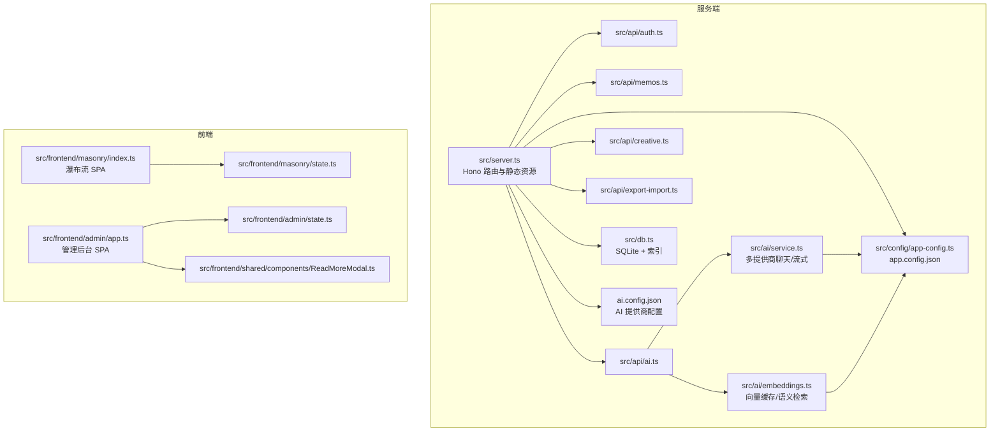
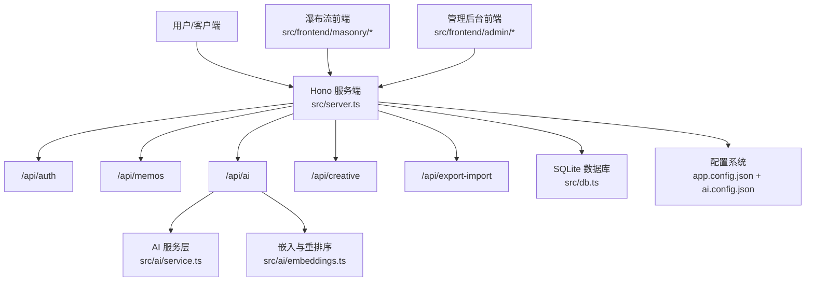
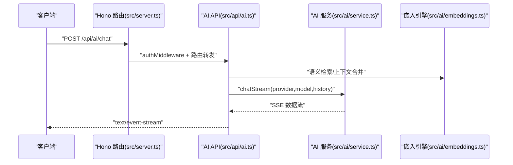
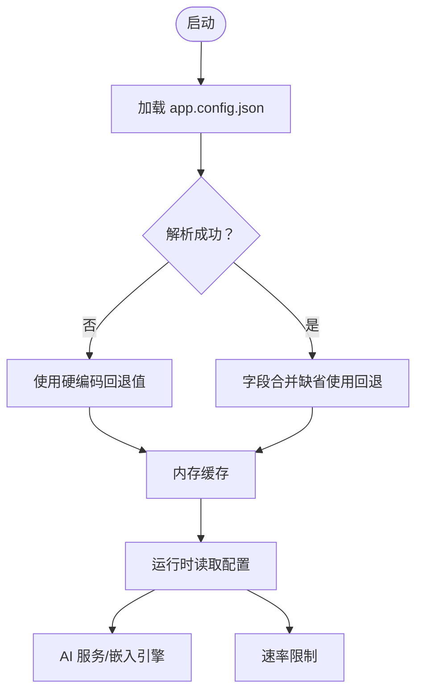
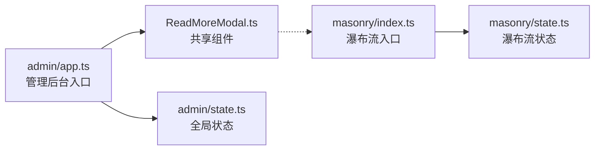
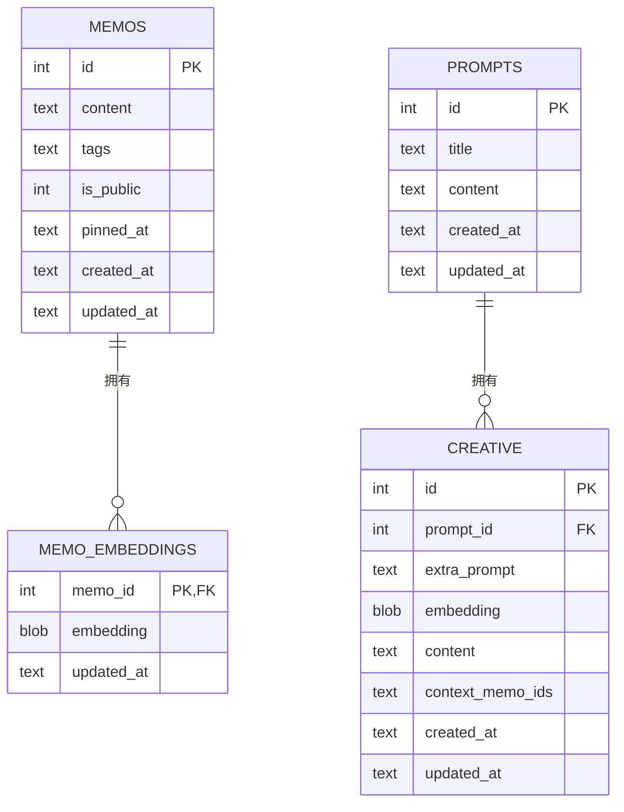
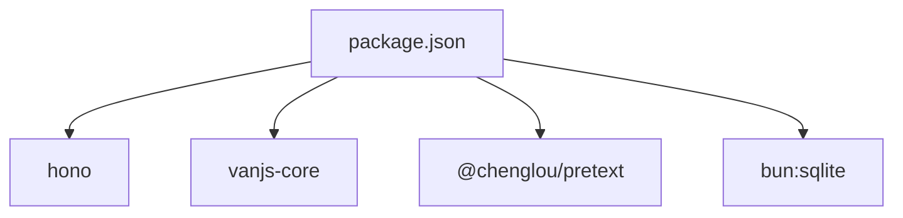

# 可扩展性设计

<cite>
**本文引用的文件**
- [README.md](file://README.md)
- [package.json](file://package.json)
- [src/server.ts](file://src/server.ts)
- [src/db.ts](file://src/db.ts)
- [src/config/app-config.ts](file://src/config/app-config.ts)
- [app.config.json](file://app.config.json)
- [ai.config.json](file://ai.config.json)
- [src/ai/service.ts](file://src/ai/service.ts)
- [src/ai/embeddings.ts](file://src/ai/embeddings.ts)
- [src/api/ai.ts](file://src/api/ai.ts)
- [src/frontend/admin/app.ts](file://src/frontend/admin/app.ts)
- [src/frontend/admin/state.ts](file://src/frontend/admin/state.ts)
- [src/frontend/masonry/index.ts](file://src/frontend/masonry/index.ts)
- [src/frontend/masonry/state.ts](file://src/frontend/masonry/state.ts)
- [src/frontend/shared/components/ReadMoreModal.ts](file://src/frontend/shared/components/ReadMoreModal.ts)
- [docs/superpowers/specs/2026-05-22-ai-writing-toolbox-design.md](file://docs/superpowers/specs/2026-05-22-ai-writing-toolbox-design.md)
- [docs/vanjs.md](file://docs/vanjs.md)
</cite>

## 目录
1. [简介](#简介)
2. [项目结构](#项目结构)
3. [核心组件](#核心组件)
4. [架构总览](#架构总览)
5. [详细组件分析](#详细组件分析)
6. [依赖关系分析](#依赖关系分析)
7. [性能考量](#性能考量)
8. [故障排查指南](#故障排查指南)
9. [结论](#结论)
10. [附录](#附录)

## 简介
本设计文档聚焦 Memmos 的可扩展性能力，围绕以下主题展开：
- 模块化 API 设计与路由组织
- 插件化扩展机制（AI 服务提供商、嵌入与重排序）
- 配置驱动的功能开关与运行时行为控制
- 前端组件的可复用性与状态管理模式
- 数据库扩展策略（索引、查询、缓存）
- 扩展开发指南与最佳实践

## 项目结构
项目采用“前后端同源、按功能域分层”的组织方式：
- 服务端：基于 Hono 的模块化路由，按领域拆分 API 子应用
- 数据层：SQLite（bun:sqlite）+ WAL 模式；提供 CRUD、索引与嵌入向量存储
- 配置层：app.config.json 与 ai.config.json 分别驱动通用配置与 AI 提供商
- 前端：VanJS 响应式组件，分为首页瀑布流与管理后台两个 SPA



图表来源
- [src/server.ts:1-137](file://src/server.ts#L1-L137)
- [src/api/ai.ts:1-326](file://src/api/ai.ts#L1-L326)
- [src/ai/service.ts:1-507](file://src/ai/service.ts#L1-L507)
- [src/ai/embeddings.ts:1-228](file://src/ai/embeddings.ts#L1-L228)
- [src/db.ts:1-484](file://src/db.ts#L1-L484)
- [src/config/app-config.ts:1-108](file://src/config/app-config.ts#L1-L108)
- [ai.config.json:1-44](file://ai.config.json#L1-L44)
- [src/frontend/masonry/index.ts:1-23](file://src/frontend/masonry/index.ts#L1-L23)
- [src/frontend/masonry/state.ts:1-181](file://src/frontend/masonry/state.ts#L1-L181)
- [src/frontend/admin/app.ts:1-251](file://src/frontend/admin/app.ts#L1-L251)
- [src/frontend/admin/state.ts:1-178](file://src/frontend/admin/state.ts#L1-L178)
- [src/frontend/shared/components/ReadMoreModal.ts:1-56](file://src/frontend/shared/components/ReadMoreModal.ts#L1-L56)

章节来源
- [README.md:25-45](file://README.md#L25-L45)
- [package.json:6-12](file://package.json#L6-L12)

## 核心组件
- 服务端路由与静态资源：集中于主入口，按模块挂载子应用，支持 SPA 深度链接与静态资源
- 数据库层：统一初始化、索引、CRUD 与嵌入向量表；提供导入/导出辅助
- 配置系统：app.config.json 与 ai.config.json，结合内存缓存与回退值
- AI 服务层：多提供商聊天、流式输出、DashScope 嵌入与重排序
- 前端状态与组件：VanJS 响应式状态与可复用组件

章节来源
- [src/server.ts:38-137](file://src/server.ts#L38-L137)
- [src/db.ts:15-61](file://src/db.ts#L15-L61)
- [src/config/app-config.ts:57-108](file://src/config/app-config.ts#L57-L108)
- [src/ai/service.ts:43-75](file://src/ai/service.ts#L43-L75)
- [src/ai/embeddings.ts:16-64](file://src/ai/embeddings.ts#L16-L64)
- [src/frontend/admin/app.ts:1-251](file://src/frontend/admin/app.ts#L1-L251)
- [src/frontend/masonry/index.ts:1-23](file://src/frontend/masonry/index.ts#L1-L23)

## 架构总览
系统采用“配置驱动 + 插件化服务 + 模块化 API + 响应式前端”的组合架构。AI 服务通过 ai.config.json 插件化接入多家提供商，同时通过 app.config.json 控制超时、令牌上限、相似度阈值、重排序策略等；前端通过 VanJS 状态模块化管理，组件可跨页面复用。



图表来源
- [src/server.ts:38-137](file://src/server.ts#L38-L137)
- [src/api/ai.ts:21-326](file://src/api/ai.ts#L21-L326)
- [src/ai/service.ts:1-507](file://src/ai/service.ts#L1-L507)
- [src/ai/embeddings.ts:1-228](file://src/ai/embeddings.ts#L1-L228)
- [src/db.ts:1-484](file://src/db.ts#L1-L484)
- [src/config/app-config.ts:1-108](file://src/config/app-config.ts#L1-L108)
- [ai.config.json:1-44](file://ai.config.json#L1-L44)

## 详细组件分析

### 模块化 API 设计
- 路由组织：主入口集中挂载各子应用，便于扩展新领域 API
- 认证中间件：统一鉴权策略，保护敏感操作
- 速率限制：针对 AI 与备忘录操作进行限流，防止滥用
- SSE 流式输出：对话式工作台采用 Server-Sent Events，提升交互体验



图表来源
- [src/server.ts:40-46](file://src/server.ts#L40-L46)
- [src/api/ai.ts:198-326](file://src/api/ai.ts#L198-L326)
- [src/ai/service.ts:480-506](file://src/ai/service.ts#L480-L506)
- [src/ai/embeddings.ts:95-154](file://src/ai/embeddings.ts#L95-L154)

章节来源
- [src/api/ai.ts:21-326](file://src/api/ai.ts#L21-L326)
- [src/server.ts:38-137](file://src/server.ts#L38-L137)

### 插件化扩展机制（AI 服务提供商）
- 多提供商配置：ai.config.json 定义提供商 ID、名称、端点、API Key 环境变量与模型清单
- 默认提供商与模型：支持默认选择，兼容回退策略
- 动态可用性检测：根据环境变量是否存在判定功能可用
- 统一聊天接口：OpenAI 兼容格式，支持同步与流式输出
- 嵌入与重排序：DashScope 嵌入与 qwen3-rerank，支持阈值与 TopN 控制

```mermaid
classDiagram
class AiConfig {
+providers : AiProviderConfig[]
+default : {provider, model}
}
class AiProviderConfig {
+id : string
+name : string
+endpoint : string
+apiKeyEnv : string
+models : string[]
}
class AiService {
+isAiAvailable()
+getAvailableModels()
+optimizeContent()
+suggestTags()
+executeAction()
+generateEmbedding()
+rerankDocuments()
+chatStream()
}
AiConfig --> AiProviderConfig : "包含"
AiService --> AiConfig : "读取配置"
```

图表来源
- [src/ai/service.ts:23-75](file://src/ai/service.ts#L23-L75)
- [ai.config.json:1-44](file://ai.config.json#L1-L44)

章节来源
- [src/ai/service.ts:79-128](file://src/ai/service.ts#L79-L128)
- [src/ai/service.ts:132-175](file://src/ai/service.ts#L132-L175)
- [src/ai/service.ts:351-445](file://src/ai/service.ts#L351-L445)
- [src/ai/service.ts:480-506](file://src/ai/service.ts#L480-L506)

### 配置驱动的功能开关
- app.config.json：统一控制 AI 超时、最大令牌、温度、嵌入相似度阈值、重排序候选与最终数量、速率限制
- 内存缓存与回退：首次加载后缓存，缺失或无效时使用硬编码回退值
- 运行时生效：AI 服务与嵌入引擎均通过 getAppConfig() 读取最新配置



图表来源
- [src/config/app-config.ts:57-108](file://src/config/app-config.ts#L57-L108)
- [app.config.json:1-22](file://app.config.json#L1-L22)

章节来源
- [src/config/app-config.ts:1-108](file://src/config/app-config.ts#L1-L108)
- [src/ai/service.ts:16-18](file://src/ai/service.ts#L16-L18)
- [src/ai/embeddings.ts:104-105](file://src/ai/embeddings.ts#L104-L105)

### 前端组件的可复用性设计
- 组件化架构：VanJS 函数式组件，按职责拆分（如 ReadMoreModal、FormModal、MemoCard）
- 状态模块化：独立 state.ts 导出响应式状态，跨页面共享
- 可复用性：共享组件在 admin 与 masonry 均可使用，减少重复实现
- 最佳实践：类型化 State、条件渲染、模态框交互、滚动控制



图表来源
- [src/frontend/admin/app.ts:1-251](file://src/frontend/admin/app.ts#L1-L251)
- [src/frontend/admin/state.ts:1-178](file://src/frontend/admin/state.ts#L1-L178)
- [src/frontend/masonry/index.ts:1-23](file://src/frontend/masonry/index.ts#L1-L23)
- [src/frontend/masonry/state.ts:1-181](file://src/frontend/masonry/state.ts#L1-L181)
- [src/frontend/shared/components/ReadMoreModal.ts:1-56](file://src/frontend/shared/components/ReadMoreModal.ts#L1-L56)

章节来源
- [docs/vanjs.md:57-77](file://docs/vanjs.md#L57-L77)
- [docs/vanjs.md:80-110](file://docs/vanjs.md#L80-L110)
- [src/frontend/shared/components/ReadMoreModal.ts:1-56](file://src/frontend/shared/components/ReadMoreModal.ts#L1-L56)

### 数据库扩展策略
- 初始化与索引：WAL 模式、外键约束、pinned_at 索引，提升并发与查询效率
- 查询优化：支持按标签集合匹配、模糊搜索、分页与排序；标签查询使用 json_each
- 缓存机制：嵌入向量内存缓存 + SQLite 持久化，首次启动批量生成并持久化
- 导入/导出：支持自定义时间戳导入与全量导出，保障迁移与备份



图表来源
- [src/db.ts:18-61](file://src/db.ts#L18-L61)
- [src/db.ts:122-169](file://src/db.ts#L122-L169)
- [src/db.ts:253-275](file://src/db.ts#L253-L275)
- [src/db.ts:279-336](file://src/db.ts#L279-L336)
- [src/db.ts:353-402](file://src/db.ts#L353-L402)

章节来源
- [src/db.ts:15-61](file://src/db.ts#L15-L61)
- [src/db.ts:122-169](file://src/db.ts#L122-L169)
- [src/ai/embeddings.ts:16-64](file://src/ai/embeddings.ts#L16-L64)

## 依赖关系分析
- 服务端依赖：Hono（路由）、bun:sqlite（数据库）、VanJS（前端构建产物）
- 前端依赖：VanJS、@chenglou/pretext（瀑布流文本排版）
- 配置依赖：app.config.json、ai.config.json



图表来源
- [package.json:19-25](file://package.json#L19-L25)

章节来源
- [package.json:1-26](file://package.json#L1-L26)

## 性能考量
- 数据库层面
  - 使用 WAL 模式提升并发读写
  - 为高频查询字段建立索引（如 pinned_at）
  - 嵌入向量采用内存缓存 + 持久化，避免重复网络调用
- AI 与网络层面
  - 统一超时控制，避免长时间阻塞
  - 流式输出降低首帧延迟
  - 重排序候选与最终数量可配置，平衡质量与性能
- 前端层面
  - 瀑布流布局缓存与窗口尺寸变化检测，减少重复计算
  - 条件渲染与最小化 DOM 更新，提升交互流畅度

## 故障排查指南
- AI 服务不可用
  - 检查 ai.config.json 是否存在对应提供商条目与 API Key 环境变量
  - 使用 /api/ai/status 检测可用功能
- 嵌入与重排序异常
  - 确认 DashScope API Key 设置
  - 查看相似度阈值与候选 TopN 配置是否合理
- 速率限制
  - 观察 /api/ai 接口返回的 429 错误，检查 app.config.json 中的速率限制配置
- 前端状态不一致
  - 检查跨模块状态导出与使用是否一致，遵循 VanJS 最佳实践

章节来源
- [src/api/ai.ts:24-26](file://src/api/ai.ts#L24-L26)
- [src/ai/service.ts:98-115](file://src/ai/service.ts#L98-L115)
- [src/ai/embeddings.ts:104-105](file://src/ai/embeddings.ts#L104-L105)
- [src/config/app-config.ts:103-108](file://src/config/app-config.ts#L103-L108)

## 结论
Memmos 通过“配置驱动 + 插件化 + 模块化 + 响应式前端”的组合，实现了良好的可扩展性：
- API 层清晰分层，易于新增领域
- AI 服务以配置为中心，支持多提供商切换与扩展
- 前端状态与组件模块化，提升复用与可维护性
- 数据库与缓存策略兼顾性能与可靠性
建议在扩展新功能时遵循现有模式：优先配置化、其次模块化、最后前端组件复用。

## 附录
- 扩展开发指南与最佳实践
  - 遵循“配置优先”原则，尽量通过 app.config.json 与 ai.config.json 控制行为
  - 新增 API 时，先在 src/api 下创建子应用，再在 src/server.ts 中挂载
  - 前端状态统一导出到独立模块，组件间通过状态共享实现解耦
  - 使用 VanJS 最佳实践：类型化 State、条件渲染、模态框交互、滚动控制
  - 数据库变更需考虑索引与查询性能，必要时增加索引或调整查询策略
  - AI 相关扩展需关注超时、限流与重试策略，保证稳定性

章节来源
- [docs/vanjs.md:543-563](file://docs/vanjs.md#L543-L563)
- [docs/superpowers/specs/2026-05-22-ai-writing-toolbox-design.md:12-37](file://docs/superpowers/specs/2026-05-22-ai-writing-toolbox-design.md#L12-L37)