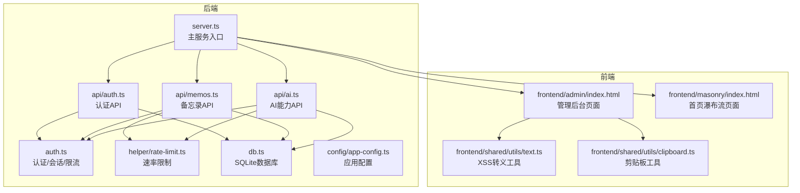
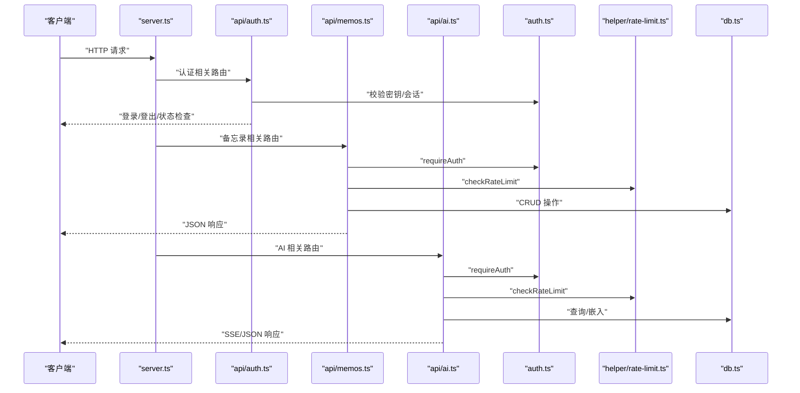
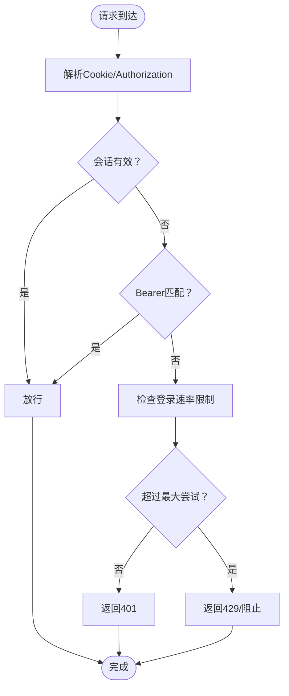
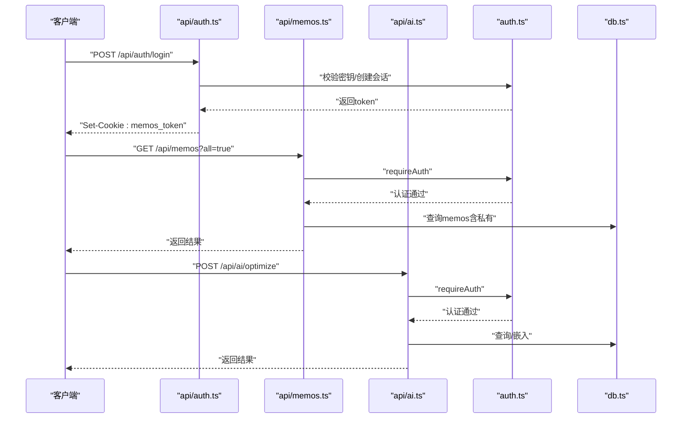
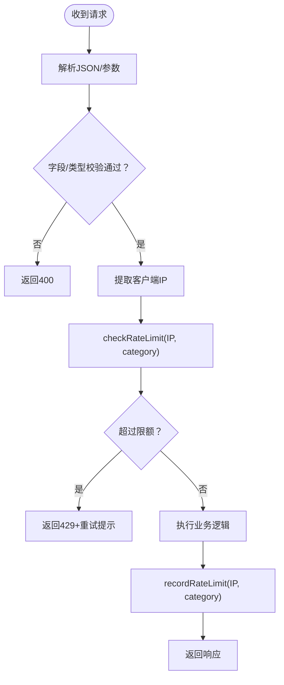
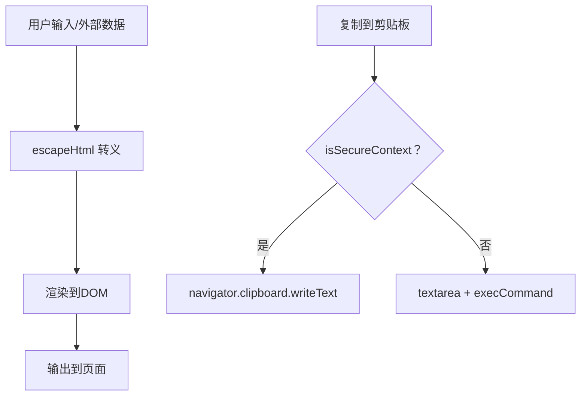
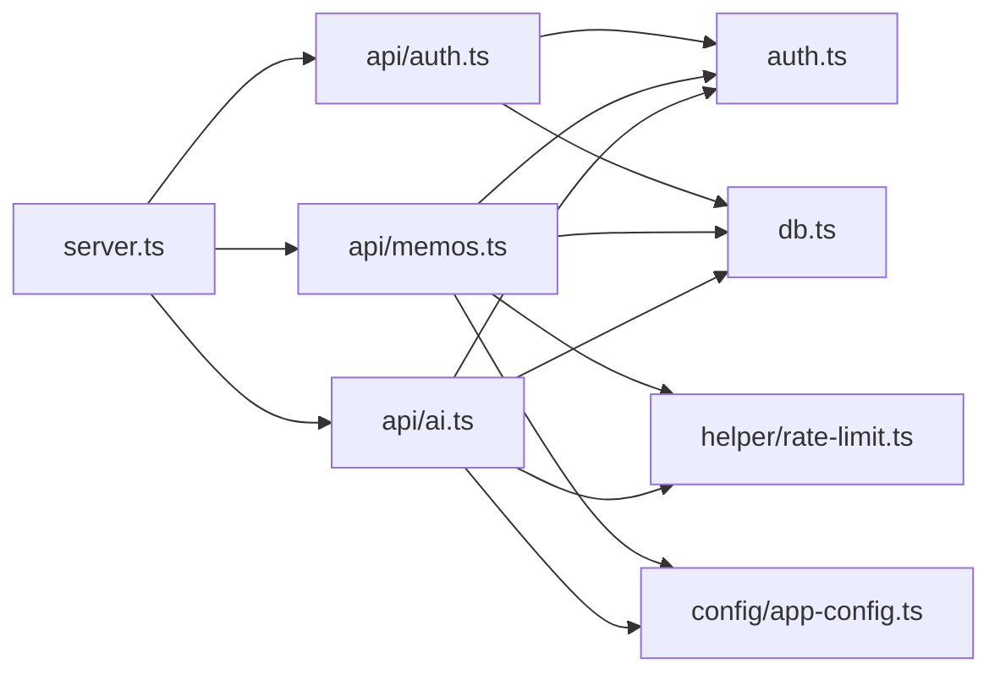

# 安全架构

<cite>
**本文档引用的文件**
- [src/auth.ts](file://src/auth.ts)
- [src/api/auth.ts](file://src/api/auth.ts)
- [src/helper/rate-limit.ts](file://src/helper/rate-limit.ts)
- [src/api/memos.ts](file://src/api/memos.ts)
- [src/api/ai.ts](file://src/api/ai.ts)
- [src/server.ts](file://src/server.ts)
- [src/db.ts](file://src/db.ts)
- [src/config/app-config.ts](file://src/config/app-config.ts)
- [package.json](file://package.json)
- [app.config.json](file://app.config.json)
- [README.md](file://README.md)
- [src/frontend/shared/utils/text.ts](file://src/frontend/shared/utils/text.ts)
- [src/frontend/shared/utils/clipboard.ts](file://src/frontend/shared/utils/clipboard.ts)
- [src/frontend/masonry/index.html](file://src/frontend/masonry/index.html)
- [src/frontend/admin/index.html](file://src/frontend/admin/index.html)
</cite>

## 目录
1. [简介](#简介)
2. [项目结构](#项目结构)
3. [核心组件](#核心组件)
4. [架构总览](#架构总览)
5. [详细组件分析](#详细组件分析)
6. [依赖关系分析](#依赖关系分析)
7. [性能考虑](#性能考虑)
8. [故障排查指南](#故障排查指南)
9. [结论](#结论)
10. [附录](#附录)

## 简介
本文件面向Memmos项目的安全架构，聚焦认证与授权、会话与Cookie管理、权限控制、API安全策略（请求验证、速率限制、输入过滤）、数据安全（敏感信息处理、传输与存储）、前端安全实践（XSS防护、CSRF保护、内容安全策略）以及安全配置与最佳实践。文档以代码为依据，结合可视化图示帮助读者快速理解系统安全设计。

## 项目结构
Memmos采用前后端同构的Bun运行时，后端使用Hono框架组织API路由，前端使用VanJS与Pretext构建SPA页面。认证与授权集中在后端模块，API层对速率限制与输入校验进行统一处理，数据库层负责持久化与查询。

**图表来源**
- [src/server.ts:38-125](file://src/server.ts#L38-L125)
- [src/api/auth.ts:29-77](file://src/api/auth.ts#L29-L77)
- [src/api/memos.ts:26-220](file://src/api/memos.ts#L26-L220)
- [src/api/ai.ts:21-326](file://src/api/ai.ts#L21-L326)
- [src/auth.ts:1-128](file://src/auth.ts#L1-L128)
- [src/helper/rate-limit.ts:1-153](file://src/helper/rate-limit.ts#L1-L153)
- [src/db.ts:1-484](file://src/db.ts#L1-L484)
- [src/config/app-config.ts:1-108](file://src/config/app-config.ts#L1-L108)
- [src/frontend/admin/index.html:1-1076](file://src/frontend/admin/index.html#L1-L1076)
- [src/frontend/masonry/index.html:1-427](file://src/frontend/masonry/index.html#L1-L427)
- [src/frontend/shared/utils/text.ts:1-11](file://src/frontend/shared/utils/text.ts#L1-L11)
- [src/frontend/shared/utils/clipboard.ts:1-24](file://src/frontend/shared/utils/clipboard.ts#L1-L24)

**章节来源**
- [src/server.ts:38-125](file://src/server.ts#L38-L125)
- [src/api/auth.ts:29-77](file://src/api/auth.ts#L29-L77)
- [src/api/memos.ts:26-220](file://src/api/memos.ts#L26-L220)
- [src/api/ai.ts:21-326](file://src/api/ai.ts#L21-L326)
- [src/auth.ts:1-128](file://src/auth.ts#L1-L128)
- [src/helper/rate-limit.ts:1-153](file://src/helper/rate-limit.ts#L1-L153)
- [src/db.ts:1-484](file://src/db.ts#L1-L484)
- [src/config/app-config.ts:1-108](file://src/config/app-config.ts#L1-L108)
- [src/frontend/admin/index.html:1-1076](file://src/frontend/admin/index.html#L1-L1076)
- [src/frontend/masonry/index.html:1-427](file://src/frontend/masonry/index.html#L1-L427)
- [src/frontend/shared/utils/text.ts:1-11](file://src/frontend/shared/utils/text.ts#L1-L11)
- [src/frontend/shared/utils/clipboard.ts:1-24](file://src/frontend/shared/utils/clipboard.ts#L1-L24)

## 核心组件
- 认证与会话管理：基于内存会话与HttpOnly Cookie，支持Bearer Token认证用于CLI/API调用。
- 权限控制：部分API（如获取全部备忘录、管理操作）需要认证；公开/私密字段由数据库层控制。
- 速率限制：按IP维度的小时/日双窗口限制，区分备忘录与AI两类。
- 输入验证与过滤：API层对JSON解析、必填字段、空字符串、标签数组进行校验；前端提供HTML转义工具。
- 数据安全：SQLite本地存储，WAL模式；敏感信息通过环境变量注入；传输层面依赖部署方HTTPS。
- 前端安全：XSS转义工具、剪贴板复制的安全上下文检查、页面基础样式与结构。

**章节来源**
- [src/auth.ts:1-128](file://src/auth.ts#L1-L128)
- [src/api/memos.ts:28-70](file://src/api/memos.ts#L28-L70)
- [src/helper/rate-limit.ts:77-153](file://src/helper/rate-limit.ts#L77-L153)
- [src/frontend/shared/utils/text.ts:1-11](file://src/frontend/shared/utils/text.ts#L1-L11)
- [src/db.ts:15-61](file://src/db.ts#L15-L61)
- [src/frontend/shared/utils/clipboard.ts:1-24](file://src/frontend/shared/utils/clipboard.ts#L1-L24)

## 架构总览
下图展示了从客户端到后端API与数据库的整体交互流程，以及安全控制点（认证、速率限制、输入校验）的位置。

**图表来源**
- [src/server.ts:38-125](file://src/server.ts#L38-L125)
- [src/api/auth.ts:29-77](file://src/api/auth.ts#L29-L77)
- [src/api/memos.ts:26-220](file://src/api/memos.ts#L26-L220)
- [src/api/ai.ts:21-326](file://src/api/ai.ts#L21-L326)
- [src/auth.ts:111-128](file://src/auth.ts#L111-L128)
- [src/helper/rate-limit.ts:77-153](file://src/helper/rate-limit.ts#L77-L153)
- [src/db.ts:15-484](file://src/db.ts#L15-L484)

## 详细组件分析

### 认证与会话管理
- 会话存储：内存集合保存session token，服务重启即失效，适合开发与单实例场景。
- Cookie策略：使用HttpOnly与SameSite=Strict，设置Max-Age=24小时，降低XSS与CSRF风险。
- Bearer Token：通过Authorization头传递，用于CLI或非浏览器调用，令牌来自环境变量MEMOS_SECRET_KEY。
- 登录频率限制：针对IP记录尝试次数与首遇时间，超过阈值进入冷却窗口，防止暴力破解。
- 中间件：Hono中间件requireAuth统一拦截未认证请求，返回401。

**图表来源**
- [src/auth.ts:23-46](file://src/auth.ts#L23-L46)
- [src/auth.ts:72-107](file://src/auth.ts#L72-L107)
- [src/auth.ts:111-128](file://src/auth.ts#L111-L128)

**章节来源**
- [src/auth.ts:1-128](file://src/auth.ts#L1-L128)
- [src/api/auth.ts:14-27](file://src/api/auth.ts#L14-L27)
- [src/api/auth.ts:36-76](file://src/api/auth.ts#L36-L76)

### 权限控制与API访问
- 认证API：/api/auth/check、/api/auth/login、/api/auth/logout，登录成功写入安全Cookie。
- 备忘录API：/api/memos及子路径均受中间件保护；当all=true时需认证才返回私有备忘录。
- AI API：/api/ai/*均需认证；根据可用性检测决定是否开放功能。
- 数据库层：is_public字段控制可见性；查询时按需过滤私有内容。

**图表来源**
- [src/api/auth.ts:31-76](file://src/api/auth.ts#L31-L76)
- [src/api/memos.ts:28-70](file://src/api/memos.ts#L28-L70)
- [src/api/memos.ts:103-144](file://src/api/memos.ts#L103-L144)
- [src/api/ai.ts:33-72](file://src/api/ai.ts#L33-L72)
- [src/auth.ts:111-128](file://src/auth.ts#L111-L128)
- [src/db.ts:122-169](file://src/db.ts#L122-L169)

**章节来源**
- [src/api/auth.ts:29-77](file://src/api/auth.ts#L29-L77)
- [src/api/memos.ts:26-220](file://src/api/memos.ts#L26-L220)
- [src/api/ai.ts:21-326](file://src/api/ai.ts#L21-L326)
- [src/db.ts:122-169](file://src/db.ts#L122-L169)

### API安全策略：请求验证与速率限制
- 请求验证：
  - JSON解析异常返回400；
  - 必填字段校验（content、action等）；
  - 标签数组过滤空值与非法类型；
  - 参数类型校验（id、pinned布尔值等）。
- 速率限制：
  - IP级双窗口（小时/天）计数；
  - 备忘录与AI分别配置限额；
  - 环境变量优先级高于app.config.json，再回退至硬编码默认值；
  - 超限时返回429与重试时间提示。

**图表来源**
- [src/api/memos.ts:103-144](file://src/api/memos.ts#L103-L144)
- [src/api/memos.ts:146-187](file://src/api/memos.ts#L146-L187)
- [src/api/memos.ts:189-199](file://src/api/memos.ts#L189-L199)
- [src/api/memos.ts:201-220](file://src/api/memos.ts#L201-L220)
- [src/api/ai.ts:33-72](file://src/api/ai.ts#L33-L72)
- [src/api/ai.ts:74-112](file://src/api/ai.ts#L74-L112)
- [src/api/ai.ts:114-196](file://src/api/ai.ts#L114-L196)
- [src/helper/rate-limit.ts:77-153](file://src/helper/rate-limit.ts#L77-L153)
- [src/config/app-config.ts:23-28](file://src/config/app-config.ts#L23-L28)

**章节来源**
- [src/api/memos.ts:103-144](file://src/api/memos.ts#L103-L144)
- [src/api/memos.ts:146-187](file://src/api/memos.ts#L146-L187)
- [src/api/memos.ts:189-199](file://src/api/memos.ts#L189-L199)
- [src/api/memos.ts:201-220](file://src/api/memos.ts#L201-L220)
- [src/api/ai.ts:33-72](file://src/api/ai.ts#L33-L72)
- [src/api/ai.ts:74-112](file://src/api/ai.ts#L74-L112)
- [src/api/ai.ts:114-196](file://src/api/ai.ts#L114-L196)
- [src/helper/rate-limit.ts:1-153](file://src/helper/rate-limit.ts#L1-153)
- [src/config/app-config.ts:1-108](file://src/config/app-config.ts#L1-L108)
- [app.config.json:1-22](file://app.config.json#L1-L22)

### 数据安全保护
- 传输安全：建议在生产环境启用HTTPS终止（如反向代理），避免明文传输。
- 存储安全：SQLite数据库文件本地存储，WAL模式提升并发；敏感配置通过环境变量注入（MEMOS_SECRET_KEY）。
- 敏感信息处理：登录密钥仅在内存中比较，不落盘；会话token随机生成且短期有效。
- 数据库初始化：自动创建表结构与索引，避免SQL注入依赖严格的参数绑定。

**章节来源**
- [src/db.ts:15-61](file://src/db.ts#L15-L61)
- [src/auth.ts:41-46](file://src/auth.ts#L41-L46)
- [src/api/auth.ts:14-27](file://src/api/auth.ts#L14-L27)

### 前端安全实践
- XSS防护：提供escapeHtml工具函数，对用户输入进行HTML转义，避免DOM XSS。
- CSRF保护：当前实现未见显式的CSRF令牌机制；建议在表单提交场景引入CSRF令牌并在后端校验。
- 内容安全策略（CSP）：当前HTML模板未设置CSP头；建议在生产环境增加CSP以限制脚本来源与内联脚本。
- 剪贴板安全：copyToClipboard在非安全上下文（HTTP）下降级处理，避免阻塞；建议在HTTPS环境下使用现代剪贴板API。

**图表来源**
- [src/frontend/shared/utils/text.ts:1-11](file://src/frontend/shared/utils/text.ts#L1-L11)
- [src/frontend/shared/utils/clipboard.ts:1-24](file://src/frontend/shared/utils/clipboard.ts#L1-L24)
- [src/frontend/masonry/index.html:1-427](file://src/frontend/masonry/index.html#L1-L427)
- [src/frontend/admin/index.html:1-1076](file://src/frontend/admin/index.html#L1-L1076)

**章节来源**
- [src/frontend/shared/utils/text.ts:1-11](file://src/frontend/shared/utils/text.ts#L1-L11)
- [src/frontend/shared/utils/clipboard.ts:1-24](file://src/frontend/shared/utils/clipboard.ts#L1-L24)
- [src/frontend/masonry/index.html:1-427](file://src/frontend/masonry/index.html#L1-L427)
- [src/frontend/admin/index.html:1-1076](file://src/frontend/admin/index.html#L1-L1076)

## 依赖关系分析
- 服务入口依赖各API子应用与静态资源分发。
- API层依赖认证模块与速率限制模块，数据库模块被API层广泛调用。
- 配置模块提供速率限制与AI相关参数，支持环境变量覆盖。

**图表来源**
- [src/server.ts:38-125](file://src/server.ts#L38-L125)
- [src/api/auth.ts:29-77](file://src/api/auth.ts#L29-L77)
- [src/api/memos.ts:26-220](file://src/api/memos.ts#L26-L220)
- [src/api/ai.ts:21-326](file://src/api/ai.ts#L21-L326)
- [src/auth.ts:1-128](file://src/auth.ts#L1-L128)
- [src/helper/rate-limit.ts:1-153](file://src/helper/rate-limit.ts#L1-L153)
- [src/db.ts:1-484](file://src/db.ts#L1-L484)
- [src/config/app-config.ts:1-108](file://src/config/app-config.ts#L1-L108)

**章节来源**
- [src/server.ts:38-125](file://src/server.ts#L38-L125)
- [src/api/memos.ts:26-220](file://src/api/memos.ts#L26-L220)
- [src/api/ai.ts:21-326](file://src/api/ai.ts#L21-L326)
- [src/auth.ts:1-128](file://src/auth.ts#L1-L128)
- [src/helper/rate-limit.ts:1-153](file://src/helper/rate-limit.ts#L1-L153)
- [src/db.ts:1-484](file://src/db.ts#L1-L484)
- [src/config/app-config.ts:1-108](file://src/config/app-config.ts#L1-L108)

## 性能考虑
- 速率限制采用内存Map存储，具备O(1)查询与更新复杂度，适合单实例部署。
- 备忘录查询使用SQLite与索引（如pinned_at），LIKE模糊匹配可能影响性能，建议配合分页与标签过滤。
- AI相关操作（嵌入、相似检索）为异步触发，避免阻塞主流程。
- 建议在高并发场景引入Redis等共享缓存替代内存Map，或在多实例部署时统一会话存储。

## 故障排查指南
- 401 Unauthorized：检查Cookie是否正确设置与未过期；确认Authorization头Bearer Token与MEMOS_SECRET_KEY一致。
- 403/429 Too Many Requests：查看速率限制配置与环境变量；等待冷却时间或降低请求频率。
- 400 Bad Request：检查请求体JSON格式与必填字段；确认标签数组与参数类型。
- 登录失败：确认MEMOS_SECRET_KEY已设置且与请求体key一致；查看登录冷却状态。
- 数据库问题：确认memos.db文件存在与权限正常；检查表结构初始化日志。

**章节来源**
- [src/auth.ts:111-128](file://src/auth.ts#L111-L128)
- [src/api/auth.ts:36-76](file://src/api/auth.ts#L36-L76)
- [src/helper/rate-limit.ts:77-153](file://src/helper/rate-limit.ts#L77-L153)
- [src/api/memos.ts:103-144](file://src/api/memos.ts#L103-L144)
- [src/db.ts:15-61](file://src/db.ts#L15-L61)

## 结论
Memmos在认证与授权方面采用简洁有效的方案：内存会话+HttpOnly Cookie，配合Bearer Token满足不同调用场景；API层统一进行请求验证与速率限制；前端提供基础XSS防护与剪贴板安全处理。建议在生产环境中补充HTTPS、CSRF令牌与CSP策略，以进一步提升整体安全性。

## 附录

### 安全配置清单与最佳实践
- 环境变量
  - MEMOS_SECRET_KEY：管理员登录密钥（生产环境必须设置）
  - PORT：服务端口（默认3020）
- 部署建议
  - 使用反向代理启用TLS终止，确保Cookie的Secure属性生效（当前实现未强制Secure，建议在HTTPS环境下部署）
  - 在多实例部署时替换内存会话为共享存储（如Redis）
  - 引入CSRF令牌与CSP头，增强前端安全
- 配置文件
  - app.config.json：速率限制、AI与嵌入参数的默认值与覆盖项
- API安全要点
  - 所有写操作均需认证
  - 速率限制按IP维度实施，区分memo与ai两类
  - 输入严格校验，拒绝空内容与非法类型

**章节来源**
- [README.md:59-81](file://README.md#L59-L81)
- [src/api/auth.ts:14-27](file://src/api/auth.ts#L14-L27)
- [src/config/app-config.ts:1-108](file://src/config/app-config.ts#L1-L108)
- [app.config.json:1-22](file://app.config.json#L1-L22)
- [src/frontend/admin/index.html:1-1076](file://src/frontend/admin/index.html#L1-L1076)
- [src/frontend/masonry/index.html:1-427](file://src/frontend/masonry/index.html#L1-L427)