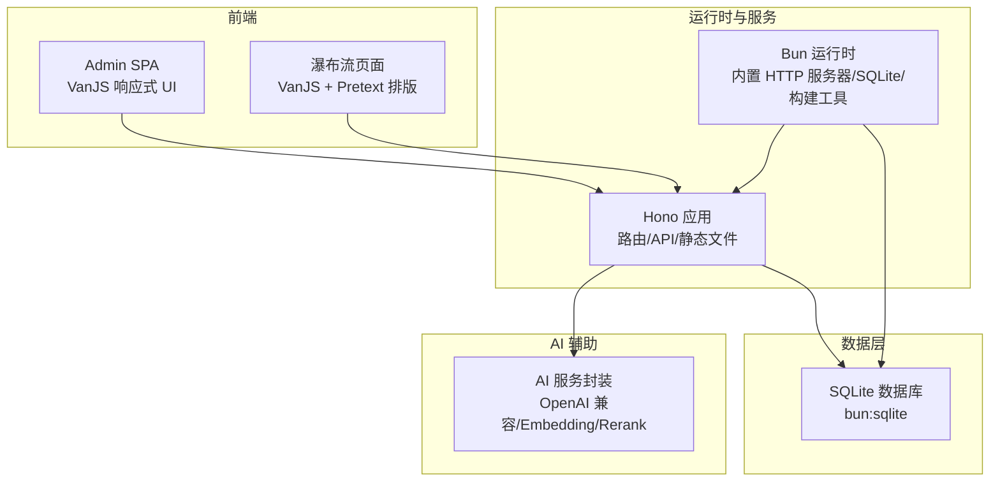
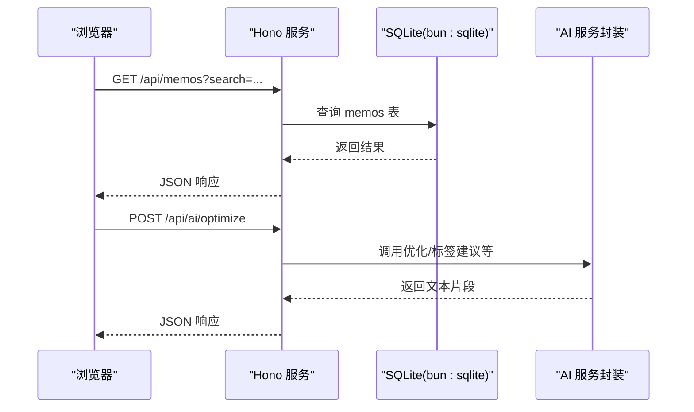
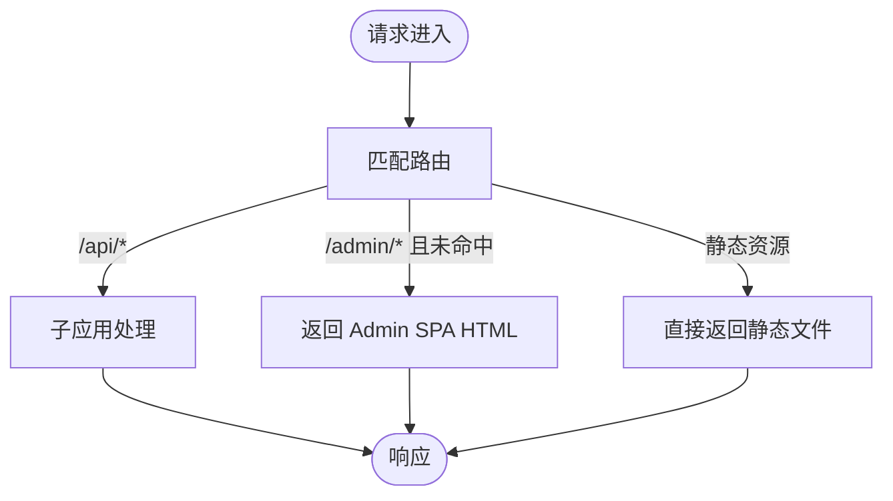
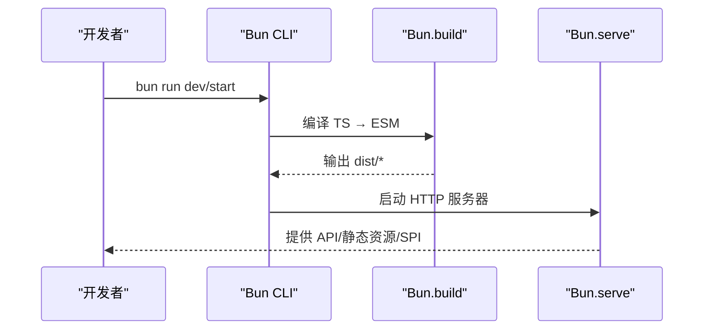
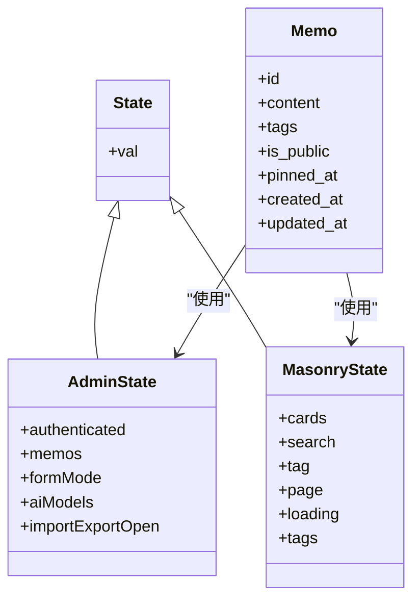
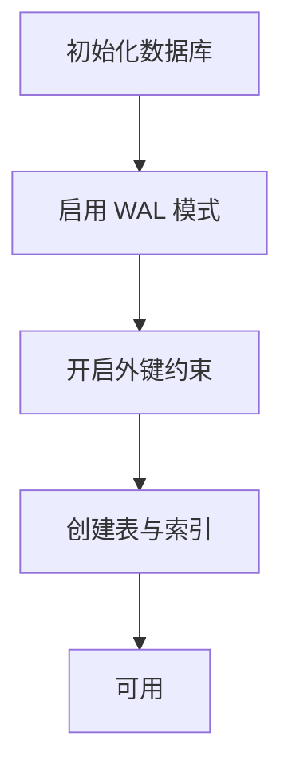
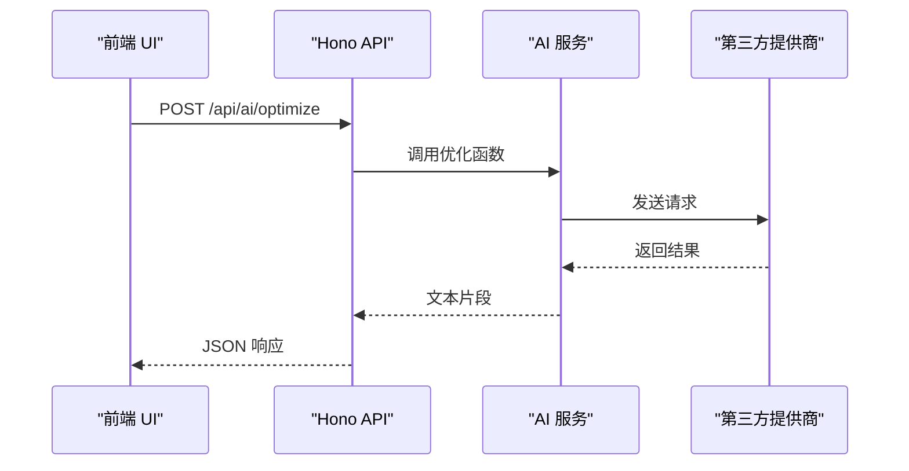
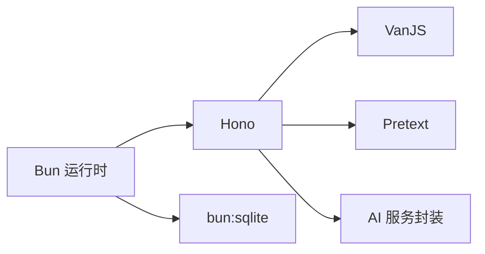

# 技术栈选型

<cite>
**本文档引用的文件**
- [package.json](file://package.json)
- [bun.lock](file://bun.lock)
- [README.md](file://README.md)
- [CLAUDE.md](file://CLAUDE.md)
- [src/server.ts](file://src/server.ts)
- [src/db.ts](file://src/db.ts)
- [src/model.ts](file://src/model.ts)
- [src/frontend/admin/index.html](file://src/frontend/admin/index.html)
- [src/frontend/admin/app.ts](file://src/frontend/admin/app.ts)
- [src/frontend/masonry/index.html](file://src/frontend/masonry/index.html)
- [src/frontend/masonry/index.ts](file://src/frontend/masonry/index.ts)
- [src/frontend/masonry/state.ts](file://src/frontend/masonry/state.ts)
- [src/frontend/admin/state.ts](file://src/frontend/admin/state.ts)
- [src/ai/service.ts](file://src/ai/service.ts)
- [docs/vanjs.md](file://docs/vanjs.md)
</cite>

## 目录
1. [引言](#引言)
2. [项目结构](#项目结构)
3. [核心组件](#核心组件)
4. [架构总览](#架构总览)
5. [详细组件分析](#详细组件分析)
6. [依赖关系分析](#依赖关系分析)
7. [性能考量](#性能考量)
8. [故障排查指南](#故障排查指南)
9. [结论](#结论)
10. [附录](#附录)

## 引言
本技术栈选型文档面向 Memos 项目，系统阐述各技术组件的选择原因、优势以及它们如何协同满足项目在开发效率、运行性能与部署便利性方面的目标。重点覆盖：
- Hono 框架的轻量与生态契合
- Bun 运行时的高性能与一体化能力
- VanJS 的响应式设计与极简组件模型
- SQLite 的轻量存储与内嵌部署优势
- 前端构建与运行策略（Bun.build + HTML 导入）

## 项目结构
项目采用“前后端同构 + 内嵌数据库”的单体架构，前端通过 VanJS 实现响应式 UI，后端使用 Hono 提供 REST API 与静态页面路由，数据库采用 Bun 内置的 SQLite 扩展，运行时统一由 Bun 提供。

图表来源
- [src/server.ts:1-125](file://src/server.ts#L1-L125)
- [src/db.ts:1-13](file://src/db.ts#L1-L13)
- [src/frontend/admin/app.ts:1-251](file://src/frontend/admin/app.ts#L1-L251)
- [src/frontend/masonry/index.ts:1-23](file://src/frontend/masonry/index.ts#L1-L23)
- [src/ai/service.ts:1-507](file://src/ai/service.ts#L1-L507)

章节来源
- [README.md:25-45](file://README.md#L25-L45)
- [src/server.ts:1-125](file://src/server.ts#L1-L125)

## 核心组件
- 运行时与服务：Bun 提供高性能运行时、内置 HTTP 服务器、SQLite、构建工具与测试能力，简化开发与部署。
- Web 框架：Hono 轻量、TypeScript 友好、生态丰富，适合本项目的 API 与静态页面路由。
- 前端框架：VanJS 以响应式状态为核心，组件即函数，语法简洁，适合快速迭代。
- 数据存储：SQLite（bun:sqlite）零配置、WAL 模式、事务友好，适配小体量应用。
- 前端构建：Bun.build 将 TypeScript 编译为 ESM，配合 HTML 导入，无需额外打包器。
- 文本排版：Pretext 用于瀑布流页面的精确排版与高度计算。

章节来源
- [package.json:19-25](file://package.json#L19-L25)
- [bun.lock:23-47](file://bun.lock#L23-L47)
- [README.md:14-24](file://README.md#L14-L24)

## 架构总览
整体架构围绕“单体运行时 + 内嵌数据库 + 响应式前端”的模式展开，后端负责路由、API、静态资源与 SPA 入口，前端通过 VanJS 实现响应式交互，数据持久化由 SQLite 完成。

图表来源
- [src/server.ts:40-46](file://src/server.ts#L40-L46)
- [src/db.ts:122-169](file://src/db.ts#L122-L169)
- [src/ai/service.ts:249-264](file://src/ai/service.ts#L249-L264)

## 详细组件分析

### Hono 框架：轻量与生态契合
- 选择原因
  - 轻量、TypeScript 友好、生态丰富，适合本项目的小体量 API 与静态页面路由。
  - 与 Bun 的 HTTP 服务器结合，减少中间层开销。
- 优势体现
  - 路由清晰：子应用挂载、静态资源与 SPA 入口路由分离。
  - 错误处理：未命中路由返回 SPA，便于前端路由兜底。
- 关键实现
  - 子应用挂载：认证、备忘录、AI、创意、导入导出等模块路由。
  - SPA 兜底：对 /admin/* 的未命中返回 Admin SPA。
  - 静态资源：favicon、CSS、预构建 JS 的直传。

图表来源
- [src/server.ts:40-107](file://src/server.ts#L40-L107)

章节来源
- [src/server.ts:38-107](file://src/server.ts#L38-L107)
- [README.md:14-24](file://README.md#L14-L24)

### Bun 运行时：高性能与一体化
- 选择原因
  - 高性能：原生 Bun 运行时，启动快、内存占用低。
  - 一体化：内置 HTTP 服务器、SQLite、构建工具、测试框架，减少外部依赖。
- 优势体现
  - 启动与热重载：开发模式下 watch 启动，提升迭代效率。
  - 构建：Bun.build 直接将 TS 编译为 ESM，无需额外打包器。
  - 数据库：bun:sqlite 提供 WAL 模式与外键约束，降低运维成本。
- 关键实现
  - 服务器：Bun.serve 统一处理 fetch。
  - 数据库：WAL 模式、外键开启、索引优化。
  - 构建：分别构建 Admin SPA 与瀑布流页面。

图表来源
- [package.json:6-11](file://package.json#L6-L11)
- [src/server.ts:119-125](file://src/server.ts#L119-L125)
- [src/db.ts:8-13](file://src/db.ts#L8-L13)

章节来源
- [package.json:6-11](file://package.json#L6-L11)
- [src/server.ts:119-125](file://src/server.ts#L119-L125)
- [src/db.ts:8-13](file://src/db.ts#L8-L13)
- [CLAUDE.md:1-20](file://CLAUDE.md#L1-L20)

### VanJS：响应式设计与极简组件
- 选择原因
  - 响应式状态驱动 UI，语法简洁，适合快速搭建管理后台与瀑布流页面。
  - 组件即函数，无模板语言，学习成本低。
- 优势体现
  - 状态集中：全局状态模块化导出，跨组件共享。
  - 条件渲染：通过响应式子节点函数实现加载/空/错误态。
  - 表单与交互：输入同步、模态框、下拉菜单等常见交互简单易用。
- 关键实现
  - Admin SPA：登录、备忘录 CRUD、标签建议、导入导出、创意工作流。
  - 瀑布流：卡片准备、布局计算、虚拟滚动、URL 同步。

图表来源
- [src/frontend/admin/state.ts:37-178](file://src/frontend/admin/state.ts#L37-L178)
- [src/frontend/masonry/state.ts:42-60](file://src/frontend/masonry/state.ts#L42-L60)
- [src/model.ts:1-35](file://src/model.ts#L1-L35)

章节来源
- [src/frontend/admin/app.ts:1-251](file://src/frontend/admin/app.ts#L1-L251)
- [src/frontend/admin/state.ts:1-178](file://src/frontend/admin/state.ts#L1-L178)
- [src/frontend/masonry/index.ts:1-23](file://src/frontend/masonry/index.ts#L1-L23)
- [src/frontend/masonry/state.ts:1-181](file://src/frontend/masonry/state.ts#L1-L181)
- [docs/vanjs.md:1-563](file://docs/vanjs.md#L1-L563)

### SQLite：轻量存储与内嵌部署
- 选择原因
  - 零配置、WAL 模式、外键约束，适合小体量应用。
  - 与 Bun 内置集成，无需额外安装与运维。
- 优势体现
  - 初始化：首次启动自动创建数据库与表结构。
  - 查询：JSON 函数支持标签数组查询，灵活高效。
  - 索引：对常用查询字段建立索引，提升检索性能。
- 关键实现
  - 数据库连接：单例模式，延迟初始化。
  - 表结构：memos、memo_embeddings、prompts、creative。
  - 查询：分页、搜索、标签筛选、计数。

图表来源
- [src/db.ts:15-61](file://src/db.ts#L15-L61)

章节来源
- [src/db.ts:1-484](file://src/db.ts#L1-L484)
- [README.md:66-72](file://README.md#L66-L72)

### 前端构建与运行：Bun.build + HTML 导入
- 选择原因
  - 无需额外打包器，开发体验一致，生产构建稳定。
  - HTML 导入天然支持 CSS/Tailwind/React 等，减少配置成本。
- 优势体现
  - 开发：热重载，快速迭代。
  - 生产：预构建 JS，静态资源直传。
- 关键实现
  - 构建脚本：分别构建 Admin SPA 与瀑布流页面。
  - 静态资源：favicon、CSS、预构建 JS 的路由映射。

章节来源
- [package.json:8-11](file://package.json#L8-L11)
- [src/server.ts:56-98](file://src/server.ts#L56-L98)

### AI 服务封装：OpenAI 兼容与向量化
- 选择原因
  - 通过标准 fetch 实现 OpenAI 兼容接口，便于切换不同提供商。
  - 支持流式输出、嵌入向量生成与重排序，满足创意工作流与检索增强。
- 优势体现
  - 多提供商配置：支持从环境变量解析 API Key 与 Endpoint。
  - 流式生成：支持创意内容与聊天工作区的流式输出。
  - 嵌入与重排序：基于 DashScope 的 Embedding 与 rerank。
- 关键实现
  - 配置加载：本地配置文件或回退到 DeepSeek。
  - 聊天完成：通用 OpenAI 兼容接口。
  - 流式聊天：解析 SSE 数据块，逐段产出。
  - 嵌入与重排序：DashScope API 调用。

图表来源
- [src/ai/service.ts:249-264](file://src/ai/service.ts#L249-L264)
- [src/server.ts:42-43](file://src/server.ts#L42-L43)

章节来源
- [src/ai/service.ts:1-507](file://src/ai/service.ts#L1-L507)

## 依赖关系分析
- 运行时与构建
  - Bun 提供 HTTP 服务器、SQLite、构建工具与测试框架。
- 框架与库
  - Hono 作为 Web 框架，VanJS 作为前端响应式框架，Pretext 用于文本排版。
- 数据与 AI
  - SQLite 作为数据存储，AI 服务封装第三方提供商接口。

图表来源
- [package.json:19-25](file://package.json#L19-L25)
- [bun.lock:23-47](file://bun.lock#L23-L47)

章节来源
- [package.json:19-25](file://package.json#L19-L25)
- [bun.lock:23-47](file://bun.lock#L23-L47)

## 性能考量
- 启动与冷启动
  - Bun 原生运行时与内置 HTTP 服务器显著降低启动时间。
  - 预构建 JS 与静态资源直传减少首屏等待。
- 数据库性能
  - WAL 模式提升并发写入性能；外键约束保障数据一致性。
  - JSON 函数与索引优化查询路径。
- 前端性能
  - VanJS 响应式状态最小化重渲染；瀑布流布局计算与缓存减少 DOM 操作。
  - Pretext 精确排版避免重排与重绘。
- AI 交互
  - 流式输出降低等待感；超时控制与错误降级提升稳定性。

## 故障排查指南
- 服务器无法启动
  - 检查端口占用与权限；确认环境变量是否正确。
- 静态资源 404
  - 确认构建产物存在；检查路由映射与 base 标签注入。
- 数据库异常
  - 检查 WAL 模式与外键设置；确认表结构与索引是否存在。
- AI 接口失败
  - 检查提供商 API Key 与 Endpoint；确认网络连通性与超时设置。
- 前端状态不更新
  - 确认状态赋值方式（.val）与响应式子节点函数使用是否正确。

章节来源
- [src/server.ts:119-125](file://src/server.ts#L119-L125)
- [src/db.ts:8-13](file://src/db.ts#L8-L13)
- [src/ai/service.ts:16-18](file://src/ai/service.ts#L16-L18)

## 结论
本技术栈通过“Bun + Hono + VanJS + SQLite”的组合，在开发效率、运行性能与部署便利性之间取得良好平衡。Bun 的一体化能力与高性能运行时为项目提供了坚实的基础设施；Hono 的轻量与生态契合了 API 与静态页面路由需求；VanJS 的响应式模型降低了前端开发复杂度；SQLite 的内嵌特性简化了数据层运维。该选型适合中小体量、追求快速迭代与低运维成本的应用场景。

## 附录
- 版本兼容性与依赖管理
  - 运行时：Bun >= 1.3.3（环境要求）
  - 前端框架：VanJS 1.6.0、Pretext 用于瀑布流排版
  - 数据库：bun:sqlite（随 Bun 内置）
  - 构建与测试：Bun.build、Bun.test
- 最佳实践
  - 使用响应式状态集中管理 UI 状态，避免跨组件重复维护。
  - 对高频查询建立索引，合理使用 JSON 函数进行标签筛选。
  - 对 AI 请求设置超时与错误降级，保证用户体验。
  - 通过预构建与静态资源直传优化首屏性能。

章节来源
- [README.md:49-81](file://README.md#L49-L81)
- [package.json:19-25](file://package.json#L19-L25)
- [docs/vanjs.md:543-561](file://docs/vanjs.md#L543-L561)