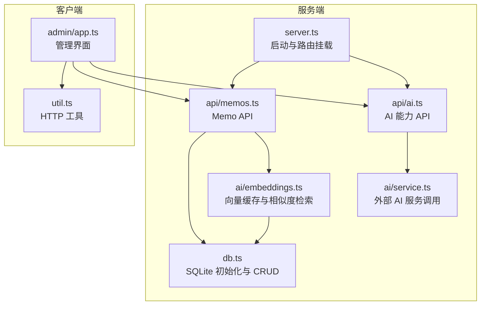
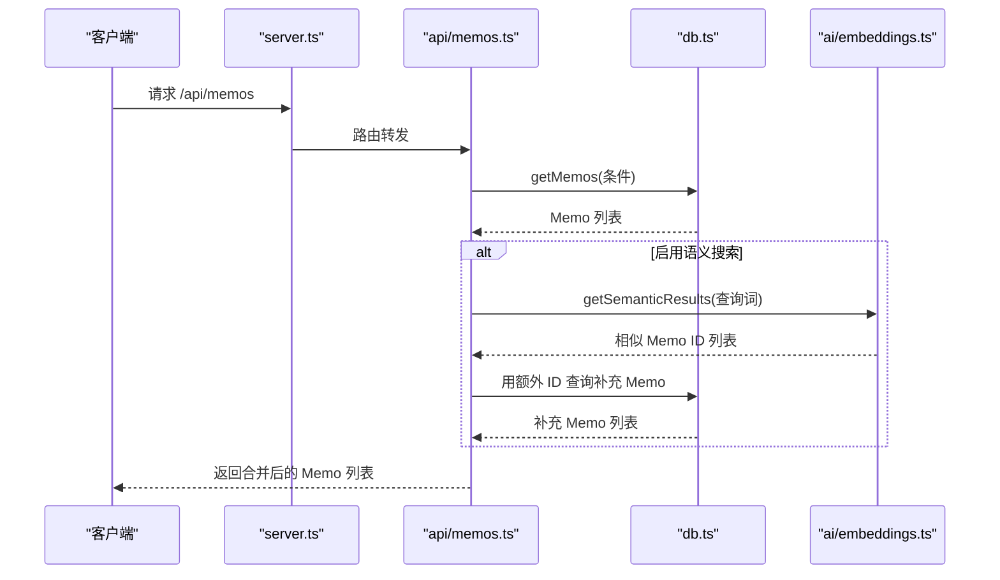
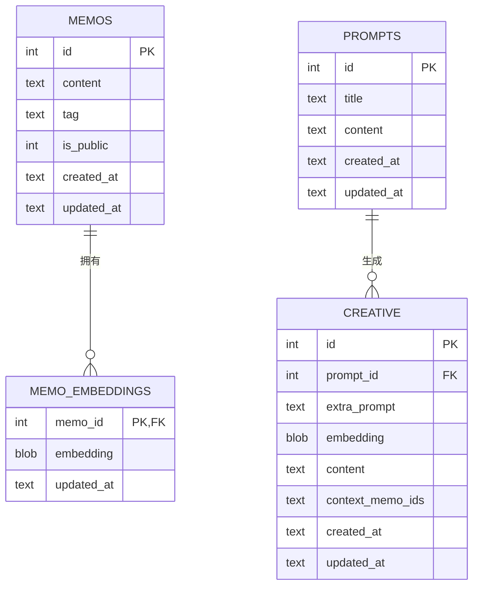
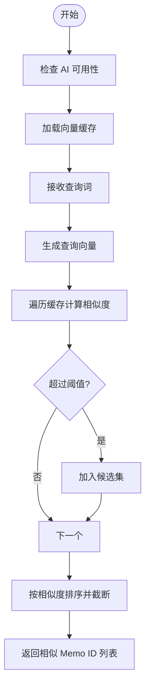
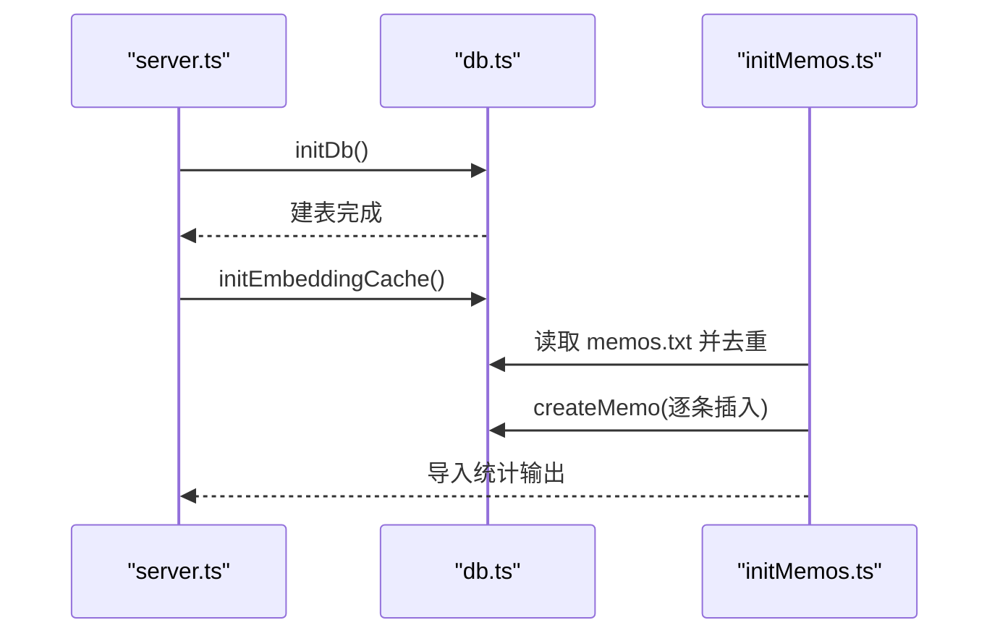
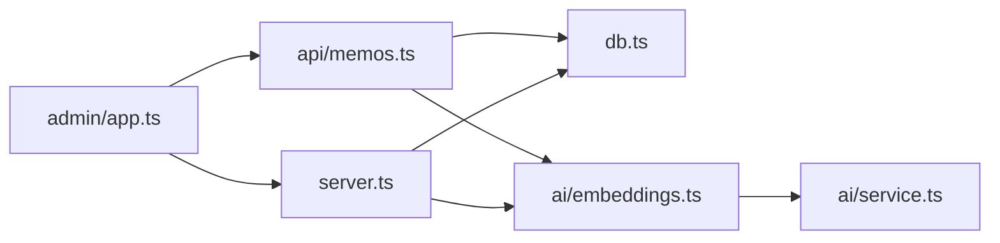

# 数据库设计

<cite>
**本文引用的文件**
- [src/db.ts](file://src/db.ts)
- [src/model.ts](file://src/model.ts)
- [src/server.ts](file://src/server.ts)
- [src/api/memos.ts](file://src/api/memos.ts)
- [src/ai/embeddings.ts](file://src/ai/embeddings.ts)
- [src/ai/service.ts](file://src/ai/service.ts)
- [script/initMemos.ts](file://script/initMemos.ts)
- [src/admin/app.ts](file://src/admin/app.ts)
- [src/util.ts](file://src/util.ts)
</cite>

## 目录
1. [简介](#简介)
2. [项目结构](#项目结构)
3. [核心组件](#核心组件)
4. [架构总览](#架构总览)
5. [详细组件分析](#详细组件分析)
6. [依赖关系分析](#依赖关系分析)
7. [性能与优化](#性能与优化)
8. [故障排查指南](#故障排查指南)
9. [结论](#结论)
10. [附录](#附录)

## 简介
本文件系统性梳理 memos 项目的数据库设计，重点围绕以下目标展开：
- 说明选择 SQLite 的原因以及启用 WAL 模式的优势
- 解释数据模型与实体关系（Memo、Tag、CreativeItem 等）
- 阐述 CRUD 实现模式、查询优化与事务处理策略
- 描述数据库初始化流程与表结构设计原则
- 提供数据迁移策略与版本管理建议
- 解释内存缓存机制与性能优化措施

## 项目结构
该项目采用“服务端即数据库”的轻量级架构：后端以 Hono 作为 Web 框架，使用 Bun 的内置 SQLite 引擎持久化数据；AI 功能通过外部服务生成嵌入向量并缓存在内存中，同时将向量序列化存储于 SQLite 表中，形成“内存 + 磁盘”的混合缓存体系。

图表来源
- [src/server.ts:1-127](file://src/server.ts#L1-L127)
- [src/api/memos.ts:1-139](file://src/api/memos.ts#L1-L139)
- [src/api/ai.ts:1-67](file://src/api/ai.ts#L1-L67)
- [src/db.ts:1-349](file://src/db.ts#L1-L349)
- [src/ai/embeddings.ts:1-99](file://src/ai/embeddings.ts#L1-L99)
- [src/ai/service.ts:1-289](file://src/ai/service.ts#L1-L289)
- [src/admin/app.ts:1-677](file://src/admin/app.ts#L1-L677)
- [src/util.ts:1-43](file://src/util.ts#L1-L43)

章节来源
- [src/server.ts:1-127](file://src/server.ts#L1-L127)
- [src/db.ts:1-349](file://src/db.ts#L1-L349)

## 核心组件
- 数据库层：负责连接、初始化、CRUD 与查询优化
- 模型层：定义 Memo、Prompt、CreativeItem 的接口
- API 层：对外暴露 REST 接口，协调数据库与 AI 能力
- 内存缓存层：基于 Map 的向量缓存，支持相似度检索
- 初始化脚本：批量导入初始数据，去重与统计

章节来源
- [src/db.ts:1-349](file://src/db.ts#L1-L349)
- [src/model.ts:1-28](file://src/model.ts#L1-L28)
- [src/api/memos.ts:1-139](file://src/api/memos.ts#L1-L139)
- [src/ai/embeddings.ts:1-99](file://src/ai/embeddings.ts#L1-L99)
- [script/initMemos.ts:1-62](file://script/initMemos.ts#L1-L62)

## 架构总览
数据库层通过单例模式获取连接，初始化时启用 WAL 模式与外键约束，并在服务启动时执行建表逻辑。API 层在请求到达后调用数据库层进行数据操作；当涉及语义搜索时，API 层会并发触发 SQL LIKE 查询与向量相似度检索，再合并结果返回给客户端。

图表来源
- [src/api/memos.ts:20-47](file://src/api/memos.ts#L20-L47)
- [src/db.ts:99-131](file://src/db.ts#L99-L131)
- [src/ai/embeddings.ts:66-86](file://src/ai/embeddings.ts#L66-L86)

## 详细组件分析

### 数据库初始化与表结构设计
- 连接与模式
  - 单例连接：首次访问时创建 SQLite 文件连接，设置 journal_mode=WAL 与 foreign_keys=ON
  - WAL 模式优势：允许多读写并发，降低锁竞争，提升吞吐；回滚段与主数据库分离，减少阻塞
  - 外键约束：开启外键检查，确保引用完整性（如 creative.prompt_id 与 prompts.id）

- 表结构与字段设计原则
  - memos：记录备忘内容、标签、公开状态、时间戳
  - memo_embeddings：保存每个 Memo 对应的向量（BLOB），并维护更新时间
  - prompts：保存 AI 提示词模板
  - creative：保存基于提示词生成的创意内容，包含上下文 Memo ID 列表等

- 建表与索引建议
  - 当前未显式创建索引，但 LIKE 查询可通过 LIKE + ORDER BY 顺序扫描
  - 可考虑为 tag 字段建立索引以加速按标签过滤
  - 为 created_at 建立索引可优化排序与分页场景

章节来源
- [src/db.ts:15-57](file://src/db.ts#L15-L57)
- [src/db.ts:18-56](file://src/db.ts#L18-L56)

### 数据模型与实体关系
- 模型接口
  - Memo：包含 id、content、tag、is_public、created_at、updated_at
  - Prompt：包含 id、title、content、created_at、updated_at
  - CreativeItem：包含 id、prompt_id、extra_prompt、embedding、content、context_memo_ids、created_at、updated_at

- 关系设计
  - Memo 与 MemoEmbedding：一对一（memo_embeddings.memo_id -> memos.id）
  - Prompt 与 Creative：一对多（creative.prompt_id -> prompts.id，CASCADE 删除）
  - Tag：字符串字段，用于分类与过滤

图表来源
- [src/model.ts:1-28](file://src/model.ts#L1-L28)
- [src/db.ts:18-56](file://src/db.ts#L18-L56)

### CRUD 实现模式与查询优化
- 查询
  - getMemos：动态拼接 WHERE 条件（公开过滤、ID 列表、LIKE 搜索、标签过滤），最后按 created_at 降序
  - getAllTags：DISTINCT tag 过滤空值并排序
  - countMemos：按是否公开统计总数
  - getMemo：按主键查询

- 写入
  - createMemo：插入新 Memo 并返回最新记录
  - updateMemo：按需更新字段并刷新 updated_at
  - deleteMemo：删除 Memo（无级联删除，依赖外键约束）

- 查询优化建议
  - LIKE 模糊匹配：当前未使用索引，建议对 content 建立虚拟列 + 全文索引（FTS5）或对 tag 建立普通索引
  - 分页：可引入 LIMIT/OFFSET 或基于 created_at 的游标分页
  - 合并语义搜索：LIKE 结果与向量相似度结果去重合并，避免重复加载

- 事务处理
  - 当前未显式开启事务，所有写操作为自动提交
  - 对于批量写入（如初始化脚本），可考虑使用事务包裹以保证原子性与性能

章节来源
- [src/db.ts:99-195](file://src/db.ts#L99-L195)
- [src/api/memos.ts:20-47](file://src/api/memos.ts#L20-L47)

### 语义搜索与内存缓存机制
- 向量缓存
  - 内存缓存：Map<memo_id, Float32Array>，启动时从数据库加载所有向量
  - 写入：upsertEmbedding 将 Float32Array 转换为 Buffer 写入 memo_embeddings
  - 清理：deleteEmbeddingCache 删除内存与磁盘中的对应项

- 相似度检索
  - cosineSimilarity 计算余弦相似度，超过阈值的 ID 参与排序并限制返回数量
  - getSemanticResults 在 AI 可用且缓存非空时执行

- 与 API 的集成
  - /api/memos 在搜索时并发触发 SQL LIKE 与语义搜索，再合并结果
  - 新建/更新 Memo 时异步生成并缓存向量

图表来源
- [src/ai/embeddings.ts:66-86](file://src/ai/embeddings.ts#L66-L86)
- [src/ai/embeddings.ts:12-35](file://src/ai/embeddings.ts#L12-L35)
- [src/ai/service.ts:147-181](file://src/ai/service.ts#L147-L181)

### 数据迁移策略与版本管理
- 当前现状
  - 未发现显式的迁移脚本或版本号字段
  - 初始化仅执行建表与基础数据导入

- 建议方案
  - 版本控制：新增一个版本表或在现有表中添加 version 字段
  - 迁移流程：启动时检测版本，按顺序执行迁移脚本（如添加索引、调整字段、重命名列）
  - 回滚策略：为关键迁移提供逆向脚本，确保失败可恢复
  - 兼容性：对新增字段提供默认值，避免破坏旧数据

[本节为通用建议，不直接分析具体文件，故无章节来源]

### 初始化流程与数据导入
- 服务启动
  - server.ts 在启动时调用 initDb() 与 initEmbeddingCache()
  - db.ts 初始化 SQLite 连接、WAL 模式与外键约束，并执行建表

- 批量导入
  - initMemos.ts 读取文本文件，按分隔符拆分条目，去重后逐条插入
  - 统计成功/跳过/失败数量，便于验证导入质量

图表来源
- [src/server.ts:114-118](file://src/server.ts#L114-L118)
- [src/db.ts:15-57](file://src/db.ts#L15-L57)
- [script/initMemos.ts:1-62](file://script/initMemos.ts#L1-L62)

## 依赖关系分析
- 组件耦合
  - api/memos.ts 依赖 db.ts 与 ai/embeddings.ts
  - ai/embeddings.ts 依赖 db.ts 与 ai/service.ts
  - server.ts 依赖 db.ts 与 ai/embeddings.ts 的初始化入口

- 外部依赖
  - SQLite 由 Bun 提供
  - AI 能力通过 fetch 调用外部服务（DeepSeek/DashScope）

图表来源
- [src/api/memos.ts:1-139](file://src/api/memos.ts#L1-L139)
- [src/db.ts:1-349](file://src/db.ts#L1-L349)
- [src/ai/embeddings.ts:1-99](file://src/ai/embeddings.ts#L1-L99)
- [src/ai/service.ts:1-289](file://src/ai/service.ts#L1-L289)
- [src/server.ts:1-127](file://src/server.ts#L1-L127)
- [src/admin/app.ts:1-677](file://src/admin/app.ts#L1-L677)

## 性能与优化
- WAL 模式优势
  - 提升并发读写能力，降低锁冲突
  - 更好的崩溃恢复与日志管理

- 查询优化
  - LIKE 模糊匹配：建议对 content/tag 建立索引或 FTS5
  - 分页：游标分页优于 OFFSET，减少大偏移带来的性能损耗
  - 合并语义搜索：LIKE 与向量相似度并行，注意去重与上限控制

- 内存缓存
  - 向量缓存显著降低重复计算成本
  - 启动时批量加载，运行时异步更新，避免阻塞主线程

- 事务与批处理
  - 批量导入建议使用事务包裹，减少写放大与 I/O 开销

[本节为通用指导，不直接分析具体文件，故无章节来源]

## 故障排查指南
- 数据库连接问题
  - 确认 SQLite 文件权限与路径正确
  - 检查 WAL 模式与外键约束是否生效

- 查询异常
  - LIKE 模糊匹配性能差：考虑建立索引或改用 FTS5
  - 排序与分页：确认 created_at 字段格式一致

- 语义搜索失败
  - 检查 AI 服务可用性与网络连通性
  - 确认向量维度与类型一致（Float32Array）

- 初始化失败
  - 查看导入脚本输出统计，定位重复/错误条目
  - 确保 memos.txt 格式正确

章节来源
- [src/db.ts:15-57](file://src/db.ts#L15-L57)
- [src/ai/embeddings.ts:12-35](file://src/ai/embeddings.ts#L12-L35)
- [script/initMemos.ts:1-62](file://script/initMemos.ts#L1-L62)

## 结论
memon 的数据库设计以 SQLite 为核心，结合 WAL 模式与外键约束，满足轻量级应用的高并发与一致性需求。通过内存向量缓存与语义搜索融合，实现了高效的模糊与语义检索体验。建议后续引入索引、版本迁移与事务批处理，进一步提升性能与可维护性。

## 附录
- 关键实现路径参考
  - 数据库初始化与建表：[src/db.ts:15-57](file://src/db.ts#L15-L57)
  - CRUD 方法集合：[src/db.ts:99-195](file://src/db.ts#L99-L195)
  - 语义搜索与缓存：[src/ai/embeddings.ts:12-86](file://src/ai/embeddings.ts#L12-L86)
  - 服务启动与路由：[src/server.ts:114-118](file://src/server.ts#L114-L118)
  - 批量导入脚本：[script/initMemos.ts:1-62](file://script/initMemos.ts#L1-L62)