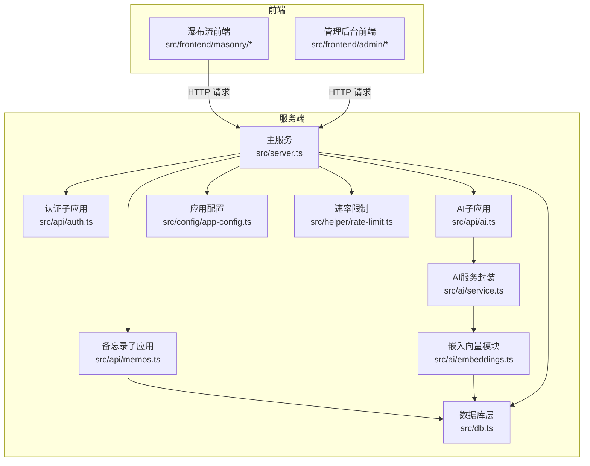
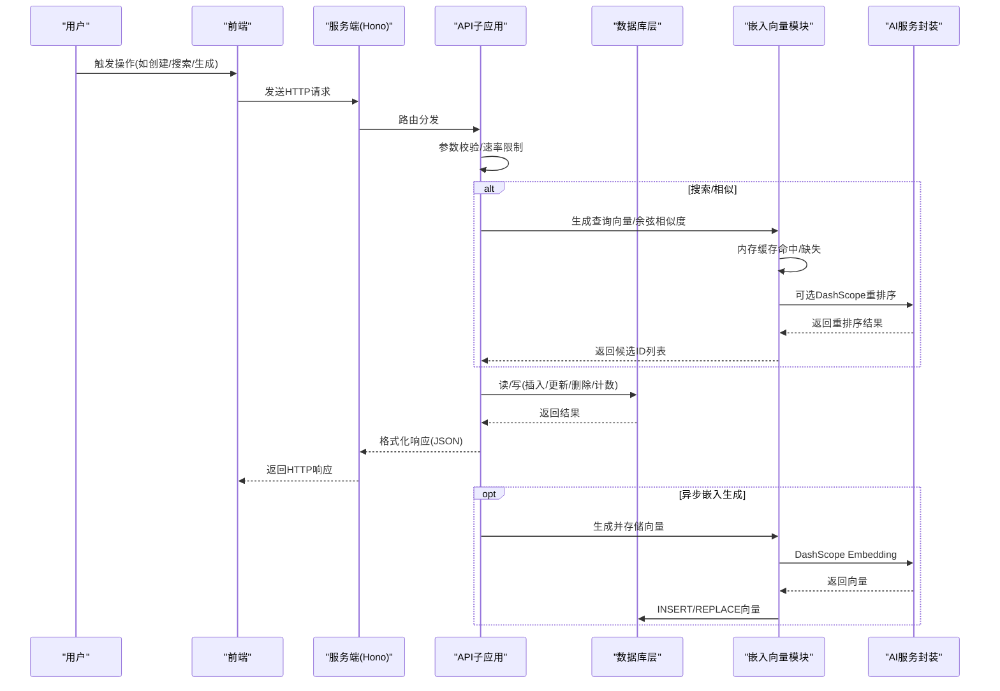
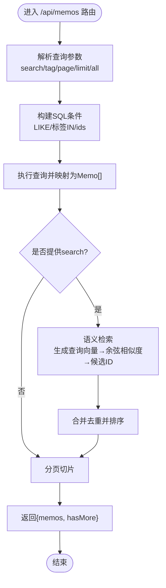
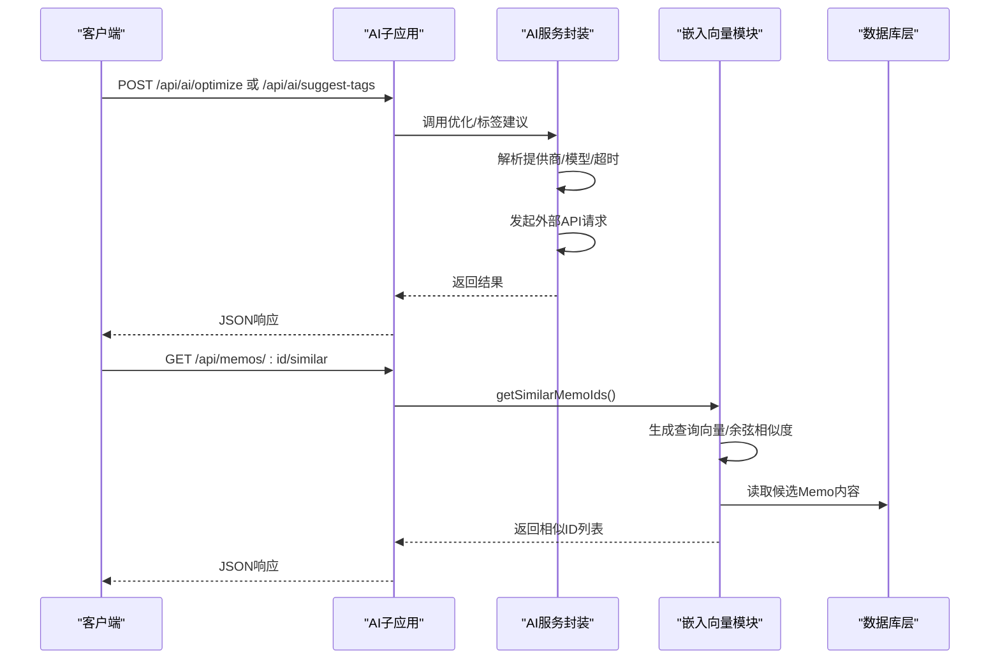
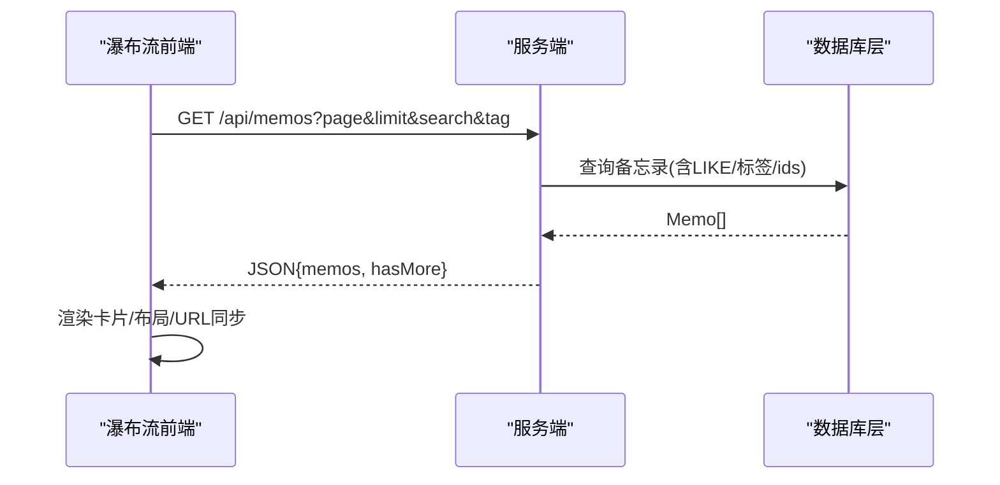
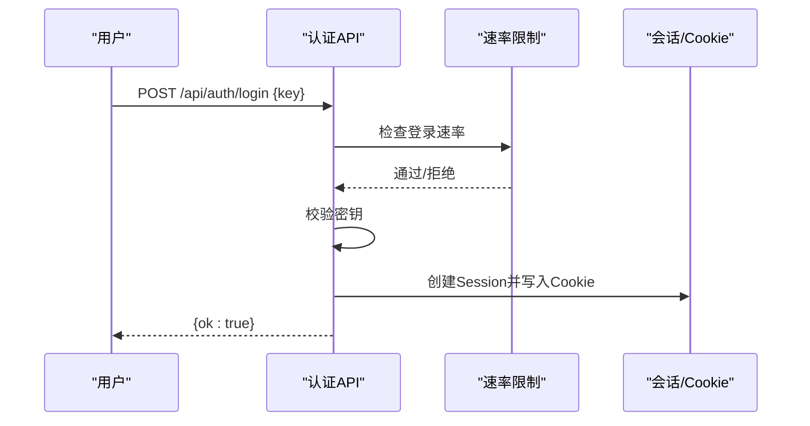
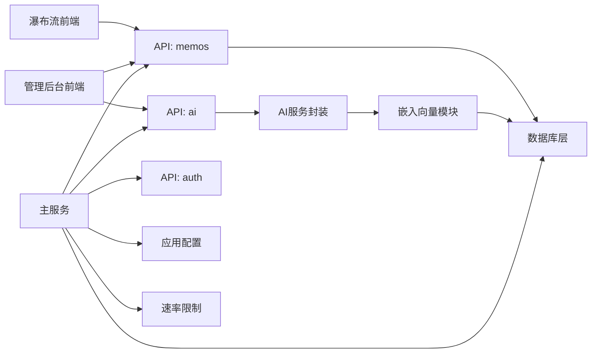
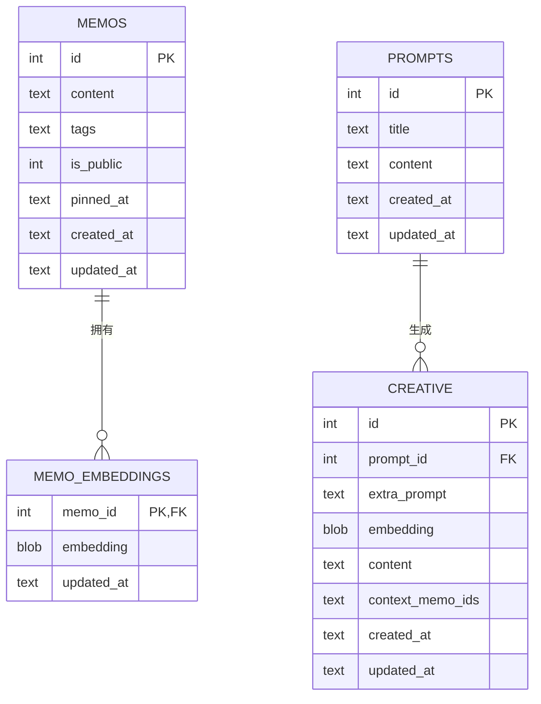

# 数据流设计

<cite>
**本文引用的文件**
- [README.md](file://README.md)
- [package.json](file://package.json)
- [src/server.ts](file://src/server.ts)
- [src/db.ts](file://src/db.ts)
- [src/model.ts](file://src/model.ts)
- [src/api/memos.ts](file://src/api/memos.ts)
- [src/api/ai.ts](file://src/api/ai.ts)
- [src/ai/service.ts](file://src/ai/service.ts)
- [src/ai/embeddings.ts](file://src/ai/embeddings.ts)
- [src/config/app-config.ts](file://src/config/app-config.ts)
- [src/helper/rate-limit.ts](file://src/helper/rate-limit.ts)
- [src/api/auth.ts](file://src/api/auth.ts)
- [src/frontend/masonry/api.ts](file://src/frontend/masonry/api.ts)
- [src/frontend/masonry/state.ts](file://src/frontend/masonry/state.ts)
- [src/frontend/admin/actions/memo.ts](file://src/frontend/admin/actions/memo.ts)
- [src/frontend/admin/actions/ai.ts](file://src/frontend/admin/actions/ai.ts)
- [src/frontend/admin/state.ts](file://src/frontend/admin/state.ts)
</cite>

## 目录
1. [简介](#简介)
2. [项目结构](#项目结构)
3. [核心组件](#核心组件)
4. [架构总览](#架构总览)
5. [详细组件分析](#详细组件分析)
6. [依赖关系分析](#依赖关系分析)
7. [性能考量](#性能考量)
8. [故障排查指南](#故障排查指南)
9. [结论](#结论)
10. [附录](#附录)

## 简介
本文件面向Memmos项目的“数据流设计”，系统性阐述从用户请求到数据持久化的完整流程，覆盖API请求处理、数据库操作、AI服务调用、缓存策略与性能优化、以及数据一致性与事务处理机制。文档同时提供数据流向图与时序图，帮助读者快速把握各组件间的数据传递方式与控制流。

## 项目结构
- 服务端采用Hono框架组织路由，按功能拆分为认证、备忘录、AI、创意内容、导入导出等子应用。
- 数据层基于bun:sqlite，使用WAL模式；提供备忘录、嵌入向量、提示词、创意内容等表。
- 前端采用VanJS（管理后台）与@chenglou/pretext（瀑布流首页）实现响应式UI与文本排版。
- AI能力通过OpenAI兼容接口与DashScope Embedding/Rerank集成，支持内容优化、标签建议、写作工具箱、对话式工作台等。

图表来源
- [src/server.ts:38-125](file://src/server.ts#L38-L125)
- [src/api/memos.ts:26-220](file://src/api/memos.ts#L26-L220)
- [src/api/ai.ts:21-326](file://src/api/ai.ts#L21-L326)
- [src/api/auth.ts:29-77](file://src/api/auth.ts#L29-L77)
- [src/db.ts:15-61](file://src/db.ts#L15-L61)
- [src/ai/embeddings.ts:1-228](file://src/ai/embeddings.ts#L1-L228)
- [src/ai/service.ts:1-507](file://src/ai/service.ts#L1-L507)
- [src/config/app-config.ts:1-108](file://src/config/app-config.ts#L1-L108)
- [src/helper/rate-limit.ts:1-153](file://src/helper/rate-limit.ts#L1-L153)

章节来源
- [README.md:25-45](file://README.md#L25-L45)
- [package.json:1-26](file://package.json#L1-L26)

## 核心组件
- 服务端入口与路由聚合：负责初始化数据库、注入静态页面、挂载子应用路由。
- 数据库层：提供备忘录、嵌入向量、提示词、创意内容等表的CRUD与查询辅助方法。
- API子应用：
  - 备忘录API：支持分页、全文检索、标签筛选、相似度检索、置顶/取消置顶、计数统计。
  - AI API：提供可用性检测、模型列表、内容优化、标签建议、统一写作工具箱、对话式工作台（SSE）。
  - 认证API：密钥登录、登出、状态检查。
- AI模块：
  - 服务封装：统一多提供商聊天、DashScope Embedding与Rerank、创意内容流式生成、对话工作台。
  - 嵌入向量：内存缓存+持久化、余弦相似度、可选重排序（Rerank）。
- 前端：
  - 瀑布流首页：响应式布局、URL同步、分页加载、相似备忘录弹窗。
  - 管理后台：VanJS响应式状态、表单、导入导出、AI工具箱、创意内容管理。

章节来源
- [src/server.ts:11-125](file://src/server.ts#L11-L125)
- [src/db.ts:15-484](file://src/db.ts#L15-L484)
- [src/api/memos.ts:26-220](file://src/api/memos.ts#L26-L220)
- [src/api/ai.ts:21-326](file://src/api/ai.ts#L21-L326)
- [src/api/auth.ts:29-77](file://src/api/auth.ts#L29-L77)
- [src/ai/service.ts:1-507](file://src/ai/service.ts#L1-L507)
- [src/ai/embeddings.ts:1-228](file://src/ai/embeddings.ts#L1-L228)
- [src/frontend/masonry/api.ts:1-162](file://src/frontend/masonry/api.ts#L1-L162)
- [src/frontend/admin/actions/memo.ts:1-231](file://src/frontend/admin/actions/memo.ts#L1-L231)
- [src/frontend/admin/actions/ai.ts:1-237](file://src/frontend/admin/actions/ai.ts#L1-L237)

## 架构总览
下图展示了从用户请求到数据持久化的总体数据流，包括请求参数校验、响应数据格式化、错误处理、AI服务调用、嵌入向量缓存与重排序、以及数据库写入与一致性保障。

图表来源
- [src/api/memos.ts:28-220](file://src/api/memos.ts#L28-L220)
- [src/api/ai.ts:23-326](file://src/api/ai.ts#L23-L326)
- [src/ai/embeddings.ts:95-228](file://src/ai/embeddings.ts#L95-L228)
- [src/ai/service.ts:351-445](file://src/ai/service.ts#L351-L445)
- [src/db.ts:122-275](file://src/db.ts#L122-L275)

## 详细组件分析

### 备忘录API数据流（GET/POST/PUT/DELETE/PIN）
- 请求处理：
  - GET /api/memos：解析查询参数（search/tag/page/limit/all），构造SQL条件，支持全文匹配与标签集合匹配；当all=true且已认证时返回私有备忘录。
  - POST /api/memos：鉴权中间件校验；校验请求体字段；记录速率限制；创建备忘录；异步触发向量生成（fire-and-forget）。
  - PUT /api/memos/:id：鉴权；校验字段；更新备忘录；若内容变更则异步更新向量。
  - DELETE /api/memos/:id：鉴权；删除备忘录；清理向量缓存。
  - PUT /api/memos/:id/pin：鉴权；置顶/取消置顶。
- 响应格式：统一返回JSON对象，GET返回分页数组与hasMore标志；其他操作返回单个实体或ok标记。
- 错误处理：参数非法返回400；未找到返回404；速率限制返回429；内部错误返回5xx。
- 性能优化：分页查询；LIKE全文检索；标签筛选使用json_each；相似度检索与语义检索并行增强（非阻塞）。

图表来源
- [src/api/memos.ts:28-70](file://src/api/memos.ts#L28-L70)
- [src/db.ts:122-169](file://src/db.ts#L122-L169)
- [src/ai/embeddings.ts:95-154](file://src/ai/embeddings.ts#L95-L154)

章节来源
- [src/api/memos.ts:26-220](file://src/api/memos.ts#L26-L220)
- [src/db.ts:122-275](file://src/db.ts#L122-L275)

### AI服务调用与嵌入向量缓存
- AI服务封装：
  - 多提供商聊天完成（OpenAI兼容）：支持超时控制、错误处理、返回内容裁剪。
  - 流式聊天完成（SSE）：支持流式输出，前端以SSE消费。
  - Embedding生成：DashScope Embedding，返回Float32Array。
  - 重排序：DashScope qwen3-rerank，支持候选集重排。
- 嵌入向量缓存：
  - 启动时从DB加载至内存Map；对缺失向量的历史备忘录批量生成并持久化。
  - 余弦相似度计算；阈值过滤；可选重排序提升召回质量。
  - 提供按Memo ID相似检索与查询语义检索两条路径。

图表来源
- [src/api/ai.ts:33-196](file://src/api/ai.ts#L33-L196)
- [src/ai/service.ts:132-385](file://src/ai/service.ts#L132-L385)
- [src/ai/embeddings.ts:156-215](file://src/ai/embeddings.ts#L156-L215)
- [src/db.ts:122-169](file://src/db.ts#L122-L169)

章节来源
- [src/ai/service.ts:1-507](file://src/ai/service.ts#L1-L507)
- [src/ai/embeddings.ts:1-228](file://src/ai/embeddings.ts#L1-L228)

### 前端瀑布流与管理后台数据流
- 瀑布流前端：
  - 通过URL参数同步搜索/标签状态；分页加载；Markdown渲染与HTML剥离；Pretext文本预排版；相似备忘录弹窗。
- 管理后台：
  - VanJS响应式状态驱动；表单提交直达API；导入导出文件上传下载；AI模型选择持久化；对话式工作台SSE消费。

图表来源
- [src/frontend/masonry/api.ts:51-130](file://src/frontend/masonry/api.ts#L51-L130)
- [src/api/memos.ts:28-70](file://src/api/memos.ts#L28-L70)
- [src/db.ts:122-169](file://src/db.ts#L122-L169)

章节来源
- [src/frontend/masonry/api.ts:1-162](file://src/frontend/masonry/api.ts#L1-L162)
- [src/frontend/masonry/state.ts:1-181](file://src/frontend/masonry/state.ts#L1-L181)
- [src/frontend/admin/actions/memo.ts:1-231](file://src/frontend/admin/actions/memo.ts#L1-L231)
- [src/frontend/admin/actions/ai.ts:1-237](file://src/frontend/admin/actions/ai.ts#L1-L237)
- [src/frontend/admin/state.ts:1-178](file://src/frontend/admin/state.ts#L1-L178)

### 认证与会话
- 密钥登录：校验速率限制，成功后设置Cookie并创建Session。
- 登出：销毁Session并清除Cookie。
- 状态检查：返回当前认证状态。

图表来源
- [src/api/auth.ts:36-68](file://src/api/auth.ts#L36-L68)
- [src/helper/rate-limit.ts:77-110](file://src/helper/rate-limit.ts#L77-L110)

章节来源
- [src/api/auth.ts:29-77](file://src/api/auth.ts#L29-L77)
- [src/helper/rate-limit.ts:1-153](file://src/helper/rate-limit.ts#L1-L153)

## 依赖关系分析
- 组件耦合：
  - API子应用依赖数据库层与AI模块；AI模块依赖配置与速率限制；前端通过HTTP与服务端交互。
- 外部依赖：
  - Hono路由框架、bun:sqlite、DashScope Embedding/Rerank、OpenAI兼容聊天接口。
- 循环依赖：
  - 未发现直接循环依赖；模块间通过函数调用解耦。

图表来源
- [src/server.ts:38-125](file://src/server.ts#L38-L125)
- [src/api/memos.ts:26-220](file://src/api/memos.ts#L26-L220)
- [src/api/ai.ts:21-326](file://src/api/ai.ts#L21-L326)
- [src/api/auth.ts:29-77](file://src/api/auth.ts#L29-L77)
- [src/db.ts:15-61](file://src/db.ts#L15-L61)
- [src/ai/embeddings.ts:1-228](file://src/ai/embeddings.ts#L1-L228)
- [src/ai/service.ts:1-507](file://src/ai/service.ts#L1-L507)
- [src/config/app-config.ts:1-108](file://src/config/app-config.ts#L1-L108)
- [src/helper/rate-limit.ts:1-153](file://src/helper/rate-limit.ts#L1-L153)

章节来源
- [src/server.ts:38-125](file://src/server.ts#L38-L125)
- [src/db.ts:15-61](file://src/db.ts#L15-L61)

## 性能考量
- 嵌入向量缓存：
  - 启动时从DB加载至内存Map，避免每次查询都进行向量计算；对缺失向量的历史备忘录批量生成并持久化。
  - 余弦相似度纯内存计算，阈值过滤减少候选集规模；可选重排序进一步提升相关性。
- 分页与查询优化：
  - LIKE全文检索配合标签集合匹配；ids列表查询避免重复扫描；LIMIT与切片返回hasMore。
- 流式与异步：
  - SSE流式输出；创建/更新备忘录后异步生成向量，不阻塞主流程。
- 速率限制：
  - IP级别小时/天双窗口限流，支持环境变量与配置文件覆盖，防止滥用。

章节来源
- [src/ai/embeddings.ts:16-64](file://src/ai/embeddings.ts#L16-L64)
- [src/ai/embeddings.ts:77-93](file://src/ai/embeddings.ts#L77-L93)
- [src/api/memos.ts:61-69](file://src/api/memos.ts#L61-L69)
- [src/api/memos.ts:138-141](file://src/api/memos.ts#L138-L141)
- [src/helper/rate-limit.ts:77-140](file://src/helper/rate-limit.ts#L77-L140)
- [src/config/app-config.ts:9-108](file://src/config/app-config.ts#L9-L108)

## 故障排查指南
- 常见错误与定位：
  - 参数校验失败：检查请求体字段类型与必填项；返回400。
  - 未找到资源：检查ID有效性；返回404。
  - 速率限制：查看限流窗口与剩余重试时间；返回429。
  - AI服务不可用：检查提供商API Key与DashScope Key；返回503。
  - 嵌入向量生成失败：检查网络与DashScope配额；查看控制台错误日志。
- 前端调试：
  - 瀑布流：检查URL参数同步、分页状态、错误提示。
  - 管理后台：关注SSE连接状态、AI模型选择持久化、导入导出进度。

章节来源
- [src/api/memos.ts:104-144](file://src/api/memos.ts#L104-L144)
- [src/api/ai.ts:34-72](file://src/api/ai.ts#L34-L72)
- [src/api/auth.ts:36-68](file://src/api/auth.ts#L36-L68)
- [src/ai/embeddings.ts:217-228](file://src/ai/embeddings.ts#L217-L228)
- [src/frontend/masonry/api.ts:51-130](file://src/frontend/masonry/api.ts#L51-L130)
- [src/frontend/admin/actions/ai.ts:107-137](file://src/frontend/admin/actions/ai.ts#L107-L137)

## 结论
Memmos通过清晰的模块划分与稳健的数据流设计，在保证易用性的同时兼顾了性能与扩展性。前端与服务端分离、AI能力可插拔、嵌入向量缓存与重排序提升了检索质量，速率限制与错误处理增强了系统稳定性。后续可在分布式部署、向量索引与更细粒度的事务控制方面持续演进。

## 附录
- 数据模型概览（简化）

图表来源
- [src/db.ts:18-60](file://src/db.ts#L18-L60)
- [src/model.ts:1-35](file://src/model.ts#L1-L35)