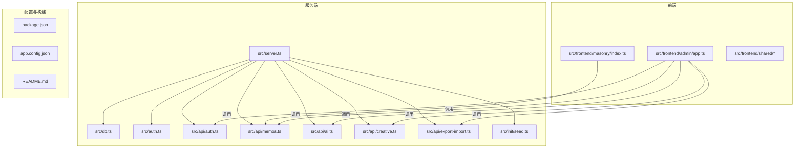
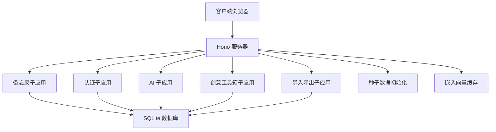
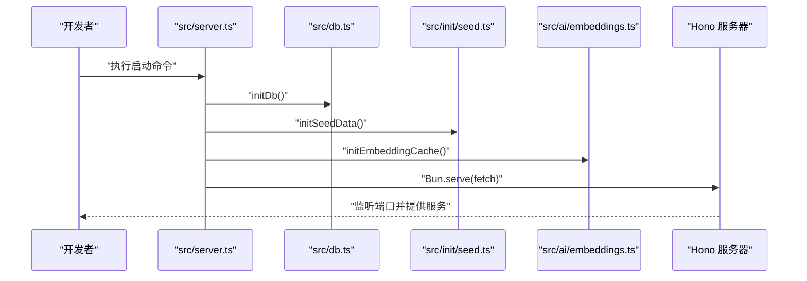
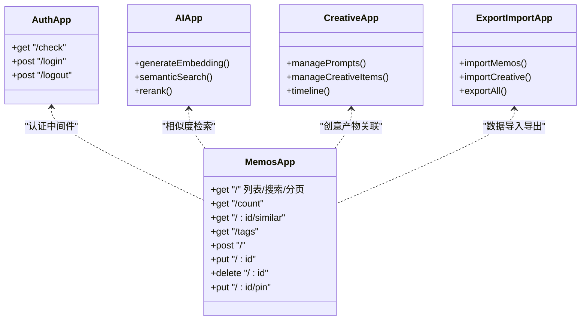
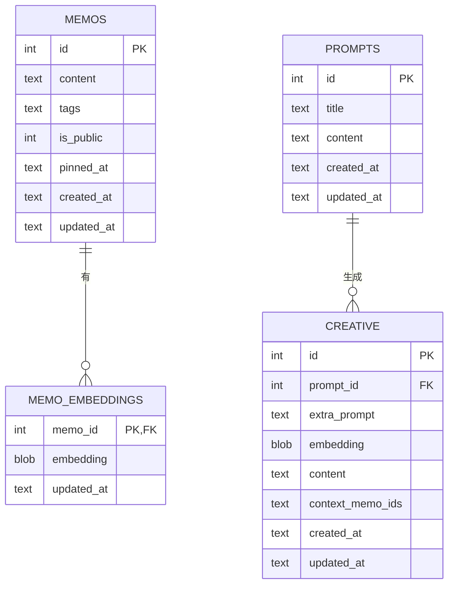
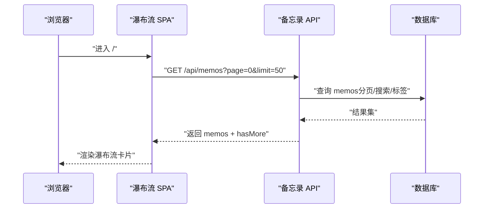
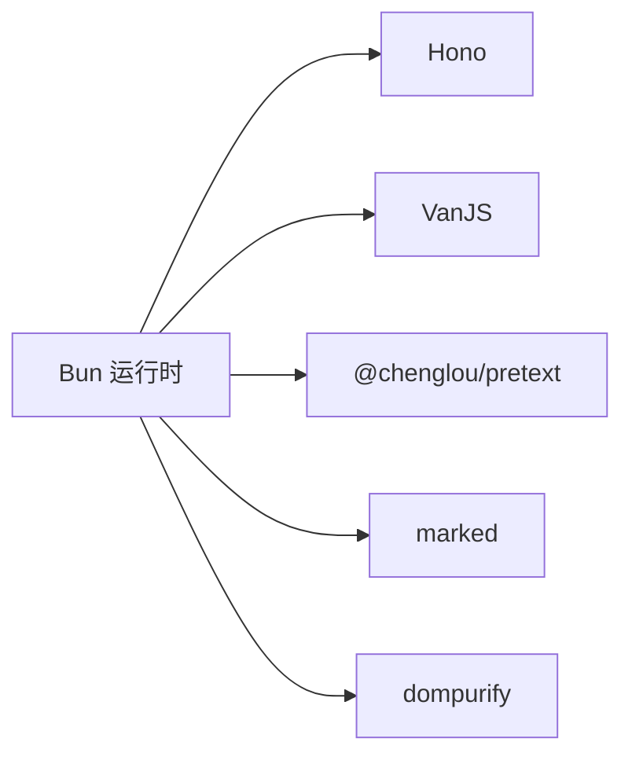

# 整体架构

<cite>
**本文引用的文件**
- [README.md](file://README.md)
- [package.json](file://package.json)
- [app.config.json](file://app.config.json)
- [src/server.ts](file://src/server.ts)
- [src/db.ts](file://src/db.ts)
- [src/auth.ts](file://src/auth.ts)
- [src/api/auth.ts](file://src/api/auth.ts)
- [src/api/memos.ts](file://src/api/memos.ts)
- [src/api/ai.ts](file://src/api/ai.ts)
- [src/api/creative.ts](file://src/api/creative.ts)
- [src/api/export-import.ts](file://src/api/export-import.ts)
- [src/init/seed.ts](file://src/init/seed.ts)
- [src/frontend/admin/app.ts](file://src/frontend/admin/app.ts)
- [src/frontend/admin/state.ts](file://src/frontend/admin/state.ts)
- [src/frontend/masonry/index.ts](file://src/frontend/masonry/index.ts)
- [src/frontend/masonry/components.ts](file://src/frontend/masonry/components.ts)
- [src/frontend/masonry/state.ts](file://src/frontend/masonry/state.ts)
- [src/frontend/masonry/api.ts](file://src/frontend/masonry/api.ts)
- [src/frontend/shared/components/ReadMoreModal.ts](file://src/frontend/shared/components/ReadMoreModal.ts)
- [src/frontend/shared/utils/text.ts](file://src/frontend/shared/utils/text.ts)
- [src/frontend/shared/utils/clipboard.ts](file://src/frontend/shared/utils/clipboard.ts)
- [src/frontend/shared/styles/common.css](file://src/frontend/shared/styles/common.css)
- [src/helper/markdown.ts](file://src/helper/markdown.ts)
- [src/helper/util.ts](file://src/helper/util.ts)
- [src/helper/rate-limit.ts](file://src/helper/rate-limit.ts)
- [src/ai/embeddings.ts](file://src/ai/embeddings.ts)
- [src/ai/service.ts](file://src/ai/service.ts)
- [src/model.ts](file://src/model.ts)
</cite>

## 目录
1. [简介](#简介)
2. [项目结构](#项目结构)
3. [核心组件](#核心组件)
4. [架构总览](#架构总览)
5. [详细组件分析](#详细组件分析)
6. [依赖关系分析](#依赖关系分析)
7. [性能考量](#性能考量)
8. [故障排查指南](#故障排查指南)
9. [结论](#结论)
10. [附录](#附录)

## 简介
本项目是一个基于 Bun 运行时的轻量级备忘录应用系统，采用前后端分离架构：后端使用 Hono 作为 Web 服务器与路由框架，前端包含两个 SPA 应用（瀑布流首页与管理后台），并通过 SQLite（WAL 模式）进行数据持久化。系统支持公开/私密备忘录管理、标签分类、全文搜索、瀑布流展示、AI 嵌入相似度检索与创意工具箱等功能。项目强调模块化设计与子应用挂载，通过中间件实现认证与限流控制，启动流程涵盖数据库初始化、种子数据注入与向量缓存预热。

## 项目结构
项目采用“按层+按功能”的混合组织方式：
- 顶层：运行配置与构建脚本（package.json）、应用配置（app.config.json）、文档（README.md）
- 服务端：src/server.ts（主入口）、src/db.ts（数据库层）、src/auth.ts（认证与会话）、src/api/*（API 子应用）
- 前端：src/frontend/masonry（瀑布流首页 SPA）、src/frontend/admin（管理后台 SPA）、共享组件与工具
- 辅助模块：src/helper/*（通用工具）、src/ai/*（嵌入与 AI 服务）、src/init/*（种子数据）

图表来源
- [src/server.ts:1-125](file://src/server.ts#L1-L125)
- [src/api/auth.ts:1-77](file://src/api/auth.ts#L1-L77)
- [src/api/memos.ts:1-220](file://src/api/memos.ts#L1-L220)
- [src/api/ai.ts](file://src/api/ai.ts)
- [src/api/creative.ts](file://src/api/creative.ts)
- [src/api/export-import.ts](file://src/api/export-import.ts)
- [src/db.ts:1-484](file://src/db.ts#L1-L484)
- [src/auth.ts:1-128](file://src/auth.ts#L1-L128)
- [src/init/seed.ts:1-118](file://src/init/seed.ts#L1-L118)
- [src/frontend/masonry/index.ts:1-23](file://src/frontend/masonry/index.ts#L1-L23)
- [src/frontend/admin/app.ts:1-251](file://src/frontend/admin/app.ts#L1-L251)

章节来源
- [README.md:25-45](file://README.md#L25-L45)
- [package.json:1-26](file://package.json#L1-L26)

## 核心组件
- 服务器层（Hono）：统一路由与中间件，负责静态资源服务、SPA 路由回退、子应用挂载与服务器启动。
- API 层：按功能拆分为认证、备忘录、AI、创意工具箱、导入导出等子应用，每个子应用封装独立的路由与业务逻辑。
- 数据层：SQLite（bun:sqlite）封装 CRUD 与查询，支持 JSON 列与索引；提供嵌入向量表与提示词表。
- 前端层：瀑布流首页 SPA（VanJS）与管理后台 SPA（VanJS），共享组件与样式，通过 API 层进行数据交互。

章节来源
- [src/server.ts:38-125](file://src/server.ts#L38-L125)
- [src/db.ts:15-61](file://src/db.ts#L15-L61)
- [src/api/auth.ts:29-77](file://src/api/auth.ts#L29-L77)
- [src/api/memos.ts:26-220](file://src/api/memos.ts#L26-L220)
- [src/frontend/masonry/index.ts:1-23](file://src/frontend/masonry/index.ts#L1-L23)
- [src/frontend/admin/app.ts:1-251](file://src/frontend/admin/app.ts#L1-L251)

## 架构总览
系统采用“单服务器 + 多子应用”的分层架构：
- 服务器层（Hono）：集中注册 API 子应用与静态资源路由，处理 SPA 深层链接回退。
- API 层（Hono 子应用）：认证、备忘录、AI、创意工具箱、导入导出，均通过中间件实现认证与限流。
- 数据层（SQLite）：提供基础 CRUD、全文检索、JSON 列查询、嵌入向量存储与提示词管理。
- 前端层（SPA）：瀑布流首页与管理后台，分别通过 VanJS 组件化开发，共享工具与样式。

图表来源
- [src/server.ts:38-125](file://src/server.ts#L38-L125)
- [src/api/auth.ts:29-77](file://src/api/auth.ts#L29-L77)
- [src/api/memos.ts:26-220](file://src/api/memos.ts#L26-L220)
- [src/init/seed.ts:112-118](file://src/init/seed.ts#L112-L118)
- [src/ai/embeddings.ts](file://src/ai/embeddings.ts)

## 详细组件分析

### 服务器层（Hono）与启动流程
- 路由与中间件
  - 子应用挂载：通过 app.route 将认证、备忘录、AI、创意工具箱、导入导出子应用注册到 /api 前缀下。
  - 静态资源与页面路由：提供 favicon、CSS、JS bundle 的静态服务；首页与管理后台 SPA 的 HTML 注入 base 标签以支持深层路径。
  - SPA 深层链接回退：当路径以 /admin/ 开头且未命中具体路由时，回退到管理后台 SPA。
- 启动流程
  - 初始化数据库与索引。
  - 注入种子数据（内置提示词与示例备忘录）。
  - 初始化嵌入向量缓存（批量生成历史备忘录嵌入）。
  - 启动 HTTP 服务器（Bun.serve）。

图表来源
- [src/server.ts:109-125](file://src/server.ts#L109-L125)
- [src/db.ts:15-61](file://src/db.ts#L15-L61)
- [src/init/seed.ts:112-118](file://src/init/seed.ts#L112-L118)
- [src/ai/embeddings.ts](file://src/ai/embeddings.ts)

章节来源
- [src/server.ts:38-125](file://src/server.ts#L38-L125)

### API 层（认证、备忘录、AI、创意工具箱、导入导出）
- 认证子应用
  - 支持 Cookie + 内存会话认证，同时兼容 Bearer Token（用于 CLI 或外部调用）。
  - 登录接口带登录频率限制，防止暴力破解。
- 备忘录子应用
  - 提供分页列表、全文检索、标签筛选、计数统计、置顶/取消置顶、相似度检索等。
  - 新增/更新备忘录时异步生成嵌入向量，删除时清理缓存。
  - 使用速率限制中间件保护高频操作。
- AI 子应用
  - 提供嵌入生成、相似度检索、重排等能力，结合 app.config.json 中的参数控制超时、温度、阈值等。
- 创意工具箱子应用
  - 管理提示词与创意产物，支持时间线展示与聊天模式。
- 导入导出子应用
  - 支持按时间戳导入备忘录与创意产物，避免重复并保证一致性。

图表来源
- [src/api/auth.ts:29-77](file://src/api/auth.ts#L29-L77)
- [src/api/memos.ts:26-220](file://src/api/memos.ts#L26-L220)
- [src/api/ai.ts](file://src/api/ai.ts)
- [src/api/creative.ts](file://src/api/creative.ts)
- [src/api/export-import.ts](file://src/api/export-import.ts)

章节来源
- [src/api/auth.ts:14-77](file://src/api/auth.ts#L14-L77)
- [src/api/memos.ts:28-220](file://src/api/memos.ts#L28-L220)
- [app.config.json:1-22](file://app.config.json#L1-L22)

### 数据层（SQLite）
- 表结构
  - memos：主表，包含内容、标签（JSON 数组）、公开/私密、置顶时间、创建/更新时间。
  - memo_embeddings：嵌入向量表，与 memos 关联。
  - prompts：提示词表。
  - creative：创意产物表，关联提示词。
- 查询与聚合
  - 支持全文 LIKE 搜索、标签精确匹配（逗号分隔多标签）、JSON 列查询、计数与分页。
  - 提供导入/导出辅助函数，支持自定义时间戳与去重判断。
- 嵌入与相似度
  - 提供嵌入向量的保存、删除与批量获取；在新增/更新备忘录时触发异步生成。

图表来源
- [src/db.ts:18-61](file://src/db.ts#L18-L61)
- [src/db.ts:253-276](file://src/db.ts#L253-L276)
- [src/db.ts:279-337](file://src/db.ts#L279-L337)
- [src/db.ts:339-403](file://src/db.ts#L339-L403)
- [src/model.ts:1-35](file://src/model.ts#L1-L35)

章节来源
- [src/db.ts:15-484](file://src/db.ts#L15-L484)
- [src/model.ts:1-35](file://src/model.ts#L1-L35)

### 前端层（瀑布流首页与管理后台）
- 瀑布流首页（VanJS）
  - 初始化时从 URL 参数读取搜索与标签，加载标签与总数，按窗口宽度自适应列数，滚动触底分页加载。
  - 提供相似备忘录弹窗、复制文本、展开阅读等交互。
- 管理后台（VanJS）
  - 登录页与主页面，支持切换标签页（Memo/创意）、创建/编辑/删除备忘录、导入导出、AI 工具箱、提示词管理等。
  - 全局状态通过 van.state 管理，组件化复用（如模态框、侧边时间线）。

图表来源
- [src/frontend/masonry/index.ts:1-23](file://src/frontend/masonry/index.ts#L1-L23)
- [src/frontend/masonry/components.ts:1-337](file://src/frontend/masonry/components.ts#L1-L337)
- [src/api/memos.ts:28-70](file://src/api/memos.ts#L28-L70)
- [src/db.ts:122-169](file://src/db.ts#L122-L169)

章节来源
- [src/frontend/masonry/index.ts:1-23](file://src/frontend/masonry/index.ts#L1-L23)
- [src/frontend/masonry/components.ts:44-337](file://src/frontend/masonry/components.ts#L44-L337)
- [src/frontend/admin/app.ts:48-251](file://src/frontend/admin/app.ts#L48-L251)
- [src/frontend/admin/state.ts:1-178](file://src/frontend/admin/state.ts#L1-L178)

### 模块化设计与中间件
- 子应用挂载：通过 app.route 将各子应用注册到不同前缀，便于维护与扩展。
- 中间件：
  - 认证中间件：requireAuth 与 authMiddleware，支持 Cookie 会话与 Bearer Token。
  - 速率限制中间件：对登录与备忘录操作进行限流，防止滥用。
- 前端模块化：VanJS 组件化开发，共享工具与样式，减少重复代码。

章节来源
- [src/server.ts:40-46](file://src/server.ts#L40-L46)
- [src/auth.ts:109-128](file://src/auth.ts#L109-L128)
- [src/helper/rate-limit.ts](file://src/helper/rate-limit.ts)
- [src/frontend/shared/styles/common.css](file://src/frontend/shared/styles/common.css)

## 依赖关系分析
- 运行时与依赖
  - Bun：运行时与 SQLite、HTTP 服务器。
  - Hono：Web 框架与路由。
  - VanJS：前端响应式 UI 框架。
  - @chenglou/pretext：瀑布流首页的文字排版与布局。
- 构建与脚本
  - package.json 定义了开发与生产构建脚本，分别编译瀑布流与管理后台的 ESM bundle 并启动服务器。

图表来源
- [package.json:19-25](file://package.json#L19-L25)

章节来源
- [package.json:1-26](file://package.json#L1-L26)
- [README.md:14-24](file://README.md#L14-L24)

## 性能考量
- 数据库性能
  - 使用 WAL 模式提升并发读写性能。
  - 对 memos 表建立索引（如 pinned_at），优化排序与查询。
  - JSON 列查询与逗号分隔标签的处理，注意在高基数场景下的性能影响。
- 前端性能
  - 瀑布流采用虚拟滚动与自适应列数，减少 DOM 节点数量。
  - 滚动触底分页加载，降低初始渲染压力。
- AI 与嵌入
  - 嵌入向量生成采用异步 fire-and-forget，避免阻塞主流程。
  - app.config.json 控制请求超时与重排策略，平衡准确性与延迟。
- 限流与安全
  - 登录与备忘录操作的速率限制，防止滥用与 DDoS。
  - Cookie 会话与 Bearer Token 双重认证，生产环境必须设置密钥。

章节来源
- [src/db.ts:9-13](file://src/db.ts#L9-L13)
- [src/db.ts:30-38](file://src/db.ts#L30-L38)
- [src/frontend/masonry/components.ts:283-337](file://src/frontend/masonry/components.ts#L283-L337)
- [src/api/memos.ts:138-144](file://src/api/memos.ts#L138-L144)
- [app.config.json:1-22](file://app.config.json#L1-L22)
- [src/helper/rate-limit.ts](file://src/helper/rate-limit.ts)
- [src/auth.ts:14-27](file://src/auth.ts#L14-L27)

## 故障排查指南
- 启动失败或端口占用
  - 检查端口配置与进程占用情况，确保端口可用。
- 数据库初始化问题
  - 确认 memos.db 文件权限与磁盘空间；若损坏可删除后重启自动重建。
- 种子数据未生效
  - 确认 data/prompts 与示例数据文件存在且格式正确；查看日志输出。
- 管理后台登录失败
  - 检查 MEMOS_SECRET_KEY 环境变量是否设置；生产环境必须设置。
  - 查看登录频率限制是否触发冷却。
- 备忘录搜索/相似度异常
  - 确认嵌入向量缓存已初始化；检查 app.config.json 中相关参数。
- 前端 SPA 深层链接 404
  - 确认服务器 notFound 回退逻辑已启用；检查静态资源路径与 base 标签。

章节来源
- [src/server.ts:109-125](file://src/server.ts#L109-L125)
- [src/init/seed.ts:16-61](file://src/init/seed.ts#L16-L61)
- [src/api/auth.ts:14-27](file://src/api/auth.ts#L14-L27)
- [src/auth.ts:81-107](file://src/auth.ts#L81-L107)
- [app.config.json:1-22](file://app.config.json#L1-L22)

## 结论
Memmos 项目通过清晰的分层架构与模块化设计，实现了从前端 SPA 到后端 API、再到数据层的高效协作。服务器层以 Hono 为核心，配合子应用挂载与中间件机制，提供了灵活的路由与安全控制；数据层基于 SQLite 的简洁与高性能满足日常需求；前端采用 VanJS 实现响应式与组件化开发。整体架构易于扩展与维护，适合在个人或小团队场景中快速迭代与部署。

## 附录
- 环境变量与默认值
  - PORT：服务器监听端口，默认 3020。
  - MEMOS_SECRET_KEY：管理员登录密钥，生产环境必须设置。
- API 接口概览
  - 认证：检查登录状态、登录、登出。
  - 备忘录：列表/搜索/分页、计数、标签、创建/更新/删除、置顶、相似度检索。
  - AI：嵌入生成、相似度检索、重排。
  - 创意工具箱：提示词与创意产物管理。
  - 导入导出：按时间戳导入与全量导出。

章节来源
- [README.md:59-129](file://README.md#L59-L129)
- [src/api/auth.ts:31-77](file://src/api/auth.ts#L31-L77)
- [src/api/memos.ts:28-220](file://src/api/memos.ts#L28-L220)