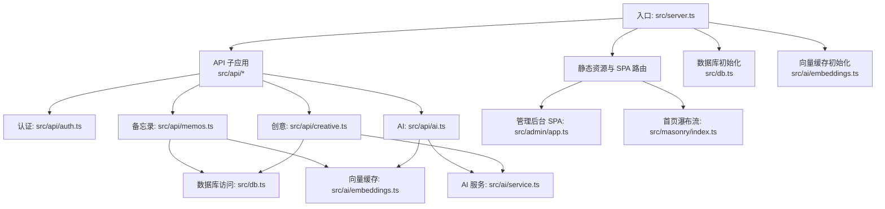
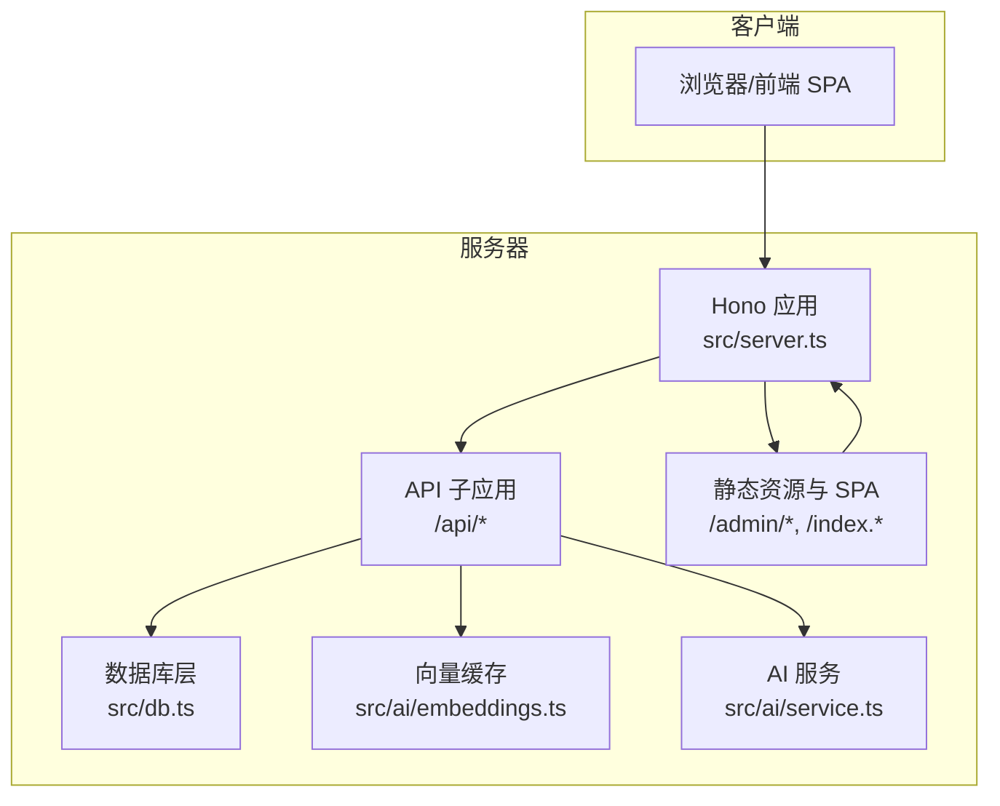
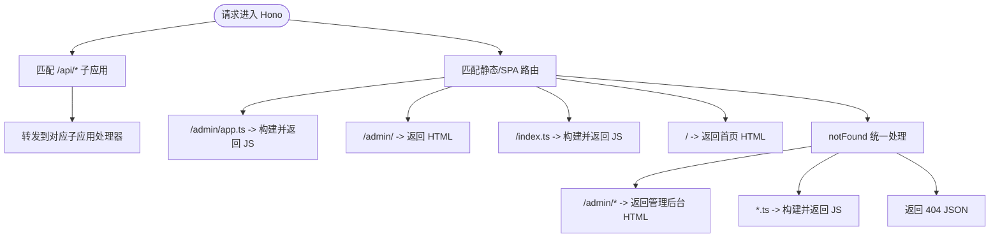
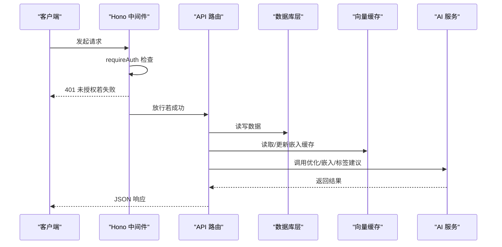
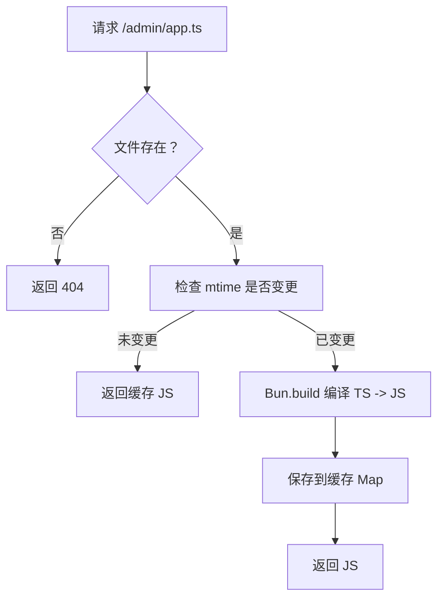
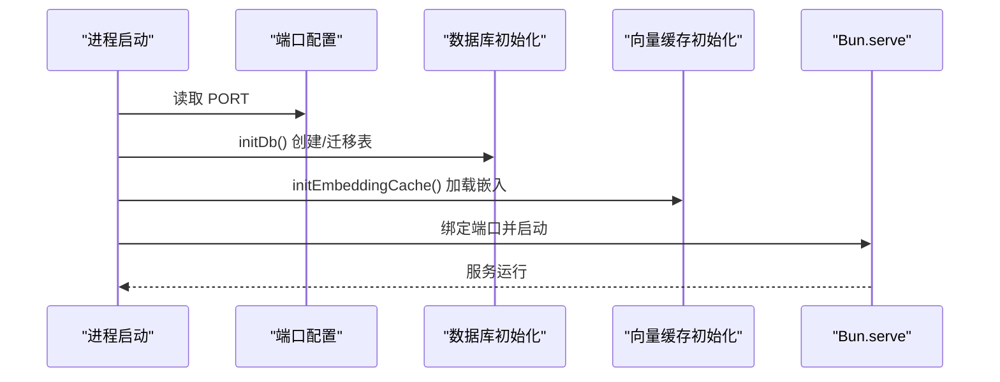
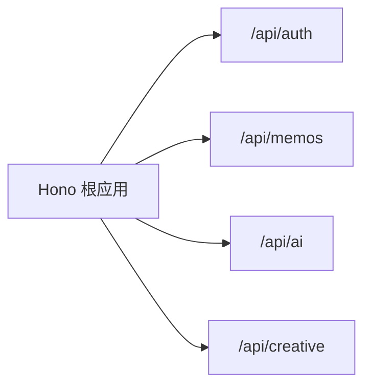
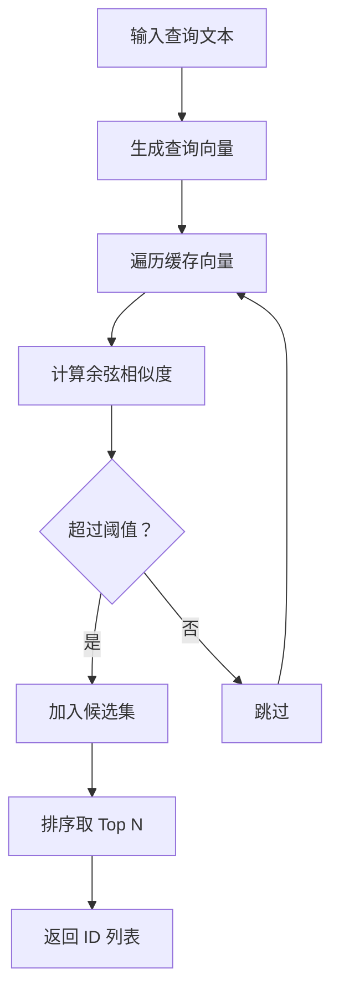
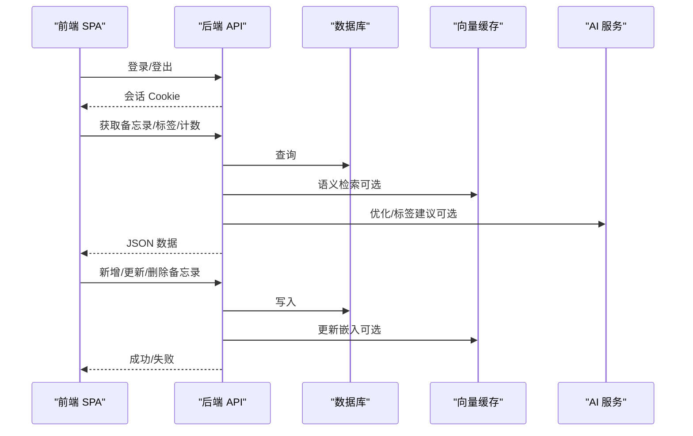
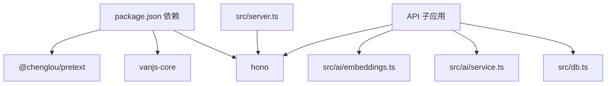

# 服务器架构

<cite>
**本文引用的文件**
- [src/server.ts](file://src/server.ts)
- [src/db.ts](file://src/db.ts)
- [src/model.ts](file://src/model.ts)
- [src/auth.ts](file://src/auth.ts)
- [src/util.ts](file://src/util.ts)
- [src/api/auth.ts](file://src/api/auth.ts)
- [src/api/memos.ts](file://src/api/memos.ts)
- [src/api/ai.ts](file://src/api/ai.ts)
- [src/api/creative.ts](file://src/api/creative.ts)
- [src/ai/embeddings.ts](file://src/ai/embeddings.ts)
- [src/ai/service.ts](file://src/ai/service.ts)
- [src/admin/app.ts](file://src/admin/app.ts)
- [src/masonry/index.ts](file://src/masonry/index.ts)
- [package.json](file://package.json)
- [README.md](file://README.md)
</cite>

## 目录
1. [简介](#简介)
2. [项目结构](#项目结构)
3. [核心组件](#核心组件)
4. [架构总览](#架构总览)
5. [详细组件分析](#详细组件分析)
6. [依赖关系分析](#依赖关系分析)
7. [性能考量](#性能考量)
8. [故障排查指南](#故障排查指南)
9. [结论](#结论)
10. [附录](#附录)

## 简介
本文件面向 memos 项目的服务器架构，围绕 Hono 框架的集成与使用、路由系统、中间件机制、请求处理流程进行深入解析；同时覆盖静态文件服务（含客户端 TS 构建缓存）、HTML 页面服务与 SPA 路由处理；阐述服务器启动流程（端口配置、数据库初始化、向量缓存初始化）；说明 API 路由组织方式（子应用挂载与命名空间管理）；最后给出性能优化策略与错误处理机制建议。

## 项目结构
项目采用“入口文件 + 子模块 + API 子应用”的分层组织方式：
- 入口与路由：在主入口集中注册 API 子应用与静态页面路由，并在启动阶段完成数据库与向量缓存初始化。
- 数据层：统一的 SQLite 访问封装，提供 CRUD 与查询聚合能力。
- 认证与中间件：基于 Cookie 的内存会话与登录频率限制，配合 Hono 中间件实现鉴权。
- AI 能力：内容优化、标签建议、嵌入生成与语义检索，以及创意内容生成（流式）。
- 前端 SPA：管理后台与首页瀑布流，分别通过服务端按需编译 TS 并缓存结果。



图表来源
- [src/server.ts:74-127](file://src/server.ts#L74-L127)
- [src/api/auth.ts:29](file://src/api/auth.ts#L29)
- [src/api/memos.ts:18](file://src/api/memos.ts#L18)
- [src/api/ai.ts:6](file://src/api/ai.ts#L6)
- [src/api/creative.ts:22](file://src/api/creative.ts#L22)
- [src/db.ts:15-57](file://src/db.ts#L15-L57)
- [src/ai/embeddings.ts:12-35](file://src/ai/embeddings.ts#L12-L35)

章节来源
- [src/server.ts:74-127](file://src/server.ts#L74-L127)
- [README.md:25-45](file://README.md#L25-L45)

## 核心组件
- Hono 应用与路由
  - 在入口中创建 Hono 实例，挂载多个 API 子应用，并定义静态资源与 SPA 路由。
  - 使用 notFound 统一处理未匹配路径，实现管理后台 SPA 与 TS 编译回退。
- 静态文件与按需构建
  - 提供 /admin/app.ts → /admin/app.js 的 TS 到 JS 的服务端构建映射。
  - 提供 /index.ts → /index.js 的首页瀑布流构建映射。
  - 对构建产物进行 mtime 缓存，避免重复编译。
- 数据库层
  - 单例数据库连接，WAL 模式与外键约束开启。
  - 提供备忘录、提示词、创意内容等表的初始化与 CRUD。
- 认证与中间件
  - 基于内存 Set 的会话存储，Cookie 名称与过期时间配置。
  - 登录频率限制（每 IP 1 分钟最多 5 次），超过则 429。
  - Hono 中间件 requireAuth 用于保护受保护接口。
- AI 与向量缓存
  - 向量缓存：内存 Map 缓存 Float32Array，启动时从数据库加载。
  - 语义检索：余弦相似度阈值过滤，返回 ID 列表。
  - 内容优化与标签建议：通过 DeepSeek API。
  - 嵌入生成：通过 DashScope API。
- 前端 SPA
  - 管理后台：VanJS 响应式 UI，支持登录、增删改查、AI 工具。
  - 首页瀑布流：@chenglou/pretext 文本预排版，Masonry 布局与虚拟滚动。

章节来源
- [src/server.ts:12-127](file://src/server.ts#L12-L127)
- [src/db.ts:15-349](file://src/db.ts#L15-L349)
- [src/auth.ts:1-111](file://src/auth.ts#L1-L111)
- [src/ai/embeddings.ts:12-99](file://src/ai/embeddings.ts#L12-L99)
- [src/ai/service.ts:12-289](file://src/ai/service.ts#L12-L289)
- [src/admin/app.ts:1-677](file://src/admin/app.ts#L1-L677)
- [src/masonry/index.ts:1-391](file://src/masonry/index.ts#L1-L391)

## 架构总览
下图展示了从客户端请求到数据层与 AI 服务的整体交互路径，以及静态资源与 SPA 的服务方式。



图表来源
- [src/server.ts:74-127](file://src/server.ts#L74-L127)
- [src/api/memos.ts:18](file://src/api/memos.ts#L18)
- [src/api/ai.ts:6](file://src/api/ai.ts#L6)
- [src/api/creative.ts:22](file://src/api/creative.ts#L22)
- [src/db.ts:15-57](file://src/db.ts#L15-L57)
- [src/ai/embeddings.ts:12-35](file://src/ai/embeddings.ts#L12-L35)
- [src/ai/service.ts:12-289](file://src/ai/service.ts#L12-L289)

## 详细组件分析

### Hono 集成与路由系统
- 应用创建与挂载
  - 在入口创建 Hono 实例，随后通过 route 将各 API 子应用挂载至 /api/{name} 命名空间。
- 路由组织
  - 认证：/api/auth
  - 备忘录：/api/memos
  - AI：/api/ai
  - 创意：/api/creative
- 静态与 SPA
  - /admin/app.ts → /admin/app.js：TS → JS 构建与缓存。
  - /admin/ → 返回管理后台 HTML。
  - /index.ts → /index.js：首页瀑布流 TS → JS 构建。
  - / → 首页瀑布流 HTML。
  - notFound：对 /admin/* 与 .ts 结尾路径进行 SPA 回退或构建回退。



图表来源
- [src/server.ts:74-127](file://src/server.ts#L74-L127)

章节来源
- [src/server.ts:74-127](file://src/server.ts#L74-L127)

### 中间件机制与请求处理流程
- 认证中间件
  - 通过 requireAuth 检查 Cookie 会话有效性，无效则返回 401。
  - 中间件形式在受保护的 API 路由上统一拦截。
- 登录频率限制
  - 每个 IP 在 1 分钟内最多 5 次尝试，超过则返回 429。
- 请求体校验
  - API 子应用在解析 JSON 与参数时进行严格校验，返回 4xx 错误。



图表来源
- [src/auth.ts:95-111](file://src/auth.ts#L95-L111)
- [src/api/memos.ts:63-138](file://src/api/memos.ts#L63-L138)
- [src/api/ai.ts:14-66](file://src/api/ai.ts#L14-L66)
- [src/db.ts:15-349](file://src/db.ts#L15-L349)
- [src/ai/embeddings.ts:12-99](file://src/ai/embeddings.ts#L12-L99)
- [src/ai/service.ts:12-289](file://src/ai/service.ts#L12-L289)

章节来源
- [src/auth.ts:1-111](file://src/auth.ts#L1-L111)
- [src/api/memos.ts:18-139](file://src/api/memos.ts#L18-L139)
- [src/api/ai.ts:6-67](file://src/api/ai.ts#L6-L67)

### 静态文件服务与 SPA 路由
- 客户端 TS 构建缓存
  - 以 Map 存储源文件路径到 {js, mtime} 的映射，基于文件最后修改时间判断是否重建。
  - 使用 Bun.build 进行 ES Module 输出，关闭拆分与压缩，便于开发调试。
- HTML 页面服务
  - 通过 Bun.file 读取本地 HTML 文件并返回，未找到返回 404。
- SPA 路由处理
  - /admin/ 返回管理后台入口。
  - notFound 对 /admin/* 与 .ts 结尾路径进行回退：前者返回管理后台 HTML，后者按需构建 TS 并返回 JS。



图表来源
- [src/server.ts:15-51](file://src/server.ts#L15-L51)

章节来源
- [src/server.ts:12-127](file://src/server.ts#L12-L127)

### 服务器启动流程
- 端口配置
  - 从环境变量读取 PORT，默认 3020。
- 数据库初始化
  - 首次启动自动创建 memos.db，启用 WAL 模式与外键约束。
  - 初始化 memos、memo_embeddings、prompts、creative 表。
- 向量缓存初始化
  - 若 AI 嵌入可用，则从数据库加载已有嵌入到内存 Map。
- 启动 HTTP 服务
  - 使用 Bun.serve，绑定端口并交由 Hono 的 fetch 处理。



图表来源
- [src/server.ts:9-127](file://src/server.ts#L9-L127)
- [src/db.ts:15-57](file://src/db.ts#L15-L57)
- [src/ai/embeddings.ts:12-35](file://src/ai/embeddings.ts#L12-L35)

章节来源
- [src/server.ts:9-127](file://src/server.ts#L9-L127)
- [src/db.ts:15-57](file://src/db.ts#L15-L57)

### API 路由组织与命名空间管理
- 子应用挂载
  - 通过 app.route("/api/name", appName) 将各业务域路由集中管理。
- 命名空间
  - /api/auth：认证相关接口（检查、登录、登出）。
  - /api/memos：备忘录 CRUD、计数、标签、语义检索融合。
  - /api/ai：AI 能力（状态检测、内容优化、标签建议）。
  - /api/creative：提示词与创意内容（生成、删除、列表）。
- 中间件与鉴权
  - 受保护路由统一使用 authMiddleware，确保 Cookie 有效。



图表来源
- [src/server.ts:76-80](file://src/server.ts#L76-L80)
- [src/api/auth.ts:29](file://src/api/auth.ts#L29)
- [src/api/memos.ts:18](file://src/api/memos.ts#L18)
- [src/api/ai.ts:6](file://src/api/ai.ts#L6)
- [src/api/creative.ts:22](file://src/api/creative.ts#L22)

章节来源
- [src/server.ts:74-81](file://src/server.ts#L74-L81)
- [src/api/auth.ts:29-77](file://src/api/auth.ts#L29-L77)
- [src/api/memos.ts:18-139](file://src/api/memos.ts#L18-L139)
- [src/api/ai.ts:6-67](file://src/api/ai.ts#L6-L67)
- [src/api/creative.ts:22-238](file://src/api/creative.ts#L22-L238)

### 数据模型与数据库层
- 数据模型
  - Memo、Prompt、CreativeItem 三类实体，字段覆盖业务所需。
- 数据库初始化
  - 创建表并设置主键、外键、默认值与时间戳。
- 查询与聚合
  - 提供按条件筛选、分页、计数、标签去重等常用操作。
- 嵌入与创意
  - 提供嵌入的保存、删除与批量读取，支持创意内容的持久化。

```mermaid
erDiagram
MEMOS {
int id PK
text content
text tag
int is_public
text created_at
text updated_at
}
PROMPTS {
int id PK
text title
text content
text created_at
text updated_at
}
CREATIVE {
int id PK
int prompt_id FK
text extra_prompt
blob embedding
text content
text context_memo_ids
text created_at
text updated_at
}
MEMO_EMBEDDINGS {
int memo_id PK FK
blob embedding
text updated_at
}
MEMOS ||--o{ MEMO_EMBEDDINGS : "拥有"
PROMPTS ||--o{ CREATIVE : "拥有"
```

图表来源
- [src/db.ts:17-56](file://src/db.ts#L17-L56)
- [src/model.ts:1-28](file://src/model.ts#L1-L28)

章节来源
- [src/db.ts:15-349](file://src/db.ts#L15-L349)
- [src/model.ts:1-28](file://src/model.ts#L1-L28)

### AI 与向量缓存
- 能力检测
  - 依据环境变量判断 DeepSeek 与 DashScope 的可用性。
- 嵌入缓存
  - 启动时从数据库加载，内存 Map 存储 Float32Array。
  - 提供 upsert 与删除，保证缓存与数据库一致。
- 语义检索
  - 生成查询向量，计算与缓存向量的余弦相似度，按阈值与数量返回 ID。
- 内容优化与标签建议
  - 通过 DeepSeek API 提供优化文本与标签建议。
- 创意内容生成
  - 支持手动选择上下文或基于语义检索自动选择，返回 SSE 流并在完成后入库。



图表来源
- [src/ai/embeddings.ts:66-86](file://src/ai/embeddings.ts#L66-L86)
- [src/ai/service.ts:147-181](file://src/ai/service.ts#L147-L181)

章节来源
- [src/ai/embeddings.ts:12-99](file://src/ai/embeddings.ts#L12-L99)
- [src/ai/service.ts:12-289](file://src/ai/service.ts#L12-L289)

### 前端 SPA 与交互
- 管理后台（Admin SPA）
  - VanJS 响应式 UI，支持登录、创建/编辑/删除备忘录、切换可见性、AI 工具（优化、标签建议）。
  - 时间线侧边栏按年月分组，支持展开/折叠与滚动定位。
- 首页瀑布流（Masonry）
  - @chenglou/pretext 文本预排版，Masonry 布局与虚拟滚动，支持搜索与标签筛选，URL 同步。



图表来源
- [src/admin/app.ts:40-140](file://src/admin/app.ts#L40-L140)
- [src/masonry/index.ts:308-351](file://src/masonry/index.ts#L308-L351)
- [src/api/memos.ts:20-139](file://src/api/memos.ts#L20-L139)
- [src/api/ai.ts:14-66](file://src/api/ai.ts#L14-L66)
- [src/db.ts:15-349](file://src/db.ts#L15-L349)
- [src/ai/embeddings.ts:12-99](file://src/ai/embeddings.ts#L12-L99)
- [src/ai/service.ts:12-289](file://src/ai/service.ts#L12-L289)

章节来源
- [src/admin/app.ts:1-677](file://src/admin/app.ts#L1-L677)
- [src/masonry/index.ts:1-391](file://src/masonry/index.ts#L1-L391)

## 依赖关系分析
- 运行时与框架
  - Bun 运行时、Hono Web 框架、bun:sqlite。
- 前端生态
  - @chenglou/pretext（文本排版）、VanJS（响应式 UI）。
- 依赖声明
  - package.json 中声明了 Hono、VanJS、Pretext 等依赖。



图表来源
- [package.json:16-21](file://package.json#L16-L21)
- [src/server.ts:1-7](file://src/server.ts#L1-L7)

章节来源
- [package.json:1-22](file://package.json#L1-L22)
- [src/server.ts:1-7](file://src/server.ts#L1-L7)

## 性能考量
- 构建缓存
  - 使用 Map 缓存 TS → JS 构建结果，基于 mtime 判断是否重建，减少重复编译开销。
- 数据库优化
  - WAL 模式提升并发写入性能；外键约束保障一致性。
- 嵌入缓存
  - 内存缓存 Float32Array，避免每次查询都读取磁盘；启动时批量加载。
- 语义检索
  - 余弦相似度计算为 O(n*d)，其中 n 为缓存条目数，d 为向量维度；可考虑降维或索引优化（如局部敏感哈希）。
- 前端渲染
  - 首页瀑布流采用虚拟滚动与预排版，减少 DOM 数量与重绘。
- 网络与超时
  - AI 请求设置超时，避免阻塞；SSE 流式输出降低首字延迟。

[本节为通用性能建议，不直接分析具体文件，故无章节来源]

## 故障排查指南
- 认证失败
  - 检查 MEMOS_SECRET_KEY 环境变量是否正确设置；生产环境必须设置，否则登录会失败。
  - 查看登录频率限制日志，确认是否触发冷却。
- 数据库问题
  - 确认 memos.db 是否存在且可写；首次启动会自动创建。
  - 表结构异常时，检查 initDb() 是否执行成功。
- AI 服务不可用
  - 检查 DEEPSEEK_API_KEY 与 DASHSCOPE_API_KEY 是否配置；根据 isAiAvailable() 返回值判断功能可用性。
  - 关注网络超时与 500 错误，必要时增加重试与降级策略。
- 静态资源与 SPA
  - /admin/app.ts 或 /index.ts 构建失败时，查看控制台错误日志；确认源文件存在且语法正确。
  - notFound 未命中预期路由时，检查路径大小写与扩展名。

章节来源
- [src/api/auth.ts:14-27](file://src/api/auth.ts#L14-L27)
- [src/auth.ts:57-92](file://src/auth.ts#L57-L92)
- [src/db.ts:15-57](file://src/db.ts#L15-L57)
- [src/ai/service.ts:12-26](file://src/ai/service.ts#L12-L26)
- [src/server.ts:103-112](file://src/server.ts#L103-L112)

## 结论
本项目以 Hono 为核心，结合 Bun 的内置能力，实现了轻量、可扩展的服务器架构。通过子应用挂载与命名空间管理，API 路由清晰有序；借助按需构建与静态缓存，前端开发体验良好；数据库与向量缓存的组合提供了基础的语义检索能力；认证与中间件机制保障了受保护接口的安全性。整体设计简洁、易于维护，适合个人或小团队使用。

[本节为总结性内容，不直接分析具体文件，故无章节来源]

## 附录
- 环境变量
  - PORT：服务器监听端口，默认 3020。
  - MEMOS_SECRET_KEY：管理员登录密钥，默认开发值，生产环境必须覆盖。
  - DEEPSEEK_API_KEY / DEEPSEEK_BASE_URL：内容优化与标签建议。
  - DASHSCOPE_API_KEY：嵌入生成。
- 启动命令
  - 开发模式：bun run dev
  - 生产模式：bun run start

章节来源
- [README.md:59-81](file://README.md#L59-L81)
- [package.json:6-8](file://package.json#L6-L8)