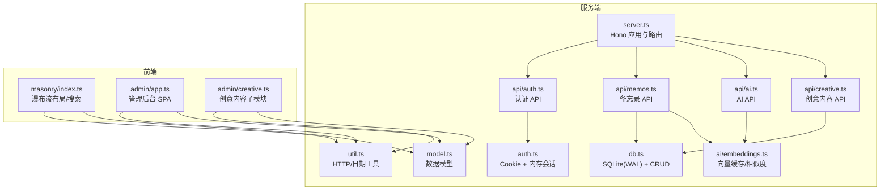
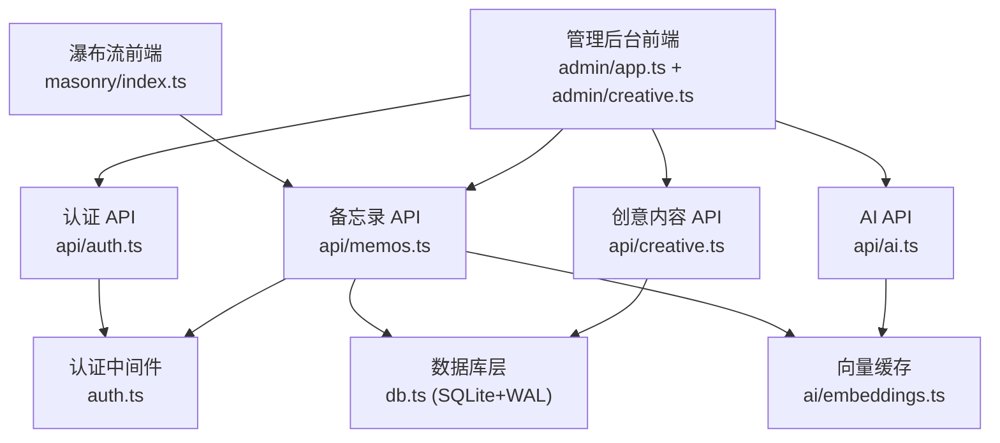
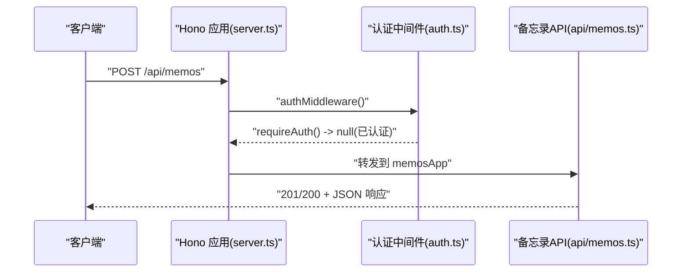
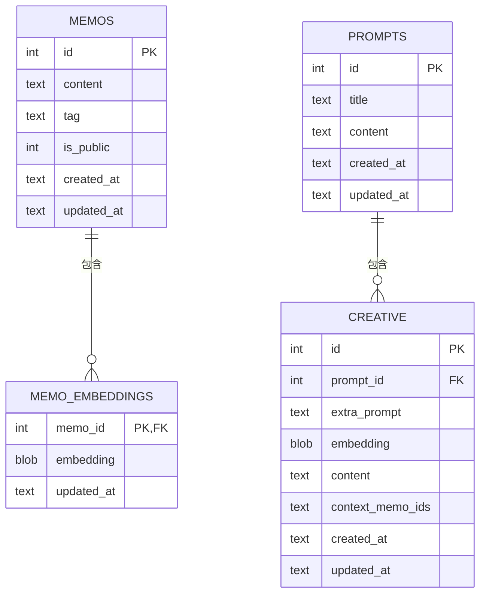
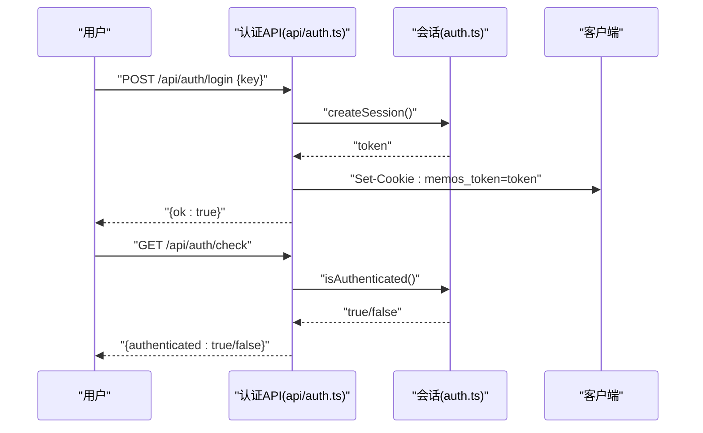
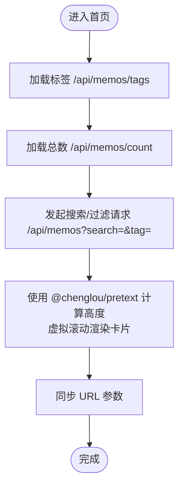
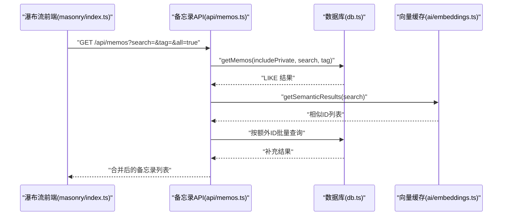
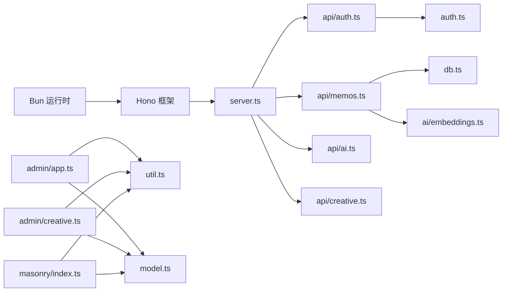

# 架构设计

<cite>
**本文引用的文件**
- [README.md](file://README.md)
- [package.json](file://package.json)
- [server.ts](file://src/server.ts)
- [db.ts](file://src/db.ts)
- [auth.ts](file://src/auth.ts)
- [api/auth.ts](file://src/api/auth.ts)
- [api/memos.ts](file://src/api/memos.ts)
- [admin/app.ts](file://src/admin/app.ts)
- [masonry/index.ts](file://src/masonry/index.ts)
- [model.ts](file://src/model.ts)
- [util.ts](file://src/util.ts)
- [ai/embeddings.ts](file://src/ai/embeddings.ts)
- [admin/creative.ts](file://src/admin/creative.ts)
- [script/initMemos.ts](file://script/initMemos.ts)
</cite>

## 目录
1. [引言](#引言)
2. [项目结构](#项目结构)
3. [核心组件](#核心组件)
4. [架构总览](#架构总览)
5. [详细组件分析](#详细组件分析)
6. [依赖关系分析](#依赖关系分析)
7. [性能考量](#性能考量)
8. [故障排查指南](#故障排查指南)
9. [结论](#结论)
10. [附录](#附录)

## 引言
本项目是一个基于 Bun 运行时的轻量级备忘录系统，采用前后端一体化的单体架构，结合 Hono 框架作为服务端路由与中间件载体，内置 SQLite（WAL 模式）作为数据存储，提供瀑布流展示页面与独立的管理后台。系统通过 Cookie + 内存会话实现认证，前端分别采用 @chenglou/pretext（文字排版与精确高度计算）与 VanJS（响应式 UI）构建。

## 项目结构
项目采用“按功能域”组织的目录结构，主要模块如下：
- 服务端入口与路由：src/server.ts
- 数据层：src/db.ts
- 认证与中间件：src/auth.ts + src/api/auth.ts
- API 子域：src/api/memos.ts、src/api/ai.ts、src/api/creative.ts
- 前端瀑布流：src/masonry/index.ts + index.html
- 管理后台：src/admin/app.ts + index.html + creative.ts
- 工具与模型：src/util.ts + src/model.ts
- AI 向量与语义检索：src/ai/embeddings.ts + src/ai/service.ts
- 初始化脚本：script/initMemos.ts

图表来源
- [server.ts:74-127](file://src/server.ts#L74-L127)
- [api/auth.ts:22-54](file://src/api/auth.ts#L22-L54)
- [api/memos.ts:18-140](file://src/api/memos.ts#L18-L140)
- [db.ts:15-57](file://src/db.ts#L15-L57)
- [auth.ts:1-74](file://src/auth.ts#L1-L74)
- [util.ts:1-43](file://src/util.ts#L1-L43)
- [model.ts:1-28](file://src/model.ts#L1-L28)
- [ai/embeddings.ts:1-99](file://src/ai/embeddings.ts#L1-L99)
- [masonry/index.ts:1-391](file://src/masonry/index.ts#L1-L391)
- [admin/app.ts:1-677](file://src/admin/app.ts#L1-L677)
- [admin/creative.ts:1-702](file://src/admin/creative.ts#L1-L702)

章节来源
- [README.md:25-45](file://README.md#L25-L45)
- [package.json:1-22](file://package.json#L1-L22)

## 核心组件
- 服务端框架与路由：Hono 提供路由注册、中间件机制与请求处理，server.ts 中挂载认证、备忘录、AI、创意内容等子应用，并提供静态页面与客户端 TS 编译服务。
- 数据层：db.ts 使用 bun:sqlite 初始化数据库，启用 WAL 模式与外键约束；提供 memos、memo_embeddings、prompts、creative 等表的 CRUD 与查询辅助函数。
- 认证系统：auth.ts 实现 Cookie + 内存会话，api/auth.ts 提供登录/登出/状态检查接口；server.ts 在需要鉴权的 API 上使用 authMiddleware。
- 前端瀑布流：masonry/index.ts 基于 @chenglou/pretext 进行文本预排版与精确高度计算，实现自适应列数、虚拟滚动与 URL 同步。
- 管理后台：admin/app.ts 基于 VanJS 构建 SPA，提供登录、创建/编辑/删除备忘录、切换可见性、时间线导航、AI 优化与标签建议等功能；admin/creative.ts 提供创意内容生成与管理。
- AI 与语义检索：ai/embeddings.ts 维护内存向量缓存，基于余弦相似度进行语义检索，与数据库中 memo_embeddings 表配合实现嵌入持久化。

章节来源
- [server.ts:74-127](file://src/server.ts#L74-L127)
- [db.ts:15-57](file://src/db.ts#L15-L57)
- [auth.ts:1-74](file://src/auth.ts#L1-L74)
- [api/auth.ts:22-54](file://src/api/auth.ts#L22-L54)
- [masonry/index.ts:1-391](file://src/masonry/index.ts#L1-L391)
- [admin/app.ts:1-677](file://src/admin/app.ts#L1-L677)
- [admin/creative.ts:1-702](file://src/admin/creative.ts#L1-L702)
- [ai/embeddings.ts:1-99](file://src/ai/embeddings.ts#L1-L99)

## 架构总览
系统采用三层分层设计：
- 表现层（Presentation Layer）
  - 瀑布流页面：masonry/index.ts 通过 fetch 调用 /api/memos 获取数据，使用 @chenglou/pretext 进行精确排版与虚拟滚动渲染。
  - 管理后台：admin/app.ts 与 admin/creative.ts 构成 SPA，负责备忘录与创意内容的增删改查、AI 辅助与状态管理。
- 业务逻辑层（Business Logic Layer）
  - API 子域：api/memos.ts、api/ai.ts、api/creative.ts 对接数据库与 AI 能力，封装业务规则与校验。
  - 认证中间件：auth.ts 提供 requireAuth 与 authMiddleware，统一拦截未授权请求。
- 数据访问层（Data Access Layer）
  - db.ts 封装 SQLite 访问，启用 WAL 模式提升并发读写性能，提供事务安全与外键约束。
  - ai/embeddings.ts 维护向量缓存与相似度计算，异步生成与持久化嵌入。

图表来源
- [server.ts:74-127](file://src/server.ts#L74-L127)
- [api/auth.ts:22-54](file://src/api/auth.ts#L22-L54)
- [api/memos.ts:18-140](file://src/api/memos.ts#L18-L140)
- [db.ts:15-57](file://src/db.ts#L15-L57)
- [auth.ts:68-74](file://src/auth.ts#L68-L74)
- [ai/embeddings.ts:1-99](file://src/ai/embeddings.ts#L1-L99)

## 详细组件分析

### Hono 集成与中间件机制
- 路由挂载：server.ts 使用 app.route 将认证、备忘录、AI、创意内容子应用挂载到 /api/* 路径。
- 中间件：auth.ts 提供 authMiddleware，对需要鉴权的 API（如创建/更新/删除备忘录）进行拦截；requireAuth 返回 401 或 null，便于在路由处理器中判断。
- 客户端编译：server.ts 内置 Bun.build 缓存，按需将 /admin/app.ts 与 /masonry/index.ts 编译为浏览器可用的 JS 并缓存 mtime，避免重复编译。
- 静态页面：server.ts 提供 /admin/ 与 /（首页瀑布流）的 HTML 页面路由，并对未匹配路径进行 SPA 回退。

图表来源
- [server.ts:74-127](file://src/server.ts#L74-L127)
- [auth.ts:68-74](file://src/auth.ts#L68-L74)
- [api/memos.ts:63-92](file://src/api/memos.ts#L63-L92)

章节来源
- [server.ts:74-127](file://src/server.ts#L74-L127)
- [auth.ts:68-74](file://src/auth.ts#L68-L74)
- [api/memos.ts:63-92](file://src/api/memos.ts#L63-L92)

### 数据库设计与 WAL 模式
- 初始化：db.ts 在首次访问时创建 memos、memo_embeddings、prompts、creative 表，并启用 PRAGMA journal_mode=WAL 与 foreign_keys=ON。
- 数据模型：model.ts 定义 Memo、Prompt、CreativeItem 结构；db.ts 提供 getMemos、getAllTags、createMemo、updateMemo、deleteMemo 等方法。
- 查询与过滤：getMemos 支持 includePrivate、search、tag、ids 等条件组合；countMemos 提供总数统计。
- 向量存储：memo_embeddings 表保存向量嵌入与更新时间，ai/embeddings.ts 提供加载、替换、删除与持久化。

图表来源
- [db.ts:17-56](file://src/db.ts#L17-L56)
- [model.ts:1-28](file://src/model.ts#L1-L28)

章节来源
- [db.ts:15-57](file://src/db.ts#L15-L57)
- [model.ts:1-28](file://src/model.ts#L1-L28)
- [ai/embeddings.ts:12-46](file://src/ai/embeddings.ts#L12-L46)

### 认证系统（Cookie + 内存会话）
- 会话存储：auth.ts 使用 Set 存储 token，生命周期随进程；通过 setAuthCookie/clearAuthCookie 设置 HttpOnly、SameSite=Strict 的 Cookie。
- 密钥认证：api/auth.ts 读取 MEMOS_SECRET_KEY 环境变量，生产环境必须配置；登录成功后返回 200 并设置 Cookie。
- 中间件拦截：authMiddleware 在需要鉴权的 API 路由上生效，未通过认证直接返回 401。
- 会话校验：getSessionToken 从请求头解析 Cookie；isAuthenticated 判断 token 是否存在于内存集合。

图表来源
- [api/auth.ts:24-53](file://src/api/auth.ts#L24-L53)
- [auth.ts:23-66](file://src/auth.ts#L23-L66)

章节来源
- [api/auth.ts:11-20](file://src/api/auth.ts#L11-L20)
- [auth.ts:23-66](file://src/auth.ts#L23-L66)

### 前端架构：瀑布流与管理后台
- 瀑布流布局（masonry/index.ts）
  - 文本预排版：使用 @chenglou/pretext 计算精确高度，提高渲染一致性。
  - 自适应列数：根据视口宽度动态计算列数与列宽，窄屏单列，宽屏多列。
  - 虚拟滚动：仅渲染可视区域卡片，滚动时回收/创建 DOM，降低内存占用。
  - URL 同步：搜索与标签状态同步到 URL 参数，支持前进/后退与书签。
  - 标签下拉：从 /api/memos/tags 加载标签，支持选择过滤。
- 管理后台（admin/app.ts + admin/creative.ts）
  - SPA 架构：VanJS 响应式状态驱动 UI，支持登录、创建/编辑/删除、切换可见性、时间线导航。
  - AI 辅助：支持 AI 优化内容与标签建议，基于 /api/ai/* 接口；创意内容模块提供提示词管理与流式生成。
  - 错误处理：全局错误横幅与表单错误提示，保证用户体验。

图表来源
- [masonry/index.ts:272-351](file://src/masonry/index.ts#L272-L351)

章节来源
- [masonry/index.ts:146-269](file://src/masonry/index.ts#L146-L269)
- [masonry/index.ts:308-351](file://src/masonry/index.ts#L308-L351)
- [admin/app.ts:38-87](file://src/admin/app.ts#L38-L87)
- [admin/creative.ts:144-244](file://src/admin/creative.ts#L144-L244)

### API 工作流：备忘录 CRUD 与语义检索
- 列表查询：/api/memos 支持 search、tag、all 参数；当 includePrivate 为真且已认证时返回私有备忘录。
- 语义检索：当提供 search 参数时，系统先执行 LIKE 查询，再异步运行 getSemanticResults 获取相似备忘录 ID，合并结果并去重。
- 创建/更新/删除：authMiddleware 保护；创建后异步生成嵌入并持久化；更新内容时重新生成嵌入；删除后清理嵌入缓存。

图表来源
- [api/memos.ts:20-48](file://src/api/memos.ts#L20-L48)
- [ai/embeddings.ts:66-86](file://src/ai/embeddings.ts#L66-L86)
- [db.ts:70-102](file://src/db.ts#L70-L102)

章节来源
- [api/memos.ts:20-48](file://src/api/memos.ts#L20-L48)
- [ai/embeddings.ts:66-86](file://src/ai/embeddings.ts#L66-L86)
- [db.ts:70-102](file://src/db.ts#L70-L102)

## 依赖关系分析
- 运行时与框架：Bun（内置 HTTP 服务器与 SQLite），Hono（路由与中间件）。
- 前端框架：@chenglou/pretext（文字排版）、VanJS（响应式 UI）。
- 依赖注入与耦合：
  - server.ts 作为入口，聚合各子应用与静态资源；与 db.ts、auth.ts、api/* 存在直接调用关系。
  - api/* 依赖 db.ts 与 auth.ts；admin/app.ts 与 admin/creative.ts 依赖 util.ts 与 model.ts。
  - ai/embeddings.ts 依赖 db.ts 与 AI 服务能力，形成“数据层 + 业务层”的弱耦合。

图表来源
- [package.json:16-20](file://package.json#L16-L20)
- [server.ts:74-127](file://src/server.ts#L74-L127)
- [api/memos.ts:18-140](file://src/api/memos.ts#L18-L140)
- [db.ts:15-57](file://src/db.ts#L15-L57)
- [auth.ts:1-74](file://src/auth.ts#L1-L74)
- [util.ts:1-43](file://src/util.ts#L1-L43)
- [model.ts:1-28](file://src/model.ts#L1-L28)

章节来源
- [package.json:16-20](file://package.json#L16-L20)
- [server.ts:74-127](file://src/server.ts#L74-L127)

## 性能考量
- SQLite WAL 模式：提升并发读写能力，减少写操作阻塞，适合单机部署场景。
- 客户端编译缓存：server.ts 使用 Map 缓存构建结果与 mtime，避免重复编译，缩短开发时热重载时间。
- 虚拟滚动与预排版：masonry/index.ts 仅渲染可视区域卡片，结合 @chenglou/pretext 精确高度计算，降低 DOM 数量与重排成本。
- 异步向量生成：创建/更新备忘录时采用 fire-and-forget 方式生成嵌入，不影响主流程响应时间。
- 语义检索降噪：ai/embeddings.ts 使用阈值过滤低相似度结果，减少无关数据返回。

[本节为通用性能讨论，不直接分析具体文件]

## 故障排查指南
- 认证失败（401）
  - 检查是否正确携带 Cookie；确认 MEMOS_SECRET_KEY 是否设置；生产环境必须设置密钥。
  - 参考：[api/auth.ts:11-20](file://src/api/auth.ts#L11-L20)，[auth.ts:58-66](file://src/auth.ts#L58-L66)
- 数据库初始化问题
  - 首次启动会自动创建 memos.db 与表；若权限不足或磁盘空间不足会导致初始化失败。
  - 参考：[db.ts:15-57](file://src/db.ts#L15-L57)
- 客户端编译失败
  - server.ts 内部捕获构建错误并输出日志；检查 /admin/app.ts 与 /masonry/index.ts 的语法与依赖。
  - 参考：[server.ts:15-51](file://src/server.ts#L15-L51)
- 瀑布流渲染异常
  - 检查 /api/memos/tags 与 /api/memos 的响应；确认 URL 参数同步逻辑。
  - 参考：[masonry/index.ts:272-351](file://src/masonry/index.ts#L272-L351)
- 向量缓存加载失败
  - 检查 AI 能力开关与 memo_embeddings 表数据完整性；内存缓存加载失败会跳过损坏条目。
  - 参考：[ai/embeddings.ts:12-35](file://src/ai/embeddings.ts#L12-L35)

章节来源
- [api/auth.ts:11-20](file://src/api/auth.ts#L11-L20)
- [auth.ts:58-66](file://src/auth.ts#L58-L66)
- [db.ts:15-57](file://src/db.ts#L15-L57)
- [server.ts:15-51](file://src/server.ts#L15-L51)
- [masonry/index.ts:272-351](file://src/masonry/index.ts#L272-L351)
- [ai/embeddings.ts:12-35](file://src/ai/embeddings.ts#L12-L35)

## 结论
本项目以 Hono 为核心，结合 Bun 的高性能运行时与 SQLite 的轻量存储，实现了从前端瀑布流到管理后台的一体化体验。通过 Cookie + 内存会话提供简单可靠的认证，借助 @chenglou/pretext 与 VanJS 提升前端交互质量。数据库采用 WAL 模式优化并发，AI 向量缓存与语义检索增强搜索体验。整体架构清晰、模块职责明确，适合个人与小团队的轻量级知识管理场景。

[本节为总结性内容，不直接分析具体文件]

## 附录
- 环境变量
  - PORT：服务器监听端口，默认 3020
  - MEMOS_SECRET_KEY：管理员登录密钥，默认开发环境警告但可运行
- 初始化脚本
  - script/initMemos.ts 用于从文本文件批量导入备忘录，具备去重与统计输出

章节来源
- [README.md:59-65](file://README.md#L59-L65)
- [script/initMemos.ts:1-62](file://script/initMemos.ts#L1-L62)