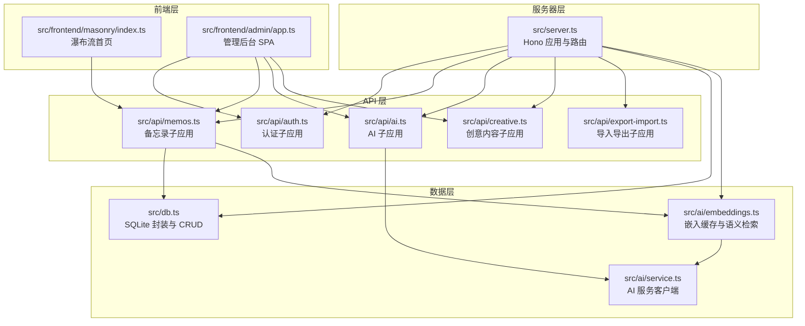
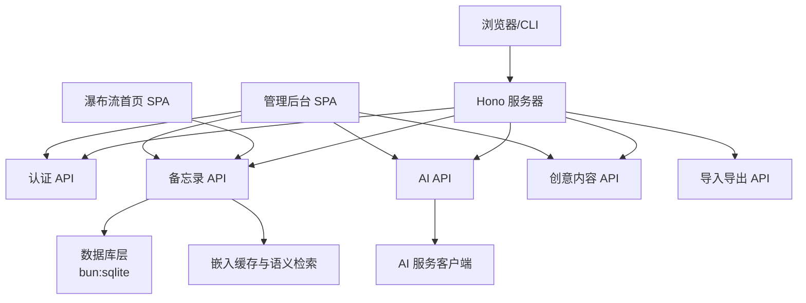
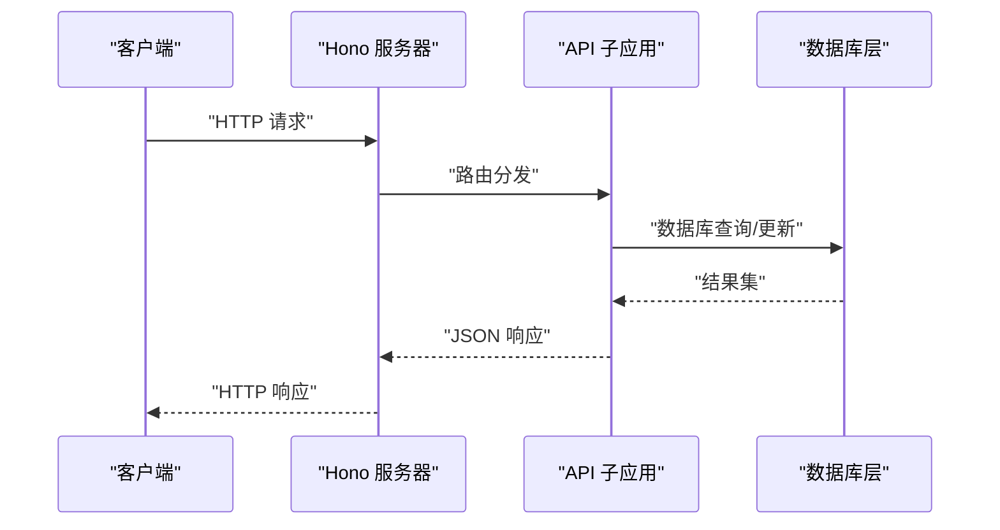
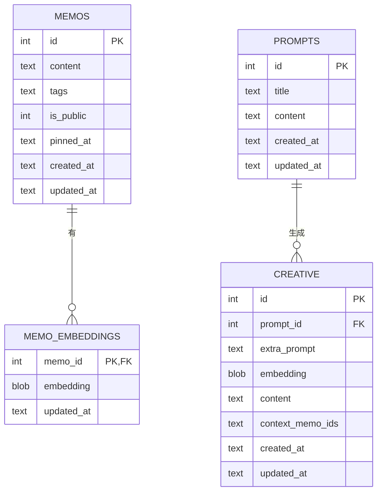
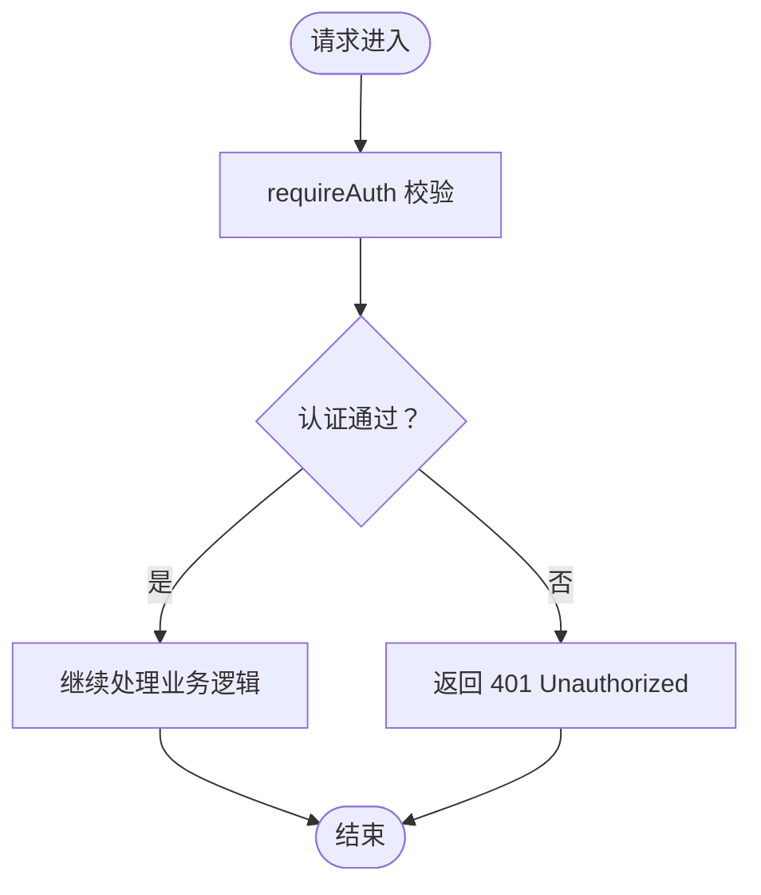
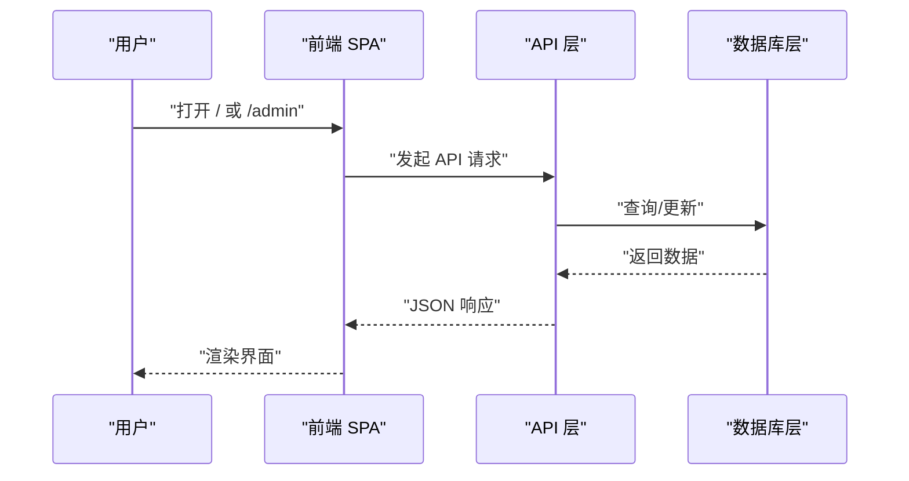
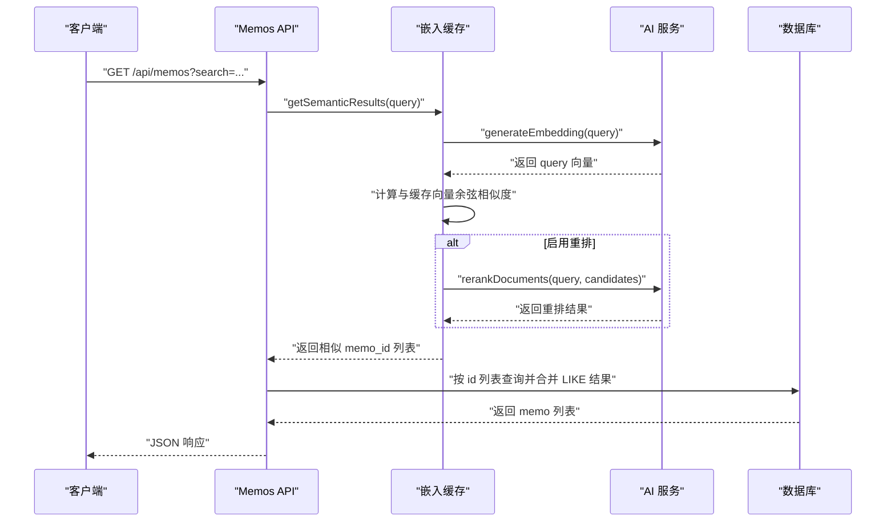
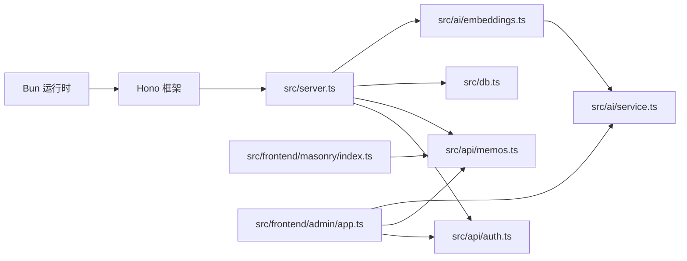
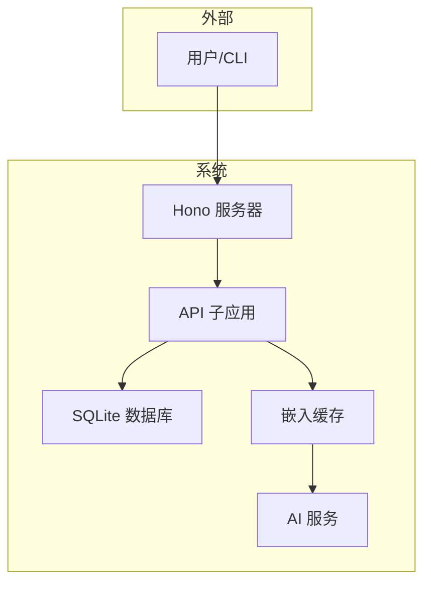

# 架构设计

<cite>
**本文引用的文件**
- [README.md](file://README.md)
- [package.json](file://package.json)
- [app.config.json](file://app.config.json)
- [src/server.ts](file://src/server.ts)
- [src/db.ts](file://src/db.ts)
- [src/auth.ts](file://src/auth.ts)
- [src/api/auth.ts](file://src/api/auth.ts)
- [src/api/memos.ts](file://src/api/memos.ts)
- [src/model.ts](file://src/model.ts)
- [src/ai/service.ts](file://src/ai/service.ts)
- [src/ai/embeddings.ts](file://src/ai/embeddings.ts)
- [src/helper/rate-limit.ts](file://src/helper/rate-limit.ts)
- [src/frontend/admin/app.ts](file://src/frontend/admin/app.ts)
- [src/frontend/masonry/index.ts](file://src/frontend/masonry/index.ts)
- [src/init/seed.ts](file://src/init/seed.ts)
</cite>

## 目录
1. [引言](#引言)
2. [项目结构](#项目结构)
3. [核心组件](#核心组件)
4. [架构总览](#架构总览)
5. [详细组件分析](#详细组件分析)
6. [依赖关系分析](#依赖关系分析)
7. [性能考量](#性能考量)
8. [故障排查指南](#故障排查指南)
9. [结论](#结论)
10. [附录](#附录)

## 引言
本项目是一个基于 Bun 运行时的轻量级备忘录系统，采用前后端分离的 SPA 架构，结合 Hono 作为 Web 服务器与路由框架，bun:sqlite 作为本地数据库，VanJS 与 @chenglou/pretext 构建前端界面。系统提供公开/私密备忘录管理、标签分类、全文检索、瀑布流展示以及独立的管理后台。本文档从分层架构、技术选型、数据流、安全与可扩展性等方面进行系统化说明，帮助开发者快速理解并扩展系统。

## 项目结构
项目采用“按层+按功能”的混合组织方式：
- 服务器层：Hono 应用、静态资源与页面路由、初始化流程
- API 层：认证、备忘录、AI、创意内容、导入导出等子应用
- 数据层：SQLite（bun:sqlite）封装、模型定义、嵌入向量缓存
- 前端层：瀑布流首页（VanJS + @chenglou/pretext）、管理后台（VanJS SPA）

图表来源
- [src/server.ts:38-125](file://src/server.ts#L38-L125)
- [src/api/auth.ts:29-77](file://src/api/auth.ts#L29-L77)
- [src/api/memos.ts:26-220](file://src/api/memos.ts#L26-L220)
- [src/db.ts:15-61](file://src/db.ts#L15-L61)
- [src/ai/embeddings.ts:16-64](file://src/ai/embeddings.ts#L16-L64)
- [src/ai/service.ts:43-75](file://src/ai/service.ts#L43-L75)
- [src/frontend/masonry/index.ts:1-23](file://src/frontend/masonry/index.ts#L1-L23)
- [src/frontend/admin/app.ts:1-251](file://src/frontend/admin/app.ts#L1-L251)

章节来源
- [README.md:25-45](file://README.md#L25-L45)
- [package.json:6-12](file://package.json#L6-L12)
- [src/server.ts:11-125](file://src/server.ts#L11-L125)

## 核心组件
- 服务器入口与路由
  - Hono 应用挂载各子应用，提供静态资源、页面路由与 SPA 回退
  - 支持 /favicon.svg、/index.js、/admin/app.js 等静态资源
  - /admin/* 路由回退至 SPA，实现前端路由
- 数据库层
  - 使用 bun:sqlite，启用 WAL 模式与外键约束
  - 提供 memos、memo_embeddings、prompts、creative 等表的 CRUD 与查询
  - 支持标签数组存储与 JSON 查询、全文检索 LIKE、置顶排序
- 认证与会话
  - Cookie + 内存会话，支持 Bearer Token（用于 CLI/API）
  - 登录频率限制（IP 级别）
- 前端
  - 瀑布流首页：VanJS + @chenglou/pretext，支持搜索、标签筛选、URL 同步
  - 管理后台：VanJS SPA，密钥登录，提供备忘录与创意内容管理

章节来源
- [src/server.ts:38-125](file://src/server.ts#L38-L125)
- [src/db.ts:15-61](file://src/db.ts#L15-L61)
- [src/auth.ts:1-128](file://src/auth.ts#L1-L128)
- [src/frontend/masonry/index.ts:1-23](file://src/frontend/masonry/index.ts#L1-L23)
- [src/frontend/admin/app.ts:1-251](file://src/frontend/admin/app.ts#L1-L251)

## 架构总览
系统采用“服务器层 + API 层 + 数据层 + 前端层”的分层设计，服务器层统一调度，API 层按功能拆分子应用，数据层抽象数据库访问，前端层分别负责瀑布流首页与管理后台。

图表来源
- [src/server.ts:38-125](file://src/server.ts#L38-L125)
- [src/api/auth.ts:29-77](file://src/api/auth.ts#L29-L77)
- [src/api/memos.ts:26-220](file://src/api/memos.ts#L26-L220)
- [src/db.ts:15-61](file://src/db.ts#L15-L61)
- [src/ai/embeddings.ts:16-64](file://src/ai/embeddings.ts#L16-L64)
- [src/ai/service.ts:43-75](file://src/ai/service.ts#L43-L75)

## 详细组件分析

### 服务器层与路由
- 路由组织
  - /api/* 子应用挂载：认证、AI、备忘录、创意、导入导出
  - 静态资源：favicon、CSS、预构建 JS（/index.js、/admin/app.js）
  - 页面路由：/ 与 /index.html 对应瀑布流首页；/admin* 对应管理后台
  - SPA 回退：/admin/* 未匹配时回退到管理后台 HTML
- 初始化流程
  - 初始化数据库与索引
  - 首次启动导入内置提示词与示例备忘录
  - 初始化嵌入向量缓存（加载已有向量并补全缺失项）

图表来源
- [src/server.ts:38-125](file://src/server.ts#L38-L125)
- [src/api/memos.ts:26-220](file://src/api/memos.ts#L26-L220)
- [src/db.ts:122-164](file://src/db.ts#L122-L164)

章节来源
- [src/server.ts:11-125](file://src/server.ts#L11-L125)
- [src/init/seed.ts:112-118](file://src/init/seed.ts#L112-L118)

### 数据层与模型
- 数据库初始化
  - memos 表：id、content、tags（JSON 数组）、is_public、pinned_at、created_at、updated_at
  - memo_embeddings 表：memo_id 外键、embedding 向量、updated_at
  - prompts、creative 表：提示词与创意内容
  - 索引：pinned_at
- 查询与聚合
  - getMemos 支持 includePrivate、search（LIKE）、tag（逗号分隔多标签）、ids 过滤与排序
  - getAllTags 使用 json_each 进行标签去重
  - countMemos 支持统计公开或全部备忘录数量
- 嵌入向量
  - initEmbeddingCache：加载已有向量并补全缺失
  - upsertEmbedding/saveEmbedding/deleteEmbedding：向量持久化
  - getSemanticResults/getSimilarMemoIds：余弦相似度与可选重排

图表来源
- [src/db.ts:18-61](file://src/db.ts#L18-L61)
- [src/model.ts:1-35](file://src/model.ts#L1-L35)

章节来源
- [src/db.ts:15-479](file://src/db.ts#L15-L479)
- [src/model.ts:1-35](file://src/model.ts#L1-L35)

### 认证与安全
- 认证方式
  - Cookie + 内存会话：登录成功后设置 HttpOnly、SameSite=Strict 的 Cookie，有效期 24 小时
  - Bearer Token：通过 Authorization: Bearer 使用密钥进行 API 调用
- 速率限制
  - 登录尝试：IP 级别，1 分钟最多 5 次，超过则冷却
  - 备忘录与 AI：小时/天双窗口限制，配置来自环境变量或 app.config.json
- 中间件
  - requireAuth 与 authMiddleware：统一校验 Cookie 或 Bearer Token

图表来源
- [src/auth.ts:109-128](file://src/auth.ts#L109-L128)
- [src/api/auth.ts:36-77](file://src/api/auth.ts#L36-L77)
- [src/helper/rate-limit.ts:77-110](file://src/helper/rate-limit.ts#L77-L110)

章节来源
- [src/auth.ts:1-128](file://src/auth.ts#L1-L128)
- [src/api/auth.ts:14-27](file://src/api/auth.ts#L14-L27)
- [src/helper/rate-limit.ts:1-153](file://src/helper/rate-limit.ts#L1-L153)

### 前后端分离与 SPA 路由
- 瀑布流首页
  - VanJS + @chenglou/pretext，URL 参数同步到搜索与标签，支持虚拟滚动与自适应列数
  - 初始化时读取 URL 查询参数，加载标签与计数，触发数据拉取
- 管理后台
  - VanJS SPA，密钥登录，支持新建/编辑/删除备忘录、置顶切换、导入导出、AI 工具箱
  - /admin/* 深度链接由服务器回退到 SPA，避免 404
- 静态资源
  - /index.js、/admin/app.js 由 Bun 构建产出，/favicon.svg、公共 CSS 由服务器直传

图表来源
- [src/frontend/masonry/index.ts:1-23](file://src/frontend/masonry/index.ts#L1-L23)
- [src/frontend/admin/app.ts:1-251](file://src/frontend/admin/app.ts#L1-L251)
- [src/server.ts:59-107](file://src/server.ts#L59-L107)

章节来源
- [src/frontend/masonry/index.ts:1-23](file://src/frontend/masonry/index.ts#L1-L23)
- [src/frontend/admin/app.ts:1-251](file://src/frontend/admin/app.ts#L1-L251)
- [src/server.ts:59-107](file://src/server.ts#L59-L107)

### AI 与语义检索
- AI 服务
  - 多提供商配置（通过 ai.config.json 与环境变量），支持 OpenAI 兼容聊天与流式输出
  - DashScope 嵌入与重排（rerank）能力
- 嵌入缓存与检索
  - 内存缓存 + SQLite 持久化，余弦相似度评分，阈值过滤
  - 可选重排：当候选较多时使用 qwen3-rerank 提升相关性
- 配置
  - app.config.json 控制超时、默认温度、最大 tokens、相似度阈值、重排策略与速率限制

图表来源
- [src/api/memos.ts:28-70](file://src/api/memos.ts#L28-L70)
- [src/ai/embeddings.ts:95-154](file://src/ai/embeddings.ts#L95-L154)
- [src/ai/service.ts:349-445](file://src/ai/service.ts#L349-L445)
- [src/db.ts:122-164](file://src/db.ts#L122-L164)

章节来源
- [src/ai/service.ts:1-507](file://src/ai/service.ts#L1-L507)
- [src/ai/embeddings.ts:1-228](file://src/ai/embeddings.ts#L1-L228)
- [app.config.json:1-22](file://app.config.json#L1-L22)

## 依赖关系分析
- 运行时与框架
  - Bun：运行时、内置 HTTP 服务器、SQLite、构建工具
  - Hono：轻量 Web 框架，路由与中间件
- 前端生态
  - VanJS：响应式 UI 框架
  - @chenglou/pretext：文字排版与精确高度计算
- 外部集成
  - AI 服务：OpenAI 兼容聊天、DashScope 嵌入与重排
- 构建与打包
  - Bun build 输出 ES Module 的前端产物，部署时由服务器直传

图表来源
- [package.json:19-25](file://package.json#L19-L25)
- [src/server.ts:1-10](file://src/server.ts#L1-L10)
- [src/api/memos.ts:1-18](file://src/api/memos.ts#L1-L18)
- [src/ai/embeddings.ts:1-11](file://src/ai/embeddings.ts#L1-L11)
- [src/ai/service.ts:1-14](file://src/ai/service.ts#L1-L14)
- [src/frontend/masonry/index.ts:1-4](file://src/frontend/masonry/index.ts#L1-L4)
- [src/frontend/admin/app.ts:1-10](file://src/frontend/admin/app.ts#L1-L10)

章节来源
- [package.json:19-25](file://package.json#L19-L25)
- [src/server.ts:1-10](file://src/server.ts#L1-L10)

## 性能考量
- 数据库性能
  - WAL 模式提升并发写入性能；pinned_at 索引优化置顶排序
  - LIKE 全文检索在小规模数据下可用，建议配合标签与语义检索减少扫描范围
- 嵌入向量
  - 内存缓存 + SQLite 持久化，首次启动批量生成向量；相似度阈值与候选 TopN 控制召回质量与性能
  - 可选重排在候选较多时启用，避免过多网络调用
- 前端性能
  - 瀑布流采用虚拟滚动，仅渲染可视区域节点
  - 预构建 JS 与静态资源直传，减少运行时编译开销
- 速率限制
  - 双窗口（小时/天）限制防止滥用，支持环境变量覆盖

## 故障排查指南
- 无法登录管理后台
  - 检查 MEMOS_SECRET_KEY 是否设置；生产环境必须设置
  - 查看登录频率限制是否触发（1 分钟最多 5 次）
- API 返回 401
  - 确认 Cookie 是否正确设置（HttpOnly、SameSite、Path）
  - 或使用 Bearer Token（Authorization: Bearer <密钥>）
- 语义检索无效
  - 确认 DASHSCOPE_API_KEY 是否配置；检查相似度阈值与候选 TopN 设置
  - 查看嵌入缓存是否已初始化
- 备忘录创建失败
  - 检查速率限制（每小时/每天上限）
  - 确认内容非空且格式正确

章节来源
- [src/api/auth.ts:14-27](file://src/api/auth.ts#L14-L27)
- [src/auth.ts:72-107](file://src/auth.ts#L72-L107)
- [src/helper/rate-limit.ts:77-110](file://src/helper/rate-limit.ts#L77-L110)
- [src/ai/embeddings.ts:16-64](file://src/ai/embeddings.ts#L16-L64)

## 结论
本项目通过 Hono + Bun 的现代化组合，实现了轻量、高性能、可扩展的备忘录系统。分层清晰、前后端分离、模块化 API 与可插拔的 AI 能力，使得系统易于维护与演进。SQLite 的简洁性与 Bun 的高效运行时，使部署与开发体验更佳。建议在生产环境中完善密钥管理、监控与备份策略，并根据数据规模评估是否引入外部搜索引擎或缓存层。

## 附录
- 系统边界图（概念性）
