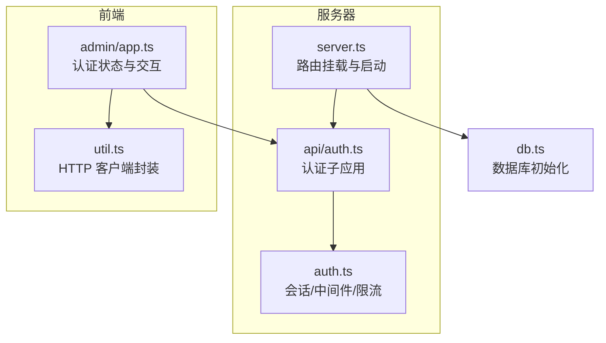
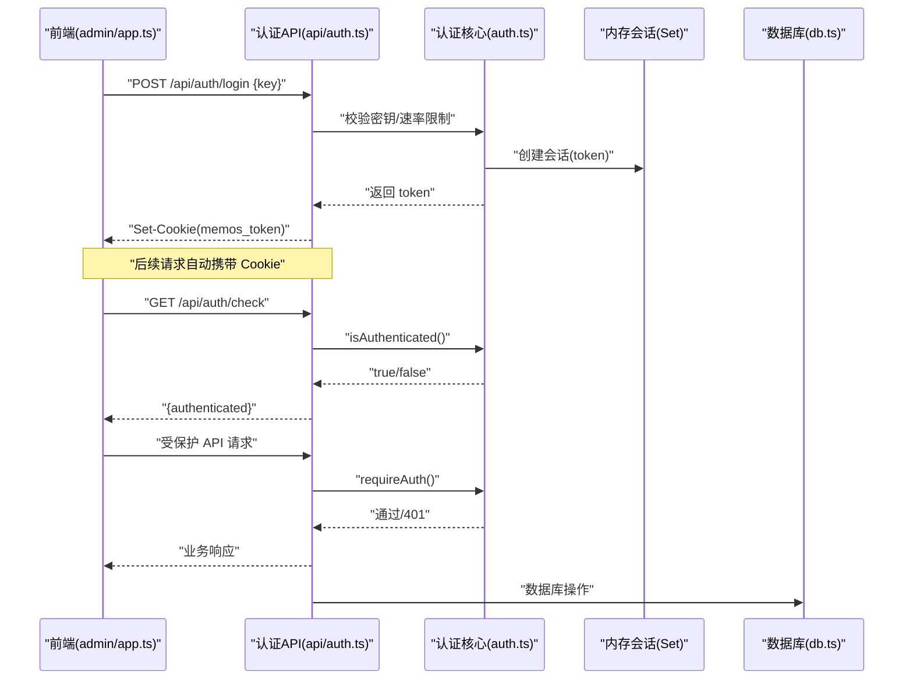
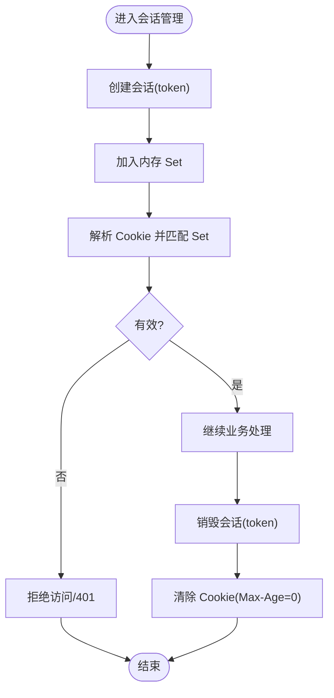
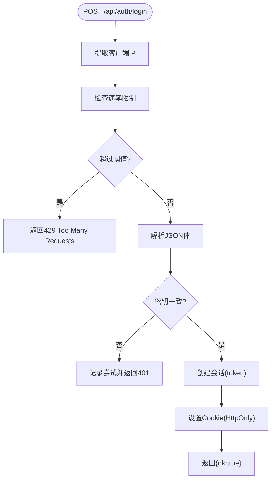
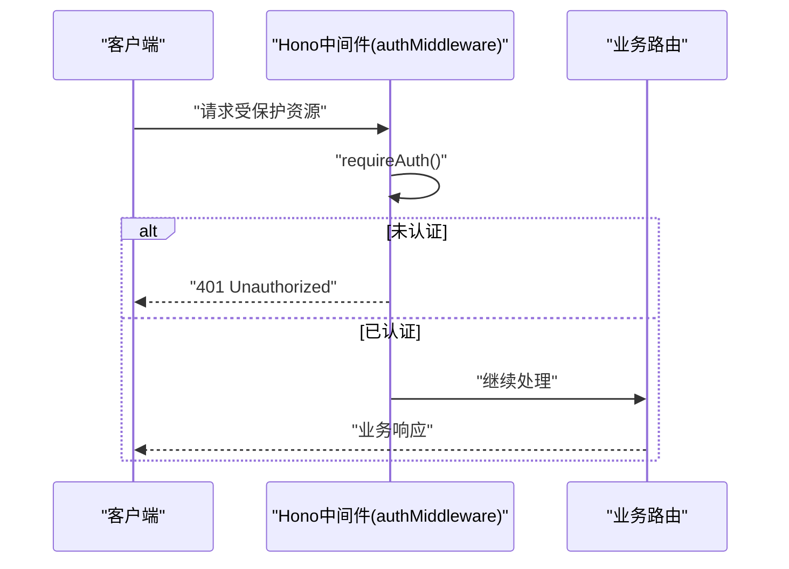
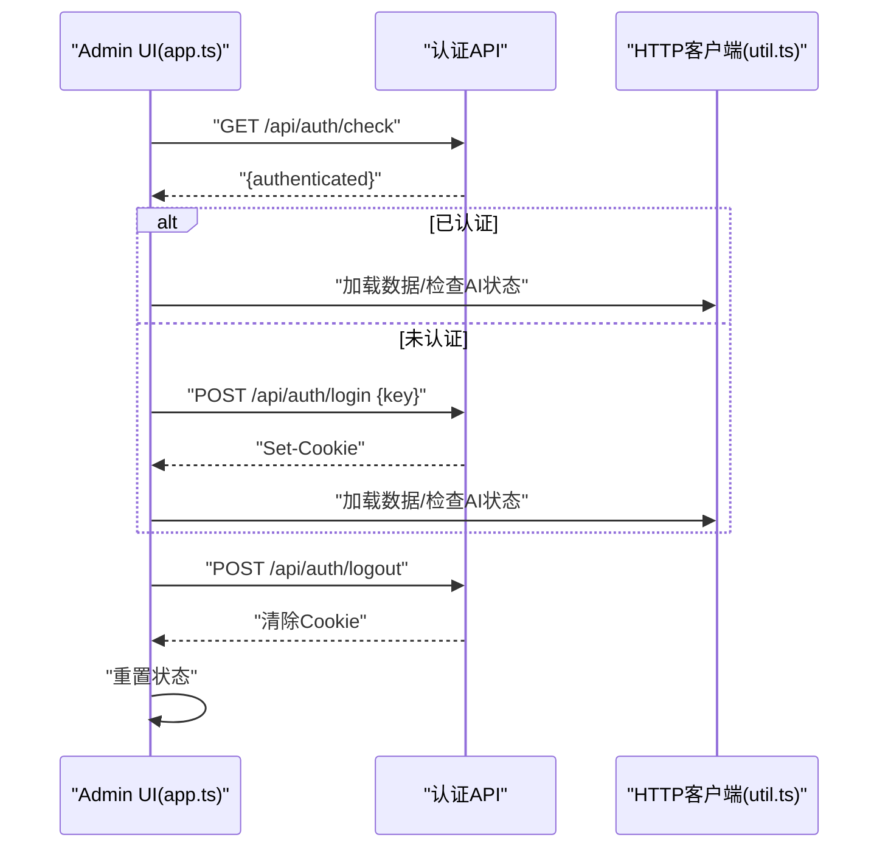
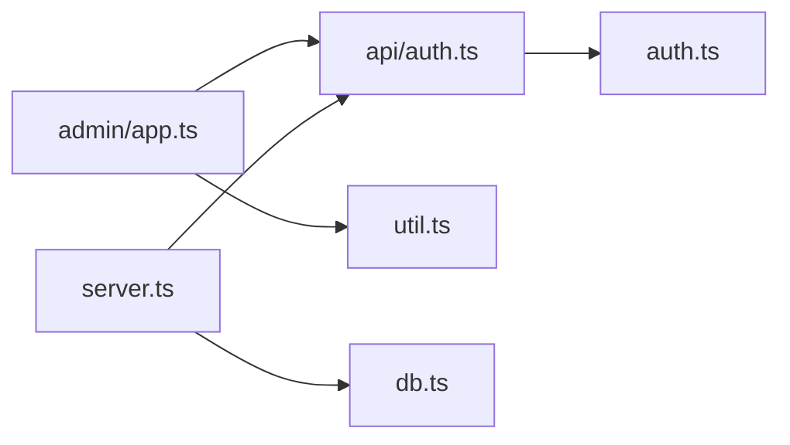

# 认证系统

<cite>
**本文引用的文件**
- [src/auth.ts](file://src/auth.ts)
- [src/api/auth.ts](file://src/api/auth.ts)
- [src/server.ts](file://src/server.ts)
- [src/admin/app.ts](file://src/admin/app.ts)
- [src/util.ts](file://src/util.ts)
- [src/db.ts](file://src/db.ts)
</cite>

## 目录
1. [简介](#简介)
2. [项目结构](#项目结构)
3. [核心组件](#核心组件)
4. [架构总览](#架构总览)
5. [组件详细分析](#组件详细分析)
6. [依赖关系分析](#依赖关系分析)
7. [性能考量](#性能考量)
8. [故障排查指南](#故障排查指南)
9. [结论](#结论)
10. [附录](#附录)

## 简介
本文件为 memos 项目的认证系统提供系统化架构文档，重点覆盖以下方面：
- Cookie + 内存会话的认证机制设计：会话存储、过期管理与安全配置
- 密钥认证流程：密钥验证、权限控制与访问限制
- 认证中间件实现：请求拦截、会话验证与错误处理
- API 认证策略与前端认证状态管理
- 安全最佳实践与常见攻击防护建议

该认证系统采用“单管理员 + 秘钥认证 + Cookie + 内存会话”的轻量方案，适合开发与小规模部署场景；生产环境需结合外部反向代理或更严格的会话后端进行加固。

## 项目结构
认证相关代码主要分布在以下模块：
- 会话与认证核心逻辑：src/auth.ts
- 认证 API 子应用：src/api/auth.ts
- 服务器入口与路由挂载：src/server.ts
- 前端认证状态管理与交互：src/admin/app.ts
- 前端 HTTP 客户端封装：src/util.ts
- 数据库初始化与模型定义：src/db.ts

图表来源
- [src/server.ts:74-80](file://src/server.ts#L74-L80)
- [src/api/auth.ts:29](file://src/api/auth.ts#L29)
- [src/auth.ts:105-110](file://src/auth.ts#L105-L110)
- [src/admin/app.ts:40-74](file://src/admin/app.ts#L40-L74)
- [src/util.ts:10-20](file://src/util.ts#L10-L20)
- [src/db.ts:15-57](file://src/db.ts#L15-L57)

章节来源
- [src/server.ts:74-80](file://src/server.ts#L74-L80)
- [src/api/auth.ts:29](file://src/api/auth.ts#L29)
- [src/auth.ts:105-110](file://src/auth.ts#L105-L110)
- [src/admin/app.ts:40-74](file://src/admin/app.ts#L40-L74)
- [src/util.ts:10-20](file://src/util.ts#L10-L20)
- [src/db.ts:15-57](file://src/db.ts#L15-L57)

## 核心组件
- 会话与 Cookie 管理：内存会话集合、Cookie 解析与设置、会话销毁
- 认证中间件：基于 Hono 的中间件，统一拦截未认证请求
- 密钥认证与速率限制：从环境变量读取密钥，校验登录请求，记录失败尝试并实施冷却
- 前端认证状态管理：VanJS 状态驱动，检查认证、登录、登出与错误提示
- API 客户端封装：fetch 封装，自动携带同源 Cookie，统一错误处理

章节来源
- [src/auth.ts:1-111](file://src/auth.ts#L1-L111)
- [src/api/auth.ts:1-77](file://src/api/auth.ts#L1-L77)
- [src/admin/app.ts:40-74](file://src/admin/app.ts#L40-L74)
- [src/util.ts:10-20](file://src/util.ts#L10-L20)

## 架构总览
认证系统整体流程如下：
- 前端在登录页输入密钥，调用认证 API
- 服务端校验密钥与速率限制，成功后创建会话并设置 HttpOnly Cookie
- 后续请求携带 Cookie，中间件校验会话有效性
- 前端通过“检查认证”接口与受保护 API 维护状态

图表来源
- [src/admin/app.ts:40-74](file://src/admin/app.ts#L40-L74)
- [src/api/auth.ts:36-68](file://src/api/auth.ts#L36-L68)
- [src/auth.ts:23-41](file://src/auth.ts#L23-L41)
- [src/auth.ts:95-103](file://src/auth.ts#L95-L103)
- [src/db.ts:15-57](file://src/db.ts#L15-L57)

## 组件详细分析

### 会话与 Cookie 管理
- 会话存储：使用内存 Set 存储 token，进程重启即清空，天然支持单管理员
- Cookie 名称与属性：固定名称、HttpOnly、SameSite=Strict、路径与有效期
- 会话生命周期：
  - 创建：生成随机 token 并加入 Set
  - 验证：解析 Cookie，匹配 Set
  - 销毁：删除 Set 中 token，并设置过期 Cookie
- 过期管理：Cookie Max-Age 为 24 小时；内存会话无 TTL，依赖服务重启清理

图表来源
- [src/auth.ts:33-41](file://src/auth.ts#L33-L41)
- [src/auth.ts:23-31](file://src/auth.ts#L23-L31)
- [src/auth.ts:43-55](file://src/auth.ts#L43-L55)

章节来源
- [src/auth.ts:1-111](file://src/auth.ts#L1-L111)

### 密钥认证流程
- 密钥来源：优先从环境变量读取；生产环境未设置时直接退出；开发环境使用默认值并警告
- 登录请求处理：
  - 提取客户端 IP（支持代理头）
  - 速率限制检查：超过阈值返回 429
  - 解析 JSON，校验密钥一致性
  - 失败记录尝试并返回 401
  - 成功清除尝试记录，创建会话并设置 Cookie
- 权限控制：所有受保护 API 前置 requireAuth 中间件
- 访问限制：内存会话集合，单实例单管理员

图表来源
- [src/api/auth.ts:36-68](file://src/api/auth.ts#L36-L68)
- [src/auth.ts:58-92](file://src/auth.ts#L58-L92)

章节来源
- [src/api/auth.ts:14-27](file://src/api/auth.ts#L14-L27)
- [src/api/auth.ts:36-68](file://src/api/auth.ts#L36-L68)
- [src/auth.ts:58-92](file://src/auth.ts#L58-L92)

### 认证中间件实现
- 中间件职责：在 Hono 中间件中调用 requireAuth，未通过则直接返回 401
- 适用范围：所有需要认证的受保护 API
- 错误处理：统一返回 JSON 错误与 401 状态码

图表来源
- [src/auth.ts:105-110](file://src/auth.ts#L105-L110)
- [src/auth.ts:95-103](file://src/auth.ts#L95-L103)

章节来源
- [src/auth.ts:105-110](file://src/auth.ts#L105-L110)
- [src/auth.ts:95-103](file://src/auth.ts#L95-L103)

### API 认证策略
- 认证检查：GET /api/auth/check 返回当前是否已认证
- 登录：POST /api/auth/login，携带密钥，成功后设置 Cookie
- 登出：POST /api/auth/logout，销毁会话并清除 Cookie
- 受保护 API：通过中间件强制 requireAuth，未认证返回 401

章节来源
- [src/api/auth.ts:31-34](file://src/api/auth.ts#L31-L34)
- [src/api/auth.ts:36-68](file://src/api/auth.ts#L36-L68)
- [src/api/auth.ts:70-76](file://src/api/auth.ts#L70-L76)
- [src/auth.ts:95-103](file://src/auth.ts#L95-L103)

### 前端认证状态管理
- 状态：使用 VanJS 状态对象维护认证状态、错误信息、加载状态等
- 初始化：页面加载时调用“检查认证”，根据结果切换登录页或管理页
- 登录：提交密钥，成功后刷新数据并检查 AI 状态
- 登出：调用登出 API，重置状态并清空表单
- API 封装：fetch 自动携带同源 Cookie，统一错误处理

图表来源
- [src/admin/app.ts:40-74](file://src/admin/app.ts#L40-L74)
- [src/util.ts:10-20](file://src/util.ts#L10-L20)

章节来源
- [src/admin/app.ts:40-74](file://src/admin/app.ts#L40-L74)
- [src/util.ts:10-20](file://src/util.ts#L10-L20)

## 依赖关系分析
- server.ts 将认证子应用挂载到 /api/auth，并提供静态页面与 SPA 路由
- api/auth.ts 依赖 auth.ts 提供的会话与中间件能力
- admin/app.ts 通过 util.ts 的 api 封装与认证 API 交互
- db.ts 在服务器启动时初始化数据库

图表来源
- [src/server.ts:74-80](file://src/server.ts#L74-L80)
- [src/api/auth.ts:12](file://src/api/auth.ts#L12)
- [src/auth.ts:105-110](file://src/auth.ts#L105-L110)
- [src/admin/app.ts:40-74](file://src/admin/app.ts#L40-L74)
- [src/util.ts:10-20](file://src/util.ts#L10-L20)
- [src/db.ts:15-57](file://src/db.ts#L15-L57)

章节来源
- [src/server.ts:74-80](file://src/server.ts#L74-L80)
- [src/api/auth.ts:12](file://src/api/auth.ts#L12)
- [src/auth.ts:105-110](file://src/auth.ts#L105-L110)
- [src/admin/app.ts:40-74](file://src/admin/app.ts#L40-L74)
- [src/util.ts:10-20](file://src/util.ts#L10-L20)
- [src/db.ts:15-57](file://src/db.ts#L15-L57)

## 性能考量
- 会话存储：内存 Set 查询为 O(1)，创建/删除为 O(1)，适合低并发场景
- Cookie 设置：每次登录/登出均设置/清除 Cookie，避免额外网络往返
- 速率限制：基于内存 Map 记录尝试次数，内存占用与查询开销可控
- 前端状态：VanJS 状态驱动，按需更新 DOM，减少重排重绘
- 数据库：SQLite WAL 模式与外键约束在初始化阶段完成，运行时开销较低

[本节为通用性能讨论，不涉及具体文件分析]

## 故障排查指南
- 生产环境未设置密钥导致启动失败
  - 现象：启动时输出致命错误并退出
  - 处理：设置环境变量 MEMOS_SECRET_KEY 或在开发环境接受默认值
  - 参考：[src/api/auth.ts:14-27](file://src/api/auth.ts#L14-L27)
- 登录频繁触发 429
  - 现象：短时间内多次失败后返回 429
  - 处理：等待冷却时间或更换 IP
  - 参考：[src/auth.ts:58-92](file://src/auth.ts#L58-L92)
- 401 未认证
  - 现象：受保护 API 返回 401
  - 排查：确认 Cookie 是否存在且未过期；检查中间件是否正确挂载
  - 参考：[src/auth.ts:95-103](file://src/auth.ts#L95-L103)
- 前端无法保持登录状态
  - 现象：刷新页面后回到登录页
  - 原因：服务重启导致内存会话丢失
  - 处理：使用持久化会话存储或外部反向代理
  - 参考：[src/auth.ts:1-4](file://src/auth.ts#L1-L4)

章节来源
- [src/api/auth.ts:14-27](file://src/api/auth.ts#L14-L27)
- [src/auth.ts:58-92](file://src/auth.ts#L58-L92)
- [src/auth.ts:95-103](file://src/auth.ts#L95-L103)
- [src/auth.ts:1-4](file://src/auth.ts#L1-L4)

## 结论
该认证系统以“密钥 + Cookie + 内存会话”为核心，具备以下特点：
- 设计简洁、易于理解与部署
- 适合开发与小规模使用场景
- 存在单点故障风险（服务重启丢失会话）与扩展性局限（内存会话）

建议在生产环境中：
- 使用外部会话存储（如 Redis）替代内存会话
- 引入 HTTPS、CSRF 保护与更严格的速率限制策略
- 采用多管理员与角色权限体系
- 结合反向代理实现更完善的会话与安全策略

[本节为总结性内容，不涉及具体文件分析]

## 附录

### 安全最佳实践与常见攻击防护
- 密钥管理
  - 生产环境必须设置强密钥，避免使用默认值
  - 密钥轮换与审计日志
- 传输安全
  - 强制启用 HTTPS，避免明文传输
  - 使用 HSTS 与安全的 Cookie 属性（Secure、SameSite）
- 会话安全
  - 使用 HttpOnly Cookie 防止 XSS 获取
  - 会话令牌应足够随机且长度充足
  - 会话过期策略与主动登出
- 防暴力破解
  - 速率限制与 IP 绑定
  - 登录失败记录与账户锁定
- 前端安全
  - 输入校验与错误提示最小化
  - 避免敏感信息泄露到前端日志
- 基础设施加固
  - 反向代理统一认证与会话管理
  - 日志监控与异常告警

[本节为通用安全建议，不涉及具体文件分析]