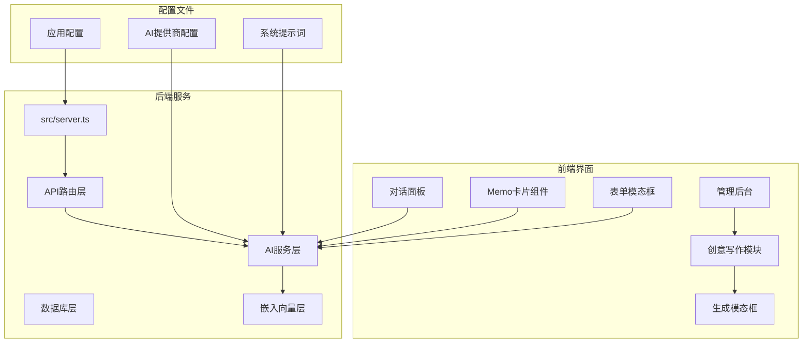
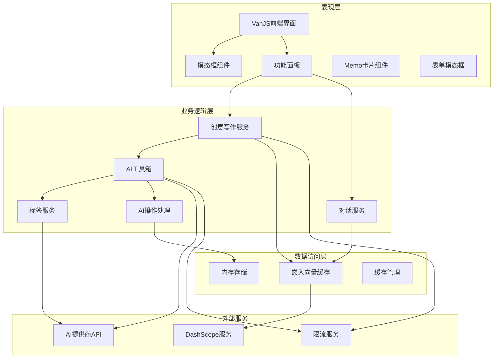
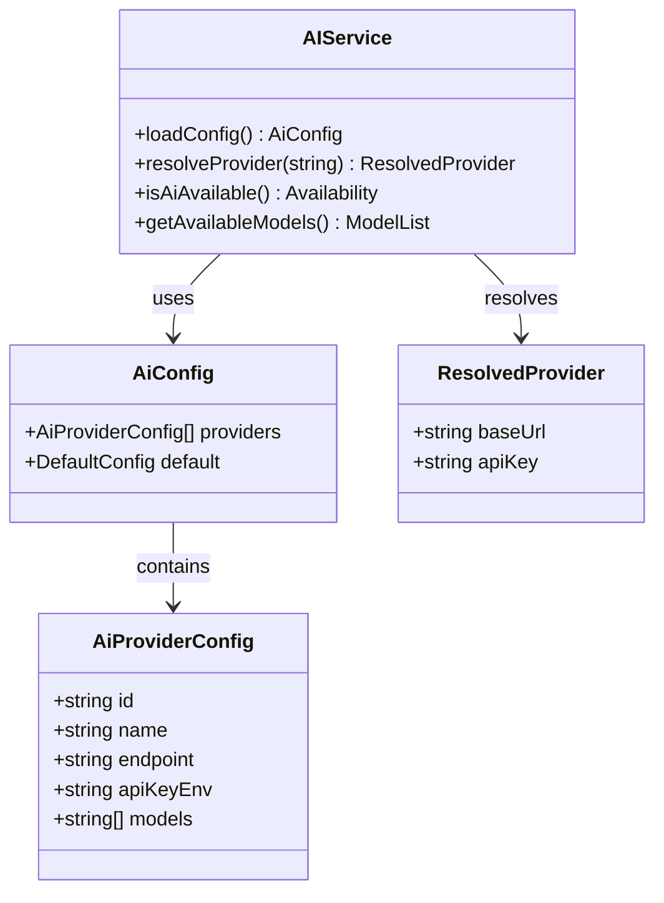
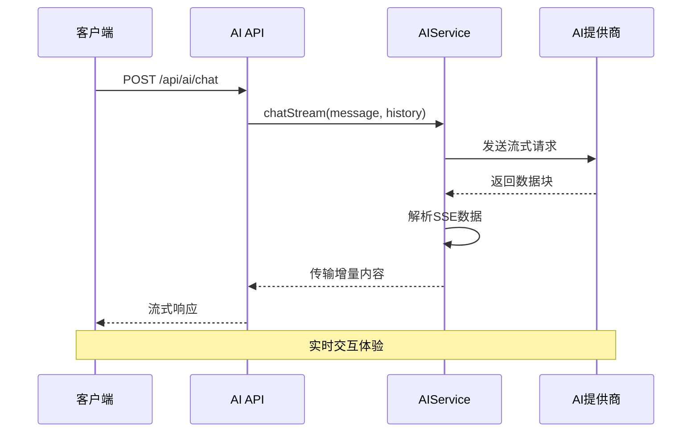
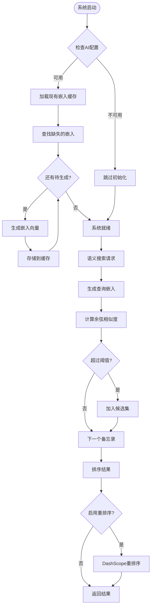
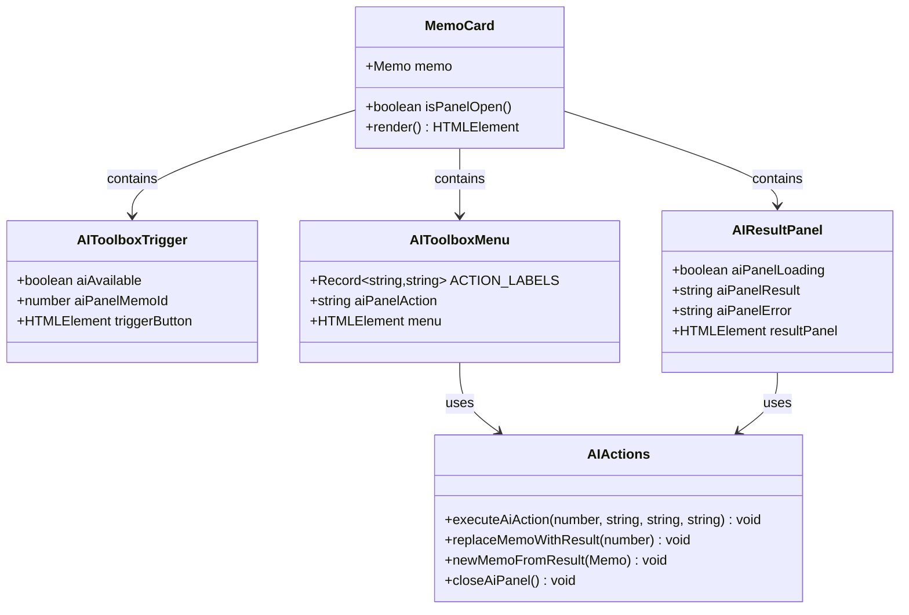
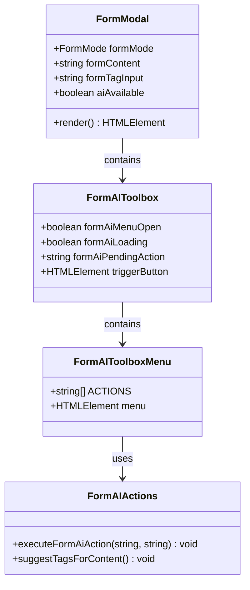
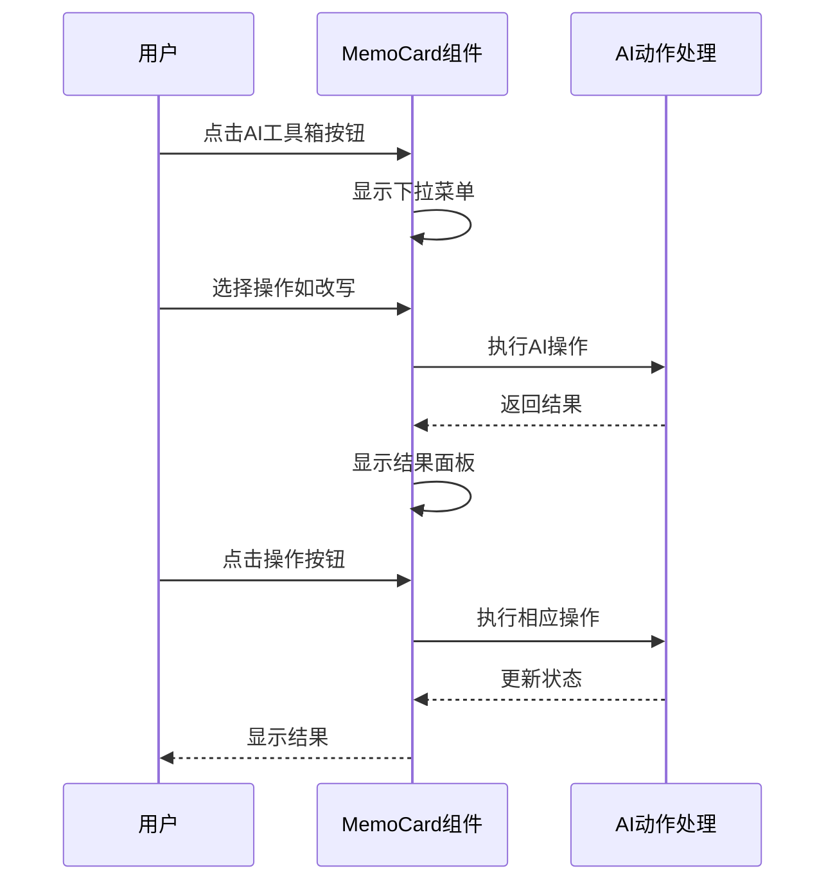
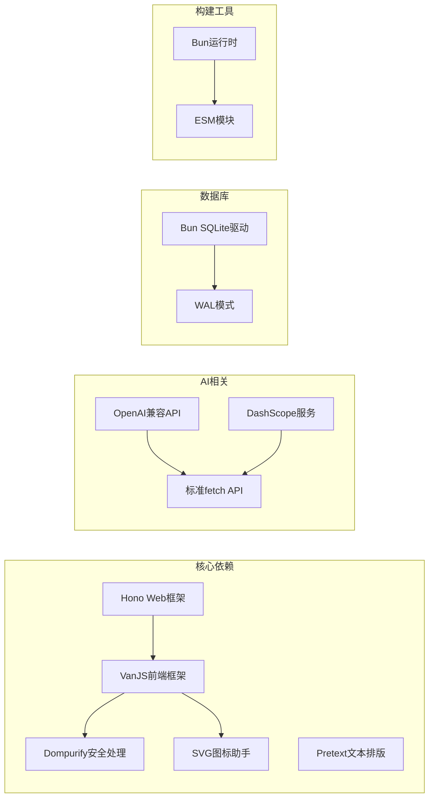

# AI写作工具箱设计规格

<cite>
**本文档引用的文件**
- [README.md](file://README.md)
- [package.json](file://package.json)
- [app.config.json](file://app.config.json)
- [ai.config.json](file://ai.config.json)
- [src/server.ts](file://src/server.ts)
- [src/api/ai.ts](file://src/api/ai.ts)
- [src/ai/service.ts](file://src/ai/service.ts)
- [src/ai/embeddings.ts](file://src/ai/embeddings.ts)
- [src/frontend/admin/components/GenerateModal.ts](file://src/frontend/admin/components/GenerateModal.ts)
- [src/frontend/admin/components/ChatPanel.ts](file://src/frontend/admin/components/ChatPanel.ts)
- [src/frontend/admin/components/MemoCard.ts](file://src/frontend/admin/components/MemoCard.ts)
- [src/frontend/admin/components/FormModal.ts](file://src/frontend/admin/components/FormModal.ts)
- [src/frontend/admin/creative.ts](file://src/frontend/admin/creative.ts)
- [src/frontend/admin/state.ts](file://src/frontend/admin/state.ts)
- [src/frontend/admin/ai-state.ts](file://src/frontend/admin/ai-state.ts)
- [src/frontend/shared/styles/common.css](file://src/frontend/shared/styles/common.css)
- [src/helper/svgHelper.ts](file://src/helper/svgHelper.ts)
- [data/system-prompts/creative.txt](file://data/system-prompts/creative.txt)
- [data/prompts/创意写作.txt](file://data/prompts/创意写作.txt)
</cite>

## 更新摘要
**变更内容**
- 更新了MemoCard组件的AI工具箱UI改进
- 新增了AI重写功能的四种写作风格选择器
- 增强了AI结果面板和操作按钮功能
- 完善了FormModal中的AI工具箱设计
- 更新了相关的状态管理和交互逻辑

## 目录
1. [简介](#简介)
2. [项目结构](#项目结构)
3. [核心组件](#核心组件)
4. [架构概览](#架构概览)
5. [详细组件分析](#详细组件分析)
6. [依赖关系分析](#依赖关系分析)
7. [性能考虑](#性能考虑)
8. [故障排除指南](#故障排除指南)
9. [结论](#结论)

## 简介

AI写作工具箱是基于Memos备忘录应用开发的一套智能写作辅助系统。该系统集成了多种AI模型提供商，提供了内容优化、标签建议、创意写作、对话式AI工作台等核心功能。系统采用前后端分离架构，后端基于Bun运行时和Hono框架，前端使用VanJS构建响应式管理界面。

该工具箱的主要目标是为用户提供智能化的写作辅助能力，包括但不限于：
- 多模型提供商支持（DeepSeek、Kimi、GLM、DashScope）
- 智能内容优化和改写
- 自动标签生成和管理
- 创意内容生成和上下文感知
- 对话式AI助手集成
- 语义搜索和内容关联

## 项目结构

项目采用模块化组织方式，主要分为以下几个核心部分：

**图表来源**
- [src/server.ts:1-125](file://src/server.ts#L1-L125)
- [src/api/ai.ts:1-297](file://src/api/ai.ts#L1-L297)
- [src/frontend/admin/creative.ts:1-349](file://src/frontend/admin/creative.ts#L1-L349)

**章节来源**
- [README.md:25-45](file://README.md#L25-L45)
- [package.json:1-28](file://package.json#L1-L28)

## 核心组件

### AI服务架构

AI写作工具箱的核心服务架构包含多个相互协作的组件：

#### 1. 多提供商AI集成
系统支持四个主要AI提供商，每个提供商都有独特的API端点和模型集合：

| 提供商 | ID | 主要模型 | API端点 |
|--------|----|----------|---------|
| DeepSeek | deepseek | deepseek-v4-pro, deepseek-v4-flash | https://api.deepseek.com/v1/chat/completions |
| Kimi | kimi | kimi-k2.5, kimi-k2.6 | https://api.moonshot.cn/v1/chat/completions |
| GLM | glm | glm-4.7, glm-4.7-flash, glm-5 | https://open.bigmodel.cn/api/paas/v4/chat/completions |
| DashScope | dashscope | 多种兼容模型 | https://dashscope.aliyuncs.com/compatible-mode/v1/chat/completions |

#### 2. 嵌入向量和语义搜索
系统实现了完整的向量嵌入和语义搜索功能：
- 使用DashScope的text-embedding-v3模型生成1024维向量
- 内存缓存机制提高查询性能
- 余弦相似度计算实现语义匹配
- 支持可选的rerank重排序功能

#### 3. 创意写作工作流
提供完整的创意内容生成流程：
- 上下文自动匹配和手动选择
- 多种生成模式（自动/手动）
- 实时流式输出显示
- 生成内容的存储和管理

#### 4. AI工具箱组件
**更新** 新增了统一的AI工具箱组件，提供以下功能：
- **触发按钮**：集成在每张memo卡片底部操作栏中的✨图标按钮
- **下拉菜单**：点击弹出操作列表（摘要、改写、扩写、要点提炼、润色）
- **改写风格选择**：选择改写后展开四种写作风格选择（专业/口语/极简/学术）
- **内联结果面板**：在当前卡片下方插入结果面板，含三个操作按钮
- **表单工具箱**：在编辑表单中提供相同的AI工具箱功能

**章节来源**
- [ai.config.json:1-44](file://ai.config.json#L1-L44)
- [src/ai/service.ts:23-75](file://src/ai/service.ts#L23-L75)
- [src/ai/embeddings.ts:13-64](file://src/ai/embeddings.ts#L13-L64)
- [src/frontend/admin/components/MemoCard.ts:142-266](file://src/frontend/admin/components/MemoCard.ts#L142-L266)
- [src/frontend/admin/components/FormModal.ts:104-222](file://src/frontend/admin/components/FormModal.ts#L104-L222)

## 架构概览

系统采用分层架构设计，确保各组件间的松耦合和高内聚：

**图表来源**
- [src/frontend/admin/creative.ts:218-349](file://src/frontend/admin/creative.ts#L218-L349)
- [src/api/ai.ts:21-297](file://src/api/ai.ts#L21-L297)
- [src/ai/service.ts:447-507](file://src/ai/service.ts#L447-L507)
- [src/frontend/admin/components/MemoCard.ts:139-345](file://src/frontend/admin/components/MemoCard.ts#L139-L345)

## 详细组件分析

### AI服务组件

#### 1. 多提供商配置管理

AI服务的核心是灵活的提供商配置系统：

**图表来源**
- [src/ai/service.ts:23-86](file://src/ai/service.ts#L23-L86)
- [src/ai/service.ts:98-128](file://src/ai/service.ts#L98-L128)

#### 2. 流式聊天处理

系统实现了高效的流式聊天处理机制：

**图表来源**
- [src/api/ai.ts:195-297](file://src/api/ai.ts#L195-L297)
- [src/ai/service.ts:480-506](file://src/ai/service.ts#L480-L506)

**章节来源**
- [src/ai/service.ts:177-245](file://src/ai/service.ts#L177-L245)
- [src/api/ai.ts:195-297](file://src/api/ai.ts#L195-L297)

### 嵌入向量和语义搜索

#### 1. 向量嵌入缓存系统

**图表来源**
- [src/ai/embeddings.ts:16-64](file://src/ai/embeddings.ts#L16-L64)
- [src/ai/embeddings.ts:95-154](file://src/ai/embeddings.ts#L95-L154)

#### 2. 语义搜索算法

系统实现了两阶段的语义搜索算法：

1. **嵌入向量召回**：使用余弦相似度计算，获取高于阈值的候选备忘录
2. **重排序优化**：使用DashScope的qwen3-rerank模型对候选进行重新排序

**章节来源**
- [src/ai/embeddings.ts:77-93](file://src/ai/embeddings.ts#L77-L93)
- [src/ai/embeddings.ts:117-150](file://src/ai/embeddings.ts#L117-L150)

### AI工具箱组件

#### 1. MemoCard组件的AI工具箱

**更新** MemoCard组件实现了全新的AI工具箱UI设计：

**图表来源**
- [src/frontend/admin/components/MemoCard.ts:61-345](file://src/frontend/admin/components/MemoCard.ts#L61-L345)
- [src/frontend/admin/actions/ai.ts:141-211](file://src/frontend/admin/actions/ai.ts#L141-L211)

#### 2. FormModal组件的AI工具箱

**更新** 表单模态框也实现了相同的AI工具箱设计：

**图表来源**
- [src/frontend/admin/components/FormModal.ts:22-281](file://src/frontend/admin/components/FormModal.ts#L22-L281)
- [src/frontend/admin/actions/ai.ts:215-236](file://src/frontend/admin/actions/ai.ts#L215-L236)

#### 3. 四种写作风格选择器

**新增** AI重写功能现在支持四种不同的写作风格：

| 风格类型 | 英文标识 | 中文描述 | 适用场景 |
|----------|----------|----------|----------|
| Professional | professional | 专业 | 学术论文、商务文档、正式报告 |
| Casual | casual | 口语 | 日常聊天、非正式写作、社交媒体内容 |
| Minimal | minimal | 极简 | 简洁表达、要点总结、快速笔记 |
| Academic | academic | 学术 | 学术研究、论文写作、专业术语 |

#### 4. AI结果面板增强

**更新** 结果面板现在包含完整的操作按钮组：

**图表来源**
- [src/frontend/admin/components/MemoCard.ts:270-342](file://src/frontend/admin/components/MemoCard.ts#L270-L342)
- [src/frontend/admin/actions/ai.ts:174-211](file://src/frontend/admin/actions/ai.ts#L174-L211)

**章节来源**
- [src/frontend/admin/components/MemoCard.ts:61-345](file://src/frontend/admin/components/MemoCard.ts#L61-L345)
- [src/frontend/admin/components/FormModal.ts:22-281](file://src/frontend/admin/components/FormModal.ts#L22-L281)
- [src/frontend/admin/actions/ai.ts:141-236](file://src/frontend/admin/actions/ai.ts#L141-L236)

### 配置管理系统

#### 1. 应用配置

系统配置采用JSON格式，支持运行时调整：

| 配置项 | 默认值 | 说明 |
|--------|--------|------|
| ai.requestTimeoutMs | 120000 | AI请求超时时间（毫秒） |
| ai.defaultMaxTokens | 2048 | 默认最大生成tokens |
| ai.defaultTemperature | 0.7 | 默认温度参数 |
| embeddings.similarityThreshold | 0.5 | 语义相似度阈值 |
| rerank.enabled | true | 是否启用重排序 |
| rerank.candidateTopN | 30 | 候选数量 |
| rerank.finalTopN | 10 | 最终结果数量 |

#### 2. AI提供商配置

每个提供商都有详细的配置信息：

| 字段 | 类型 | 描述 |
|------|------|-------|
| id | string | 提供商唯一标识符 |
| name | string | 提供商名称 |
| endpoint | string | API端点地址 |
| apiKeyEnv | string | 环境变量名 |
| models | string[] | 支持的模型列表 |

**章节来源**
- [app.config.json:1-22](file://app.config.json#L1-L22)
- [ai.config.json:1-44](file://ai.config.json#L1-L44)

## 依赖关系分析

系统的关键依赖关系如下：

**图表来源**
- [package.json:20-26](file://package.json#L20-L26)
- [src/server.ts:1-125](file://src/server.ts#L1-L125)
- [src/helper/svgHelper.ts:1-113](file://src/helper/svgHelper.ts#L1-L113)

**章节来源**
- [package.json:1-28](file://package.json#L1-L28)
- [src/server.ts:1-125](file://src/server.ts#L1-L125)

## 性能考虑

### 1. 缓存策略

系统实现了多层次的缓存机制：

- **嵌入向量缓存**：内存中存储所有备忘录的向量表示
- **配置缓存**：避免重复读取配置文件
- **响应缓存**：对频繁请求的结果进行缓存
- **UI状态缓存**：缓存AI工具箱的状态和用户选择

### 2. 流式处理

采用流式处理技术减少延迟：
- SSE（Server-Sent Events）实现实时响应
- 分块传输避免大响应阻塞
- 增量更新UI提升用户体验

### 3. 并发控制

- 限流机制防止API滥用
- 异常中断处理确保稳定性
- 超时控制避免长时间等待

### 4. UI渲染优化

**更新** 新的AI工具箱组件采用了更高效的渲染策略：
- 条件渲染减少DOM节点创建
- 状态驱动的UI更新
- 事件委托减少事件监听器数量

## 故障排除指南

### 常见问题及解决方案

#### 1. AI服务不可用

**症状**：调用AI接口返回503错误
**原因**：缺少必要的API密钥或配置不正确
**解决方法**：
- 检查对应的环境变量是否设置
- 验证AI提供商配置文件
- 确认网络连接正常

#### 2. 嵌入向量生成失败

**症状**：语义搜索功能异常
**原因**：DashScope API密钥问题或网络错误
**解决方法**：
- 验证DASHSCOPE_API_KEY环境变量
- 检查网络连接和防火墙设置
- 查看服务器日志获取详细错误信息

#### 3. 流式响应中断

**症状**：聊天对话中出现连接中断
**原因**：客户端断开连接或超时
**解决方法**：
- 检查客户端网络稳定性
- 调整requestTimeoutMs配置
- 实现客户端重连机制

#### 4. AI工具箱按钮不响应

**症状**：点击AI工具箱按钮无反应
**原因**：状态管理问题或事件绑定错误
**解决方法**：
- 检查aiPanelMemoId状态
- 验证事件处理器绑定
- 确认CSS样式未阻止点击事件

#### 5. 写作风格选择器无效

**症状**：改写操作无法应用特定风格
**原因**：style参数传递错误或后端不支持
**解决方法**：
- 验证style参数格式
- 检查后端AI服务支持的风格列表
- 确认API请求包含正确的style字段

**章节来源**
- [src/ai/service.ts:98-115](file://src/ai/service.ts#L98-L115)
- [src/ai/embeddings.ts:16-64](file://src/ai/embeddings.ts#L16-L64)
- [src/frontend/admin/components/MemoCard.ts:142-266](file://src/frontend/admin/components/MemoCard.ts#L142-L266)

## 结论

AI写作工具箱是一个功能完整、架构清晰的智能写作辅助系统。其主要特点包括：

1. **多提供商支持**：灵活的AI服务集成，支持多家主流AI提供商
2. **智能语义搜索**：基于向量嵌入的语义匹配和重排序机制
3. **实时交互体验**：流式处理提供接近实时的响应速度
4. **模块化设计**：清晰的组件分离便于维护和扩展
5. **性能优化**：多层缓存和并发控制确保系统稳定性
6. **统一的UI设计**：全新的AI工具箱组件提供一致的用户体验
7. **丰富的写作风格**：四种写作风格满足不同场景需求
8. **完善的操作功能**：完整的AI结果处理和管理功能

**更新** 最新的UI改进显著提升了用户体验：
- **集成化设计**：AI工具箱按钮与现有操作按钮统一设计
- **直观的菜单**：清晰的操作选项和风格选择
- **增强的结果面板**：提供完整的操作按钮组
- **一致的交互**：MemoCard和FormModal组件保持相同的用户体验

该系统为用户提供了一个强大而易用的AI写作平台，能够显著提升内容创作效率和质量。通过合理的架构设计和配置管理，系统具备了良好的可扩展性和维护性，为未来的功能扩展奠定了坚实基础。