# 备忘录固定功能设计规格

<cite>
**本文档引用的文件**
- [2026-05-23-memo-pin-feature-design.md](file://docs/superpowers/specs/2026-05-23-memo-pin-feature-design.md)
- [memos.ts](file://src/api/memos.ts)
- [model.ts](file://src/model.ts)
- [MemoCard.ts](file://src/frontend/admin/components/MemoCard.ts)
- [memo.ts](file://src/frontend/admin/actions/memo.ts)
- [db.ts](file://src/db.ts)
- [svgHelper.ts](file://src/helper/svgHelper.ts)
- [index.ts](file://src/frontend/masonry/index.ts)
- [components.ts](file://src/frontend/masonry/components.ts)
- [state.ts](file://src/frontend/masonry/state.ts)
- [api.ts](file://src/frontend/masonry/api.ts)
- [README.md](file://README.md)
- [common.css](file://src/frontend/shared/styles/common.css)
- [index.html](file://src/frontend/admin/index.html)
- [app.ts](file://src/frontend/admin/app.ts)
</cite>

## 更新摘要
**变更内容**
- 更新了MemoCard组件的UI改进部分，反映了置顶状态显示的样式优化
- 增强了视觉呈现的描述，包括颜色方案和图标使用
- 完善了按钮状态的颜色变化机制说明

## 目录
1. [简介](#简介)
2. [项目结构概览](#项目结构概览)
3. [核心组件分析](#核心组件分析)
4. [架构设计](#架构设计)
5. [详细组件分析](#详细组件分析)
6. [数据库设计](#数据库设计)
7. [API 设计](#api-设计)
8. [前端实现](#前端实现)
9. [排序算法](#排序算法)
10. [性能考虑](#性能考虑)
11. [故障排除指南](#故障排除指南)
12. [总结](#总结)

## 简介

备忘录固定功能为 Memos 备忘录系统增加了置顶（Pin）能力，允许管理员将重要的备忘录置顶，使其在列表顶部优先显示。该功能在 Admin 后台和瀑布流公开页均生效，提供直观的状态标记和便捷的操作按钮。最新的UI改进增强了置顶状态的视觉表现，使用橙色主题和📌图标来提供更清晰的用户反馈。

## 项目结构概览

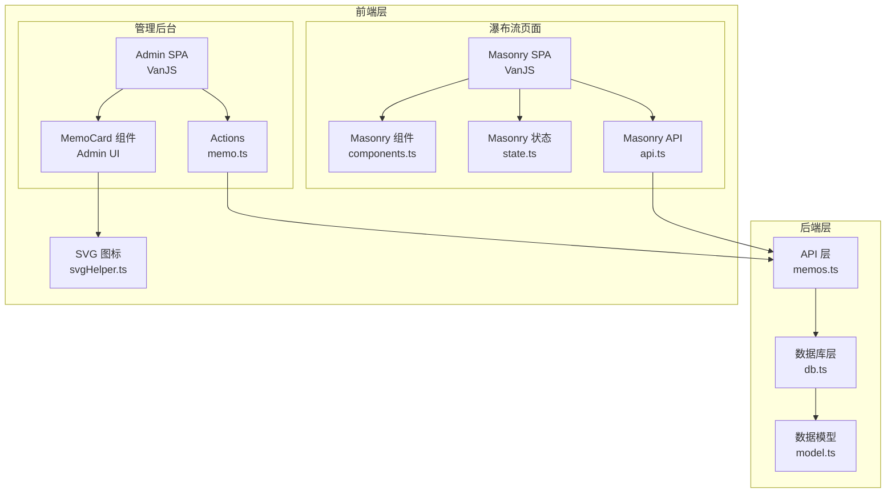

**图表来源**
- [memos.ts:1-220](file://src/api/memos.ts#L1-L220)
- [db.ts:1-479](file://src/db.ts#L1-L479)
- [MemoCard.ts:1-346](file://src/frontend/admin/components/MemoCard.ts#L1-L346)
- [components.ts:1-337](file://src/frontend/masonry/components.ts#L1-L337)

## 核心组件分析

### 数据模型扩展

备忘录数据模型新增了 `pinned_at` 字段，用于存储置顶时间戳：

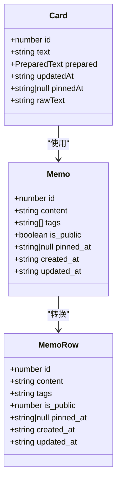

**图表来源**
- [model.ts:1-35](file://src/model.ts#L1-L35)
- [db.ts:64-120](file://src/db.ts#L64-L120)
- [state.ts:13-20](file://src/frontend/masonry/state.ts#L13-L20)

**章节来源**
- [model.ts:1-35](file://src/model.ts#L1-L35)
- [db.ts:64-120](file://src/db.ts#L64-L120)
- [state.ts:13-20](file://src/frontend/masonry/state.ts#L13-L20)

## 架构设计

备忘录固定功能采用分层架构设计，确保前后端分离和数据一致性：

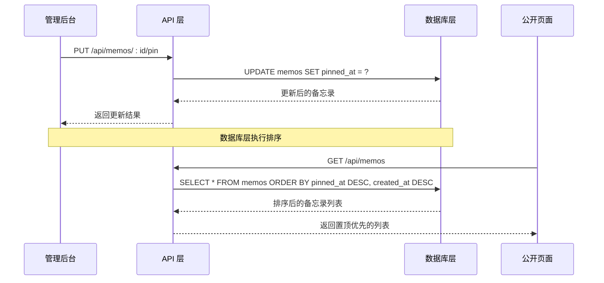

**图表来源**
- [memos.ts:201-220](file://src/api/memos.ts#L201-L220)
- [db.ts:161-164](file://src/db.ts#L161-L164)

## 详细组件分析

### 管理后台实现

管理后台的 MemoCard 组件提供了完整的置顶功能，最新的UI改进包括：

#### 置顶状态标记的视觉优化

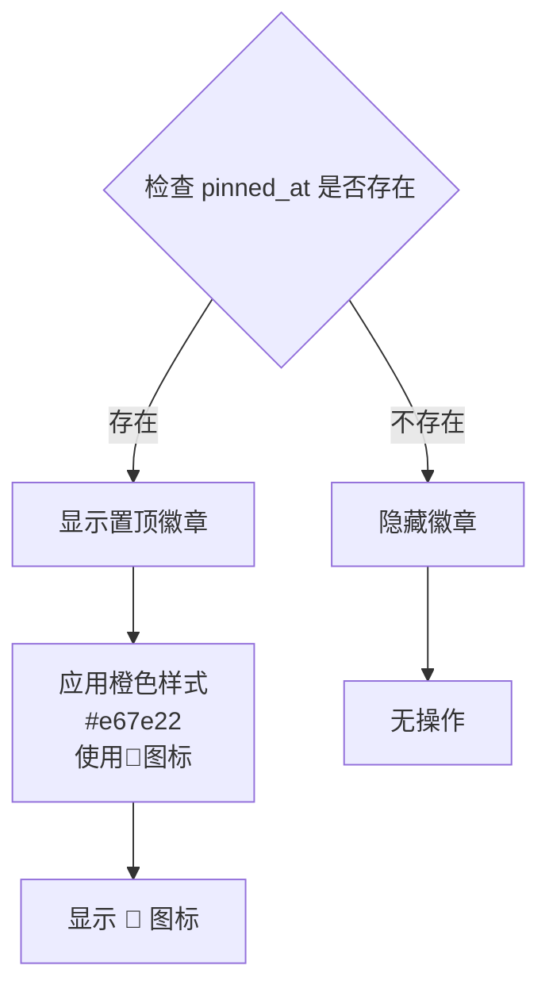

**更新** 置顶状态标记现在使用更醒目的橙色主题（#e67e22）和📌图标，提供更好的视觉识别效果。

#### 按钮状态的颜色变化机制

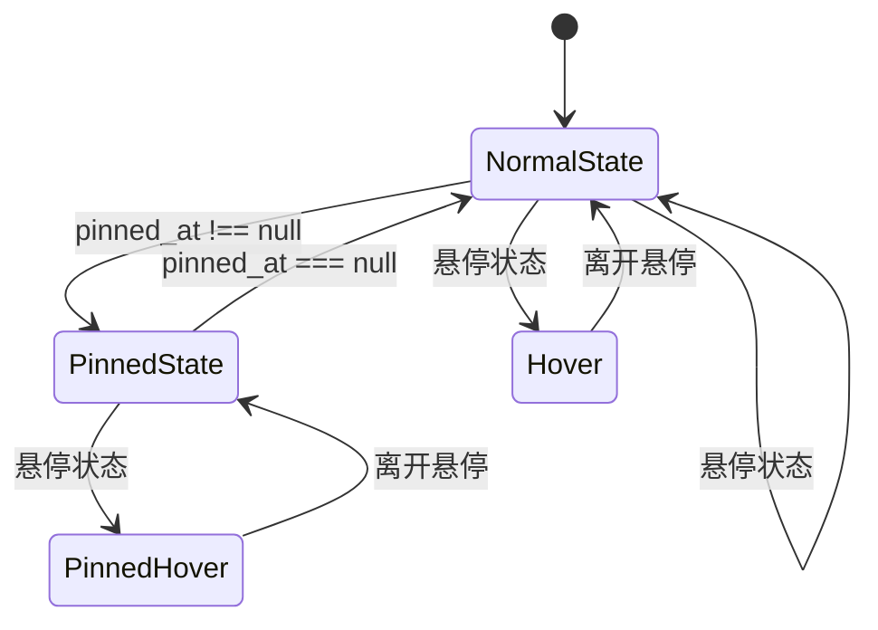

**更新** 当备忘录被置顶时，操作按钮会自动切换到橙色主题（#e67e22），提供即时的视觉反馈。

**章节来源**
- [MemoCard.ts:78-86](file://src/frontend/admin/components/MemoCard.ts#L78-L86)
- [MemoCard.ts:110-115](file://src/frontend/admin/components/MemoCard.ts#L110-L115)
- [index.html:543-553](file://src/frontend/admin/index.html#L543-L553)

### 瀑布流公开页实现

瀑布流公开页实现了只读的置顶状态显示：

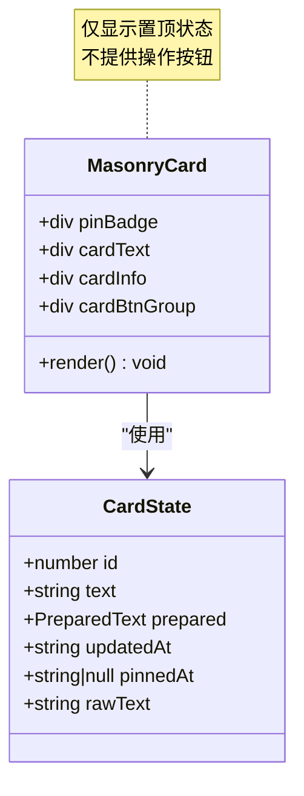

**章节来源**
- [components.ts:142-151](file://src/frontend/masonry/components.ts#L142-L151)
- [state.ts:13-20](file://src/frontend/masonry/state.ts#L13-L20)

## 数据库设计

### 表结构扩展

数据库采用了最小侵入式的迁移策略，在现有 memos 表中新增 pinned_at 列：

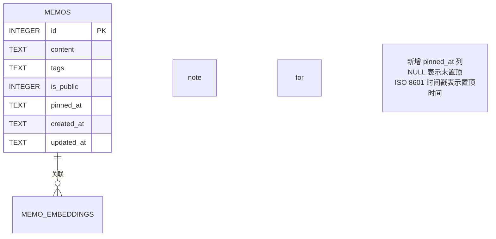

**图表来源**
- [db.ts:18-28](file://src/db.ts#L18-L28)
- [db.ts:64-72](file://src/db.ts#L64-L72)

### 索引优化

为了提升查询性能，为 pinned_at 列建立了专门索引：

**章节来源**
- [db.ts:30-30](file://src/db.ts#L30-L30)

## API 设计

### 新增端点

系统新增了独立的置顶操作端点：

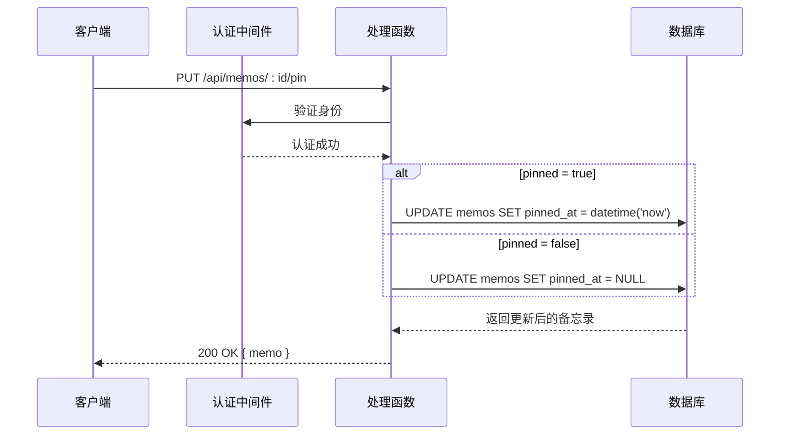

**图表来源**
- [memos.ts:201-220](file://src/api/memos.ts#L201-L220)
- [db.ts:236-244](file://src/db.ts#L236-L244)

### 错误处理

API 层实现了完善的错误处理机制：

| 错误场景 | HTTP 状态码 | 响应内容 | 处理方式 |
|---------|------------|---------|---------|
| 无效 JSON | 400 | `{ error: "Invalid JSON" }` | 前端显示格式错误 |
| 缺少 pinned 参数 | 400 | `{ error: "pinned must be a boolean" }` | 前端验证参数类型 |
| 备忘录不存在 | 404 | `{ error: "Memo not found" }` | 前端提示操作失败 |
| 未认证访问 | 401 | 重定向到登录页 | 使用现有认证中间件 |

**章节来源**
- [memos.ts:201-220](file://src/api/memos.ts#L201-L220)

## 前端实现

### SVG 图标系统

新增了专门的图钉图标，与现有图标风格保持一致：

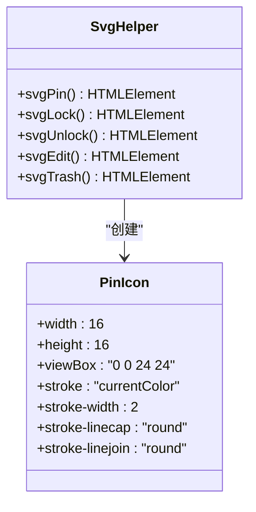

**图表来源**
- [svgHelper.ts:48-52](file://src/helper/svgHelper.ts#L48-L52)

### 状态管理

管理后台使用 VanJS 的响应式状态系统管理置顶状态：

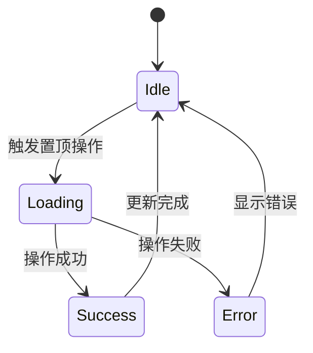

**章节来源**
- [memo.ts:82-92](file://src/frontend/admin/actions/memo.ts#L82-L92)
- [svgHelper.ts:48-52](file://src/helper/svgHelper.ts#L48-L52)

### UI 样式优化

最新的UI改进包括：

#### 置顶状态徽章样式
- **颜色方案**：使用橙色主题（#e67e22）确保高对比度
- **图标集成**：📌 图标与文字并用，提供直观的视觉标识
- **布局优化**：紧凑的间距设计（4px底部间距）

#### 按钮状态样式
- **正常状态**：浅灰色边框和背景
- **悬停状态**：蓝色主题（#3b82f6）的交互反馈
- **置顶状态**：橙色主题（#e67e22）的置顶标识
- **置顶悬停**：更深的橙色（#d35400）增强视觉反馈

**章节来源**
- [index.html:543-553](file://src/frontend/admin/index.html#L543-L553)
- [MemoCard.ts:78-86](file://src/frontend/admin/components/MemoCard.ts#L78-L86)

## 排序算法

### 多级排序逻辑

系统实现了复杂的多级排序算法，确保置顶备忘录始终优先显示：

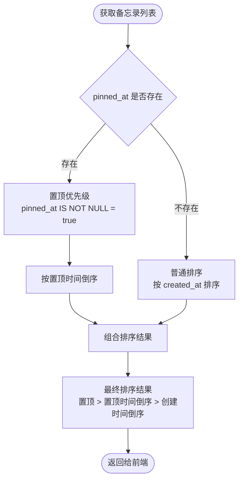

**图表来源**
- [db.ts:161-161](file://src/db.ts#L161-L161)

### SQL 排序实现

排序逻辑通过单一 SQL 查询实现，避免了客户端排序的性能问题：

**章节来源**
- [db.ts:161-164](file://src/db.ts#L161-L164)

## 性能考虑

### 数据库优化

1. **索引优化**：为 pinned_at 列建立索引，提升排序查询性能
2. **单一查询**：通过 ORDER BY 子句实现复杂排序，减少往返次数
3. **内存效率**：使用 SQLite 的 WAL 模式，提升并发性能

### 前端优化

1. **响应式更新**：使用 VanJS 的响应式系统，只更新受影响的组件
2. **缓存策略**：瀑布流页面使用文本预排版缓存，提升渲染性能
3. **懒加载**：瀑布流采用虚拟滚动，只渲染可视区域内的卡片

## 故障排除指南

### 常见问题

| 问题描述 | 可能原因 | 解决方案 |
|---------|---------|---------|
| 置顶状态不显示 | 数据库迁移未完成 | 检查 pinned_at 列是否存在 |
| 置顶操作失败 | 权限不足 | 确认管理员身份认证 |
| 排序异常 | SQL 查询错误 | 检查 ORDER BY 语法 |
| 前端不更新 | 状态未刷新 | 调用 loadMemos() 重新加载 |
| UI 样式异常 | CSS 样式冲突 | 检查自定义样式覆盖 |

### 调试建议

1. **后端调试**：检查 API 日志和数据库查询
2. **前端调试**：使用浏览器开发者工具监控网络请求和样式应用
3. **数据库调试**：直接查询 memos 表验证数据状态

**章节来源**
- [memos.ts:201-220](file://src/api/memos.ts#L201-L220)
- [db.ts:161-164](file://src/db.ts#L161-L164)

## 总结

备忘录固定功能通过精心设计的架构实现了以下目标：

### 功能特性
- **统一状态管理**：Admin 后台和公开页面共享相同的置顶状态
- **直观的用户界面**：清晰的状态标记和便捷的操作按钮
- **高性能实现**：通过数据库层面的排序优化，确保良好的用户体验
- **优秀的视觉设计**：橙色主题和📌图标提供清晰的视觉反馈

### 技术优势
- **最小侵入性**：仅新增一列，不影响现有功能
- **向后兼容**：新功能不影响现有数据和 API
- **可扩展性**：为未来可能的功能增强预留空间
- **视觉一致性**：与整体设计语言保持一致的风格

### 用户体验
- **即时反馈**：置顶操作后立即反映在界面上
- **一致性**：Admin 后台和公开页面的行为完全一致
- **易用性**：简洁的图标和明确的视觉层次
- **可发现性**：橙色主题确保置顶状态的高可见性

### UI 改进亮点
- **颜色心理学**：使用橙色（#e67e22）传达重要性和活跃状态
- **图标辅助**：📌 图标提供跨文化的视觉识别
- **状态对比**：置顶状态与普通状态形成清晰的视觉差异
- **交互反馈**：按钮状态的颜色变化提供即时的操作确认

该设计规格文档为备忘录固定功能的实现提供了完整的技术指导，确保功能的正确性和可维护性。最新的UI改进进一步提升了用户体验，使置顶功能更加直观和易于使用。