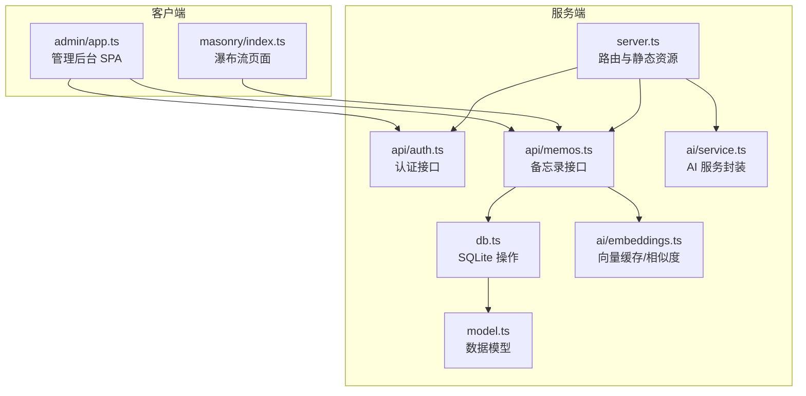
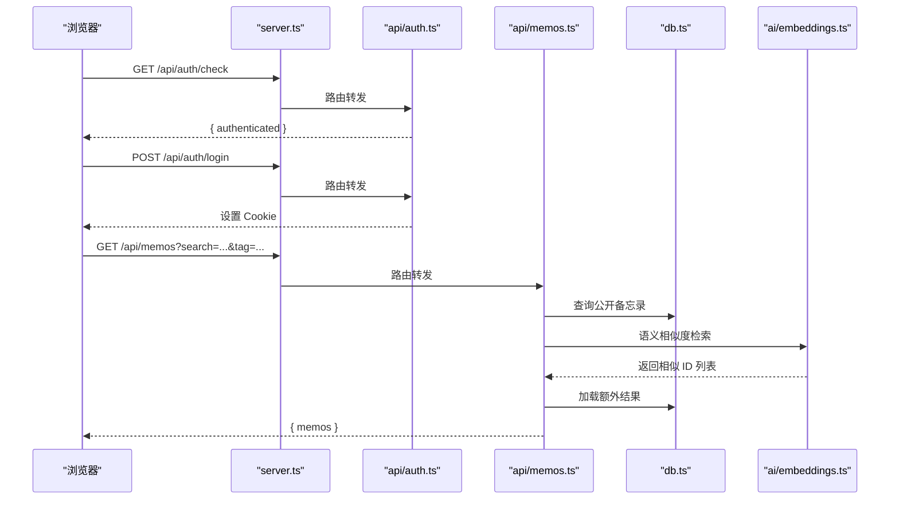
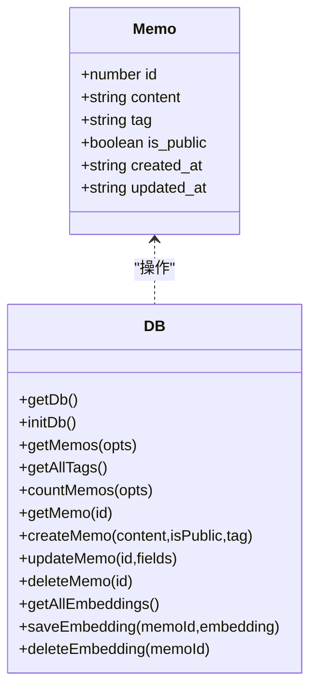
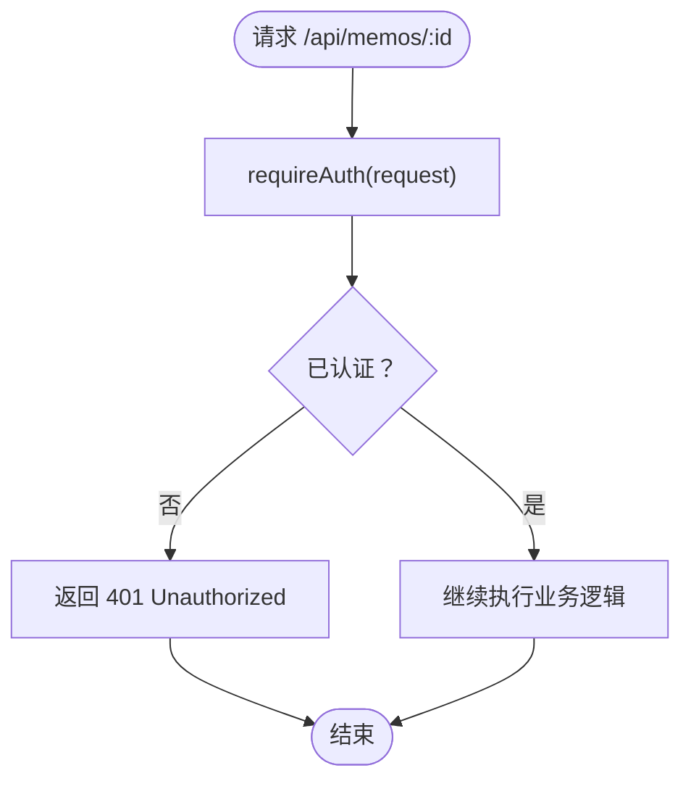
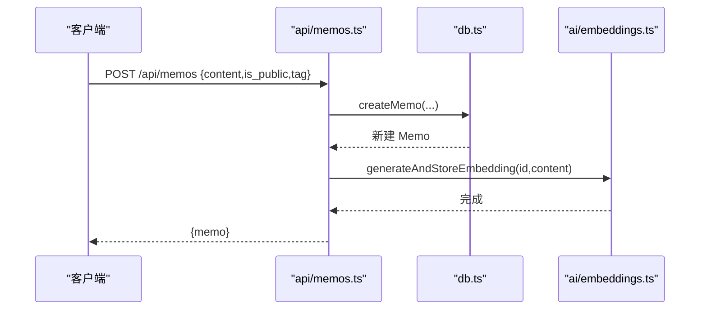
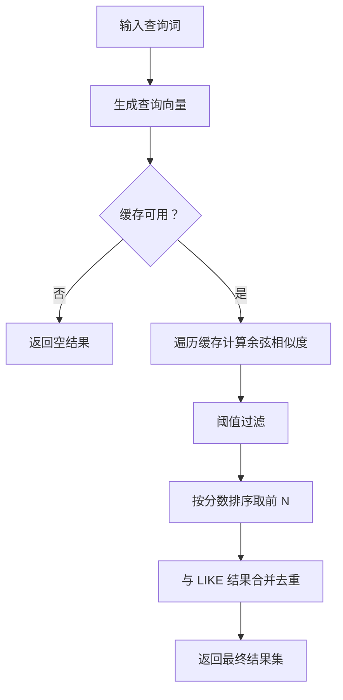
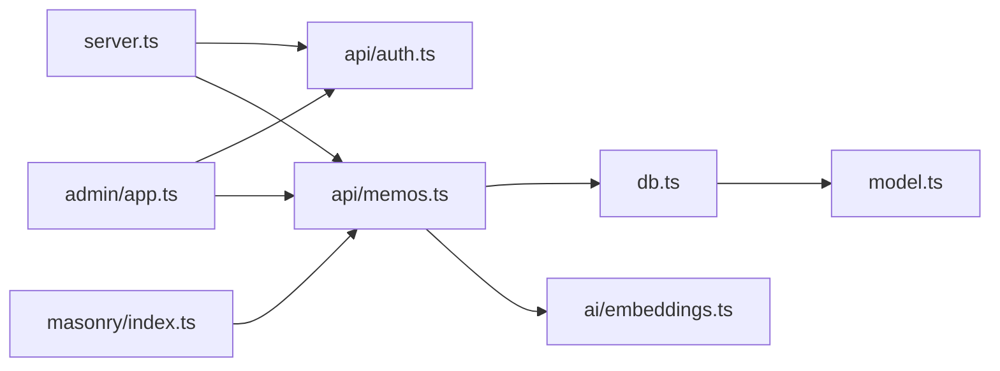

# 备忘录管理

<cite>
**本文引用的文件**
- [README.md](file://README.md)
- [package.json](file://package.json)
- [src/server.ts](file://src/server.ts)
- [src/model.ts](file://src/model.ts)
- [src/db.ts](file://src/db.ts)
- [src/auth.ts](file://src/auth.ts)
- [src/api/auth.ts](file://src/api/auth.ts)
- [src/api/memos.ts](file://src/api/memos.ts)
- [src/ai/embeddings.ts](file://src/ai/embeddings.ts)
- [src/ai/service.ts](file://src/ai/service.ts)
- [src/masonry/index.ts](file://src/masonry/index.ts)
- [src/admin/app.ts](file://src/admin/app.ts)
</cite>

## 目录
1. [简介](#简介)
2. [项目结构](#项目结构)
3. [核心组件](#核心组件)
4. [架构总览](#架构总览)
5. [详细组件分析](#详细组件分析)
6. [依赖关系分析](#依赖关系分析)
7. [性能考量](#性能考量)
8. [故障排查指南](#故障排查指南)
9. [结论](#结论)
10. [附录](#附录)

## 简介
本项目是一个基于 Bun 运行时的轻量级备忘录应用，提供备忘录的创建、读取、更新、删除（CRUD）能力；支持公开与私密两种可见性；内置标签分类；提供全文搜索与语义搜索融合的检索体验；首页采用瀑布流布局，管理后台为 SPA。系统以 SQLite 作为数据存储，使用 Hono 作为 Web 框架，前端分别采用 Pretext（文字排版）与 VanJS（响应式 UI）。

## 项目结构
- 顶层配置与说明：README.md、package.json
- 服务端入口与路由：src/server.ts
- 数据模型与数据库：src/model.ts、src/db.ts
- 认证模块：src/auth.ts、src/api/auth.ts
- 备忘录 API：src/api/memos.ts
- AI 与嵌入：src/ai/embeddings.ts、src/ai/service.ts
- 前端瀑布流：src/masonry/index.ts
- 管理后台 SPA：src/admin/app.ts

图表来源
- [src/server.ts:74-127](file://src/server.ts#L74-L127)
- [src/api/auth.ts:25-69](file://src/api/auth.ts#L25-L69)
- [src/api/memos.ts:18-140](file://src/api/memos.ts#L18-L140)
- [src/db.ts:15-57](file://src/db.ts#L15-L57)
- [src/ai/embeddings.ts:1-99](file://src/ai/embeddings.ts#L1-L99)
- [src/ai/service.ts:1-289](file://src/ai/service.ts#L1-L289)
- [src/masonry/index.ts:307-351](file://src/masonry/index.ts#L307-L351)
- [src/admin/app.ts:37-87](file://src/admin/app.ts#L37-L87)

章节来源
- [README.md:25-45](file://README.md#L25-L45)
- [package.json:1-22](file://package.json#L1-L22)

## 核心组件
- 数据模型：Memo、Prompt、CreativeItem
- 数据库层：表结构、CRUD、统计、标签查询、嵌入管理
- 认证层：Cookie + 内存 Session、登录/登出、中间件
- API 层：认证 API、备忘录 API（含搜索与语义融合）
- AI 层：嵌入生成与缓存、相似度计算、内容优化与标签建议
- 前端：瀑布流页面与管理后台 SPA

章节来源
- [src/model.ts:1-28](file://src/model.ts#L1-L28)
- [src/db.ts:15-193](file://src/db.ts#L15-L193)
- [src/auth.ts:1-108](file://src/auth.ts#L1-L108)
- [src/api/memos.ts:18-140](file://src/api/memos.ts#L18-L140)
- [src/ai/embeddings.ts:1-99](file://src/ai/embeddings.ts#L1-L99)
- [src/ai/service.ts:12-289](file://src/ai/service.ts#L12-L289)
- [src/masonry/index.ts:307-351](file://src/masonry/index.ts#L307-L351)
- [src/admin/app.ts:37-87](file://src/admin/app.ts#L37-L87)

## 架构总览
系统采用“服务端路由 + 子应用挂载”的组织方式，API 路由按功能拆分，数据库与 AI 能力通过模块化封装提供给 API 使用。前端瀑布流与管理后台通过 API 交互，实现数据驱动的 UI。

图表来源
- [src/server.ts:74-81](file://src/server.ts#L74-L81)
- [src/api/auth.ts:27-60](file://src/api/auth.ts#L27-L60)
- [src/api/memos.ts:20-48](file://src/api/memos.ts#L20-L48)
- [src/db.ts:99-131](file://src/db.ts#L99-L131)
- [src/ai/embeddings.ts:66-86](file://src/ai/embeddings.ts#L66-L86)

## 详细组件分析

### 数据模型与数据库层
- 数据模型：Memo（id、content、tag、is_public、created_at、updated_at）、Prompt、CreativeItem
- 数据库初始化：memos 表、memo_embeddings 表、prompts 表、creative 表
- 查询与过滤：支持按是否公开、按 ID 列表、按关键词 LIKE、按标签精确匹配
- 统计与标签：统计总数、获取所有非空标签
- 嵌入管理：加载、保存、删除向量缓存
- CRUD：创建、读取、更新、删除备忘录

图表来源
- [src/model.ts:1-8](file://src/model.ts#L1-L8)
- [src/db.ts:15-193](file://src/db.ts#L15-L193)

章节来源
- [src/model.ts:1-28](file://src/model.ts#L1-L28)
- [src/db.ts:15-193](file://src/db.ts#L15-L193)

### 认证与权限控制
- Cookie + 内存 Session：会话令牌存储在内存集合中，设置 HttpOnly + SameSite=Strict 的安全 Cookie
- 登录密钥：通过环境变量 MEMOS_SECRET_KEY 控制，默认开发环境警告，生产环境必须设置
- 登录频率限制：每 IP 最多 5 次失败尝试，冷却 1 分钟
- 中间件：requireAuth 返回 401 或放行；authMiddleware 在未认证时直接返回 401

图表来源
- [src/auth.ts:92-108](file://src/auth.ts#L92-L108)

章节来源
- [src/auth.ts:1-108](file://src/auth.ts#L1-L108)
- [src/api/auth.ts:14-69](file://src/api/auth.ts#L14-L69)

### 备忘录 API（CRUD 与搜索）
- GET /api/memos：支持查询参数 search、tag、all（需认证才可查看私密）
- GET /api/memos/count：统计公开或全部备忘录数量
- GET /api/memos/tags：获取所有非空标签
- POST /api/memos：创建备忘录，异步生成并缓存嵌入
- PUT /api/memos/:id：更新备忘录，若内容变更则重新生成嵌入
- DELETE /api/memos/:id：删除备忘录，清理嵌入缓存

图表来源
- [src/api/memos.ts:63-92](file://src/api/memos.ts#L63-L92)
- [src/db.ts:156-167](file://src/db.ts#L156-L167)
- [src/ai/embeddings.ts:88-99](file://src/ai/embeddings.ts#L88-L99)

章节来源
- [src/api/memos.ts:18-140](file://src/api/memos.ts#L18-L140)
- [src/db.ts:99-193](file://src/db.ts#L99-L193)

### 可见性控制与权限验证
- 公开与私密：is_public 字段控制；默认公开
- 查询策略：当 all=true 且来自 requireAuth 的返回为空（即已认证）时，包含私密备忘录
- 写操作：均需认证（authMiddleware），未认证返回 401

章节来源
- [src/api/memos.ts:20-48](file://src/api/memos.ts#L20-L48)
- [src/auth.ts:92-108](file://src/auth.ts#L92-L108)

### 标签系统设计与实现
- 标签存储：字段 tag，支持空字符串
- 标签获取：getAllTags 返回去重后的非空标签列表
- 标签筛选：GET /api/memos 支持 tag=xxx 精确匹配
- 标签建议：AI 提供 suggestTags，前端可展示建议并选择

章节来源
- [src/db.ts:133-139](file://src/db.ts#L133-L139)
- [src/api/memos.ts:57-61](file://src/api/memos.ts#L57-L61)
- [src/ai/service.ts:94-137](file://src/ai/service.ts#L94-L137)
- [src/admin/app.ts:171-190](file://src/admin/app.ts#L171-L190)

### 搜索功能：关键词搜索与语义搜索融合
- 关键词搜索：LIKE %search% 查询 content 字段
- 语义搜索：向量缓存 + 余弦相似度，阈值过滤，返回相似 memo_id 列表
- 融合策略：先执行 LIKE 结果，再异步获取语义相似结果并合并，避免阻塞主流程

图表来源
- [src/ai/embeddings.ts:66-86](file://src/ai/embeddings.ts#L66-L86)
- [src/api/memos.ts:30-45](file://src/api/memos.ts#L30-L45)

章节来源
- [src/api/memos.ts:20-48](file://src/api/memos.ts#L20-L48)
- [src/ai/embeddings.ts:12-35](file://src/ai/embeddings.ts#L12-L35)

### 前端集成与使用场景
- 瀑布流页面：加载标签、统计数量、按搜索词与标签筛选，URL 同步参数
- 管理后台：登录认证、创建/编辑/切换可见性/删除备忘录、AI 优化与标签建议

章节来源
- [src/masonry/index.ts:272-351](file://src/masonry/index.ts#L272-L351)
- [src/admin/app.ts:37-87](file://src/admin/app.ts#L37-L87)

## 依赖关系分析
- 服务端路由：server.ts 挂载子应用与静态资源
- API 依赖：memos.ts 依赖 db.ts 与 ai/embeddings.ts；auth.ts 提供认证能力
- 前端依赖：masonry/index.ts 与 admin/app.ts 通过 /api/* 与后端通信

图表来源
- [src/server.ts:74-127](file://src/server.ts#L74-L127)
- [src/api/memos.ts:18-17](file://src/api/memos.ts#L18-L17)
- [src/db.ts:15-57](file://src/db.ts#L15-L57)
- [src/ai/embeddings.ts:1-99](file://src/ai/embeddings.ts#L1-L99)
- [src/masonry/index.ts:307-351](file://src/masonry/index.ts#L307-L351)
- [src/admin/app.ts:37-87](file://src/admin/app.ts#L37-L87)

章节来源
- [src/server.ts:74-127](file://src/server.ts#L74-L127)

## 性能考量
- 嵌入缓存：内存中维护 memo_id → Float32Array 映射，启动时从数据库加载，减少重复计算
- 异步生成：创建/更新备忘录时采用 fire-and-forget 方式生成嵌入，不阻塞主流程
- 语义搜索：阈值过滤与上限限制，避免全表扫描
- 前端瀑布流：虚拟滚动只渲染可视区域卡片，滚动事件节流，URL 同步减少重复请求
- 构建缓存：客户端 JS 按文件 mtime 缓存，避免重复构建

章节来源
- [src/ai/embeddings.ts:12-35](file://src/ai/embeddings.ts#L12-L35)
- [src/ai/embeddings.ts:88-99](file://src/ai/embeddings.ts#L88-L99)
- [src/masonry/index.ts:217-269](file://src/masonry/index.ts#L217-L269)
- [src/server.ts:15-51](file://src/server.ts#L15-L51)

## 故障排查指南
- 认证失败
  - 确认已调用 /api/auth/login 并正确携带 Cookie
  - 检查 MEMOS_SECRET_KEY 是否设置，生产环境必须设置
  - 查看登录频率限制，避免频繁失败导致冷却
- 404 未找到
  - 检查 memo id 是否存在
  - 确认查询参数拼写（search、tag、all）
- 语义搜索无效
  - 确认 DASHSCOPE_API_KEY 已配置，且向量维度一致
  - 检查嵌入缓存是否加载成功（启动日志）
- 前端无法加载
  - 确认 /api/memos 与 /api/memos/tags 能正常返回
  - 检查网络代理与跨域设置

章节来源
- [src/api/auth.ts:14-69](file://src/api/auth.ts#L14-L69)
- [src/ai/embeddings.ts:12-35](file://src/ai/embeddings.ts#L12-L35)
- [src/masonry/index.ts:307-351](file://src/masonry/index.ts#L307-L351)

## 结论
本系统以简洁的模块划分实现了完整的备忘录管理能力：清晰的 CRUD 流程、灵活的可见性控制、实用的标签体系、以及关键词与语义搜索的融合。前端瀑布流与管理后台提供了良好的用户体验。通过嵌入缓存与异步处理，系统在保证功能完整性的同时兼顾了性能与可扩展性。

## 附录

### API 接口定义

- 认证
  - GET /api/auth/check：检查当前登录状态
  - POST /api/auth/login：登录，Body: { key: "secret" }
  - POST /api/auth/logout：登出，清除 Cookie

- 备忘录
  - GET /api/memos：获取备忘录列表
    - 查询参数：search（关键词 LIKE）、tag（标签精确匹配）、all（设为 "true" 时返回包含私密备忘录，需认证）
  - GET /api/memos/count：统计备忘录数量（需认证）
  - GET /api/memos/tags：获取所有标签
  - POST /api/memos：创建备忘录（需认证）
    - Body: { content: string, is_public?: boolean, tag?: string }
  - PUT /api/memos/:id：更新备忘录（需认证）
    - Body: { content?: string, is_public?: boolean, tag?: string }
  - DELETE /api/memos/:id：删除备忘录（需认证）

- AI（可选）
  - GET /api/ai/status：检查 AI 可用性
  - POST /api/ai/optimize：内容优化
  - POST /api/ai/suggest-tags：标签建议

章节来源
- [README.md:100-177](file://README.md#L100-L177)
- [src/api/memos.ts:18-140](file://src/api/memos.ts#L18-L140)
- [src/api/auth.ts:27-69](file://src/api/auth.ts#L27-L69)
- [src/ai/service.ts:12-289](file://src/ai/service.ts#L12-L289)