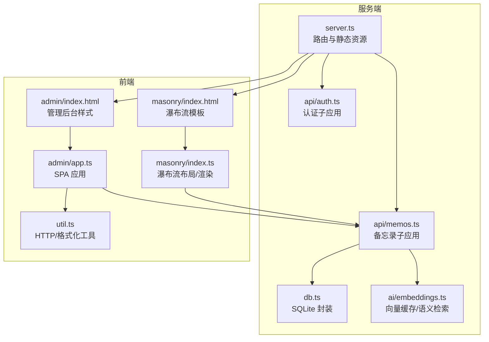
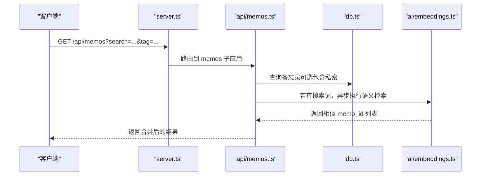
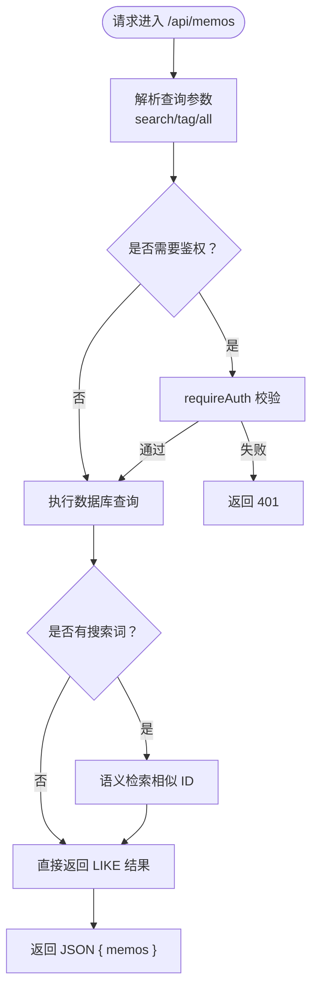
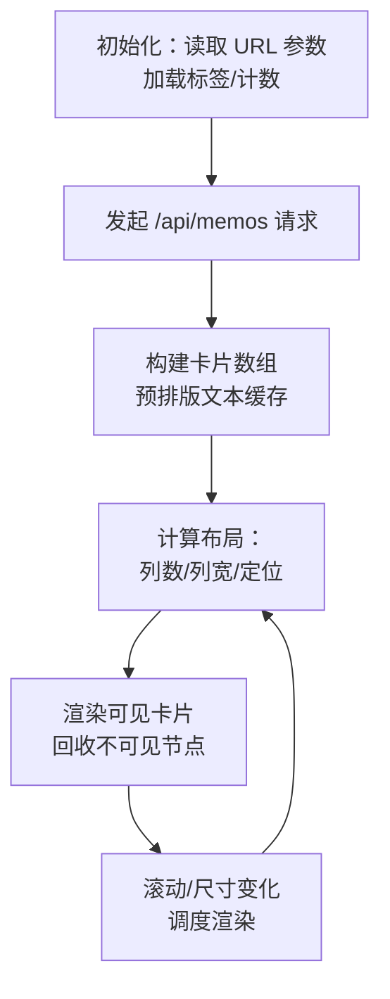
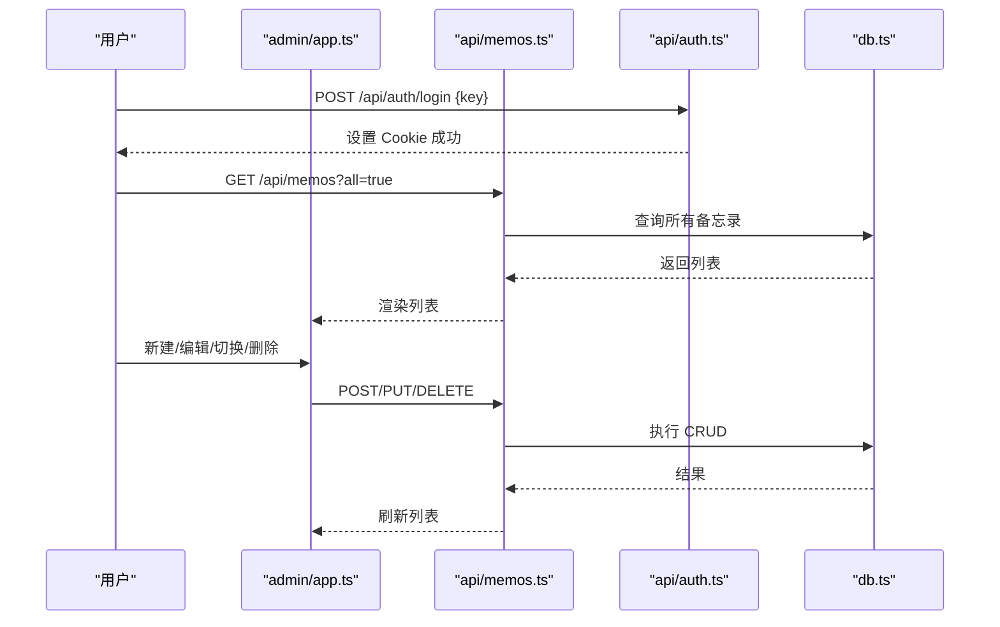
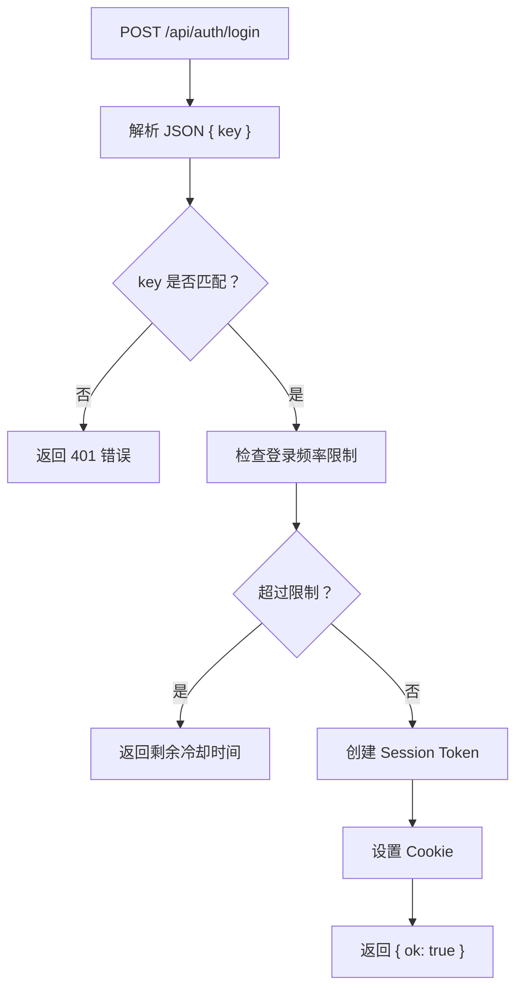
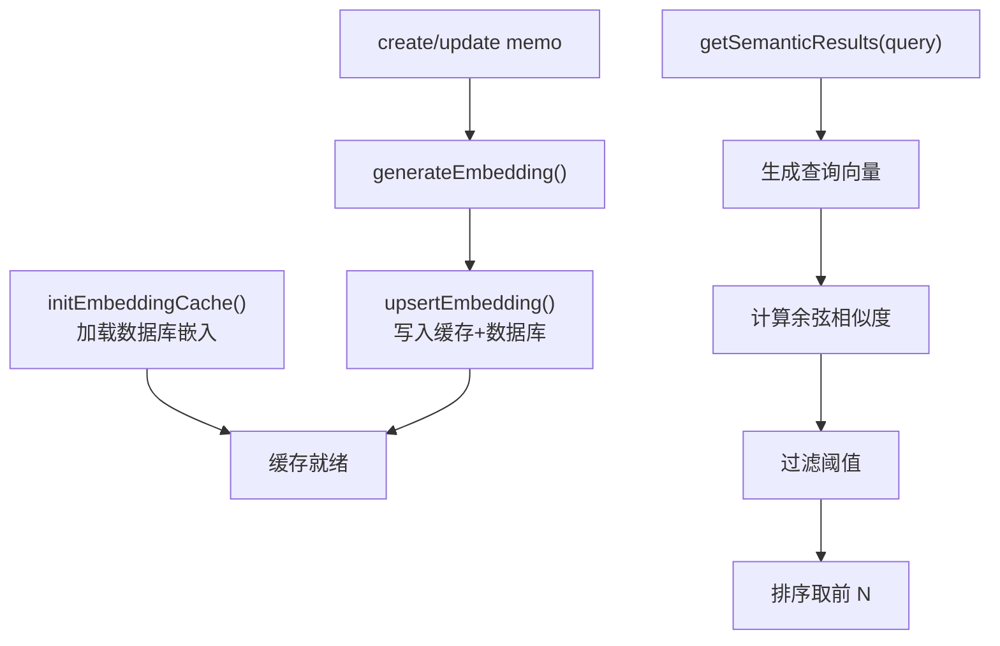
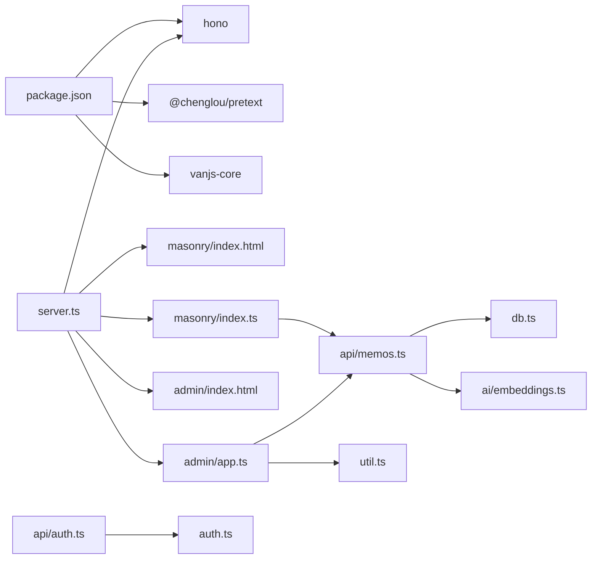

# 核心功能

<cite>
**本文引用的文件**
- [README.md](file://README.md)
- [package.json](file://package.json)
- [src/server.ts](file://src/server.ts)
- [src/db.ts](file://src/db.ts)
- [src/model.ts](file://src/model.ts)
- [src/auth.ts](file://src/auth.ts)
- [src/api/auth.ts](file://src/api/auth.ts)
- [src/api/memos.ts](file://src/api/memos.ts)
- [src/masonry/index.html](file://src/masonry/index.html)
- [src/masonry/index.ts](file://src/masonry/index.ts)
- [src/admin/index.html](file://src/admin/index.html)
- [src/admin/app.ts](file://src/admin/app.ts)
- [src/util.ts](file://src/util.ts)
- [src/ai/embeddings.ts](file://src/ai/embeddings.ts)
</cite>

## 目录
1. [简介](#简介)
2. [项目结构](#项目结构)
3. [核心组件](#核心组件)
4. [架构总览](#架构总览)
5. [详细组件分析](#详细组件分析)
6. [依赖关系分析](#依赖关系分析)
7. [性能考量](#性能考量)
8. [故障排查指南](#故障排查指南)
9. [结论](#结论)
10. [附录](#附录)

## 简介
本项目是一个基于 Bun 的轻量级备忘录应用，提供以下核心能力：
- 备忘录管理：支持创建、编辑、删除、可见性控制（公开/私密）、标签分类与全文搜索
- 瀑布流展示：首页采用 Masonry 布局，结合预排版与虚拟滚动，支持响应式布局与 URL 同步
- 管理后台：SPA 架构，基于 VanJS，提供认证、表单处理、时间线导航与 AI 辅助
- 认证系统：基于 Cookie + 内存 Session 的密钥认证，带登录频率限制
- AI 能力：嵌入向量缓存与语义相似度检索，支持内容优化与标签建议

## 项目结构
项目采用“服务端路由 + 前端 SPA + SQLite 数据库”的分层架构。核心目录与职责如下：
- src/server.ts：HTTP 服务入口，路由分发、静态页面与客户端打包
- src/api/*：REST API 子应用，分别处理认证、备忘录、AI、创意内容
- src/db.ts：SQLite 数据层封装，提供 CRUD、索引与向量缓存
- src/masonry/*：首页瀑布流前端，Masonry 布局、虚拟滚动、搜索与标签筛选
- src/admin/*：管理后台 SPA，认证、表单、时间线导航与 AI 工具
- src/util.ts：通用工具函数（HTTP 客户端、日期格式化等）
- src/ai/embeddings.ts：向量嵌入缓存与语义检索

图表来源
- [src/server.ts:74-127](file://src/server.ts#L74-L127)
- [src/api/auth.ts:22-54](file://src/api/auth.ts#L22-L54)
- [src/api/memos.ts:18-140](file://src/api/memos.ts#L18-L140)
- [src/db.ts:15-57](file://src/db.ts#L15-L57)
- [src/ai/embeddings.ts:12-99](file://src/ai/embeddings.ts#L12-L99)
- [src/masonry/index.html:1-270](file://src/masonry/index.html#L1-L270)
- [src/masonry/index.ts:1-391](file://src/masonry/index.ts#L1-L391)
- [src/admin/index.html:1-849](file://src/admin/index.html#L1-L849)
- [src/admin/app.ts:1-677](file://src/admin/app.ts#L1-L677)
- [src/util.ts:1-43](file://src/util.ts#L1-L43)

章节来源
- [README.md:25-45](file://README.md#L25-L45)
- [package.json:1-22](file://package.json#L1-L22)

## 核心组件
- 备忘录模型与数据库层：定义 Memo 结构，提供 getMemos、getAllTags、create/update/delete 等方法；支持按搜索词、标签、是否包含私密进行查询
- 认证模块：内存 Session + Cookie，提供登录/登出/状态检查与中间件校验
- API 子应用：认证 API（/api/auth/*）与备忘录 API（/api/memos/*），统一错误处理与鉴权
- 瀑布流前端：Masonry 布局、预排版文本计算、虚拟滚动、搜索与标签筛选、URL 同步
- 管理后台 SPA：VanJS 响应式 UI，表单提交、可见性切换、删除确认、时间线导航、AI 工具集成
- AI 向量缓存：加载已有嵌入、余弦相似度检索、内容变更触发重新生成与缓存更新

章节来源
- [src/model.ts:1-28](file://src/model.ts#L1-L28)
- [src/db.ts:99-193](file://src/db.ts#L99-L193)
- [src/auth.ts:28-108](file://src/auth.ts#L28-L108)
- [src/api/auth.ts:24-54](file://src/api/auth.ts#L24-L54)
- [src/api/memos.ts:20-140](file://src/api/memos.ts#L20-L140)
- [src/masonry/index.ts:146-269](file://src/masonry/index.ts#L146-L269)
- [src/admin/app.ts:38-140](file://src/admin/app.ts#L38-L140)
- [src/ai/embeddings.ts:12-99](file://src/ai/embeddings.ts#L12-L99)

## 架构总览
服务端通过 Hono 路由挂载多个子应用，静态资源与页面由 server.ts 提供，客户端代码按需编译为 ESM 并缓存。前端通过 fetch 与 API 交互，管理后台与瀑布流分别承担不同职责。

图表来源
- [src/server.ts:74-81](file://src/server.ts#L74-L81)
- [src/api/memos.ts:20-48](file://src/api/memos.ts#L20-L48)
- [src/db.ts:99-131](file://src/db.ts#L99-L131)
- [src/ai/embeddings.ts:66-86](file://src/ai/embeddings.ts#L66-L86)

## 详细组件分析

### 备忘录管理（CRUD、可见性、标签）
- 数据模型：Memo 包含 id、content、tag、is_public、created_at、updated_at
- 查询与过滤：支持 search（LIKE）、tag 精确匹配、ids 列表、includePrivate 控制是否包含私密
- 创建/更新/删除：字段校验、更新时间戳、嵌入向量生成或更新、删除时清理缓存
- 标签系统：提供 getAllTags，瀑布流与管理后台均使用该接口填充标签下拉

图表来源
- [src/api/memos.ts:20-48](file://src/api/memos.ts#L20-L48)
- [src/db.ts:99-131](file://src/db.ts#L99-L131)
- [src/ai/embeddings.ts:66-86](file://src/ai/embeddings.ts#L66-L86)

章节来源
- [src/model.ts:1-8](file://src/model.ts#L1-L8)
- [src/db.ts:99-193](file://src/db.ts#L99-L193)
- [src/api/memos.ts:20-140](file://src/api/memos.ts#L20-L140)

### 瀑布流展示系统（Masonry 布局、虚拟滚动、响应式）
- 预排版与高度计算：使用 @chenglou/pretext 对文本进行预排版，计算每张卡片高度
- 布局算法：根据窗口宽度动态计算列数与列宽，选择最短列插入，维护列高度数组
- 虚拟滚动：只渲染可视区域上下各 200px 的卡片，滚动事件节流到 requestAnimationFrame，按可见性回收/创建 DOM
- 响应式设计：窄屏单列，宽屏多列；标签下拉自定义选择器；URL 参数同步搜索与标签状态
- 数据获取：按 search/tag 组合发起请求，预处理文本并缓存预排版结果

图表来源
- [src/masonry/index.ts:371-391](file://src/masonry/index.ts#L371-L391)
- [src/masonry/index.ts:308-351](file://src/masonry/index.ts#L308-L351)
- [src/masonry/index.ts:146-196](file://src/masonry/index.ts#L146-L196)
- [src/masonry/index.ts:232-269](file://src/masonry/index.ts#L232-L269)

章节来源
- [src/masonry/index.html:1-270](file://src/masonry/index.html#L1-L270)
- [src/masonry/index.ts:1-391](file://src/masonry/index.ts#L1-L391)

### 管理后台（SPA、表单、时间线导航）
- 认证流程：登录时校验密钥，成功后设置 Cookie；检查状态用于初始化；登出清除 Cookie
- 表单处理：新建/编辑备忘录，内容必填校验，保存时调用 API，完成后刷新列表
- 可见性切换：PUT /api/memos/:id，切换 is_public
- 删除确认：二次确认弹窗，调用 DELETE /api/memos/:id
- 时间线导航：按年/月聚合备忘录，点击跳转至对应卡片；支持折叠/展开年份
- AI 集成：内容优化、标签建议（防抖），仅在可用时显示工具栏

图表来源
- [src/admin/app.ts:38-140](file://src/admin/app.ts#L38-L140)
- [src/api/memos.ts:63-140](file://src/api/memos.ts#L63-L140)
- [src/api/auth.ts:24-54](file://src/api/auth.ts#L24-L54)
- [src/db.ts:99-193](file://src/db.ts#L99-L193)

章节来源
- [src/admin/index.html:1-849](file://src/admin/index.html#L1-L849)
- [src/admin/app.ts:1-677](file://src/admin/app.ts#L1-L677)

### 认证系统（密钥验证、会话管理）
- 密钥来源：优先使用环境变量 MEMOS_SECRET_KEY，生产环境未设置会直接退出；开发默认密钥警告
- 会话存储：内存 Set 存储 token，重启丢失；Cookie 名称固定，HttpOnly + SameSite + 24 小时过期
- 登录频率限制：同一 IP 最多 5 次失败，1 分钟冷却；超过次数返回剩余冷却时间
- 中间件：requireAuth 返回 401 或放行；authMiddleware 在后续处理前校验

图表来源
- [src/api/auth.ts:29-45](file://src/api/auth.ts#L29-L45)
- [src/auth.ts:57-89](file://src/auth.ts#L57-L89)
- [src/auth.ts:91-108](file://src/auth.ts#L91-L108)

章节来源
- [src/api/auth.ts:11-21](file://src/api/auth.ts#L11-L21)
- [src/auth.ts:1-108](file://src/auth.ts#L1-L108)

### AI 能力（嵌入向量与语义检索）
- 初始化缓存：启动时从数据库加载已有嵌入，转换为 Float32Array 缓存
- 生成与存储：创建/更新备忘录时异步生成嵌入并持久化
- 语义检索：查询时生成查询向量，计算与缓存中向量的余弦相似度，高于阈值的返回 ID 列表
- 性能：纯内存计算，避免 SQLite 扩展依赖；相似度排序取前 N

图表来源
- [src/ai/embeddings.ts:12-46](file://src/ai/embeddings.ts#L12-L46)
- [src/ai/embeddings.ts:88-99](file://src/ai/embeddings.ts#L88-L99)
- [src/ai/embeddings.ts:66-86](file://src/ai/embeddings.ts#L66-L86)

章节来源
- [src/ai/embeddings.ts:1-99](file://src/ai/embeddings.ts#L1-L99)

## 依赖关系分析
- 运行时与依赖：Bun、Hono、@chenglou/pretext、vanjs-core
- 服务端路由：server.ts 挂载 auth、memos、ai、creative 子应用
- 前端打包：server.ts 使用 Bun.build 按需编译 TS→JS，带 mtime 缓存
- 数据库：SQLite（WAL 模式），表结构包含 memos、memo_embeddings、prompts、creative

图表来源
- [package.json:16-21](file://package.json#L16-L21)
- [src/server.ts:15-51](file://src/server.ts#L15-L51)
- [src/api/auth.ts:1-10](file://src/api/auth.ts#L1-L10)
- [src/api/memos.ts:1-17](file://src/api/memos.ts#L1-L17)
- [src/db.ts:1-2](file://src/db.ts#L1-L2)
- [src/ai/embeddings.ts:1-6](file://src/ai/embeddings.ts#L1-L6)
- [src/util.ts:1-43](file://src/util.ts#L1-L43)

章节来源
- [package.json:1-22](file://package.json#L1-L22)
- [src/server.ts:74-127](file://src/server.ts#L74-L127)

## 性能考量
- 前端渲染
  - 预排版缓存：对相同文本重复使用 PreparedText，减少布局开销
  - 虚拟滚动：仅渲染可视区域卡片，滚动节流到 rAF，降低 DOM 数量
  - URL 同步：避免重复请求，提升可访问性与书签体验
- 服务端
  - 客户端 JS 按需编译并缓存 mtime，减少构建成本
  - API 查询支持 LIKE + 语义检索合并，非阻塞异步，保证主路径快速返回
- 数据层
  - SQLite WAL 模式提升并发写入性能
  - 向量缓存纯内存，避免扩展依赖，相似度计算 O(n) 且阈值过滤

## 故障排查指南
- 认证相关
  - 登录失败：检查密钥是否正确；确认生产环境已设置 MEMOS_SECRET_KEY
  - 登录频繁被限：等待冷却时间结束；检查 IP 是否被记录
  - 401 未授权：确认 Cookie 是否存在且未过期
- 备忘录相关
  - 创建失败：检查 content 是否为空；is_public、tag 是否传入合法值
  - 更新失败：确认 memo 是否存在；内容为空校验
  - 删除失败：确认 memo 是否存在；检查向量缓存清理是否成功
- 前端瀑布流
  - 卡片不显示：检查网络请求是否成功；确认预排版缓存是否命中
  - 布局错乱：检查窗口尺寸变化事件是否触发；确认列宽计算逻辑
- 管理后台
  - 登录后空白：检查认证状态检查是否成功；确认 Cookie 设置
  - 表单保存失败：查看全局错误提示；确认网络请求状态码
  - 时间线无数据：确认 memos 列表是否为空；检查 created_at 格式

章节来源
- [src/api/auth.ts:29-45](file://src/api/auth.ts#L29-L45)
- [src/auth.ts:57-89](file://src/auth.ts#L57-L89)
- [src/api/memos.ts:63-140](file://src/api/memos.ts#L63-L140)
- [src/masonry/index.ts:308-351](file://src/masonry/index.ts#L308-L351)
- [src/admin/app.ts:38-140](file://src/admin/app.ts#L38-L140)

## 结论
本项目以简洁高效为目标，通过 Bun + Hono 提供高性能服务端，结合 @chenglou/pretext 与自研虚拟滚动实现优秀的瀑布流体验；管理后台采用 SPA 架构，配合 VanJS 实现响应式 UI 与时间线导航；认证系统简单可靠，AI 能力以纯内存向量缓存实现语义检索与内容优化。整体架构清晰、模块职责明确，适合在小型团队或个人场景中快速部署与迭代。

## 附录
- 环境变量
  - PORT：服务器监听端口，默认 3020
  - MEMOS_SECRET_KEY：管理员登录密钥，默认开发环境警告
- API 接口
  - 认证：GET /api/auth/check、POST /api/auth/login、POST /api/auth/logout
  - 备忘录：GET /api/memos、GET /api/memos/count、GET /api/memos/tags、POST /api/memos、PUT /api/memos/:id、DELETE /api/memos/:id
- 使用示例（路径参考）
  - 创建备忘录：[src/api/memos.ts:63-92](file://src/api/memos.ts#L63-L92)
  - 获取备忘录列表（含搜索与标签）：[src/api/memos.ts:20-48](file://src/api/memos.ts#L20-L48)
  - 瀑布流搜索与标签筛选：[src/masonry/index.ts:308-351](file://src/masonry/index.ts#L308-L351)
  - 管理后台登录与表单提交：[src/admin/app.ts:38-140](file://src/admin/app.ts#L38-L140)