# 瀑布流展示系统

<cite>
**本文档引用的文件**
- [src/frontend/masonry/index.ts](file://src/frontend/masonry/index.ts)
- [src/frontend/masonry/index.html](file://src/frontend/masonry/index.html)
- [src/frontend/masonry/api.ts](file://src/frontend/masonry/api.ts)
- [src/frontend/masonry/components.ts](file://src/frontend/masonry/components.ts)
- [src/frontend/masonry/state.ts](file://src/frontend/masonry/state.ts)
- [src/helper/util.ts](file://src/helper/util.ts)
- [src/helper/markdown.ts](file://src/helper/markdown.ts)
- [src/frontend/shared/utils/text.ts](file://src/frontend/shared/utils/text.ts)
- [src/frontend/shared/utils/clipboard.ts](file://src/frontend/shared/utils/clipboard.ts)
- [src/frontend/shared/components/ReadMoreModal.ts](file://src/frontend/shared/components/ReadMoreModal.ts)
- [src/api/memos.ts](file://src/api/memos.ts)
- [src/db.ts](file://src/db.ts)
- [src/server.ts](file://src/server.ts)
- [package.json](file://package.json)
- [README.md](file://README.md)
</cite>

## 更新摘要
**变更内容**
- 完全重构：从手动DOM操作迁移到VanJS组件系统
- 新增模块化架构：分离api.ts、components.ts、state.ts等独立模块
- 优化状态管理：使用VanJS状态系统替代手动DOM更新
- 改进布局算法：新增布局缓存机制，提升性能
- 增强组件复用：共享ReadMoreModal组件，支持多场景使用

## 目录
1. [简介](#简介)
2. [项目结构](#项目结构)
3. [核心组件](#核心组件)
4. [架构总览](#架构总览)
5. [详细组件分析](#详细组件分析)
6. [依赖关系分析](#依赖关系分析)
7. [性能考虑](#性能考虑)
8. [故障排查指南](#故障排查指南)
9. [结论](#结论)
10. [附录](#附录)

## 简介
本项目是一个基于 Bun 运行时的轻量级备忘录系统，提供瀑布流展示界面与管理后台。**全新重构**：系统已完全迁移到VanJS组件系统，采用模块化架构设计。瀑布流首页采用 Masonry 布局，结合 @chenglou/pretext 文本预排版引擎，实现精确的高度计算与自适应列数；前端通过虚拟滚动仅渲染可视区域内的卡片，显著提升大列表性能；后端提供 REST API，支持搜索、标签筛选、计数等能力，并与 AI 能力深度集成。**最新更新**：系统现已支持服务器端分页、无限滚动和URL参数同步功能，大幅提升了大数据集的性能表现和用户体验。

## 项目结构
- **前端瀑布流页面**：位于 src/frontend/masonry，采用模块化设计，包含独立的API、组件和状态管理模块
- **后端服务**：位于 src/server.ts，路由到各 API 子应用
- **API实现**：位于 src/api，如 memos.ts 提供备忘录 CRUD 与查询
- **数据层**：位于 src/db.ts，封装 SQLite 操作
- **工具函数**：位于 src/helper，提供通用HTTP辅助和Markdown处理
- **共享组件**：位于 src/frontend/shared，提供跨页面复用的UI组件

```mermaid
graph TB
subgraph "客户端 - 模块化架构"
HTML["masonry/index.html"]
Entry["masonry/index.ts<br/>入口模块"]
API["masonry/api.ts<br/>数据API模块"]
COMP["masonry/components.ts<br/>组件模块"]
STATE["masonry/state.ts<br/>状态管理模块"]
END
subgraph "服务端"
Server["server.ts"]
API_Memos["api/memos.ts"]
API_Creative["api/creative.ts"]
DB["db.ts"]
Util["helper/util.ts"]
Markdown["helper/markdown.ts"]
END
HTML --> Entry
Entry --> COMP
Entry --> STATE
Entry --> API
API --> API_Memos
API --> Util
API --> Markdown
Server --> API_Memos
Server --> API_Creative
API_Memos --> DB
API_Creative --> DB
```

**图表来源**
- [src/frontend/masonry/index.ts:1-23](file://src/frontend/masonry/index.ts#L1-L23)
- [src/frontend/masonry/api.ts:1-162](file://src/frontend/masonry/api.ts#L1-L162)
- [src/frontend/masonry/components.ts:1-337](file://src/frontend/masonry/components.ts#L1-L337)
- [src/frontend/masonry/state.ts:1-181](file://src/frontend/masonry/state.ts#L1-L181)
- [src/server.ts:1-127](file://src/server.ts#L1-L127)
- [src/api/memos.ts:1-166](file://src/api/memos.ts#L1-L166)

**章节来源**
- [README.md:25-46](file://README.md#L25-L46)
- [package.json:1-22](file://package.json#L1-L22)

## 核心组件
- **VanJS组件系统**：基于VanJS的状态驱动组件架构，替代传统DOM操作
- **模块化API层**：独立的api.ts模块封装所有数据获取和业务逻辑
- **响应式组件**：components.ts中的函数式组件，支持状态自动更新
- **集中状态管理**：state.ts统一管理应用状态，包括卡片数据、布局状态等
- **Masonry布局引擎**：全新的布局算法实现，包含智能缓存机制
- **文本预排版引擎**：基于 @chenglou/pretext 计算文本在指定宽度下的高度
- **虚拟滚动**：仅渲染可视区域卡片，滚动事件节流与按需回收
- **无限滚动**：滚动到底部自动加载更多数据，支持大数据集浏览
- **服务器端分页**：后端API支持分页参数，提升大数据集性能
- **URL参数同步**：支持书签功能，页面刷新后保持搜索状态
- **共享组件**：ReadMoreModal等跨页面复用组件

**章节来源**
- [src/frontend/masonry/index.ts:1-23](file://src/frontend/masonry/index.ts#L1-L23)
- [src/frontend/masonry/api.ts:51-130](file://src/frontend/masonry/api.ts#L51-L130)
- [src/frontend/masonry/components.ts:283-337](file://src/frontend/masonry/components.ts#L283-L337)
- [src/frontend/masonry/state.ts:84-152](file://src/frontend/masonry/state.ts#L84-L152)

## 架构总览
瀑布流系统采用全新的模块化架构，从前端渲染到后端 API 的整体流程如下：

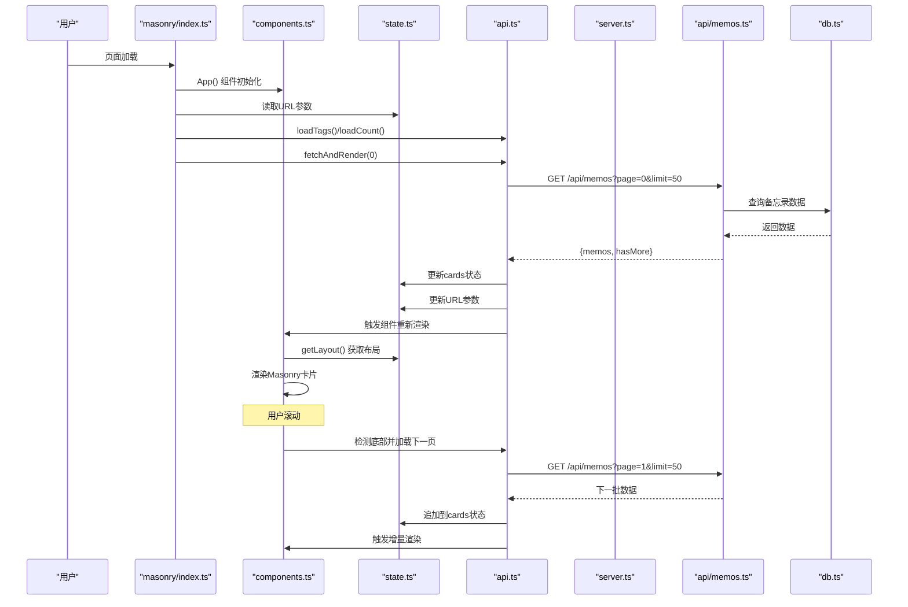

**图表来源**
- [src/frontend/masonry/index.ts:6-23](file://src/frontend/masonry/index.ts#L6-L23)
- [src/frontend/masonry/components.ts:289-298](file://src/frontend/masonry/components.ts#L289-L298)
- [src/frontend/masonry/api.ts:51-130](file://src/frontend/masonry/api.ts#L51-L130)
- [src/api/memos.ts:20-66](file://src/api/memos.ts#L20-L66)

## 详细组件分析

### VanJS组件系统重构
**更新**：系统已完全迁移到VanJS组件系统，采用模块化架构设计。

- **入口模块**：index.ts负责初始化应用，设置状态和事件监听
- **组件模块**：components.ts包含所有UI组件，采用函数式组件模式
- **状态模块**：state.ts统一管理应用状态，使用VanJS状态系统
- **API模块**：api.ts封装所有数据获取逻辑，支持分页和搜索
- **自动渲染**：组件基于状态变化自动重新渲染，无需手动DOM操作

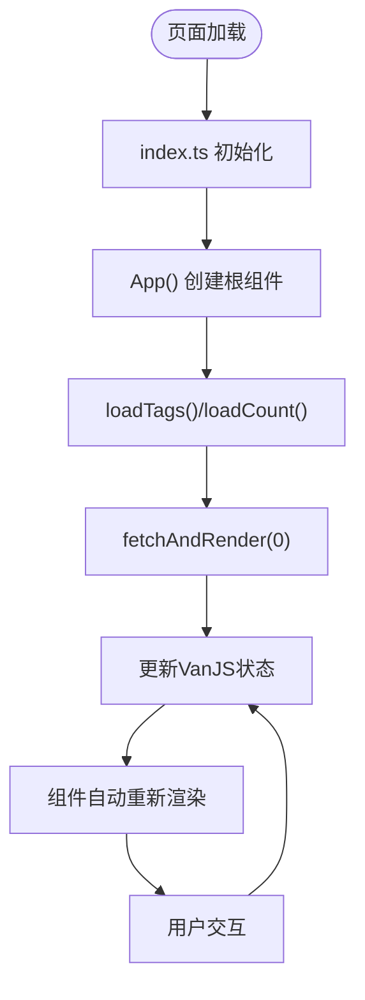

**图表来源**
- [src/frontend/masonry/index.ts:6-23](file://src/frontend/masonry/index.ts#L6-L23)
- [src/frontend/masonry/components.ts:283-337](file://src/frontend/masonry/components.ts#L283-L337)

**章节来源**
- [src/frontend/masonry/index.ts:1-23](file://src/frontend/masonry/index.ts#L1-L23)
- [src/frontend/masonry/components.ts:1-40](file://src/frontend/masonry/components.ts#L1-L40)

### 模块化API设计
**更新**：新增独立的API模块，封装所有数据获取和业务逻辑。

- **数据获取**：loadTags()、loadCount()、fetchAndRender()等独立函数
- **状态管理**：通过VanJS状态对象管理loading、error、cards等状态
- **URL同步**：仅在首次加载时更新URL参数，支持书签功能
- **错误处理**：统一的错误状态管理和用户友好的错误提示
- **防抖机制**：搜索输入防抖1秒，减少API调用频率

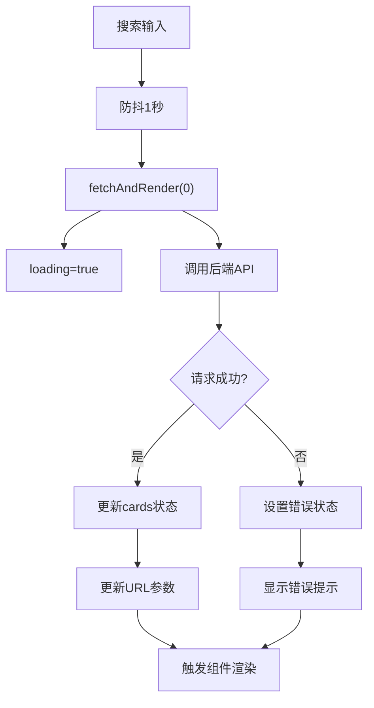

**图表来源**
- [src/frontend/masonry/api.ts:135-140](file://src/frontend/masonry/api.ts#L135-L140)
- [src/frontend/masonry/api.ts:51-130](file://src/frontend/masonry/api.ts#L51-L130)

**章节来源**
- [src/frontend/masonry/api.ts:29-49](file://src/frontend/masonry/api.ts#L29-L49)
- [src/frontend/masonry/api.ts:51-130](file://src/frontend/masonry/api.ts#L51-L130)
- [src/frontend/masonry/api.ts:135-140](file://src/frontend/masonry/api.ts#L135-L140)

### 集中式状态管理
**更新**：采用VanJS状态系统统一管理应用状态。

- **状态类型**：cards、search、tag、page、hasMore、loading等
- **响应式更新**：状态变化自动触发组件重新渲染
- **布局缓存**：智能缓存布局计算结果，避免重复计算
- **模态状态**：similarMemoId、readMoreText等模态框状态管理
- **工具函数**：truncateText、formatDate等实用工具函数

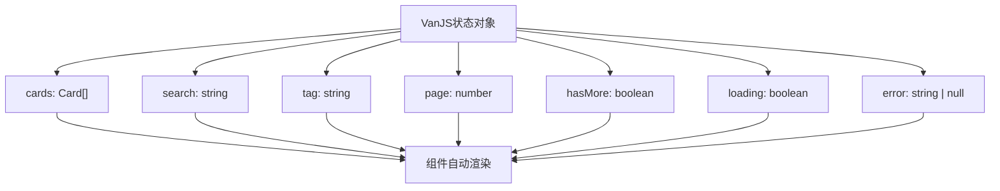

**图表来源**
- [src/frontend/masonry/state.ts:42-60](file://src/frontend/masonry/state.ts#L42-L60)
- [src/frontend/masonry/state.ts:140-152](file://src/frontend/masonry/state.ts#L140-L152)

**章节来源**
- [src/frontend/masonry/state.ts:41-60](file://src/frontend/masonry/state.ts#L41-L60)
- [src/frontend/masonry/state.ts:140-152](file://src/frontend/masonry/state.ts#L140-L152)

### 增强的Masonry布局算法
**更新**：全新的布局算法实现，包含智能缓存机制。

- **布局缓存**：缓存最近一次布局计算结果，避免重复计算
- **智能比较**：仅在卡片数据或窗口宽度变化时重新计算布局
- **性能优化**：使用Float64Array存储列高度，提升计算效率
- **响应式适配**：根据窗口宽度动态计算列数和列宽
- **预排版集成**：与@chenglou/pretext深度集成，精确计算文本高度

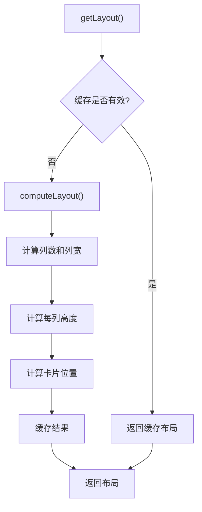

**图表来源**
- [src/frontend/masonry/state.ts:140-152](file://src/frontend/masonry/state.ts#L140-L152)
- [src/frontend/masonry/state.ts:84-133](file://src/frontend/masonry/state.ts#L84-L133)

**章节来源**
- [src/frontend/masonry/state.ts:84-152](file://src/frontend/masonry/state.ts#L84-L152)

### 共享组件复用
**更新**：新增共享组件，支持多场景使用。

- **ReadMoreModal**：跨页面复用的模态框组件
- **SVG图标**：统一的SVG图标库，支持复制、展开、搜索等功能
- **工具函数**：escapeHtml、copyToClipboard等通用工具
- **样式复用**：统一的CSS样式，支持主题定制
- **事件处理**：标准化的事件处理机制

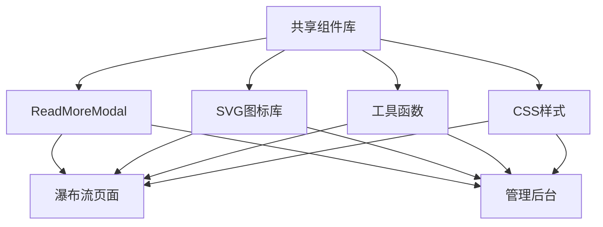

**图表来源**
- [src/frontend/shared/components/ReadMoreModal.ts:15-71](file://src/frontend/shared/components/ReadMoreModal.ts#L15-L71)
- [src/frontend/masonry/components.ts:3-11](file://src/frontend/masonry/components.ts#L3-L11)

**章节来源**
- [src/frontend/shared/components/ReadMoreModal.ts:1-71](file://src/frontend/shared/components/ReadMoreModal.ts#L1-L71)
- [src/frontend/shared/utils/text.ts:1-12](file://src/frontend/shared/utils/text.ts#L1-L12)
- [src/frontend/shared/utils/clipboard.ts:1-25](file://src/frontend/shared/utils/clipboard.ts#L1-L25)

### 服务器端分页实现
**更新**：后端API现在支持完整的分页功能，通过page和limit参数控制数据加载。

- **分页参数**：page（默认0）和limit（默认50）控制数据范围
- **数据截断**：后端查询结果按limit+1截断，用于判断是否还有更多数据
- **hasMore标志**：当截断结果长度大于limit时设置hasMore为true
- **性能优化**：只返回当前页数据，减少网络传输和前端处理负担

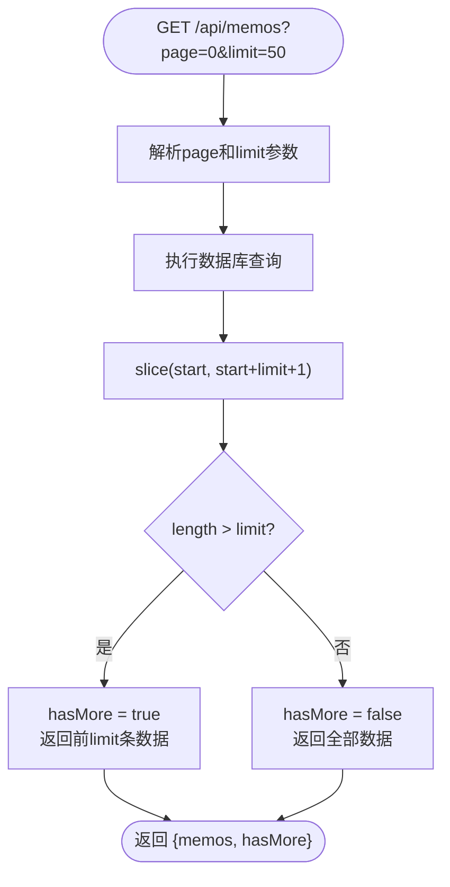

**图表来源**
- [src/api/memos.ts:57-66](file://src/api/memos.ts#L57-L66)

**章节来源**
- [src/api/memos.ts:57-66](file://src/api/memos.ts#L57-L66)

### 无限滚动机制
**更新**：前端实现了智能的无限滚动功能，提升大数据集浏览体验。

- **底部检测**：滚动距离文档底部400px以内时触发加载
- **状态控制**：loadingMore防止重复请求，hasMore控制是否继续加载
- **自动分页**：currentPage递增，自动加载下一页数据
- **性能优化**：只有在有更多数据时才触发加载，避免无意义请求

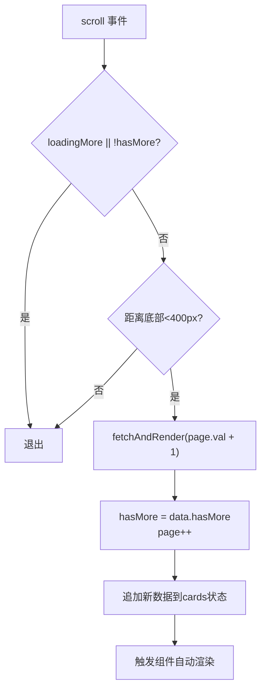

**图表来源**
- [src/frontend/masonry/components.ts:289-298](file://src/frontend/masonry/components.ts#L289-L298)

**章节来源**
- [src/frontend/masonry/components.ts:289-298](file://src/frontend/masonry/components.ts#L289-L298)

### URL参数同步与书签功能
**更新**：改进了URL参数同步机制，支持书签和历史记录功能。

- **初始化加载**：页面加载时从URL读取search和tag参数
- **书签支持**：首次加载时更新URL参数，支持浏览器书签
- **状态保持**：页面刷新后自动恢复之前的搜索状态
- **参数更新**：搜索和标签切换时更新URL参数，便于分享

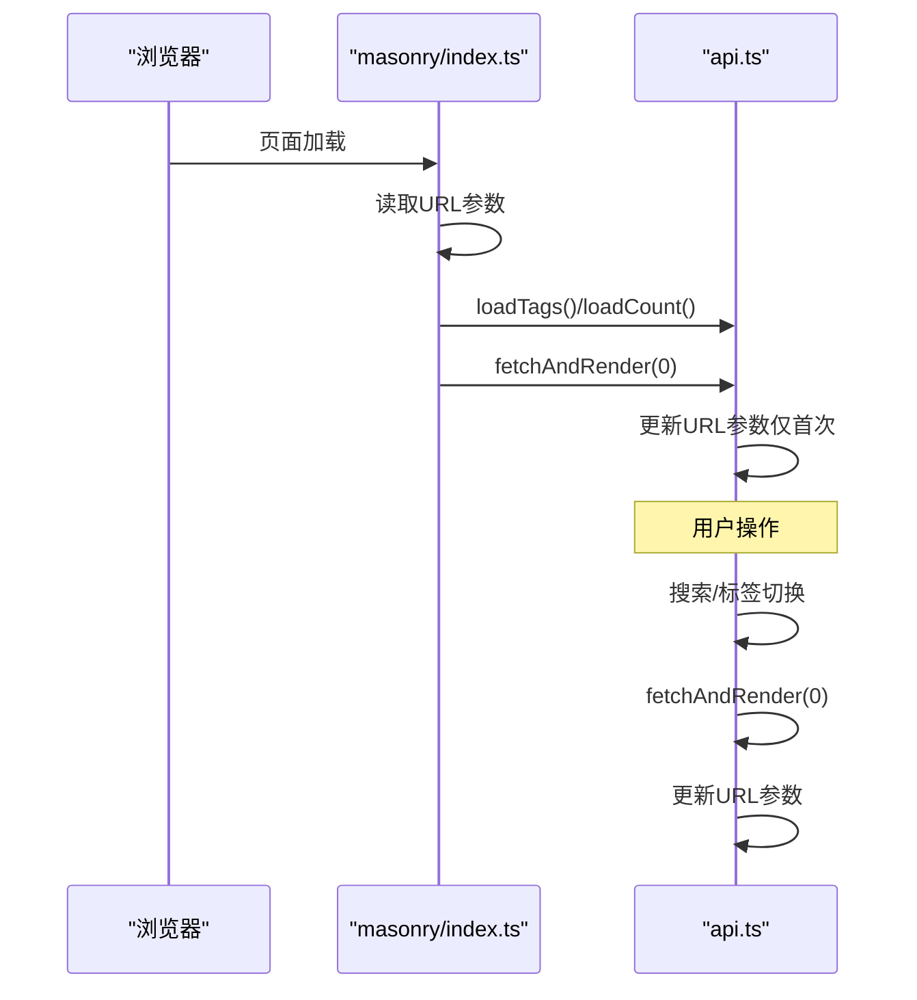

**图表来源**
- [src/frontend/masonry/index.ts:7-12](file://src/frontend/masonry/index.ts#L7-L12)
- [src/frontend/masonry/api.ts:111-120](file://src/frontend/masonry/api.ts#L111-L120)

**章节来源**
- [src/frontend/masonry/index.ts:7-12](file://src/frontend/masonry/index.ts#L7-L12)
- [src/frontend/masonry/api.ts:111-120](file://src/frontend/masonry/api.ts#L111-L120)

### 文本预排版引擎 @chenglou/pretext 集成
**更新**：与新的布局算法深度集成，提供精确的文本高度计算。

- **预处理缓存**：以文本为键缓存prepare结果，避免重复计算
- **预排版高度**：layout返回文本在给定宽度下的高度，用于精确卡片高度
- **字体配置**：统一的字体、行高、内边距配置
- **智能缓存**：Map缓存机制，支持缓存清理和内存管理

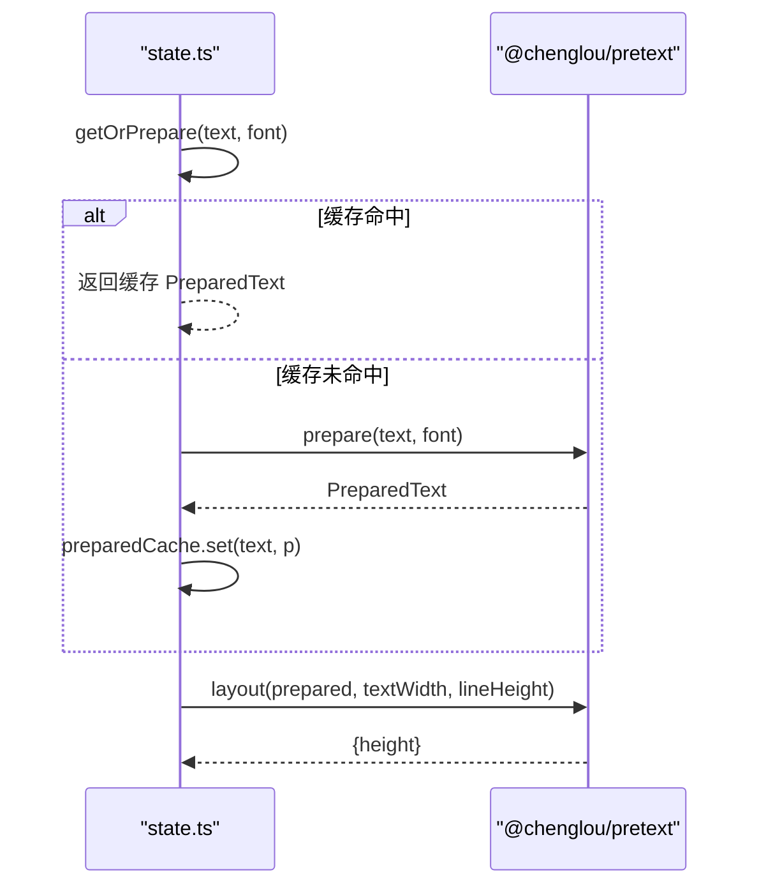

**图表来源**
- [src/frontend/masonry/state.ts:64-70](file://src/frontend/masonry/state.ts#L64-L70)
- [src/frontend/masonry/state.ts:112](file://src/frontend/masonry/state.ts#L112)

**章节来源**
- [src/frontend/masonry/state.ts:64-70](file://src/frontend/masonry/state.ts#L64-L70)
- [src/frontend/masonry/state.ts:112](file://src/frontend/masonry/state.ts#L112)

### 响应式设计与布局适配
**更新**：响应式设计在新的组件系统中得到增强。

- **移动优先**：在窄屏下强制单列，限制最大列宽，确保阅读体验
- **多列自适应**：宽屏下根据最小列宽阈值与间隙计算列数，保证列宽上限
- **容器居中**：根据内容宽度与窗口宽度计算容器左偏移，保持视觉居中
- **组件响应**：所有组件都支持响应式布局，自动适配不同屏幕尺寸

**章节来源**
- [src/frontend/masonry/index.html:131-168](file://src/frontend/masonry/index.html#L131-L168)
- [src/frontend/masonry/state.ts:84-97](file://src/frontend/masonry/state.ts#L84-L97)

### 数据交互与实时更新机制
**更新**：改进了数据交互机制，支持分页、无限滚动和URL同步。

- **初始加载**：从URL读取search/tag参数，加载标签与计数，触发首次数据请求
- **搜索与筛选**：防抖输入（1秒），组合search与tag参数查询
- **分页加载**：首次加载page=0，后续无限滚动自动加载page++
- **URL同步**：仅在首次加载时更新URL参数，支持书签和历史记录
- **状态驱动**：所有UI更新都由状态变化驱动，无需手动DOM操作

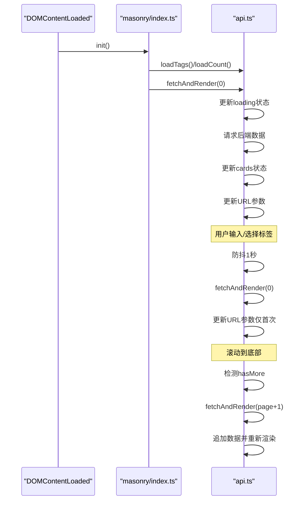

**图表来源**
- [src/frontend/masonry/index.ts:18-23](file://src/frontend/masonry/index.ts#L18-L23)
- [src/frontend/masonry/api.ts:135-140](file://src/frontend/masonry/api.ts#L135-L140)
- [src/frontend/masonry/components.ts:289-298](file://src/frontend/masonry/components.ts#L289-L298)

**章节来源**
- [src/frontend/masonry/index.ts:18-23](file://src/frontend/masonry/index.ts#L18-L23)
- [src/frontend/masonry/api.ts:135-140](file://src/frontend/masonry/api.ts#L135-L140)
- [src/frontend/masonry/components.ts:289-298](file://src/frontend/masonry/components.ts#L289-L298)

### 后端 API 与数据模型
**更新**：后端API保持不变，继续支持完整的功能。

- **备忘录API**：支持分页查询、搜索、标签筛选、计数、标签列表、CRUD
- **分页支持**：新增page和limit参数，返回hasMore标志
- **语义检索**：查询时同时执行向量相似度匹配，合并结果集
- **数据模型**：Memo、Prompt、CreativeItem等实体定义

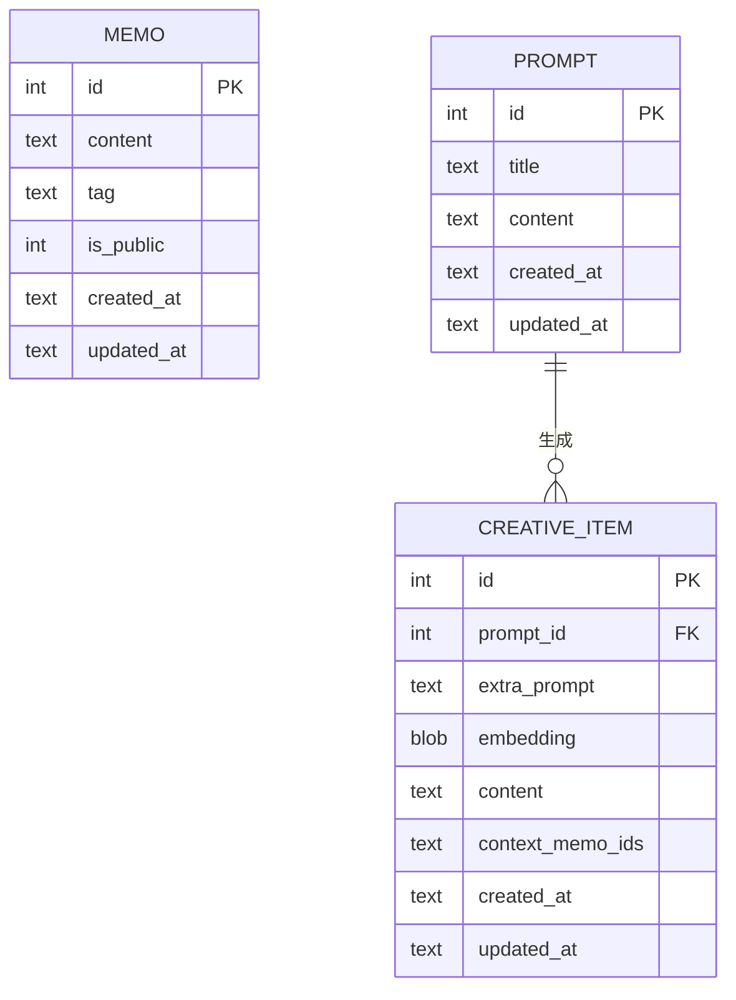

**图表来源**
- [src/model.ts:1-27](file://src/model.ts#L1-L27)
- [src/db.ts:17-56](file://src/db.ts#L17-L56)

**章节来源**
- [src/api/memos.ts:20-66](file://src/api/memos.ts#L20-L66)
- [src/db.ts:99-148](file://src/db.ts#L99-L148)
- [src/model.ts:1-27](file://src/model.ts#L1-L27)

## 依赖关系分析
**更新**：依赖关系得到简化和优化。

- **前端依赖**：@chenglou/pretext用于文本预排版；vanjs-core用于组件系统
- **运行时**：Bun（内置SQLite、HTTP服务器、构建工具）
- **框架**：Hono作为后端路由框架
- **服务端构建**：Bun.build将TS按需编译为ES Module JS
- **模块化优势**：清晰的模块边界，便于维护和测试

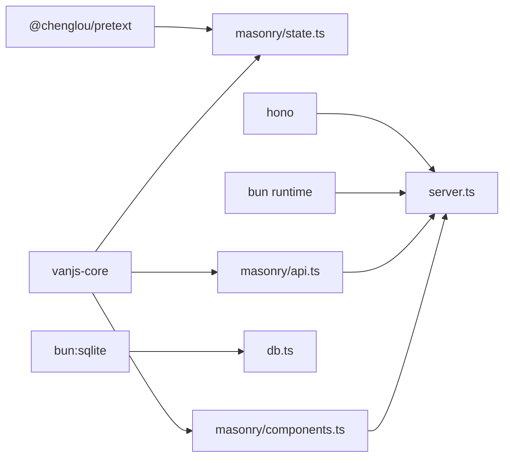

**图表来源**
- [package.json:16-21](file://package.json#L16-L21)
- [src/frontend/masonry/state.ts:1-3](file://src/frontend/masonry/state.ts#L1-L3)
- [src/frontend/masonry/components.ts:1](file://src/frontend/masonry/components.ts#L1)
- [src/server.ts:1-127](file://src/server.ts#L1-L127)

**章节来源**
- [package.json:16-21](file://package.json#L16-L21)
- [src/server.ts:15-51](file://src/server.ts#L15-L51)

## 性能考虑
**更新**：新增了模块化架构和布局缓存相关的性能优化策略。

- **渲染优化**
  - **状态驱动渲染**：VanJS自动追踪依赖，仅在相关状态变化时重新渲染
  - **布局缓存**：智能缓存布局计算结果，避免重复计算
  - **预排版缓存**：Map缓存避免重复layout调用
  - **分页加载**：服务器端分页减少单次请求数据量，提升响应速度
  - **防抖机制**：搜索输入1秒防抖，减少API调用频率
- **内存管理**
  - **状态清理**：VanJS状态自动管理内存，无需手动清理
  - **缓存策略**：预排版缓存支持LRU策略，避免内存泄漏
  - **组件卸载**：自动清理事件监听器和定时器
  - **布局缓存**：智能缓存失效机制，平衡内存使用和性能
- **布局与计算**
  - **缓存优化**：仅在卡片数据或窗口宽度变化时重新计算布局
  - **增量渲染**：无限滚动时仅追加新卡片，避免全量重新渲染
  - **虚拟滚动**：仅渲染可视区域卡片，非可视卡片及时移除
  - **响应式适配**：组件级别的响应式处理，避免全局样式冲突
- **网络与API**
  - **状态管理**：loading、loadingMore等状态避免重复请求
  - **URL同步**：仅首次加载更新URL，支持书签功能
  - **分页优化**：limit=50的批量加载，平衡加载速度和内存占用
  - **错误处理**：统一的错误状态管理，提供用户友好的错误提示
- **模块化优势**
  - **按需加载**：模块化设计支持按需加载，减少初始包体积
  - **代码分割**：独立模块便于代码分割和懒加载
  - **测试友好**：清晰的模块边界，便于单元测试和集成测试

**章节来源**
- [src/frontend/masonry/state.ts:140-152](file://src/frontend/masonry/state.ts#L140-L152)
- [src/frontend/masonry/api.ts:135-140](file://src/frontend/masonry/api.ts#L135-L140)
- [src/frontend/masonry/components.ts:289-298](file://src/frontend/masonry/components.ts#L289-L298)

## 故障排查指南
**更新**：新增了模块化架构和状态管理相关的故障排查指导。

- **组件不更新或渲染异常**
  - 检查VanJS状态对象是否正确创建和使用
  - 确认状态更新是否在正确的组件作用域内
  - 验证组件是否正确依赖了相关状态
  - 检查是否有状态循环依赖
- **布局计算错误**
  - 确认windowWidth状态是否正确更新
  - 检查cards状态是否包含有效的预排版数据
  - 验证布局缓存是否被意外清除
  - 确认字体配置是否一致
- **API调用失败**
  - 检查网络请求是否成功，确认 /api/memos 返回memos数组和hasMore标志
  - 查看loading和error状态是否正确更新
  - 确认URL参数search/tag是否导致空结果
  - 验证分页参数page和limit是否正确传递
- **无限滚动问题**
  - 检查hasMore状态是否正确更新
  - 确认loadingMore状态控制是否生效
  - 验证page状态递增逻辑
  - 检查底部检测阈值（400px）是否合适
- **URL同步问题**
  - 检查URL参数解析是否正确
  - 确认history.replaceState是否正常工作
  - 验证仅首次加载时更新URL参数
- **内存泄漏**
  - 检查是否有未清理的事件监听器
  - 确认VanJS状态对象是否正确销毁
  - 验证缓存机制是否正常工作
- **样式冲突**
  - 检查CSS作用域是否正确隔离
  - 确认组件样式是否相互影响
  - 验证响应式样式的优先级
- **性能问题**
  - 检查布局缓存是否被频繁重建
  - 确认预排版缓存是否命中
  - 验证组件重新渲染的频率
  - 检查是否有不必要的状态更新

**章节来源**
- [src/frontend/masonry/state.ts:140-152](file://src/frontend/masonry/state.ts#L140-L152)
- [src/frontend/masonry/api.ts:121-129](file://src/frontend/masonry/api.ts#L121-L129)
- [src/frontend/masonry/components.ts:289-298](file://src/frontend/masonry/components.ts#L289-L298)

## 结论
该瀑布流展示系统通过完全重构迁移到VanJS组件系统，实现了更加现代化和模块化的架构设计。**全新特性**：系统现已支持智能布局缓存、状态驱动渲染、模块化API设计等先进特性，大幅提升了开发效率和运行性能。Masonry布局与@chenglou/pretext文本预排版的深度集成，实现了精确且高效的卡片高度计算；配合虚拟滚动与DOM复用，有效支撑了大规模数据的流畅展示。**最新更新**：系统现已支持服务器端分页、无限滚动和URL参数同步功能，大幅提升了大数据集的性能表现和用户体验。后端API提供完善的搜索、筛选与计数能力，并与AI能力深度融合，支持语义检索与内容增强。整体架构简洁、性能优良、易于维护，适合中小规模到中等规模的数据展示场景。

## 附录

### 自定义配置选项
**更新**：新增了模块化架构和布局缓存相关的配置选项。

- **布局参数**（可在state.ts中调整）
  - 字体配置：font属性，影响文本预排版高度
  - 行高设置：lineHeight，影响文本行间距
  - 卡片内边距：cardPadding，影响内容区域大小
  - 列间距：gap，影响列间间距
  - 最大列宽：maxColWidth，限制列宽上限
  - 单列阈值：singleColumnMaxViewportWidth，小于等于该宽度时强制单列
- **虚拟滚动参数**
  - 视口缓冲区：滚动时上下的缓冲像素，减少频繁可见性判断
  - 防抖时间：搜索输入的防抖间隔（1秒）
- **分页配置**
  - 默认页大小：limit=50，平衡加载速度和内存占用
  - 底部触发距离：400px，避免频繁触发无限滚动
- **状态管理**
  - loading：控制初始加载状态
  - loadingMore：防止重复请求的状态标志
  - hasMore：控制是否继续加载的标志
  - page：当前页码，用于无限滚动
- **缓存配置**
  - 预排版缓存：Map缓存机制，支持缓存清理
  - 布局缓存：智能缓存失效机制，平衡内存使用和性能
- **组件配置**
  - 组件状态：所有组件状态都通过VanJS状态管理
  - 事件处理：标准化的事件处理机制
  - 样式配置：统一的CSS样式，支持主题定制

**章节来源**
- [src/frontend/masonry/state.ts:4-11](file://src/frontend/masonry/state.ts#L4-L11)
- [src/frontend/masonry/state.ts:84-97](file://src/frontend/masonry/state.ts#L84-L97)
- [src/frontend/masonry/api.ts:135-140](file://src/frontend/masonry/api.ts#L135-L140)
- [src/frontend/masonry/components.ts:289-298](file://src/frontend/masonry/components.ts#L289-L298)