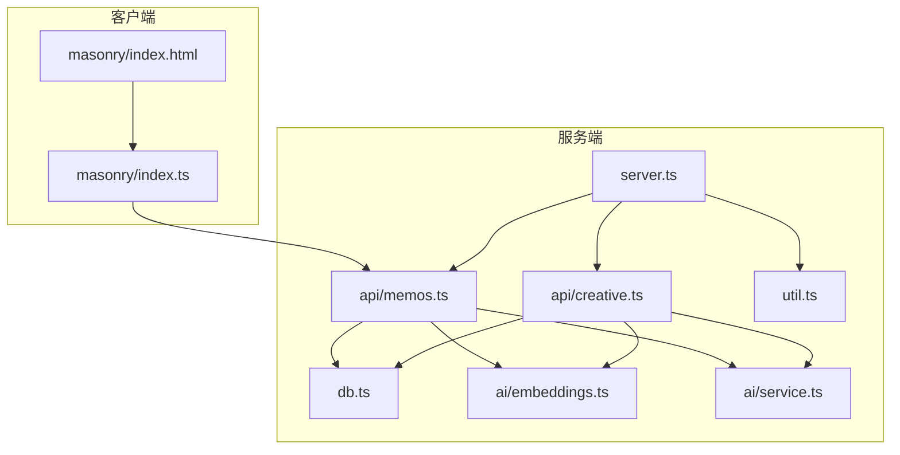
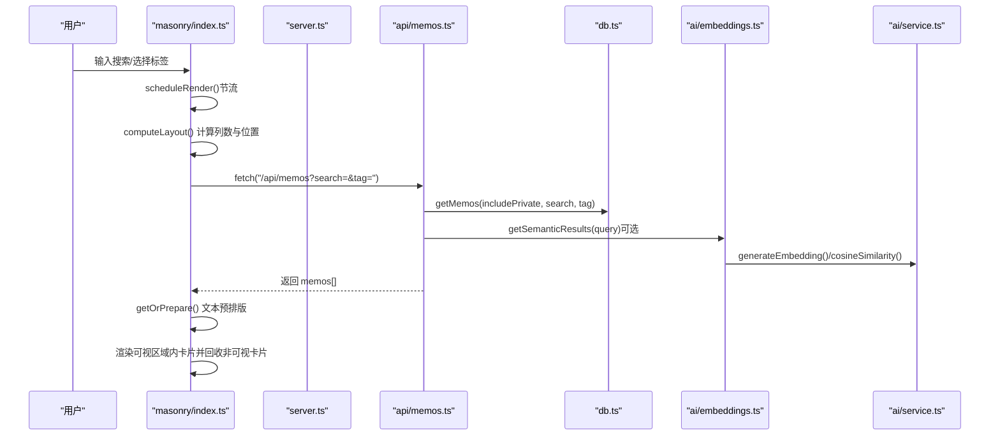
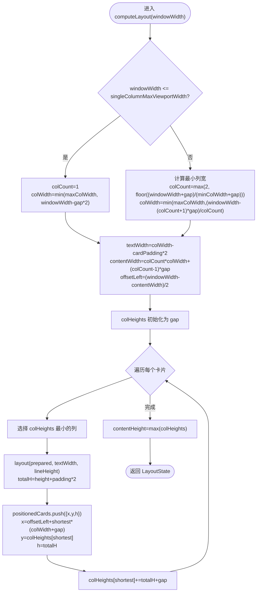
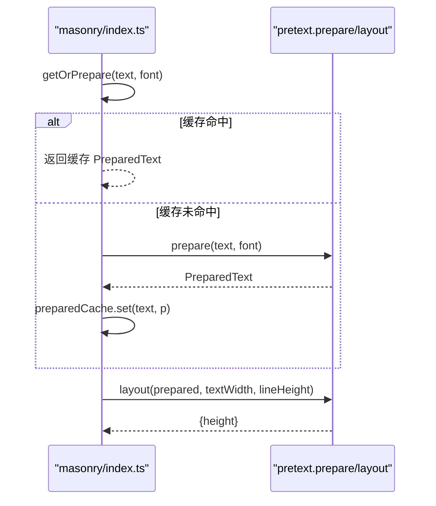
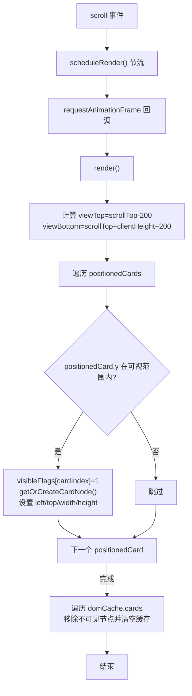
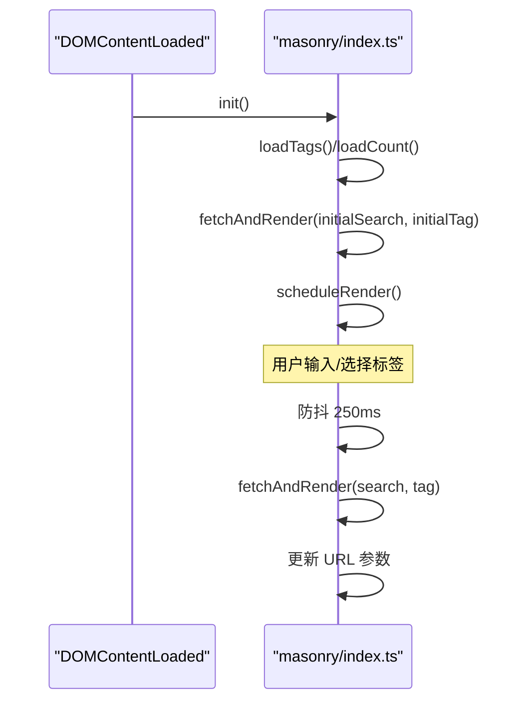
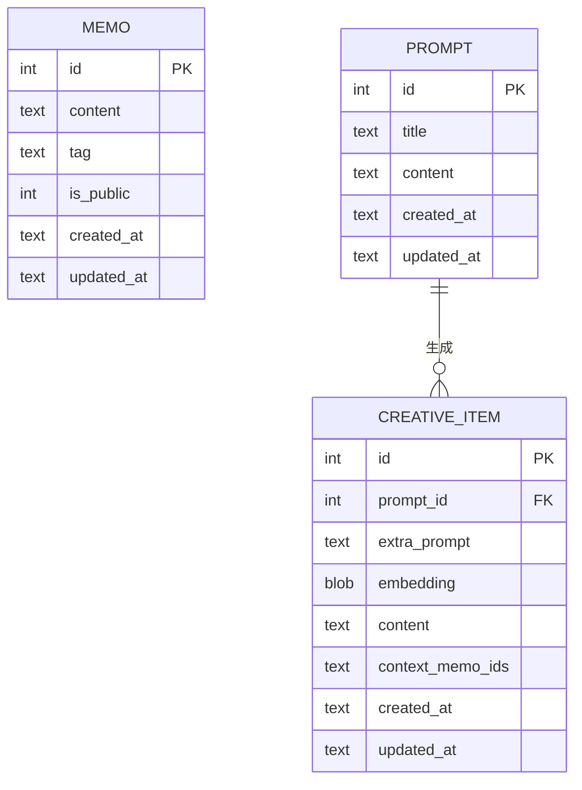
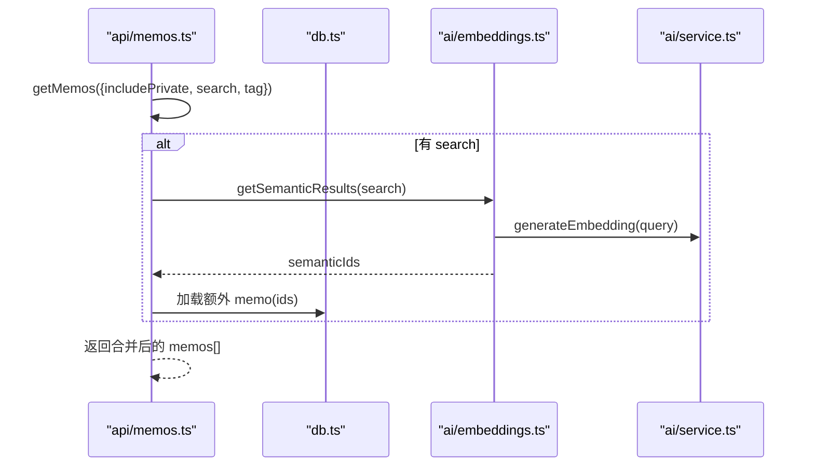
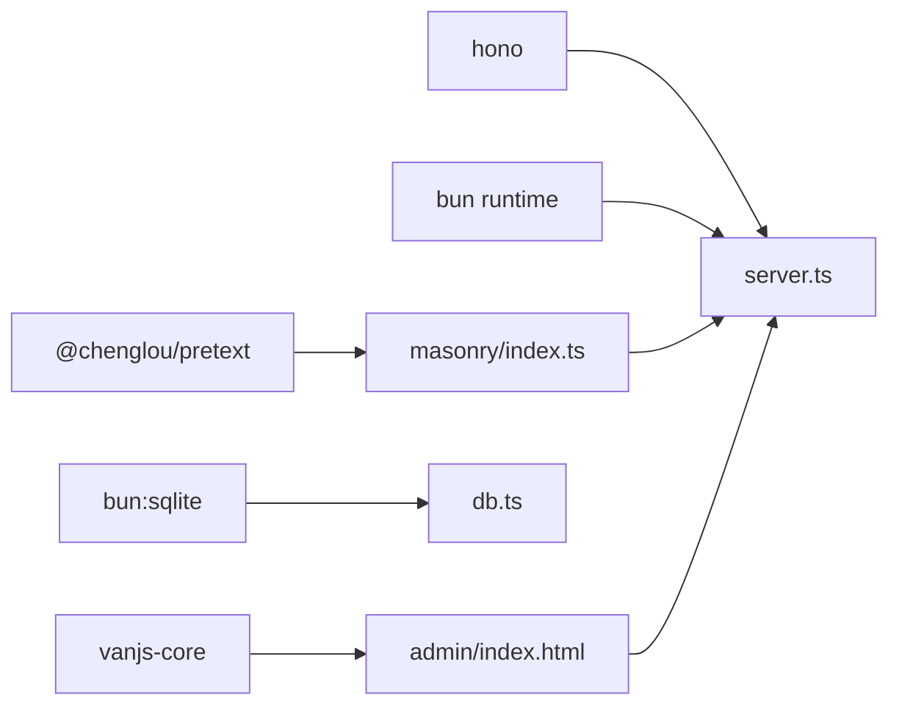

# 瀑布流展示系统

<cite>
**本文档引用的文件**
- [src/masonry/index.ts](file://src/masonry/index.ts)
- [src/masonry/index.html](file://src/masonry/index.html)
- [src/api/memos.ts](file://src/api/memos.ts)
- [src/db.ts](file://src/db.ts)
- [src/server.ts](file://src/server.ts)
- [src/util.ts](file://src/util.ts)
- [src/ai/embeddings.ts](file://src/ai/embeddings.ts)
- [src/ai/service.ts](file://src/ai/service.ts)
- [src/api/creative.ts](file://src/api/creative.ts)
- [src/admin/index.html](file://src/admin/index.html)
- [package.json](file://package.json)
- [README.md](file://README.md)
</cite>

## 目录
1. [简介](#简介)
2. [项目结构](#项目结构)
3. [核心组件](#核心组件)
4. [架构总览](#架构总览)
5. [详细组件分析](#详细组件分析)
6. [依赖关系分析](#依赖关系分析)
7. [性能考虑](#性能考虑)
8. [故障排查指南](#故障排查指南)
9. [结论](#结论)
10. [附录](#附录)

## 简介
本项目是一个基于 Bun 运行时的轻量级备忘录系统，提供瀑布流展示界面与管理后台。瀑布流首页采用 Masonry 布局，结合 @chenglou/pretext 文本预排版引擎，实现精确的高度计算与自适应列数；前端通过虚拟滚动仅渲染可视区域内的卡片，显著提升大列表性能；后端提供 REST API，支持搜索、标签筛选、计数等能力，并与 AI 能力（嵌入向量、语义检索、内容优化、标签建议）深度集成。

## 项目结构
- 前端瀑布流页面位于 src/masonry，包含 HTML 模板与 TypeScript 渲染逻辑
- 后端服务位于 src/server.ts，路由到各 API 子应用
- API 实现位于 src/api，如 memos.ts 提供备忘录 CRUD 与查询
- 数据层位于 src/db.ts，封装 SQLite 操作
- 工具函数位于 src/util.ts，提供通用 HTTP 辅助
- AI 能力位于 src/ai，包含嵌入向量缓存与服务调用
- 管理后台位于 src/admin，SPA 界面与样式

图表来源
- [src/masonry/index.html:1-270](file://src/masonry/index.html#L1-L270)
- [src/masonry/index.ts:1-391](file://src/masonry/index.ts#L1-L391)
- [src/server.ts:1-127](file://src/server.ts#L1-L127)
- [src/api/memos.ts:1-139](file://src/api/memos.ts#L1-L139)
- [src/api/creative.ts:1-238](file://src/api/creative.ts#L1-L238)
- [src/db.ts:1-349](file://src/db.ts#L1-L349)
- [src/util.ts:1-43](file://src/util.ts#L1-L43)
- [src/ai/embeddings.ts:1-99](file://src/ai/embeddings.ts#L1-L99)
- [src/ai/service.ts:1-289](file://src/ai/service.ts#L1-L289)

章节来源
- [README.md:25-46](file://README.md#L25-L46)
- [package.json:1-22](file://package.json#L1-L22)

## 核心组件
- 瀑布流渲染引擎：负责列数计算、卡片定位、可视区域裁剪与 DOM 复用
- 文本预排版引擎：基于 @chenglou/pretext 计算文本在指定宽度下的高度
- 虚拟滚动：仅渲染可视区域卡片，滚动事件节流与按需回收
- 响应式布局：根据窗口宽度切换单列/多列，适配移动端与桌面端
- 数据获取与过滤：支持搜索关键词与标签筛选，URL 同步状态
- 后端 API：提供 memos 列表、计数、标签、CRUD 等接口，支持语义检索融合

章节来源
- [src/masonry/index.ts:146-196](file://src/masonry/index.ts#L146-L196)
- [src/masonry/index.ts:232-269](file://src/masonry/index.ts#L232-L269)
- [src/masonry/index.html:136-173](file://src/masonry/index.html#L136-L173)
- [src/api/memos.ts:20-47](file://src/api/memos.ts#L20-L47)

## 架构总览
瀑布流系统从前端渲染到后端 API 的整体流程如下：

图表来源
- [src/masonry/index.ts:218-269](file://src/masonry/index.ts#L218-L269)
- [src/masonry/index.ts:308-351](file://src/masonry/index.ts#L308-L351)
- [src/api/memos.ts:20-47](file://src/api/memos.ts#L20-L47)
- [src/db.ts:99-131](file://src/db.ts#L99-L131)
- [src/ai/embeddings.ts:66-86](file://src/ai/embeddings.ts#L66-L86)
- [src/ai/service.ts:147-181](file://src/ai/service.ts#L147-L181)

## 详细组件分析

### Masonry 布局与列高度管理
- 列数计算：根据窗口宽度与最小列宽阈值动态决定列数，窄屏单列，宽屏多列
- 列宽与偏移：计算每列宽度、内容区总宽度与容器左偏移，保证居中
- 列高度数组：使用 Float64Array 维护每列当前累积高度，初始填充间距
- 卡片放置策略：每次选择最短列插入，计算预排版高度后累加高度与间距
- 内容高度：遍历列高取最大值作为容器高度

图表来源
- [src/masonry/index.ts:146-196](file://src/masonry/index.ts#L146-L196)

章节来源
- [src/masonry/index.ts:146-196](file://src/masonry/index.ts#L146-L196)

### 文本预排版引擎 @chenglou/pretext 集成
- 预处理缓存：以文本为键缓存 prepare 结果，避免重复计算
- 预排版高度：layout 返回文本在给定宽度下的高度，用于精确卡片高度
- 字体与行高：通过全局配置字体、行高、内边距、间距等参数

图表来源
- [src/masonry/index.ts:53-61](file://src/masonry/index.ts#L53-L61)
- [src/masonry/index.ts:177-178](file://src/masonry/index.ts#L177-L178)

章节来源
- [src/masonry/index.ts:4-9](file://src/masonry/index.ts#L4-L9)
- [src/masonry/index.ts:53-61](file://src/masonry/index.ts#L53-L61)
- [src/masonry/index.ts:177-178](file://src/masonry/index.ts#L177-L178)

### 虚拟滚动与 DOM 复用
- 视口计算：滚动时读取 scrollTop、clientHeight，设定上下边界缓冲区
- 可见性标记：使用 Uint8Array 标记每个卡片是否在可视范围内
- 节流渲染：使用 requestAnimationFrame 合并多次滚动事件
- DOM 复用：仅创建/显示可视卡片节点，非可视卡片移除并清空缓存

图表来源
- [src/masonry/index.ts:218-269](file://src/masonry/index.ts#L218-L269)

章节来源
- [src/masonry/index.ts:218-269](file://src/masonry/index.ts#L218-L269)

### 响应式设计与布局适配
- 移动优先：在窄屏下强制单列，限制最大列宽，确保阅读体验
- 多列自适应：宽屏下根据最小列宽阈值与间隙计算列数，保证列宽上限
- 容器居中：根据内容宽度与窗口宽度计算容器左偏移，保持视觉居中
- UI 布局：顶部搜索栏与标签选择器在小屏下换行与收缩，按钮与输入框自适应

章节来源
- [src/masonry/index.html:136-173](file://src/masonry/index.html#L136-L173)
- [src/masonry/index.ts:146-165](file://src/masonry/index.ts#L146-L165)

### 数据交互与实时更新机制
- 初始加载：从 URL 读取 search/tag 参数，加载标签与计数，触发首次数据请求
- 搜索与筛选：防抖输入（250ms），组合 search 与 tag 参数查询
- URL 同步：更新历史记录，支持前进/后退与书签
- 错误处理：统一状态提示与错误消息展示

图表来源
- [src/masonry/index.ts:356-390](file://src/masonry/index.ts#L356-L390)
- [src/masonry/index.ts:354-366](file://src/masonry/index.ts#L354-L366)
- [src/masonry/index.ts:308-351](file://src/masonry/index.ts#L308-L351)

章节来源
- [src/masonry/index.ts:356-390](file://src/masonry/index.ts#L356-L390)
- [src/masonry/index.ts:354-366](file://src/masonry/index.ts#L354-L366)
- [src/masonry/index.ts:308-351](file://src/masonry/index.ts#L308-L351)

### 后端 API 与数据模型
- 备忘录 API：支持分页查询、搜索、标签筛选、计数、标签列表、CRUD
- 语义检索：查询时同时执行向量相似度匹配，合并结果集
- 数据模型：Memo、Prompt、CreativeItem 等实体定义

图表来源
- [src/model.ts:1-27](file://src/model.ts#L1-L27)
- [src/db.ts:17-56](file://src/db.ts#L17-L56)

章节来源
- [src/api/memos.ts:20-60](file://src/api/memos.ts#L20-L60)
- [src/db.ts:99-148](file://src/db.ts#L99-L148)
- [src/model.ts:1-27](file://src/model.ts#L1-L27)

### AI 集成与语义检索
- 嵌入向量缓存：内存中维护 memo_id -> Float32Array 映射，持久化到 SQLite
- 语义相似度：余弦相似度计算，高于阈值的 ID 参与结果合并
- 内容优化与标签建议：通过 DeepSeek API 提供写作优化与标签建议
- 流式创意生成：SSE 流式输出，完成后落库保存

图表来源
- [src/api/memos.ts:29-44](file://src/api/memos.ts#L29-L44)
- [src/ai/embeddings.ts:66-86](file://src/ai/embeddings.ts#L66-L86)
- [src/ai/service.ts:147-181](file://src/ai/service.ts#L147-L181)

章节来源
- [src/ai/embeddings.ts:1-99](file://src/ai/embeddings.ts#L1-L99)
- [src/ai/service.ts:1-289](file://src/ai/service.ts#L1-L289)
- [src/api/memos.ts:29-44](file://src/api/memos.ts#L29-L44)

## 依赖关系分析
- 前端依赖：@chenglou/pretext 用于文本预排版；vanjs-core 用于管理后台（在 admin 中使用）
- 运行时：Bun（内置 SQLite、HTTP 服务器、构建工具）
- 框架：Hono 作为后端路由框架
- 服务端构建：Bun.build 将 TS 按需编译为 ES Module JS

图表来源
- [package.json:16-21](file://package.json#L16-L21)
- [src/masonry/index.ts:1-1](file://src/masonry/index.ts#L1-L1)
- [src/admin/index.html:1-849](file://src/admin/index.html#L1-L849)
- [src/server.ts:1-127](file://src/server.ts#L1-L127)

章节来源
- [package.json:16-21](file://package.json#L16-L21)
- [src/server.ts:15-51](file://src/server.ts#L15-L51)

## 性能考虑
- 渲染优化
  - 使用 requestAnimationFrame 合并滚动事件，降低重绘频率
  - 仅渲染可视区域卡片，非可视卡片及时移除，避免 DOM 节点膨胀
  - 预排版缓存避免重复计算，减少 layout 调用次数
- 内存管理
  - DOM 节点复用：可视卡片复用同一 div，非可视移除并清空缓存
  - 预排版缓存：Map 以文本为键，注意清理不再使用的键值
  - 列高数组：Float64Array 一次性分配，避免频繁分配
- 布局与计算
  - 列数与列宽计算在窗口尺寸变化或数据变更时进行，避免在滚动中重复计算
  - 视口缓冲区（上下各 200px）减少频繁的可见性判断
- 网络与 API
  - 搜索输入防抖 250ms，减少请求频率
  - URL 同步避免重复请求相同参数
- AI 与向量
  - 嵌入向量缓存仅在可用时初始化，避免无效请求
  - 语义检索阈值控制结果数量，避免过多合并

章节来源
- [src/masonry/index.ts:218-269](file://src/masonry/index.ts#L218-L269)
- [src/masonry/index.ts:53-61](file://src/masonry/index.ts#L53-L61)
- [src/masonry/index.ts:146-196](file://src/masonry/index.ts#L146-L196)
- [src/ai/embeddings.ts:12-35](file://src/ai/embeddings.ts#L12-L35)

## 故障排查指南
- 瀑布流不显示或空白
  - 检查网络请求是否成功，确认 /api/memos 返回 memos 数组
  - 查看状态提示元素是否显示错误信息
  - 确认 URL 参数 search/tag 是否导致空结果
- 滚动卡顿或闪烁
  - 检查是否有大量 DOM 节点未被回收
  - 确认 requestAnimationFrame 是否被正确调度
  - 检查预排版缓存是否命中，避免重复 layout
- 响应式布局异常
  - 检查 viewport meta 标签与媒体查询
  - 确认窄屏单列逻辑是否生效
- AI 功能不可用
  - 检查环境变量 DEEPSEEK_API_KEY 或 DASHSCOPE_API_KEY 是否配置
  - 查看控制台错误日志，确认 API 调用超时或失败
- 后端服务问题
  - 确认数据库初始化是否成功（首次启动自动创建表）
  - 检查端口占用与进程状态

章节来源
- [src/masonry/index.ts:64-80](file://src/masonry/index.ts#L64-L80)
- [src/masonry/index.ts:347-351](file://src/masonry/index.ts#L347-L351)
- [src/ai/service.ts:12-26](file://src/ai/service.ts#L12-L26)
- [src/server.ts:114-127](file://src/server.ts#L114-L127)

## 结论
该瀑布流展示系统通过 Masonry 布局与 @chenglou/pretext 文本预排版，实现了精确且高效的卡片高度计算；配合虚拟滚动与 DOM 复用，有效支撑了大规模数据的流畅展示。后端 API 提供完善的搜索、筛选与计数能力，并与 AI 能力深度融合，支持语义检索与内容增强。整体架构简洁、性能优良，适合中小规模到中等规模的数据展示场景。

## 附录

### 自定义配置选项
- 布局参数（可在源码中调整）
  - 字体与行高：影响文本预排版高度
  - 卡片内边距与列间距：影响列宽与可视区域
  - 最大列宽：限制列宽上限
  - 单列阈值：小于等于该宽度时强制单列
- 虚拟滚动参数
  - 视口缓冲区：滚动时上下的缓冲像素，减少频繁可见性判断
  - 防抖时间：输入搜索的防抖间隔
- AI 语义检索
  - 相似度阈值：过滤低相似度结果
  - 结果上限：限制语义检索返回数量

章节来源
- [src/masonry/index.ts:4-9](file://src/masonry/index.ts#L4-L9)
- [src/masonry/index.ts:242-243](file://src/masonry/index.ts#L242-L243)
- [src/masonry/index.ts:354-366](file://src/masonry/index.ts#L354-L366)
- [src/ai/embeddings.ts:7-86](file://src/ai/embeddings.ts#L7-L86)