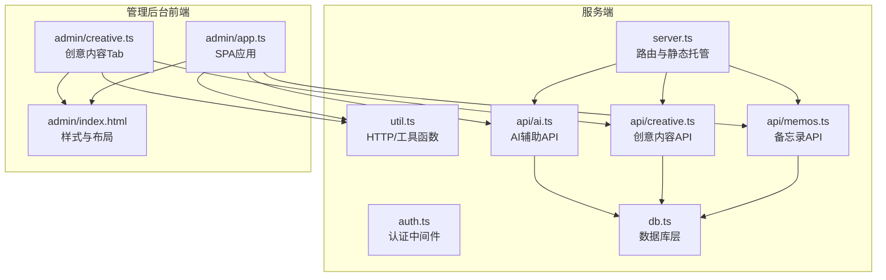
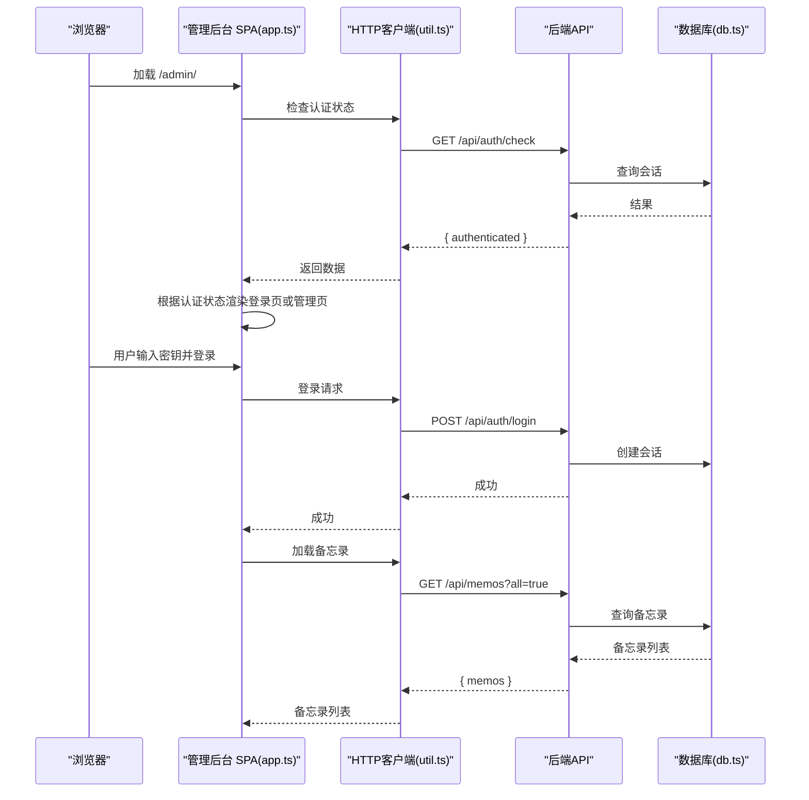
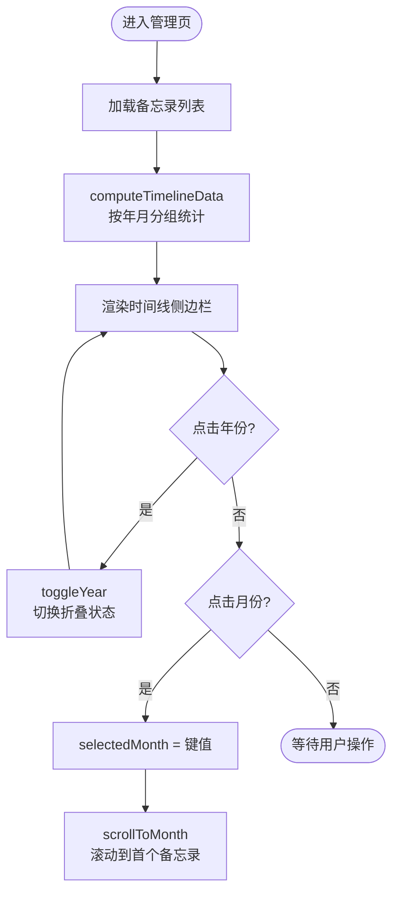
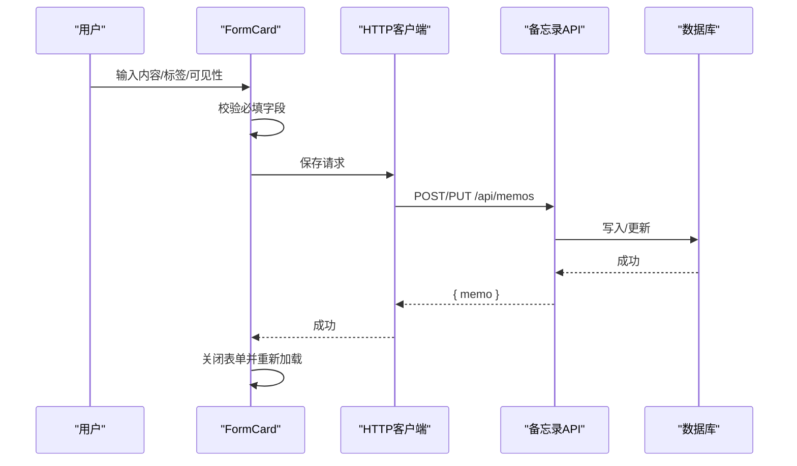
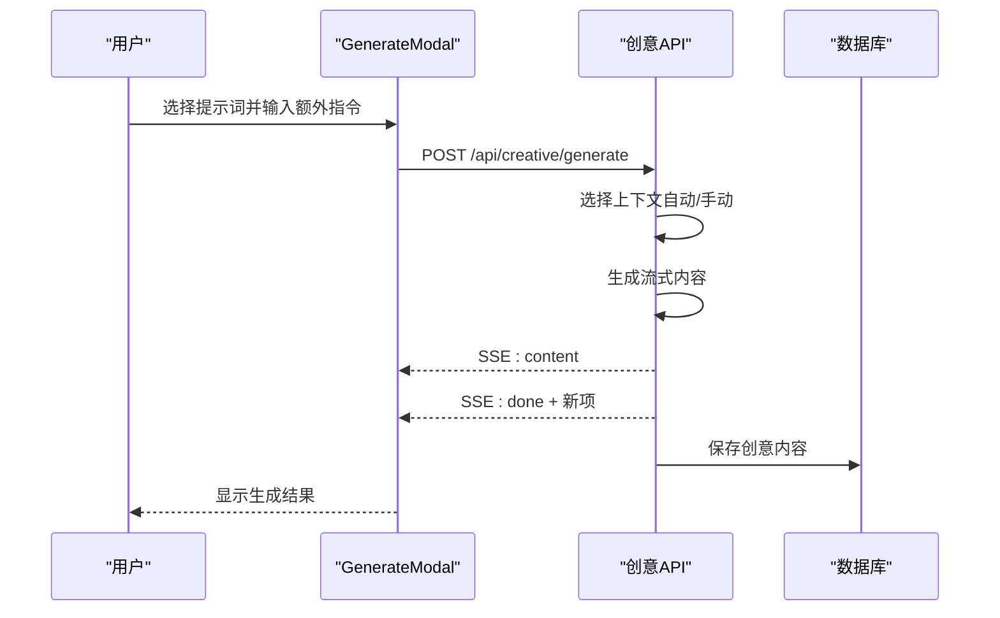
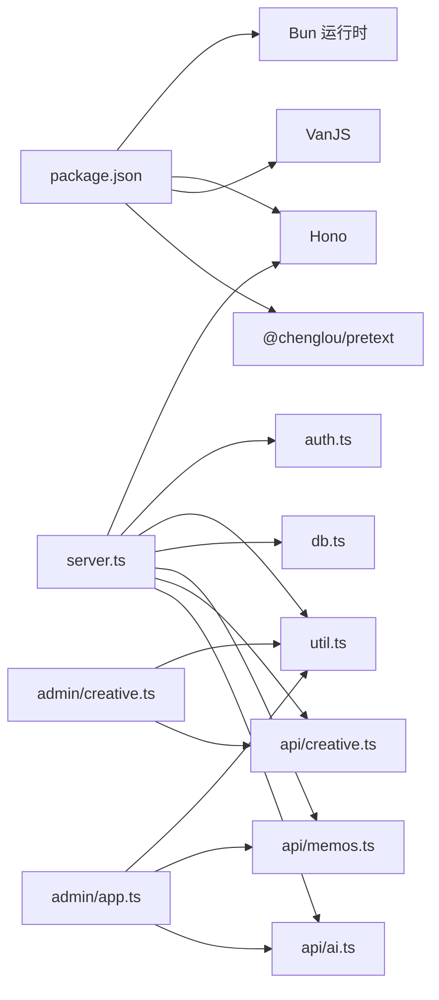

# 管理后台系统

<cite>
**本文档引用的文件**
- [README.md](file://README.md)
- [package.json](file://package.json)
- [src/server.ts](file://src/server.ts)
- [src/auth.ts](file://src/auth.ts)
- [src/util.ts](file://src/util.ts)
- [src/model.ts](file://src/model.ts)
- [src/db.ts](file://src/db.ts)
- [src/admin/app.ts](file://src/admin/app.ts)
- [src/admin/index.html](file://src/admin/index.html)
- [src/admin/creative.ts](file://src/admin/creative.ts)
- [src/api/memos.ts](file://src/api/memos.ts)
- [src/api/creative.ts](file://src/api/creative.ts)
- [src/api/ai.ts](file://src/api/ai.ts)
</cite>

## 目录
1. [简介](#简介)
2. [项目结构](#项目结构)
3. [核心组件](#核心组件)
4. [架构总览](#架构总览)
5. [详细组件分析](#详细组件分析)
6. [依赖关系分析](#依赖关系分析)
7. [性能考虑](#性能考虑)
8. [故障排查指南](#故障排查指南)
9. [结论](#结论)
10. [附录](#附录)

## 简介
本项目是一个基于 Bun 运行时的轻量级备忘录应用系统，提供公开/私密备忘录管理、标签分类、全文搜索、瀑布流展示以及独立的管理后台。管理后台采用 VanJS 响应式 UI 框架构建，提供备忘录的增删改查、时间线导航、创意内容生成与编辑等功能。系统通过 SQLite 数据库存储数据，使用 Hono 作为后端框架，提供 RESTful API 并支持 SSE 流式响应。

## 项目结构
项目采用前后端分离的模块化组织方式，核心目录与文件如下：
- src/server.ts：主服务入口，负责路由注册、静态资源与页面托管、客户端代码构建与缓存。
- src/admin/：管理后台前端源码，包含 SPA 应用与样式。
- src/api/：后端 API 子应用，按功能拆分为认证、备忘录、创意内容、AI 辅助等模块。
- src/db.ts：数据库初始化与 CRUD 操作封装，包含 memos、prompts、creative 三张核心表。
- src/auth.ts：会话与认证中间件，基于内存 Set 存储会话令牌，支持 Cookie 管理与登录频率限制。
- src/util.ts：通用工具函数，如 HTTP 客户端封装、日期格式化、字符串截断等。
- src/model.ts：数据模型定义，包括 Memo、Prompt、CreativeItem。
- src/masonry/：首页瀑布流展示（非本文重点，但与整体项目相关）。

图表来源
- [src/server.ts:74-127](file://src/server.ts#L74-L127)
- [src/admin/app.ts:1-677](file://src/admin/app.ts#L1-L677)
- [src/admin/creative.ts:1-702](file://src/admin/creative.ts#L1-L702)
- [src/admin/index.html:1-849](file://src/admin/index.html#L1-L849)
- [src/api/memos.ts:1-139](file://src/api/memos.ts#L1-L139)
- [src/api/creative.ts:1-238](file://src/api/creative.ts#L1-L238)
- [src/api/ai.ts:1-67](file://src/api/ai.ts#L1-L67)
- [src/db.ts:1-349](file://src/db.ts#L1-L349)
- [src/auth.ts:1-111](file://src/auth.ts#L1-L111)
- [src/util.ts:1-43](file://src/util.ts#L1-L43)

章节来源
- [README.md:25-45](file://README.md#L25-L45)
- [src/server.ts:74-127](file://src/server.ts#L74-L127)

## 核心组件
- 响应式状态管理：使用 VanJS 的 van.state 实现全局状态管理，涵盖认证状态、备忘录列表、表单状态、时间线状态、AI 功能状态等。
- 组件化 UI：通过 VanJS 标签 API 渲染组件，如登录页、表单卡片、备忘录卡片、时间线侧边栏、创意内容标签云与生成模态框等。
- API 通信：统一的 HTTP 客户端封装，支持同源 Cookie 传递与错误处理。
- 数据模型：清晰的数据接口定义，确保前后端数据一致性。
- 权限控制：基于 Cookie 的会话认证，中间件拦截未授权请求。

章节来源
- [src/admin/app.ts:13-31](file://src/admin/app.ts#L13-L31)
- [src/admin/app.ts:343-663](file://src/admin/app.ts#L343-L663)
- [src/admin/creative.ts:12-39](file://src/admin/creative.ts#L12-L39)
- [src/util.ts:9-20](file://src/util.ts#L9-L20)
- [src/model.ts:1-28](file://src/model.ts#L1-L28)
- [src/auth.ts:94-111](file://src/auth.ts#L94-L111)

## 架构总览
系统采用“前端 SPA + 后端 API”的分层架构。前端管理后台通过 fetch 与后端 API 通信，后端 API 使用 Hono 路由子应用进行模块化组织，数据库操作集中在 db.ts 中，认证逻辑在 auth.ts 中实现。

图表来源
- [src/admin/app.ts:40-74](file://src/admin/app.ts#L40-L74)
- [src/util.ts:9-20](file://src/util.ts#L9-L20)
- [src/api/memos.ts:20-47](file://src/api/memos.ts#L20-L47)
- [src/auth.ts:94-111](file://src/auth.ts#L94-L111)

## 详细组件分析

### 时间线导航功能
时间线导航用于按年月分组显示备忘录，支持折叠/展开年份与月份选择跳转至对应备忘录位置。

- 状态管理
  - selectedMonth：当前选中的月份键（如 "2026-01"），用于高亮侧边栏月份项。
  - collapsedYears：Set<number>，记录被折叠的年份集合。
- 数据计算
  - computeTimelineData：遍历备忘录列表，按年月聚合统计数量并记录每个分组的第一个备忘录 ID。
- 交互行为
  - 点击年份标题切换折叠状态。
  - 点击月份项更新选中月份并滚动到该月份第一个备忘录位置。
  - scrollToMonth：根据 memoId 查找对应 DOM 节点并平滑滚动到视窗顶部。

图表来源
- [src/admin/app.ts:260-315](file://src/admin/app.ts#L260-L315)
- [src/admin/app.ts:343-385](file://src/admin/app.ts#L343-L385)

章节来源
- [src/admin/app.ts:231-315](file://src/admin/app.ts#L231-L315)
- [src/admin/app.ts:343-385](file://src/admin/app.ts#L343-L385)

### 表单处理系统
表单处理覆盖备忘录的创建与编辑，包含数据验证、提交与错误处理。

- 表单状态
  - formMode：{ type: "closed" | "create" | "edit"; id? }
  - formContent、formIsPublic、formTag：表单字段双向绑定。
  - formError、formSaving：错误提示与保存状态。
- 表单行为
  - openCreateForm/openEditForm：打开表单并填充初始值，同时滚动到页面顶部。
  - saveForm：校验内容必填，构造请求体，调用 API 创建或更新，成功后关闭表单并重新加载数据。
  - toggleVisibility：切换公开/私密状态。
  - deleteMemo：二次确认删除，删除成功后刷新列表。
- 错误处理
  - API 调用异常时设置 formError 或 globalError。
  - 登录/登出流程中捕获错误并显示。

图表来源
- [src/admin/app.ts:89-114](file://src/admin/app.ts#L89-L114)
- [src/admin/app.ts:116-126](file://src/admin/app.ts#L116-L126)
- [src/admin/app.ts:128-139](file://src/admin/app.ts#L128-L139)
- [src/api/memos.ts:62-91](file://src/api/memos.ts#L62-L91)
- [src/api/memos.ts:93-126](file://src/api/memos.ts#L93-L126)

章节来源
- [src/admin/app.ts:89-139](file://src/admin/app.ts#L89-L139)
- [src/api/memos.ts:62-126](file://src/api/memos.ts#L62-L126)

### 创意内容管理功能
创意内容管理包含提示词（Prompt）的增删改查与创意内容的生成、展示与删除。生成过程支持自动语义检索上下文或手动指定备忘录 ID。

- 提示词管理
  - loadPrompts/selectPrompt/openPromptCreate/openPromptEdit/closePromptForm/savePromptForm/deletePrompt：完整的 CRUD 流程。
- 生成流程
  - handleGenerate：校验输入，构造请求体，调用 /api/creative/generate，使用 SSE 流式接收内容，完成后保存到数据库并在前端列表顶部插入新项。
  - GenerateModal：提供额外指令输入、上下文模式切换（自动/手动）、手动 ID 输入与流式输出展示。
- 读取更多
  - ReadMoreModal：展示完整创意内容与生成信息。

图表来源
- [src/admin/creative.ts:144-244](file://src/admin/creative.ts#L144-L244)
- [src/api/creative.ts:112-228](file://src/api/creative.ts#L112-L228)
- [src/admin/creative.ts:362-540](file://src/admin/creative.ts#L362-L540)

章节来源
- [src/admin/creative.ts:42-137](file://src/admin/creative.ts#L42-L137)
- [src/admin/creative.ts:144-244](file://src/admin/creative.ts#L144-L244)
- [src/admin/creative.ts:362-540](file://src/admin/creative.ts#L362-L540)
- [src/api/creative.ts:112-228](file://src/api/creative.ts#L112-L228)

### 用户界面组件文档
管理后台采用内联样式与类名组合的方式实现 UI 组件，主要组件包括：
- 登录卡片：密码输入、登录按钮、错误提示。
- 顶部栏：标题、动作区（新建备忘录/新建提示词、返回站点、退出登录）。
- 标签页：Memos 与 Creative 两个 Tab。
- 表单卡片：文本域、AI 工具栏、标签输入、公开/私密勾选、取消/保存按钮、错误提示。
- 备忘录卡片：内容、元信息（ID、公开/私密徽章、标签、创建/更新时间）、操作按钮（切换可见性、编辑、删除）。
- 时间线侧边栏：年份折叠/展开、月份列表、计数徽标、选中高亮。
- 创意内容标签云：提示词列表、编辑/删除操作、选中高亮。
- 生成模态框：额外指令输入、上下文模式切换、手动 ID 输入、流式输出展示、错误提示。
- 读取更多模态框：完整内容展示与生成信息。

章节来源
- [src/admin/index.html:21-849](file://src/admin/index.html#L21-L849)
- [src/admin/app.ts:387-663](file://src/admin/app.ts#L387-L663)
- [src/admin/creative.ts:261-701](file://src/admin/creative.ts#L261-L701)

### 与后端 API 的通信协议与数据同步
- 通信协议
  - 同源 Cookie：fetch 默认携带 Cookie，用于会话认证。
  - 错误处理：HTTP 客户端封装统一抛出错误，前端捕获并显示。
- 数据同步
  - 备忘录：GET /api/memos?all=true 获取管理员视角的全部备忘录；创建/更新/删除后立即刷新列表。
  - 创意内容：GET /api/creative?prompt_id=... 按提示词过滤；POST /api/creative/generate 使用 SSE 流式推送，完成后插入新项。
  - AI 辅助：GET /api/ai/status 检测可用能力；POST /api/ai/optimize 内容优化；POST /api/ai/suggest-tags 标签建议。
- 认证流程
  - 登录：POST /api/auth/login，服务端创建会话并设置 Cookie。
  - 登出：POST /api/auth/logout，清除会话与 Cookie。
  - 检查：GET /api/auth/check，返回认证状态。

章节来源
- [src/util.ts:9-20](file://src/util.ts#L9-L20)
- [src/api/memos.ts:20-47](file://src/api/memos.ts#L20-L47)
- [src/api/creative.ts:101-110](file://src/api/creative.ts#L101-L110)
- [src/api/creative.ts:112-228](file://src/api/creative.ts#L112-L228)
- [src/api/ai.ts:8-67](file://src/api/ai.ts#L8-L67)
- [src/auth.ts:94-111](file://src/auth.ts#L94-L111)

### 安全机制与权限控制
- 会话与 Cookie
  - 使用内存 Set 存储会话令牌，支持创建、销毁与 Cookie 设置/清除。
  - Cookie 属性：HttpOnly、SameSite=Strict、Path=/、Max-Age=86400。
- 认证中间件
  - requireAuth：检查请求是否携带有效会话令牌，未通过返回 401。
  - authMiddleware：Hono 中间件，拦截未授权请求。
- 登录频率限制
  - 每个 IP 最多 5 次尝试，冷却时间为 60 秒，超过次数则返回剩余冷却时间。
- 环境配置
  - MEMOS_SECRET_KEY：管理员登录密钥，默认值可在 README 中查看。

章节来源
- [src/auth.ts:1-111](file://src/auth.ts#L1-L111)
- [README.md:59-65](file://README.md#L59-L65)

## 依赖关系分析
- 运行时与依赖
  - Bun：运行时与内置 SQLite、HTTP Server。
  - Hono：后端路由框架。
  - VanJS：前端响应式 UI 框架。
  - @chenglou/pretext：首页瀑布流文字排版。
- 模块耦合
  - 前端 app.ts/creative.ts 依赖 util.ts 的 HTTP 客户端与工具函数。
  - 后端各 API 子应用依赖 db.ts 的数据访问层。
  - server.ts 作为入口，统一挂载各子应用与静态资源。

图表来源
- [package.json:16-21](file://package.json#L16-L21)
- [src/server.ts:1-127](file://src/server.ts#L1-L127)
- [src/admin/app.ts:1-677](file://src/admin/app.ts#L1-L677)
- [src/admin/creative.ts:1-702](file://src/admin/creative.ts#L1-L702)
- [src/api/memos.ts:1-139](file://src/api/memos.ts#L1-L139)
- [src/api/creative.ts:1-238](file://src/api/creative.ts#L1-L238)
- [src/api/ai.ts:1-67](file://src/api/ai.ts#L1-L67)
- [src/db.ts:1-349](file://src/db.ts#L1-L349)
- [src/auth.ts:1-111](file://src/auth.ts#L1-L111)
- [src/util.ts:1-43](file://src/util.ts#L1-L43)

章节来源
- [package.json:16-21](file://package.json#L16-L21)
- [src/server.ts:74-127](file://src/server.ts#L74-L127)

## 性能考虑
- 前端性能
  - 响应式状态最小化更新，避免不必要的重渲染。
  - 表单与 AI 功能使用防抖与节流策略（如标签建议的定时器）。
  - 滚动定位使用 smooth 滚动，提升用户体验。
- 后端性能
  - 客户端代码按需构建与缓存，减少重复编译开销。
  - SSE 流式输出，避免一次性传输大块内容。
  - 语义检索与 LIKE 查询并行，提升搜索体验。
- 数据库性能
  - WAL 模式与外键约束启用，保证一致性与性能。
  - 按需查询与索引友好的 SQL 构造。

## 故障排查指南
- 登录失败
  - 检查 MEMOS_SECRET_KEY 是否正确，确认 Cookie 是否设置成功。
  - 查看登录频率限制是否触发冷却。
- API 请求失败
  - 检查 /api/auth/check 是否返回已认证，确认 Cookie 是否随请求发送。
  - 对于 SSE 生成，确认 /api/creative/generate 返回状态与流式数据格式。
- 数据不一致
  - 确认 /api/memos?all=true 是否返回预期结果。
  - 检查数据库连接与表结构初始化是否完成。
- 前端组件异常
  - 检查样式类名与事件绑定，确认 DOM 查询（如 scrollToMonth）是否能找到目标元素。

章节来源
- [src/auth.ts:57-88](file://src/auth.ts#L57-L88)
- [src/util.ts:9-20](file://src/util.ts#L9-L20)
- [src/api/creative.ts:112-228](file://src/api/creative.ts#L112-L228)
- [src/admin/app.ts:300-305](file://src/admin/app.ts#L300-L305)

## 结论
本管理后台系统以 VanJS 为核心构建响应式 SPA，结合 Hono 后端 API 与 SQLite 数据存储，实现了从认证、内容管理到创意内容生成的完整闭环。系统具备良好的模块化结构、清晰的状态管理与完善的错误处理机制，适合在小型团队或个人项目中快速部署与扩展。

## 附录
- 实际使用示例
  - 登录：访问 /admin，输入密钥后登录。
  - 创建备忘录：点击“+ New Memo”，填写内容与标签，勾选公开/私密，点击保存。
  - 生成创意内容：在 Creative Tab 中选择提示词，点击 Generate，输入额外指令，选择上下文模式，查看流式输出。
- 自定义扩展方法
  - 新增字段：在 model.ts 中扩展数据模型，在 db.ts 中更新表结构与 CRUD 函数，在前端组件中添加输入与展示。
  - 新增 API：在 src/api 下新增子应用文件，注册路由并在 server.ts 中挂载。
  - 自定义样式：在 admin/index.html 中添加或修改 CSS 规则，注意响应式适配。
  - 权限增强：在 auth.ts 中扩展会话存储与认证策略，或引入数据库持久化。