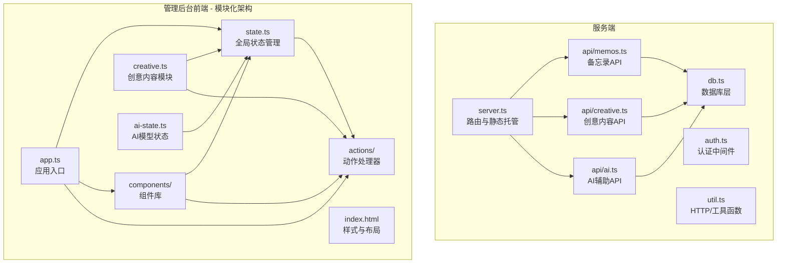
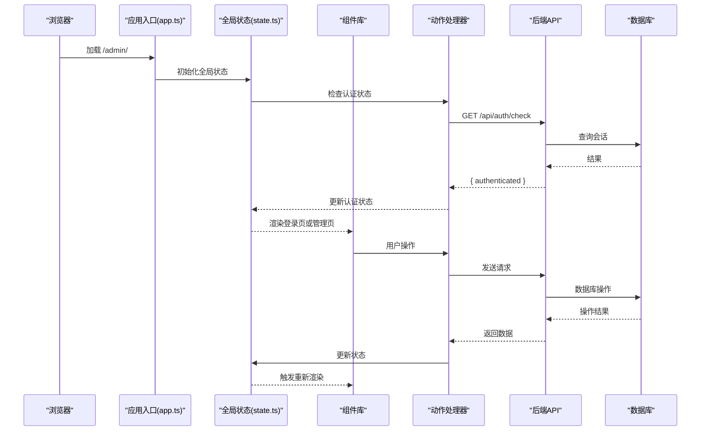
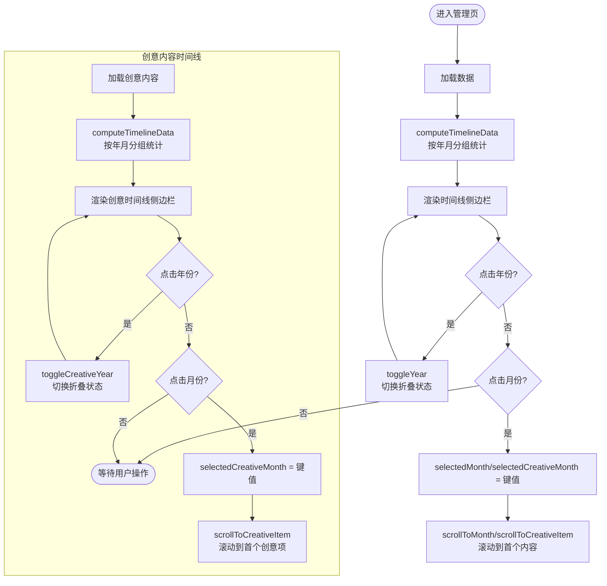
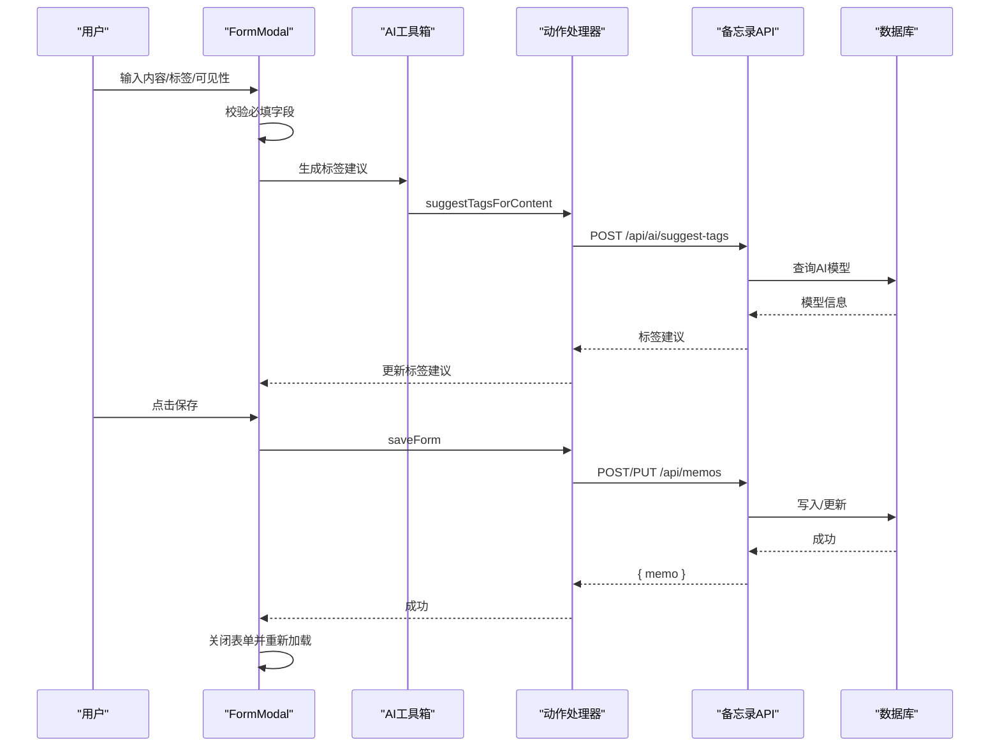
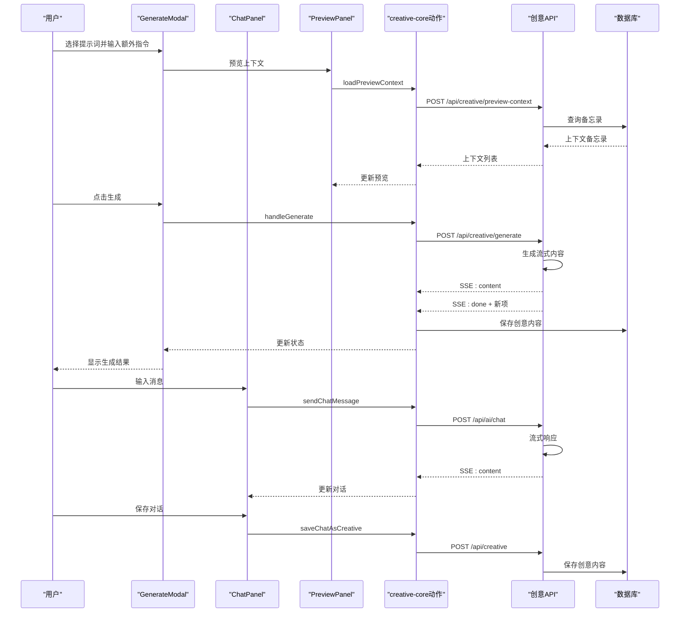
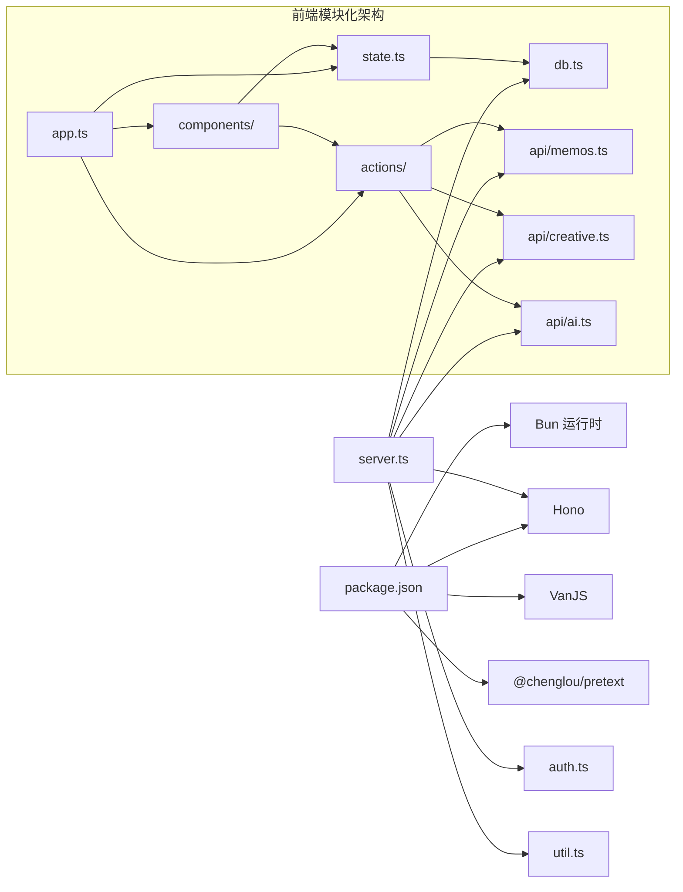

# 管理后台系统

<cite>
**本文档引用的文件**
- [README.md](file://README.md)
- [package.json](file://package.json)
- [src/server.ts](file://src/server.ts)
- [src/auth.ts](file://src/auth.ts)
- [src/util.ts](file://src/util.ts)
- [src/model.ts](file://src/model.ts)
- [src/db.ts](file://src/db.ts)
- [src/frontend/admin/app.ts](file://src/frontend/admin/app.ts)
- [src/frontend/admin/index.html](file://src/frontend/admin/index.html)
- [src/frontend/admin/creative.ts](file://src/frontend/admin/creative.ts)
- [src/frontend/admin/state.ts](file://src/frontend/admin/state.ts)
- [src/frontend/admin/ai-state.ts](file://src/frontend/admin/ai-state.ts)
- [src/frontend/admin/components/MemoCard.ts](file://src/frontend/admin/components/MemoCard.ts)
- [src/frontend/admin/components/FormModal.ts](file://src/frontend/admin/components/FormModal.ts)
- [src/frontend/admin/components/ChatPanel.ts](file://src/frontend/admin/components/ChatPanel.ts)
- [src/frontend/admin/components/GenerateModal.ts](file://src/frontend/admin/components/GenerateModal.ts)
- [src/frontend/admin/components/TimelineSidebar.ts](file://src/frontend/admin/components/TimelineSidebar.ts)
- [src/frontend/admin/components/ModelSelector.ts](file://src/frontend/admin/components/ModelSelector.ts)
- [src/frontend/admin/actions/memo.ts](file://src/frontend/admin/actions/memo.ts)
- [src/frontend/admin/actions/creative-core.ts](file://src/frontend/admin/actions/creative-core.ts)
- [src/frontend/admin/actions/chat.ts](file://src/frontend/admin/actions/chat.ts)
- [src/frontend/admin/actions/ai.ts](file://src/frontend/admin/actions/ai.ts)
- [src/api/memos.ts](file://src/api/memos.ts)
- [src/api/creative.ts](file://src/api/creative.ts)
- [src/api/ai.ts](file://src/api/ai.ts)
</cite>

## 更新摘要
**变更内容**
- 从单页应用重构为模块化组件系统，新增多个专用组件
- 新增状态管理系统，实现全局状态集中管理
- 重构创意内容生成流程，支持对话模式和列表模式
- 新增聊天面板组件，支持智能对话和上下文检索
- 增强表单处理系统，支持 AI 工具箱和标签建议
- 完善时间线导航功能，支持备忘录和创意内容双轨导航

## 目录
1. [简介](#简介)
2. [项目结构](#项目结构)
3. [核心组件](#核心组件)
4. [架构总览](#架构总览)
5. [详细组件分析](#详细组件分析)
6. [状态管理系统](#状态管理系统)
7. [模块化组件系统](#模块化组件系统)
8. [依赖关系分析](#依赖关系分析)
9. [性能考虑](#性能考虑)
10. [故障排查指南](#故障排查指南)
11. [结论](#结论)
12. [附录](#附录)

## 简介
本项目是一个基于 Bun 运行时的轻量级备忘录应用系统，提供公开/私密备忘录管理、标签分类、全文搜索、瀑布流展示以及独立的管理后台。管理后台采用 VanJS 响应式 UI 框架构建，通过模块化组件系统实现备忘录的增删改查、时间线导航、创意内容生成与编辑等功能。系统采用全新的状态管理模式，支持全局状态集中管理，并通过 SQLite 数据库存储数据，使用 Hono 作为后端框架，提供 RESTful API 并支持 SSE 流式响应。

**更新** 重构为模块化组件系统，新增状态管理、聊天面板、AI 工具箱等核心功能。

## 项目结构
项目采用前后端分离的模块化组织方式，核心目录与文件如下：
- src/server.ts：主服务入口，负责路由注册、静态资源与页面托管、客户端代码构建与缓存。
- src/frontend/admin/：管理后台前端源码，采用模块化组件架构，包含状态管理、组件库、动作处理器等。
- src/api/：后端 API 子应用，按功能拆分为认证、备忘录、创意内容、AI 辅助等模块。
- src/db.ts：数据库初始化与 CRUD 操作封装，包含 memos、prompts、creative 三张核心表。
- src/auth.ts：会话与认证中间件，基于内存 Set 存储会话令牌，支持 Cookie 管理与登录频率限制。
- src/util.ts：通用工具函数，如 HTTP 客户端封装、日期格式化、字符串截断等。
- src/model.ts：数据模型定义，包括 Memo、Prompt、CreativeItem。
- src/masonry/：首页瀑布流展示（非本文重点，但与整体项目相关）。

**图表来源**
- [src/server.ts:74-127](file://src/server.ts#L74-L127)
- [src/frontend/admin/app.ts:1-251](file://src/frontend/admin/app.ts#L1-L251)
- [src/frontend/admin/state.ts:1-172](file://src/frontend/admin/state.ts#L1-L172)
- [src/frontend/admin/ai-state.ts:1-10](file://src/frontend/admin/ai-state.ts#L1-L10)
- [src/frontend/admin/creative.ts:1-349](file://src/frontend/admin/creative.ts#L1-L349)
- [src/frontend/admin/components/MemoCard.ts:1-346](file://src/frontend/admin/components/MemoCard.ts#L1-L346)
- [src/frontend/admin/components/FormModal.ts:1-281](file://src/frontend/admin/components/FormModal.ts#L1-L281)
- [src/frontend/admin/components/ChatPanel.ts:1-198](file://src/frontend/admin/components/ChatPanel.ts#L1-L198)
- [src/frontend/admin/components/GenerateModal.ts:1-392](file://src/frontend/admin/components/GenerateModal.ts#L1-L392)
- [src/frontend/admin/components/TimelineSidebar.ts:1-202](file://src/frontend/admin/components/TimelineSidebar.ts#L1-L202)
- [src/frontend/admin/components/ModelSelector.ts:1-65](file://src/frontend/admin/components/ModelSelector.ts#L1-L65)
- [src/frontend/admin/actions/memo.ts:1-231](file://src/frontend/admin/actions/memo.ts#L1-L231)
- [src/frontend/admin/actions/creative-core.ts:1-326](file://src/frontend/admin/actions/creative-core.ts#L1-L326)
- [src/frontend/admin/actions/chat.ts:1-126](file://src/frontend/admin/actions/chat.ts#L1-L126)
- [src/frontend/admin/actions/ai.ts:1-237](file://src/frontend/admin/actions/ai.ts#L1-L237)

**章节来源**
- [README.md:25-45](file://README.md#L25-L45)
- [src/server.ts:74-127](file://src/server.ts#L74-L127)

## 核心组件
- **模块化组件系统**：采用 VanJS 标签 API 渲染组件，支持复用和组合，包括 MemoCard、FormModal、ChatPanel、GenerateModal、TimelineSidebar、ModelSelector 等。
- **全局状态管理**：使用 VanJS 的 van.state 实现集中状态管理，涵盖认证状态、备忘录列表、表单状态、时间线状态、AI 功能状态、创意内容状态等。
- **动作处理器**：分离业务逻辑，每个模块都有对应的 actions 文件处理 API 调用和状态更新。
- **AI 工具箱**：集成 AI 功能，支持内容优化、标签建议、改写、扩写等操作。
- **流式内容生成**：支持 SSE 流式响应，提供实时内容生成体验。
- **权限控制**：基于 Cookie 的会话认证，中间件拦截未授权请求。

**更新** 全面重构为模块化组件系统，新增状态管理和动作处理器架构。

**章节来源**
- [src/frontend/admin/app.ts:1-251](file://src/frontend/admin/app.ts#L1-L251)
- [src/frontend/admin/state.ts:1-172](file://src/frontend/admin/state.ts#L1-L172)
- [src/frontend/admin/components/MemoCard.ts:1-346](file://src/frontend/admin/components/MemoCard.ts#L1-L346)
- [src/frontend/admin/components/FormModal.ts:1-281](file://src/frontend/admin/components/FormModal.ts#L1-L281)
- [src/frontend/admin/actions/ai.ts:1-237](file://src/frontend/admin/actions/ai.ts#L1-L237)

## 架构总览
系统采用"模块化组件 + 全局状态管理 + 动作处理器"的三层架构。前端管理后台通过 fetch 与后端 API 通信，状态管理负责数据流控制，动作处理器封装业务逻辑，组件负责 UI 渲染。

**图表来源**
- [src/frontend/admin/app.ts:224-251](file://src/frontend/admin/app.ts#L224-L251)
- [src/frontend/admin/state.ts:37-40](file://src/frontend/admin/state.ts#L37-L40)
- [src/frontend/admin/actions/memo.ts:30-41](file://src/frontend/admin/actions/memo.ts#L30-L41)
- [src/api/memos.ts:20-47](file://src/api/memos.ts#L20-L47)
- [src/auth.ts:94-111](file://src/auth.ts#L94-L111)

## 详细组件分析

### 时间线导航功能
时间线导航用于按年月分组显示备忘录和创意内容，支持折叠/展开年份与月份选择跳转至对应内容位置。

- **状态管理**
  - selectedMonth：当前选中的月份键（如 "2026-01"），用于高亮侧边栏月份项。
  - collapsedYears：Set<number>，记录被折叠的年份集合。
  - selectedCreativeMonth：创意内容的选中月份状态。
  - collapsedCreativeYears：创意内容的折叠年份状态。
- **数据计算**
  - computeTimelineData：遍历备忘录或创意内容列表，按年月聚合统计数量并记录每个分组的第一个内容 ID。
- **交互行为**
  - 点击年份标题切换折叠状态。
  - 点击月份项更新选中月份并滚动到该月份第一个内容位置。
  - scrollToMonth：根据 memoId 查找对应 DOM 节点并平滑滚动到视窗顶部。
  - scrollToCreativeItem：针对创意内容的滚动定位。

**更新** 新增创意内容时间线导航，功能与备忘录时间线类似但独立管理。

**图表来源**
- [src/frontend/admin/components/TimelineSidebar.ts:31-71](file://src/frontend/admin/components/TimelineSidebar.ts#L31-L71)
- [src/frontend/admin/components/TimelineSidebar.ts:107-153](file://src/frontend/admin/components/TimelineSidebar.ts#L107-L153)
- [src/frontend/admin/components/TimelineSidebar.ts:155-201](file://src/frontend/admin/components/TimelineSidebar.ts#L155-L201)

**章节来源**
- [src/frontend/admin/components/TimelineSidebar.ts:31-71](file://src/frontend/admin/components/TimelineSidebar.ts#L31-L71)
- [src/frontend/admin/components/TimelineSidebar.ts:107-153](file://src/frontend/admin/components/TimelineSidebar.ts#L107-L153)
- [src/frontend/admin/components/TimelineSidebar.ts:155-201](file://src/frontend/admin/components/TimelineSidebar.ts#L155-L201)

### 表单处理系统
表单处理覆盖备忘录的创建与编辑，包含数据验证、提交与错误处理。

- **表单状态**
  - formMode：{ type: "closed" | "create" | "edit"; id? }
  - formContent、formIsPublic、formTags：表单字段双向绑定。
  - formTagInput：标签输入状态。
  - formError、formSaving：错误提示与保存状态。
  - aiSuggestedTags、formAiMenuOpen：AI 工具箱状态。
- **表单行为**
  - openCreateForm/openEditForm：打开表单并填充初始值，同时滚动到页面顶部。
  - saveForm：校验内容必填，构造请求体，调用 API 创建或更新，成功后关闭表单并重新加载数据。
  - addTag/removeTag：标签管理功能。
  - toggleVisibility：切换公开/私密状态。
  - deleteMemo：二次确认删除，删除成功后刷新列表。
- **AI 集成**
  - suggestTagsForContent：基于内容生成标签建议。
  - executeFormAiAction：表单级别的 AI 操作执行。
- **错误处理**
  - API 调用异常时设置 formError 或 globalError。
  - 登录/登出流程中捕获错误并显示。

**更新** 新增 AI 工具箱集成，支持标签建议和内容优化。

**图表来源**
- [src/frontend/admin/components/FormModal.ts:22-281](file://src/frontend/admin/components/FormModal.ts#L22-L281)
- [src/frontend/admin/actions/memo.ts:43-68](file://src/frontend/admin/actions/memo.ts#L43-L68)
- [src/frontend/admin/actions/ai.ts:107-137](file://src/frontend/admin/actions/ai.ts#L107-L137)
- [src/api/memos.ts:62-126](file://src/api/memos.ts#L62-L126)

**章节来源**
- [src/frontend/admin/components/FormModal.ts:22-281](file://src/frontend/admin/components/FormModal.ts#L22-L281)
- [src/frontend/admin/actions/memo.ts:43-68](file://src/frontend/admin/actions/memo.ts#L43-L68)
- [src/frontend/admin/actions/ai.ts:107-137](file://src/frontend/admin/actions/ai.ts#L107-L137)

### 创意内容管理功能
创意内容管理包含提示词（Prompt）的增删改查与创意内容的生成、展示与删除。生成过程支持自动语义检索上下文或手动指定备忘录 ID。

- **提示词管理**
  - loadPrompts/selectPrompt/openPromptCreate/openPromptEdit/closePromptForm/savePromptForm/deletePrompt：完整的 CRUD 流程。
- **生成流程**
  - handleGenerate：校验输入，构造请求体，调用 /api/creative/generate，使用 SSE 流式接收内容，完成后保存到数据库并在前端列表顶部插入新项。
  - GenerateModal：提供额外指令输入、上下文模式切换（自动/手动）、手动 ID 输入与流式输出展示。
- **聊天模式**
  - ChatPanel：支持智能对话、上下文检索、对话保存为创意内容。
  - sendChatMessage：发送消息并接收流式响应。
  - saveChatAsCreative：将对话保存为创意内容。
- **读取更多**
  - ReadMoreModal：展示完整创意内容与生成信息。
- **上下文预览**
  - PreviewPanel：提供上下文预览面板，支持预览创意内容生成时使用的备忘录上下文。
  - loadPreviewContext：根据提示词和额外指令预览将使用的上下文备忘录。

**更新** 新增聊天模式和对话保存功能，支持更丰富的创意内容生成体验。

**图表来源**
- [src/frontend/admin/components/GenerateModal.ts:138-392](file://src/frontend/admin/components/GenerateModal.ts#L138-L392)
- [src/frontend/admin/components/ChatPanel.ts:14-198](file://src/frontend/admin/components/ChatPanel.ts#L14-L198)
- [src/frontend/admin/actions/creative-core.ts:202-295](file://src/frontend/admin/actions/creative-core.ts#L202-L295)
- [src/frontend/admin/actions/chat.ts:15-85](file://src/frontend/admin/actions/chat.ts#L15-L85)
- [src/api/creative.ts:118-247](file://src/api/creative.ts#L118-L247)

**章节来源**
- [src/frontend/admin/creative.ts:218-349](file://src/frontend/admin/creative.ts#L218-L349)
- [src/frontend/admin/components/GenerateModal.ts:138-392](file://src/frontend/admin/components/GenerateModal.ts#L138-L392)
- [src/frontend/admin/components/ChatPanel.ts:14-198](file://src/frontend/admin/components/ChatPanel.ts#L14-L198)
- [src/frontend/admin/actions/creative-core.ts:202-295](file://src/frontend/admin/actions/creative-core.ts#L202-L295)
- [src/frontend/admin/actions/chat.ts:15-85](file://src/frontend/admin/actions/chat.ts#L15-L85)

### 用户界面组件文档
管理后台采用模块化组件架构，主要组件包括：

- **基础组件**
  - MemoCard：备忘录卡片，支持置顶、公开/私密切换、编辑、删除、AI 工具箱。
  - FormModal：表单模态框，支持内容编辑、标签管理、AI 工具箱、标签建议。
  - ModelSelector：AI 模型选择器，支持多提供商模型切换。
  - TimelineSidebar：时间线侧边栏，支持备忘录和创意内容导航。
- **创意内容组件**
  - GenerateModal：创意内容生成模态框，支持上下文预览、自动/手动模式。
  - ChatPanel：聊天面板，支持智能对话、上下文检索、对话保存。
- **交互元素**
  - 登录卡片：密码输入、登录按钮、错误提示。
  - 顶部栏：标题、动作区（新建备忘录/新建提示词、导入导出、返回站点、退出登录）。
  - 标签页：Memos 与 Creative 两个 Tab。
  - 备忘录卡片：内容、元信息、操作按钮。
  - 创意内容标签云：提示词列表、编辑/删除操作。
  - 读取更多模态框：完整内容展示与生成信息。
- **新增** 上下文预览面板：可折叠的上下文预览区域，支持自动/手动模式切换。

**更新** 全面重构为模块化组件系统，新增多个专用组件和聊天功能。

**章节来源**
- [src/frontend/admin/components/MemoCard.ts:61-346](file://src/frontend/admin/components/MemoCard.ts#L61-L346)
- [src/frontend/admin/components/FormModal.ts:22-281](file://src/frontend/admin/components/FormModal.ts#L22-L281)
- [src/frontend/admin/components/ModelSelector.ts:9-65](file://src/frontend/admin/components/ModelSelector.ts#L9-L65)
- [src/frontend/admin/components/TimelineSidebar.ts:107-201](file://src/frontend/admin/components/TimelineSidebar.ts#L107-L201)
- [src/frontend/admin/components/GenerateModal.ts:138-392](file://src/frontend/admin/components/GenerateModal.ts#L138-L392)
- [src/frontend/admin/components/ChatPanel.ts:14-198](file://src/frontend/admin/components/ChatPanel.ts#L14-L198)

### 与后端 API 的通信协议与数据同步
- **通信协议**
  - 同源 Cookie：fetch 默认携带 Cookie，用于会话认证。
  - 错误处理：HTTP 客户端封装统一抛出错误，前端捕获并显示。
- **数据同步**
  - 备忘录：GET /api/memos?all=true 获取管理员视角的全部备忘录；创建/更新/删除后立即刷新列表。
  - 创意内容：GET /api/creative?prompt_id=... 按提示词过滤；POST /api/creative/generate 使用 SSE 流式推送，完成后插入新项。
  - AI 辅助：GET /api/ai/status 检测可用能力；POST /api/ai/optimize 内容优化；POST /api/ai/suggest-tags 标签建议。
  - **新增** 聊天功能：POST /api/ai/chat 支持智能对话和上下文检索。
  - **新增** 上下文预览：POST /api/creative/preview-context 预览创意内容生成时使用的上下文备忘录。
- **认证流程**
  - 登录：POST /api/auth/login，服务端创建会话并设置 Cookie。
  - 登出：POST /api/auth/logout，清除会话与 Cookie。
  - 检查：GET /api/auth/check，返回认证状态。

**更新** 新增聊天 API 和上下文预览 API，完善创意内容生成生态。

**章节来源**
- [src/util.ts:9-20](file://src/util.ts#L9-L20)
- [src/api/memos.ts:20-47](file://src/api/memos.ts#L20-L47)
- [src/api/creative.ts:107-116](file://src/api/creative.ts#L107-L116)
- [src/api/creative.ts:118-247](file://src/api/creative.ts#L118-L247)
- [src/api/ai.ts:19-109](file://src/api/ai.ts#L19-L109)
- [src/auth.ts:94-111](file://src/auth.ts#L94-L111)

### 安全机制与权限控制
- **会话与 Cookie**
  - 使用内存 Set 存储会话令牌，支持创建、销毁与 Cookie 设置/清除。
  - Cookie 属性：HttpOnly、SameSite=Strict、Path=/、Max-Age=86400。
- **认证中间件**
  - requireAuth：检查请求是否携带有效会话令牌，未通过返回 401。
  - authMiddleware：Hono 中间件，拦截未授权请求。
- **登录频率限制**
  - 每个 IP 最多 5 次尝试，冷却时间为 60 秒，超过次数则返回剩余冷却时间。
- **环境配置**
  - MEMOS_SECRET_KEY：管理员登录密钥，默认值可在 README 中查看。

**章节来源**
- [src/auth.ts:1-111](file://src/auth.ts#L1-L111)
- [README.md:59-65](file://README.md#L59-L65)

## 状态管理系统
系统采用集中式状态管理，所有组件共享状态并通过动作处理器更新。

### 状态类型定义
- **共享类型**：FormMode、PromptFormMode、ChatMsg、PreviewMemo、MonthGroup、YearGroup。
- **认证与全局状态**：authenticated、globalError、loading、activeTab。
- **备忘录状态**：memos、readMoreText、deleteConfirmId、deleteDeleting。
- **表单状态**：formMode、formContent、formIsPublic、formTags、formTagInput、formError、formSaving。
- **AI 状态**：aiAvailable、aiModels、aiModelsOpen、aiSuggestedTags、aiSuggestingTags、tagSuggestAbort。
- **AI 工具箱状态**：aiPanelMemoId、aiPanelLoading、aiPanelResult、aiPanelError、aiPanelAction、aiPanelStyle。
- **表单 AI 状态**：formAiMenuOpen、formAiLoading、formAiPendingAction。
- **导入导出状态**：importExportOpen、importExportTab、exportLoading、importLoading、importResult、importError、dragOver、fileInputRef。
- **时间线状态**：selectedMonth、collapsedYears、timelineCache、selectedCreativeMonth、collapsedCreativeYears、creativeTimelineCache。
- **创意内容状态**：creativeItems、prompts、creativeLoading、creativeDeleteId、creativeDeleting、readMoreItem、promptFormMode、promptFormTitle、promptFormContent、promptFormError、promptFormSaving、selectedPromptId、generateModalOpen、extraPromptInput、generationMode、manualMemoIds、generating、generateError、streamContent、streamDone、streamAbort。
- **聊天状态**：creativeView、chatMessages、chatInput、chatStreaming、chatContextCount、chatAbort。
- **上下文预览状态**：previewOpen、previewMemos、previewLoading、previewError、previewFetched。

### 状态管理优势
- **单一数据源**：所有状态集中管理，避免状态分散。
- **响应式更新**：状态变化自动触发组件重新渲染。
- **类型安全**：完整的 TypeScript 类型定义，提供编译时类型检查。
- **易于测试**：状态独立于 UI，便于单元测试。
- **可追踪性**：状态变化有明确的来源和路径。

**章节来源**
- [src/frontend/admin/state.ts:1-172](file://src/frontend/admin/state.ts#L1-L172)

## 模块化组件系统
系统采用模块化组件架构，每个功能模块都有独立的组件、状态和动作处理器。

### 组件层次结构
- **应用层**：app.ts 作为应用入口，负责整体布局和路由。
- **功能模块**：creative.ts 专门处理创意内容功能。
- **组件层**：components/ 目录下的各个组件，如 MemoCard、FormModal、ChatPanel 等。
- **状态层**：state.ts 提供全局状态管理。
- **动作层**：actions/ 目录下的动作处理器，如 memo.ts、creative-core.ts、chat.ts、ai.ts。

### 组件通信机制
- **Props 传递**：组件通过 props 接收数据和回调函数。
- **状态共享**：通过全局状态实现跨组件数据共享。
- **事件回调**：组件通过回调函数通知父组件状态变化。
- **动作处理器**：统一处理业务逻辑，避免组件直接调用 API。

### 模块职责分离
- **Memo 模块**：处理备忘录 CRUD、标签管理、AI 工具箱。
- **Creative 模块**：处理提示词管理、创意内容生成、聊天对话。
- **AI 模块**：处理 AI 模型选择、标签建议、内容优化。
- **Chat 模块**：处理智能对话、上下文检索、对话保存。

**章节来源**
- [src/frontend/admin/app.ts:1-251](file://src/frontend/admin/app.ts#L1-L251)
- [src/frontend/admin/creative.ts:1-349](file://src/frontend/admin/creative.ts#L1-L349)
- [src/frontend/admin/components/MemoCard.ts:1-346](file://src/frontend/admin/components/MemoCard.ts#L1-L346)
- [src/frontend/admin/components/FormModal.ts:1-281](file://src/frontend/admin/components/FormModal.ts#L1-L281)

## 依赖关系分析
- **运行时与依赖**
  - Bun：运行时与内置 SQLite、HTTP Server。
  - Hono：后端路由框架。
  - VanJS：前端响应式 UI 框架。
  - @chenglou/pretext：首页瀑布流文字排版。
- **模块耦合**
  - app.ts 依赖全局状态和组件库。
  - 各组件依赖状态模块和动作处理器。
  - actions 模块依赖 util.ts 的 HTTP 客户端与工具函数。
  - 后端各 API 子应用依赖 db.ts 的数据访问层。
  - server.ts 作为入口，统一挂载各子应用与静态资源。

**更新** 新增模块化组件架构，状态管理与动作处理器分离。

**图表来源**
- [package.json:16-21](file://package.json#L16-L21)
- [src/server.ts:1-127](file://src/server.ts#L1-L127)
- [src/frontend/admin/app.ts:1-251](file://src/frontend/admin/app.ts#L1-L251)
- [src/frontend/admin/state.ts:1-172](file://src/frontend/admin/state.ts#L1-L172)
- [src/frontend/admin/actions/memo.ts:1-231](file://src/frontend/admin/actions/memo.ts#L1-L231)
- [src/frontend/admin/actions/creative-core.ts:1-326](file://src/frontend/admin/actions/creative-core.ts#L1-L326)
- [src/frontend/admin/actions/chat.ts:1-126](file://src/frontend/admin/actions/chat.ts#L1-L126)
- [src/frontend/admin/actions/ai.ts:1-237](file://src/frontend/admin/actions/ai.ts#L1-L237)

**章节来源**
- [package.json:16-21](file://package.json#L16-L21)
- [src/server.ts:74-127](file://src/server.ts#L74-L127)

## 性能考虑
- **前端性能**
  - 响应式状态最小化更新，避免不必要的重渲染。
  - 表单与 AI 功能使用防抖与节流策略（如标签建议的定时器）。
  - 滚动定位使用 smooth 滚动，提升用户体验。
  - **新增** 模块化组件按需加载，减少初始包体积。
  - **新增** 状态缓存机制，避免重复计算时间线数据。
  - **新增** 流式内容生成使用 requestAnimationFrame 优化性能。
  - **新增** 上下文预览使用懒加载和条件渲染，减少不必要的 API 调用。
- **后端性能**
  - 客户端代码按需构建与缓存，减少重复编译开销。
  - SSE 流式输出，避免一次性传输大块内容。
  - 语义检索与 LIKE 查询并行，提升搜索体验。
  - **新增** 流式内容生成支持异步处理，避免阻塞主线程。
  - **新增** 上下文预览支持手动模式直接查询，避免 AI 消耗。
  - **新增** 聊天功能支持中断和取消，提升用户体验。
- **数据库性能**
  - WAL 模式与外键约束启用，保证一致性与性能。
  - 按需查询与索引友好的 SQL 构造。

**更新** 新增模块化架构的性能优化策略。

## 故障排查指南
- **登录失败**
  - 检查 MEMOS_SECRET_KEY 是否正确，确认 Cookie 是否设置成功。
  - 查看登录频率限制是否触发冷却。
- **API 请求失败**
  - 检查 /api/auth/check 是否返回已认证，确认 Cookie 是否随请求发送。
  - 对于 SSE 生成，确认 /api/creative/generate 返回状态与流式数据格式。
  - **新增** 对于聊天功能，确认 /api/ai/chat 返回正确的流式响应。
  - **新增** 对于上下文预览，确认 /api/creative/preview-context 返回正确的上下文备忘录列表。
- **数据不一致**
  - 确认 /api/memos?all=true 是否返回预期结果。
  - 检查数据库连接与表结构初始化是否完成。
- **前端组件异常**
  - 检查样式类名与事件绑定，确认 DOM 查询（如 scrollToMonth）是否能找到目标元素。
  - **新增** 检查模块化组件的导入路径和依赖关系。
  - **新增** 检查状态管理的初始化和更新逻辑。
  - **新增** 检查上下文预览面板的展开/折叠逻辑是否正常工作。
- **创意内容生成问题**
  - 检查提示词是否正确配置，确认 AI 模型可用性。
  - 验证流式输出是否正常，检查网络连接和服务器状态。
  - 验证上下文预览是否正确显示相关的备忘录内容。
  - **新增** 检查聊天模式下的对话历史和上下文检索功能。

**更新** 新增模块化架构和聊天功能相关的故障排查指导。

## 结论
本管理后台系统经过全面重构，采用模块化组件架构，实现了从单页应用到现代前端架构的升级。新架构通过全局状态管理、动作处理器分离、组件模块化等设计，提供了更好的可维护性、可扩展性和用户体验。系统具备完善的模块化结构、清晰的状态管理与完善的错误处理机制，适合在小型团队或个人项目中快速部署与扩展。

**更新** 全面重构为模块化组件系统，新增状态管理、聊天功能和 AI 工具箱，显著提升了系统的功能性和用户体验。

## 附录
- **实际使用示例**
  - 登录：访问 /admin，输入密钥后登录。
  - 创建备忘录：点击"+ New Memo"，填写内容与标签，勾选公开/私密，点击保存。
  - 生成创意内容：在 Creative Tab 中选择提示词，点击 Generate，输入额外指令，选择上下文模式，查看流式输出。
  - **新增** 聊天对话：在创意内容的 Chat 模式下，与 AI 进行智能对话，支持上下文检索。
  - **新增** 提示词管理：在 Creative Tab 中点击"New Prompt"创建提示词，或编辑现有提示词。
  - **新增** 上下文预览：在生成模态框中点击"Context preview"查看将使用的备忘录上下文。
  - **新增** AI 模型选择：通过 ModelSelector 选择不同的 AI 模型提供商和模型。
- **自定义扩展方法**
  - 新增组件：在 components/ 目录下创建新组件，遵循现有组件的命名和结构规范。
  - 新增状态：在 state.ts 中定义新的状态变量，确保类型安全。
  - 新增动作：在 actions/ 目录下创建新的动作处理器，封装业务逻辑。
  - 新增 API：在 src/api 下新增子应用文件，注册路由并在 server.ts 中挂载。
  - 自定义样式：在 admin/index.html 中添加或修改 CSS 规则，注意响应式适配。
  - 权限增强：在 auth.ts 中扩展会话存储与认证策略，或引入数据库持久化。
  - **新增** 模块扩展：在现有模块基础上添加新功能，保持模块间的松耦合。
  - **新增** 组件组合：通过 Props 和事件回调实现组件间的灵活组合。