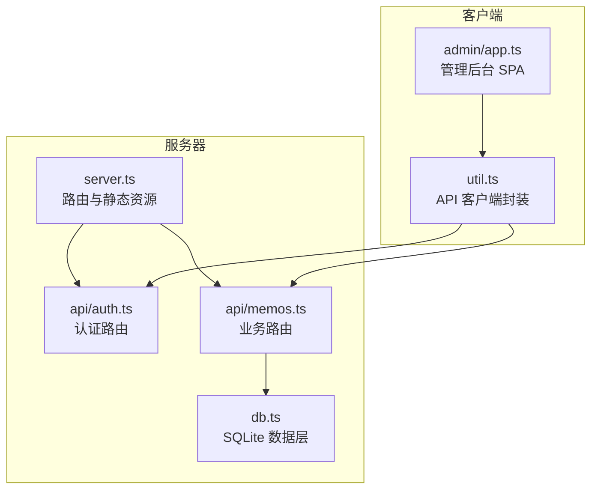
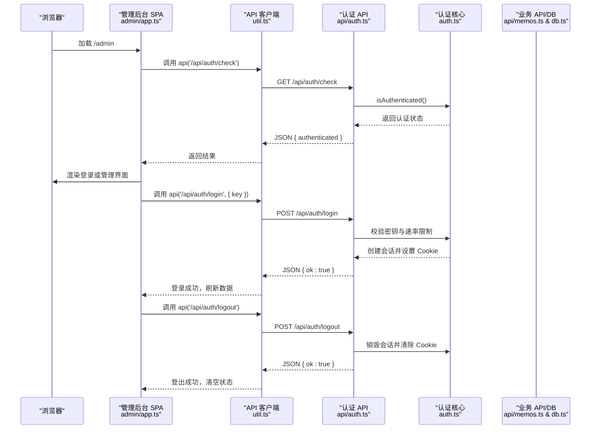
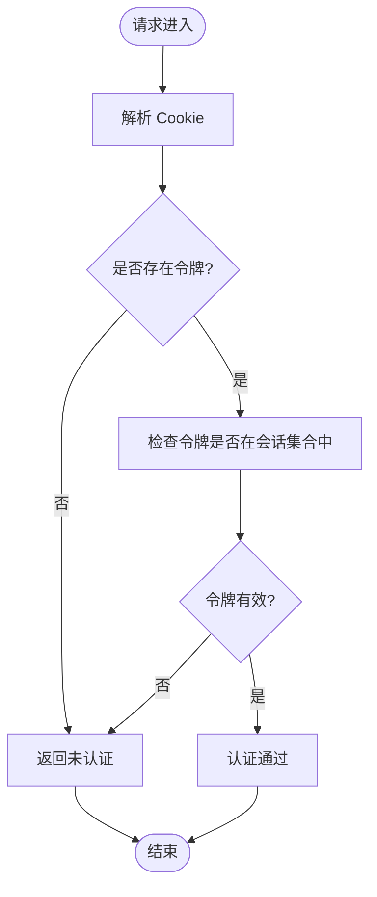
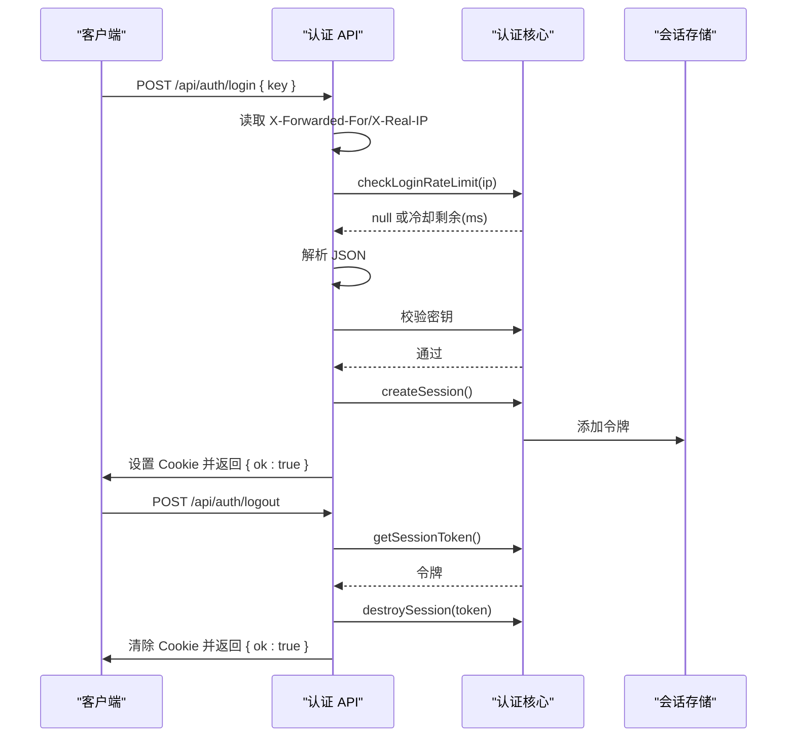
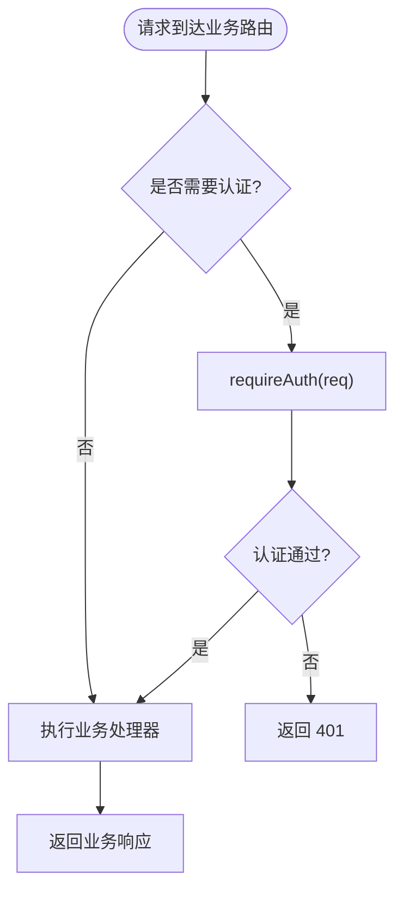
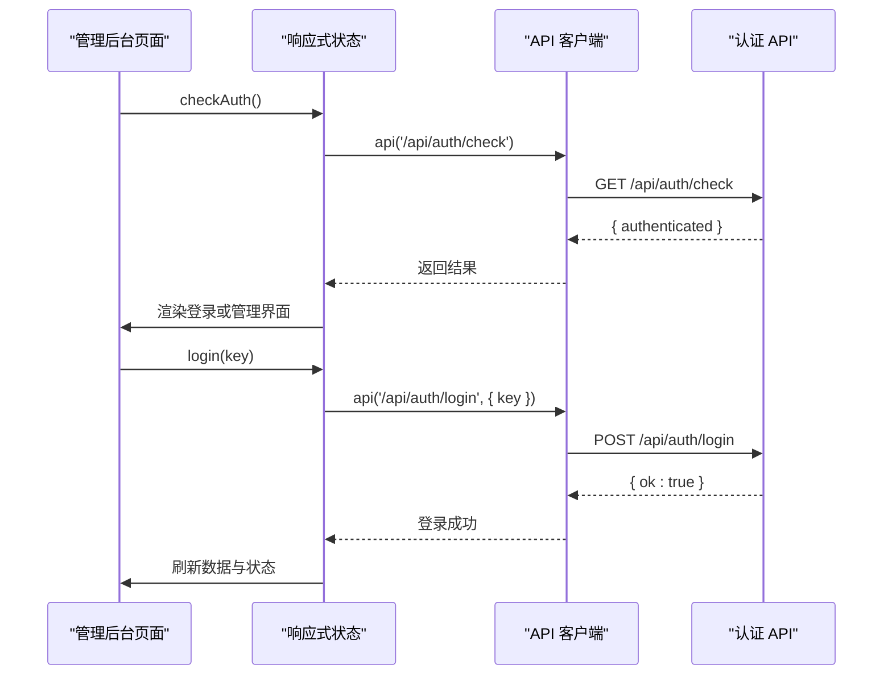
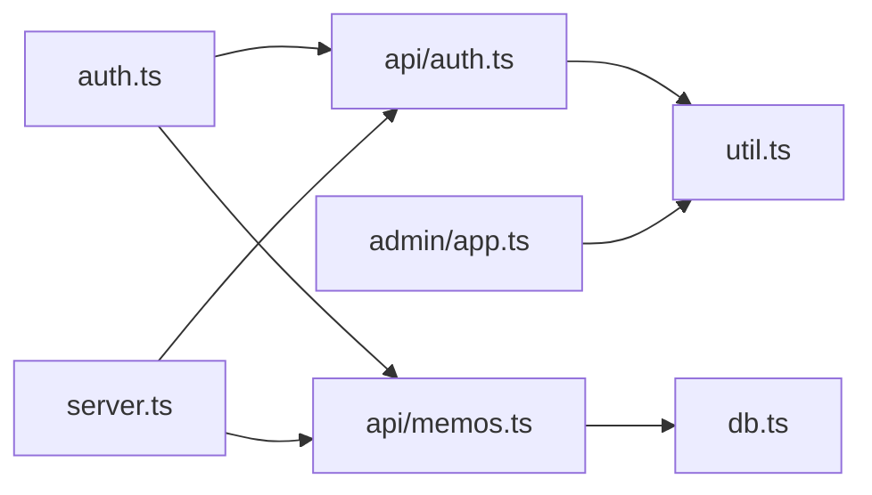

# 认证系统

<cite>
**本文引用的文件**
- [src/auth.ts](file://src/auth.ts)
- [src/api/auth.ts](file://src/api/auth.ts)
- [src/server.ts](file://src/server.ts)
- [src/admin/app.ts](file://src/admin/app.ts)
- [src/util.ts](file://src/util.ts)
- [src/db.ts](file://src/db.ts)
- [src/api/memos.ts](file://src/api/memos.ts)
- [src/admin/index.html](file://src/admin/index.html)
- [src/masonry/index.html](file://src/masonry/index.html)
- [README.md](file://README.md)
- [package.json](file://package.json)
</cite>

## 目录
1. [简介](#简介)
2. [项目结构](#项目结构)
3. [核心组件](#核心组件)
4. [架构总览](#架构总览)
5. [详细组件分析](#详细组件分析)
6. [依赖关系分析](#依赖关系分析)
7. [性能考量](#性能考量)
8. [故障排查指南](#故障排查指南)
9. [结论](#结论)
10. [附录](#附录)

## 简介
本认证系统基于 Cookie 与内存会话实现，采用密钥认证方式保护管理后台。系统通过 Hono 路由提供登录、登出与状态检查接口；前端使用 VanJS 的响应式状态管理与 fetch API 完成认证状态的前端管理与跨页面共享。认证状态通过 HttpOnly、SameSite=Strict 的 Cookie 传递，具备基础的会话生命周期管理与速率限制能力。本文档将从架构、组件、数据流、中间件机制、安全考虑与 API 文档等维度进行深入解析，并提供集成与使用指南。

## 项目结构
认证系统主要分布在以下模块：
- 认证核心逻辑：src/auth.ts（会话存储、Cookie 解析与设置、认证中间件、速率限制）
- 认证 API：src/api/auth.ts（登录、登出、状态检查）
- 服务器入口：src/server.ts（路由挂载、静态资源与 SPA 支持）
- 管理后台前端：src/admin/app.ts（认证状态检查、登录/登出、与后端交互）
- 工具函数：src/util.ts（统一的 API 客户端封装）
- 数据库与业务 API：src/db.ts、src/api/memos.ts（受认证保护的业务接口）

图表来源
- [src/server.ts:74-127](file://src/server.ts#L74-L127)
- [src/api/auth.ts:29-77](file://src/api/auth.ts#L29-L77)
- [src/api/memos.ts:18-139](file://src/api/memos.ts#L18-L139)
- [src/admin/app.ts:38-87](file://src/admin/app.ts#L38-L87)
- [src/util.ts:9-20](file://src/util.ts#L9-L20)

章节来源
- [src/server.ts:74-127](file://src/server.ts#L74-L127)
- [src/api/auth.ts:29-77](file://src/api/auth.ts#L29-L77)
- [src/api/memos.ts:18-139](file://src/api/memos.ts#L18-L139)
- [src/admin/app.ts:38-87](file://src/admin/app.ts#L38-L87)
- [src/util.ts:9-20](file://src/util.ts#L9-L20)

## 核心组件
- 会话与 Cookie 管理
  - 内存会话集合：用于存储有效会话令牌，服务重启即失效
  - Cookie 名称与过期时间常量：统一管理 Cookie 属性
  - Cookie 解析与读取：从请求头中提取 Cookie 并解析为键值对
  - 会话创建与销毁：生成随机令牌并加入/移除集合
  - Cookie 设置与清除：设置 HttpOnly、SameSite=Strict 的安全 Cookie
- 认证中间件
  - requireAuth：校验请求是否已认证，未认证返回 401
  - authMiddleware：Hono 中间件，未认证直接返回 401，通过则继续
- 速率限制
  - 登录尝试计数与冷却：每 IP 最多 N 次尝试，超过则冷却一段时间
- 认证 API
  - 状态检查：返回当前是否已认证
  - 登录：校验密钥，成功后创建会话并设置 Cookie
  - 登出：销毁会话并清除 Cookie

章节来源
- [src/auth.ts:1-111](file://src/auth.ts#L1-L111)
- [src/api/auth.ts:14-77](file://src/api/auth.ts#L14-L77)

## 架构总览
认证系统采用“前端 SPA + 后端 API”的分层架构：
- 前端通过 fetch API 与后端交互，使用 same-origin 凭据保持 Cookie
- 后端通过 Hono 路由提供认证与业务接口，业务接口通过中间件进行认证校验
- 会话状态以 Cookie 形式在浏览器与服务器之间传递，避免在前端持久化敏感信息

图表来源
- [src/admin/app.ts:38-87](file://src/admin/app.ts#L38-L87)
- [src/util.ts:9-20](file://src/util.ts#L9-L20)
- [src/api/auth.ts:31-77](file://src/api/auth.ts#L31-L77)
- [src/auth.ts:28-111](file://src/auth.ts#L28-L111)
- [src/api/memos.ts:62-139](file://src/api/memos.ts#L62-L139)

## 详细组件分析

### 会话与 Cookie 管理
- 内存会话存储：使用 Set 存储有效令牌，服务重启即失效，适合开发与单实例部署
- Cookie 解析：从请求头解析 Cookie 字符串为对象，支持多个键值对
- 会话令牌：使用随机 UUID 作为令牌，确保唯一性
- Cookie 设置：设置 HttpOnly、SameSite=Strict、Path=/、Max-Age=24h，降低 XSS 与 CSRF 风险
- 认证检查：根据 Cookie 中的令牌判断是否存在于会话集合中

图表来源
- [src/auth.ts:9-41](file://src/auth.ts#L9-L41)
- [src/auth.ts:28-31](file://src/auth.ts#L28-L31)

章节来源
- [src/auth.ts:1-111](file://src/auth.ts#L1-L111)

### 密钥认证流程
- 密钥来源：优先从环境变量读取，生产环境未设置时会终止进程并提示
- 登录流程：校验速率限制 → 解析 JSON → 校验密钥 → 成功后创建会话并设置 Cookie
- 登出流程：读取当前令牌 → 销毁会话 → 清除 Cookie
- 状态检查：返回当前是否已认证

图表来源
- [src/api/auth.ts:36-77](file://src/api/auth.ts#L36-L77)
- [src/auth.ts:33-41](file://src/auth.ts#L33-L41)
- [src/auth.ts:49-55](file://src/auth.ts#L49-L55)

章节来源
- [src/api/auth.ts:14-77](file://src/api/auth.ts#L14-L77)
- [src/auth.ts:57-92](file://src/auth.ts#L57-L92)

### 中间件机制与权限验证
- requireAuth：检查请求是否已认证，未认证返回 401
- authMiddleware：Hono 中间件，未认证直接返回 401，通过则继续后续处理
- 业务 API 使用 authMiddleware 保护新增/更新/删除操作，查询类接口根据参数决定是否需要认证

图表来源
- [src/api/memos.ts:62-139](file://src/api/memos.ts#L62-L139)
- [src/auth.ts:94-111](file://src/auth.ts#L94-L111)

章节来源
- [src/api/memos.ts:18-139](file://src/api/memos.ts#L18-L139)
- [src/auth.ts:94-111](file://src/auth.ts#L94-L111)

### 前端认证状态管理与跨页面共享
- 状态模型：使用 VanJS 的响应式状态管理，维护 authenticated、memos、loading 等状态
- 登录/登出：调用 api 封装的 /api/auth/* 接口，成功后刷新状态并加载数据
- 跨页面共享：通过 same-origin 的 fetch 与 Cookie 自动携带，实现跨页面共享认证状态
- 速率限制提示：登录失败时显示错误信息，避免频繁重试

图表来源
- [src/admin/app.ts:38-87](file://src/admin/app.ts#L38-L87)
- [src/util.ts:9-20](file://src/util.ts#L9-L20)
- [src/api/auth.ts:31-34](file://src/api/auth.ts#L31-L34)

章节来源
- [src/admin/app.ts:38-87](file://src/admin/app.ts#L38-L87)
- [src/util.ts:9-20](file://src/util.ts#L9-L20)

### 安全考虑与防护措施
- Cookie 安全属性
  - HttpOnly：防止 JavaScript 读取 Cookie，降低 XSS 风险
  - SameSite=Strict：限制跨站请求携带 Cookie，缓解 CSRF 攻击
  - Max-Age=86400：会话有效期 24 小时
- 速率限制
  - 登录尝试次数上限与冷却时间，防止暴力破解
- 密钥管理
  - 生产环境必须设置 MEMOS_SECRET_KEY，未设置时直接退出
  - 开发环境提供警告提示，建议在生产环境配置

章节来源
- [src/auth.ts:43-55](file://src/auth.ts#L43-L55)
- [src/auth.ts:66-92](file://src/auth.ts#L66-L92)
- [src/api/auth.ts:14-27](file://src/api/auth.ts#L14-L27)

## 依赖关系分析
- 认证核心依赖
  - 会话存储依赖 Set 与 crypto.randomUUID
  - Cookie 解析依赖 Request.headers
- 认证 API 依赖
  - 依赖认证核心提供的会话创建/销毁、Cookie 设置/清除、速率限制
  - 依赖环境变量 MEMOS_SECRET_KEY
- 业务 API 依赖
  - 依赖认证中间件进行权限控制
  - 依赖数据库层进行数据读写
- 前端依赖
  - 依赖 util.ts 的 api 封装与 fetch
  - 依赖 Hono 路由与服务器静态资源

图表来源
- [src/auth.ts:1-111](file://src/auth.ts#L1-L111)
- [src/api/auth.ts:12-12](file://src/api/auth.ts#L12-L12)
- [src/api/memos.ts:2-16](file://src/api/memos.ts#L2-L16)
- [src/admin/app.ts:3-3](file://src/admin/app.ts#L3-L3)
- [src/util.ts:9-20](file://src/util.ts#L9-L20)
- [src/server.ts:3-8](file://src/server.ts#L3-L8)

章节来源
- [src/auth.ts:1-111](file://src/auth.ts#L1-L111)
- [src/api/auth.ts:12-12](file://src/api/auth.ts#L12-L12)
- [src/api/memos.ts:2-16](file://src/api/memos.ts#L2-L16)
- [src/admin/app.ts:3-3](file://src/admin/app.ts#L3-L3)
- [src/util.ts:9-20](file://src/util.ts#L9-L20)
- [src/server.ts:3-8](file://src/server.ts#L3-L8)

## 性能考量
- 会话存储
  - 内存 Set 查找为 O(1)，适合小规模并发
  - 服务重启会丢失会话，不适用于多实例部署
- Cookie 设置
  - 单次设置/清除开销极低，影响可忽略
- 速率限制
  - Map 访问与更新为 O(1)，对性能影响很小
- 前端状态管理
  - VanJS 响应式状态更新局部渲染，减少不必要的 DOM 操作

[本节为通用性能讨论，无需特定文件来源]

## 故障排查指南
- 登录失败
  - 检查 MEMOS_SECRET_KEY 是否正确设置（生产环境必须）
  - 查看速率限制提示，等待冷却时间结束
  - 确认请求体 JSON 格式正确
- 401 未授权
  - 确认 Cookie 是否被正确设置与携带
  - 检查 SameSite 与 HttpOnly 配置是否导致 Cookie 不被发送
- 会话丢失
  - 服务重启会导致会话失效，属于预期行为
- 前端状态异常
  - 检查 api 封装的错误处理与全局错误提示
  - 确认 /api/auth/check 返回的 authenticated 状态

章节来源
- [src/api/auth.ts:14-27](file://src/api/auth.ts#L14-L27)
- [src/auth.ts:66-92](file://src/auth.ts#L66-L92)
- [src/util.ts:17-19](file://src/util.ts#L17-L19)

## 结论
该认证系统以最小实现满足管理后台的安全需求：通过密钥认证、内存会话与安全 Cookie，结合 Hono 中间件实现细粒度的权限控制。前端使用响应式状态管理与 fetch API 完成认证状态的跨页面共享。系统在开发与单实例场景下表现良好，若需多实例部署，建议替换为持久化会话存储与更完善的 CSRF 防护策略。

[本节为总结性内容，无需特定文件来源]

## 附录

### API 接口文档
- 认证
  - GET /api/auth/check
    - 说明：检查当前登录状态
    - 认证：否
    - 响应：JSON { authenticated: boolean }
  - POST /api/auth/login
    - 说明：登录，携带密钥
    - 认证：否
    - 请求体：JSON { key: string }
    - 响应：JSON { ok: true }，设置 Cookie
  - POST /api/auth/logout
    - 说明：登出，清除 Cookie
    - 认证：否
    - 响应：JSON { ok: true }
- 备忘录（受保护）
  - GET /api/memos
    - 说明：获取备忘录列表，支持搜索与标签筛选
    - 认证：可选（all=true 时需要认证）
    - 查询参数：search、tag、all
    - 响应：JSON { memos: Memo[] }
  - GET /api/memos/count
    - 说明：获取备忘录总数
    - 认证：可选（需要认证时包含私密条目）
    - 响应：JSON { count: number }
  - GET /api/memos/tags
    - 说明：获取所有标签
    - 认证：否
    - 响应：JSON { tags: string[] }
  - POST /api/memos
    - 说明：创建备忘录
    - 认证：是
    - 请求体：JSON { content: string, is_public?: boolean, tag?: string }
    - 响应：JSON { memo: Memo }
  - PUT /api/memos/:id
    - 说明：更新备忘录
    - 认证：是
    - 请求体：JSON { content?: string, is_public?: boolean, tag?: string }
    - 响应：JSON { memo: Memo }
  - DELETE /api/memos/:id
    - 说明：删除备忘录
    - 认证：是
    - 响应：JSON { ok: true }

章节来源
- [src/api/auth.ts:31-77](file://src/api/auth.ts#L31-L77)
- [src/api/memos.ts:20-139](file://src/api/memos.ts#L20-L139)

### 环境变量与配置
- MEMOS_SECRET_KEY：管理员登录密钥（生产环境必须设置）
- PORT：服务器监听端口，默认 3020

章节来源
- [README.md:59-65](file://README.md#L59-L65)
- [src/api/auth.ts:14-27](file://src/api/auth.ts#L14-L27)

### 集成指南
- 启动与运行
  - 安装依赖：bun install
  - 开发模式：bun run dev
  - 生产模式：bun run start
- 访问地址
  - 首页（瀑布流）：http://localhost:PORT
  - 管理后台：http://localhost:PORT/admin
- 前端集成要点
  - 使用 util.ts 的 api 封装进行请求
  - same-origin 凭据自动携带 Cookie
  - 在 /admin 路由下使用 SPA 深层链接

章节来源
- [README.md:73-87](file://README.md#L73-L87)
- [src/server.ts:82-112](file://src/server.ts#L82-L112)
- [src/util.ts:9-20](file://src/util.ts#L9-L20)