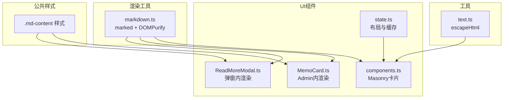
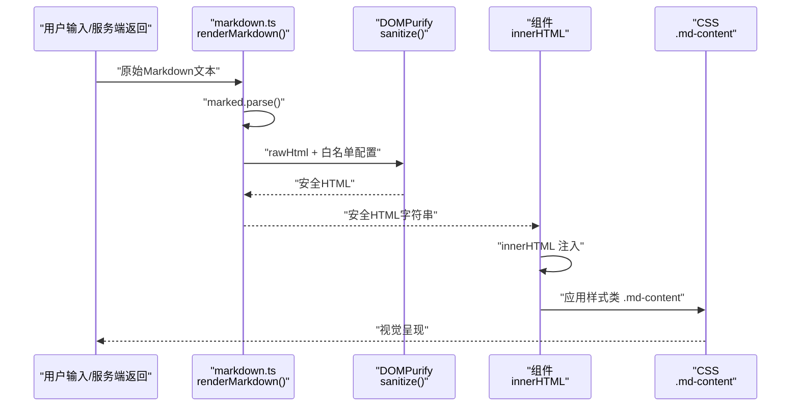
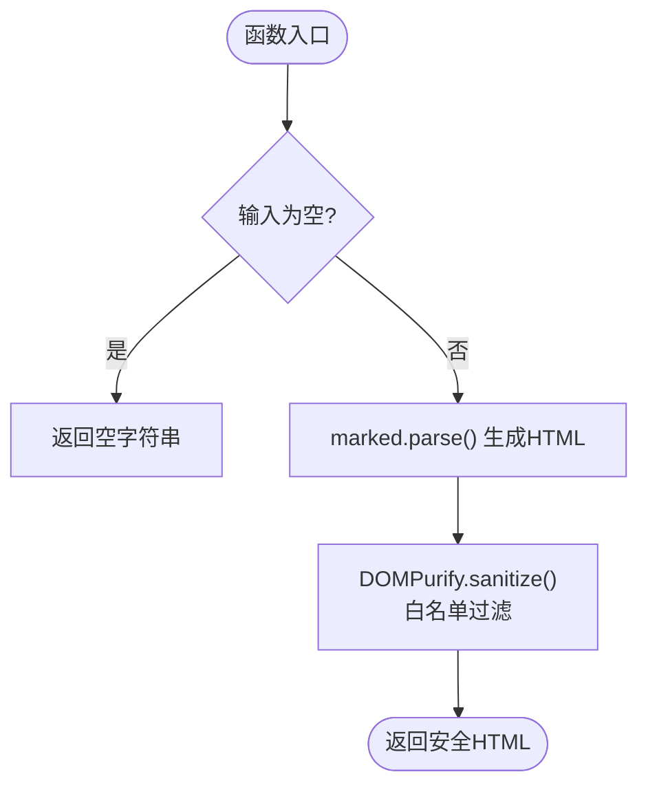
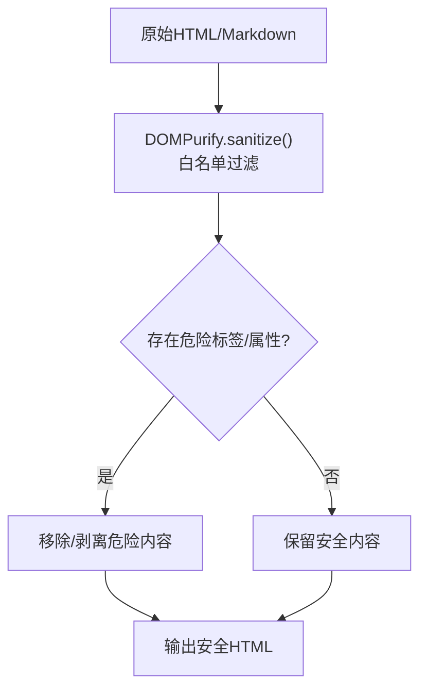
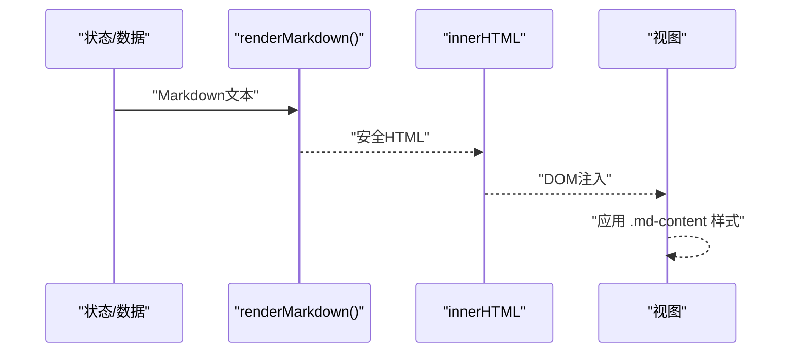
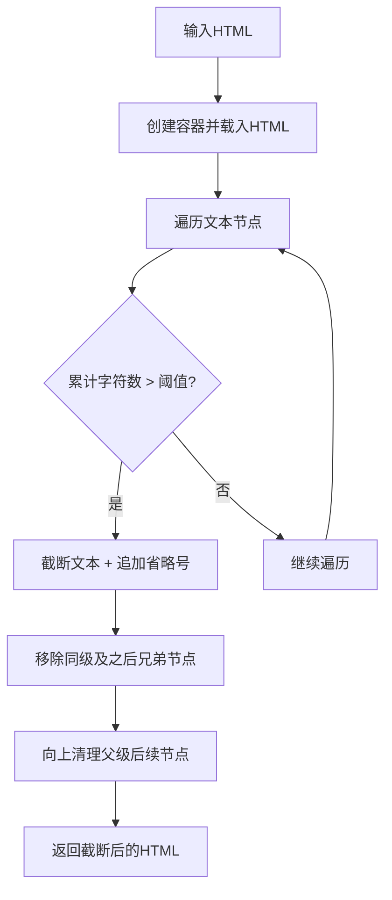
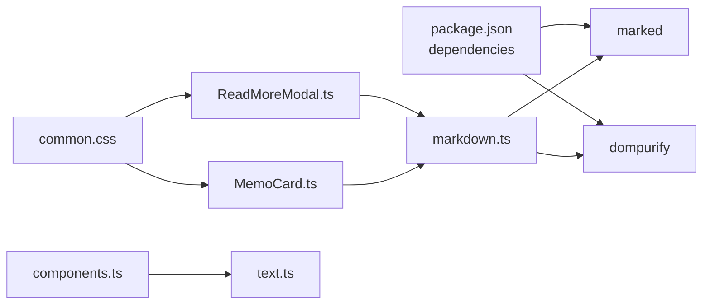

# Markdown渲染

<cite>
**本文引用的文件**
- [markdown.ts](file://src/helper/markdown.ts)
- [package.json](file://package.json)
- [ReadMoreModal.ts](file://src/frontend/shared/components/ReadMoreModal.ts)
- [MemoCard.ts](file://src/frontend/admin/components/MemoCard.ts)
- [components.ts](file://src/frontend/masonry/components.ts)
- [state.ts](file://src/frontend/masonry/state.ts)
- [common.css](file://src/frontend/shared/styles/common.css)
- [text.ts](file://src/frontend/shared/utils/text.ts)
</cite>

## 目录
1. [简介](#简介)
2. [项目结构](#项目结构)
3. [核心组件](#核心组件)
4. [架构总览](#架构总览)
5. [详细组件分析](#详细组件分析)
6. [依赖关系分析](#依赖关系分析)
7. [性能考量](#性能考量)
8. [故障排查指南](#故障排查指南)
9. [结论](#结论)
10. [附录](#附录)

## 简介
本文件系统性阐述项目的Markdown渲染能力，覆盖以下方面：
- 支持的Markdown语法与扩展特性
- 渲染流程：从Markdown到HTML再到最终展示
- 安全机制：DOMPurify白名单与XSS防护
- 性能优化：缓存与增量更新策略
- 配置项：语法开关、白名单、样式定制
- 在不同界面的应用：Admin编辑器、Masonry瀑布流、公开页面
- 错误处理与降级策略
- 最佳实践与常见问题

## 项目结构
Markdown渲染相关的核心代码集中在前端辅助模块与UI组件中：
- 渲染工具：src/helper/markdown.ts
- 公共样式：src/frontend/shared/styles/common.css
- 读取更多弹窗：src/frontend/shared/components/ReadMoreModal.ts
- Admin卡片渲染：src/frontend/admin/components/MemoCard.ts
- Masonry瀑布流卡片与状态：src/frontend/masonry/components.ts、src/frontend/masonry/state.ts
- HTML转义工具：src/frontend/shared/utils/text.ts

图表来源
- [markdown.ts:1-148](file://src/helper/markdown.ts#L1-L148)
- [common.css:158-234](file://src/frontend/shared/styles/common.css#L158-L234)
- [ReadMoreModal.ts:15-70](file://src/frontend/shared/components/ReadMoreModal.ts#L15-L70)
- [MemoCard.ts:61-346](file://src/frontend/admin/components/MemoCard.ts#L61-L346)
- [components.ts:132-219](file://src/frontend/masonry/components.ts#L132-L219)
- [state.ts:72-181](file://src/frontend/masonry/state.ts#L72-L181)
- [text.ts:1-11](file://src/frontend/shared/utils/text.ts#L1-L11)

章节来源
- [markdown.ts:1-148](file://src/helper/markdown.ts#L1-L148)
- [common.css:158-234](file://src/frontend/shared/styles/common.css#L158-L234)
- [ReadMoreModal.ts:15-70](file://src/frontend/shared/components/ReadMoreModal.ts#L15-L70)
- [MemoCard.ts:61-346](file://src/frontend/admin/components/MemoCard.ts#L61-L346)
- [components.ts:132-219](file://src/frontend/masonry/components.ts#L132-L219)
- [state.ts:72-181](file://src/frontend/masonry/state.ts#L72-L181)
- [text.ts:1-11](file://src/frontend/shared/utils/text.ts#L1-L11)

## 核心组件
- 渲染工具：提供安全的Markdown到HTML转换、纯文本剥离、渲染内容截断、Markdown检测等能力
- UI组件：在不同界面中消费渲染结果，分别用于弹窗、Admin卡片、瀑布流卡片
- 样式：统一的Markdown内容样式类，确保跨界面一致的渲染表现

章节来源
- [markdown.ts:52-147](file://src/helper/markdown.ts#L52-L147)
- [ReadMoreModal.ts:60-65](file://src/frontend/shared/components/ReadMoreModal.ts#L60-L65)
- [MemoCard.ts:302-306](file://src/frontend/admin/components/MemoCard.ts#L302-L306)
- [components.ts:132-219](file://src/frontend/masonry/components.ts#L132-L219)
- [common.css:158-234](file://src/frontend/shared/styles/common.css#L158-L234)

## 架构总览
Markdown渲染采用“解析-清洗-展示”的三层架构：
- 解析层：marked负责将Markdown文本解析为HTML片段
- 清洗层：DOMPurify基于白名单过滤潜在危险标签与属性
- 展示层：VanJS组件通过innerHTML注入安全HTML，并由CSS进行样式化

图表来源
- [markdown.ts:52-56](file://src/helper/markdown.ts#L52-L56)
- [ReadMoreModal.ts:60-65](file://src/frontend/shared/components/ReadMoreModal.ts#L60-L65)
- [MemoCard.ts:302-306](file://src/frontend/admin/components/MemoCard.ts#L302-L306)
- [common.css:158-234](file://src/frontend/shared/styles/common.css#L158-L234)

## 详细组件分析

### 渲染工具：markdown.ts
- 功能概览
  - 安全渲染：将Markdown转换为HTML并经DOMPurify清洗
  - 纯文本剥离：移除HTML标签，仅保留文本
  - 渲染截断：按可见字符数截断，保持标签闭合
  - 语法检测：快速预检+精确匹配，避免误判普通文本
- 关键点
  - marked实例启用GitHub风格表格（gfm），禁用硬换行（breaks）
  - DOMPurify白名单严格限制标签与属性，禁止未知协议
  - 截断算法使用DOM树遍历，确保可见字符边界正确
  - 语法检测采用双阶段正则，兼顾性能与准确性

图表来源
- [markdown.ts:52-56](file://src/helper/markdown.ts#L52-L56)

章节来源
- [markdown.ts:12-15](file://src/helper/markdown.ts#L12-L15)
- [markdown.ts:18-44](file://src/helper/markdown.ts#L18-L44)
- [markdown.ts:52-66](file://src/helper/markdown.ts#L52-L66)
- [markdown.ts:81-113](file://src/helper/markdown.ts#L81-L113)
- [markdown.ts:140-147](file://src/helper/markdown.ts#L140-L147)

### 安全机制：DOMPurify与XSS防护
- 白名单策略
  - 允许标题、段落、列表、块引用、水平线、链接、代码块、行内代码等
  - 仅允许href属性，禁止data-*与未知协议
- 防护范围
  - 过滤脚本、事件处理器、嵌入式对象等潜在危险内容
  - 结合浏览器原生innerHTML注入，避免二次解析风险
- 辅助安全
  - 在非渲染场景使用stripHtmlTags进一步剥离标签
  - 对外部不可信文本进行escapeHtml转义（如瀑布流卡片）

图表来源
- [markdown.ts:18-44](file://src/helper/markdown.ts#L18-L44)
- [markdown.ts:61-66](file://src/helper/markdown.ts#L61-L66)
- [text.ts:4-11](file://src/frontend/shared/utils/text.ts#L4-L11)

章节来源
- [markdown.ts:18-44](file://src/helper/markdown.ts#L18-L44)
- [markdown.ts:61-66](file://src/helper/markdown.ts#L61-L66)
- [text.ts:4-11](file://src/frontend/shared/utils/text.ts#L4-L11)

### 渲染流程：从Markdown到HTML再到展示
- Admin编辑器
  - 组件通过innerHTML注入renderMarkdown结果，配合样式类.md-content
  - 用于展示AI生成或编辑后的Markdown内容
- Masonry瀑布流
  - 卡片内默认以纯文本显示（escapeHtml），避免XSS风险
  - 读取更多弹窗中使用renderMarkdown进行富文本展示
- 公开页面
  - 弹窗组件同样使用renderMarkdown，保证一致的渲染体验

图表来源
- [MemoCard.ts:302-306](file://src/frontend/admin/components/MemoCard.ts#L302-L306)
- [ReadMoreModal.ts:60-65](file://src/frontend/shared/components/ReadMoreModal.ts#L60-L65)
- [components.ts:152](file://src/frontend/masonry/components.ts#L152)
- [common.css:158-234](file://src/frontend/shared/styles/common.css#L158-L234)

章节来源
- [MemoCard.ts:302-306](file://src/frontend/admin/components/MemoCard.ts#L302-L306)
- [ReadMoreModal.ts:60-65](file://src/frontend/shared/components/ReadMoreModal.ts#L60-L65)
- [components.ts:152](file://src/frontend/masonry/components.ts#L152)
- [common.css:158-234](file://src/frontend/shared/styles/common.css#L158-L234)

### 截断与可见字符控制
- 目标
  - 在不破坏标签闭合的前提下，按可见字符数截断渲染内容
- 算法
  - 创建临时容器，遍历所有文本节点
  - 计算累计可见字符，超过阈值时截断并移除后续节点
- 应用
  - 适用于长内容的摘要展示与弹窗内的完整内容查看

图表来源
- [markdown.ts:81-113](file://src/helper/markdown.ts#L81-L113)
- [markdown.ts:115-133](file://src/helper/markdown.ts#L115-L133)

章节来源
- [markdown.ts:81-113](file://src/helper/markdown.ts#L81-L113)
- [markdown.ts:115-133](file://src/helper/markdown.ts#L115-L133)

### 语法支持与自定义扩展
- 标准支持
  - 标题、段落、粗体、斜体、列表、块引用、水平线、链接、代码块、行内代码
- 扩展特性
  - GitHub风格表格（gfm: true）
  - 禁用硬换行（breaks: false）
- 自定义扩展
  - 当前未引入marked扩展插件；若需自定义语法，可在marked实例上注册扩展
  - DOMPurify白名单可通过配置项调整，谨慎开放新标签/属性

章节来源
- [markdown.ts:12-15](file://src/helper/markdown.ts#L12-L15)
- [markdown.ts:18-44](file://src/helper/markdown.ts#L18-L44)

### 配置选项与样式定制
- 渲染配置
  - marked实例：gfm、breaks
  - DOMPurify：允许标签、允许属性、未知协议控制
- 样式定制
  - 通过.md-content类统一控制标题、列表、块引用、代码块、链接等样式
  - 可在common.css中按需扩展或覆盖

章节来源
- [markdown.ts:12-15](file://src/helper/markdown.ts#L12-L15)
- [markdown.ts:18-44](file://src/helper/markdown.ts#L18-L44)
- [common.css:158-234](file://src/frontend/shared/styles/common.css#L158-L234)

### 在不同界面中的应用
- Admin编辑器
  - 使用renderMarkdown直接注入innerHTML，展示富文本
- Masonry瀑布流
  - 卡片内默认escapeHtml纯文本显示，避免XSS
  - 读取更多弹窗中使用renderMarkdown进行富文本展示
- 公开页面
  - 与Masonry一致的渲染策略，保证跨界面一致性

章节来源
- [MemoCard.ts:302-306](file://src/frontend/admin/components/MemoCard.ts#L302-L306)
- [components.ts:152](file://src/frontend/masonry/components.ts#L152)
- [ReadMoreModal.ts:60-65](file://src/frontend/shared/components/ReadMoreModal.ts#L60-L65)

## 依赖关系分析
- 核心依赖
  - marked：Markdown解析
  - dompurify：HTML清洗
- 前端框架
  - vanjs-core：组件与状态管理
- 样式与工具
  - 公共CSS：统一渲染样式
  - escapeHtml：基础XSS防护

图表来源
- [package.json:19-25](file://package.json#L19-L25)
- [markdown.ts:3-5](file://src/helper/markdown.ts#L3-L5)
- [ReadMoreModal.ts:1-2](file://src/frontend/shared/components/ReadMoreModal.ts#L1-L2)
- [MemoCard.ts:1-3](file://src/frontend/admin/components/MemoCard.ts#L1-L3)
- [components.ts:8-11](file://src/frontend/masonry/components.ts#L8-L11)
- [common.css:158-234](file://src/frontend/shared/styles/common.css#L158-L234)

章节来源
- [package.json:19-25](file://package.json#L19-L25)
- [markdown.ts:3-5](file://src/helper/markdown.ts#L3-L5)
- [ReadMoreModal.ts:1-2](file://src/frontend/shared/components/ReadMoreModal.ts#L1-L2)
- [MemoCard.ts:1-3](file://src/frontend/admin/components/MemoCard.ts#L1-L3)
- [components.ts:8-11](file://src/frontend/masonry/components.ts#L8-L11)
- [common.css:158-234](file://src/frontend/shared/styles/common.css#L158-L234)

## 性能考量
- 缓存策略
  - 预处理文本缓存：@chenglou/pretext对文本进行预处理，减少重复计算
  - 布局缓存：窗口宽度与卡片集合不变时复用布局结果
- 增量更新
  - 仅在数据变化时重新渲染受影响区域
  - 截断算法按需执行，避免对整段HTML进行无谓处理
- 渲染路径
  - Admin与弹窗使用innerHTML注入，避免重复解析
  - 瀑布流卡片默认纯文本，降低渲染压力

章节来源
- [state.ts:61-70](file://src/frontend/masonry/state.ts#L61-L70)
- [state.ts:135-152](file://src/frontend/masonry/state.ts#L135-L152)
- [components.ts:132-219](file://src/frontend/masonry/components.ts#L132-L219)
- [MemoCard.ts:302-306](file://src/frontend/admin/components/MemoCard.ts#L302-L306)
- [ReadMoreModal.ts:60-65](file://src/frontend/shared/components/ReadMoreModal.ts#L60-L65)

## 故障排查指南
- 常见问题
  - 输入为空：renderMarkdown会返回空字符串，避免异常
  - 截断无效：当maxLen<=0或HTML为空时直接返回
  - 语法检测误判：双阶段正则已降低误判率，必要时可调整正则
  - XSS风险：确保所有不可信输入均经过DOMPurify或escapeHtml处理
- 降级策略
  - 渲染失败回退到纯文本显示
  - 截断失败时返回原始HTML与false标志
  - 白名单过于严格时，可逐步放宽允许标签/属性

章节来源
- [markdown.ts:52-56](file://src/helper/markdown.ts#L52-L56)
- [markdown.ts:81-83](file://src/helper/markdown.ts#L81-L83)
- [markdown.ts:140-147](file://src/helper/markdown.ts#L140-L147)
- [text.ts:4-11](file://src/frontend/shared/utils/text.ts#L4-L11)

## 结论
本项目通过marked+DOMPurify实现了安全、可控且高性能的Markdown渲染体系。在Admin编辑器、Masonry瀑布流与公开页面中，统一的渲染与样式策略确保了良好的用户体验与安全性。建议在扩展语法与样式时遵循最小权限原则，持续评估白名单与性能指标。

## 附录
- 术语
  - DOMPurify：HTML清洗库，基于白名单过滤
  - marked：Markdown解析库
  - .md-content：统一的Markdown内容样式类
- 相关文件
  - 渲染工具：src/helper/markdown.ts
  - 样式：src/frontend/shared/styles/common.css
  - UI组件：src/frontend/shared/components/ReadMoreModal.ts、src/frontend/admin/components/MemoCard.ts、src/frontend/masonry/components.ts、src/frontend/masonry/state.ts
  - 转义工具：src/frontend/shared/utils/text.ts
  - 依赖声明：package.json