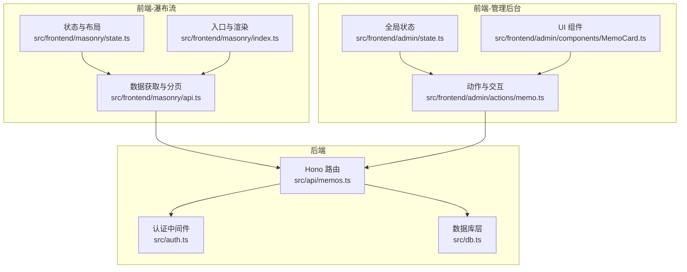
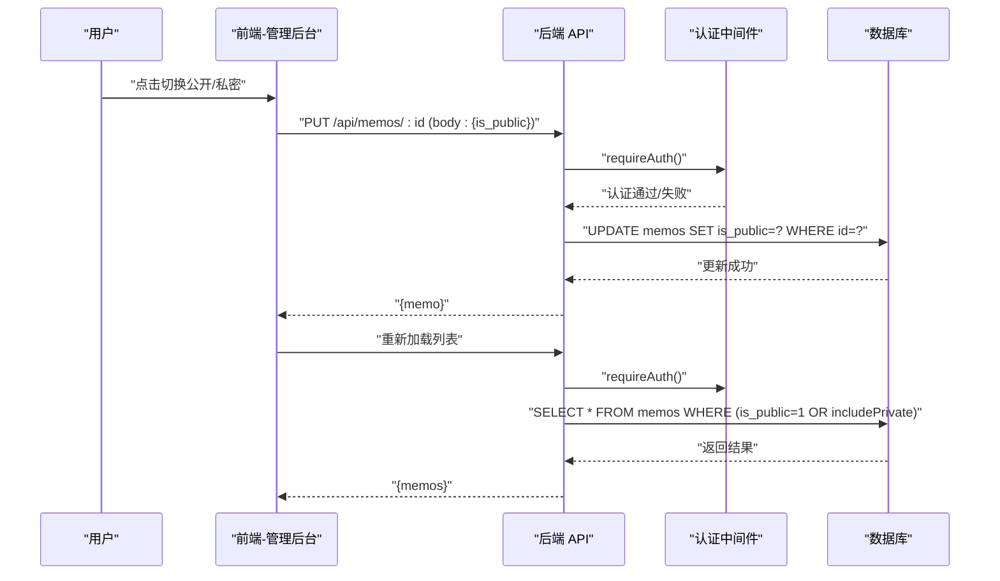
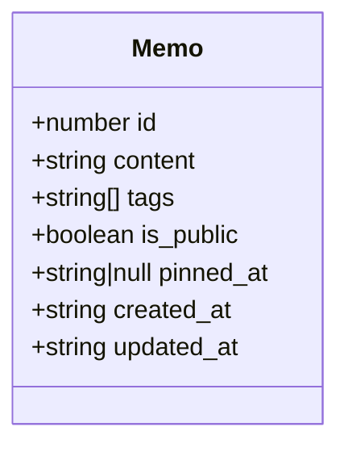
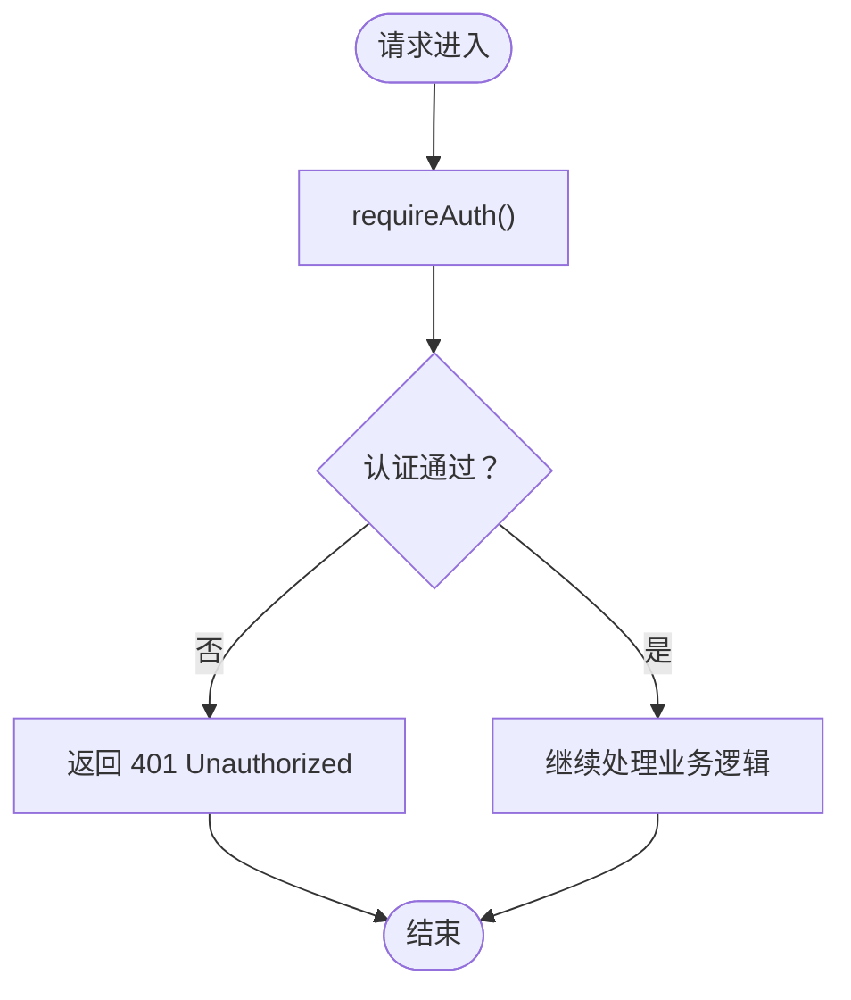
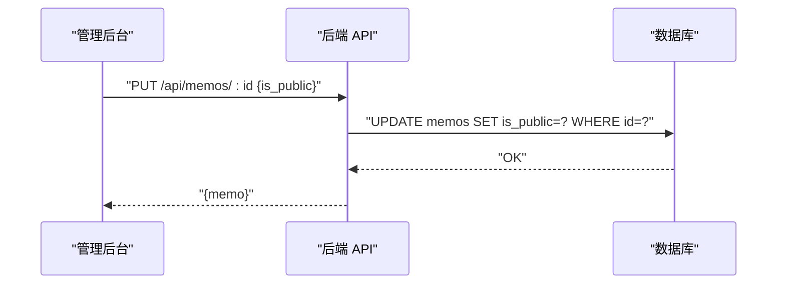
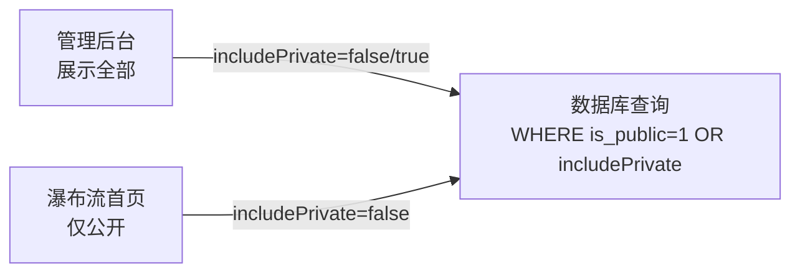
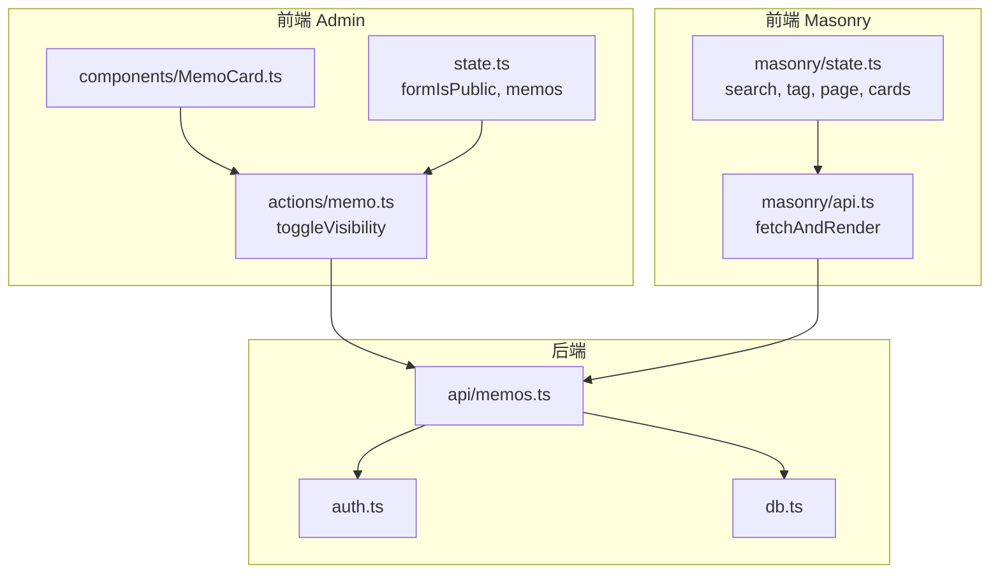

# 公开私密状态管理

<cite>
**本文引用的文件**
- [src/model.ts](file://src/model.ts)
- [src/db.ts](file://src/db.ts)
- [src/auth.ts](file://src/auth.ts)
- [src/api/memos.ts](file://src/api/memos.ts)
- [src/frontend/admin/state.ts](file://src/frontend/admin/state.ts)
- [src/frontend/admin/actions/memo.ts](file://src/frontend/admin/actions/memo.ts)
- [src/frontend/admin/components/MemoCard.ts](file://src/frontend/admin/components/MemoCard.ts)
- [src/frontend/masonry/state.ts](file://src/frontend/masonry/state.ts)
- [src/frontend/masonry/api.ts](file://src/frontend/masonry/api.ts)
- [src/frontend/masonry/index.ts](file://src/frontend/masonry/index.ts)
- [src/config/app-config.ts](file://src/config/app-config.ts)
- [README.md](file://README.md)
</cite>

## 目录
1. [简介](#简介)
2. [项目结构](#项目结构)
3. [核心组件](#核心组件)
4. [架构总览](#架构总览)
5. [详细组件分析](#详细组件分析)
6. [依赖关系分析](#依赖关系分析)
7. [性能考量](#性能考量)
8. [故障排查指南](#故障排查指南)
9. [结论](#结论)
10. [附录](#附录)

## 简介
本文件围绕“公开/私密”状态管理进行系统化说明，涵盖设计理念、实现机制、权限控制、界面展示差异、安全考虑、API 文档、用户体验设计以及与搜索/过滤等模块的集成方式，并提供配置与扩展建议。目标读者既包括开发者也包括需要理解系统行为的产品与运营人员。

## 项目结构
本项目采用前后端分离的模块化组织方式：
- 后端以 Hono 作为 Web 框架，提供 REST API；认证采用 Cookie + 内存 Session 与 Bearer Token 双通道。
- 前端分为两个入口：
  - 首页瀑布流（Masonry）：纯前端渲染，负责公开内容的浏览与搜索。
  - 管理后台（Admin SPA）：VanJS 响应式状态驱动，负责全部内容的管理与状态切换。

图表来源
- [src/api/memos.ts:1-220](file://src/api/memos.ts#L1-L220)
- [src/auth.ts:1-128](file://src/auth.ts#L1-L128)
- [src/db.ts:1-484](file://src/db.ts#L1-L484)
- [src/frontend/masonry/state.ts:1-181](file://src/frontend/masonry/state.ts#L1-L181)
- [src/frontend/masonry/api.ts:1-162](file://src/frontend/masonry/api.ts#L1-L162)
- [src/frontend/masonry/index.ts:1-23](file://src/frontend/masonry/index.ts#L1-L23)
- [src/frontend/admin/state.ts:1-178](file://src/frontend/admin/state.ts#L1-L178)
- [src/frontend/admin/actions/memo.ts:1-231](file://src/frontend/admin/actions/memo.ts#L1-L231)
- [src/frontend/admin/components/MemoCard.ts:1-346](file://src/frontend/admin/components/MemoCard.ts#L1-L346)

章节来源
- [README.md:25-45](file://README.md#L25-L45)

## 核心组件
- 数据模型与状态字段
  - Memo 接口包含 is_public 字段，用于标识公开/私密状态。
- 数据库层
  - memos 表存储 is_public 字段（整型，默认 1 表示公开），查询时根据该字段决定是否过滤私密内容。
- 认证与权限
  - requireAuth 支持 Cookie Session 与 Bearer Token；部分 API（如获取全部列表）在认证通过时才允许返回私密内容。
- 前端状态与交互
  - 管理后台使用 VanJS 状态驱动，提供 is_public 切换、置顶、编辑、删除等操作。
  - 瀑布流前端仅请求公开内容，不涉及私密数据。

章节来源
- [src/model.ts:1-35](file://src/model.ts#L1-L35)
- [src/db.ts:18-61](file://src/db.ts#L18-L61)
- [src/db.ts:122-169](file://src/db.ts#L122-L169)
- [src/auth.ts:111-128](file://src/auth.ts#L111-L128)
- [src/frontend/admin/state.ts:51-57](file://src/frontend/admin/state.ts#L51-L57)
- [src/frontend/admin/actions/memo.ts:70-80](file://src/frontend/admin/actions/memo.ts#L70-L80)

## 架构总览
公开/私密状态贯穿“请求—鉴权—查询—展示”的全链路：

图表来源
- [src/frontend/admin/actions/memo.ts:70-80](file://src/frontend/admin/actions/memo.ts#L70-L80)
- [src/api/memos.ts:146-187](file://src/api/memos.ts#L146-L187)
- [src/auth.ts:111-128](file://src/auth.ts#L111-L128)
- [src/db.ts:122-169](file://src/db.ts#L122-L169)

## 详细组件分析

### 数据模型与状态字段
- Memo 接口中的 is_public 字段用于区分公开与私密。
- 数据库存储为整型（1=公开，0=私密），查询时转换为布尔值。

图表来源
- [src/model.ts:1-9](file://src/model.ts#L1-L9)

章节来源
- [src/model.ts:1-35](file://src/model.ts#L1-L35)
- [src/db.ts:64-120](file://src/db.ts#L64-L120)

### 权限控制与认证中间件
- 认证方式
  - Cookie + 内存 Session：登录后生成 token 并写入 HttpOnly Cookie。
  - Bearer Token：通过环境变量 MEMOS_SECRET_KEY 提供。
- 中间件行为
  - requireAuth：若未认证返回 401。
  - authMiddleware：在路由层拦截未认证请求。
- API 访问规则
  - 获取全部列表（包含私密）需认证；未认证时默认只返回公开内容。
  - 创建/更新/删除等写操作均需认证。

图表来源
- [src/auth.ts:111-128](file://src/auth.ts#L111-L128)

章节来源
- [src/auth.ts:1-128](file://src/auth.ts#L1-L128)
- [src/api/memos.ts:28-77](file://src/api/memos.ts#L28-L77)

### 状态切换逻辑与安全考虑
- 切换流程
  - 管理后台点击“设为公开/私密”，发送 PUT /api/memos/:id，body 包含 is_public。
  - 后端更新数据库记录并返回最新 memo。
- 安全要点
  - 所有写操作均经认证中间件校验，防止未授权访问。
  - 私密内容仅在管理员认证后可见（如 /api/memos?all=true）。
  - 前端瀑布流仅请求公开内容，避免泄露私密数据。

图表来源
- [src/frontend/admin/actions/memo.ts:70-80](file://src/frontend/admin/actions/memo.ts#L70-L80)
- [src/api/memos.ts:146-187](file://src/api/memos.ts#L146-L187)
- [src/db.ts:214-233](file://src/db.ts#L214-L233)

章节来源
- [src/frontend/admin/actions/memo.ts:70-80](file://src/frontend/admin/actions/memo.ts#L70-L80)
- [src/api/memos.ts:146-187](file://src/api/memos.ts#L146-L187)
- [src/db.ts:214-233](file://src/db.ts#L214-L233)

### 不同界面下的状态展示差异
- 管理后台（Admin SPA）
  - 展示完整列表，包含公开与私密。
  - 提供“公开/私密”徽章与切换按钮，支持置顶、编辑、删除等操作。
- 瀑布流首页（Masonry）
  - 仅展示公开内容，不显示私密条目。
  - 支持搜索、标签筛选、分页与 URL 同步。

图表来源
- [src/frontend/admin/components/MemoCard.ts:61-106](file://src/frontend/admin/components/MemoCard.ts#L61-L106)
- [src/api/memos.ts:28-77](file://src/api/memos.ts#L28-L77)
- [src/db.ts:122-169](file://src/db.ts#L122-L169)

章节来源
- [src/frontend/admin/components/MemoCard.ts:61-106](file://src/frontend/admin/components/MemoCard.ts#L61-L106)
- [src/frontend/masonry/api.ts:51-130](file://src/frontend/masonry/api.ts#L51-L130)
- [src/api/memos.ts:28-77](file://src/api/memos.ts#L28-L77)

### 状态变更的用户体验与反馈
- 管理后台
  - 切换公开/私密后立即刷新列表，状态徽章即时更新。
  - 操作错误通过全局错误状态提示。
- 瀑布流
  - 切换公开/私密不影响首页展示（首页不包含私密）。
  - 搜索与标签筛选通过 URL 同步，便于回溯与分享。

章节来源
- [src/frontend/admin/actions/memo.ts:70-80](file://src/frontend/admin/actions/memo.ts#L70-L80)
- [src/frontend/admin/state.ts:37-39](file://src/frontend/admin/state.ts#L37-L39)
- [src/frontend/masonry/api.ts:111-120](file://src/frontend/masonry/api.ts#L111-L120)

### 与搜索与过滤的集成
- 管理后台
  - GET /api/memos 支持 search、tag、all 参数；all=true 且已认证时返回全部（含私密）。
  - 支持语义相似度检索合并结果，但公开/私密仍遵循 is_public 过滤。
- 瀑布流
  - GET /api/memos 仅返回公开内容，支持 search、tag、page、limit。
  - URL 参数与前端状态双向同步，支持前进/后退与书签。

章节来源
- [src/api/memos.ts:28-77](file://src/api/memos.ts#L28-L77)
- [src/api/memos.ts:79-95](file://src/api/memos.ts#L79-L95)
- [src/frontend/masonry/api.ts:51-130](file://src/frontend/masonry/api.ts#L51-L130)
- [src/frontend/masonry/index.ts:6-22](file://src/frontend/masonry/index.ts#L6-L22)

## 依赖关系分析
- 前端 Admin SPA 依赖：
  - 状态模块：formIsPublic、memos 等。
  - 动作模块：toggleVisibility、loadMemos 等。
  - 组件模块：MemoCard 渲染状态徽章与操作按钮。
- 前端 Masonry 依赖：
  - 状态模块：search、tag、page、hasMore、cards 等。
  - API 模块：fetchAndRender、loadTags、loadCount。
- 后端依赖：
  - 认证中间件：authMiddleware、requireAuth。
  - 数据库：getMemos、countMemos、updateMemo 等。

图表来源
- [src/frontend/admin/state.ts:44-57](file://src/frontend/admin/state.ts#L44-L57)
- [src/frontend/admin/actions/memo.ts:70-80](file://src/frontend/admin/actions/memo.ts#L70-L80)
- [src/frontend/admin/components/MemoCard.ts:61-106](file://src/frontend/admin/components/MemoCard.ts#L61-L106)
- [src/frontend/masonry/state.ts:42-58](file://src/frontend/masonry/state.ts#L42-L58)
- [src/frontend/masonry/api.ts:51-130](file://src/frontend/masonry/api.ts#L51-L130)
- [src/api/memos.ts:146-187](file://src/api/memos.ts#L146-L187)
- [src/auth.ts:121-128](file://src/auth.ts#L121-L128)
- [src/db.ts:122-169](file://src/db.ts#L122-L169)

章节来源
- [src/frontend/admin/state.ts:44-57](file://src/frontend/admin/state.ts#L44-L57)
- [src/frontend/admin/actions/memo.ts:70-80](file://src/frontend/admin/actions/memo.ts#L70-L80)
- [src/frontend/admin/components/MemoCard.ts:61-106](file://src/frontend/admin/components/MemoCard.ts#L61-L106)
- [src/frontend/masonry/state.ts:42-58](file://src/frontend/masonry/state.ts#L42-L58)
- [src/frontend/masonry/api.ts:51-130](file://src/frontend/masonry/api.ts#L51-L130)
- [src/api/memos.ts:146-187](file://src/api/memos.ts#L146-L187)
- [src/auth.ts:121-128](file://src/auth.ts#L121-L128)
- [src/db.ts:122-169](file://src/db.ts#L122-L169)

## 性能考量
- 查询过滤
  - 通过 WHERE 条件过滤 is_public，避免在应用层二次过滤。
- 分页与懒加载
  - 瀑布流使用 page/limit 分页，减少单次传输量。
- 缓存与预排版
  - Masonry 使用预排版与布局缓存，提升渲染性能。
- 语义搜索
  - 与 LIKE 结果并行执行，非阻塞合并，提升搜索体验。

章节来源
- [src/db.ts:122-169](file://src/db.ts#L122-L169)
- [src/frontend/masonry/api.ts:63-68](file://src/frontend/masonry/api.ts#L63-L68)
- [src/frontend/masonry/state.ts:140-152](file://src/frontend/masonry/state.ts#L140-L152)
- [src/api/memos.ts:37-54](file://src/api/memos.ts#L37-L54)

## 故障排查指南
- 401 未授权
  - 确认已登录或携带正确的 Bearer Token。
  - 检查 Cookie 是否被浏览器阻止或过期。
- 无法看到私密内容
  - 管理后台需认证后才能查看全部内容（all=true）。
  - 瀑布流首页默认仅公开内容。
- 状态切换无效
  - 检查前端网络面板是否返回 200；查看全局错误提示。
  - 确认后端日志未报错，数据库 is_public 字段已更新。

章节来源
- [src/auth.ts:111-128](file://src/auth.ts#L111-L128)
- [src/api/memos.ts:28-77](file://src/api/memos.ts#L28-L77)
- [src/frontend/admin/actions/memo.ts:70-80](file://src/frontend/admin/actions/memo.ts#L70-L80)

## 结论
本系统通过明确的数据模型字段、严格的认证中间件与清晰的查询过滤策略，实现了“公开/私密”状态的可靠管理。管理后台提供完整的状态切换与展示能力，而瀑布流前端专注于公开内容的高效浏览。整体设计兼顾安全性、可维护性与用户体验。

## 附录

### 状态管理 API 完整文档
- 获取备忘录列表
  - 方法与路径：GET /api/memos
  - 查询参数：
    - search：全文搜索关键词
    - tag：按标签筛选（逗号分隔多标签）
    - all：设为 "true" 时返回全部（需认证）
    - page：页码（从 0 开始）
    - limit：每页数量
  - 响应：{ memos: Memo[], hasMore: boolean }
- 获取备忘录总数
  - 方法与路径：GET /api/memos/count
  - 查询参数：无
  - 响应：{ count: number }
- 获取相似备忘录
  - 方法与路径：GET /api/memos/:id/similar
  - 响应：{ memos: Omit<Memo,"tags">[] }
- 获取标签列表
  - 方法与路径：GET /api/memos/tags
  - 响应：{ tags: string[] }
- 创建备忘录
  - 方法与路径：POST /api/memos
  - 请求体：{ content: string, is_public?: boolean, tags?: string[] }
  - 响应：{ memo: Memo }
- 更新备忘录
  - 方法与路径：PUT /api/memos/:id
  - 请求体：{ content?: string, is_public?: boolean, tags?: string[] }
  - 响应：{ memo: Memo }
- 删除备忘录
  - 方法与路径：DELETE /api/memos/:id
  - 响应：{ ok: boolean }
- 置顶/取消置顶
  - 方法与路径：PUT /api/memos/:id/pin
  - 请求体：{ pinned: boolean }
  - 响应：{ memo: Memo }

章节来源
- [src/api/memos.ts:28-220](file://src/api/memos.ts#L28-L220)
- [README.md:100-176](file://README.md#L100-L176)

### 配置选项与扩展方法
- 应用配置（app.config.json）
  - ai.requestTimeoutMs、ai.defaultMaxTokens、ai.defaultTemperature
  - embeddings.similarityThreshold
  - rerank.enabled、rerank.candidateTopN、rerank.finalTopN
  - rateLimit.memosPerHour、memosPerDay、aiPerHour、aiPerDay
- 扩展建议
  - 新增状态字段：在 Memo 接口与数据库表中增加字段，并在查询/更新逻辑中同步处理。
  - 自定义过滤：在 getMemos 中扩展条件数组，支持更复杂的筛选组合。
  - 权限细化：结合用户角色与资源所有权，扩展 requireAuth 与路由权限。

章节来源
- [src/config/app-config.ts:1-108](file://src/config/app-config.ts#L1-L108)
- [src/db.ts:122-169](file://src/db.ts#L122-L169)