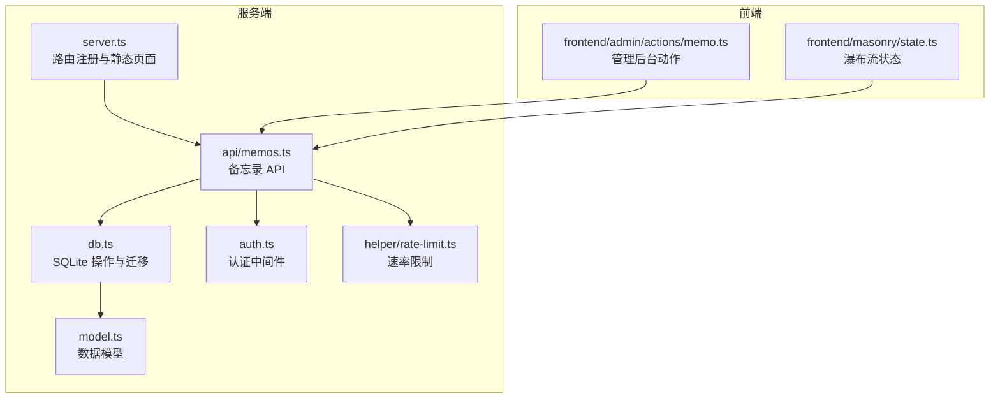
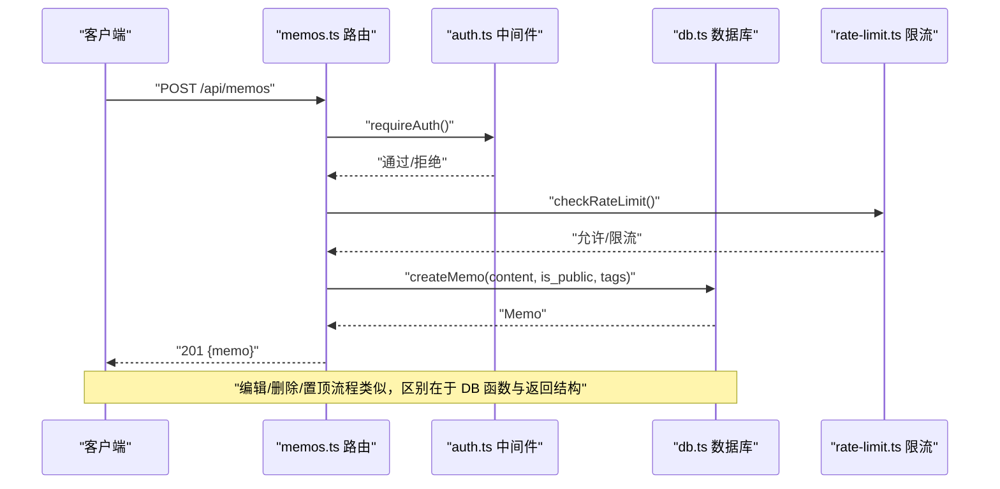
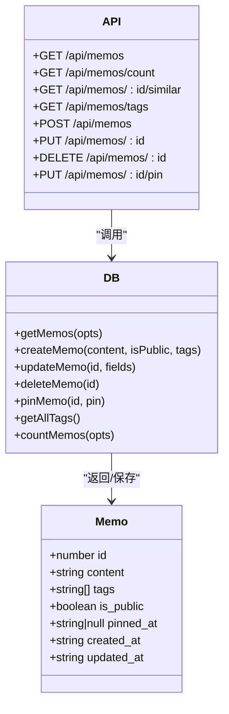
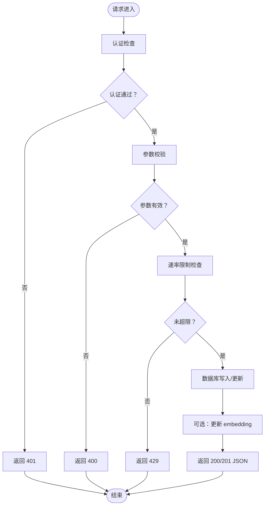

# 备忘录管理

<cite>
**本文引用的文件**
- [src/api/memos.ts](file://src/api/memos.ts)
- [src/db.ts](file://src/db.ts)
- [src/model.ts](file://src/model.ts)
- [src/auth.ts](file://src/auth.ts)
- [src/server.ts](file://src/server.ts)
- [src/frontend/admin/actions/memo.ts](file://src/frontend/admin/actions/memo.ts)
- [src/frontend/masonry/state.ts](file://src/frontend/masonry/state.ts)
- [src/api/export-import.ts](file://src/api/export-import.ts)
- [src/helper/rate-limit.ts](file://src/helper/rate-limit.ts)
- [docs/superpowers/specs/2026-05-23-memo-pin-feature-design.md](file://docs/superpowers/specs/2026-05-23-memo-pin-feature-design.md)
- [README.md](file://README.md)
</cite>

## 目录
1. [简介](#简介)
2. [项目结构](#项目结构)
3. [核心组件](#核心组件)
4. [架构总览](#架构总览)
5. [详细组件分析](#详细组件分析)
6. [依赖分析](#依赖分析)
7. [性能考量](#性能考量)
8. [故障排查指南](#故障排查指南)
9. [结论](#结论)
10. [附录](#附录)

## 简介
本文件面向“备忘录管理”功能，系统化阐述备忘录的完整生命周期：创建、编辑、删除、置顶等核心操作；数据模型字段与约束；状态管理与权限控制；排序与分页机制；以及完整的 API 接口定义与使用示例。文档同时提供错误处理与异常场景说明，帮助开发者与使用者快速上手并稳定集成。

## 项目结构
- 后端以 Hono 作为 Web 框架，路由挂载在主服务中，数据库使用 SQLite（bun:sqlite），WAL 模式提升并发写入性能。
- 前端分为瀑布流首页与管理后台两个 SPA，分别通过不同的状态模块驱动 UI 交互。
- 备忘录 API 位于 /api/memos，提供 CRUD、置顶、标签、计数、相似检索等能力。

图表来源
- [src/server.ts:38-46](file://src/server.ts#L38-L46)
- [src/api/memos.ts:26-220](file://src/api/memos.ts#L26-L220)
- [src/db.ts:15-61](file://src/db.ts#L15-L61)
- [src/model.ts:1-35](file://src/model.ts#L1-L35)
- [src/auth.ts:123-127](file://src/auth.ts#L123-L127)
- [src/helper/rate-limit.ts:1-153](file://src/helper/rate-limit.ts#L1-L153)
- [src/frontend/admin/actions/memo.ts:1-231](file://src/frontend/admin/actions/memo.ts#L1-L231)
- [src/frontend/masonry/state.ts:1-181](file://src/frontend/masonry/state.ts#L1-L181)

章节来源
- [src/server.ts:38-46](file://src/server.ts#L38-L46)
- [README.md:25-45](file://README.md#L25-L45)

## 核心组件
- 备忘录数据模型：包含 id、content、tags、is_public、pinned_at、created_at、updated_at 等字段，其中 pinned_at 为可空字符串（ISO 时间戳），用于置顶排序。
- 数据库层：提供 getMemos、createMemo、updateMemo、deleteMemo、pinMemo、getAllTags、countMemos 等函数；SQL 使用 JSON 函数支持 tags 的多值存储与查询。
- API 层：提供 GET/POST/PUT/DELETE 以及 /:id/pin 置顶接口；支持搜索、标签筛选、分页与语义检索融合。
- 前端：管理后台负责创建/编辑/删除/切换可见性/置顶；瀑布流首页负责公开列表展示与相似检索。

章节来源
- [src/model.ts:1-35](file://src/model.ts#L1-L35)
- [src/db.ts:122-249](file://src/db.ts#L122-L249)
- [src/api/memos.ts:28-220](file://src/api/memos.ts#L28-L220)
- [src/frontend/admin/actions/memo.ts:28-105](file://src/frontend/admin/actions/memo.ts#L28-L105)
- [src/frontend/masonry/state.ts:13-56](file://src/frontend/masonry/state.ts#L13-L56)

## 架构总览
备忘录管理的端到端流程如下：
- 客户端发起 API 请求（如创建、编辑、置顶、删除）。
- API 层进行认证校验与参数校验，必要时触发速率限制。
- 数据库层执行 SQL 操作，返回结果。
- 前端根据响应更新本地状态，刷新 UI。

图表来源
- [src/api/memos.ts:104-144](file://src/api/memos.ts#L104-L144)
- [src/auth.ts:111-119](file://src/auth.ts#L111-L119)
- [src/helper/rate-limit.ts:77-110](file://src/helper/rate-limit.ts#L77-L110)
- [src/db.ts:198-212](file://src/db.ts#L198-L212)

## 详细组件分析

### 数据模型与约束
- 字段说明
  - id：自增主键
  - content：必填文本
  - tags：JSON 数组字符串，默认空数组，支持多标签
  - is_public：布尔值，1 表示公开，0 表示私密
  - pinned_at：置顶时间戳（ISO 字符串），为空表示未置顶
  - created_at/updated_at：时间戳，默认当前时间
- 约束与转换
  - tags 通过 JSON 存储，查询时使用 sqlite 的 json_each 进行匹配
  - is_public 存储为整数（1/0），取回时转换为布尔
  - pinned_at 为空时参与排序视为最小值，置顶项优先

章节来源
- [src/model.ts:1-9](file://src/model.ts#L1-L9)
- [src/db.ts:18-38](file://src/db.ts#L18-L38)
- [src/db.ts:93-120](file://src/db.ts#L93-L120)

### 生命周期管理

#### 创建（POST /api/memos）
- 请求体字段
  - content：必填，非空字符串
  - is_public：可选，布尔，默认 true
  - tags：可选，字符串数组，过滤空串后去重
- 认证与限流
  - 需要认证（会话或 Bearer）
  - 触发速率限制检查，成功后记录
- 数据持久化
  - 插入 memos 表，返回新 Memo
  - 异步生成/缓存 embedding（用于后续语义检索）
- 响应
  - 201 Created，返回 { memo }

章节来源
- [src/api/memos.ts:104-144](file://src/api/memos.ts#L104-L144)
- [src/auth.ts:123-127](file://src/auth.ts#L123-L127)
- [src/helper/rate-limit.ts:77-110](file://src/helper/rate-limit.ts#L77-L110)
- [src/db.ts:198-212](file://src/db.ts#L198-L212)

#### 编辑（PUT /api/memos/:id）
- 请求体字段
  - content：可选，若提供必须非空
  - is_public：可选，布尔
  - tags：可选，字符串数组，过滤空串
- 权限与存在性
  - 需认证
  - 若 memo 不存在，返回 404
- 数据持久化
  - 更新对应字段，更新 updated_at
  - 若 content 变更，异步更新 embedding
- 响应
  - 200 OK，返回 { memo }

章节来源
- [src/api/memos.ts:147-187](file://src/api/memos.ts#L147-L187)
- [src/db.ts:214-233](file://src/db.ts#L214-L233)

#### 删除（DELETE /api/memos/:id）
- 权限与存在性
  - 需认证
  - 若 memo 不存在，返回 404
- 数据持久化
  - 删除 memos 行
  - 清理 embedding 缓存
- 响应
  - 200 OK，返回 { ok: true }

章节来源
- [src/api/memos.ts:189-199](file://src/api/memos.ts#L189-L199)
- [src/db.ts:235-239](file://src/db.ts#L235-L239)

#### 置顶/取消置顶（PUT /api/memos/:id/pin）
- 请求体字段
  - pinned：布尔，true 为置顶，false 为取消
- 权限与存在性
  - 需认证
  - 若 memo 不存在，返回 404
- 数据持久化
  - pinned=true：设置 pinned_at 为当前时间
  - pinned=false：清空 pinned_at
- 响应
  - 200 OK，返回 { memo }

章节来源
- [src/api/memos.ts:201-219](file://src/api/memos.ts#L201-L219)
- [src/db.ts:241-249](file://src/db.ts#L241-L249)
- [docs/superpowers/specs/2026-05-23-memo-pin-feature-design.md:134-157](file://docs/superpowers/specs/2026-05-23-memo-pin-feature-design.md#L134-L157)

### 状态管理与权限控制
- 认证策略
  - 支持 Cookie 会话与 Bearer Token 两种方式
  - 管理后台通过密钥登录，生成临时会话
- 权限边界
  - 列表查询默认仅返回公开备忘录
  - 当 all=true 且已认证时，返回包含私密备忘录
- 前端行为
  - 管理后台：提供切换公开/私密、置顶/取消置顶、创建/编辑/删除
  - 瀑布流首页：仅展示公开备忘录，按置顶优先排序

章节来源
- [src/auth.ts:28-46](file://src/auth.ts#L28-L46)
- [src/auth.ts:111-119](file://src/auth.ts#L111-L119)
- [src/api/memos.ts:29-36](file://src/api/memos.ts#L29-L36)
- [src/frontend/admin/actions/memo.ts:70-92](file://src/frontend/admin/actions/memo.ts#L70-L92)

### 排序与分页机制
- 默认排序规则
  - 先按是否置顶降序，再按置顶时间降序，最后按创建时间降序
- 查询参数
  - search：全文检索（LIKE content）
  - tag：逗号分隔的多个标签，任一匹配即纳入
  - all：设为 "true" 时返回包含私密备忘录（需认证）
  - page/limit：分页参数，服务端返回 hasMore 标记
- 语义检索融合
  - 当提供 search 时，先执行 LIKE 查询，再异步获取语义相似 id 并拼接结果

章节来源
- [src/db.ts:163](file://src/db.ts#L163)
- [src/api/memos.ts:29-70](file://src/api/memos.ts#L29-L70)
- [src/db.ts:141-158](file://src/db.ts#L141-L158)

### API 接口文档

- 获取备忘录列表
  - 方法：GET
  - 路径：/api/memos
  - 查询参数：
    - search：字符串，全文检索
    - tag：字符串，逗号分隔的多个标签
    - all：字符串，"true" 时包含私密
    - page：数字，页码（从 0 开始）
    - limit：数字，每页条数
  - 响应：{ memos: Memo[], hasMore: boolean } 或 { memos: Memo[] }（当 all=true）

- 获取备忘录总数
  - 方法：GET
  - 路径：/api/memos/count
  - 查询参数：all（可选）
  - 响应：{ count: number }

- 获取相似备忘录
  - 方法：GET
  - 路径：/api/memos/:id/similar
  - 响应：{ memos: Memo[] }

- 获取标签列表
  - 方法：GET
  - 路径：/api/memos/tags
  - 响应：{ tags: string[] }

- 创建备忘录
  - 方法：POST
  - 路径：/api/memos
  - 请求体：{ content: string, is_public?: boolean, tags?: string[] }
  - 响应：{ memo: Memo }

- 更新备忘录
  - 方法：PUT
  - 路径：/api/memos/:id
  - 请求体：{ content?: string, is_public?: boolean, tags?: string[] }
  - 响应：{ memo: Memo }

- 删除备忘录
  - 方法：DELETE
  - 路径：/api/memos/:id
  - 响应：{ ok: true }

- 置顶/取消置顶
  - 方法：PUT
  - 路径：/api/memos/:id/pin
  - 请求体：{ pinned: boolean }
  - 响应：{ memo: Memo }

章节来源
- [src/api/memos.ts:28-220](file://src/api/memos.ts#L28-L220)
- [src/db.ts:171-188](file://src/db.ts#L171-L188)

### 使用场景与示例

- 场景一：创建公开备忘录并立即置顶
  - 步骤：POST /api/memos -> POST /api/memos/:id/pin
  - 注意：置顶使用独立子路由，便于职责分离

- 场景二：批量导入并保留置顶状态
  - 步骤：上传导入文件 -> 服务端解析 -> importMemo 写入（含 pinned_at）
  - 导出格式包含 pinned 字段，便于跨系统迁移

- 场景三：瀑布流首页展示与搜索
  - 步骤：GET /api/memos?search=...&tag=... -> 前端瀑布流渲染
  - 瀑布流组件会根据 pinnedAt 决定是否显示置顶徽标

章节来源
- [src/frontend/admin/actions/memo.ts:43-68](file://src/frontend/admin/actions/memo.ts#L43-L68)
- [src/api/export-import.ts:165-181](file://src/api/export-import.ts#L165-L181)
- [src/api/export-import.ts:233-248](file://src/api/export-import.ts#L233-L248)
- [src/frontend/masonry/state.ts:13-20](file://src/frontend/masonry/state.ts#L13-L20)

## 依赖分析

图表来源
- [src/model.ts:1-9](file://src/model.ts#L1-L9)
- [src/db.ts:122-249](file://src/db.ts#L122-L249)
- [src/api/memos.ts:28-220](file://src/api/memos.ts#L28-L220)

章节来源
- [src/db.ts:15-61](file://src/db.ts#L15-L61)
- [src/api/memos.ts:26-220](file://src/api/memos.ts#L26-L220)

## 性能考量
- 排序与索引
  - 排序逻辑：pinned_at IS NOT NULL DESC -> pinned_at DESC -> created_at DESC
  - 索引：pinned_at 列建立索引，提升置顶排序效率
- 分页
  - 服务端分页，hasMore 标记避免前端重复请求
- 语义检索
  - 搜索时先 LIKE 结果，再异步融合语义相似结果，保证主流程快速返回
- 速率限制
  - 每 IP 小时/天双窗口限制，防止滥用

章节来源
- [src/db.ts:30](file://src/db.ts#L30)
- [src/db.ts:163](file://src/db.ts#L163)
- [src/api/memos.ts:38-54](file://src/api/memos.ts#L38-L54)
- [src/helper/rate-limit.ts:77-110](file://src/helper/rate-limit.ts#L77-L110)

## 故障排查指南
- 常见错误与处理
  - 400 Bad Request：请求体无效或 content 为空
  - 401 Unauthorized：未认证或 Bearer 密钥不正确
  - 404 Not Found：memo 不存在
  - 429 Too Many Requests：触发速率限制
- 前端错误提示
  - 管理后台：全局错误状态 globalError
  - 瀑布流首页：error、similarError 等状态
- 建议排查步骤
  - 确认认证头或 Cookie 是否正确
  - 检查请求体 JSON 格式与字段类型
  - 查看服务端日志与速率限制配置
  - 验证数据库连接与表结构（pinned_at 列）

章节来源
- [src/api/memos.ts:104-144](file://src/api/memos.ts#L104-L144)
- [src/api/memos.ts:147-187](file://src/api/memos.ts#L147-L187)
- [src/api/memos.ts:189-199](file://src/api/memos.ts#L189-L199)
- [src/api/memos.ts:201-219](file://src/api/memos.ts#L201-L219)
- [src/auth.ts:111-119](file://src/auth.ts#L111-L119)
- [src/helper/rate-limit.ts:143-152](file://src/helper/rate-limit.ts#L143-L152)
- [src/frontend/admin/actions/memo.ts:36-40](file://src/frontend/admin/actions/memo.ts#L36-L40)
- [src/frontend/masonry/state.ts:48-56](file://src/frontend/masonry/state.ts#L48-L56)

## 结论
本系统围绕 SQLite + Hono 的轻量架构，提供了完备的备忘录生命周期管理与置顶功能。通过清晰的 API 设计、严格的认证与限流策略、合理的排序与分页机制，以及前后端协同的状态管理，能够满足个人与小团队的日常备忘录需求。建议在生产环境中结合速率限制配置与日志监控，持续优化用户体验与系统稳定性。

## 附录

### API 流程图（创建/编辑/删除/置顶）

图表来源
- [src/api/memos.ts:104-144](file://src/api/memos.ts#L104-L144)
- [src/api/memos.ts:147-187](file://src/api/memos.ts#L147-L187)
- [src/api/memos.ts:189-199](file://src/api/memos.ts#L189-L199)
- [src/api/memos.ts:201-219](file://src/api/memos.ts#L201-L219)
- [src/auth.ts:111-119](file://src/auth.ts#L111-L119)
- [src/helper/rate-limit.ts:77-110](file://src/helper/rate-limit.ts#L77-L110)