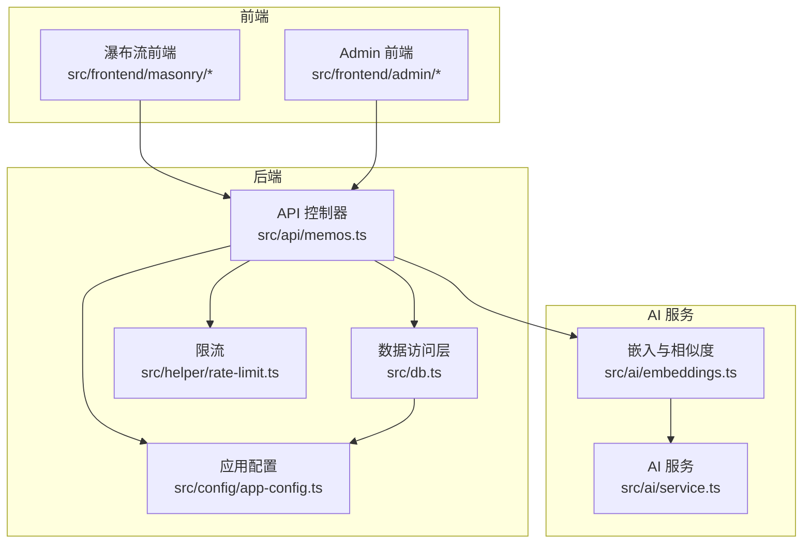
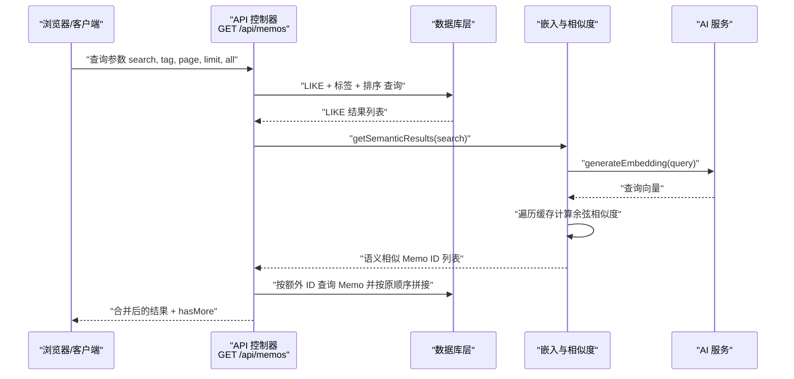
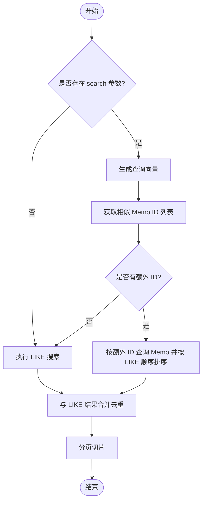
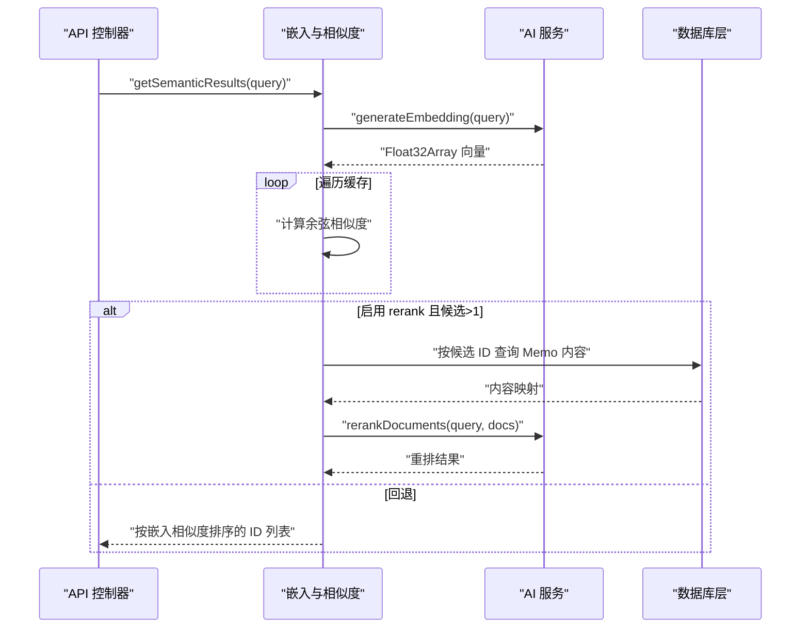
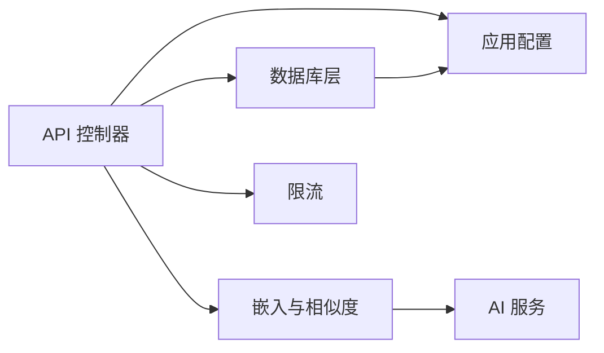

# 搜索功能

<cite>
**本文引用的文件**
- [src/api/memos.ts](file://src/api/memos.ts)
- [src/db.ts](file://src/db.ts)
- [src/ai/embeddings.ts](file://src/ai/embeddings.ts)
- [src/ai/service.ts](file://src/ai/service.ts)
- [src/config/app-config.ts](file://src/config/app-config.ts)
- [src/helper/rate-limit.ts](file://src/helper/rate-limit.ts)
- [src/frontend/masonry/api.ts](file://src/frontend/masonry/api.ts)
- [src/frontend/masonry/components.ts](file://src/frontend/masonry/components.ts)
- [src/frontend/masonry/state.ts](file://src/frontend/masonry/state.ts)
- [src/frontend/masonry/index.ts](file://src/frontend/masonry/index.ts)
- [src/frontend/admin/components/MemoCard.ts](file://src/frontend/admin/components/MemoCard.ts)
- [src/model.ts](file://src/model.ts)
- [app.config.json](file://app.config.json)
- [ai.config.json](file://ai.config.json)
</cite>

## 目录
1. [简介](#简介)
2. [项目结构](#项目结构)
3. [核心组件](#核心组件)
4. [架构总览](#架构总览)
5. [详细组件分析](#详细组件分析)
6. [依赖关系分析](#依赖关系分析)
7. [性能考量](#性能考量)
8. [故障排查指南](#故障排查指南)
9. [结论](#结论)
10. [附录](#附录)

## 简介
本文件系统性阐述本项目的“混合搜索”能力，即同时融合传统全文 LIKE 搜索与语义向量相似度搜索，并对全文检索的实现细节、向量嵌入的生成与存储、相似度计算与重排、以及搜索结果的合并与去重策略进行深入解析。文档还覆盖搜索 API 的参数与返回格式、分页与限流策略、Admin 管理界面与公开展示页面的搜索体验差异，以及调试与监控建议。

## 项目结构
围绕搜索功能的关键模块分布如下：
- 后端 API 层：负责接收查询参数、执行 LIKE 搜索、触发语义搜索、合并结果、分页与限流。
- 数据访问层：封装 SQLite 访问、LIKE 条件拼装、标签过滤、排序逻辑、嵌入向量表维护。
- AI 服务层：提供嵌入向量生成、可选的重排（rerank）调用、可用性检测。
- 嵌入缓存与相似度引擎：在内存中维护向量缓存，基于余弦相似度打分，支持候选集重排。
- 前端展示层：公开展示页面（瀑布流）与 Admin 管理界面分别承载不同的搜索交互与结果呈现。

**图表来源**
- [src/api/memos.ts:28-70](file://src/api/memos.ts#L28-L70)
- [src/db.ts:122-169](file://src/db.ts#L122-L169)
- [src/ai/embeddings.ts:95-154](file://src/ai/embeddings.ts#L95-L154)
- [src/ai/service.ts:349-385](file://src/ai/service.ts#L349-L385)
- [src/config/app-config.ts:9-29](file://src/config/app-config.ts#L9-L29)
- [src/helper/rate-limit.ts:77-110](file://src/helper/rate-limit.ts#L77-L110)

**章节来源**
- [src/api/memos.ts:28-70](file://src/api/memos.ts#L28-L70)
- [src/db.ts:122-169](file://src/db.ts#L122-L169)
- [src/ai/embeddings.ts:95-154](file://src/ai/embeddings.ts#L95-L154)
- [src/ai/service.ts:349-385](file://src/ai/service.ts#L349-L385)
- [src/config/app-config.ts:9-29](file://src/config/app-config.ts#L9-L29)
- [src/helper/rate-limit.ts:77-110](file://src/helper/rate-limit.ts#L77-L110)

## 核心组件
- 混合搜索控制器：在 GET /api/memos 中先执行 LIKE 搜索，再并发触发语义搜索，将语义结果补充到 LIKE 结果之后，保持原有顺序优先。
- LIKE 搜索与过滤：支持按内容关键词、标签集合、是否包含私有内容、分页参数等条件组合查询。
- 语义搜索与重排：生成查询向量，计算与缓存向量的余弦相似度，按阈值筛选候选，可选地通过 rerank 进一步重排。
- 嵌入缓存与持久化：启动时加载已有向量，缺失的向量异步补齐；更新/删除 Memo 时同步维护向量缓存与数据库记录。
- 分页与限流：后端分页参数 page/limit，前端瀑布流默认每页 50；速率限制按 IP 与类别（memo/ai）双窗口控制。
- 前端搜索体验：公开展示页面支持搜索框与标签筛选，Admin 界面提供更丰富的编辑与 AI 工具入口。

**章节来源**
- [src/api/memos.ts:28-70](file://src/api/memos.ts#L28-L70)
- [src/db.ts:122-169](file://src/db.ts#L122-L169)
- [src/ai/embeddings.ts:95-154](file://src/ai/embeddings.ts#L95-L154)
- [src/ai/service.ts:349-385](file://src/ai/service.ts#L349-L385)
- [src/frontend/masonry/api.ts:51-130](file://src/frontend/masonry/api.ts#L51-L130)
- [src/frontend/masonry/components.ts:52-130](file://src/frontend/masonry/components.ts#L52-L130)
- [src/helper/rate-limit.ts:77-110](file://src/helper/rate-limit.ts#L77-L110)

## 架构总览
混合搜索的端到端流程如下：

**图表来源**
- [src/api/memos.ts:28-70](file://src/api/memos.ts#L28-L70)
- [src/db.ts:122-169](file://src/db.ts#L122-L169)
- [src/ai/embeddings.ts:95-154](file://src/ai/embeddings.ts#L95-L154)
- [src/ai/service.ts:349-385](file://src/ai/service.ts#L349-L385)

## 详细组件分析

### 混合搜索机制与结果合并
- LIKE 搜索：根据 includePrivate、search 关键词、tag 标签集合构造 WHERE 条件，按置顶优先、时间倒序排序。
- 语义搜索：当存在 search 时，异步调用 getSemanticResults 获取相似 Memo ID 列表；若存在额外 ID，则按原始 LIKE 结果的 ID 顺序对这些 Memo 进行二次查询并追加到结果末尾。
- 合并策略：以 LIKE 结果为主，语义结果仅作为补充，且不改变 LIKE 结果的相对顺序；通过 Set 去重，避免重复 ID。

**图表来源**
- [src/api/memos.ts:38-70](file://src/api/memos.ts#L38-L70)
- [src/db.ts:122-169](file://src/db.ts#L122-L169)
- [src/ai/embeddings.ts:95-154](file://src/ai/embeddings.ts#L95-L154)

**章节来源**
- [src/api/memos.ts:28-70](file://src/api/memos.ts#L28-L70)
- [src/db.ts:122-169](file://src/db.ts#L122-L169)

### 全文搜索技术实现
- 文本预处理：前端在瀑布流中对 Markdown 进行渲染与 HTML 标签剥离，得到纯文本用于布局与显示；后端 LIKE 搜索直接对 content 字段进行模糊匹配。
- 索引策略：SQLite memos 表未显式创建全文索引，采用 LIKE %keyword% 的方式；对于标签过滤，使用 sqlite json_each 函数进行集合匹配。
- 排序规则：优先置顶（pinned_at 非空且越新越前），其次按置顶时间倒序，最后按创建时间倒序。
- 性能权衡：LIKE 模糊匹配在大数据量下成本较高，结合语义搜索与阈值过滤可减少无效扫描。

**章节来源**
- [src/db.ts:122-169](file://src/db.ts#L122-L169)
- [src/frontend/masonry/api.ts:91-103](file://src/frontend/masonry/api.ts#L91-L103)

### 语义搜索工作流程
- 嵌入向量生成：首次调用 generateEmbedding 时通过 DashScope API 生成维度为 1024 的浮点向量，失败则返回空。
- 缓存与持久化：初始化时从 memo_embeddings 表加载已有向量至内存 Map；新增/更新 Memo 时异步生成并向量缓存写入，同时持久化到数据库。
- 相似度计算：对缓存中的每个向量计算余弦相似度，保留超过 similarityThreshold 的候选。
- 候选重排：若启用 rerank，取候选 TopN 对应 Memo 内容进行重排，返回最终排序后的 ID 列表；失败时回退到嵌入排序。

**图表来源**
- [src/ai/embeddings.ts:95-154](file://src/ai/embeddings.ts#L95-L154)
- [src/ai/service.ts:349-385](file://src/ai/service.ts#L349-L385)
- [src/db.ts:253-275](file://src/db.ts#L253-L275)

**章节来源**
- [src/ai/embeddings.ts:16-64](file://src/ai/embeddings.ts#L16-L64)
- [src/ai/embeddings.ts:95-154](file://src/ai/embeddings.ts#L95-L154)
- [src/ai/service.ts:349-385](file://src/ai/service.ts#L349-L385)
- [src/db.ts:253-275](file://src/db.ts#L253-L275)

### 搜索结果合并与去重
- 去重策略：使用 Set 记录 LIKE 已有 ID，仅将不在其中的语义 ID 追加。
- 顺序保持：按 LIKE 结果中 ID 的先后顺序对额外 Memo 排序，确保主次顺序稳定。
- 异常容错：语义搜索失败时不会中断整体返回，LIKE 结果仍正常返回。

**章节来源**
- [src/api/memos.ts:38-54](file://src/api/memos.ts#L38-L54)

### 搜索 API 定义
- 路由：GET /api/memos
- 查询参数
  - search: 可选，字符串，用于 LIKE 搜索与语义搜索。
  - tag: 可选，字符串，支持逗号分隔的多标签，任一匹配即命中。
  - page: 可选，默认 0，整数，分页页码。
  - limit: 可选，默认 50，整数，单页条数。
  - all: 可选，布尔字符串，为 true 时管理员可见全部（无分页）。
- 返回体
  - 当 all=false（默认）：返回 { memos: Memo[], hasMore: boolean }，其中 Memo 至少包含 id、content、updated_at、pinned_at。
  - 当 all=true：返回 { memos: Memo[] }。
- 类似推荐接口：GET /api/memos/:id/similar，返回相似 Memo 列表（不含自身）。

**章节来源**
- [src/api/memos.ts:28-70](file://src/api/memos.ts#L28-L70)
- [src/api/memos.ts:79-95](file://src/api/memos.ts#L79-L95)
- [src/model.ts:1-9](file://src/model.ts#L1-L9)

### 前端搜索体验
- 公开展示页面（瀑布流）
  - 支持搜索框与标签筛选，URL 同步 bookmarkable；默认每页 50。
  - 加载更多：滚动触底自动发起下一页请求。
- Admin 管理界面
  - 提供编辑、置顶/取消置顶、删除、AI 工具箱等操作入口，便于对搜索结果进行精细化管理。

**章节来源**
- [src/frontend/masonry/api.ts:51-130](file://src/frontend/masonry/api.ts#L51-L130)
- [src/frontend/masonry/components.ts:52-130](file://src/frontend/masonry/components.ts#L52-L130)
- [src/frontend/masonry/index.ts:1-23](file://src/frontend/masonry/index.ts#L1-L23)
- [src/frontend/admin/components/MemoCard.ts:61-346](file://src/frontend/admin/components/MemoCard.ts#L61-L346)

## 依赖关系分析
- 配置依赖：相似度阈值、候选 TopN、最终 TopN、重排开关等均来自应用配置；限流阈值来自配置与环境变量。
- 数据依赖：LIKE 搜索依赖 memos 表；语义搜索依赖 memo_embeddings 表与内存缓存。
- 外部依赖：DashScope 嵌入与重排服务；可选的多提供商聊天模型（用于其他 AI 功能）。

**图表来源**
- [src/api/memos.ts:28-70](file://src/api/memos.ts#L28-L70)
- [src/db.ts:122-169](file://src/db.ts#L122-L169)
- [src/ai/embeddings.ts:95-154](file://src/ai/embeddings.ts#L95-L154)
- [src/ai/service.ts:349-385](file://src/ai/service.ts#L349-L385)
- [src/config/app-config.ts:9-29](file://src/config/app-config.ts#L9-L29)
- [src/helper/rate-limit.ts:77-110](file://src/helper/rate-limit.ts#L77-L110)

**章节来源**
- [src/config/app-config.ts:9-29](file://src/config/app-config.ts#L9-L29)
- [app.config.json:1-22](file://app.config.json#L1-L22)
- [ai.config.json:1-44](file://ai.config.json#L1-L44)

## 性能考量
- 嵌入缓存：启动时批量加载向量至内存，避免每次查询都访问数据库；新增/更新/删除 Memo 时同步维护缓存与数据库，保证一致性。
- 相似度阈值：通过配置项 similarityThreshold 过滤低相关候选，降低后续重排压力。
- 候选重排：候选 TopN 与最终 TopN 可控，避免对大量候选做昂贵重排。
- 分页与限流：后端分页避免一次性返回过多数据；前端瀑布流默认每页 50，滚动加载；速率限制防止滥用。
- LIKE 性能：LIKE %keyword% 在大表上成本高，建议配合标签过滤与阈值提升命中质量。

**章节来源**
- [src/ai/embeddings.ts:16-64](file://src/ai/embeddings.ts#L16-L64)
- [src/ai/embeddings.ts:95-154](file://src/ai/embeddings.ts#L95-L154)
- [src/config/app-config.ts:39-46](file://src/config/app-config.ts#L39-L46)
- [src/frontend/masonry/api.ts:63-68](file://src/frontend/masonry/api.ts#L63-L68)
- [src/helper/rate-limit.ts:77-110](file://src/helper/rate-limit.ts#L77-L110)

## 故障排查指南
- 语义搜索无结果
  - 检查 AI 可用性：确认 DASHSCOPE_API_KEY 环境变量已设置且 isAiAvailable().embedding 为真。
  - 检查相似度阈值：适当提高 similarityThreshold。
  - 检查缓存：确认 initEmbeddingCache 是否成功加载向量并生成缺失向量。
- 重排失败回退
  - 若 rerankDocuments 抛错或返回空，系统会回退到嵌入排序；可在日志中查看相关警告。
- LIKE 搜索性能差
  - 优先使用标签过滤；避免过短或过于宽泛的关键词；必要时考虑引入 FTS5 或外部搜索引擎。
- 限流触发
  - 查看客户端 IP 与分类（memo/ai）的小时/日配额；调整 app.config.json 或环境变量。

**章节来源**
- [src/ai/service.ts:98-115](file://src/ai/service.ts#L98-L115)
- [src/ai/embeddings.ts:147-150](file://src/ai/embeddings.ts#L147-L150)
- [src/config/app-config.ts:9-29](file://src/config/app-config.ts#L9-L29)
- [src/helper/rate-limit.ts:77-110](file://src/helper/rate-limit.ts#L77-L110)

## 结论
本项目通过“LIKE + 语义”的混合搜索，在保证传统全文检索易用性的同时，引入向量相似度与可选重排，显著提升了语义相关性与召回质量。通过嵌入缓存、阈值过滤、候选重排与分页限流等策略，系统在可用性与性能之间取得平衡。Admin 与公开展示页面分别满足管理与浏览的不同需求，形成完整的搜索体验闭环。

## 附录

### 配置项一览
- 应用配置（app.config.json）
  - ai.requestTimeoutMs, ai.defaultMaxTokens, ai.defaultTemperature
  - embeddings.similarityThreshold
  - rerank.enabled, rerank.candidateTopN, rerank.finalTopN
  - rateLimit.memosPerHour, rateLimit.memosPerDay, rateLimit.aiPerHour, rateLimit.aiPerDay
- AI 提供商配置（ai.config.json）
  - providers[].id/name/endpoint/apiKeyEnv/models
  - default.provider/default.model

**章节来源**
- [app.config.json:1-22](file://app.config.json#L1-L22)
- [ai.config.json:1-44](file://ai.config.json#L1-L44)
- [src/config/app-config.ts:9-29](file://src/config/app-config.ts#L9-L29)