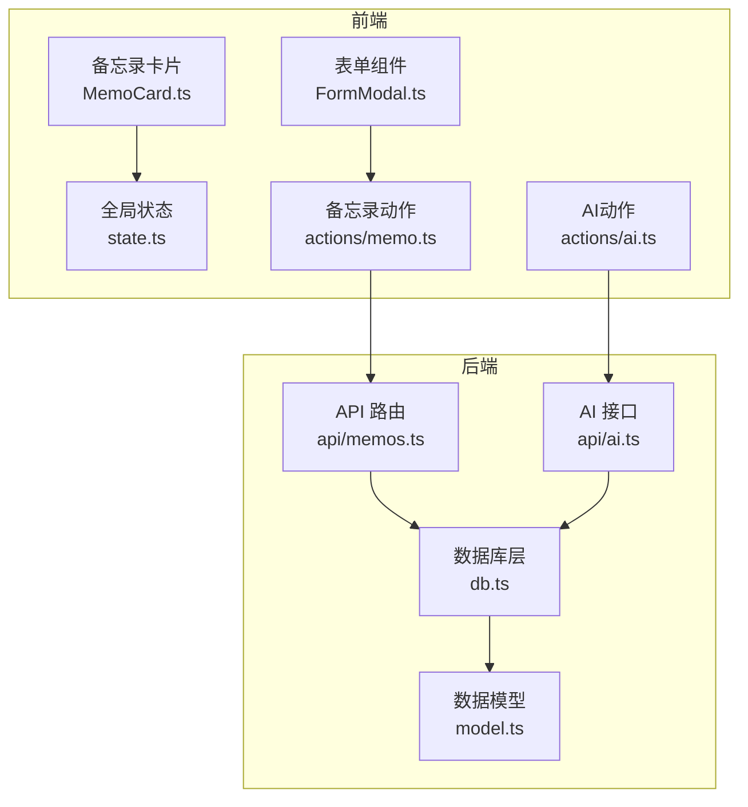
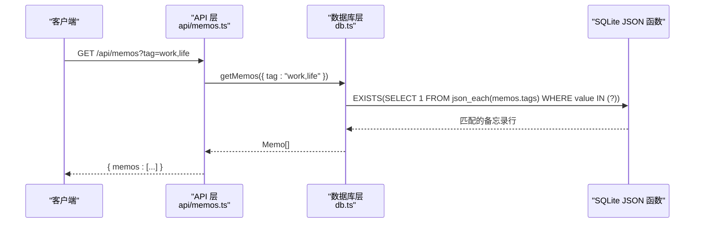
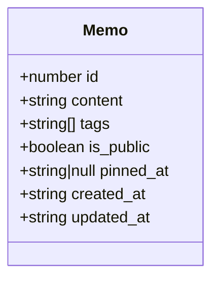
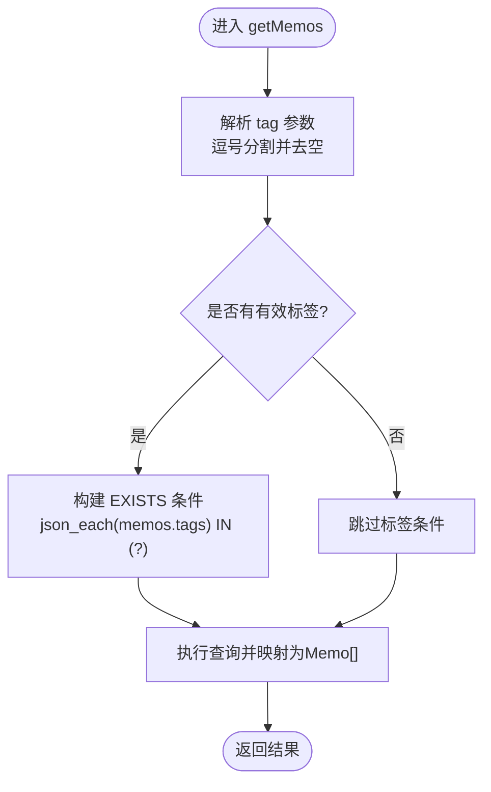
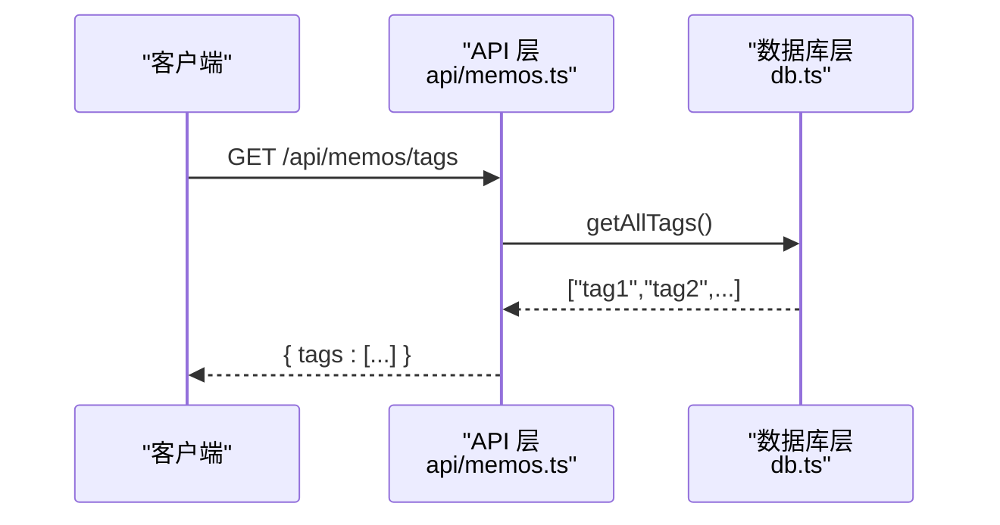
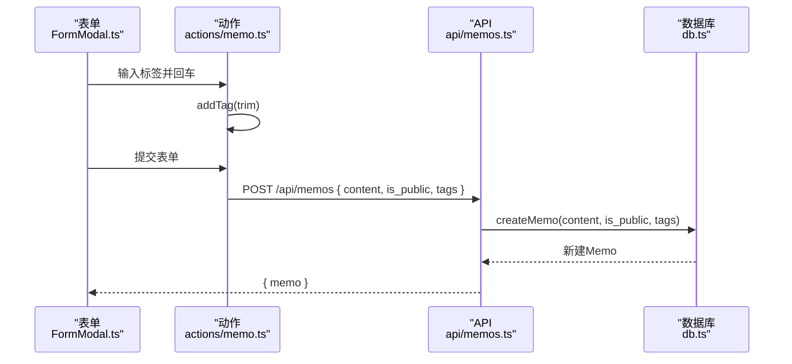
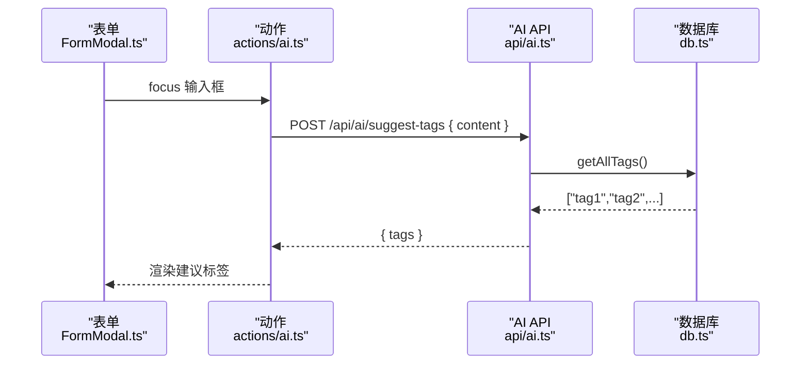
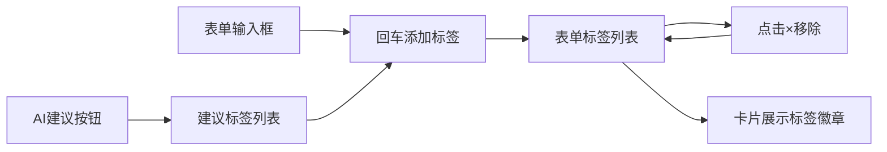
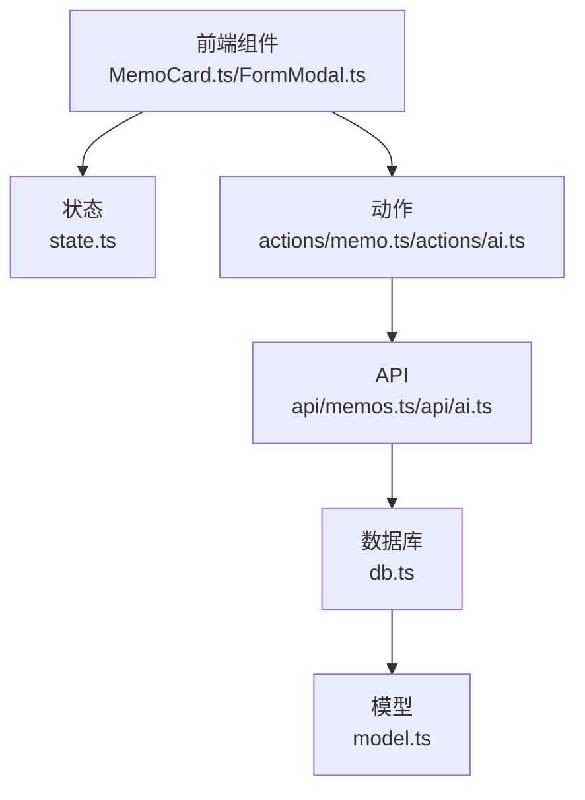

# 标签系统

<cite>
**本文引用的文件**
- [model.ts](file://src/model.ts)
- [db.ts](file://src/db.ts)
- [memos.ts](file://src/api/memos.ts)
- [ai.ts](file://src/api/ai.ts)
- [state.ts](file://src/frontend/admin/state.ts)
- [MemoCard.ts](file://src/frontend/admin/components/MemoCard.ts)
- [FormModal.ts](file://src/frontend/admin/components/FormModal.ts)
- [memo.ts](file://src/frontend/admin/actions/memo.ts)
- [ai.ts](file://src/frontend/admin/actions/ai.ts)
- [README.md](file://README.md)
</cite>

## 目录
1. [简介](#简介)
2. [项目结构](#项目结构)
3. [核心组件](#核心组件)
4. [架构总览](#架构总览)
5. [详细组件分析](#详细组件分析)
6. [依赖分析](#依赖分析)
7. [性能考虑](#性能考虑)
8. [故障排查指南](#故障排查指南)
9. [结论](#结论)
10. [附录](#附录)

## 简介
本文件系统性阐述备忘录系统的标签设计与实现，覆盖标签的创建、分配、过滤、统计与搜索机制；解释备忘录与标签之间的多对多关系模型及数据存储方式；详述标签API与前端交互体验；并提供性能优化策略与大数据量场景下的处理方案。

## 项目结构
标签系统贯穿后端数据库层、API层与前端界面层：
- 数据模型层：定义备忘录与标签的数据结构
- 数据库层：负责标签字段的序列化/反序列化、查询与索引
- API层：提供标签相关的HTTP接口与业务逻辑
- 前端层：负责标签的输入、展示、交互与AI建议

图表来源
- [memos.ts:1-220](file://src/api/memos.ts#L1-L220)
- [ai.ts:74-112](file://src/api/ai.ts#L74-L112)
- [db.ts:1-484](file://src/db.ts#L1-L484)
- [model.ts:1-35](file://src/model.ts#L1-L35)
- [state.ts:1-178](file://src/frontend/admin/state.ts#L1-L178)
- [FormModal.ts:63-250](file://src/frontend/admin/components/FormModal.ts#L63-L250)
- [MemoCard.ts:61-346](file://src/frontend/admin/components/MemoCard.ts#L61-L346)
- [memo.ts:1-231](file://src/frontend/admin/actions/memo.ts#L1-L231)
- [ai.ts:107-137](file://src/frontend/admin/actions/ai.ts#L107-L137)

章节来源
- [README.md:1-186](file://README.md#L1-L186)

## 核心组件
- 数据模型：备忘录对象包含标签数组字段，用于表达多对多关系
- 数据库层：标签以JSON数组形式存储在memos表的tags字段中，提供解析与查询函数
- API层：提供获取标签列表、按标签过滤备忘录、创建/更新备忘录时的标签处理
- 前端层：表单输入标签、卡片展示标签、AI建议标签、状态管理与交互

章节来源
- [model.ts:1-9](file://src/model.ts#L1-L9)
- [db.ts:93-120](file://src/db.ts#L93-L120)
- [memos.ts:97-144](file://src/api/memos.ts#L97-L144)
- [state.ts:167-178](file://src/frontend/admin/state.ts#L167-L178)
- [FormModal.ts:63-103](file://src/frontend/admin/components/FormModal.ts#L63-L103)
- [MemoCard.ts:61-102](file://src/frontend/admin/components/MemoCard.ts#L61-L102)

## 架构总览
标签系统围绕“JSON数组存储 + SQLite JSON 函数查询”的模式实现，具备如下能力：
- 标签创建与分配：创建/更新备忘录时传入标签数组，后端进行去空与去重处理
- 标签过滤：支持逗号分隔的多个标签，匹配任一标签即纳入结果
- 标签统计：提供获取所有标签列表的接口
- 标签搜索：结合全文检索与语义检索，提升查找效率
- 前端交互：表单输入、卡片展示、AI建议与状态管理

图表来源
- [memos.ts:28-70](file://src/api/memos.ts#L28-L70)
- [db.ts:122-169](file://src/db.ts#L122-L169)

## 详细组件分析

### 数据模型与存储
- 备忘录模型包含tags字段，类型为字符串数组，用于表达多对多关系
- 数据库存储tags为JSON字符串，默认为空数组
- 解析逻辑：优先尝试JSON解析，兼容旧版本纯字符串标签；过滤空字符串，确保数据一致性

图表来源
- [model.ts:1-9](file://src/model.ts#L1-L9)
- [db.ts:93-120](file://src/db.ts#L93-L120)

章节来源
- [model.ts:1-9](file://src/model.ts#L1-L9)
- [db.ts:18-28](file://src/db.ts#L18-L28)
- [db.ts:93-120](file://src/db.ts#L93-L120)

### 标签过滤与查询
- 支持逗号分隔的多标签过滤，任一匹配即纳入结果
- 使用SQLite的json_each函数展开tags字段，配合IN子查询实现高效匹配
- 结合全文检索与语义检索，提升搜索质量与性能

图表来源
- [db.ts:122-169](file://src/db.ts#L122-L169)
- [memos.ts:28-70](file://src/api/memos.ts#L28-L70)

章节来源
- [db.ts:122-169](file://src/db.ts#L122-L169)
- [memos.ts:28-70](file://src/api/memos.ts#L28-L70)

### 标签列表与统计
- 获取所有标签：遍历memos表，使用json_each展开tags，DISTINCT去重，过滤空字符串并排序
- 统计总数：提供count接口，支持是否包含私密备忘录的选项

图表来源
- [memos.ts:97-101](file://src/api/memos.ts#L97-L101)
- [db.ts:171-179](file://src/db.ts#L171-L179)

章节来源
- [memos.ts:97-101](file://src/api/memos.ts#L97-L101)
- [db.ts:171-179](file://src/db.ts#L171-L179)

### 标签创建与更新
- 创建：接收content、is_public、tags数组，过滤空标签后序列化为JSON存入数据库
- 更新：合并现有tags与新tags，同样过滤空标签并更新JSON
- 前端：表单输入标签，支持回车添加、点击移除、AI建议

图表来源
- [FormModal.ts:63-103](file://src/frontend/admin/components/FormModal.ts#L63-L103)
- [memo.ts:109-115](file://src/frontend/admin/actions/memo.ts#L109-L115)
- [memos.ts:103-144](file://src/api/memos.ts#L103-L144)
- [db.ts:198-212](file://src/db.ts#L198-L212)

章节来源
- [FormModal.ts:63-103](file://src/frontend/admin/components/FormModal.ts#L63-L103)
- [memo.ts:109-115](file://src/frontend/admin/actions/memo.ts#L109-L115)
- [memos.ts:103-144](file://src/api/memos.ts#L103-L144)
- [db.ts:198-212](file://src/db.ts#L198-L212)

### 标签验证与清理机制
- 后端：过滤空字符串标签，确保tags数组只包含非空字符串
- 前端：输入时trim，避免重复添加，点击移除
- 兼容旧数据：解析阶段兼容旧版纯字符串标签，自动包裹为数组

章节来源
- [db.ts:93-108](file://src/db.ts#L93-L108)
- [db.ts:204-206](file://src/db.ts#L204-L206)
- [db.ts:226-226](file://src/db.ts#L226-L226)
- [memo.ts:109-119](file://src/frontend/admin/actions/memo.ts#L109-L119)

### 标签搜索与AI建议
- 标签搜索：GET /api/memos?tag=... 支持多标签逗号分隔，任一匹配即返回
- AI标签建议：POST /api/ai/suggest-tags，基于现有标签集合与内容生成建议
- 前端：输入框聚焦时触发建议，支持点击添加

图表来源
- [FormModal.ts:98-103](file://src/frontend/admin/components/FormModal.ts#L98-L103)
- [ai.ts:107-137](file://src/frontend/admin/actions/ai.ts#L107-L137)
- [ai.ts:74-112](file://src/api/ai.ts#L74-L112)
- [db.ts:171-179](file://src/db.ts#L171-L179)

章节来源
- [memos.ts:28-70](file://src/api/memos.ts#L28-L70)
- [ai.ts:74-112](file://src/api/ai.ts#L74-L112)
- [FormModal.ts:98-103](file://src/frontend/admin/components/FormModal.ts#L98-L103)
- [ai.ts:107-137](file://src/frontend/admin/actions/ai.ts#L107-L137)

### 前端界面与交互
- 卡片展示：每个备忘录卡片底部展示标签徽章
- 表单交互：输入框回车添加标签，已存在或空标签不重复添加；点击×移除
- AI建议：展示AI推荐标签，点击+添加至表单标签列表
- 状态管理：全局状态维护可用标签列表、表单标签、AI建议状态等

图表来源
- [MemoCard.ts:61-102](file://src/frontend/admin/components/MemoCard.ts#L61-L102)
- [FormModal.ts:63-103](file://src/frontend/admin/components/FormModal.ts#L63-L103)
- [FormModal.ts:225-250](file://src/frontend/admin/components/FormModal.ts#L225-L250)
- [state.ts:167-178](file://src/frontend/admin/state.ts#L167-L178)

章节来源
- [MemoCard.ts:61-102](file://src/frontend/admin/components/MemoCard.ts#L61-L102)
- [FormModal.ts:63-103](file://src/frontend/admin/components/FormModal.ts#L63-L103)
- [FormModal.ts:225-250](file://src/frontend/admin/components/FormModal.ts#L225-L250)
- [state.ts:167-178](file://src/frontend/admin/state.ts#L167-L178)

## 依赖分析
- 后端依赖：API层依赖数据库层；数据库层依赖SQLite JSON函数；模型定义贯穿三层
- 前端依赖：组件依赖状态与动作模块；动作模块依赖API；API依赖后端接口

图表来源
- [MemoCard.ts:61-102](file://src/frontend/admin/components/MemoCard.ts#L61-L102)
- [FormModal.ts:63-103](file://src/frontend/admin/components/FormModal.ts#L63-L103)
- [state.ts:167-178](file://src/frontend/admin/state.ts#L167-L178)
- [memo.ts:1-231](file://src/frontend/admin/actions/memo.ts#L1-L231)
- [ai.ts:107-137](file://src/frontend/admin/actions/ai.ts#L107-L137)
- [memos.ts:1-220](file://src/api/memos.ts#L1-L220)
- [ai.ts:74-112](file://src/api/ai.ts#L74-L112)
- [db.ts:1-484](file://src/db.ts#L1-L484)
- [model.ts:1-35](file://src/model.ts#L1-L35)

## 性能考虑
- 查询优化
  - 使用json_each展开tags进行IN匹配，避免复杂JOIN
  - 仅在需要时构建标签过滤条件，减少SQL复杂度
- 分页与限制
  - 列表接口支持分页与limit，避免一次性加载过多数据
  - 标签模式的AI生成与聊天上下文限制最大数量，防止Token溢出
- 缓存与异步
  - 创建/更新备忘录后，嵌入向量生成采用fire-and-forget异步任务
  - 删除备忘录时清理嵌入缓存，避免脏数据
- 存储与索引
  - memos表包含必要索引（如pinned_at），提升排序与筛选性能
  - tags字段为JSON数组，适合小到中等规模标签集

章节来源
- [db.ts:30-38](file://src/db.ts#L30-L38)
- [memos.ts:62-70](file://src/api/memos.ts#L62-L70)
- [ai.ts:124-125](file://src/api/ai.ts#L124-L125)
- [memos.ts:138-141](file://src/api/memos.ts#L138-L141)
- [memos.ts:195-197](file://src/api/memos.ts#L195-L197)

## 故障排查指南
- 标签未生效
  - 检查前端输入是否为空或重复；确认addTag返回值
  - 检查后端过滤逻辑是否正确（空标签被过滤）
- 标签搜索无结果
  - 确认tag参数格式（逗号分隔）且均非空
  - 确认数据库中tags字段为合法JSON数组
- AI标签建议失败
  - 检查AI服务配置与可用性
  - 确认请求体content非空且provider/model有效
- 前端显示异常
  - 检查状态是否正确更新（availableTags、aiSuggestedTags）

章节来源
- [memo.ts:109-115](file://src/frontend/admin/actions/memo.ts#L109-L115)
- [db.ts:93-108](file://src/db.ts#L93-L108)
- [memos.ts:145-158](file://src/api/memos.ts#L145-L158)
- [ai.ts:74-112](file://src/api/ai.ts#L74-L112)
- [state.ts:167-178](file://src/frontend/admin/state.ts#L167-L178)

## 结论
标签系统以JSON数组存储为核心，结合SQLite JSON函数实现高效的标签过滤与查询；前后端协同完成标签的输入、展示与AI建议；通过分页、限制与异步任务等手段保障性能与用户体验。该设计简洁可靠，适合中小规模到中等规模的标签管理需求。

## 附录

### 标签API参考
- 获取标签列表
  - 方法：GET
  - 路径：/api/memos/tags
  - 返回：{ tags: string[] }
- 按标签过滤备忘录
  - 方法：GET
  - 路径：/api/memos
  - 查询参数：
    - search: string（全文检索）
    - tag: string（逗号分隔的多个标签，任一匹配）
    - all: string（设为"true"时返回包含私密备忘录，需认证）
  - 返回：{ memos: Memo[], hasMore?: boolean }
- 创建备忘录（带标签）
  - 方法：POST
  - 路径：/api/memos
  - 请求体：{ content: string, is_public?: boolean, tags?: string[] }
  - 返回：{ memo: Memo }
- 更新备忘录（带标签）
  - 方法：PUT
  - 路径：/api/memos/:id
  - 请求体：{ content?: string, is_public?: boolean, tags?: string[] }
  - 返回：{ memo: Memo }
- 删除备忘录
  - 方法：DELETE
  - 路径：/api/memos/:id
  - 返回：{ ok: boolean }

章节来源
- [README.md:112-177](file://README.md#L112-L177)
- [memos.ts:28-220](file://src/api/memos.ts#L28-L220)