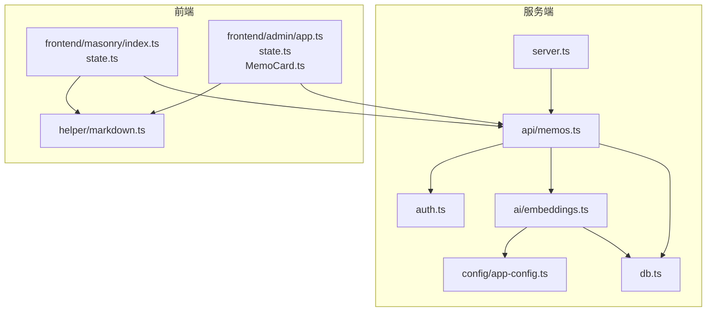
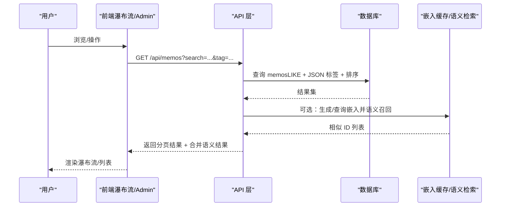
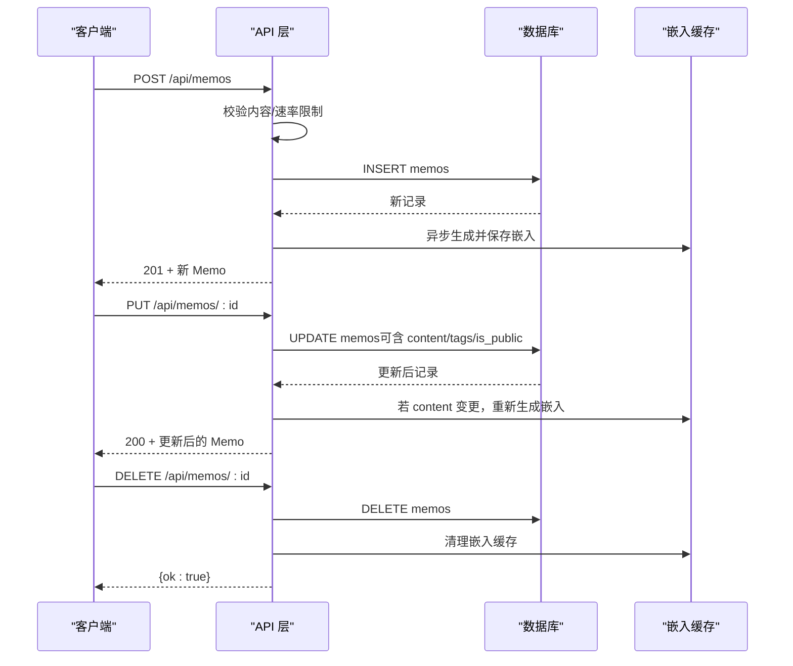
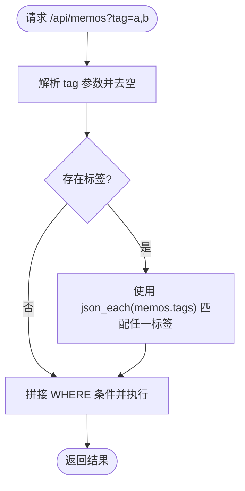
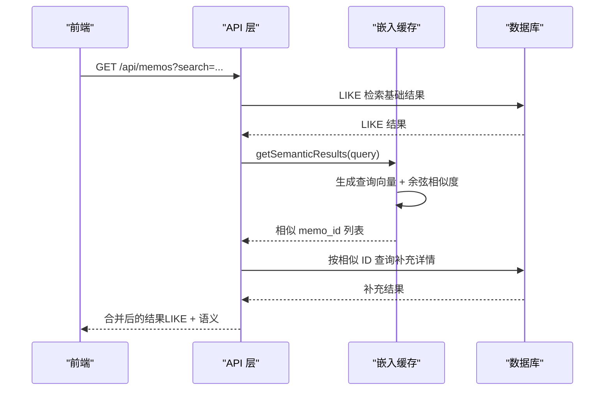
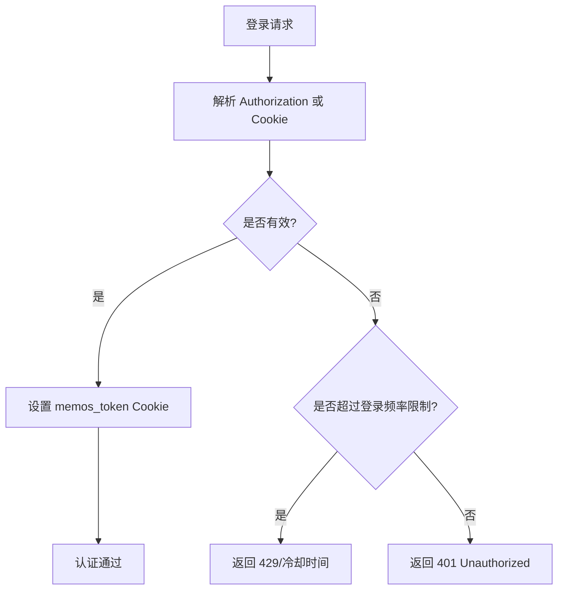
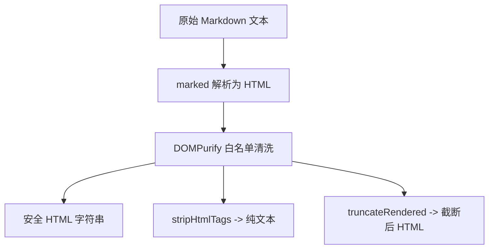
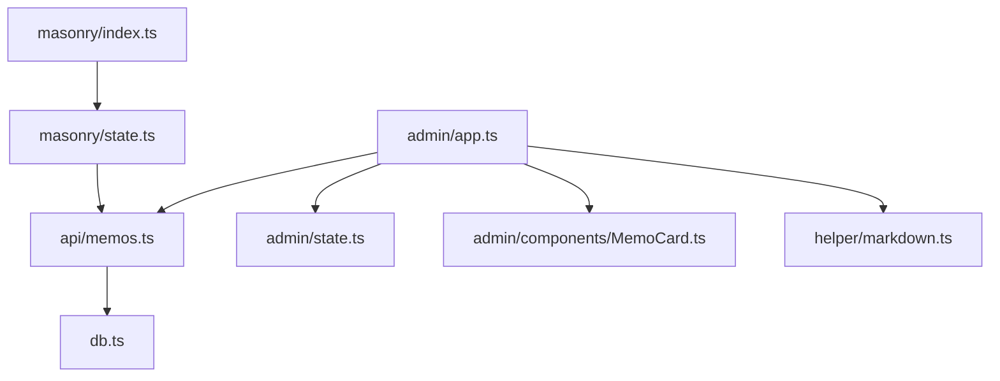
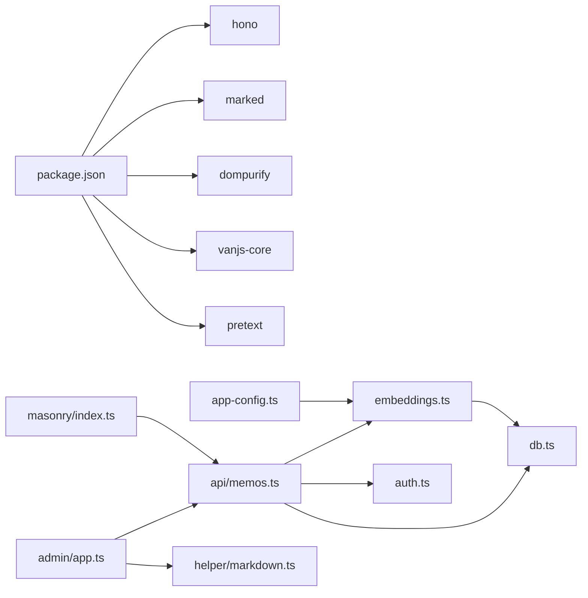

# 核心功能详解

<cite>
**本文引用的文件**
- [README.md](file://README.md)
- [package.json](file://package.json)
- [src/model.ts](file://src/model.ts)
- [src/db.ts](file://src/db.ts)
- [src/api/memos.ts](file://src/api/memos.ts)
- [src/auth.ts](file://src/auth.ts)
- [src/helper/markdown.ts](file://src/helper/markdown.ts)
- [src/ai/embeddings.ts](file://src/ai/embeddings.ts)
- [src/config/app-config.ts](file://src/config/app-config.ts)
- [src/frontend/masonry/index.ts](file://src/frontend/masonry/index.ts)
- [src/frontend/masonry/state.ts](file://src/frontend/masonry/state.ts)
- [src/frontend/admin/app.ts](file://src/frontend/admin/app.ts)
- [src/frontend/admin/state.ts](file://src/frontend/admin/state.ts)
- [src/frontend/admin/components/MemoCard.ts](file://src/frontend/admin/components/MemoCard.ts)
</cite>

## 目录
1. [简介](#简介)
2. [项目结构](#项目结构)
3. [核心组件](#核心组件)
4. [架构总览](#架构总览)
5. [详细组件分析](#详细组件分析)
6. [依赖关系分析](#依赖关系分析)
7. [性能考量](#性能考量)
8. [故障排查指南](#故障排查指南)
9. [结论](#结论)
10. [附录](#附录)

## 简介
本文件面向使用者与开发者，系统化阐述 Memos 的核心功能与实现细节，包括：
- 备忘录管理：创建、编辑、删除、置顶、可见性切换
- 标签系统：标签的创建、管理、过滤与统计
- 全文搜索：基于 SQL LIKE 的基础检索与向量语义检索融合
- 权限与安全：Cookie + 内存会话与 Bearer 密钥认证
- Markdown 渲染：marked 解析 + DOMPurify 安全清洗
- 前端交互：瀑布流布局、管理后台、AI 工具箱

## 项目结构
项目采用“服务端 + 前端”分层组织，核心目录与职责如下：
- src/server.ts：主服务入口（路由、静态资源、构建）
- src/db.ts：SQLite 数据层封装（表结构、CRUD、索引）
- src/api/memos.ts：备忘录 API（查询、创建、更新、删除、置顶、相似检索）
- src/auth.ts：认证中间件与会话管理
- src/helper/markdown.ts：Markdown 渲染与安全处理
- src/ai/embeddings.ts：嵌入缓存与语义检索
- src/config/app-config.ts：应用配置加载与默认值
- src/frontend/masonry：首页瀑布流前端（VanJS + Pretext）
- src/frontend/admin：管理后台前端（VanJS）

图表来源
- [src/server.ts](file://src/server.ts)
- [src/api/memos.ts](file://src/api/memos.ts)
- [src/db.ts](file://src/db.ts)
- [src/auth.ts](file://src/auth.ts)
- [src/ai/embeddings.ts](file://src/ai/embeddings.ts)
- [src/config/app-config.ts](file://src/config/app-config.ts)
- [src/frontend/masonry/index.ts](file://src/frontend/masonry/index.ts)
- [src/frontend/masonry/state.ts](file://src/frontend/masonry/state.ts)
- [src/frontend/admin/app.ts](file://src/frontend/admin/app.ts)
- [src/frontend/admin/state.ts](file://src/frontend/admin/state.ts)
- [src/frontend/admin/components/MemoCard.ts](file://src/frontend/admin/components/MemoCard.ts)
- [src/helper/markdown.ts](file://src/helper/markdown.ts)

章节来源
- [README.md:25-45](file://README.md#L25-L45)
- [package.json:1-26](file://package.json#L1-L26)

## 核心组件
- 数据模型：Memo（含 id、content、tags、is_public、pinned_at、created_at、updated_at）
- 数据库层：提供 memos 表、标签 JSON 存储、索引、增删改查与计数
- API 层：提供 /api/memos 的完整 CRUD 与查询能力，支持分页、搜索、标签过滤、置顶
- 认证层：支持 Cookie 会话与 Bearer 密钥认证，中间件统一校验
- 语义检索：向量嵌入缓存 + 余弦相似度 + 可选重排序
- Markdown 渲染：marked 解析 + DOMPurify 白名单清洗
- 前端瀑布流：Pretext 文本预排版 + Masonry 布局 + 虚拟滚动
- 管理后台：VanJS 响应式 UI，提供创建、编辑、删除、置顶、切换可见性、AI 工具箱

章节来源
- [src/model.ts:1-35](file://src/model.ts#L1-L35)
- [src/db.ts:15-61](file://src/db.ts#L15-L61)
- [src/api/memos.ts:26-220](file://src/api/memos.ts#L26-L220)
- [src/auth.ts:1-128](file://src/auth.ts#L1-L128)
- [src/ai/embeddings.ts:1-228](file://src/ai/embeddings.ts#L1-L228)
- [src/helper/markdown.ts:1-148](file://src/helper/markdown.ts#L1-L148)
- [src/frontend/masonry/state.ts:1-181](file://src/frontend/masonry/state.ts#L1-L181)
- [src/frontend/admin/state.ts:1-178](file://src/frontend/admin/state.ts#L1-L178)

## 架构总览
整体采用“前后端分离 + 服务端路由 + 前端 SPA”的架构：
- 服务端负责路由、认证、数据库访问、AI 嵌入与检索
- 前端瀑布流与管理后台均为 SPA，通过 /api/memos 与服务端交互
- Markdown 渲染在浏览器端完成，确保内容安全

图表来源
- [src/api/memos.ts:28-70](file://src/api/memos.ts#L28-L70)
- [src/db.ts:122-169](file://src/db.ts#L122-L169)
- [src/ai/embeddings.ts:95-154](file://src/ai/embeddings.ts#L95-L154)

## 详细组件分析

### 备忘录管理（创建/编辑/删除/置顶/可见性）
- 创建：校验内容非空，记录速率限制，持久化后异步生成嵌入
- 编辑：支持内容、可见性、标签三类字段更新；内容变更时重新生成嵌入
- 删除：删除后清理嵌入缓存
- 置顶：置顶/取消置顶更新 pinned_at 字段
- 可见性：公开/私密切换，查询时由 includePrivate 控制

图表来源
- [src/api/memos.ts:103-144](file://src/api/memos.ts#L103-L144)
- [src/api/memos.ts:146-187](file://src/api/memos.ts#L146-L187)
- [src/api/memos.ts:189-199](file://src/api/memos.ts#L189-L199)
- [src/api/memos.ts:201-219](file://src/api/memos.ts#L201-L219)
- [src/db.ts:198-239](file://src/db.ts#L198-L239)
- [src/db.ts:241-249](file://src/db.ts#L241-L249)

章节来源
- [src/api/memos.ts:103-219](file://src/api/memos.ts#L103-L219)
- [src/db.ts:198-249](file://src/db.ts#L198-L249)

### 标签系统（创建/管理/过滤/统计）
- 存储：标签以 JSON 数组形式存储在 memos.tags 字段
- 过滤：支持逗号分隔的多标签过滤，使用 SQLite json_each 进行匹配
- 统计：提供 getAllTags 获取去重标签列表
- 管理：前端支持标签输入与建议，后端在创建/更新时清洗空标签

图表来源
- [src/db.ts:141-158](file://src/db.ts#L141-L158)
- [src/db.ts:171-179](file://src/db.ts#L171-L179)
- [src/api/memos.ts:28-70](file://src/api/memos.ts#L28-L70)

章节来源
- [src/db.ts:93-108](file://src/db.ts#L93-L108)
- [src/db.ts:141-158](file://src/db.ts#L141-L158)
- [src/db.ts:171-179](file://src/db.ts#L171-L179)
- [src/api/memos.ts:97-101](file://src/api/memos.ts#L97-L101)

### 全文搜索（SQL LIKE + 语义检索融合）
- 基础检索：content LIKE %keyword%，支持分页
- 语义检索：当启用 AI 嵌入且缓存存在时，对查询词生成向量，计算与缓存中向量的余弦相似度，过滤阈值后排序
- 重排序：可选开启 qwen3-rerank，对候选集进行重排序，提升相关性
- 性能：嵌入缓存为内存 Map，避免每次查询都触发外部调用

图表来源
- [src/api/memos.ts:28-70](file://src/api/memos.ts#L28-L70)
- [src/ai/embeddings.ts:95-154](file://src/ai/embeddings.ts#L95-L154)
- [src/ai/embeddings.ts:156-215](file://src/ai/embeddings.ts#L156-L215)

章节来源
- [src/api/memos.ts:28-70](file://src/api/memos.ts#L28-L70)
- [src/ai/embeddings.ts:16-64](file://src/ai/embeddings.ts#L16-L64)
- [src/ai/embeddings.ts:77-93](file://src/ai/embeddings.ts#L77-L93)
- [src/ai/embeddings.ts:95-154](file://src/ai/embeddings.ts#L95-L154)
- [src/ai/embeddings.ts:156-215](file://src/ai/embeddings.ts#L156-L215)
- [src/config/app-config.ts:9-29](file://src/config/app-config.ts#L9-L29)

### 权限与安全（认证与会话）
- Cookie 会话：登录成功生成随机 token，设置 HttpOnly Cookie，有效期 24 小时
- Bearer 密钥：通过 Authorization: Bearer ${MEMOS_SECRET_KEY} 进行 API 调用
- 登录频率限制：同一 IP 在 1 分钟内最多 5 次尝试，超过则进入冷却
- 中间件：requireAuth 统一校验，未通过返回 401

图表来源
- [src/auth.ts:23-71](file://src/auth.ts#L23-L71)
- [src/auth.ts:72-107](file://src/auth.ts#L72-L107)
- [src/auth.ts:111-127](file://src/auth.ts#L111-L127)

章节来源
- [src/auth.ts:1-128](file://src/auth.ts#L1-L128)

### Markdown 渲染（解析、安全、扩展）
- 解析：使用 marked，启用 GitHub 风格
- 安全：DOMPurify 白名单仅允许标题、段落、链接、代码块等安全标签与属性
- 扩展：提供 stripHtmlTags 与 truncateRendered 辅助函数，支持纯文本提取与渲染后截断
- 前端集成：管理后台与瀑布流均通过 renderMarkdown 输出安全 HTML

图表来源
- [src/helper/markdown.ts:11-56](file://src/helper/markdown.ts#L11-L56)
- [src/helper/markdown.ts:61-113](file://src/helper/markdown.ts#L61-L113)
- [src/helper/markdown.ts:140-147](file://src/helper/markdown.ts#L140-L147)

章节来源
- [src/helper/markdown.ts:1-148](file://src/helper/markdown.ts#L1-L148)

### 前端瀑布流与管理后台
- 瀑布流：Pretext 文本预排版 + Masonry 布局，支持自适应列数、虚拟滚动、URL 同步
- 管理后台：VanJS 响应式组件，提供登录、创建/编辑/删除、置顶、切换可见性、AI 工具箱、导入导出等

图表来源
- [src/frontend/masonry/index.ts:1-23](file://src/frontend/masonry/index.ts#L1-L23)
- [src/frontend/masonry/state.ts:84-152](file://src/frontend/masonry/state.ts#L84-L152)
- [src/frontend/admin/app.ts:1-251](file://src/frontend/admin/app.ts#L1-L251)
- [src/frontend/admin/components/MemoCard.ts:1-346](file://src/frontend/admin/components/MemoCard.ts#L1-L346)

章节来源
- [src/frontend/masonry/index.ts:1-23](file://src/frontend/masonry/index.ts#L1-L23)
- [src/frontend/masonry/state.ts:1-181](file://src/frontend/masonry/state.ts#L1-L181)
- [src/frontend/admin/app.ts:1-251](file://src/frontend/admin/app.ts#L1-L251)
- [src/frontend/admin/state.ts:1-178](file://src/frontend/admin/state.ts#L1-L178)
- [src/frontend/admin/components/MemoCard.ts:1-346](file://src/frontend/admin/components/MemoCard.ts#L1-L346)

## 依赖关系分析
- 服务端依赖：Hono（路由）、bun:sqlite（数据库）、marked/DOMPurify（Markdown）
- 前端依赖：VanJS（响应式 UI）、Pretext（文本排版）、DOMPurify（安全）
- 配置：app.config.json 提供 AI、嵌入、重排序、速率限制等配置项

图表来源
- [package.json:19-25](file://package.json#L19-L25)
- [src/config/app-config.ts:103-107](file://src/config/app-config.ts#L103-L107)
- [src/ai/embeddings.ts:1-11](file://src/ai/embeddings.ts#L1-L11)
- [src/api/memos.ts:1-26](file://src/api/memos.ts#L1-L26)
- [src/frontend/masonry/index.ts:1-5](file://src/frontend/masonry/index.ts#L1-L5)
- [src/frontend/admin/app.ts:1-44](file://src/frontend/admin/app.ts#L1-L44)
- [src/helper/markdown.ts:1-6](file://src/helper/markdown.ts#L1-L6)

章节来源
- [package.json:1-26](file://package.json#L1-L26)
- [src/config/app-config.ts:1-108](file://src/config/app-config.ts#L1-L108)

## 性能考量
- 数据库索引：pinned_at 字段建立索引，保证置顶排序高效
- 查询优化：LIKE 检索 + JSON 标签匹配 + 排序组合，分页避免一次性返回大量数据
- 嵌入缓存：内存 Map 缓存向量，减少重复生成；仅在内容变更或缺失时补全
- 重排序：候选集先按嵌入相似度排序，再根据配置决定是否进行 rerank
- 前端渲染：Pretext 预排版 + Masonry 布局 + 虚拟滚动，降低 DOM 负担

章节来源
- [src/db.ts:30](file://src/db.ts#L30)
- [src/db.ts:163](file://src/db.ts#L163)
- [src/ai/embeddings.ts:16-64](file://src/ai/embeddings.ts#L16-L64)
- [src/frontend/masonry/state.ts:84-152](file://src/frontend/masonry/state.ts#L84-L152)

## 故障排查指南
- 认证失败
  - 检查 Cookie 是否正确设置，或 Authorization 头是否为 Bearer 密钥
  - 查看登录频率限制是否触发
- 创建/更新失败
  - 确认内容非空，标签数组格式正确
  - 检查速率限制是否触发
- 语义检索无结果
  - 确认 AI 嵌入可用且缓存已初始化
  - 调整相似度阈值配置
- Markdown 渲染异常
  - 确认浏览器环境，避免在 Node 环境调用
  - 检查 DOMPurify 白名单是否被覆盖

章节来源
- [src/auth.ts:111-127](file://src/auth.ts#L111-L127)
- [src/api/memos.ts:104-144](file://src/api/memos.ts#L104-L144)
- [src/ai/embeddings.ts:16-64](file://src/ai/embeddings.ts#L16-L64)
- [src/helper/markdown.ts:7-9](file://src/helper/markdown.ts#L7-L9)

## 结论
Memmos 以简洁的 SQLite + Hono + VanJS 架构实现了轻量高效的备忘录系统。其核心优势在于：
- 易部署：Bun 内置生态，零外部依赖
- 易扩展：模块化设计，API 与前端清晰解耦
- 易维护：配置集中、日志明确、错误处理完善
建议在生产环境关注：
- 配置文件 app.config.json 的合理阈值设定
- 嵌入缓存的初始化与定期补全
- 前端瀑布流与管理后台的交互体验优化

## 附录

### 使用示例与最佳实践
- 创建备忘录
  - 方法：POST /api/memos
  - 参数：content（必填）、is_public（默认 true）、tags（字符串数组）
  - 最佳实践：内容尽量结构化，便于标签与语义检索
- 获取列表（含搜索与标签过滤）
  - 方法：GET /api/memos
  - 参数：search（LIKE 检索）、tag（逗号分隔多标签）、all（管理员查看私密）、page/limit（分页）
  - 最佳实践：优先使用标签过滤缩小范围，再进行关键词检索
- 置顶/取消置顶
  - 方法：PUT /api/memos/:id/pin
  - 参数：{ pinned: true/false }
  - 最佳实践：置顶仅用于重要条目，避免滥用
- Markdown 渲染
  - 方法：renderMarkdown(text)
  - 最佳实践：在前端统一使用该函数输出安全 HTML，避免直接 innerHTML 危险
- 权限控制
  - 方法：Cookie 会话或 Bearer 密钥
  - 最佳实践：生产环境务必设置 MEMOS_SECRET_KEY，避免明文密钥泄露

章节来源
- [README.md:104-177](file://README.md#L104-L177)
- [src/api/memos.ts:28-70](file://src/api/memos.ts#L28-L70)
- [src/api/memos.ts:201-219](file://src/api/memos.ts#L201-L219)
- [src/helper/markdown.ts:52-56](file://src/helper/markdown.ts#L52-L56)
- [src/auth.ts:42-46](file://src/auth.ts#L42-L46)