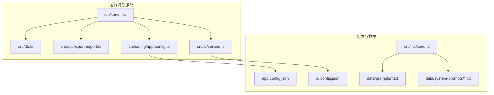
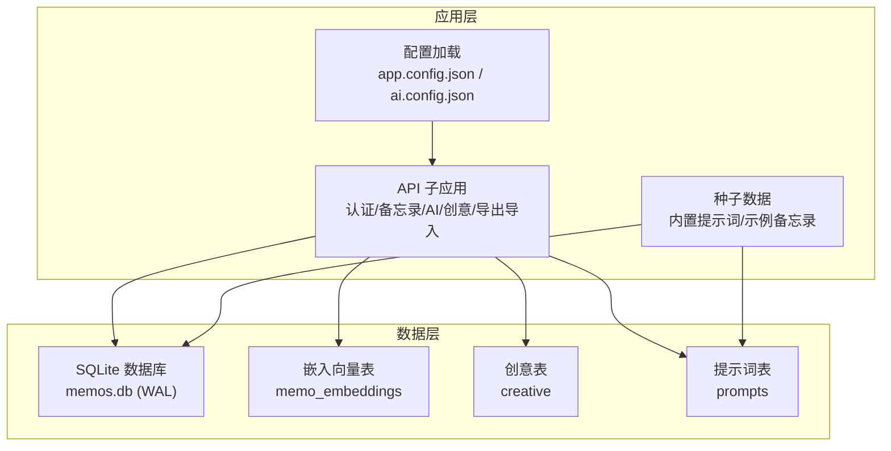
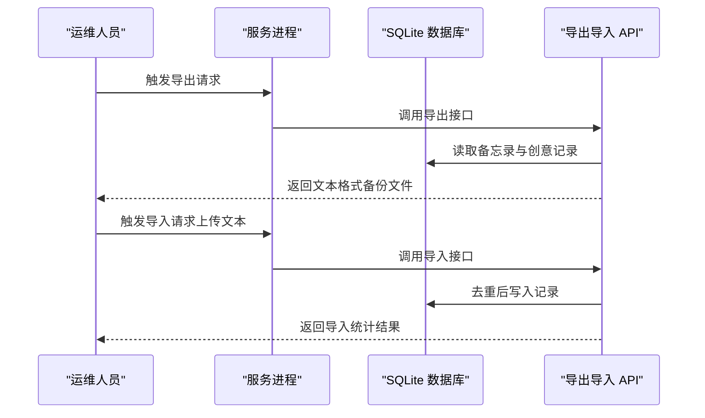
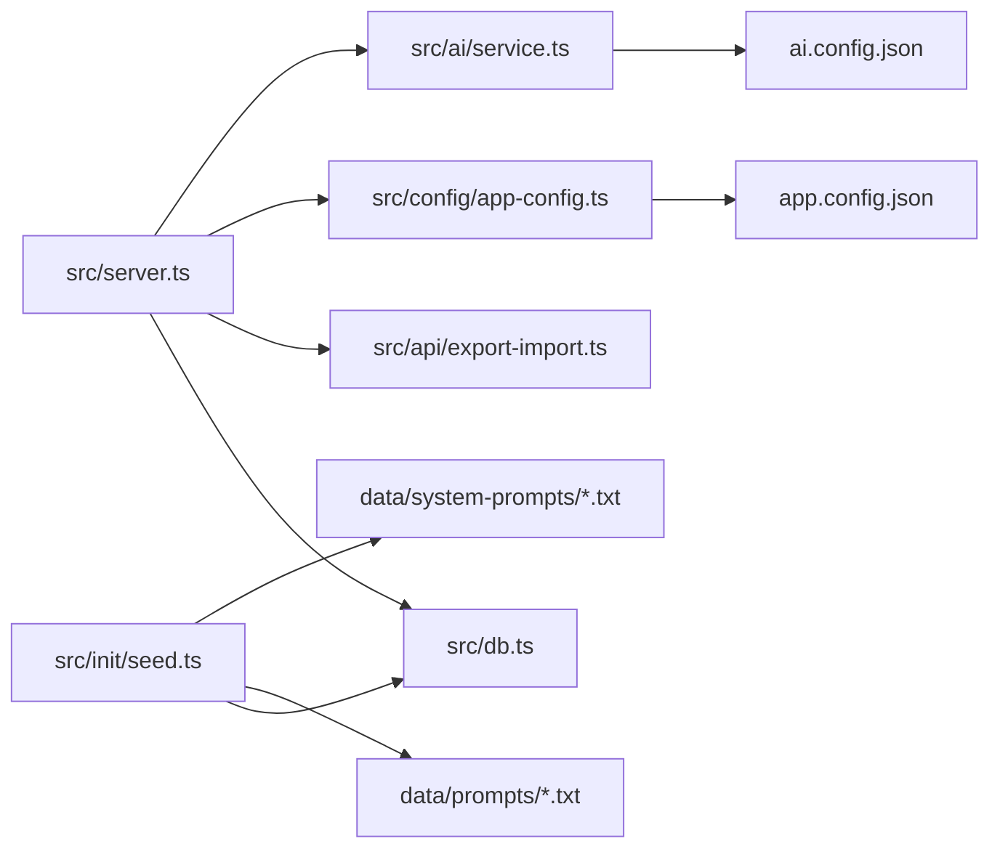

# 备份恢复

<cite>
**本文引用的文件**
- [README.md](file://README.md)
- [package.json](file://package.json)
- [src/server.ts](file://src/server.ts)
- [src/db.ts](file://src/db.ts)
- [src/api/export-import.ts](file://src/api/export-import.ts)
- [src/config/app-config.ts](file://src/config/app-config.ts)
- [src/ai/service.ts](file://src/ai/service.ts)
- [app.config.json](file://app.config.json)
- [ai.config.json](file://ai.config.json)
- [src/init/seed.ts](file://src/init/seed.ts)
- [data/prompts/创意写作.txt](file://data/prompts/创意写作.txt)
- [data/system-prompts/creative.txt](file://data/system-prompts/creative.txt)
- [data/system-prompts/expand.txt](file://data/system-prompts/expand.txt)
</cite>

## 目录
1. [简介](#简介)
2. [项目结构](#项目结构)
3. [核心组件](#核心组件)
4. [架构总览](#架构总览)
5. [详细组件分析](#详细组件分析)
6. [依赖关系分析](#依赖关系分析)
7. [性能考量](#性能考量)
8. [故障排查指南](#故障排查指南)
9. [结论](#结论)
10. [附录](#附录)

## 简介
本文件面向 Memos 的运维与开发团队，提供一套完整的数据备份与恢复方案。内容覆盖：
- 数据库备份策略：SQLite 文件备份、WAL 模式下的日志行为、全量与增量备份建议
- 配置备份：应用配置、AI 配置、环境变量
- 存储方案：本地、云存储、异地备份
- 自动化脚本：定时任务、备份验证、清理策略
- 恢复流程：完整恢复、点对点恢复、数据迁移
- 灾难恢复：故障场景、恢复优先级、业务连续性
- 测试与验证：备份可用性与完整性校验

## 项目结构
- 运行时：Bun
- 数据库：SQLite（bun:sqlite），WAL 模式
- 配置：app.config.json、ai.config.json
- 导出/导入：基于文本格式的导出与导入 API
- 首次启动：内置提示词与示例备忘录的种子数据

图表来源
- [src/server.ts:1-125](file://src/server.ts#L1-L125)
- [src/db.ts:1-484](file://src/db.ts#L1-L484)
- [src/api/export-import.ts:1-288](file://src/api/export-import.ts#L1-L288)
- [src/config/app-config.ts:1-108](file://src/config/app-config.ts#L1-L108)
- [src/ai/service.ts:88-130](file://src/ai/service.ts#L88-L130)
- [app.config.json:1-22](file://app.config.json#L1-L22)
- [ai.config.json:1-44](file://ai.config.json#L1-L44)
- [src/init/seed.ts:1-118](file://src/init/seed.ts#L1-L118)
- [data/prompts/创意写作.txt:1-15](file://data/prompts/创意写作.txt#L1-L15)
- [data/system-prompts/creative.txt:1-2](file://data/system-prompts/creative.txt#L1-L2)
- [data/system-prompts/expand.txt:1-5](file://data/system-prompts/expand.txt#L1-L5)

章节来源
- [README.md:14-45](file://README.md#L14-L45)
- [src/server.ts:109-125](file://src/server.ts#L109-L125)
- [src/db.ts:1-13](file://src/db.ts#L1-L13)

## 核心组件
- 数据库层：负责 SQLite 初始化、表结构、CRUD、索引、WAL 模式与嵌入向量表
- 导出/导入模块：提供文本格式的数据导出与导入，支持去重与时间戳保留
- 配置模块：应用配置与 AI 配置的加载与回退机制
- 服务入口：路由挂载、静态资源、首次启动种子数据与嵌入缓存初始化

章节来源
- [src/db.ts:15-61](file://src/db.ts#L15-L61)
- [src/api/export-import.ts:165-181](file://src/api/export-import.ts#L165-L181)
- [src/api/export-import.ts:183-287](file://src/api/export-import.ts#L183-L287)
- [src/config/app-config.ts:57-107](file://src/config/app-config.ts#L57-L107)
- [src/server.ts:40-46](file://src/server.ts#L40-L46)

## 架构总览
下图展示了备份与恢复在系统中的位置与交互。

图表来源
- [src/server.ts:40-46](file://src/server.ts#L40-L46)
- [src/db.ts:18-60](file://src/db.ts#L18-L60)
- [src/config/app-config.ts:57-107](file://src/config/app-config.ts#L57-L107)
- [src/init/seed.ts:16-61](file://src/init/seed.ts#L16-L61)

## 详细组件分析

### 数据库备份策略
- 备份对象
  - SQLite 文件：memos.db
  - WAL 日志：WAL 模式下，事务日志与主数据库文件共同构成一致性保证
- 备份方式
  - 全量备份：直接复制 memos.db 文件；如需强一致，可在空闲期关闭服务后复制
  - 增量备份：WAL 模式下可复制 WAL 文件与对应的检查点；或使用 SQLite 的在线备份 API（见下方“自动化脚本”建议）
- 复制时机
  - 低峰时段执行全量备份
  - 高频变更场景建议每日一次全量 + 每小时一次 WAL 增量
- 备份验证
  - 复制完成后校验文件大小与时间戳
  - 使用 SQLite 命令行打开备份文件，执行简单查询以验证完整性

章节来源
- [src/db.ts:8-13](file://src/db.ts#L8-L13)
- [README.md:68-72](file://README.md#L68-L72)

### 配置文件备份
- 应用配置：app.config.json
  - 作用：AI 请求超时、最大 Token、温度、相似度阈值、重排序、速率限制等
  - 备份：定期复制 app.config.json
- AI 配置：ai.config.json
  - 作用：提供商列表、默认模型、API 端点与密钥环境变量映射
  - 备份：定期复制 ai.config.json
- 环境变量
  - 关键变量：PORT、MEMOS_SECRET_KEY
  - 备份：记录当前环境变量快照（不建议明文存储于版本控制）

章节来源
- [app.config.json:1-22](file://app.config.json#L1-L22)
- [ai.config.json:1-44](file://ai.config.json#L1-L44)
- [src/config/app-config.ts:57-107](file://src/config/app-config.ts#L57-L107)
- [src/ai/service.ts:88-130](file://src/ai/service.ts#L88-L130)
- [README.md:59-65](file://README.md#L59-L65)

### 存储方案
- 本地存储
  - 优点：快速、可控
  - 建议：磁盘冗余（RAID 或多盘）、定期校验
- 云存储
  - 优点：高可用、跨地域
  - 建议：对象存储（如 OSS/COS/S3）+ 生命周期策略
- 异地备份
  - 建议：至少一个异地副本，周期性同步
- 版本化与加密
  - 建议：启用版本控制与传输/静态加密

（本节为通用实践说明，不直接分析具体文件）

### 自动化备份脚本与流程
- 全量备份（建议）
  - 停机窗口内：停止服务 -> 复制 memos.db -> 启动服务
  - 在线窗口内：使用 SQLite 在线备份 API（bun:sqlite）生成备份文件
- 增量备份（建议）
  - WAL 模式下：复制 wal 文件；或在空闲期执行 checkpoint
- 备份验证
  - 校验文件完整性（大小、时间戳）
  - 打开备份数据库执行基础查询
- 清理策略
  - 保留最近 N 份全量与 M 份增量
  - 超期自动删除，保留审计日志

（本节为通用实践说明，不直接分析具体文件）

### 数据恢复流程
- 完整恢复
  - 停机或维护窗口：停止服务 -> 替换 memos.db -> 启动服务
  - 若使用 WAL：确保 wal 文件与数据库文件时间戳匹配
- 点对点恢复（基于导出导入）
  - 使用导出 API 生成文本备份
  - 使用导入 API 将文本恢复为数据库记录（支持去重与时间戳保留）
- 数据迁移
  - 从旧实例导出 -> 新实例导入
  - 注意：导入会去重，必要时先清空目标库或调整去重策略

图表来源
- [src/api/export-import.ts:165-181](file://src/api/export-import.ts#L165-L181)
- [src/api/export-import.ts:183-287](file://src/api/export-import.ts#L183-L287)
- [src/db.ts:406-474](file://src/db.ts#L406-L474)

章节来源
- [src/api/export-import.ts:165-181](file://src/api/export-import.ts#L165-L181)
- [src/api/export-import.ts:183-287](file://src/api/export-import.ts#L183-L287)
- [src/db.ts:406-474](file://src/db.ts#L406-L474)

### 灾难恢复计划
- 故障场景
  - 数据库文件损坏
  - 配置文件丢失
  - 服务不可用（硬件/网络）
- 恢复优先级
  - 一级：数据库文件恢复（优先 WAL 恢复）
  - 二级：配置文件恢复（app.config.json、ai.config.json、环境变量）
  - 三级：服务与前端资源恢复
- 业务连续性
  - 多副本与异地备份
  - 自动化监控与告警
  - RTO/RPO 指标明确

（本节为通用实践说明，不直接分析具体文件）

### 备份测试与验证
- 完整性验证
  - 对比源与备份文件大小与时间戳
  - 使用 sqlite3 打开备份文件，执行基础查询
- 可用性验证
  - 从备份恢复到临时实例，验证数据可读写
- 回归验证
  - 导出导入循环测试，确保去重与时间戳保留正常

（本节为通用实践说明，不直接分析具体文件）

## 依赖关系分析
- 服务启动时初始化数据库与种子数据，并注入向量缓存
- 导出/导入模块依赖数据库层的查询与写入能力
- 配置模块为应用与 AI 服务提供参数来源

图表来源
- [src/server.ts:109-125](file://src/server.ts#L109-L125)
- [src/db.ts:15-61](file://src/db.ts#L15-L61)
- [src/api/export-import.ts:1-14](file://src/api/export-import.ts#L1-L14)
- [src/config/app-config.ts:57-107](file://src/config/app-config.ts#L57-L107)
- [src/ai/service.ts:88-130](file://src/ai/service.ts#L88-L130)
- [src/init/seed.ts:16-61](file://src/init/seed.ts#L16-L61)
- [app.config.json:1-22](file://app.config.json#L1-L22)
- [ai.config.json:1-44](file://ai.config.json#L1-L44)

章节来源
- [src/server.ts:40-46](file://src/server.ts#L40-L46)
- [src/db.ts:15-61](file://src/db.ts#L15-L61)
- [src/api/export-import.ts:1-14](file://src/api/export-import.ts#L1-L14)
- [src/config/app-config.ts:57-107](file://src/config/app-config.ts#L57-L107)
- [src/ai/service.ts:88-130](file://src/ai/service.ts#L88-L130)
- [src/init/seed.ts:16-61](file://src/init/seed.ts#L16-L61)

## 性能考量
- WAL 模式提升并发读写性能，但需同时备份数据库与 wal 文件
- 导出/导入为文本格式，适合小中型数据；大型数据建议离线批量处理
- 配置加载为一次性读取并缓存，重启生效

（本节为通用指导，不直接分析具体文件）

## 故障排查指南
- 数据库无法打开
  - 检查 memos.db 是否被占用或权限不足
  - 确认 WAL 文件是否存在且与数据库文件时间戳匹配
- 导入失败
  - 检查上传文件是否为空或格式错误
  - 查看导入返回的错误列表定位问题记录
- 配置未生效
  - 确认 app.config.json 与 ai.config.json 格式正确
  - 重启服务以重新加载配置

章节来源
- [src/api/export-import.ts:183-287](file://src/api/export-import.ts#L183-L287)
- [src/config/app-config.ts:57-107](file://src/config/app-config.ts#L57-L107)

## 结论
通过结合 SQLite 文件与 WAL 的全量/增量备份、配置文件与环境变量的版本化管理、以及基于文本格式的导出导入能力，可以构建一套稳健的备份与恢复体系。配合自动化脚本与严格的验证与清理策略，能够有效保障数据安全与业务连续性。

## 附录
- 环境变量
  - PORT：服务监听端口
  - MEMOS_SECRET_KEY：管理员密钥
- 首次启动
  - 自动创建数据库与表结构
  - 导入内置提示词与示例备忘录

章节来源
- [README.md:59-65](file://README.md#L59-L65)
- [src/init/seed.ts:112-118](file://src/init/seed.ts#L112-L118)
- [src/db.ts:15-61](file://src/db.ts#L15-L61)