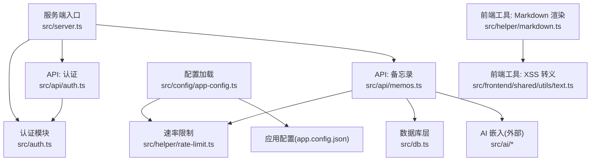
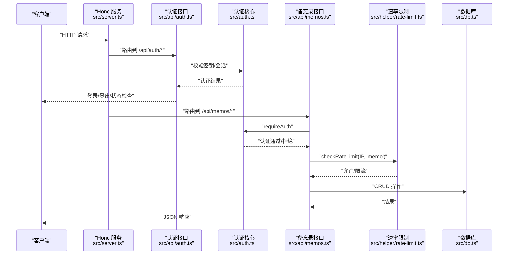
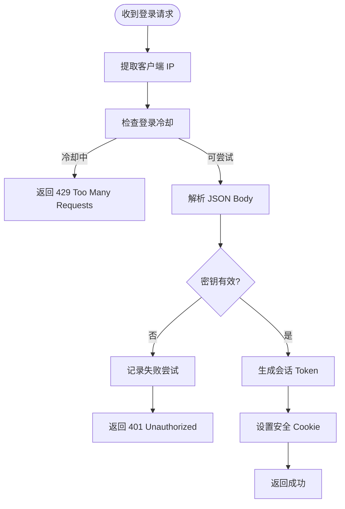
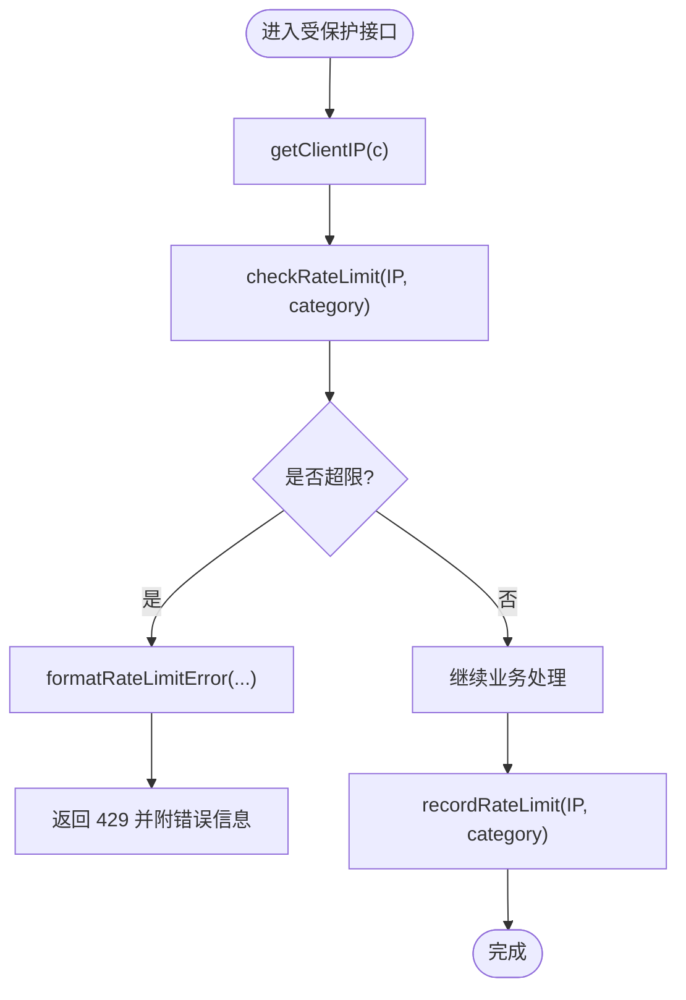

# 安全加固

<cite>
**本文引用的文件**
- [src/server.ts](file://src/server.ts)
- [src/auth.ts](file://src/auth.ts)
- [src/api/auth.ts](file://src/api/auth.ts)
- [src/api/memos.ts](file://src/api/memos.ts)
- [src/helper/rate-limit.ts](file://src/helper/rate-limit.ts)
- [src/config/app-config.ts](file://src/config/app-config.ts)
- [src/db.ts](file://src/db.ts)
- [src/helper/markdown.ts](file://src/helper/markdown.ts)
- [src/frontend/shared/utils/text.ts](file://src/frontend/shared/utils/text.ts)
- [package.json](file://package.json)
- [app.config.json](file://app.config.json)
- [README.md](file://README.md)
</cite>

## 目录
1. [简介](#简介)
2. [项目结构](#项目结构)
3. [核心组件](#核心组件)
4. [架构总览](#架构总览)
5. [详细组件分析](#详细组件分析)
6. [依赖关系分析](#依赖关系分析)
7. [性能考虑](#性能考虑)
8. [故障排查指南](#故障排查指南)
9. [结论](#结论)
10. [附录](#附录)

## 简介
本文件面向 Memos 的安全加固与防护，结合现有代码实现，系统化梳理网络安全配置、访问控制、数据保护、API 安全、身份认证、安全审计与事件响应等关键领域。由于当前仓库未包含传输加密、存储加密、敏感数据脱敏、DDoS 防护、统一审计日志与漏洞扫描修复流程等实现，本文在“现状”部分如实呈现，并在“建议”部分提供可落地的加固方案与最佳实践。

## 项目结构
- 服务端入口负责路由挂载、静态资源与 SPA 回退、数据库初始化与向量缓存初始化。
- 认证模块提供 Cookie + 内存会话与 Bearer Token 两种认证方式，并内置登录频率限制。
- API 模块按功能拆分，认证与速率限制中间件贯穿关键接口。
- 配置模块提供运行时配置加载与速率限制阈值来源。
- 前端工具包含 Markdown 渲染与 XSS 防护辅助函数。

图表来源
- [src/server.ts:38-46](file://src/server.ts#L38-L46)
- [src/api/auth.ts:29](file://src/api/auth.ts#L29)
- [src/api/memos.ts:26](file://src/api/memos.ts#L26)
- [src/helper/rate-limit.ts:6](file://src/helper/rate-limit.ts#L6)
- [src/config/app-config.ts:55](file://src/config/app-config.ts#L55)
- [src/db.ts:15](file://src/db.ts#L15)
- [src/helper/markdown.ts:1](file://src/helper/markdown.ts#L1)
- [src/frontend/shared/utils/text.ts:1](file://src/frontend/shared/utils/text.ts#L1)

章节来源
- [src/server.ts:38-46](file://src/server.ts#L38-L46)
- [README.md:25-45](file://README.md#L25-L45)

## 核心组件
- 认证与会话
  - 支持 Cookie + 内存会话与 Bearer Token（密钥）两种认证方式；登录接口具备登录频率限制。
- 速率限制
  - 基于 IP 的小时/日两级窗口计数，区分 memo 与 AI 两类；支持环境变量与配置文件覆盖。
- 数据库与查询
  - 使用 SQLite（WAL 模式），提供基础 CRUD 与标签检索；未发现显式的 SQL 注入防护封装。
- 前端安全
  - Markdown 渲染使用 DOMPurify 白名单清洗；提供 HTML 转义工具以降低 XSS 风险。
- 配置与阈值
  - 通过 app.config.json 与环境变量加载速率限制阈值，具备回退默认值。

章节来源
- [src/auth.ts:28-46](file://src/auth.ts#L28-L46)
- [src/api/auth.ts:36-68](file://src/api/auth.ts#L36-L68)
- [src/helper/rate-limit.ts:77-140](file://src/helper/rate-limit.ts#L77-L140)
- [src/config/app-config.ts:23-28](file://src/config/app-config.ts#L23-L28)
- [src/db.ts:110-169](file://src/db.ts#L110-L169)
- [src/helper/markdown.ts:18-44](file://src/helper/markdown.ts#L18-L44)
- [src/frontend/shared/utils/text.ts:4-11](file://src/frontend/shared/utils/text.ts#L4-L11)

## 架构总览
下图展示从客户端到服务端的关键交互路径与安全控制点。

图表来源
- [src/server.ts:41-45](file://src/server.ts#L41-L45)
- [src/api/auth.ts:31-76](file://src/api/auth.ts#L31-L76)
- [src/auth.ts:111-127](file://src/auth.ts#L111-L127)
- [src/api/memos.ts:103-144](file://src/api/memos.ts#L103-L144)
- [src/helper/rate-limit.ts:77-110](file://src/helper/rate-limit.ts#L77-L110)
- [src/db.ts:198-239](file://src/db.ts#L198-L239)

## 详细组件分析

### 认证与会话安全
- Cookie 安全属性
  - 设置 HttpOnly、SameSite=Strict、Path=/、Max-Age=24 小时，降低 XSS 与 CSRF 风险。
- Bearer Token
  - 通过 Authorization: Bearer 方式传递，服务端严格比对 MEMOS_SECRET_KEY。
- 登录频率限制
  - 登录失败尝试次数上限与 1 分钟冷却时间，防止暴力破解。
- 会话生命周期
  - 内存会话集合，服务重启即失效，适合单实例开发/测试场景。

图表来源
- [src/api/auth.ts:36-68](file://src/api/auth.ts#L36-L68)
- [src/auth.ts:58-70](file://src/auth.ts#L58-L70)
- [src/auth.ts:81-107](file://src/auth.ts#L81-L107)

章节来源
- [src/auth.ts:28-70](file://src/auth.ts#L28-L70)
- [src/api/auth.ts:14-27](file://src/api/auth.ts#L14-L27)
- [src/api/auth.ts:36-68](file://src/api/auth.ts#L36-L68)

### 速率限制与 API 安全
- 速率限制策略
  - 每个 IP 维护小时/日两个窗口计数；memo 与 AI 分类独立阈值；支持环境变量覆盖。
- 客户端 IP 提取
  - 优先 X-Forwarded-For，其次 X-Real-IP，最后回退为 127.0.0.1。
- 错误格式化
  - 统一格式化限流错误消息，便于前端提示。

图表来源
- [src/api/memos.ts:120-124](file://src/api/memos.ts#L120-L124)
- [src/helper/rate-limit.ts:68-74](file://src/helper/rate-limit.ts#L68-L74)
- [src/helper/rate-limit.ts:77-110](file://src/helper/rate-limit.ts#L77-L110)
- [src/helper/rate-limit.ts:143-152](file://src/helper/rate-limit.ts#L143-L152)

章节来源
- [src/helper/rate-limit.ts:27-39](file://src/helper/rate-limit.ts#L27-L39)
- [src/helper/rate-limit.ts:68-140](file://src/helper/rate-limit.ts#L68-L140)
- [src/api/memos.ts:103-144](file://src/api/memos.ts#L103-L144)

### 数据库与查询安全现状
- 当前实现
  - 使用原生 SQL 与参数占位符进行插入/更新；LIKE 搜索直接拼接通配符。
- 风险提示
  - LIKE 搜索存在 SQL 注入风险；建议引入 ORM 或参数化查询封装，严格白名单/转义。
- 建议
  - 引入参数化查询工具或 ORM，对 LIKE/IN/动态条件进行统一处理；对用户输入进行最小权限与长度限制。

章节来源
- [src/db.ts:141-157](file://src/db.ts#L141-L157)
- [src/db.ts:207-211](file://src/db.ts#L207-L211)
- [src/db.ts:228-231](file://src/db.ts#L228-L231)

### 前端安全与 XSS 防护
- Markdown 渲染
  - 使用 DOMPurify 白名单配置，仅允许安全标签与属性，降低 XSS 风险。
- HTML 转义
  - 提供 escapeHtml 辅助函数，用于非渲染场景的输出转义。
- 建议
  - 对所有用户可控输入在渲染前执行 DOMPurify；对非渲染场景统一使用转义；避免 innerHTML 直接拼接。

章节来源
- [src/helper/markdown.ts:18-44](file://src/helper/markdown.ts#L18-L44)
- [src/helper/markdown.ts:52-66](file://src/helper/markdown.ts#L52-L66)
- [src/frontend/shared/utils/text.ts:4-11](file://src/frontend/shared/utils/text.ts#L4-L11)

### 配置与阈值加载
- 配置来源
  - app.config.json → 硬编码默认值 → 环境变量覆盖。
- 速率限制阈值
  - memosPerHour/memosPerDay/aiPerHour/aiPerDay 三处阈值均可定制。
- 建议
  - 在生产环境强制设置 app.config.json 与环境变量，避免回退默认值。

章节来源
- [src/config/app-config.ts:57-101](file://src/config/app-config.ts#L57-L101)
- [app.config.json:15-21](file://app.config.json#L15-L21)

### 服务端网络与端口管理
- 端口
  - 通过环境变量 PORT 控制，默认 3020。
- 静态资源与 SPA 回退
  - 提供 favicon、JS/CSS 资源与 /admin 深度链接回退。
- 建议
  - 在生产环境通过反向代理暴露服务，启用 HTTPS/TLS；限制暴露端口与来源 IP；部署 WAF/CDN 以减轻 DDoS 压力。

章节来源
- [src/server.ts:11](file://src/server.ts#L11)
- [src/server.ts:49-119](file://src/server.ts#L49-L119)

## 依赖关系分析
- 运行时与依赖
  - 使用 Hono 作为 Web 框架，marked 与 dompurify 用于 Markdown 渲染与清洗。
- 安全相关依赖
  - dompurify 用于前端 XSS 防护；marked 用于安全渲染。
- 建议
  - 定期升级依赖版本，关注 CVE 与安全公告；对第三方依赖进行供应链安全扫描。

章节来源
- [package.json:19-25](file://package.json#L19-L25)

## 性能考虑
- 速率限制
  - 内存 Map 存储窗口计数，适合单实例部署；多实例需共享计数器（Redis）。
- 嵌入向量
  - 向量生成异步触发，避免阻塞主流程。
- 建议
  - 对高并发场景引入分布式限流；对嵌入生成增加队列与重试机制。

章节来源
- [src/helper/rate-limit.ts:25](file://src/helper/rate-limit.ts#L25)
- [src/api/memos.ts:139-141](file://src/api/memos.ts#L139-L141)

## 故障排查指南
- 认证失败
  - 检查 MEMOS_SECRET_KEY 是否设置；确认 Cookie 是否包含且未过期。
- 登录被限流
  - 查看冷却时间是否生效；确认 X-Forwarded-For/X-Real-IP 是否正确透传。
- 速率限制 429
  - 检查 app.config.json 与环境变量阈值；确认客户端 IP 提取是否正确。
- 前端 XSS 风险
  - 确认渲染路径使用 DOMPurify；非渲染场景使用 escapeHtml。

章节来源
- [src/api/auth.ts:14-27](file://src/api/auth.ts#L14-L27)
- [src/auth.ts:81-107](file://src/auth.ts#L81-L107)
- [src/helper/rate-limit.ts:77-110](file://src/helper/rate-limit.ts#L77-L110)
- [src/helper/markdown.ts:52-66](file://src/helper/markdown.ts#L52-L66)
- [src/frontend/shared/utils/text.ts:4-11](file://src/frontend/shared/utils/text.ts#L4-L11)

## 结论
- 现状总结
  - 已具备基础认证（Cookie + Bearer）、登录频率限制、前端 XSS 防护与速率限制能力。
  - 缺失传输加密、存储加密、敏感数据脱敏、DDoS 防护、统一审计日志与漏洞扫描修复流程。
- 建议优先级
  - 传输加密（HTTPS/TLS）、速率限制扩展（多实例共享）、数据库查询安全加固、统一审计日志、漏洞扫描与修复流程。

## 附录

### 网络安全配置与端口管理
- 端口与监听
  - 通过 PORT 环境变量控制；建议仅暴露必要端口。
- 反向代理
  - 建议通过 Nginx/Traefik/Cloudflare 等前置代理，开启 TLS 终止与 WAF。
- DDoS 防护
  - 建议启用 CDN/云厂商 DDoS 防护与限速策略；对 /api/auth/* 与 /api/memos/* 设置差异化阈值。

章节来源
- [src/server.ts:11](file://src/server.ts#L11)
- [src/server.ts:49-119](file://src/server.ts#L49-L119)

### 访问控制机制
- 认证方式
  - Cookie + 内存会话：适合单实例；多实例需共享会话或迁移到 JWT。
  - Bearer Token：通过 MEMOS_SECRET_KEY 验证，适合 CLI/API 调用。
- 权限验证
  - /api/memos/* 需要认证；/api/memos?all=true 需管理员权限。

章节来源
- [src/auth.ts:28-46](file://src/auth.ts#L28-L46)
- [src/api/memos.ts:30-31](file://src/api/memos.ts#L30-L31)

### 数据加密策略
- 传输加密
  - 建议强制 HTTPS/TLS；禁用明文 HTTP。
- 存储加密
  - SQLite 文件可由操作系统层面加密；敏感字段建议加密存储。
- 敏感数据脱敏
  - 对日志与错误输出避免泄露密钥与会话信息。

章节来源
- [src/api/auth.ts:14-27](file://src/api/auth.ts#L14-L27)
- [src/auth.ts:58-70](file://src/auth.ts#L58-L70)

### API 安全防护
- 请求限流
  - 已实现小时/日两级阈值；建议扩展为漏桶/令牌桶算法与多实例共享。
- SQL 注入防护
  - 当前 LIKE 存在风险；建议引入 ORM 或参数化封装。
- XSS 防护
  - 前端已使用 DOMPurify；建议统一转义策略与 CSP。

章节来源
- [src/db.ts:141-157](file://src/db.ts#L141-L157)
- [src/helper/markdown.ts:18-44](file://src/helper/markdown.ts#L18-L44)

### 身份认证安全
- 密码策略
  - 当前使用密钥而非密码；建议引入密码哈希与复杂度策略。
- 双因素认证
  - 建议集成 TOTP/HOTP 或短信/邮件验证码。
- 单点登录
  - 建议接入 OIDC/SAML，集中管理用户与会话。

章节来源
- [src/api/auth.ts:14-27](file://src/api/auth.ts#L14-L27)
- [src/auth.ts:48-56](file://src/auth.ts#L48-L56)

### 安全审计日志
- 建议
  - 记录登录/登出、认证失败、速率限制触发、敏感操作（CRUD）与异常访问。
  - 日志脱敏与合规存储，支持告警与留存策略。

章节来源
- [src/api/auth.ts:59-62](file://src/api/auth.ts#L59-L62)
- [src/api/memos.ts:139-141](file://src/api/memos.ts#L139-L141)

### 漏洞扫描与修复流程
- 建议
  - 定期扫描依赖与配置；建立补丁发布流程与回滚机制；对高危漏洞立即修复。

章节来源
- [package.json:19-25](file://package.json#L19-L25)

### 安全事件响应预案
- 建议
  - 明确事件分级、处置流程、通知范围与恢复步骤；定期演练与复盘。

章节来源
- [src/api/auth.ts:18-22](file://src/api/auth.ts#L18-L22)
- [src/helper/rate-limit.ts:77-110](file://src/helper/rate-limit.ts#L77-L110)