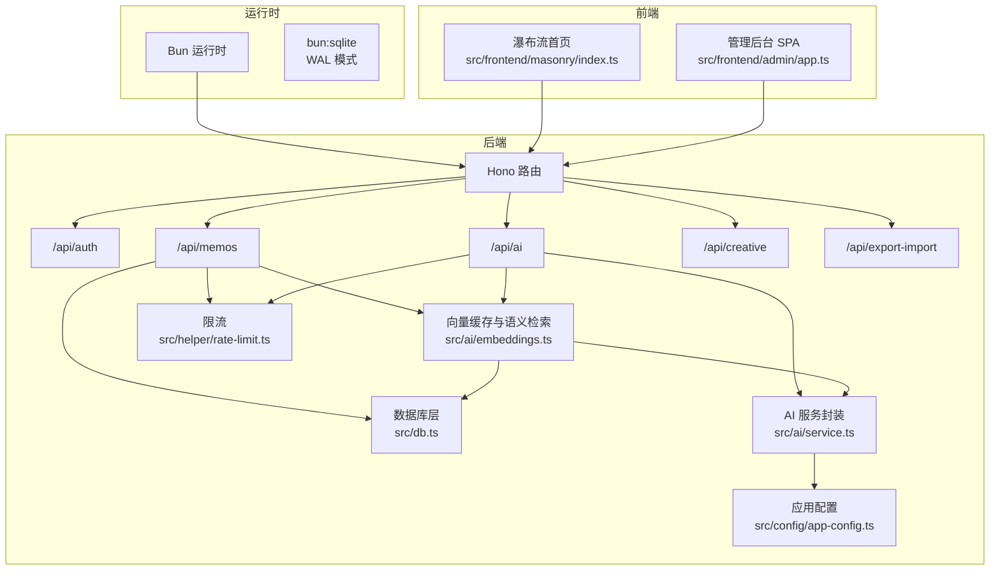
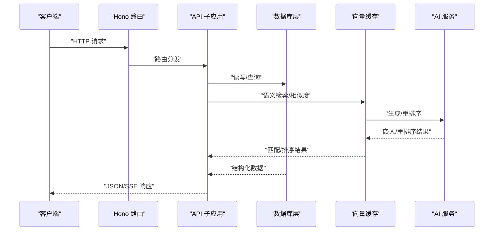
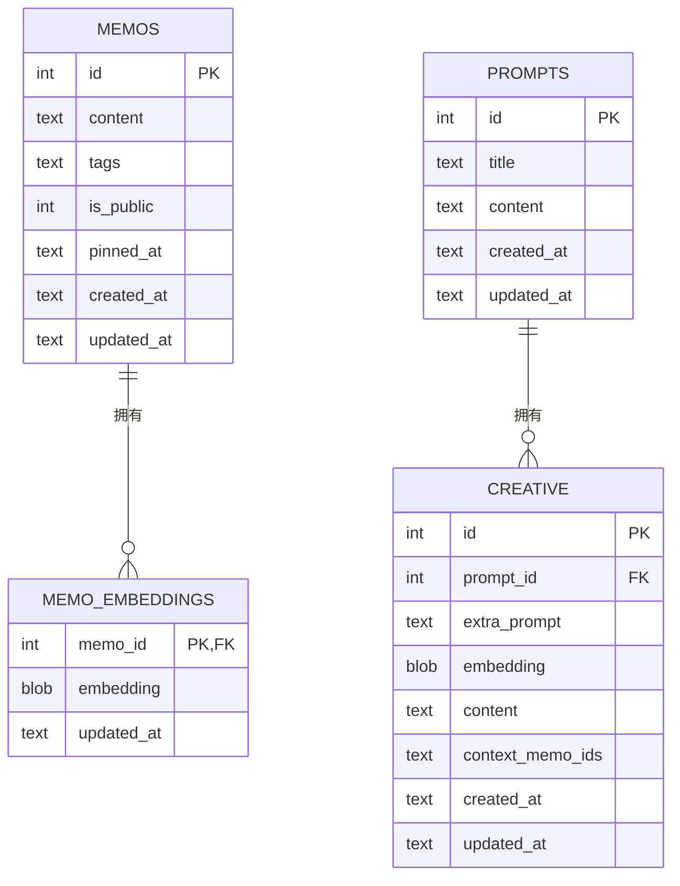
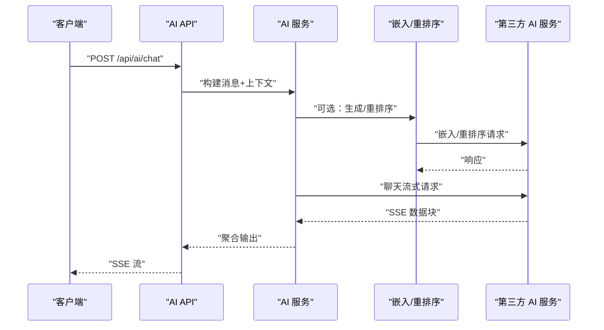
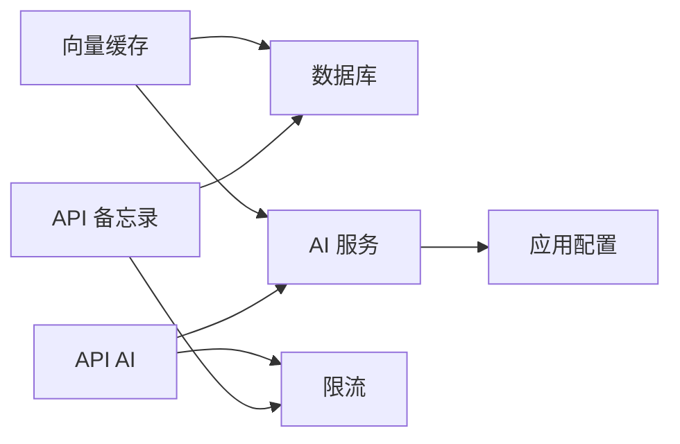

# 性能监控

<cite>
**本文引用的文件**
- [README.md](file://README.md)
- [package.json](file://package.json)
- [src/server.ts](file://src/server.ts)
- [src/db.ts](file://src/db.ts)
- [src/api/memos.ts](file://src/api/memos.ts)
- [src/api/ai.ts](file://src/api/ai.ts)
- [src/ai/service.ts](file://src/ai/service.ts)
- [src/ai/embeddings.ts](file://src/ai/embeddings.ts)
- [src/config/app-config.ts](file://src/config/app-config.ts)
- [src/helper/rate-limit.ts](file://src/helper/rate-limit.ts)
- [app.config.json](file://app.config.json)
- [ai.config.json](file://ai.config.json)
- [src/frontend/masonry/index.ts](file://src/frontend/masonry/index.ts)
- [src/frontend/admin/app.ts](file://src/frontend/admin/app.ts)
</cite>

## 目录
1. [简介](#简介)
2. [项目结构](#项目结构)
3. [核心组件](#核心组件)
4. [架构总览](#架构总览)
5. [详细组件分析](#详细组件分析)
6. [依赖关系分析](#依赖关系分析)
7. [性能考量](#性能考量)
8. [故障排查指南](#故障排查指南)
9. [结论](#结论)
10. [附录](#附录)

## 简介
本文件面向 Memos 的性能监控与优化，围绕应用性能指标（响应时间、内存使用、CPU 负载、并发连接数）、数据库性能（查询执行计划、索引使用、慢查询）、AI 服务性能（API 调用延迟、错误率、成本统计）、前端性能（页面加载时间、资源体积、用户体验指标）、日志管理策略（日志级别、轮转、错误追踪）以及优化建议（缓存策略、数据库查询优化、静态资源压缩）进行系统化梳理，并给出监控告警配置思路与故障处理流程。

## 项目结构
- 运行时：基于 Bun，内置 SQLite 与 HTTP 服务器
- 前端：首页瀑布流（VanJS + Pretext 文字排版），管理后台（VanJS SPA）
- 后端：Hono 路由，API 子应用分层（认证、备忘录、AI、创意、导入导出）
- 数据层：SQLite（WAL 模式），内存嵌入向量缓存，向量相似度与重排序
- 配置：app.config.json 控制 AI、嵌入、重排序、限流；ai.config.json 管理多提供商与默认模型

图表来源
- [src/server.ts:1-125](file://src/server.ts#L1-L125)
- [src/db.ts:1-484](file://src/db.ts#L1-L484)
- [src/api/memos.ts:1-220](file://src/api/memos.ts#L1-L220)
- [src/api/ai.ts:1-326](file://src/api/ai.ts#L1-L326)
- [src/ai/embeddings.ts:1-228](file://src/ai/embeddings.ts#L1-L228)
- [src/ai/service.ts:1-507](file://src/ai/service.ts#L1-L507)
- [src/config/app-config.ts:1-108](file://src/config/app-config.ts#L1-L108)
- [src/helper/rate-limit.ts:1-153](file://src/helper/rate-limit.ts#L1-L153)
- [src/frontend/masonry/index.ts:1-23](file://src/frontend/masonry/index.ts#L1-L23)
- [src/frontend/admin/app.ts:1-251](file://src/frontend/admin/app.ts#L1-L251)

章节来源
- [README.md:14-45](file://README.md#L14-L45)
- [package.json:1-26](file://package.json#L1-L26)
- [src/server.ts:11-125](file://src/server.ts#L11-L125)

## 核心组件
- 服务器与路由：Hono 路由挂载各 API 子应用，静态资源与 SPA 路由处理
- 数据库层：SQLite（WAL 模式），表结构与索引，查询条件拼接与分页
- AI 服务：多提供商适配、超时控制、流式对话、嵌入与重排序
- 向量缓存：内存 Map 缓存向量，Cosine 相似度评分，候选集与重排序
- 限流：基于 IP 的小时/天双窗口计数，支持 memo 与 AI 两类
- 前端：瀑布流首页与管理后台 SPA，初始数据加载与状态驱动

章节来源
- [src/server.ts:38-125](file://src/server.ts#L38-L125)
- [src/db.ts:15-61](file://src/db.ts#L15-L61)
- [src/api/memos.ts:26-220](file://src/api/memos.ts#L26-L220)
- [src/api/ai.ts:21-326](file://src/api/ai.ts#L21-L326)
- [src/ai/embeddings.ts:13-228](file://src/ai/embeddings.ts#L13-L228)
- [src/ai/service.ts:43-115](file://src/ai/service.ts#L43-L115)
- [src/config/app-config.ts:55-107](file://src/config/app-config.ts#L55-L107)
- [src/helper/rate-limit.ts:25-153](file://src/helper/rate-limit.ts#L25-L153)
- [src/frontend/masonry/index.ts:6-23](file://src/frontend/masonry/index.ts#L6-L23)
- [src/frontend/admin/app.ts:224-251](file://src/frontend/admin/app.ts#L224-L251)

## 架构总览
- 入口：Bun.serve + Hono，静态资源与 SPA 回退
- API 分层：认证、备忘录、AI、创意、导入导出
- 数据通路：API → DB/缓存 → AI 服务（可选）→ 前端
- 配置：app.config.json 与 ai.config.json 提供运行时参数与提供商配置

图表来源
- [src/server.ts:38-125](file://src/server.ts#L38-L125)
- [src/api/memos.ts:28-70](file://src/api/memos.ts#L28-L70)
- [src/api/ai.ts:198-325](file://src/api/ai.ts#L198-L325)
- [src/ai/embeddings.ts:95-154](file://src/ai/embeddings.ts#L95-L154)
- [src/ai/service.ts:351-385](file://src/ai/service.ts#L351-L385)

## 详细组件分析

### 应用性能监控（响应时间、内存、CPU、并发）
- 响应时间
  - 关键路径：请求进入 Hono → API 处理 → DB 查询/缓存 → AI 服务（可选）→ 返回
  - 影响因素：网络延迟、数据库锁竞争、AI 服务超时与流式传输、前端渲染
  - 建议：对热点接口增加缓存（如标签列表、计数）、对长耗时操作异步化（嵌入生成）
- 内存使用
  - 向量缓存：内存 Map 存储 Float32Array，随备忘录数量线性增长
  - 建议：定期清理无效缓存、限制最大缓存条目、监控进程 RSS
- CPU 负载
  - 嵌入生成与重排序涉及浮点运算，注意批处理与并发上限
  - 建议：合理设置并发上限、启用更高效的向量维度或降维（若可行）
- 并发连接数
  - 使用 Bun.serve，默认并发模型；建议结合反向代理（如 Nginx）做连接复用与限流
  - 建议：对 SSE/流式接口设置合理的超时与心跳

章节来源
- [src/server.ts:119-125](file://src/server.ts#L119-L125)
- [src/ai/embeddings.ts:13-75](file://src/ai/embeddings.ts#L13-L75)
- [src/ai/service.ts:16-18](file://src/ai/service.ts#L16-L18)

### 数据库性能监控（查询执行计划、索引使用、慢查询）
- 表与索引
  - memos 表：主键、pinned_at 索引；tags 为 JSON 字符串，查询使用 json_each
  - memo_embeddings：memo_id 外键索引
- 查询特征
  - 模糊搜索 LIKE + JSON 标签 IN 查询，可能触发全表扫描
  - 分页与排序：ORDER BY pinned_at + created_at，建议评估复合索引
- 慢查询定位
  - 使用 SQLite EXPLAIN QUERY PLAN 分析复杂 LIKE/JSON 查询
  - 监控高延迟接口（如 /api/memos?page/limit、/api/memos/:id/similar）
- 优化建议
  - 为 content 建立 FTS5 全文索引（如需强全文能力）
  - 为 tags 建立辅助表或物化列，减少 json_each
  - 限制分页深度与每页大小，避免大偏移

图表来源
- [src/db.ts:18-60](file://src/db.ts#L18-L60)

章节来源
- [src/db.ts:122-169](file://src/db.ts#L122-L169)
- [src/db.ts:171-188](file://src/db.ts#L171-L188)
- [src/db.ts:353-402](file://src/db.ts#L353-L402)

### AI 服务性能监控（延迟、错误率、成本）
- 延迟
  - 聊天完成与流式对话均受上游 API 延迟影响；内置超时控制
  - 嵌入生成与重排序为额外开销，建议异步化
- 错误率
  - 网络异常、鉴权失败、上游 5xx；记录错误码与堆栈
- 成本统计
  - 通过外部平台用量统计（DashScope、各提供商控制台）；建议埋点记录请求次数与维度
- 监控要点
  - 超时阈值、重试策略、熔断与降级（如禁用重排序）

图表来源
- [src/api/ai.ts:198-325](file://src/api/ai.ts#L198-L325)
- [src/ai/service.ts:132-175](file://src/ai/service.ts#L132-L175)
- [src/ai/service.ts:351-385](file://src/ai/service.ts#L351-L385)
- [src/ai/service.ts:389-445](file://src/ai/service.ts#L389-L445)

章节来源
- [src/ai/service.ts:16-18](file://src/ai/service.ts#L16-L18)
- [src/ai/service.ts:43-75](file://src/ai/service.ts#L43-L75)
- [src/config/app-config.ts:9-29](file://src/config/app-config.ts#L9-L29)
- [ai.config.json:1-44](file://ai.config.json#L1-L44)

### 前端性能监控（页面加载、资源体积、体验指标）
- 首页瀑布流
  - 初始搜索/标签参数从 URL 同步，首屏渲染依赖初始数据加载
  - 建议：预构建 JS/CSS、开启 Gzip/Brotli、CDN 加速
- 管理后台
  - SPA 切换与状态驱动渲染，关注首屏与交互延迟
- 用户体验指标
  - FCP/LCP/CLS/INP 等；建议集成 Web Vitals 或第三方 SDK

章节来源
- [src/frontend/masonry/index.ts:6-23](file://src/frontend/masonry/index.ts#L6-L23)
- [src/frontend/admin/app.ts:224-251](file://src/frontend/admin/app.ts#L224-L251)
- [package.json:8-11](file://package.json#L8-L11)

### 日志管理策略（级别、轮转、错误追踪）
- 日志级别
  - info：启动、路由命中、缓存加载
  - warn/error：API 错误、重排序失败、嵌入生成失败
- 日志轮转
  - 建议使用系统日志守护（如 systemd/journald 或 logrotate）按大小/时间轮转
- 错误追踪
  - 前端：捕获 Promise Rejection 与全局错误
  - 后端：中间件统一捕获未处理异常，记录上下文与追踪 ID

章节来源
- [src/ai/embeddings.ts:36-37](file://src/ai/embeddings.ts#L36-L37)
- [src/ai/embeddings.ts:56-58](file://src/ai/embeddings.ts#L56-L58)
- [src/ai/embeddings.ts:147-149](file://src/ai/embeddings.ts#L147-L149)
- [src/ai/service.ts:162-167](file://src/ai/service.ts#L162-L167)
- [src/ai/service.ts:372-375](file://src/ai/service.ts#L372-L375)

## 依赖关系分析
- 组件耦合
  - API 层依赖 DB 与 AI 服务；向量缓存同时依赖 DB 与 AI 服务
  - 配置模块被 AI 服务与限流模块共享
- 外部依赖
  - Hono、bun:sqlite、DashScope、各提供商 Chat API
- 循环依赖
  - 当前结构清晰，未见循环依赖

图表来源
- [src/api/memos.ts:10-25](file://src/api/memos.ts#L10-L25)
- [src/api/ai.ts:1-20](file://src/api/ai.ts#L1-L20)
- [src/ai/embeddings.ts:1-12](file://src/ai/embeddings.ts#L1-L12)
- [src/ai/service.ts:14-14](file://src/ai/service.ts#L14-L14)
- [src/config/app-config.ts:1-6](file://src/config/app-config.ts#L1-L6)
- [src/helper/rate-limit.ts:1-7](file://src/helper/rate-limit.ts#L1-L7)

章节来源
- [src/api/memos.ts:10-25](file://src/api/memos.ts#L10-L25)
- [src/api/ai.ts:1-20](file://src/api/ai.ts#L1-L20)
- [src/ai/embeddings.ts:1-12](file://src/ai/embeddings.ts#L1-L12)
- [src/ai/service.ts:14-14](file://src/ai/service.ts#L14-L14)
- [src/config/app-config.ts:1-6](file://src/config/app-config.ts#L1-L6)
- [src/helper/rate-limit.ts:1-7](file://src/helper/rate-limit.ts#L1-L7)

## 性能考量
- 缓存策略
  - 向量缓存：按需生成与持久化，避免重复计算
  - 嵌入生成：创建/更新备忘录时 fire-and-forget 异步生成
- 数据库查询优化
  - LIKE + JSON 查询可能全表扫描，建议物化标签或 FTS
  - 分页与排序字段建立索引，限制每页大小
- 静态资源压缩
  - 构建阶段启用 ESM 打包与压缩，配合 CDN 与缓存头
- 并发与超时
  - AI 请求超时与流式传输，避免阻塞主线程
  - 限流防止突发流量导致雪崩

章节来源
- [src/ai/embeddings.ts:16-64](file://src/ai/embeddings.ts#L16-L64)
- [src/api/memos.ts:138-141](file://src/api/memos.ts#L138-L141)
- [src/ai/service.ts:16-18](file://src/ai/service.ts#L16-L18)
- [package.json:8-11](file://package.json#L8-L11)

## 故障排查指南
- 速率限制
  - 现象：429 Too Many Requests
  - 排查：检查环境变量与 app.config.json 的 rateLimit 设置，确认 IP 识别是否正确
- AI 不可用
  - 现象：/api/ai/status 返回不可用
  - 排查：确认 ai.config.json 与对应 API Key 环境变量
- 嵌入生成失败
  - 现象：日志报错、相似度检索为空
  - 排查：DashScope Key 与网络连通性，重试与降级策略
- SSE/流式接口异常
  - 现象：/api/ai/chat 断流
  - 排查：上游超时、网络波动、客户端断开重连

章节来源
- [src/helper/rate-limit.ts:76-153](file://src/helper/rate-limit.ts#L76-L153)
- [src/ai/service.ts:96-115](file://src/ai/service.ts#L96-L115)
- [src/ai/embeddings.ts:52-59](file://src/ai/embeddings.ts#L52-L59)
- [src/api/ai.ts:318-325](file://src/api/ai.ts#L318-L325)

## 结论
通过在关键路径埋点（响应时间、错误率、资源体积）、对数据库查询与 AI 服务进行针对性优化、完善日志与限流策略，可显著提升 Memos 的整体性能与稳定性。建议以可视化监控平台接入这些指标，并结合告警规则实现自动化运维。

## 附录

### 监控告警配置（阈值与通知）
- 响应时间
  - P95/P99：接口维度设定阈值，超阈告警
- 错误率
  - 5xx/429 占比超过阈值触发
- 资源使用
  - CPU/内存/磁盘 IO 阈值，结合系统监控
- 通知渠道
  - 邮件/IM/Webhook，区分严重/警告级别
- 故障处理流程
  - 自动降级（禁用重排序/流式）、快速回滚、容量扩容

[本节为通用实践建议，不直接分析具体文件]