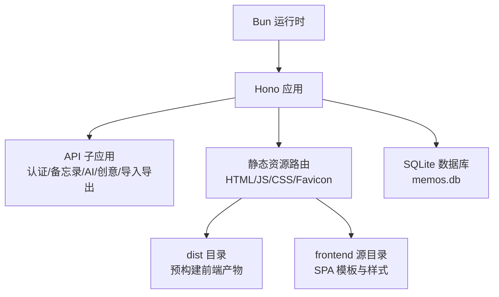
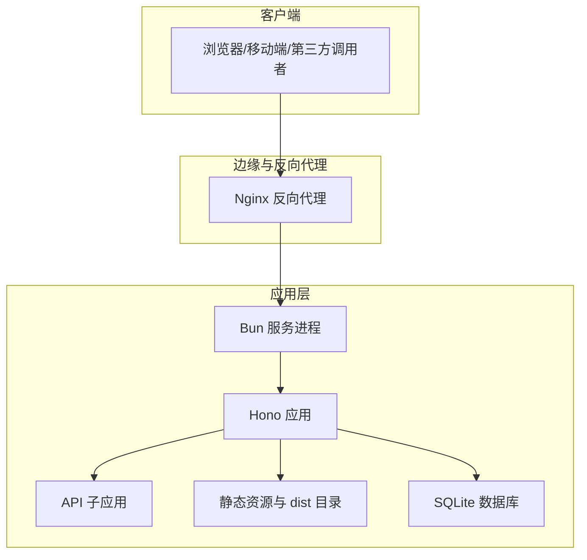
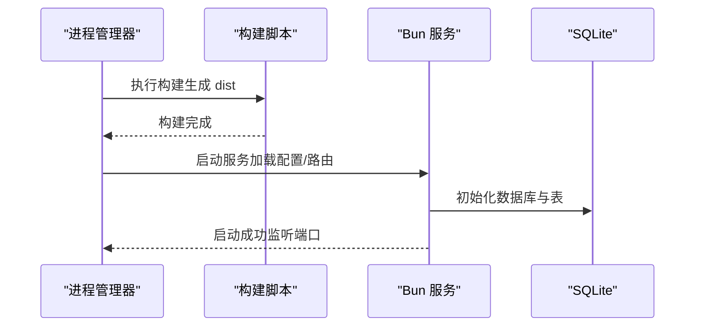
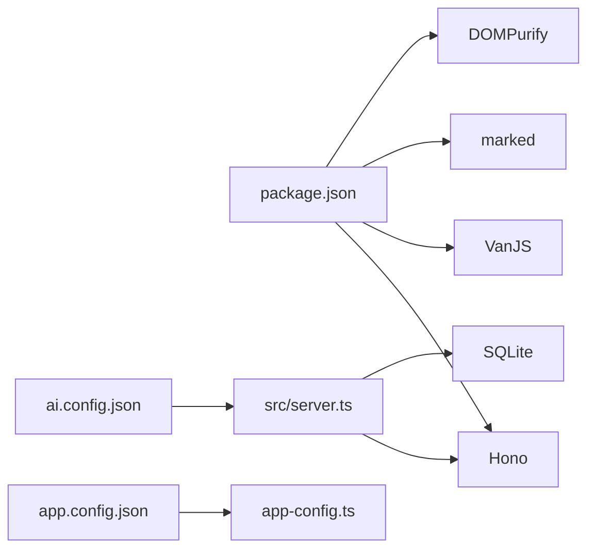

# 生产部署

<cite>
**本文引用的文件**
- [package.json](file://package.json)
- [README.md](file://README.md)
- [src/server.ts](file://src/server.ts)
- [src/db.ts](file://src/db.ts)
- [src/config/app-config.ts](file://src/config/app-config.ts)
- [app.config.json](file://app.config.json)
- [ai.config.json](file://ai.config.json)
- [src/frontend/admin/index.html](file://src/frontend/admin/index.html)
- [src/frontend/masonry/index.html](file://src/frontend/masonry/index.html)
</cite>

## 目录
1. [简介](#简介)
2. [项目结构](#项目结构)
3. [核心组件](#核心组件)
4. [架构总览](#架构总览)
5. [详细组件分析](#详细组件分析)
6. [依赖关系分析](#依赖关系分析)
7. [性能考虑](#性能考虑)
8. [故障排查指南](#故障排查指南)
9. [结论](#结论)
10. [附录](#附录)

## 简介
本文件面向生产环境部署 Memos，目标是帮助运维与开发团队在 Linux 服务器上完成从环境准备、应用构建、启动与守护、到反向代理与容器化的完整落地流程。文档严格依据仓库现有源码与配置文件进行说明，避免臆测。

## 项目结构
- 运行时与语言：基于 Bun（包含内置 SQLite 与 HTTP 服务器能力），使用 ESM 构建前端静态资源。
- 后端服务：以 Hono 作为 Web 框架，统一挂载认证、备忘录、AI、创意写作与导入导出等子路由。
- 前端资源：首页瀑布流与管理后台均为 SPA，分别通过预构建的 JS Bundle 提供；静态样式与图标由服务端直传。
- 数据存储：SQLite（WAL 模式），首次启动自动初始化表结构与种子数据。
- 配置体系：应用配置来自 app.config.json 的 JSON 文件，AI 提供商配置来自 ai.config.json。

图表来源
- [src/server.ts:1-125](file://src/server.ts#L1-L125)
- [src/db.ts:1-484](file://src/db.ts#L1-L484)

章节来源
- [README.md:25-45](file://README.md#L25-L45)
- [src/server.ts:11-125](file://src/server.ts#L11-L125)
- [src/db.ts:15-61](file://src/db.ts#L15-L61)

## 核心组件
- 服务入口与路由
  - 服务监听端口由环境变量控制，默认 3020。
  - 挂载 /api/* 子应用，提供认证、备忘录、AI、创意与导入导出接口。
  - 提供 /admin 与首页 SPA 的 HTML 与静态资源路由。
- 数据库层
  - 使用 SQLite（WAL 模式），自动创建表与索引；提供备忘录、嵌入向量、提示词与创意条目的 CRUD。
- 配置加载
  - 应用配置从 app.config.json 加载，具备内存缓存与回退默认值。
  - AI 提供商配置从 ai.config.json 加载，支持多提供商与默认模型选择。
- 前端构建
  - 使用 Bun.build 将前端入口打包为 ESM JS，输出至 dist 目录，供服务端路由直接提供。

章节来源
- [src/server.ts:11-125](file://src/server.ts#L11-L125)
- [src/db.ts:15-61](file://src/db.ts#L15-L61)
- [src/config/app-config.ts:57-107](file://src/config/app-config.ts#L57-L107)
- [package.json:6-12](file://package.json#L6-L12)

## 架构总览
下图展示生产部署的关键交互：客户端请求经 Nginx 反代后到达 Bun 服务，服务读取配置文件与数据库，返回静态资源与 API 响应。

图表来源
- [src/server.ts:38-125](file://src/server.ts#L38-L125)
- [src/db.ts:1-13](file://src/db.ts#L1-L13)

## 详细组件分析

### 服务器环境准备
- 操作系统
  - 任意支持 Bun 的 Linux 发行版均可，建议使用长期支持版本以获得稳定内核与包管理器生态。
- 运行时与依赖
  - 运行时：Bun（版本要求见快速开始说明）。
  - 依赖安装：执行依赖安装命令以生成锁文件与本地模块。
- 端口与防火墙
  - 默认监听端口 3020，需在安全组/防火墙放行该端口。
- 文件系统权限
  - 应用需对项目目录具有读写权限，以便创建与更新 memos.db 与 dist 目录下的静态资源。

章节来源
- [README.md:49-81](file://README.md#L49-L81)
- [src/server.ts:11-125](file://src/server.ts#L11-L125)

### 应用构建流程
- 前端静态资源构建
  - 执行构建脚本，将瀑布流与管理后台入口分别打包为 ESM JS，输出到 dist 目录。
  - 服务端路由直接提供 dist 下的预构建 JS 与共享样式。
- 后端服务打包
  - 项目未提供传统“打包”步骤，运行时直接以 Bun 执行 TypeScript 源码；生产启动即为“构建+启动”的组合。
- 环境变量配置
  - PORT：服务监听端口，默认 3020。
  - MEMOS_SECRET_KEY：管理后台登录密钥（用于认证）。
  - AI 提供商相关环境变量：根据 ai.config.json 中定义的 apiKeyEnv 字段注入，如 DEEPSEEK_API_KEY、KIMI_API_KEY、GLM_API_KEY、DASHSCOPE_API_KEY。

章节来源
- [package.json:6-12](file://package.json#L6-L12)
- [README.md:59-81](file://README.md#L59-L81)
- [ai.config.json:1-44](file://ai.config.json#L1-L44)

### 应用启动方式
- 开发模式
  - 使用热重载启动，适合本地调试。
- 生产模式
  - 先构建前端，再启动服务；服务启动后会自动初始化数据库与种子数据，并建立向量缓存。
- 端口与域名绑定
  - 端口由环境变量控制；域名绑定通过反向代理完成（见下一节）。

图表来源
- [package.json:6-12](file://package.json#L6-L12)
- [src/server.ts:109-125](file://src/server.ts#L109-L125)
- [src/db.ts:15-61](file://src/db.ts#L15-L61)

章节来源
- [README.md:73-81](file://README.md#L73-L81)
- [src/server.ts:109-125](file://src/server.ts#L109-L125)

### Docker 容器化部署方案
- 镜像基础
  - 建议基于官方 Bun 镜像或 Debian/Alpine 等最小化发行版，安装 Bun 运行时。
- 工作目录与复制
  - 设置工作目录，复制项目文件与依赖安装产物。
- 端口暴露
  - 暴露应用监听端口（默认 3020）。
- 启动命令
  - 使用生产启动脚本启动服务。
- 卷挂载
  - 将数据卷挂载到应用可写目录，以便持久化 memos.db 与日志。
- 环境变量
  - 通过镜像环境变量注入 PORT、MEMOS_SECRET_KEY 以及各 AI 提供商的 API Key。

说明：本仓库未提供 Dockerfile 或 docker-compose 文件，以上为通用容器化实践建议，便于与现有源码配合使用。

### Nginx 反向代理配置要点
- 静态资源服务
  - 将 /admin/app.js 与 /index.js 等静态资源路由交由 Nginx 或服务端直传；若使用 Nginx，可将其映射到 dist 目录。
- API 转发
  - 将 /api/* 转发至应用监听地址与端口。
- 域名与 SSL
  - 绑定域名并通过 ACME 或自有证书启用 HTTPS；将证书路径与密钥路径配置到 Nginx。
- 缓存与压缩
  - 对静态资源启用缓存与 Gzip/HTTP/2 压缩提升性能。

说明：本仓库未提供 Nginx 配置文件，以上为通用反向代理实践建议，便于与现有路由结构配合使用。

### 进程守护与健康检查
- PM2
  - 使用 PM2 管理 Bun 进程，配置自动重启、日志轮转与错误告警。
- systemd
  - 编写服务单元文件，设置 WorkingDirectory、ExecStart、Restart 等参数，结合日志服务与定时任务实现健康检查与巡检。

说明：本仓库未提供 PM2 或 systemd 配置文件，以上为通用进程守护实践建议，便于与现有启动脚本配合使用。

### 一键部署脚本与环境变量最佳实践
- 一键部署脚本
  - 建议脚本包含：依赖安装、前端构建、数据库初始化、进程管理器启动、Nginx 配置与 SSL 证书部署。
- 环境变量最佳实践
  - 将敏感信息（如 API Key）置于受控的环境变量文件中，避免硬编码。
  - 为不同环境（测试/预发布/生产）维护独立的环境变量文件与 CI/CD 变更流程。
  - 对关键配置（如端口、密钥）在启动前进行校验，失败即退出，避免静默异常。

## 依赖关系分析
- 运行时依赖
  - Hono：Web 框架与路由。
  - VanJS、Pretext：前端 SPA 与文本排版。
  - marked、DOMPurify：Markdown 渲染与安全清理。
- 构建与工具
  - Bun.build：前端静态资源按需编译。
- 数据与配置
  - SQLite：本地数据库，WAL 模式。
  - app.config.json：应用行为配置。
  - ai.config.json：AI 提供商与模型配置。

图表来源
- [package.json:19-25](file://package.json#L19-L25)
- [src/server.ts:1-10](file://src/server.ts#L1-L10)
- [src/config/app-config.ts:1-5](file://src/config/app-config.ts#L1-L5)
- [app.config.json:1-22](file://app.config.json#L1-L22)
- [ai.config.json:1-44](file://ai.config.json#L1-L44)

章节来源
- [package.json:19-25](file://package.json#L19-L25)
- [src/server.ts:1-10](file://src/server.ts#L1-L10)
- [src/config/app-config.ts:1-5](file://src/config/app-config.ts#L1-L5)

## 性能考虑
- 前端资源
  - 使用 ESM 预构建产物，减少运行时编译开销；合理利用浏览器缓存与 CDN。
- 数据库
  - SQLite WAL 模式提升并发读写；对高频查询字段建立索引（已创建）。
- 配置与限流
  - 通过 app.config.json 调整 AI 请求超时、Token 数与重排策略；结合速率限制策略降低滥用风险。
- 反向代理
  - 启用压缩与缓存，合理设置超时与连接数上限。

## 故障排查指南
- 无法访问页面
  - 检查端口是否被占用与防火墙放行；确认 Nginx 是否正确转发到应用端口。
- 404 或静态资源缺失
  - 确认 dist 目录存在且包含对应 JS 文件；检查服务端路由是否正确映射。
- 数据库初始化失败
  - 检查工作目录权限与磁盘空间；确认 SQLite 文件可读写。
- 认证失败
  - 检查 MEMOS_SECRET_KEY 是否与前端一致；确认 Cookie 是否被正确设置与携带。
- AI 接口异常
  - 检查对应提供商 API Key 是否正确注入；确认网络可达与请求超时设置。

章节来源
- [src/server.ts:15-36](file://src/server.ts#L15-L36)
- [src/db.ts:15-61](file://src/db.ts#L15-L61)
- [README.md:59-81](file://README.md#L59-L81)

## 结论
本部署文档基于仓库现有源码与配置，给出了从环境准备、构建与启动、反向代理到容器化与进程守护的完整实践路径。建议在生产环境中结合监控与备份策略，持续优化性能与可用性。

## 附录
- 关键文件与职责
  - package.json：脚本与依赖声明。
  - README.md：环境要求、快速开始与 API 说明。
  - src/server.ts：服务入口、路由与静态资源提供。
  - src/db.ts：数据库初始化、CRUD 与索引。
  - src/config/app-config.ts：应用配置加载器。
  - app.config.json：应用行为配置。
  - ai.config.json：AI 提供商配置。
  - 前端模板：src/frontend/admin/index.html 与 src/frontend/masonry/index.html。

章节来源
- [package.json:1-26](file://package.json#L1-L26)
- [README.md:1-186](file://README.md#L1-L186)
- [src/server.ts:1-125](file://src/server.ts#L1-L125)
- [src/db.ts:1-484](file://src/db.ts#L1-L484)
- [src/config/app-config.ts:1-108](file://src/config/app-config.ts#L1-L108)
- [app.config.json:1-22](file://app.config.json#L1-L22)
- [ai.config.json:1-44](file://ai.config.json#L1-L44)
- [src/frontend/admin/index.html:1-1076](file://src/frontend/admin/index.html#L1-L1076)
- [src/frontend/masonry/index.html:1-427](file://src/frontend/masonry/index.html#L1-L427)