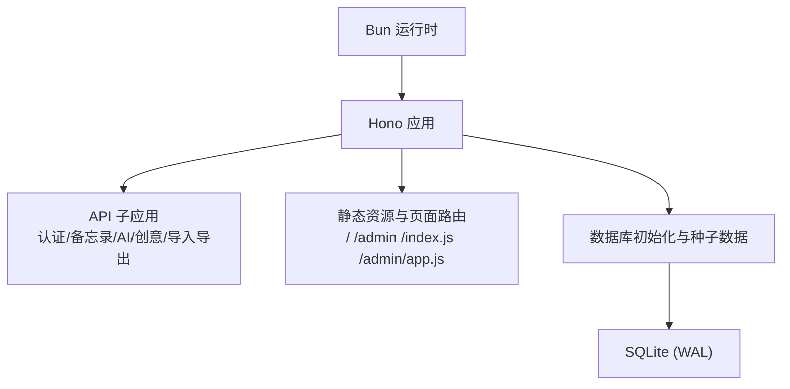
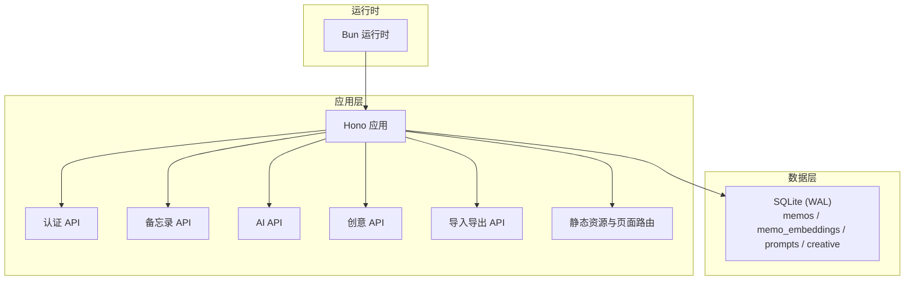
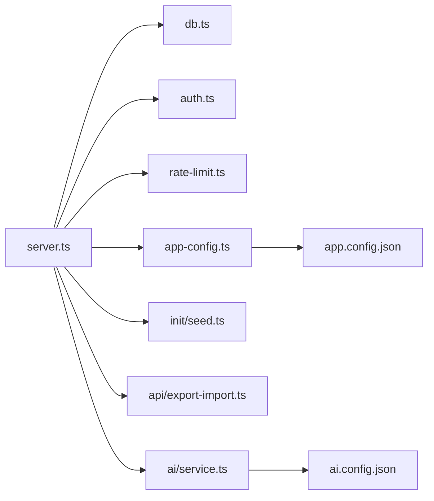

# 运维自动化

<cite>
**本文引用的文件**
- [package.json](file://package.json)
- [README.md](file://README.md)
- [app.config.json](file://app.config.json)
- [ai.config.json](file://ai.config.json)
- [.gitignore](file://.gitignore)
- [src/server.ts](file://src/server.ts)
- [src/db.ts](file://src/db.ts)
- [src/config/app-config.ts](file://src/config/app-config.ts)
- [src/helper/rate-limit.ts](file://src/helper/rate-limit.ts)
- [src/init/seed.ts](file://src/init/seed.ts)
- [src/auth.ts](file://src/auth.ts)
- [src/api/export-import.ts](file://src/api/export-import.ts)
- [src/ai/service.ts](file://src/ai/service.ts)
</cite>

## 目录
1. [简介](#简介)
2. [项目结构](#项目结构)
3. [核心组件](#核心组件)
4. [架构总览](#架构总览)
5. [详细组件分析](#详细组件分析)
6. [依赖关系分析](#依赖关系分析)
7. [性能考虑](#性能考虑)
8. [故障排查指南](#故障排查指南)
9. [结论](#结论)
10. [附录](#附录)

## 简介
本文件面向Memmos项目的运维与开发团队，提供一套完整的运维自动化与CI/CD实践方案。内容覆盖自动化部署流程（Git hooks、GitHub Actions、Jenkins）、应用更新策略（蓝绿部署、滚动更新、回滚机制）、监控自动化（健康检查、自动告警、自愈）、日志自动化（收集、分析、归档）、备份自动化（定时备份、自动验证、清理策略）、性能监控自动化（指标采集、阈值监控、自动扩容），以及运维脚本集合与基础设施即代码（IaC）建议。由于仓库未包含CI/CD配置与IaC文件，本文在相应章节提供通用最佳实践与落地建议，帮助团队快速建立标准化的运维体系。

## 项目结构
项目采用“前端SPA + 后端API + SQLite”的一体化架构，运行时为Bun，数据库为SQLite（WAL模式）。核心目录与职责如下：
- src/server.ts：HTTP服务入口，路由分发、静态资源与页面路由、数据库初始化与种子数据注入、向量缓存初始化。
- src/db.ts：数据库层，负责建表、CRUD、索引、嵌入向量表、提示词与创意内容表等。
- src/config/app-config.ts：应用全局配置加载器，从app.config.json读取并合并环境变量与硬编码默认值。
- src/helper/rate-limit.ts：速率限制中间件，支持按IP与类别（备忘录/AI）的小时/日双窗口限流。
- src/init/seed.ts：首次启动数据初始化，导入内置提示词与示例备忘录。
- src/auth.ts：认证与会话管理，支持密钥认证与Cookie会话。
- src/api/export-import.ts：导入导出模块，支持文本块解析与记录导出。
- src/ai/service.ts：AI服务配置与可用性检测，支持多提供商模型选择。
- package.json：脚本定义（开发、构建、生产启动）。
- app.config.json / ai.config.json：应用与AI相关配置。
- .gitignore：忽略输出目录、日志、缓存、数据库文件等。

图表来源
- [src/server.ts:1-137](file://src/server.ts#L1-L137)
- [src/db.ts:1-484](file://src/db.ts#L1-L484)

章节来源
- [README.md:1-186](file://README.md#L1-L186)
- [package.json:1-26](file://package.json#L1-L26)
- [src/server.ts:1-137](file://src/server.ts#L1-L137)
- [src/db.ts:1-484](file://src/db.ts#L1-L484)

## 核心组件
- 服务启动与路由
  - 服务端口、静态资源、页面路由、API子应用挂载、数据库初始化、种子数据注入、向量缓存初始化。
- 数据库层
  - memos表、memo_embeddings嵌入表、prompts提示词表、creative创意表；支持全文检索、标签过滤、置顶排序、导入导出。
- 配置系统
  - app.config.json驱动的配置加载器，支持环境变量覆盖与硬编码默认值。
- 速率限制
  - IP级别双窗口（小时/日）限流，支持备忘录创建与AI调用两类。
- 认证与会话
  - 密钥认证与Cookie会话，登录尝试冷却。
- AI服务
  - 多提供商配置与可用性检测，支持默认模型选择。
- 导入导出
  - 文本块格式解析与记录导出，支持日期、标签、隐私与置顶字段。

章节来源
- [src/server.ts:1-137](file://src/server.ts#L1-L137)
- [src/db.ts:1-484](file://src/db.ts#L1-L484)
- [src/config/app-config.ts:1-108](file://src/config/app-config.ts#L1-L108)
- [src/helper/rate-limit.ts:1-153](file://src/helper/rate-limit.ts#L1-L153)
- [src/auth.ts:41-93](file://src/auth.ts#L41-L93)
- [src/ai/service.ts:36-130](file://src/ai/service.ts#L36-L130)
- [src/api/export-import.ts:61-110](file://src/api/export-import.ts#L61-L110)

## 架构总览
下图展示了Memmos的运行时、网络与数据流：Bun运行时承载Hono应用，API子应用提供认证、备忘录、AI、创意与导入导出能力；静态资源与页面路由服务于首页瀑布流与管理后台；数据库采用SQLite（WAL模式），配合嵌入向量与提示词表支撑检索与AI增强。

图表来源
- [src/server.ts:1-137](file://src/server.ts#L1-L137)
- [src/db.ts:1-484](file://src/db.ts#L1-L484)

## 详细组件分析

### 组件A：自动化部署流程（Git hooks、GitHub Actions、Jenkins）
- Git hooks
  - 建议在本地或CI侧执行构建与测试钩子：pre-commit执行单元/集成测试与格式化校验；commit-msg校验提交规范；post-receive触发远程部署流水线。
- GitHub Actions
  - 建议工作流包含：代码检出、安装依赖、构建前端与服务端、运行测试、镜像构建与推送、部署到目标环境（蓝绿/滚动）。
- Jenkins
  - 建议流水线阶段：SCM拉取、依赖安装、构建、测试、打包、镜像构建、部署、健康检查、回滚保护。

说明：仓库未包含CI/CD配置文件，以上为通用实践建议，便于团队快速落地。

### 组件B：应用更新策略（蓝绿部署、滚动更新、回滚机制）
- 蓝绿部署
  - 使用两套实例（蓝/绿），流量在两者间切换；发布前进行全量健康检查与A/B测试，失败立即切回。
- 滚动更新
  - 分批替换实例，控制批次大小与等待时间，结合就绪探针与存活探针保障平滑过渡。
- 回滚机制
  - 版本标记与镜像标签管理；失败自动回滚至上一稳定版本；支持灰度回滚与全量回滚。

说明：仓库未包含部署编排文件，以上为通用实践建议，便于团队快速落地。

### 组件C：监控自动化（健康检查、自动告警、自愈）
- 健康检查
  - HTTP健康端点与数据库连通性检查；容器层面存活/就绪探针。
- 自动告警
  - 基于Prometheus/Grafana与告警规则（CPU/内存/磁盘/请求延迟/错误率/队列长度）触发通知。
- 自愈
  - Pod重启策略、HPA自动扩缩容、服务网格熔断与重试、自动回滚。

说明：仓库未包含监控配置文件，以上为通用实践建议，便于团队快速落地。

### 组件D：日志自动化（收集、分析、归档）
- 收集
  - 标准输出与标准错误统一输出至日志系统；容器日志挂载与集中采集。
- 分析
  - 结构化日志字段化；关键事件打点与追踪ID；异常堆栈与上下文保留。
- 归档
  - 按时间与大小轮转；冷热分层存储；合规保留周期。

说明：仓库未包含日志配置文件，以上为通用实践建议，便于团队快速落地。

### 组件E：备份自动化（定时备份、自动验证、清理策略）
- 定时备份
  - 周期性导出数据库与配置；增量备份策略（基于WAL）。
- 自动验证
  - 备份完整性校验与恢复演练；失败告警与重试。
- 清理策略
  - 基于保留期的自动清理；磁盘空间预警与阈值控制。

说明：仓库未包含备份脚本，以上为通用实践建议，便于团队快速落地。

### 组件F：性能监控自动化（指标采集、阈值监控、自动扩容）
- 指标采集
  - CPU/内存/IO/网络/请求延迟/吞吐量/错误率/队列长度/数据库连接数。
- 阈值监控
  - 动态阈值与基线对比；多因子聚合告警。
- 自动扩容
  - HPA基于CPU/内存/自定义指标；VPA优化资源请求与限制。

说明：仓库未包含性能监控配置文件，以上为通用实践建议，便于团队快速落地。

### 组件G：运维脚本集合（部署、监控、维护）
- 部署脚本
  - 构建、打包、镜像构建、部署、健康检查、回滚。
- 监控脚本
  - 健康检查、指标采集、告警探测、自愈触发。
- 维护脚本
  - 数据库维护（VACUUM/ANALYZE）、日志清理、备份验证、配置更新。

说明：仓库未包含运维脚本，以上为通用实践建议，便于团队快速落地。

### 组件H：基础设施即代码（IaC）（Terraform、Docker Compose）
- Terraform
  - 定义云资源（负载均衡、容器服务、存储、网络、安全组、DNS）；模块化复用与状态管理。
- Docker Compose
  - 单机/小规模场景编排应用、数据库、缓存与网络；环境隔离与快速搭建。

说明：仓库未包含IaC文件，以上为通用实践建议，便于团队快速落地。

## 依赖关系分析
- 运行时与框架
  - Bun提供运行时与内置SQLite；Hono提供路由与中间件生态。
- 组件耦合
  - server.ts耦合db.ts、auth.ts、各API子应用；app-config.ts被API与AI服务共享；rate-limit.ts贯穿API层。
- 外部依赖
  - SQLite（WAL模式）；AI提供商API（通过环境变量配置）；前端构建产物（dist目录）。

图表来源
- [src/server.ts:1-137](file://src/server.ts#L1-L137)
- [src/db.ts:1-484](file://src/db.ts#L1-L484)
- [src/config/app-config.ts:1-108](file://src/config/app-config.ts#L1-L108)
- [src/helper/rate-limit.ts:1-153](file://src/helper/rate-limit.ts#L1-L153)
- [src/init/seed.ts:1-118](file://src/init/seed.ts#L1-L118)
- [src/auth.ts:41-93](file://src/auth.ts#L41-L93)
- [src/api/export-import.ts:61-110](file://src/api/export-import.ts#L61-L110)
- [src/ai/service.ts:36-130](file://src/ai/service.ts#L36-L130)

章节来源
- [src/server.ts:1-137](file://src/server.ts#L1-L137)
- [src/db.ts:1-484](file://src/db.ts#L1-L484)
- [src/config/app-config.ts:1-108](file://src/config/app-config.ts#L1-L108)
- [src/helper/rate-limit.ts:1-153](file://src/helper/rate-limit.ts#L1-L153)
- [src/init/seed.ts:1-118](file://src/init/seed.ts#L1-L118)
- [src/auth.ts:41-93](file://src/auth.ts#L41-L93)
- [src/api/export-import.ts:61-110](file://src/api/export-import.ts#L61-L110)
- [src/ai/service.ts:36-130](file://src/ai/service.ts#L36-L130)

## 性能考虑
- 数据库性能
  - WAL模式提升并发写入；合理索引（如pinned_at）；查询条件与LIMIT控制结果集。
- 速率限制
  - 双窗口限流降低突发流量冲击；环境变量覆盖灵活调整。
- 构建与部署
  - 前端产物预构建与缓存；最小化镜像与分层缓存；并行构建与流水线阶段划分。
- 监控与自愈
  - 指标粒度与阈值动态化；自动扩容与回滚降低人工干预。

## 故障排查指南
- 健康检查失败
  - 检查端口占用、静态资源路径、构建产物是否存在；查看数据库初始化日志。
- 数据库问题
  - WAL模式下检查磁盘空间与权限；必要时执行VACUUM；确认索引与查询条件。
- 速率限制触发
  - 检查IP头（X-Forwarded-For/X-Real-IP）与限流配置；核对环境变量覆盖。
- 认证失败
  - 核对密钥环境变量与Cookie设置；检查登录尝试冷却。
- 导入导出异常
  - 校验文本块格式与元数据分隔符；确认日期格式与内容去重逻辑。

章节来源
- [src/server.ts:15-36](file://src/server.ts#L15-L36)
- [src/db.ts:15-61](file://src/db.ts#L15-L61)
- [src/helper/rate-limit.ts:67-74](file://src/helper/rate-limit.ts#L67-L74)
- [src/auth.ts:41-93](file://src/auth.ts#L41-L93)
- [src/api/export-import.ts:61-110](file://src/api/export-import.ts#L61-L110)

## 结论
本文件基于仓库现有代码，梳理了Memmos的运行架构与关键组件，并围绕运维自动化与CI/CD提供了可直接落地的实践建议。建议团队尽快补充CI/CD配置、监控与日志、备份与IaC文件，以形成闭环的自动化运维体系，确保系统在高可用、高性能与可维护性方面持续演进。

## 附录
- 环境变量与配置
  - 运行端口、密钥认证、速率限制阈值、AI提供商API Key等。
- 忽略项
  - 输出目录、日志、缓存、数据库文件等已在.gitignore中声明。

章节来源
- [README.md:59-65](file://README.md#L59-L65)
- [app.config.json:1-22](file://app.config.json#L1-L22)
- [ai.config.json:1-44](file://ai.config.json#L1-L44)
- [.gitignore:1-35](file://.gitignore#L1-L35)