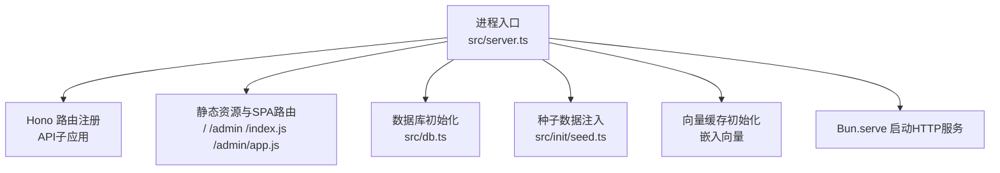
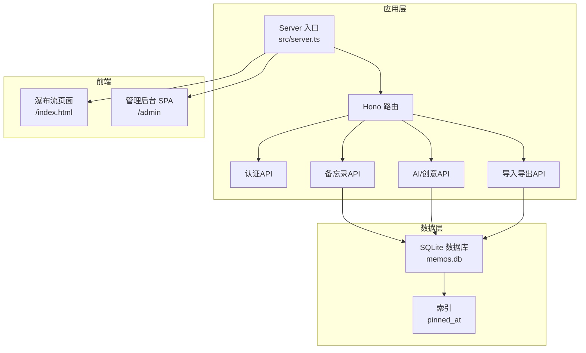
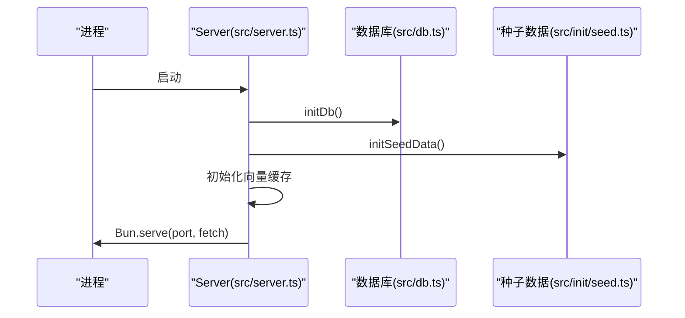
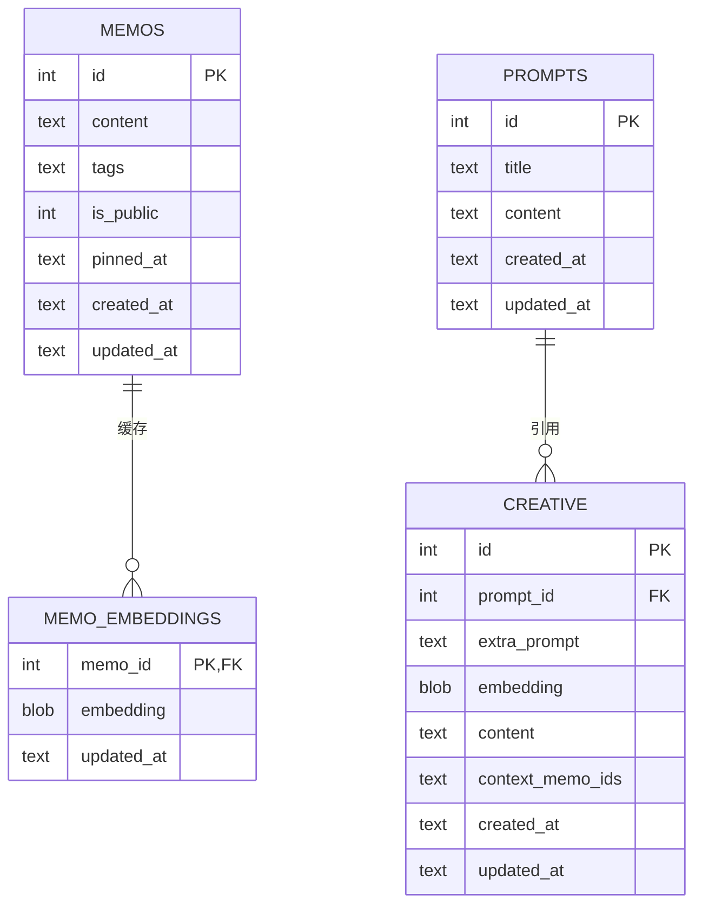
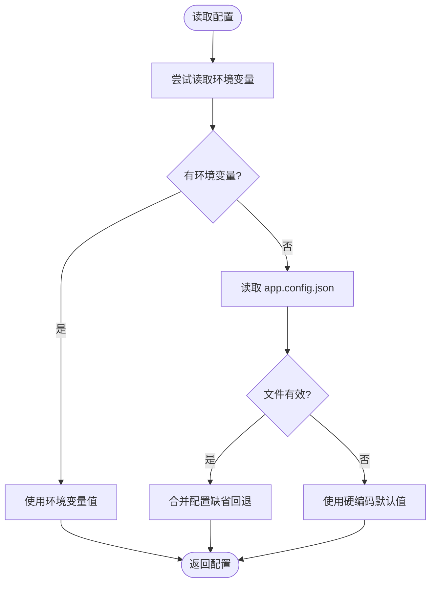
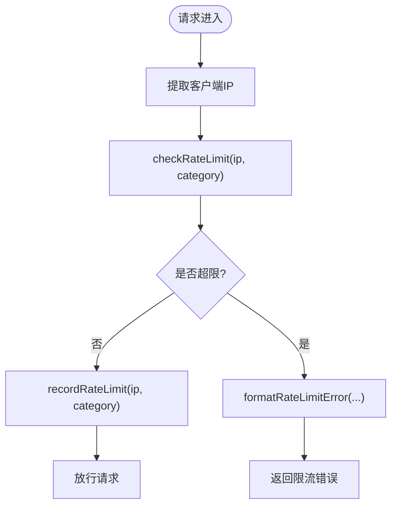
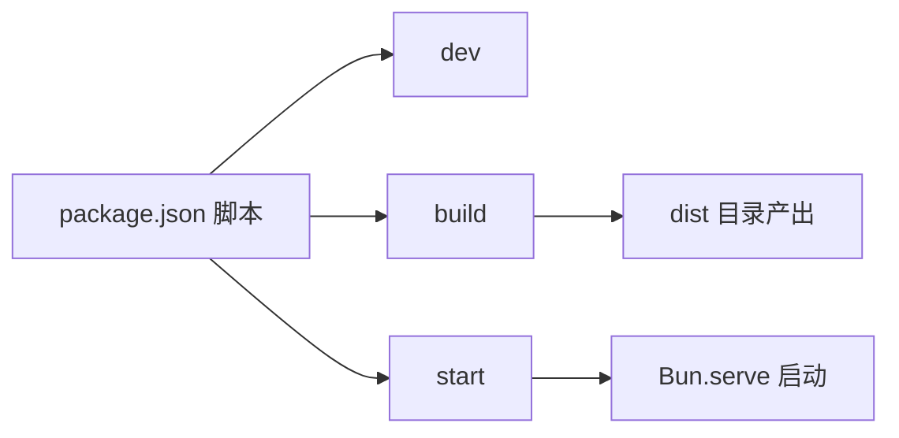

# 部署运维

<cite>
**本文引用的文件**   
- [README.md](file://README.md)
- [package.json](file://package.json)
- [src/server.ts](file://src/server.ts)
- [src/db.ts](file://src/db.ts)
- [src/config/app-config.ts](file://src/config/app-config.ts)
- [src/init/seed.ts](file://src/init/seed.ts)
- [src/helper/rate-limit.ts](file://src/helper/rate-limit.ts)
- [app.config.json](file://app.config.json)
</cite>

## 目录
1. [简介](#简介)
2. [项目结构](#项目结构)
3. [核心组件](#核心组件)
4. [架构总览](#架构总览)
5. [详细组件分析](#详细组件分析)
6. [依赖关系分析](#依赖关系分析)
7. [性能考虑](#性能考虑)
8. [监控与日志](#监控与日志)
9. [备份与恢复](#备份与恢复)
10. [安全加固](#安全加固)
11. [负载均衡与高可用](#负载均衡与高可用)
12. [运维自动化与CI/CD](#运维自动化与cicd)
13. [故障排除指南](#故障排除指南)
14. [结论](#结论)

## 简介
本文件面向运维工程师，提供 Memos 在生产环境的部署与运维指南。内容涵盖服务器准备、环境配置、应用启动、容器化部署、性能优化、监控日志、备份恢复、安全加固、高可用与负载均衡、自动化脚本与CI/CD，以及故障排除与应急响应流程。

## 项目结构
- 运行时：Bun（内置 SQLite 与 HTTP 服务器）
- 数据库：SQLite（WAL 模式），自动初始化
- 前端：首页瀑布流与管理后台（VanJS），构建产物输出至 dist
- 启动流程：服务启动前完成数据库初始化、种子数据注入、向量缓存初始化

图表来源
- [src/server.ts:119-125](file://src/server.ts#L119-L125)
- [src/db.ts:15-61](file://src/db.ts#L15-L61)
- [src/init/seed.ts:112-117](file://src/init/seed.ts#L112-L117)

章节来源
- [README.md:25-45](file://README.md#L25-L45)
- [src/server.ts:119-125](file://src/server.ts#L119-L125)

## 核心组件
- 服务器入口与路由
  - 负责 API 路由挂载、静态资源与 SPA 路由、数据库初始化、种子数据注入、向量缓存初始化、HTTP 服务启动。
- 数据库层
  - 使用 SQLite（WAL 模式），自动创建表与索引；提供备忘录、提示词、创意内容等 CRUD 与查询辅助方法。
- 配置加载器
  - 从 app.config.json 加载应用配置，支持默认回退与运行时覆盖。
- 速率限制
  - 基于 IP 的小时/天双窗口限流，支持“备忘录创建”和“AI 调用”两类。
- 种子数据
  - 首次启动时导入内置提示词与示例备忘录，避免空库状态。

章节来源
- [src/server.ts:38-125](file://src/server.ts#L38-L125)
- [src/db.ts:15-61](file://src/db.ts#L15-L61)
- [src/config/app-config.ts:55-107](file://src/config/app-config.ts#L55-L107)
- [src/helper/rate-limit.ts:27-39](file://src/helper/rate-limit.ts#L27-L39)
- [src/init/seed.ts:112-117](file://src/init/seed.ts#L112-L117)

## 架构总览

图表来源
- [src/server.ts:40-45](file://src/server.ts#L40-L45)
- [src/db.ts:18-60](file://src/db.ts#L18-L60)
- [src/server.ts:67-98](file://src/server.ts#L67-L98)

## 详细组件分析

### 服务器启动与路由
- 启动顺序
  - 初始化数据库与索引
  - 注入种子数据
  - 初始化向量缓存
  - 启动 HTTP 服务
- 路由要点
  - API 前缀统一为 /api
  - /admin SPA 支持深层路由回退
  - 静态资源与构建产物映射

图表来源
- [src/server.ts:109-125](file://src/server.ts#L109-L125)
- [src/db.ts:15-61](file://src/db.ts#L15-L61)
- [src/init/seed.ts:112-117](file://src/init/seed.ts#L112-L117)

章节来源
- [src/server.ts:109-125](file://src/server.ts#L109-L125)

### 数据库设计与查询
- 表结构
  - memos：主表，含内容、标签、公开/私密、置顶时间、创建/更新时间
  - memo_embeddings：嵌入向量缓存
  - prompts：提示词
  - creative：创意内容
- 索引
  - memos.pinned_at：提升置顶排序与查询性能
- 查询与分页
  - 支持按标签（多标签任一匹配）、全文检索、公开/私密过滤、限制条数
  - 默认按置顶优先、置顶时间/创建时间倒序

图表来源
- [src/db.ts:18-60](file://src/db.ts#L18-L60)

章节来源
- [src/db.ts:18-60](file://src/db.ts#L18-L60)
- [src/db.ts:122-169](file://src/db.ts#L122-L169)

### 配置加载与覆盖
- 配置来源优先级：环境变量 > app.config.json > 硬编码默认值
- 关键配置项：AI请求超时、最大token、温度、相似度阈值、重排候选数、速率限制阈值

图表来源
- [src/config/app-config.ts:57-107](file://src/config/app-config.ts#L57-L107)
- [app.config.json:1-22](file://app.config.json#L1-L22)

章节来源
- [src/config/app-config.ts:55-107](file://src/config/app-config.ts#L55-L107)
- [app.config.json:1-22](file://app.config.json#L1-L22)

### 速率限制策略
- 维度：IP + 类别（memo/ai）
- 窗口：小时/天双窗口
- 触发：日限额优先，超限返回重试等待时间
- 配置：支持环境变量覆盖

图表来源
- [src/helper/rate-limit.ts:77-110](file://src/helper/rate-limit.ts#L77-L110)
- [src/helper/rate-limit.ts:113-140](file://src/helper/rate-limit.ts#L113-L140)
- [src/helper/rate-limit.ts:143-152](file://src/helper/rate-limit.ts#L143-L152)

章节来源
- [src/helper/rate-limit.ts:27-39](file://src/helper/rate-limit.ts#L27-L39)
- [src/helper/rate-limit.ts:67-74](file://src/helper/rate-limit.ts#L67-L74)

## 依赖关系分析
- 运行时依赖
  - Bun（内置 SQLite 与 HTTP 服务器）
  - Hono（Web 框架）
- 前端构建
  - 使用 Bun.build 输出 ES Module 前端包至 dist 目录
- 启动脚本
  - dev：开发模式（热重载）
  - build：构建前端（masonry/admin）
  - start：先构建再启动服务

图表来源
- [package.json:6-12](file://package.json#L6-L12)

章节来源
- [package.json:6-12](file://package.json#L6-L12)

## 性能考虑
- 数据库优化
  - WAL 模式提升并发读写性能
  - 为 pinned_at 建立索引，优化置顶排序与查询
  - 使用 JSON 函数进行标签查询，注意在大表上可能产生全表扫描，建议结合业务控制标签数量与查询复杂度
- 缓存配置
  - 向量嵌入缓存：首次启动时生成并持久化，减少重复计算
  - 建议在高并发场景下引入进程外缓存（如 Redis）以减轻 CPU 压力
- 资源压缩
  - 前端构建产物为 ES Module，建议在反向代理层启用 gzip/br 压缩与缓存头
- 速率限制
  - 通过 IP + 类别的双窗口限流，防止滥用与雪崩
- 并发与连接
  - 单进程模型，建议通过反向代理做水平扩展与健康检查

章节来源
- [src/db.ts:9-11](file://src/db.ts#L9-L11)
- [src/db.ts:30](file://src/db.ts#L30)
- [src/server.ts:115-116](file://src/server.ts#L115-L116)
- [src/helper/rate-limit.ts:27-39](file://src/helper/rate-limit.ts#L27-L39)

## 监控与日志
- 应用日志
  - 启动日志：输出服务监听地址
  - 初始化日志：数据库、种子数据、向量缓存初始化过程中的状态与错误
- 错误追踪
  - 404 回退到 /admin 深层路由，便于前端 SPA 正常工作
  - 建议在反向代理层记录访问日志与错误码统计
- 性能指标
  - 建议采集：请求延迟、QPS、错误率、数据库查询耗时、缓存命中率
  - 可结合系统监控工具（如 Prometheus + Grafana）与 APM（如 OpenTelemetry）

章节来源
- [src/server.ts:124](file://src/server.ts#L124)
- [src/server.ts:101-107](file://src/server.ts#L101-L107)

## 备份与恢复
- 数据库备份
  - 备份对象：memos.db（SQLite 文件）
  - 建议策略：定时快照（crontab 或调度器）+ 增量/归档存储
- 配置文件管理
  - app.config.json：应用配置，纳入版本管理或受控配置中心
  - 环境变量：敏感配置（如密钥）通过环境变量注入
- 灾难恢复流程
  - 停机 -> 恢复 memos.db -> 重启服务 -> 验证 API 与前端访问
  - 建议演练：离线备份验证、跨主机恢复测试

章节来源
- [src/db.ts:8](file://src/db.ts#L8)
- [app.config.json:1-22](file://app.config.json#L1-L22)

## 安全加固
- 网络安全
  - 使用反向代理（Nginx/Traefik）统一入口，开启 HTTPS、TLS 版本与密码套件策略
  - 限制内网访问 API，仅开放必要端口
- 访问控制
  - 管理后台密钥认证：通过环境变量配置密钥，避免明文泄露
  - 速率限制：防暴力破解与滥用
- 数据保护
  - 本地 SQLite 文件权限最小化，备份介质加密
  - 前端静态资源与构建产物仅读权限

章节来源
- [README.md:61-64](file://README.md#L61-L64)
- [src/helper/rate-limit.ts:77-110](file://src/helper/rate-limit.ts#L77-L110)

## 负载均衡与高可用
- 多实例部署
  - 通过反向代理（Nginx/HAProxy/Caddy）分发请求
  - 所有实例共享同一 memos.db（需评估 SQLite 的并发写入能力）
- 故障转移
  - 健康检查：探测 /api/auth/check 或根路径
  - 自动摘除与恢复：结合探针与编排平台
- 建议
  - 若写入频繁，建议迁移到外部数据库（如 PostgreSQL）以获得更好并发与高可用能力

章节来源
- [README.md:104-121](file://README.md#L104-L121)

## 运维自动化与CI/CD
- 构建与发布
  - 使用 package.json 脚本完成前端构建与服务启动
  - 建议在 CI 中执行：安装依赖 -> 构建前端 -> 运行测试/检查 -> 打包镜像/制品
- 镜像与容器
  - Dockerfile：基于官方 Bun 镜像，复制依赖与源码，安装依赖，构建前端，启动服务
  - 容器编排：使用 docker-compose 或 Kubernetes，定义健康检查、资源限制、环境变量与持久化卷
- 自动化脚本
  - 备份脚本：定时执行数据库快照与归档
  - 发布脚本：拉取镜像 -> 停止旧容器 -> 启动新容器 -> 健康检查

章节来源
- [package.json:6-12](file://package.json#L6-L12)

## 故障排除指南
- 无法访问页面
  - 检查端口占用与防火墙
  - 确认 /admin 与 /index.js 路由映射
- API 返回 401
  - 管理后台密钥未配置或错误
  - 速率限制触发：等待重试或调整阈值
- 数据库异常
  - 检查 memos.db 文件权限与磁盘空间
  - 如需迁移，停止服务后迁移数据库文件
- 向量缓存问题
  - 首次启动会生成缓存，若失败可清理缓存后重启

章节来源
- [src/server.ts:56-98](file://src/server.ts#L56-L98)
- [src/helper/rate-limit.ts:143-152](file://src/helper/rate-limit.ts#L143-L152)
- [src/db.ts:8](file://src/db.ts#L8)

## 结论
本指南提供了 Memos 在生产环境的完整运维蓝图：从服务器准备、环境配置、应用启动，到容器化、性能优化、监控日志、备份恢复、安全加固、高可用与负载均衡，再到自动化与故障排除。建议结合实际业务规模与合规要求，逐步完善与落地各项措施。