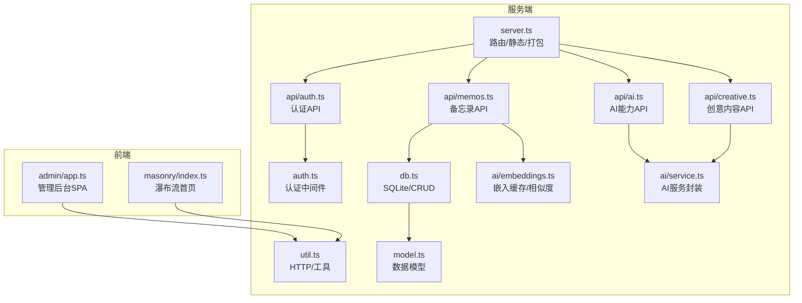
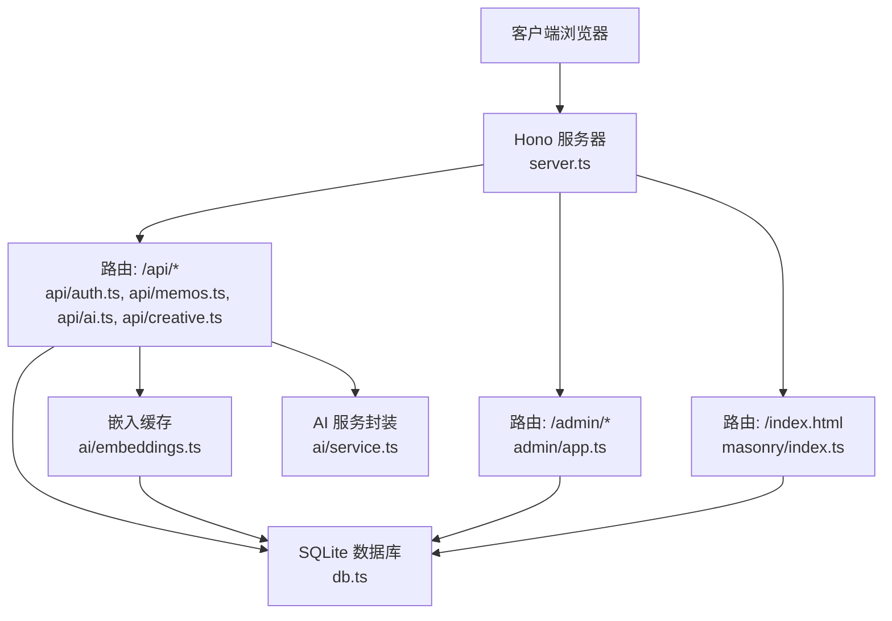
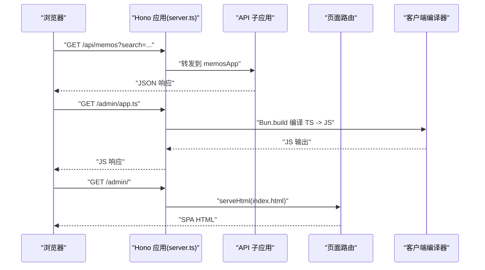
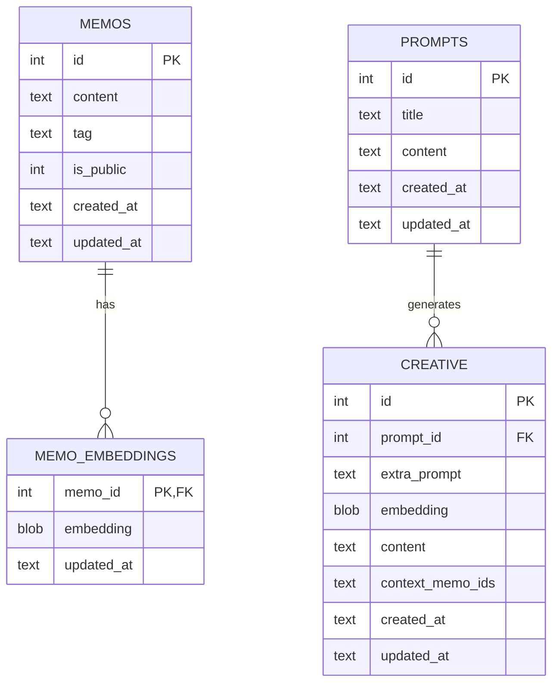
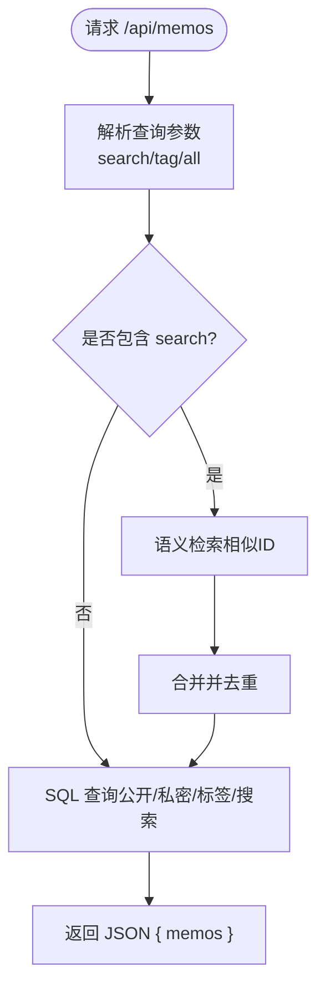
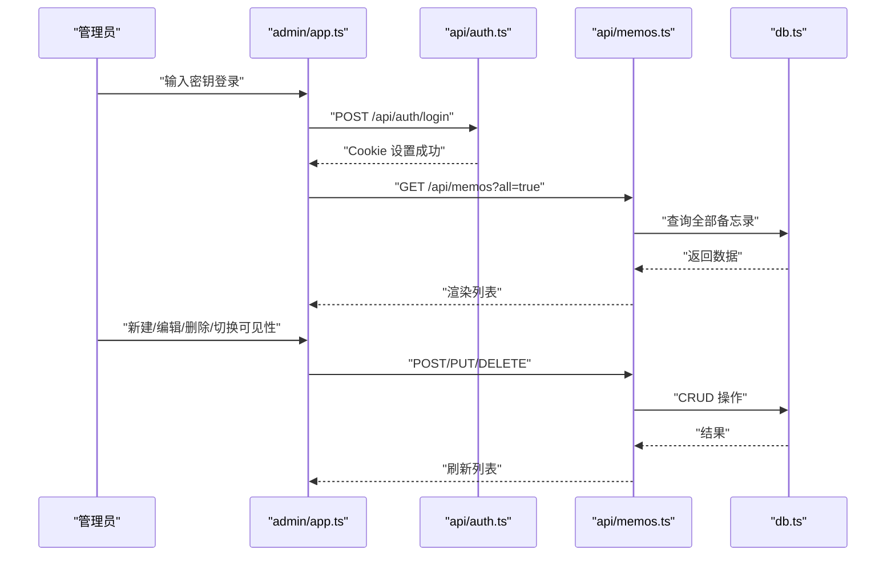
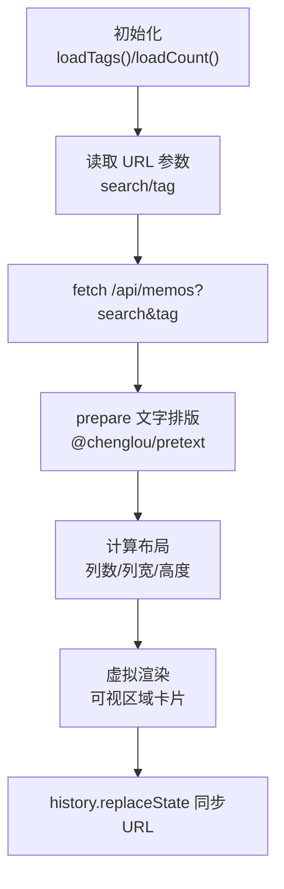
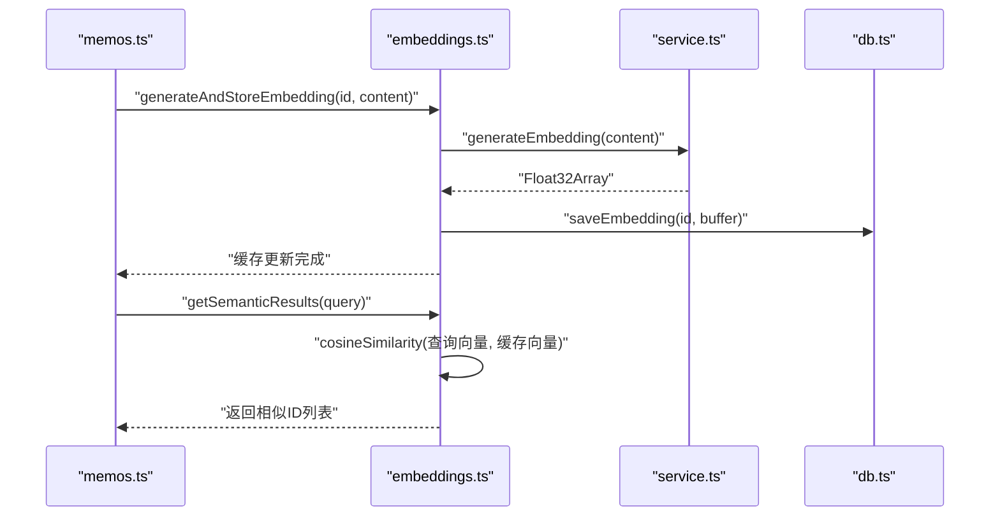
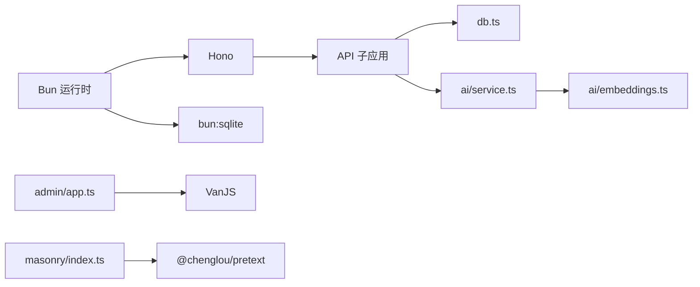

# 项目概述

<cite>
**本文引用的文件**
- [README.md](file://README.md)
- [package.json](file://package.json)
- [tsconfig.json](file://tsconfig.json)
- [src/server.ts](file://src/server.ts)
- [src/db.ts](file://src/db.ts)
- [src/model.ts](file://src/model.ts)
- [src/auth.ts](file://src/auth.ts)
- [src/api/auth.ts](file://src/api/auth.ts)
- [src/api/memos.ts](file://src/api/memos.ts)
- [src/api/ai.ts](file://src/api/ai.ts)
- [src/api/creative.ts](file://src/api/creative.ts)
- [src/admin/app.ts](file://src/admin/app.ts)
- [src/masonry/index.ts](file://src/masonry/index.ts)
- [src/util.ts](file://src/util.ts)
- [src/ai/embeddings.ts](file://src/ai/embeddings.ts)
- [src/ai/service.ts](file://src/ai/service.ts)
- [script/initMemos.ts](file://script/initMemos.ts)
</cite>

## 目录
1. [简介](#简介)
2. [项目结构](#项目结构)
3. [核心组件](#核心组件)
4. [架构总览](#架构总览)
5. [详细组件分析](#详细组件分析)
6. [依赖关系分析](#依赖关系分析)
7. [性能考量](#性能考量)
8. [故障排查指南](#故障排查指南)
9. [结论](#结论)
10. [附录](#附录)

## 简介
Memos 是一个基于 Bun 运行时构建的轻量级备忘录应用系统，强调“小而美”的设计哲学：以最少的依赖实现完整的备忘录管理能力，包括公开/私密备忘录、标签分类、全文搜索、瀑布流展示以及独立的管理后台。项目通过内置的 SQLite 数据库与 Bun 的高性能运行时，提供开箱即用的开发体验与生产可用的性能表现。

- 核心价值
  - 轻量无依赖：仅依赖 Bun 内置的 SQLite 与 HTTP 能力，前端使用 VanJS 和 @chenglou/pretext，避免复杂生态。
  - 易用性：提供直观的瀑布流首页与响应式的管理后台，支持密钥认证与 Cookie 会话。
  - 可扩展：内置 AI 能力（优化、标签建议、语义检索），通过环境变量即可启用。

- 设计理念
  - 单体服务：以单一进程承载 API、静态资源与页面路由，简化部署与运维。
  - 低耦合：API 层、数据层、认证层、AI 层职责清晰，便于演进与替换。
  - 本地优先：SQLite 本地文件数据库，无需外部服务；AI 能力可选开启。

- 主要功能特性
  - 备忘录管理：创建、编辑、删除、切换可见性（公开/私密）。
  - 标签分类：按标签筛选与展示，支持标签下拉选择。
  - 全文搜索：支持关键词 LIKE 搜索，结合语义相似度提升召回质量。
  - 瀑布流展示：基于 @chenglou/pretext 的精确排版与虚拟滚动，适配多列布局。
  - 管理后台：VanJS SPA，密钥认证，支持创建/编辑/删除/切换可见性。
  - AI 能力：内容优化、标签建议、向量嵌入与相似度检索（可选）。

**章节来源**
- [README.md:1-186](file://README.md#L1-L186)

## 项目结构
项目采用“按功能域分层 + 按职责拆分”的组织方式，核心目录如下：
- src：后端服务与前端页面源码
  - server.ts：主服务入口，路由注册、静态资源与页面路由、客户端打包缓存
  - db.ts：数据库初始化与 CRUD，包含 memos、memo_embeddings、prompts、creative 等表
  - model.ts：数据模型定义
  - auth.ts：认证中间件与 Cookie/Session 管理
  - api：子应用模块
    - auth.ts：认证 API（登录/登出/状态检查）
    - memos.ts：备忘录 API（CRUD + 标签 + 计数 + 语义检索）
    - ai.ts：AI 能力 API（优化、标签建议、状态查询）
    - creative.ts：创意内容生成 API（提示词、上下文、流式输出）
  - admin：管理后台 SPA（VanJS）
  - masonry：首页瀑布流（VanJS + @chenglou/pretext）
  - ai：AI 辅助模块（嵌入缓存、相似度计算、服务封装）
  - util.ts：HTTP 客户端与工具函数
- script：初始化脚本（从文本批量导入备忘录）
- package.json：Bun 脚本与依赖声明
- tsconfig.json：TypeScript 配置



**图表来源**
- [src/server.ts:1-127](file://src/server.ts#L1-L127)
- [src/api/auth.ts:1-54](file://src/api/auth.ts#L1-L54)
- [src/api/memos.ts:1-140](file://src/api/memos.ts#L1-L140)
- [src/api/ai.ts](file://src/api/ai.ts)
- [src/api/creative.ts](file://src/api/creative.ts)
- [src/db.ts:1-310](file://src/db.ts#L1-L310)
- [src/model.ts:1-28](file://src/model.ts#L1-L28)
- [src/auth.ts:1-74](file://src/auth.ts#L1-L74)
- [src/util.ts:1-43](file://src/util.ts#L1-L43)
- [src/ai/embeddings.ts:1-99](file://src/ai/embeddings.ts#L1-L99)
- [src/ai/service.ts:1-284](file://src/ai/service.ts#L1-L284)
- [src/admin/app.ts:1-677](file://src/admin/app.ts#L1-L677)
- [src/masonry/index.ts:1-391](file://src/masonry/index.ts#L1-L391)

**章节来源**
- [README.md:25-46](file://README.md#L25-L46)
- [package.json:1-22](file://package.json#L1-L22)

## 核心组件
- 服务入口与路由
  - server.ts 注册 API 子应用与静态页面路由，提供 /admin 与 / 瀑布流页面，内置客户端 TS 到 JS 的按需构建与缓存。
- 数据层
  - db.ts 提供 SQLite 初始化、表结构（memos、memo_embeddings、prompts、creative）、CRUD 与统计查询，统一映射为模型对象。
- 认证与会话
  - auth.ts 实现内存会话存储与 Cookie 管理，api/auth.ts 提供登录/登出/状态检查，支持密钥校验。
- API 子应用
  - memos.ts：支持搜索、标签筛选、计数、CRUD；创建/更新时异步生成或更新嵌入向量；查询时融合语义检索结果。
  - ai.ts：提供 AI 能力状态查询、内容优化、标签建议。
  - creative.ts：创意内容生成与流式输出。
- 前端组件
  - admin/app.ts：VanJS SPA，密钥登录、备忘录增删改、切换可见性、时间线侧边栏、AI 工具集成。
  - masonry/index.ts：@chenglou/pretext 文字预排版，瀑布流布局、虚拟滚动、搜索栏与 URL 同步。
- AI 能力
  - embeddings.ts：向量缓存、余弦相似度、语义检索；service.ts：DeepSeek 与 DashScope API 封装，支持内容优化、标签建议、嵌入生成与创意内容生成（含流式）。

**章节来源**
- [src/server.ts:74-127](file://src/server.ts#L74-L127)
- [src/db.ts:15-57](file://src/db.ts#L15-L57)
- [src/auth.ts:28-74](file://src/auth.ts#L28-L74)
- [src/api/memos.ts:20-140](file://src/api/memos.ts#L20-L140)
- [src/admin/app.ts:38-170](file://src/admin/app.ts#L38-L170)
- [src/masonry/index.ts:146-351](file://src/masonry/index.ts#L146-L351)
- [src/ai/embeddings.ts:12-99](file://src/ai/embeddings.ts#L12-L99)
- [src/ai/service.ts:10-284](file://src/ai/service.ts#L10-L284)

## 架构总览
Memos 采用“单体服务 + 分层职责”的架构，前后端通过 REST API 交互，数据持久化使用 SQLite，AI 能力可选启用。



**图表来源**
- [src/server.ts:74-127](file://src/server.ts#L74-L127)
- [src/api/auth.ts:22-54](file://src/api/auth.ts#L22-L54)
- [src/api/memos.ts:18-140](file://src/api/memos.ts#L18-L140)
- [src/api/ai.ts](file://src/api/ai.ts)
- [src/api/creative.ts](file://src/api/creative.ts)
- [src/admin/app.ts:1-677](file://src/admin/app.ts#L1-L677)
- [src/masonry/index.ts:1-391](file://src/masonry/index.ts#L1-L391)
- [src/db.ts:15-57](file://src/db.ts#L15-L57)
- [src/ai/embeddings.ts:12-99](file://src/ai/embeddings.ts#L12-L99)
- [src/ai/service.ts:10-284](file://src/ai/service.ts#L10-L284)

## 详细组件分析

### 服务入口与路由（server.ts）
- 责任边界
  - 路由注册：/api/* 子应用挂载，/admin/* SPA 与 /index.html 首页。
  - 静态资源：HTML 与 TS 源文件按需编译为 JS，带 mtime 缓存。
  - 服务启动：Bun.serve 统一入口。
- 关键流程
  - 客户端请求进入 Hono，根据路径匹配到对应处理器。
  - 对于 /admin/app.ts 与 /index.ts，调用 buildClientJs 进行编译并缓存。
  - 未命中路由时，对 /admin/ 返回 SPA，其他 .ts 文件走编译，否则 404。



**图表来源**
- [src/server.ts:74-127](file://src/server.ts#L74-L127)
- [src/api/memos.ts:18-140](file://src/api/memos.ts#L18-L140)
- [src/admin/app.ts:1-677](file://src/admin/app.ts#L1-L677)

**章节来源**
- [src/server.ts:15-127](file://src/server.ts#L15-L127)

### 数据层（db.ts 与 model.ts）
- 数据模型
  - Memo：id、content、tag、is_public、created_at、updated_at
  - Prompt：id、title、content、created_at、updated_at
  - CreativeItem：id、prompt_id、extra_prompt、embedding、content、context_memo_ids、created_at、updated_at
- 数据库初始化
  - memos 表：主表，支持公开/私密字段与标签。
  - memo_embeddings 表：保存向量嵌入，用于语义检索。
  - prompts 与 creative 表：支持创意内容生成与上下文关联。
- 查询与操作
  - 支持按条件组合查询（公开/私密、搜索、标签、指定 ID 列表）。
  - 提供计数、标签去重、CRUD 与嵌入管理。



**图表来源**
- [src/db.ts:17-56](file://src/db.ts#L17-L56)
- [src/model.ts:1-28](file://src/model.ts#L1-L28)

**章节来源**
- [src/db.ts:15-310](file://src/db.ts#L15-L310)
- [src/model.ts:1-28](file://src/model.ts#L1-L28)

### 认证与会话（auth.ts 与 api/auth.ts）
- 机制
  - 内存会话：Set 存储 token，服务重启即失效。
  - Cookie：HttpOnly + SameSite=Strict，有效期 24 小时。
  - 密钥认证：登录时校验密钥，成功后设置 Cookie 并创建会话。
- 中间件
  - requireAuth：未认证返回 401。
  - authMiddleware：在需要鉴权的 API 上使用。

```mermaid
sequenceDiagram
participant U as "用户"
participant A as "api/auth.ts"
participant AU as "auth.ts"
participant S as "server.ts"
U->>A : "POST /api/auth/login {key}"
A->>AU : "校验密钥"
AU-->>A : "生成 token"
A->>U : "Set-Cookie : memos_token=...; HttpOnly; SameSite=Strict"
U->>A : "GET /api/memos (携带 Cookie)"
A->>AU : "requireAuth"
AU-->>A : "认证通过"
A-->>U : "返回数据"
```

**图表来源**
- [src/api/auth.ts:24-54](file://src/api/auth.ts#L24-L54)
- [src/auth.ts:28-74](file://src/auth.ts#L28-L74)
- [src/server.ts:74-127](file://src/server.ts#L74-L127)

**章节来源**
- [src/auth.ts:1-74](file://src/auth.ts#L1-L74)
- [src/api/auth.ts:1-54](file://src/api/auth.ts#L1-L54)

### 备忘录 API（api/memos.ts）
- 查询
  - 支持 search、tag、all 参数；默认仅返回公开备忘录，当 all=true 且已认证时返回全部。
  - 非阻塞地执行语义检索，合并结果并去重。
- 写入
  - 创建/更新时触发嵌入向量生成或更新；删除时清理缓存。
- 计数与标签
  - 提供总数统计与标签列表。



**图表来源**
- [src/api/memos.ts:20-48](file://src/api/memos.ts#L20-L48)
- [src/db.ts:70-102](file://src/db.ts#L70-L102)
- [src/ai/embeddings.ts:66-86](file://src/ai/embeddings.ts#L66-L86)

**章节来源**
- [src/api/memos.ts:1-140](file://src/api/memos.ts#L1-L140)
- [src/db.ts:70-119](file://src/db.ts#L70-L119)

### 管理后台（admin/app.ts）
- 功能
  - 登录/登出：密钥认证，Cookie 管理。
  - 备忘录管理：创建、编辑、删除、切换可见性。
  - 时间线侧边栏：按年月分组，支持展开/折叠与跳转。
  - AI 集成：内容优化、标签建议、状态检测。
- 交互
  - 使用 VanJS 响应式状态驱动 UI，调用 util.api 发送请求。
  - 加载全部备忘录（含私密），支持分页与错误提示。



**图表来源**
- [src/admin/app.ts:39-170](file://src/admin/app.ts#L39-L170)
- [src/api/auth.ts:24-54](file://src/api/auth.ts#L24-L54)
- [src/api/memos.ts:63-140](file://src/api/memos.ts#L63-L140)
- [src/db.ts:127-164](file://src/db.ts#L127-L164)

**章节来源**
- [src/admin/app.ts:1-677](file://src/admin/app.ts#L1-L677)

### 首页瀑布流（masonry/index.ts）
- 特性
  - @chenglou/pretext 文字预排版，精确计算卡片高度。
  - 自适应列数：窄屏单列，宽屏多列；最大列宽限制。
  - 虚拟滚动：只渲染可视区域卡片，滚动时回收/创建节点。
  - 搜索栏与标签下拉：支持关键词搜索与标签筛选，URL 同步。
- 流程
  - 初始化加载标签与计数，从 URL 读取初始状态。
  - 输入防抖触发查询，更新卡片与 URL。



**图表来源**
- [src/masonry/index.ts:272-351](file://src/masonry/index.ts#L272-L351)
- [src/masonry/index.ts:146-269](file://src/masonry/index.ts#L146-L269)

**章节来源**
- [src/masonry/index.ts:1-391](file://src/masonry/index.ts#L1-L391)

### AI 能力（ai/service.ts 与 ai/embeddings.ts）
- 能力矩阵
  - DeepSeek：内容优化、标签建议、创意内容生成（含流式）。
  - DashScope：向量嵌入生成。
- 嵌入缓存与相似度
  - 内存缓存 memo_id -> Float32Array，支持余弦相似度计算与阈值过滤。
  - 启动时从数据库加载已有嵌入，按需生成与持久化。



**图表来源**
- [src/api/memos.ts:30-45](file://src/api/memos.ts#L30-L45)
- [src/ai/embeddings.ts:88-99](file://src/ai/embeddings.ts#L88-L99)
- [src/ai/embeddings.ts:66-86](file://src/ai/embeddings.ts#L66-L86)
- [src/ai/service.ts:144-177](file://src/ai/service.ts#L144-L177)
- [src/db.ts:167-190](file://src/db.ts#L167-L190)

**章节来源**
- [src/ai/service.ts:10-284](file://src/ai/service.ts#L10-L284)
- [src/ai/embeddings.ts:1-99](file://src/ai/embeddings.ts#L1-L99)

## 依赖关系分析
- 运行时与构建
  - Bun：运行时、HTTP 服务器、SQLite、Bun.build 按需编译。
  - Hono：轻量 Web 框架，路由与中间件。
- 前端框架
  - VanJS：管理后台 SPA，响应式状态与组件化。
  - @chenglou/pretext：首页文字预排版与精确高度计算。
- 数据与 AI
  - SQLite：本地数据库，WAL 模式。
  - DeepSeek/DashScope：可选 AI 能力，OpenAI 兼容格式。



**图表来源**
- [package.json:16-20](file://package.json#L16-L20)
- [src/server.ts:1-127](file://src/server.ts#L1-L127)
- [src/db.ts:1-310](file://src/db.ts#L1-L310)
- [src/ai/service.ts:1-284](file://src/ai/service.ts#L1-L284)
- [src/ai/embeddings.ts:1-99](file://src/ai/embeddings.ts#L1-L99)

**章节来源**
- [package.json:1-22](file://package.json#L1-L22)
- [README.md:14-24](file://README.md#L14-L24)

## 性能考量
- 启动与编译
  - 客户端 TS 按需编译并缓存 mtime，减少重复构建开销。
- 数据访问
  - SQLite WAL 模式提升并发读写性能；查询使用参数化绑定，避免注入风险。
- 前端渲染
  - 瀑布流采用虚拟滚动，仅渲染可视区域卡片，降低 DOM 数量与重绘成本。
  - @chenglou/pretext 文字预排版，避免多次测量与布局抖动。
- AI 能力
  - 嵌入向量缓存在内存中，余弦相似度计算简单高效；阈值过滤减少无效比较。
  - 生成类操作（优化、标签建议、创意内容）为异步 fire-and-forget，不影响主流程。

[本节为通用性能讨论，不直接分析具体文件]

## 故障排查指南
- 无法访问管理后台
  - 检查密钥是否正确（默认密钥可在环境变量中配置）。
  - 确认 Cookie 是否被设置且未过期。
- 备忘录搜索无结果
  - 确认是否启用了语义检索（DashScope API Key）。
  - 检查搜索关键词长度与标签下拉是否正确。
- 瀑布流渲染异常
  - 查看控制台是否有 fetch 错误或布局异常日志。
  - 确认 URL 参数是否正确同步。
- 初始化脚本导入失败
  - 检查 memos.txt 是否存在且编码正确。
  - 查看控制台输出的错误统计信息。

**章节来源**
- [src/api/auth.ts:11-20](file://src/api/auth.ts#L11-L20)
- [src/masonry/index.ts:347-351](file://src/masonry/index.ts#L347-L351)
- [script/initMemos.ts:12-62](file://script/initMemos.ts#L12-L62)

## 结论
Memos 以 Bun 为核心，结合 SQLite 与 VanJS/@chenglou/pretext，构建了一个“轻量、易用、可扩展”的备忘录系统。其单体服务架构降低了部署复杂度，分层职责确保了可维护性；内置的 AI 能力与语义检索进一步提升了用户体验。对于初学者，项目提供了清晰的入口与最小依赖；对于有经验的开发者，其可插拔的模块化设计与简洁的数据流便于二次开发与定制。

[本节为总结性内容，不直接分析具体文件]

## 附录
- 快速开始
  - 安装依赖：bun install
  - 启动服务：bun run dev 或 bun run start
  - 访问：首页 http://localhost:3020，管理后台 http://localhost:3020/admin
- 环境变量
  - PORT：服务器端口，默认 3020
  - MEMOS_SECRET_KEY：管理后台密钥，默认开发测试值
  - DEEPSEEK_API_KEY / DEEPSEEK_BASE_URL：内容优化/标签建议/创意内容
  - DASHSCOPE_API_KEY：向量嵌入

**章节来源**
- [README.md:47-87](file://README.md#L47-L87)
- [README.md:59-65](file://README.md#L59-L65)