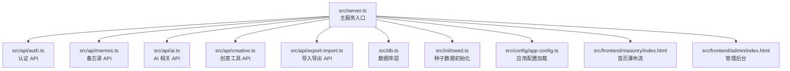
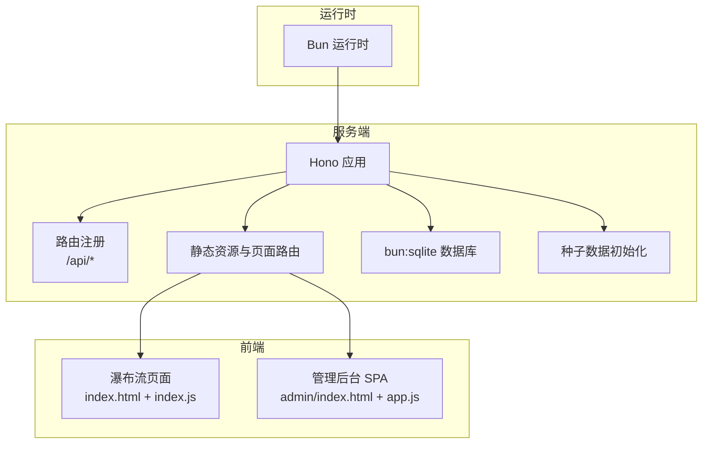

# 快速开始

<cite>
**本文引用的文件**
- [README.md](file://README.md)
- [package.json](file://package.json)
- [src/server.ts](file://src/server.ts)
- [src/db.ts](file://src/db.ts)
- [src/init/seed.ts](file://src/init/seed.ts)
- [src/api/auth.ts](file://src/api/auth.ts)
- [src/api/memos.ts](file://src/api/memos.ts)
- [src/config/app-config.ts](file://src/config/app-config.ts)
- [app.config.json](file://app.config.json)
- [ai.config.json](file://ai.config.json)
- [src/frontend/admin/index.html](file://src/frontend/admin/index.html)
- [src/frontend/masonry/index.html](file://src/frontend/masonry/index.html)
</cite>

## 目录
1. [简介](#简介)
2. [项目结构](#项目结构)
3. [核心组件](#核心组件)
4. [架构总览](#架构总览)
5. [详细组件分析](#详细组件分析)
6. [依赖分析](#依赖分析)
7. [性能考虑](#性能考虑)
8. [故障排除指南](#故障排除指南)
9. [结论](#结论)
10. [附录](#附录)

## 简介
Memos 是一个基于 Bun 运行时的轻量级备忘录应用系统，支持公开/私密备忘录管理、标签分类、全文搜索、瀑布流展示界面以及独立的管理后台。项目使用 SQLite（bun:sqlite，WAL 模式）作为本地数据库，前端首页采用 @chenglou/pretext 进行文字排版，管理后台采用 VanJS 构建。

- 支持功能：备忘录 CRUD、标签筛选、全文搜索、瀑布流布局、管理后台、Cookie+内存会话认证
- 运行时：Bun（>= 1.3.3）
- 数据库：SQLite（WAL 模式）
- 前端：Pretext（首页）、VanJS（管理后台）

**章节来源**
- [README.md:1-186](file://README.md#L1-L186)

## 项目结构
项目采用“源码在 src 下”的组织方式，主要模块包括：
- 服务端入口与路由：src/server.ts
- 数据库层：src/db.ts
- 种子数据初始化：src/init/seed.ts
- API 子应用：src/api/{auth, memos, ai, creative, export-import}
- 配置加载：src/config/app-config.ts
- 前端页面：src/frontend/{masonry, admin}

**图表来源**
- [src/server.ts:1-125](file://src/server.ts#L1-L125)
- [src/db.ts:1-484](file://src/db.ts#L1-L484)
- [src/init/seed.ts:1-118](file://src/init/seed.ts#L1-L118)
- [src/api/auth.ts:1-77](file://src/api/auth.ts#L1-L77)
- [src/api/memos.ts:1-220](file://src/api/memos.ts#L1-L220)
- [src/config/app-config.ts:1-108](file://src/config/app-config.ts#L1-L108)
- [src/frontend/masonry/index.html:1-427](file://src/frontend/masonry/index.html#L1-L427)
- [src/frontend/admin/index.html:1-1076](file://src/frontend/admin/index.html#L1-L1076)

**章节来源**
- [README.md:25-46](file://README.md#L25-L46)

## 核心组件
- 服务端入口与路由：负责挂载 API 子应用、提供静态资源与页面、初始化数据库与种子数据、启动 HTTP 服务
- 数据库层：封装 SQLite 表结构、索引、CRUD、嵌入向量、提示词与创意内容管理
- 种子数据：首次启动自动导入内置提示词与示例备忘录
- 认证与会话：基于 Cookie 的内存会话，登录密钥通过环境变量控制
- 应用配置：从 app.config.json 加载并提供默认回退值
- 前端页面：首页瀑布流与管理后台 SPA

**章节来源**
- [src/server.ts:11-125](file://src/server.ts#L11-L125)
- [src/db.ts:15-61](file://src/db.ts#L15-L61)
- [src/init/seed.ts:112-118](file://src/init/seed.ts#L112-L118)
- [src/api/auth.ts:14-27](file://src/api/auth.ts#L14-L27)
- [src/config/app-config.ts:57-107](file://src/config/app-config.ts#L57-L107)

## 架构总览
Memos 使用 Hono 作为 Web 框架，Bun.serve 提供 HTTP 服务；数据库通过 bun:sqlite 访问；前端页面通过预构建的 ES 模块资源提供。

**图表来源**
- [src/server.ts:38-125](file://src/server.ts#L38-L125)
- [src/db.ts:1-13](file://src/db.ts#L1-L13)
- [src/init/seed.ts:112-118](file://src/init/seed.ts#L112-L118)
- [src/frontend/masonry/index.html:1-427](file://src/frontend/masonry/index.html#L1-L427)
- [src/frontend/admin/index.html:1-1076](file://src/frontend/admin/index.html#L1-L1076)

## 详细组件分析

### 安装与环境准备
- 环境要求：Bun >= 1.3.3
- 安装依赖：执行包管理安装命令
- 环境变量（可选）：
  - PORT：服务器监听端口，默认 3020
  - MEMOS_SECRET_KEY：管理员登录密钥，默认 123（生产环境必须设置）

**章节来源**
- [README.md:49-81](file://README.md#L49-L81)

### 数据库初始化
- 首次启动自动创建 SQLite 数据库文件与表结构
- 表结构包含 memos、memo_embeddings、prompts、creative
- WAL 模式与外键约束开启

**章节来源**
- [README.md:66-72](file://README.md#L66-L72)
- [src/db.ts:15-61](file://src/db.ts#L15-L61)

### 启动方式与访问
- 开发模式：启用热重载
- 生产模式：先构建前端资源，再启动服务
- 访问地址：
  - 首页（瀑布流）：http://localhost:3020
  - 管理后台：http://localhost:3020/admin

**章节来源**
- [README.md:73-87](file://README.md#L73-L87)
- [package.json:6-12](file://package.json#L6-L12)

### 认证与密钥
- 管理后台登录密钥默认 123，可通过 MEMOS_SECRET_KEY 环境变量修改
- 生产环境未设置密钥时会直接退出进程，避免不安全配置

**章节来源**
- [README.md:88-91](file://README.md#L88-L91)
- [src/api/auth.ts:14-27](file://src/api/auth.ts#L14-L27)

### API 接口概览
- 认证相关：检查登录状态、登录、登出
- 备忘录相关：分页获取、计数、相似检索、标签查询、创建/更新/删除、置顶/取消置顶
- 所有 API 路径前缀为 /api，部分接口需要携带 Cookie

**章节来源**
- [README.md:100-129](file://README.md#L100-L129)
- [src/api/memos.ts:28-220](file://src/api/memos.ts#L28-L220)

### 应用配置
- 从 app.config.json 读取配置，包含 AI 请求超时、默认最大令牌数、默认温度、相似度阈值、重排序策略、速率限制等
- 若配置文件缺失或无效，使用硬编码默认值

**章节来源**
- [src/config/app-config.ts:57-107](file://src/config/app-config.ts#L57-L107)
- [app.config.json:1-22](file://app.config.json#L1-L22)

### AI 配置
- 提供多个大模型提供商（DeepSeek、Kimi、GLM、DashScope），支持指定默认提供商与模型
- 通过环境变量注入 API Key

**章节来源**
- [ai.config.json:1-44](file://ai.config.json#L1-L44)

### 前端页面
- 首页瀑布流：支持搜索、标签筛选、URL 同步、虚拟滚动
- 管理后台：密钥登录、备忘录增删改、标签管理、置顶切换、导入导出

**章节来源**
- [src/frontend/masonry/index.html:1-427](file://src/frontend/masonry/index.html#L1-L427)
- [src/frontend/admin/index.html:1-1076](file://src/frontend/admin/index.html#L1-L1076)

## 依赖分析
- 运行时：Bun
- Web 框架：Hono
- 前端排版：@chenglou/pretext
- 响应式 UI：vanjs-core
- Markdown 渲染：marked
- DOM 净化：dompurify
- 类型支持：@types/bun（开发依赖）

**章节来源**
- [README.md:14-24](file://README.md#L14-L24)
- [package.json:13-26](file://package.json#L13-L26)

## 性能考虑
- 首次启动会生成并缓存向量嵌入，提升语义搜索性能
- 瀑布流布局采用虚拟滚动，仅渲染可视区域卡片
- SQLite 使用 WAL 模式，提高并发读写性能
- 速率限制与登录尝试限制，防止滥用

**章节来源**
- [src/server.ts:115-116](file://src/server.ts#L115-L116)
- [src/frontend/masonry/index.html:1-427](file://src/frontend/masonry/index.html#L1-L427)
- [src/db.ts:8-10](file://src/db.ts#L8-L10)
- [src/api/memos.ts:104-144](file://src/api/memos.ts#L104-L144)
- [src/api/auth.ts:37-68](file://src/api/auth.ts#L37-L68)

## 故障排除指南
- 启动后无法访问
  - 检查端口占用与防火墙设置
  - 确认环境变量 PORT 是否被正确设置
- 管理后台无法登录
  - 确认 MEMOS_SECRET_KEY 是否设置且与登录请求一致
  - 生产环境必须设置密钥，否则会直接退出
- 数据库异常
  - 确保 SQLite 文件权限正常
  - 首次启动会自动创建数据库与表，若失败请检查磁盘空间与权限
- 前端资源 404
  - 生产模式需先执行构建脚本，确保 dist 目录存在对应资源
- 语义搜索无效
  - 确认已生成并缓存嵌入向量，检查日志中是否有错误

**章节来源**
- [README.md:49-87](file://README.md#L49-L87)
- [src/api/auth.ts:17-27](file://src/api/auth.ts#L17-L27)
- [src/server.ts:115-116](file://src/server.ts#L115-L116)

## 结论
Memos 提供了开箱即用的备忘录管理能力，结合 SQLite 与 Bun 的高性能特性，适合个人与小团队使用。通过合理的环境变量配置与构建流程，可在开发与生产环境中快速部署并稳定运行。

## 附录

### 快速开始步骤
- 环境要求：Bun >= 1.3.3
- 安装依赖：执行安装命令
- 设置环境变量（可选）：PORT、MEMOS_SECRET_KEY
- 初始化数据库：首次启动自动创建
- 启动服务：
  - 开发模式：启用热重载
  - 生产模式：先构建前端资源，再启动服务
- 访问：
  - 首页：http://localhost:3020
  - 管理后台：http://localhost:3020/admin

**章节来源**
- [README.md:49-87](file://README.md#L49-L87)
- [package.json:6-12](file://package.json#L6-L12)

### 默认配置与常用项
- 端口：PORT，默认 3020
- 管理密钥：MEMOS_SECRET_KEY，默认 123（生产必须修改）
- 应用配置：app.config.json 中的 AI、嵌入、重排序、速率限制等
- AI 配置：ai.config.json 中的提供商、默认模型与 API Key 环境变量

**章节来源**
- [README.md:59-65](file://README.md#L59-L65)
- [src/config/app-config.ts:57-107](file://src/config/app-config.ts#L57-L107)
- [ai.config.json:1-44](file://ai.config.json#L1-L44)