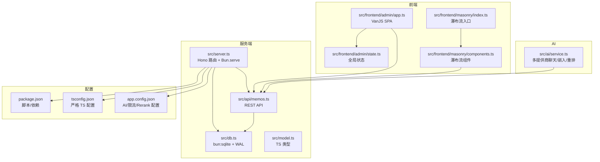
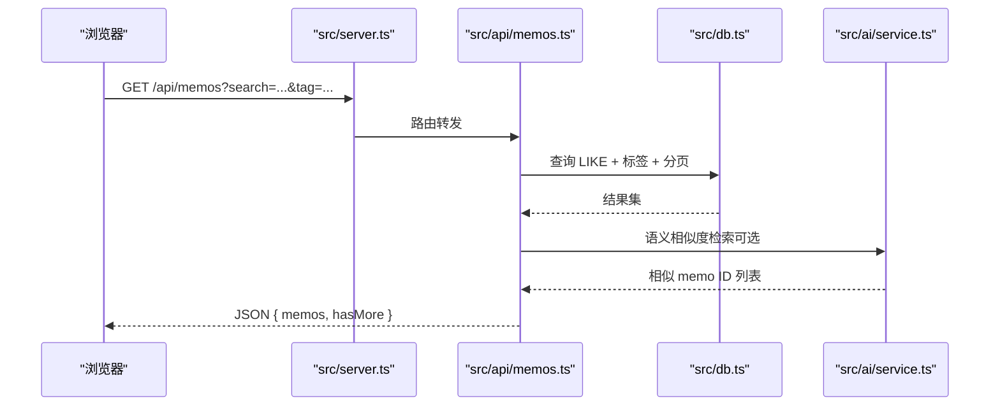
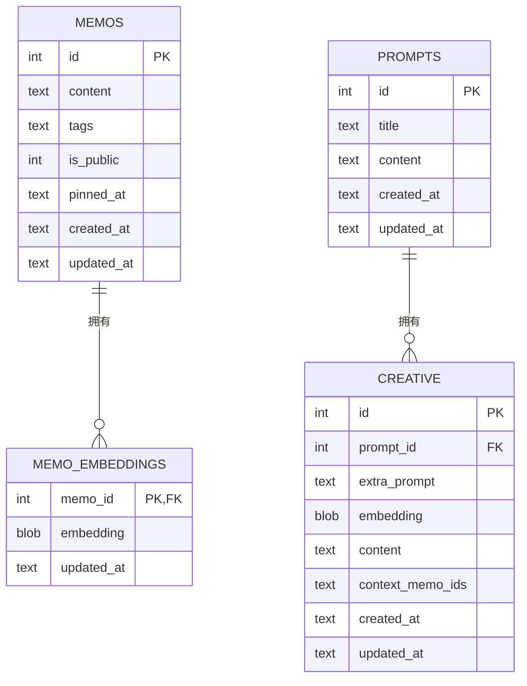
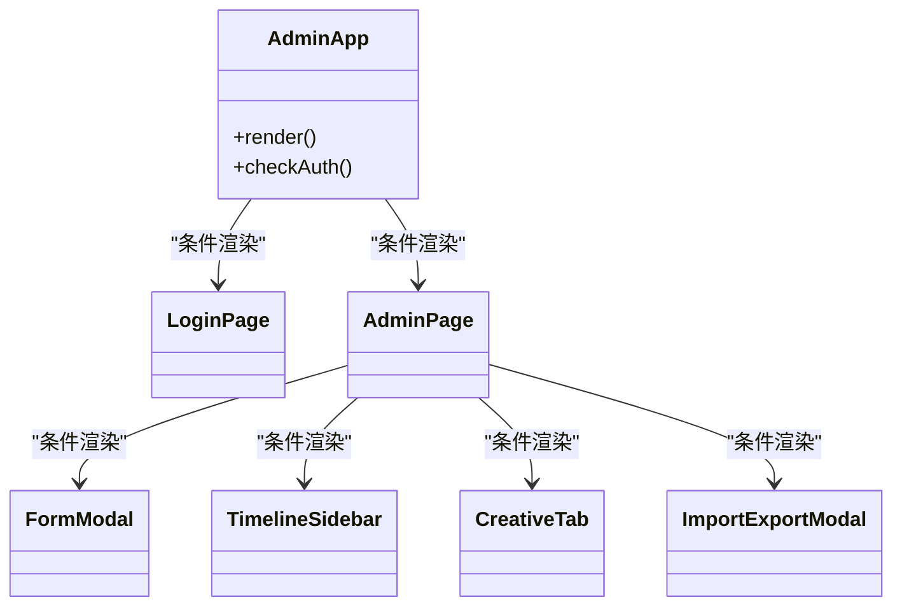
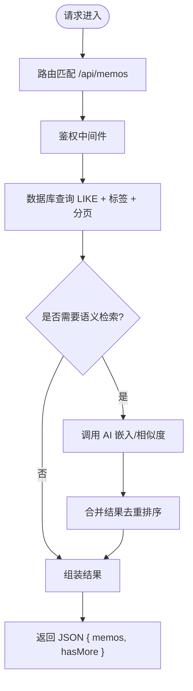
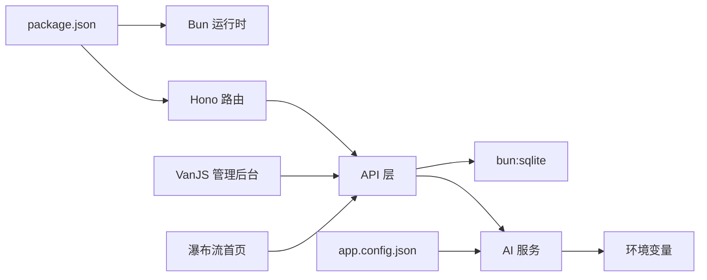

# 技术栈

<cite>
**本文引用的文件**
- [README.md](file://README.md)
- [package.json](file://package.json)
- [tsconfig.json](file://tsconfig.json)
- [src/server.ts](file://src/server.ts)
- [src/db.ts](file://src/db.ts)
- [src/model.ts](file://src/model.ts)
- [src/api/memos.ts](file://src/api/memos.ts)
- [src/frontend/admin/app.ts](file://src/frontend/admin/app.ts)
- [src/frontend/admin/state.ts](file://src/frontend/admin/state.ts)
- [src/frontend/masonry/index.ts](file://src/frontend/masonry/index.ts)
- [src/frontend/masonry/components.ts](file://src/frontend/masonry/components.ts)
- [src/ai/service.ts](file://src/ai/service.ts)
- [docs/vanjs.md](file://docs/vanjs.md)
- [app.config.json](file://app.config.json)
</cite>

## 目录
1. [引言](#引言)
2. [项目结构](#项目结构)
3. [核心组件](#核心组件)
4. [架构总览](#架构总览)
5. [详细组件分析](#详细组件分析)
6. [依赖关系分析](#依赖关系分析)
7. [性能考量](#性能考量)
8. [故障排查指南](#故障排查指南)
9. [结论](#结论)
10. [附录](#附录)

## 引言
本技术栈文档围绕 Memos 项目的整体技术选型与实现进行系统化梳理，重点覆盖以下方面：
- 运行时：Bun 的高性能与内置能力（HTTP 服务器、SQLite、构建工具）
- 数据层：SQLite（bun:sqlite）与 WAL 模式、JSON 列与全文检索结合
- 前端：VanJS 响应式 UI 与瀑布流首页（Pretext 文字排版）的协同
- AI 能力：多提供商 OpenAI 兼容接口、DashScope 嵌入与重排
- 架构：前后端分离、API 设计、数据流转与状态管理
- 版本与升级：环境要求、配置项与兼容性建议

## 项目结构
Memos 采用“服务端直编译 + 前端 SPA”的混合架构：
- 服务端：Hono 路由 + Bun 内置 HTTP 服务器 + bun:sqlite
- 前端：VanJS 管理后台 SPA；瀑布流首页采用原生 DOM + Pretext 文字排版
- 构建：Bun build 将前端源码打包为 ESM 资产，服务端按需提供

图表来源
- [src/server.ts:1-125](file://src/server.ts#L1-L125)
- [src/db.ts:1-484](file://src/db.ts#L1-L484)
- [src/api/memos.ts:1-220](file://src/api/memos.ts#L1-L220)
- [src/frontend/admin/app.ts:1-251](file://src/frontend/admin/app.ts#L1-L251)
- [src/frontend/admin/state.ts:1-178](file://src/frontend/admin/state.ts#L1-L178)
- [src/frontend/masonry/index.ts:1-23](file://src/frontend/masonry/index.ts#L1-L23)
- [src/frontend/masonry/components.ts:1-337](file://src/frontend/masonry/components.ts#L1-L337)
- [src/ai/service.ts:1-507](file://src/ai/service.ts#L1-L507)
- [package.json:1-26](file://package.json#L1-L26)
- [tsconfig.json:1-30](file://tsconfig.json#L1-L30)
- [app.config.json:1-22](file://app.config.json#L1-L22)

章节来源
- [README.md:25-45](file://README.md#L25-L45)
- [src/server.ts:1-125](file://src/server.ts#L1-L125)
- [package.json:1-26](file://package.json#L1-L26)

## 核心组件
- 运行时与服务器
  - 使用 Bun 作为运行时，内置 HTTP 服务器与 SQLite 支持，无需额外依赖
  - 通过 Hono 组织路由，按需构建前端产物并提供静态资源
- 数据层
  - SQLite（bun:sqlite）+ WAL 模式，开启外键约束，支持 JSON 列存储标签数组
  - 提供备忘录、嵌入向量、提示词、创意内容等多表模型
- 前端
  - 管理后台：VanJS SPA，集中式状态管理，组件化 UI
  - 首页瀑布流：原生 DOM + Pretext 文字排版，实现精确卡片高度与虚拟滚动
- AI 能力
  - 多提供商 OpenAI 兼容聊天接口，支持流式输出
  - DashScope 嵌入与重排，支持语义相似度检索与结果重排
- API 设计
  - RESTful 接口，鉴权中间件，速率限制，分页与搜索
- 配置与构建
  - package.json 脚本负责开发/生产构建与启动
  - tsconfig.json 采用严格 TS 配置，支持 bundler 模式

章节来源
- [README.md:14-24](file://README.md#L14-L24)
- [src/server.ts:1-125](file://src/server.ts#L1-L125)
- [src/db.ts:1-484](file://src/db.ts#L1-L484)
- [src/api/memos.ts:1-220](file://src/api/memos.ts#L1-L220)
- [src/frontend/admin/app.ts:1-251](file://src/frontend/admin/app.ts#L1-L251)
- [src/frontend/masonry/index.ts:1-23](file://src/frontend/masonry/index.ts#L1-L23)
- [src/ai/service.ts:1-507](file://src/ai/service.ts#L1-L507)
- [package.json:1-26](file://package.json#L1-L26)
- [tsconfig.json:1-30](file://tsconfig.json#L1-L30)

## 架构总览
Memos 采用“服务端直编译 + 前端 SPA”的轻量架构：
- 服务端负责路由、静态资源、API、数据库与 AI 能力
- 前端通过 REST API 与 SSE 获取数据，VanJS 管理状态，Pretext 文字排版保障首页视觉质量
- 数据库采用 SQLite，WAL 模式提升并发写入性能，JSON 列支持灵活标签存储

图表来源
- [src/server.ts:38-107](file://src/server.ts#L38-L107)
- [src/api/memos.ts:28-70](file://src/api/memos.ts#L28-L70)
- [src/db.ts:122-169](file://src/db.ts#L122-L169)
- [src/ai/service.ts:1-507](file://src/ai/service.ts#L1-L507)

## 详细组件分析

### 运行时与服务器（Bun + Hono）
- 服务器启动与路由
  - 通过 Bun.serve 提供 HTTP 服务，挂载 Hono 应用
  - 静态资源与 SPA 路由：favicon、/admin/*、/index.js、/index.html 等
- 构建与部署
  - package.json 脚本：dev/watch、build:masonry/build:admin、start
  - 生产模式先构建前端，再启动服务端

章节来源
- [src/server.ts:11-125](file://src/server.ts#L11-L125)
- [package.json:6-12](file://package.json#L6-L12)

### 数据层（SQLite + bun:sqlite）
- 初始化与模式
  - WAL 模式、外键约束、索引（pinned_at）
  - 多表：memos、memo_embeddings、prompts、creative
- 查询与聚合
  - LIKE 全文匹配 + JSON 列标签查询 + 分页
  - 支持按 pinned_at、created_at 排序
- 嵌入与创意
  - 嵌入向量表与 memos 关联，支持增删改时的向量缓存维护
  - 创意内容表支持提示词、上下文 memo ids、时间戳

图表来源
- [src/db.ts:18-61](file://src/db.ts#L18-L61)
- [src/db.ts:252-276](file://src/db.ts#L252-L276)
- [src/db.ts:279-337](file://src/db.ts#L279-L337)
- [src/db.ts:339-403](file://src/db.ts#L339-L403)

章节来源
- [src/db.ts:1-484](file://src/db.ts#L1-L484)
- [src/model.ts:1-35](file://src/model.ts#L1-L35)

### 前端：VanJS 管理后台
- 状态管理
  - 全局状态集中导出，跨组件共享（认证、加载、表单、AI、导入导出等）
  - 使用可辨识联合类型保证表单模式安全
- 组件化
  - 登录页、顶部栏、侧边时间线、表单模态、导入导出模态、创意标签云等
- 事件与交互
  - 表单输入绑定、键盘事件、模态框点击外部关闭、下拉菜单失焦关闭
- 异步与流式
  - 标准异步流程（loading/error/empty/data）
  - SSE 流式输出 + requestAnimationFrame 批处理，AbortController 取消

图表来源
- [src/frontend/admin/app.ts:48-232](file://src/frontend/admin/app.ts#L48-L232)
- [src/frontend/admin/state.ts:1-178](file://src/frontend/admin/state.ts#L1-L178)

章节来源
- [src/frontend/admin/app.ts:1-251](file://src/frontend/admin/app.ts#L1-L251)
- [src/frontend/admin/state.ts:1-178](file://src/frontend/admin/state.ts#L1-L178)
- [docs/vanjs.md:1-590](file://docs/vanjs.md#L1-L590)

### 前端：瀑布流首页（Pretext 文字排版）
- 首页采用原生 DOM + Pretext 文字排版，实现精确卡片高度计算
- 支持自适应列数、虚拟滚动、搜索栏、标签筛选、URL 同步
- 与 VanJS 管理后台互补：首页强调阅读体验，后台强调管理效率

章节来源
- [README.md:178-186](file://README.md#L178-L186)
- [src/frontend/masonry/index.ts:1-23](file://src/frontend/masonry/index.ts#L1-L23)
- [src/frontend/masonry/components.ts:1-337](file://src/frontend/masonry/components.ts#L1-L337)

### API 设计与数据流转
- 认证与鉴权
  - /api/auth/* 提供登录/登出/状态检查，Cookie + 内存 Session
- 备忘录 API
  - GET /api/memos：支持搜索、标签、分页、管理员全量
  - POST/PUT/DELETE：创建/更新/删除，带速率限制
  - /:id/similar：基于嵌入向量的语义相似检索
- 数据流
  - 前端发起请求 → 服务端路由 → 数据库查询/更新 → AI 服务（可选）→ 返回 JSON

图表来源
- [src/api/memos.ts:28-70](file://src/api/memos.ts#L28-L70)
- [src/db.ts:122-169](file://src/db.ts#L122-L169)
- [src/ai/service.ts:1-507](file://src/ai/service.ts#L1-L507)

章节来源
- [src/api/memos.ts:1-220](file://src/api/memos.ts#L1-L220)
- [src/server.ts:38-107](file://src/server.ts#L38-L107)

### AI 能力（多提供商 + 嵌入 + 重排）
- 多提供商聊天
  - OpenAI 兼容格式，支持流式输出与超时控制
  - 配置文件与环境变量驱动，支持默认提供商与模型
- 嵌入与重排
  - DashScope 嵌入生成，支持相似度阈值与重排候选数量
- 写作工具箱
  - 摘要、重写、扩展、提取要点、润色等动作封装

章节来源
- [src/ai/service.ts:1-507](file://src/ai/service.ts#L1-L507)
- [app.config.json:1-22](file://app.config.json#L1-L22)

## 依赖关系分析
- 运行时与构建
  - Bun 提供 HTTP 服务器、SQLite、构建工具
  - Hono 提供路由组织与中间件
- 前后端耦合
  - 前端通过 REST API 与 SSE 与服务端交互
  - VanJS 管理后台与 API 紧密耦合，瀑布流首页通过 API 获取数据
- 数据库与业务
  - API 直接依赖数据库层，AI 服务与数据库嵌入表配合
- 配置与环境
  - app.config.json 控制 AI/限流/Rerank；环境变量控制 AI 提供商密钥

图表来源
- [package.json:1-26](file://package.json#L1-L26)
- [src/server.ts:1-125](file://src/server.ts#L1-L125)
- [src/api/memos.ts:1-220](file://src/api/memos.ts#L1-L220)
- [src/db.ts:1-484](file://src/db.ts#L1-L484)
- [src/ai/service.ts:1-507](file://src/ai/service.ts#L1-L507)
- [app.config.json:1-22](file://app.config.json#L1-L22)

章节来源
- [package.json:1-26](file://package.json#L1-L26)
- [tsconfig.json:1-30](file://tsconfig.json#L1-L30)

## 性能考量
- 运行时性能
  - Bun 的高性能事件循环与内置 SQLite，减少进程间通信与依赖
- 数据库性能
  - WAL 模式提升并发写入吞吐；JSON 列与 EXISTS + json_each 支持标签筛选
  - 为 pinned_at 建立索引，优化置顶优先显示
- 前端性能
  - 瀑布流首页采用 Pretext 文字排版与虚拟滚动，降低 DOM 数量
  - VanJS 使用响应式状态与最小化重渲染，SSE + requestAnimationFrame 批处理减少频繁更新
- API 性能
  - 分页与 LIMIT，避免一次性返回大量数据
  - 语义检索非阻塞合并，失败回退 LIKE 结果

章节来源
- [src/db.ts:9-11](file://src/db.ts#L9-L11)
- [src/db.ts:30](file://src/db.ts#L30)
- [src/frontend/masonry/components.ts:283-337](file://src/frontend/masonry/components.ts#L283-L337)
- [src/frontend/admin/app.ts:224-232](file://src/frontend/admin/app.ts#L224-L232)
- [src/api/memos.ts:61-70](file://src/api/memos.ts#L61-L70)

## 故障排查指南
- 管理后台登录失败
  - 检查密钥环境变量与 /api/auth/* 接口返回
- 前端空白或加载状态
  - 查看全局错误状态与加载状态，确认 API 是否返回
- 瀑布流高度异常
  - 确认 Pretext 文字排版是否完成，窗口尺寸变化是否触发重算
- SSE 流式输出卡顿
  - 检查 requestAnimationFrame 批处理是否生效，是否存在频繁状态更新
- 语义检索未生效
  - 检查 AI 提供商配置与 DashScope 密钥，确认嵌入向量是否生成

章节来源
- [src/frontend/admin/app.ts:48-77](file://src/frontend/admin/app.ts#L48-L77)
- [src/frontend/admin/state.ts:37-39](file://src/frontend/admin/state.ts#L37-L39)
- [src/frontend/masonry/components.ts:283-337](file://src/frontend/masonry/components.ts#L283-L337)
- [src/ai/service.ts:1-507](file://src/ai/service.ts#L1-L507)

## 结论
Memos 的技术栈以“轻量、高性能、易维护”为核心目标：
- Bun 作为统一运行时，简化部署与运维
- SQLite + WAL + JSON 列满足中小规模数据需求
- VanJS 与 Pretext 协同，分别满足管理与阅读两类场景
- 多提供商 AI 能力通过 OpenAI 兼容接口与 DashScope 嵌入实现
- API 设计清晰，状态管理集中，便于扩展与维护

## 附录

### 技术选型与优势
- Bun
  - 高性能事件循环与内置 HTTP/SQLite，零依赖部署
  - 适合小型到中型应用，开发体验佳
- SQLite（bun:sqlite + WAL）
  - 轻量、无服务端、高并发写入（WAL）、JSON 列灵活存储
- VanJS
  - 响应式状态与函数式组件，学习曲线低，适合快速迭代
- Pretext（瀑布流首页）
  - 精确文字排版与卡片高度计算，适合阅读型界面
- Hono
  - 轻量路由与中间件，与 Bun 集成良好

章节来源
- [README.md:14-24](file://README.md#L14-L24)
- [src/server.ts:1-125](file://src/server.ts#L1-L125)
- [src/db.ts:1-484](file://src/db.ts#L1-L484)
- [docs/vanjs.md:1-590](file://docs/vanjs.md#L1-L590)

### 版本兼容性与升级建议
- 运行时与工具链
  - 环境要求：Bun >= 1.3.3
  - 构建：Bun build 输出 ESM，与现代浏览器兼容
- 配置项
  - app.config.json 控制 AI 请求超时、温度、最大 token、嵌入相似度阈值、Rerank 候选数等
  - 速率限制：每小时/天对备忘录与 AI 的调用上限
- 升级注意事项
  - Bun 升级后验证 HTTP/SQLite 行为一致性
  - 若更换 AI 提供商，更新 ai.config.json 与环境变量
  - 若调整数据库结构，确保迁移脚本与现有数据兼容

章节来源
- [README.md:49-81](file://README.md#L49-L81)
- [app.config.json:1-22](file://app.config.json#L1-L22)